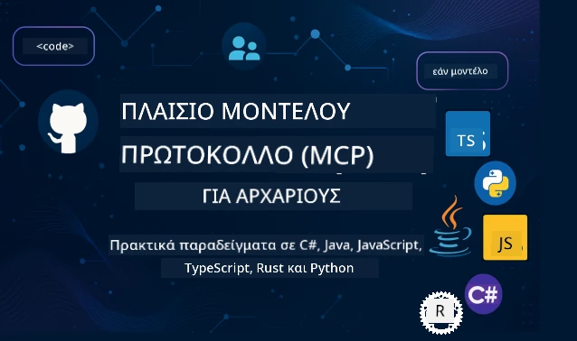

 

[](https://GitHub.com/microsoft/mcp-for-beginners/graphs/contributors)
[](https://GitHub.com/microsoft/mcp-for-beginners/issues)
[](https://GitHub.com/microsoft/mcp-for-beginners/pulls)
[](http://makeapullrequest.com)

[](https://GitHub.com/microsoft/mcp-for-beginners/watchers)
[](https://GitHub.com/microsoft/mcp-for-beginners/fork)
[](https://GitHub.com/microsoft/mcp-for-beginners/stargazers)


[](https://discord.gg/nTYy5BXMWG)

Ακολουθήστε αυτά τα βήματα για να ξεκινήσετε να χρησιμοποιείτε αυτούς τους πόρους:
1. **Κλωνοποίηση του Αποθετηρίου**: Κάντε κλικ στο [](https://GitHub.com/microsoft/mcp-for-beginners/fork)
2. **Αντιγραφή του Αποθετηρίου**:   `git clone https://github.com/microsoft/mcp-for-beginners.git`
3. **Εγγραφή στο** [](https://discord.gg/nTYy5BXMWG)


### 🌐 Υποστήριξη Πολλών Γλωσσών

#### Υποστηρίζεται μέσω GitHub Action (Αυτοματοποιημένο & Πάντα Ενημερωμένο)

<!-- CO-OP TRANSLATOR LANGUAGES TABLE START -->
[Arabic](../ar/README.md) | [Bengali](../bn/README.md) | [Bulgarian](../bg/README.md) | [Burmese (Myanmar)](../my/README.md) | [Chinese (Simplified)](../zh-CN/README.md) | [Chinese (Traditional, Hong Kong)](../zh-HK/README.md) | [Chinese (Traditional, Macau)](../zh-MO/README.md) | [Chinese (Traditional, Taiwan)](../zh-TW/README.md) | [Croatian](../hr/README.md) | [Czech](../cs/README.md) | [Danish](../da/README.md) | [Dutch](../nl/README.md) | [Estonian](../et/README.md) | [Finnish](../fi/README.md) | [French](../fr/README.md) | [German](../de/README.md) | [Greek](./README.md) | [Hebrew](../he/README.md) | [Hindi](../hi/README.md) | [Hungarian](../hu/README.md) | [Indonesian](../id/README.md) | [Italian](../it/README.md) | [Japanese](../ja/README.md) | [Kannada](../kn/README.md) | [Korean](../ko/README.md) | [Lithuanian](../lt/README.md) | [Malay](../ms/README.md) | [Malayalam](../ml/README.md) | [Marathi](../mr/README.md) | [Nepali](../ne/README.md) | [Nigerian Pidgin](../pcm/README.md) | [Norwegian](../no/README.md) | [Persian (Farsi)](../fa/README.md) | [Polish](../pl/README.md) | [Portuguese (Brazil)](../pt-BR/README.md) | [Portuguese (Portugal)](../pt-PT/README.md) | [Punjabi (Gurmukhi)](../pa/README.md) | [Romanian](../ro/README.md) | [Russian](../ru/README.md) | [Serbian (Cyrillic)](../sr/README.md) | [Slovak](../sk/README.md) | [Slovenian](../sl/README.md) | [Spanish](../es/README.md) | [Swahili](../sw/README.md) | [Swedish](../sv/README.md) | [Tagalog (Filipino)](../tl/README.md) | [Tamil](../ta/README.md) | [Telugu](../te/README.md) | [Thai](../th/README.md) | [Turkish](../tr/README.md) | [Ukrainian](../uk/README.md) | [Urdu](../ur/README.md) | [Vietnamese](../vi/README.md)

> **Προτιμάτε να κλωνοποιήσετε τοπικά;**
>
> Αυτό το αποθετήριο περιλαμβάνει μεταφράσεις σε 50+ γλώσσες, γεγονός που αυξάνει σημαντικά το μέγεθος λήψης. Για να κλωνοποιήσετε χωρίς μεταφράσεις, χρησιμοποιήστε το sparse checkout:
>
> **Bash / macOS / Linux:**
> ```bash
> git clone --filter=blob:none --sparse https://github.com/microsoft/mcp-for-beginners.git
> cd mcp-for-beginners
> git sparse-checkout set --no-cone '/*' '!translations' '!translated_images'
> ```
>
> **CMD (Windows):**
> ```cmd
> git clone --filter=blob:none --sparse https://github.com/microsoft/mcp-for-beginners.git
> cd mcp-for-beginners
> git sparse-checkout set --no-cone "/*" "!translations" "!translated_images"
> ```
>
> Αυτό σας παρέχει όλα όσα χρειάζεστε για να ολοκληρώσετε το μάθημα με πολύ ταχύτερη λήψη.
<!-- CO-OP TRANSLATOR LANGUAGES TABLE END -->

# 🚀 Εκπαιδευτικό Πρόγραμμα του Model Context Protocol (MCP) για Αρχάριους

## **Μάθετε MCP με Πρακτικά Παραδείγματα Κώδικα σε C#, Java, JavaScript, Rust, Python, και TypeScript**

## 🧠 Επισκόπηση του Εκπαιδευτικού Προγράμματος του Model Context Protocol
Καλώς ήρθατε στο ταξίδι σας στο Model Context Protocol! Αν έχετε ποτέ αναρωτηθεί πώς οι εφαρμογές AI επικοινωνούν με διαφορετικά εργαλεία και υπηρεσίες, πρόκειται να ανακαλύψετε τη γοητευτική λύση που μετασχηματίζει τον τρόπο με τον οποίο οι προγραμματιστές δημιουργούν έξυπνα συστήματα.

Σκεφτείτε το MCP ως έναν καθολικό μεταφραστή για εφαρμογές AI - όπως οι θύρες USB που επιτρέπουν τη σύνδεση οποιασδήποτε συσκευής στον υπολογιστή σας, έτσι το MCP επιτρέπει στα μοντέλα AI να συνδέονται με οποιοδήποτε εργαλείο ή υπηρεσία με τυποποιημένο τρόπο. Είτε φτιάχνετε το πρώτο σας chatbot είτε εργάζεστε σε πολύπλοκες ροές εργασίας AI, η κατανόηση του MCP θα σας δώσει τη δύναμη να δημιουργήσετε πιο ικανές και ευέλικτες εφαρμογές.

Αυτό το εκπαιδευτικό πρόγραμμα είναι σχεδιασμένο με υπομονή και φροντίδα για το ταξίδι μάθησής σας. Θα ξεκινήσουμε με απλές έννοιες που ήδη καταλαβαίνετε και σταδιακά θα οικοδομήσουμε την εμπειρογνωμοσύνη σας μέσα από πρακτική εξάσκηση στην αγαπημένη σας γλώσσα προγραμματισμού. Κάθε βήμα περιλαμβάνει σαφείς εξηγήσεις, πρακτικά παραδείγματα και άφθονη ενθάρρυνση καθ’ οδόν.

Με το τέλος αυτού του ταξιδιού, θα έχετε την αυτοπεποίθηση να φτιάξετε τους δικούς σας MCP servers, να τους ενσωματώσετε με δημοφιλείς πλατφόρμες AI και να κατανοήσετε πώς αυτή η τεχνολογία αναδιαμορφώνει το μέλλον της ανάπτυξης AI. Ας ξεκινήσουμε αυτή την συναρπαστική περιπέτεια μαζί!

### Επίσημη Τεκμηρίωση και Προδιαγραφές

Αυτό το πρόγραμμα ευθυγραμμίζεται με το **MCP Specification 2025-11-25** (την πιο πρόσφατη σταθερή έκδοση). Η προδιαγραφή MCP χρησιμοποιεί εκδόσεις βάσει ημερομηνίας (μορφή YYYY-MM-DD) για να διασφαλίσει σαφή παρακολούθηση της έκδοσης του πρωτοκόλλου.

Αυτοί οι πόροι γίνονται πιο πολύτιμοι καθώς η κατανόησή σας μεγαλώνει, αλλά μην νιώθετε πίεση να διαβάσετε τα πάντα αμέσως. Ξεκινήστε με τους τομείς που σας ενδιαφέρουν περισσότερο!
- 📘 [Τεκμηρίωση MCP](https://modelcontextprotocol.io/) – Αυτός είναι ο βασικός σας πόρος για βήμα προς βήμα οδηγούς και οδηγίες χρήσης. Η τεκμηρίωση είναι γραμμένη με γνώμονα τους αρχάριους, παρέχοντας ξεκάθαρα παραδείγματα που μπορείτε να ακολουθήσετε με τον δικό σας ρυθμό.
- 📜 [Προδιαγραφή MCP](https://modelcontextprotocol.io/specification/2025-11-25) – Σκεφτείτε το ως το ολοκληρωμένο σας εγχειρίδιο αναφοράς. Καθώς προχωράτε στο πρόγραμμα, θα βρεθείτε να επιστρέφετε εδώ για να δείτε συγκεκριμένες λεπτομέρειες και να εξερευνήσετε προηγμένες λειτουργίες.
- 📜 [Έκδοση Προδιαγραφής MCP](https://modelcontextprotocol.io/specification/versioning) – Περιέχει πληροφορίες σχετικά με το ιστορικό εκδόσεων του πρωτοκόλλου και το πώς το MCP χρησιμοποιεί εκδόσεις βάσει ημερομηνίας (μορφή YYYY-MM-DD).
- 🧑‍💻 [MCP GitHub Αποθετήριο](https://github.com/modelcontextprotocol) – Εδώ θα βρείτε SDK, εργαλεία και παραδείγματα κώδικα σε πολλές γλώσσες προγραμματισμού. Είναι σαν ένα θησαυροφυλάκιο πρακτικών παραδειγμάτων και έτοιμων προς χρήση συστατικών.
- 🌐 [Κοινότητα MCP](https://github.com/orgs/modelcontextprotocol/discussions) – Ενταχθείτε με άλλους μαθητές και έμπειρους προγραμματιστές σε συζητήσεις για το MCP. Είναι μια υποστηρικτική κοινότητα όπου οι ερωτήσεις είναι ευπρόσδεκτες και η γνώση μοιράζεται ελεύθερα.
  
## Στόχοι Μάθησης

Στο τέλος αυτού του προγράμματος, θα νιώθετε σίγουροι και ενθουσιασμένοι με τις νέες σας ικανότητες. Να τι θα επιτύχετε:

• **Κατανόηση των βασικών του MCP**: Θα καταλάβετε τι είναι το Model Context Protocol και γιατί επαναστατικοποιεί τον τρόπο που οι εφαρμογές AI συνεργάζονται, χρησιμοποιώντας αναλογίες και παραδείγματα που έχουν νόημα.

• **Κατασκευή του πρώτου σας MCP server**: Θα δημιουργήσετε έναν λειτουργικό MCP server στη γλώσσα προγραμματισμού που προτιμάτε, ξεκινώντας με απλά παραδείγματα και αναπτύσσοντας τις δεξιότητές σας βήμα προς βήμα.

• **Σύνδεση μοντέλων AI με πραγματικά εργαλεία**: Θα μάθετε πώς να γεφυρώσετε το χάσμα μεταξύ των μοντέλων AI και των πραγματικών υπηρεσιών, δίνοντας στις εφαρμογές σας νέες ισχυρές δυνατότητες.

• **Εφαρμογή βέλτιστων πρακτικών ασφαλείας**: Θα κατανοήσετε πώς να διατηρείτε τις υλοποιήσεις MCP ασφαλείς, προστατεύοντας τόσο τις εφαρμογές σας όσο και τους χρήστες σας.

• **Ανάπτυξη με αυτοπεποίθηση**: Θα ξέρετε πώς να μεταφέρετε τα έργα MCP από την ανάπτυξη στην παραγωγή, με πρακτικές στρατηγικές ανάπτυξης που λειτουργούν στον πραγματικό κόσμο.

• **Ενταχθείτε στην κοινότητα MCP**: Θα γίνετε μέλος μιας αναπτυσσόμενης κοινότητας προγραμματιστών που διαμορφώνουν το μέλλον της ανάπτυξης εφαρμογών AI.

## Θεμελιώδες Υπόβαθρο

Πριν βουτήξουμε σε συγκεκριμένα του MCP, ας βεβαιωθούμε ότι νιώθετε άνετα με κάποιες βασικές έννοιες. Μην ανησυχείτε αν δεν είστε ειδικός σε αυτούς τους τομείς - θα εξηγήσουμε ό,τι χρειάζεται καθώς προχωράμε!

### Κατανόηση Πρωτοκόλλων (Το Θεμέλιο)

Σκεφτείτε ένα πρωτόκολλο σαν τους κανόνες μιας συνομιλίας. Όταν καλείτε έναν φίλο, και οι δύο ξέρετε να λέτε "γεια" όταν απαντάτε, να μιλάτε με τη σειρά και να λέτε "αντίο" όταν τελειώνετε. Τα προγράμματα υπολογιστών χρειάζονται παρόμοιους κανόνες για να επικοινωνούν αποτελεσματικά.

Το MCP είναι ένα πρωτόκολλο - ένα σύνολο συμφωνημένων κανόνων που βοηθούν τα μοντέλα AI και τις εφαρμογές να έχουν παραγωγικές "συνομιλίες" με εργαλεία και υπηρεσίες. Ακριβώς όπως οι κανόνες της συνομιλίας κάνουν την ανθρώπινη επικοινωνία πιο ομαλή, έτσι και το MCP καθιστά την επικοινωνία των εφαρμογών AI πολύ πιο αξιόπιστη και ισχυρή.

### Σχέσεις Πελάτη-Εξυπηρετητή (Πώς λειτουργούν τα Προγράμματα μαζί)

Χρησιμοποιείτε ήδη καθημερινά τις σχέσεις πελάτη-εξυπηρετητή! Όταν χρησιμοποιείτε έναν φυλλομετρητή (πελάτης) για να επισκεφτείτε μια ιστοσελίδα, συνδέεστε με έναν web server που σας στέλνει το περιεχόμενο της σελίδας. Ο φυλλομετρητής ξέρει πώς να ζητήσει πληροφορίες και ο εξυπηρετητής ξέρει πώς να απαντήσει.

Στο MCP έχουμε μια παρόμοια σχέση: τα μοντέλα AI λειτουργούν ως πελάτες που ζητούν πληροφορίες ή ενέργειες, ενώ οι MCP servers παρέχουν αυτές τις δυνατότητες. Είναι σαν να έχετε έναν βοηθό (τον εξυπηρετητή) που το AI μπορεί να ζητήσει να εκτελέσει συγκεκριμένες εργασίες.

### Γιατί έχει σημασία η Τυποποίηση (Κάνοντας τα Πράγματα να Συνεργάζονται)

Φανταστείτε αν κάθε κατασκευαστής αυτοκινήτων χρησιμοποιούσε διαφορετικά σχήματα αντλιών βενζίνης - θα χρειαζόσασταν διαφορετικό αντάπτορα για κάθε αυτοκίνητο! Η τυποποίηση σημαίνει συμφωνία σε κοινές προσεγγίσεις ώστε τα πράγματα να λειτουργούν αρμονικά.

Το MCP παρέχει αυτήν την τυποποίηση για τις εφαρμογές AI. Αντί κάθε μοντέλο AI να χρειάζεται ειδικό κώδικα για να λειτουργήσει με κάθε εργαλείο, το MCP δημιουργεί έναν καθολικό τρόπο επικοινωνίας. Αυτό σημαίνει ότι οι προγραμματιστές μπορούν να φτιάχνουν εργαλεία μια φορά και να λειτουργούν με πολλά διαφορετικά συστήματα AI.

## 🧭 Επισκόπηση της Διαδρομής Μάθησης σας

Το ταξίδι MCP είναι προσεκτικά δομημένο για να αναπτύξει την αυτοπεποίθηση και τις δεξιότητές σας σταδιακά. Κάθε φάση εισάγει νέες έννοιες ενώ ενισχύει όσα έχετε ήδη μάθει.

### 🌱 Φάση Θεμελίωσης: Κατανόηση των Βασικών (Μάθηματα 0-2)

Εδώ ξεκινάει η περιπέτειά σας! Θα σας εισαγάγουμε στις έννοιες MCP με γνώριμες αναλογίες και απλά παραδείγματα. Θα καταλάβετε τι είναι το MCP, γιατί υπάρχει και πώς ταιριάζει στον ευρύτερο κόσμο της ανάπτυξης AI.

• **Μάθημα 0 - Εισαγωγή στο MCP**: Θα ξεκινήσουμε εξερευνώντας τι είναι το MCP και γιατί είναι τόσο σημαντικό για τις σύγχρονες εφαρμογές AI. Θα δείτε πραγματικά παραδείγματα MCP σε δράση και θα κατανοήσετε πώς λύνει κοινά προβλήματα που αντιμετωπίζουν οι προγραμματιστές.

• **Μάθημα 1 - Εξηγήσεις Βασικών Εννοιών**: Εδώ θα μάθετε τα ουσιώδη δομικά στοιχεία του MCP. Θα χρησιμοποιήσουμε πολλές αναλογίες και οπτικά παραδείγματα για να εξασφαλίσουμε ότι αυτές οι έννοιες γίνονται φυσικές και κατανοητές.

• **Μάθημα 2 - Ασφάλεια στο MCP**: Η ασφάλεια μπορεί να φαίνεται τρομακτική, αλλά θα σας δείξουμε πώς το MCP περιλαμβάνει ενσωματωμένα χαρακτηριστικά ασφαλείας και θα μάθετε βέλτιστες πρακτικές που προστατεύουν τις εφαρμογές σας από την αρχή.

### 🔨 Φάση Κατασκευής: Δημιουργία των Πρώτων Υλοποιήσεών σας (Μάθημα 3)

Τώρα ξεκινά η πραγματική διασκέδαση! Θα αποκτήσετε πρακτική εμπειρία στην κατασκευή πραγματικών MCP servers και clients. Μην ανησυχείτε - θα ξεκινήσουμε απλά και θα σας καθοδηγήσουμε σε κάθε βήμα.
Αυτό το μάθημα περιλαμβάνει πολλούς πρακτικούς οδηγούς που σας επιτρέπουν να εξασκηθείτε στη γλώσσα προγραμματισμού που προτιμάτε. Θα δημιουργήσετε το πρώτο σας διακομιστή, θα χτίσετε έναν πελάτη για να συνδεθεί μαζί του και ακόμη και θα ενσωματώσετε δημοφιλή εργαλεία ανάπτυξης όπως το VS Code.

Κάθε οδηγός περιλαμβάνει πλήρη παραδείγματα κώδικα, συμβουλές αντιμετώπισης προβλημάτων και εξηγήσεις για το γιατί κάνουμε συγκεκριμένες σχεδιαστικές επιλογές. Μέχρι το τέλος αυτού του σταδίου, θα έχετε λειτουργικές υλοποιήσεις MCP για τις οποίες μπορείτε να είστε περήφανοι!

### 🚀 Στάδιο Ανάπτυξης: Προχωρημένες Έννοιες και Πρακτική Εφαρμογή (Μονάδες 4-5)

Αφού κατακτήσετε τα βασικά, είστε έτοιμοι να εξερευνήσετε πιο εξελιγμένα χαρακτηριστικά του MCP. Θα καλύψουμε πρακτικές στρατηγικές υλοποίησης, τεχνικές αποσφαλμάτωσης και προχωρημένα θέματα όπως η ενσωμάτωση πολυτροπικής τεχνητής νοημοσύνης.

Επίσης, θα μάθετε πώς να κλιμακώνετε τις υλοποιήσεις MCP για χρήση σε παραγωγικό περιβάλλον και να ενσωματώνεστε με πλατφόρμες cloud όπως το Azure. Αυτές οι μονάδες σας προετοιμάζουν να δημιουργήσετε λύσεις MCP που μπορούν να ανταποκριθούν σε πραγματικές απαιτήσεις.

### 🌟 Στάδιο Επάρκειας: Κοινότητα και Εξειδίκευση (Μονάδες 6-11)

Το τελικό στάδιο εστιάζει στην ένταξή σας στην κοινότητα MCP και στην εξειδίκευση σε τομείς που σας ενδιαφέρουν περισσότερο. Θα μάθετε πώς να συμβάλλετε σε ανοικτού κώδικα έργα MCP, να υλοποιείτε προχωρημένα πρότυπα αυθεντικοποίησης και να δημιουργείτε ολοκληρωμένες λύσεις με ενσωμάτωση βάσεων δεδομένων.

Η Μονάδα 11 αξίζει ιδιαίτερη μνεία - είναι ένα πλήρες μονοπάτι μάθησης με 13 εργαστήρια που σας διδάσκει πώς να δημιουργείτε MCP servers έτοιμους για παραγωγή με ενσωμάτωση PostgreSQL. Είναι σαν ένα τελικό έργο που συνδυάζει όλα όσα έχετε μάθει!

### 📚 Πλήρης Δομή Προγράμματος Σπουδών

| Μονάδα | Θέμα | Περιγραφή | Σύνδεσμος |
|--------|-------|-------------|------|
| **Μονάδες 0-3: Βασικά** | | | |
| 00 | Εισαγωγή στο MCP | Επισκόπηση του Πρωτοκόλλου Πλαισίου Μοντέλου και της σημασίας του στα pipelines ΤΝ | [Διαβάστε περισσότερα](./00-Introduction/README.md) |
| 01 | Εξηγήσεις Βασικών Εννοιών | Βαθιά εξερεύνηση βασικών εννοιών MCP | [Διαβάστε περισσότερα](./01-CoreConcepts/README.md) |
| 02 | Ασφάλεια στο MCP | Απειλές ασφάλειας και βέλτιστες πρακτικές | [Διαβάστε περισσότερα](./02-Security/README.md) |
| 03 | Ξεκινώντας με MCP | Ρύθμιση περιβάλλοντος, βασικοί διακομιστές/πελάτες, ενσωμάτωση | [Διαβάστε περισσότερα](./03-GettingStarted/README.md) |
| **Μονάδα 3: Δημιουργία του Πρώτου σας Διακομιστή & Πελάτη** | | | |
| 3.1 | Πρώτος Διακομιστής | Δημιουργήστε τον πρώτο σας MCP διακομιστή | [Οδηγός](./03-GettingStarted/01-first-server/README.md) |
| 3.2 | Πρώτος Πελάτης | Αναπτύξτε έναν βασικό MCP πελάτη | [Οδηγός](./03-GettingStarted/02-client/README.md) |
| 3.3 | Πελάτης με LLM | Ενσωματώστε μεγάλα μοντέλα γλώσσας | [Οδηγός](./03-GettingStarted/03-llm-client/README.md) |
| 3.4 | Ενσωμάτωση VS Code | Χρησιμοποιήστε MCP διακομιστές στο VS Code | [Οδηγός](./03-GettingStarted/04-vscode/README.md) |
| 3.5 | Διακομιστής stdio | Δημιουργήστε διακομιστές με μεταφορά stdio | [Οδηγός](./03-GettingStarted/05-stdio-server/README.md) |
| 3.6 | Ροή HTTP | Υλοποιήστε streaming HTTP στο MCP | [Οδηγός](./03-GettingStarted/06-http-streaming/README.md) |
| 3.7 | AI Toolkit | Χρησιμοποιήστε το AI Toolkit με MCP | [Οδηγός](./03-GettingStarted/07-aitk/README.md) |
| 3.8 | Δοκιμές | Δοκιμάστε την υλοποίηση του MCP διακομιστή σας | [Οδηγός](./03-GettingStarted/08-testing/README.md) |
| 3.9 | Ανάπτυξη | Ανάπτυξη MCP διακομιστών σε παραγωγικό περιβάλλον | [Οδηγός](./03-GettingStarted/09-deployment/README.md) |
| 3.10 | Προχωρημένη χρήση διακομιστή | Χρησιμοποιήστε προχωρημένους διακομιστές για προχωρημένη χρήση χαρακτηριστικών και βελτιωμένη αρχιτεκτονική | [Οδηγός](./03-GettingStarted/10-advanced/README.md) |
| 3.11 | Απλή αυθεντικοποίηση | Κεφάλαιο που σας δείχνει αυθεντικοποίηση από την αρχή και RBAC | [Οδηγός](./03-GettingStarted/11-simple-auth/README.md) |
| 3.12 | Φιλοξενία MCP | Ρύθμιση Claude Desktop, Cursor, Cline και άλλων MCP hosts | [Οδηγός](./03-GettingStarted/12-mcp-hosts/README.md) |
| 3.13 | Εργαλείο Επίβλεψης MCP | Αποσφαλμάτωση και δοκιμή MCP διακομιστών με το εργαλείο Inspector | [Οδηγός](./03-GettingStarted/13-mcp-inspector/README.md) |
| **Μονάδες 4-5: Πρακτικά & Προχωρημένα** | | | |
| 04 | Πρακτική Υλοποίηση | SDKs, αποσφαλμάτωση, δοκιμές, επαναχρησιμοποιήσιμα πρότυπα prompts | [Διαβάστε περισσότερα](./04-PracticalImplementation/README.md) |
| 4.1 | Σελιδοποίηση | Διαχείριση μεγάλων συνόλων αποτελεσμάτων με σελιδοποίηση βασισμένη σε cursor | [Οδηγός](./04-PracticalImplementation/pagination/README.md) |
| 05 | Προχωρημένα Θέματα στο MCP | Πολυτροπική ΤΝ, κλιμάκωση, επιχειρηματική χρήση | [Διαβάστε περισσότερα](./05-AdvancedTopics/README.md) |
| 5.1 | Ενσωμάτωση Azure | Ενσωμάτωση MCP με Azure | [Οδηγός](./05-AdvancedTopics/mcp-integration/README.md) |
| 5.2 | Πολυτροπικότητα | Εργασία με πολλαπλές μορφές | [Οδηγός](./05-AdvancedTopics/mcp-multi-modality/README.md) |
| 5.3 | Demo OAuth2 | Υλοποίηση αυθεντικοποίησης OAuth2 | [Οδηγός](./05-AdvancedTopics/mcp-oauth2-demo/README.md) |
| 5.4 | Ρίζες Πλαισίων | Κατανόηση και υλοποίηση ριζών πλαισίων | [Οδηγός](./05-AdvancedTopics/mcp-root-contexts/README.md) |
| 5.5 | Κατευθυντήριες Γραμμές MCP | Στρατηγικές δρομολόγησης MCP | [Οδηγός](./05-AdvancedTopics/mcp-routing/README.md) |
| 5.6 | Δειγματοληψία | Τεχνικές δειγματοληψίας στο MCP | [Οδηγός](./05-AdvancedTopics/mcp-sampling/README.md) |
| 5.7 | Κλιμάκωση | Κλιμάκωση υλοποιήσεων MCP | [Οδηγός](./05-AdvancedTopics/mcp-scaling/README.md) |
| 5.8 | Ασφάλεια | Προχωρημένες θεωρήσεις ασφάλειας | [Οδηγός](./05-AdvancedTopics/mcp-security/README.md) |
| 5.9 | Αναζήτηση Web | Υλοποίηση δυνατοτήτων αναζήτησης στο web | [Οδηγός](./05-AdvancedTopics/web-search-mcp/README.md) |
| 5.10 | Ροή σε Πραγματικό Χρόνο | Δημιουργία λειτουργικότητας ροής σε πραγματικό χρόνο | [Οδηγός](./05-AdvancedTopics/mcp-realtimestreaming/README.md) |
| 5.11 | Αναζήτηση σε Πραγματικό Χρόνο | Υλοποίηση αναζήτησης σε πραγματικό χρόνο | [Οδηγός](./05-AdvancedTopics/mcp-realtimesearch/README.md) |
| 5.12 | Αυθεντικοποίηση Entra ID | Αυθεντικοποίηση με Microsoft Entra ID | [Οδηγός](./05-AdvancedTopics/mcp-security-entra/README.md) |
| 5.13 | Ενσωμάτωση Foundry | Ενσωμάτωση με Azure AI Foundry | [Οδηγός](./05-AdvancedTopics/mcp-foundry-agent-integration/README.md) |
| 5.14 | Μηχανική Πλαισίων | Τεχνικές αποτελεσματικής μηχανικής πλαισίων | [Οδηγός](./05-AdvancedTopics/mcp-contextengineering/README.md) |
| 5.15 | Προσαρμοσμένη Μεταφορά MCP | Υλοποιήσεις προσαρμοσμένης μεταφοράς | [Οδηγός](./05-AdvancedTopics/mcp-transport/README.md) |
| 5.16 | Χαρακτηριστικά Πρωτοκόλλου | Ειδοποιήσεις προόδου, ακύρωση, πρότυπα πόρων | [Οδηγός](./05-AdvancedTopics/mcp-protocol-features/README.md) |
| **Μονάδες 6-10: Κοινότητα & Καλύτερες Πρακτικές** | | | |
| 06 | Συμβολές στην Κοινότητα | Πώς να συνεισφέρετε στο οικοσύστημα MCP | [Οδηγός](./06-CommunityContributions/README.md) |
| 07 | Μαθήματα από Πρώιμη Υιοθέτηση | Ιστορίες υλοποίησης σε πραγματικές συνθήκες | [Οδηγός](./07-LessonsfromEarlyAdoption/README.md) |
| 08 | Καλύτερες Πρακτικές για MCP | Απόδοση, ανθεκτικότητα σφαλμάτων, αξιοπιστία | [Οδηγός](./08-BestPractices/README.md) |
| 09 | Μελέτες Περίπτωσης MCP | Παραδείγματα πρακτικής υλοποίησης | [Οδηγός](./09-CaseStudy/README.md) |
| 10 | Πρακτικό Εργαστήριο | Δημιουργία MCP διακομιστή με AI Toolkit | [Εργαστήριο](./10-StreamliningAIWorkflowsBuildingAnMCPServerWithAIToolkit/README.md) |
| **Μονάδα 11: Πρακτικό Εργαστήριο MCP Διακομιστή** | | | |
| 11 | Ενσωμάτωση Βάσης Δεδομένων MCP Διακομιστή | Πλήρες μονοπάτι μάθησης με 13 εργαστήρια για ενσωμάτωση PostgreSQL | [Εργαστήρια](./11-MCPServerHandsOnLabs/README.md) |
| 11.1 | Εισαγωγή | Επισκόπηση MCP με ενσωμάτωση βάσης δεδομένων και χρήση ανάλυσης λιανικής | [Εργαστήριο 00](./11-MCPServerHandsOnLabs/00-Introduction/README.md) |
| 11.2 | Βασική Αρχιτεκτονική | Κατανόηση αρχιτεκτονικής διακομιστή MCP, στρώματα βάσης δεδομένων και πρότυπα ασφάλειας | [Εργαστήριο 01](./11-MCPServerHandsOnLabs/01-Architecture/README.md) |
| 11.3 | Ασφάλεια & Πολυενοικίαση | Ασφάλεια σε επίπεδο γραμμής, αυθεντικοποίηση και πρόσβαση δεδομένων πολλαπλών ενοικιαστών | [Εργαστήριο 02](./11-MCPServerHandsOnLabs/02-Security/README.md) |
| 11.4 | Ρύθμιση Περιβάλλοντος | Ρύθμιση περιβάλλοντος ανάπτυξης, Docker, πόροι Azure | [Εργαστήριο 03](./11-MCPServerHandsOnLabs/03-Setup/README.md) |
| 11.5 | Σχεδιασμός Βάσης Δεδομένων | Ρύθμιση PostgreSQL, σχεδιασμός σχήματος λιανικής και δείγμα δεδομένων | [Εργαστήριο 04](./11-MCPServerHandsOnLabs/04-Database/README.md) |
| 11.6 | Υλοποίηση MCP Διακομιστή | Δημιουργία FastMCP διακομιστή με ενσωμάτωση βάσης δεδομένων | [Εργαστήριο 05](./11-MCPServerHandsOnLabs/05-MCP-Server/README.md) |
| 11.7 | Ανάπτυξη Εργαλείων | Δημιουργία εργαλείων ερωτήσεων βάσης δεδομένων και εσωτερικής επισκόπησης σχήματος | [Εργαστήριο 06](./11-MCPServerHandsOnLabs/06-Tools/README.md) |
| 11.8 | Σημασιολογική Αναζήτηση | Υλοποίηση ενσωματώσεων διανυσμάτων με Azure OpenAI και pgvector | [Εργαστήριο 07](./11-MCPServerHandsOnLabs/07-Semantic-Search/README.md) |
| 11.9 | Δοκιμές & Αποσφαλμάτωση | Στρατηγικές δοκιμών, εργαλεία αποσφαλμάτωσης και μέθοδοι επικύρωσης | [Εργαστήριο 08](./11-MCPServerHandsOnLabs/08-Testing/README.md) |
| 11.10 | Ενσωμάτωση VS Code | Ρύθμιση ενσωμάτωσης MCP στο VS Code και χρήση AI Chat | [Εργαστήριο 09](./11-MCPServerHandsOnLabs/09-VS-Code/README.md) |
| 11.11 | Στρατηγικές Ανάπτυξης | Ανάπτυξη με Docker, Azure Container Apps και θέματα κλιμάκωσης | [Εργαστήριο 10](./11-MCPServerHandsOnLabs/10-Deployment/README.md) |
| 11.12 | Παρακολούθηση | Application Insights, καταγραφή, παρακολούθηση απόδοσης | [Εργαστήριο 11](./11-MCPServerHandsOnLabs/11-Monitoring/README.md) |
| 11.13 | Καλύτερες Πρακτικές | Βελτιστοποίηση απόδοσης, ενίσχυση ασφάλειας και συμβουλές παραγωγής | [Εργαστήριο 12](./11-MCPServerHandsOnLabs/12-Best-Practices/README.md) |

### 💻 Παραδείγματα Κώδικα

Ένα από τα πιο συναρπαστικά μέρη της εκμάθησης MCP είναι να βλέπετε τις δεξιότητές σας στον κώδικα να εξελίσσονται προοδευτικά. Έχουμε σχεδιάσει τα παραδείγματα κώδικάς μας να ξεκινούν απλά και να γίνονται πιο σύνθετα καθώς εμβαθύνετε στην κατανόηση. Δείτε πώς εισάγουμε έννοιες — με κώδικα που είναι εύκολος στην κατανόηση αλλά επιδεικνύει πραγματικές αρχές MCP, θα καταλάβετε όχι μόνο τι κάνει αυτός ο κώδικας, αλλά γιατί είναι δομημένος έτσι και πώς ταιριάζει σε μεγαλύτερες εφαρμογές MCP.

#### Βασικά Παραδείγματα Υπολογιστή MCP

| Γλώσσα | Περιγραφή | Σύνδεσμος |
|----------|-------------|------|
| C# | Παράδειγμα MCP διακομιστή | [Δείτε Κώδικα](./03-GettingStarted/samples/csharp/README.md) |
| Java | Υπολογιστής MCP | [Δείτε Κώδικα](./03-GettingStarted/samples/java/calculator/README.md) |
| JavaScript | Επιταγή MCP | [Δείτε Κώδικα](./03-GettingStarted/samples/javascript/README.md) |
| Python | MCP διακομιστής | [Δείτε Κώδικα](../../03-GettingStarted/samples/python/mcp_calculator_server.py) |
| TypeScript | Παράδειγμα MCP | [Δείτε Κώδικα](./03-GettingStarted/samples/typescript/README.md) |
| Rust | Παράδειγμα MCP | [Δείτε Κώδικα](./03-GettingStarted/samples/rust/README.md) |

#### Προχωρημένες Υλοποιήσεις MCP

| Γλώσσα | Περιγραφή | Σύνδεσμος |
|----------|-------------|------|
| C# | Προχωρημένο Παράδειγμα | [Δείτε Κώδικα](./04-PracticalImplementation/samples/csharp/README.md) |
| Java με Spring | Παράδειγμα Container App | [Δείτε Κώδικα](./04-PracticalImplementation/samples/java/containerapp/README.md) |
| JavaScript | Προχωρημένο Παράδειγμα | [Δείτε Κώδικα](./04-PracticalImplementation/samples/javascript/README.md) |
| Python | Σύνθετη Υλοποίηση | [Δείτε Κώδικα](./04-PracticalImplementation/samples/python/README.md) |
| TypeScript | Παράδειγμα Container | [Δείτε Κώδικα](./04-PracticalImplementation/samples/typescript/README.md) |


## 🎯 Προαπαιτούμενα για την Εκμάθηση MCP

Για να αξιοποιήσετε στο έπακρο αυτό το πρόγραμμα σπουδών, θα πρέπει να διαθέτετε:

- Βασικές γνώσεις προγραμματισμού σε τουλάχιστον μία από τις ακόλουθες γλώσσες: C#, Java, JavaScript, Python ή TypeScript
- Κατανόηση του μοντέλου πελάτη-διακομιστή και των APIs
- Εξοικείωση με τις έννοιες REST και HTTP
- (Προαιρετικό) Υπόβαθρο σε έννοιες ΤΝ/ΜΜ

- Συμμετοχή στις συζητήσεις της κοινότητάς μας για υποστήριξη

## 📚 Οδηγός Μελέτης & Πόροι

Αυτό το αποθετήριο περιλαμβάνει αρκετούς πόρους που θα σας βοηθήσουν να πλοηγηθείτε και να μάθετε αποτελεσματικά:

### Οδηγός Μελέτης
Ένας ολοκληρωμένος [Οδηγός Μελέτης](./study_guide.md) είναι διαθέσιμος για να σας βοηθήσει να πλοηγηθείτε αποτελεσματικά σε αυτό το αποθετήριο. Αυτός ο οπτικός χάρτης προγράμματος σπουδών δείχνει πώς συνδέονται όλα τα θέματα και παρέχει καθοδήγηση για το πώς να χρησιμοποιήσετε αποτελεσματικά τα δείγματα έργων. Είναι ιδιαίτερα χρήσιμος αν είστε οπτικός μαθητής που θέλει να δει τη συνολική εικόνα.

Ο οδηγός περιλαμβάνει:  
- Οπτικό χάρτη προγράμματος σπουδών που δείχνει όλα τα καλυπτόμενα θέματα  
- Λεπτομερή ανάλυση κάθε ενότητας του αποθετηρίου  
- Καθοδήγηση για το πώς να χρησιμοποιήσετε τα δείγματα έργων  
- Προτεινόμενες διαδρομές μάθησης για διαφορετικά επίπεδα δεξιοτήτων  
- Πρόσθετους πόρους για να συμπληρώσετε το ταξίδι μάθησής σας

### Αρχείο Αλλαγών

Διατηρούμε ένα λεπτομερές [Αρχείο Αλλαγών](./changelog.md) που παρακολουθεί όλες τις σημαντικές ενημερώσεις στα υλικά του προγράμματος σπουδών, ώστε να είστε ενημερωμένοι για τις τελευταίες βελτιώσεις και προσθήκες.  
- Νέες προσθήκες περιεχομένου  
- Δομικές αλλαγές  
- Βελτιώσεις χαρακτηριστικών  
- Ενημερώσεις τεκμηρίωσης

## 🛠️ Πώς να Χρησιμοποιήσετε Αποτελεσματικά Αυτό το Πρόγραμμα Σπουδών

Κάθε μάθημα σε αυτόν τον οδηγό περιλαμβάνει:

1. Σαφείς εξηγήσεις των εννοιών MCP  
2. Παραδείγματα κώδικα σε πολλαπλές γλώσσες  
3. Ασκήσεις για να δημιουργήσετε πραγματικές εφαρμογές MCP  
4. Επιπλέον πόρους για προχωρημένους μαθητές

### Ας Μάθουμε MCP με C# - Σειρά Μαθημάτων  
Ας μάθουμε για το Model Context Protocol (MCP), ένα καινοτόμο πλαίσιο σχεδιασμένο να τυποποιεί τις αλληλεπιδράσεις μεταξύ μοντέλων AI και πελατειακών εφαρμογών. Μέσα από αυτήν την εισαγωγική συνεδρία φιλική προς αρχάριους, θα σας παρουσιάσουμε το MCP και θα σας καθοδηγήσουμε στη δημιουργία του πρώτου σας MCP server.  
#### C#: [https://aka.ms/letslearnmcp-csharp](https://aka.ms/letslearnmcp-csharp)  
#### Java: [https://aka.ms/letslearnmcp-java](https://aka.ms/letslearnmcp-java)  
#### JavaScript: [https://aka.ms/letslearnmcp-javascript](https://aka.ms/letslearnmcp-javascript)  
#### Python: [https://aka.ms/letslearnmcp-python](https://aka.ms/letslearnmcp-python)  

## 🎓 Ξεκινά το Ταξίδι σου με το MCP

Συγχαρητήρια! Κάνατε το πρώτο βήμα σε ένα συναρπαστικό ταξίδι που θα επεκτείνει τις προγραμματιστικές σας δυνατότητες και θα σας συνδέσει με το μέλλον της ανάπτυξης AI.

### Τι Έχετε Ήδη Καταφέρει

Διαβάζοντας αυτήν την εισαγωγή, έχετε ήδη αρχίσει να χτίζετε τη βάση γνώσεων MCP. Κατανοείτε τι είναι το MCP, γιατί έχει σημασία και πώς αυτό το πρόγραμμα σπουδών θα υποστηρίξει το ταξίδι μάθησής σας. Αυτή είναι μια σημαντική επιτυχία και η αρχή της εξειδίκευσής σας σε αυτή την σημαντική τεχνολογία.

### Η Περιπέτεια Που Ακολουθεί

Καθώς προχωράτε στα μαθήματα, θυμηθείτε ότι κάθε ειδικός υπήρξε κάποτε αρχάριος. Οι έννοιες που τώρα μπορεί να φαίνονται περίπλοκες θα γίνουν δεύτερη φύση καθώς τις εξασκείτε και τις εφαρμόζετε. Κάθε μικρό βήμα χτίζει ισχυρές δεξιότητες που θα σας εξυπηρετούν σε ολόκληρη την καριέρα σας.

### Το Υποστηρικτικό Δίκτυό Σας

Ελάτε σε μια κοινότητα μαθητών και ειδικών που έχουν πάθος για το MCP και είναι πρόθυμοι να βοηθήσουν άλλους να πετύχουν. Είτε έχετε μπλοκαριστεί σε μια πρόκληση κώδικα είτε θέλετε να μοιραστείτε μια πρόοδο, η κοινότητα είναι εδώ για να στηρίξει το ταξίδι σας.

Αν κολλήσετε ή έχετε ερωτήσεις σχετικά με την κατασκευή εφαρμογών AI, ενώστε άλλους μαθητές και έμπειρους προγραμματιστές σε συζητήσεις για το MCP. Είναι μια υποστηρικτική κοινότητα όπου οι ερωτήσεις είναι ευπρόσδεκτες και η γνώση μοιράζεται ελεύθερα.

[](https://discord.gg/nTYy5BXMWG)

Αν έχετε παρατηρήσεις για το προϊόν ή λάθη κατά την κατασκευή, επισκεφτείτε:

[](https://aka.ms/foundry/forum)

### Έτοιμοι να Ξεκινήσετε;

Η περιπέτεια σας με το MCP ξεκινά τώρα! Ξεκινήστε με το Module 0 για να βουτήξετε στις πρώτες σας πρακτικές εμπειρίες MCP, ή εξερευνήστε τα δείγματα έργων για να δείτε τι θα δημιουργήσετε. Θυμηθείτε - κάθε ειδικός ξεκίνησε ακριβώς από εκεί που βρίσκεστε τώρα, και με υπομονή και εξάσκηση, θα εκπλαγείτε από όσα μπορείτε να καταφέρετε.

Καλωσορίστε στον κόσμο της ανάπτυξης Model Context Protocol. Ας δημιουργήσουμε κάτι καταπληκτικό μαζί!

## 🤝 Συμβολή στην Κοινότητα Μάθησης

Αυτό το πρόγραμμα σπουδών γίνεται πιο δυνατό με τις συνεισφορές μαθητών όπως εσείς! Είτε διορθώνετε ένα τυπογραφικό λάθος, προτείνετε μια πιο σαφή εξήγηση ή προσθέτετε ένα νέο παράδειγμα, οι συνεισφορές σας βοηθούν άλλους αρχάριους να πετύχουν.

Ευχαριστούμε τον Microsoft Valued Professional [Shivam Goyal](https://www.linkedin.com/in/shivam2003/) για τη συνεισφορά δειγμάτων κώδικα.

Η διαδικασία συνεισφοράς έχει σχεδιαστεί ώστε να είναι φιλόξενη και υποστηρικτική. Οι περισσότερες συνεισφορές απαιτούν Συμφωνία Άδειας Συνεισφοράς (CLA), αλλά τα αυτοματοποιημένα εργαλεία θα σας καθοδηγήσουν ομαλά στη διαδικασία.

## 📜 Ανοιχτή Μάθηση Ανοιχτού Κώδικα

Ολόκληρο αυτό το πρόγραμμα σπουδών διατίθεται υπό την άδεια MIT [LICENSE](../../LICENSE), που σημαίνει ότι μπορείτε να το χρησιμοποιήσετε, να το τροποποιήσετε και να το μοιραστείτε ελεύθερα. Αυτό υποστηρίζει την αποστολή μας να καταστήσουμε τη γνώση MCP προσβάσιμη σε προγραμματιστές παντού.

## 🤝 Οδηγίες Συνεισφοράς

Αυτό το έργο καλωσορίζει συνεισφορές και προτάσεις. Οι περισσότερες συνεισφορές απαιτούν να συμφωνήσετε με μια  
Συμφωνία Άδειας Συνεισφοράς (CLA) που δηλώνει πως έχετε το δικαίωμα και πράγματι παραχωρείτε σε εμάς  
τα δικαιώματα να χρησιμοποιήσουμε τη συνεισφορά σας. Για λεπτομέρειες επισκεφτείτε <https://cla.opensource.microsoft.com>.

Όταν υποβάλλετε ένα αίτημα έλξης (pull request), ένα bot CLA θα καθορίσει αυτόματα αν πρέπει να παράσχετε  
ένα CLA και θα διακοσμήσει το PR ανάλογα (π.χ., έλεγχος κατάστασης, σχόλιο). Απλώς ακολουθήστε τις οδηγίες  
που παρέχει το bot. Θα χρειαστεί να το κάνετε μόνο μία φορά για όλα τα αποθετήρια που χρησιμοποιούν το CLA μας.

Αυτό το έργο έχει υιοθετήσει τον [Κώδικα Δεοντολογίας Ανοιχτού Κώδικα της Microsoft](https://opensource.microsoft.com/codeofconduct/).  
Για περισσότερες πληροφορίες δείτε τις [Συχνές Ερωτήσεις του Κώδικα Δεοντολογίας](https://opensource.microsoft.com/codeofconduct/faq/) ή  
επικοινωνήστε με [opencode@microsoft.com](mailto:opencode@microsoft.com) για πρόσθετες ερωτήσεις ή σχόλια.

---

*Έτοιμοι να ξεκινήσετε το ταξίδι σας με το MCP; Ξεκινήστε με το [Module 00 - Εισαγωγή στο MCP](./00-Introduction/README.md) και κάντε τα πρώτα σας βήματα στον κόσμο της ανάπτυξης Model Context Protocol!*


## 🎒 Άλλα Μαθήματα  
Η ομάδα μας παράγει και άλλα μαθήματα! Δείτε:

<!-- CO-OP TRANSLATOR OTHER COURSES START -->
### LangChain  
[](https://aka.ms/langchain4j-for-beginners)  
[](https://aka.ms/langchainjs-for-beginners?WT.mc_id=m365-94501-dwahlin)  
[](https://github.com/microsoft/langchain-for-beginners?WT.mc_id=m365-94501-dwahlin)  
---

### Azure / Edge / MCP / Agents  
[](https://github.com/microsoft/AZD-for-beginners?WT.mc_id=academic-105485-koreyst)  
[](https://github.com/microsoft/edgeai-for-beginners?WT.mc_id=academic-105485-koreyst)  
[](https://github.com/microsoft/mcp-for-beginners?WT.mc_id=academic-105485-koreyst)  
[](https://github.com/microsoft/ai-agents-for-beginners?WT.mc_id=academic-105485-koreyst)  

---
 
### Σειρά Generative AI  
[](https://github.com/microsoft/generative-ai-for-beginners?WT.mc_id=academic-105485-koreyst)  
[-9333EA?style=for-the-badge&labelColor=E5E7EB&color=9333EA)](https://github.com/microsoft/Generative-AI-for-beginners-dotnet?WT.mc_id=academic-105485-koreyst)  
[-C084FC?style=for-the-badge&labelColor=E5E7EB&color=C084FC)](https://github.com/microsoft/generative-ai-for-beginners-java?WT.mc_id=academic-105485-koreyst)  
[-E879F9?style=for-the-badge&labelColor=E5E7EB&color=E879F9)](https://github.com/microsoft/generative-ai-with-javascript?WT.mc_id=academic-105485-koreyst)  

---
 
### Βασική Μάθηση  
[](https://aka.ms/ml-beginners?WT.mc_id=academic-105485-koreyst)  
[](https://aka.ms/datascience-beginners?WT.mc_id=academic-105485-koreyst)  
[](https://aka.ms/ai-beginners?WT.mc_id=academic-105485-koreyst)  
[](https://github.com/microsoft/Security-101?WT.mc_id=academic-96948-sayoung)  
[](https://aka.ms/webdev-beginners?WT.mc_id=academic-105485-koreyst)  
[](https://aka.ms/iot-beginners?WT.mc_id=academic-105485-koreyst)  
[](https://github.com/microsoft/xr-development-for-beginners?WT.mc_id=academic-105485-koreyst)  

---
 
### Σειρά Copilot  
[](https://aka.ms/GitHubCopilotAI?WT.mc_id=academic-105485-koreyst)
[](https://github.com/microsoft/mastering-github-copilot-for-dotnet-csharp-developers?WT.mc_id=academic-105485-koreyst)
[](https://github.com/microsoft/CopilotAdventures?WT.mc_id=academic-105485-koreyst)
<!-- CO-OP TRANSLATOR OTHER COURSES END -->

---

<!-- CO-OP TRANSLATOR DISCLAIMER START -->
**Αποποίηση ευθύνης**:  
Αυτό το έγγραφο έχει μεταφραστεί χρησιμοποιώντας την υπηρεσία αυτόματης μετάφρασης AI [Co-op Translator](https://github.com/Azure/co-op-translator). Ενώ προσπαθούμε για ακρίβεια, παρακαλούμε να γνωρίζετε ότι οι αυτόματες μεταφράσεις ενδέχεται να περιέχουν λάθη ή ανακρίβειες. Το πρωτότυπο έγγραφο στη μητρική του γλώσσα πρέπει να θεωρείται η αυθεντική πηγή. Για κρίσιμες πληροφορίες, συνιστάται επαγγελματική μετάφραση από άνθρωπο. Δεν φέρουμε ευθύνη για τυχόν παρερμηνείες ή λανθασμένες ερμηνείες που προκύπτουν από τη χρήση αυτής της μετάφρασης.
<!-- CO-OP TRANSLATOR DISCLAIMER END -->