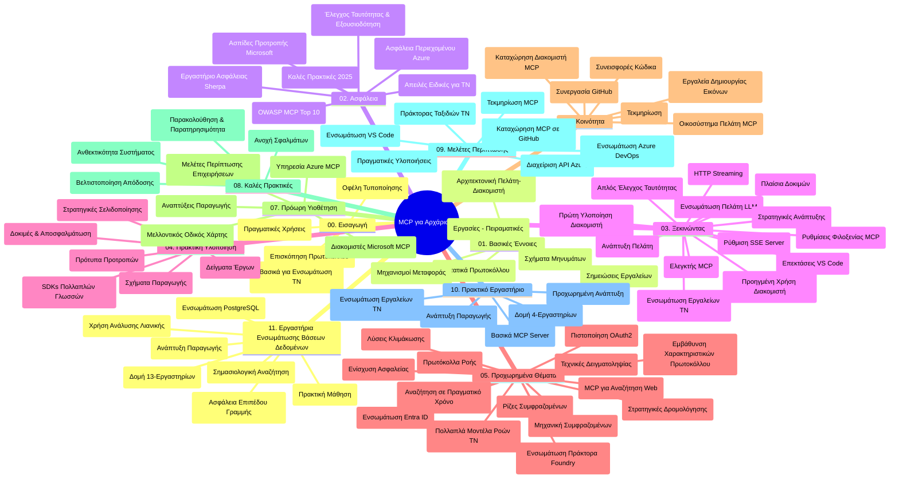

# Πρωτόκολλο Πλαισίου Μοντέλου (MCP) για Αρχάριους - Οδηγός Μελέτης

Αυτός ο οδηγός μελέτης παρέχει μια επισκόπηση της δομής και του περιεχομένου του αποθετηρίου για το πρόγραμμα σπουδών "Πρωτόκολλο Πλαισίου Μοντέλου (MCP) για Αρχάριους". Χρησιμοποιήστε αυτόν τον οδηγό για να πλοηγηθείτε αποτελεσματικά στο αποθετήριο και να αξιοποιήσετε στο έπακρο τους διαθέσιμους πόρους.

## Επισκόπηση Αποθετηρίου

Το Πρωτόκολλο Πλαισίου Μοντέλου (MCP) είναι ένα τυποποιημένο πλαίσιο για αλληλεπιδράσεις μεταξύ μοντέλων ΤΝ και πελατειακών εφαρμογών. Αρχικά δημιουργημένο από την Anthropic, το MCP πλέον διατηρείται από την ευρύτερη κοινότητα MCP μέσω της επίσημης οργάνωσης στο GitHub. Αυτό το αποθετήριο παρέχει ένα ολοκληρωμένο πρόγραμμα σπουδών με πρακτικά παραδείγματα κώδικα σε C#, Java, JavaScript, Python και TypeScript, σχεδιασμένο για προγραμματιστές ΤΝ, αρχιτέκτονες συστημάτων και μηχανικούς λογισμικού.

## Οπτικός Χάρτης Προγράμματος Σπουδών

## Δομή Αποθετηρίου

Το αποθετήριο οργανώνεται σε έντεκα κύριες ενότητες, κάθε μία εστιάζει σε διαφορετικές πτυχές του MCP:

1. **Εισαγωγή (00-Introduction/)**
   - Επισκόπηση του Πρωτοκόλλου Πλαισίου Μοντέλου
   - Γιατί η τυποποίηση έχει σημασία στις ροές εργασίας ΤΝ
   - Πρακτικές χρήσεις και οφέλη

2. **Βασικές Έννοιες (01-CoreConcepts/)**
   - Αρχιτεκτονική πελάτη-εξυπηρετητή
   - Κύρια στοιχεία πρωτοκόλλου
   - Πρότυπα μηνυμάτων στο MCP

3. **Ασφάλεια (02-Security/)**
   - Απειλές ασφάλειας σε συστήματα βασισμένα σε MCP
   - Καλές πρακτικές για ασφαλείς υλοποιήσεις
   - Στρατηγικές αυθεντικοποίησης και εξουσιοδότησης
   - **Ολοκληρωμένη Τεκμηρίωση Ασφάλειας**:
     - Βέλτιστες Πρακτικές Ασφάλειας MCP 2025
     - Οδηγός Υλοποίησης Azure Content Safety
     - Έλεγχοι και Τεχνικές Ασφάλειας MCP
     - Γρήγορη Αναφορά Βέλτιστων Πρακτικών MCP
   - **Κύρια Θέματα Ασφάλειας**:
     - Εισαγωγή προτροπών και επιθέσεις δηλητηρίασης εργαλείων
     - Υπεξαίρεση συνεδρίας και προβλήματα συγκεχυμένου αντιπρόσωπου
     - Ευπάθειες σε μεταβίβαση διακριτικών
     - Υπερβολικά δικαιώματα και έλεγχος πρόσβασης
     - Ασφάλεια εφοδιαστικής αλυσίδας για στοιχεία ΤΝ
     - Ενσωμάτωση Microsoft Prompt Shields

4. **Ξεκινώντας (03-GettingStarted/)**
   - Ρύθμιση περιβάλλοντος και διαμόρφωση
   - Δημιουργία βασικών MCP διακομιστών και πελατών
   - Ενσωμάτωση με υπάρχουσες εφαρμογές
   - Περιλαμβάνει ενότητες για:
     - Πρώτη υλοποίηση διακομιστή
     - Ανάπτυξη πελάτη
     - Ενσωμάτωση LLM πελάτη
     - Ενσωμάτωση VS Code
     - Διακομιστής Server-Sent Events (SSE)
     - Προχωρημένη χρήση διακομιστή
     - HTTP streaming
     - Ενσωμάτωση AI Toolkit
     - Στρατηγικές δοκιμών
     - Κατευθυντήριες γραμμές ανάπτυξης

5. **Πρακτική Υλοποίηση (04-PracticalImplementation/)**
   - Χρήση SDK σε διαφορετικές γλώσσες προγραμματισμού
   - Τεχνικές αποσφαλμάτωσης, δοκιμών και επικύρωσης
   - Δημιουργία επαναχρησιμοποιούμενων προτύπων προτροπών και ροών εργασίας
   - Παραδείγματα έργων με δείγματα υλοποίησης

6. **Προχωρημένα Θέματα (05-AdvancedTopics/)**
   - Τεχνικές μηχανικής πλαισίου
   - Ενσωμάτωση Foundry agent
   - Πολυτροπικές ροές εργασίας ΤΝ
   - Επιδείξεις αυθεντικοποίησης OAuth2
   - Αναζητήσεις σε πραγματικό χρόνο
   - Streaming σε πραγματικό χρόνο
   - Υλοποίηση ριζικών πλαισίων
   - Στρατηγικές δρομολόγησης
   - Τεχνικές δειγματοληψίας
   - Προσεγγίσεις κλιμάκωσης
   - Θεωρήσεις ασφάλειας
   - Ενσωμάτωση ασφάλειας Entra ID
   - Ενσωμάτωση διαδικτυακής αναζήτησης

7. **Συνεισφορές Κοινότητας (06-CommunityContributions/)**
   - Πώς να συνεισφέρετε κώδικα και τεκμηρίωση
   - Συνεργασία μέσω GitHub
   - Βελτιώσεις και σχόλια από την κοινότητα
   - Χρήση διαφόρων MCP πελατών (Claude Desktop, Cline, VSCode)
   - Εργασία με δημοφιλείς MCP διακομιστές συμπεριλαμβανομένης της δημιουργίας εικόνων

8. **Μαθήματα από Πρώιμη Υιοθέτηση (07-LessonsfromEarlyAdoption/)**
   - Υλοποιήσεις πραγματικού κόσμου και ιστορίες επιτυχίας
   - Δημιουργία και ανάπτυξη λύσεων βασισμένων σε MCP
   - Τάσεις και μελλοντικός οδικός χάρτης
   - **Οδηγός Microsoft MCP Servers**: Αναλυτικός οδηγός για 10 παραγωγικούς Microsoft MCP διακομιστές, όπως:
     - Microsoft Learn Docs MCP Server
     - Azure MCP Server (περισσότεροι από 15 εξειδικευμένοι συνδετήρες)
     - GitHub MCP Server
     - Azure DevOps MCP Server
     - MarkItDown MCP Server
     - SQL Server MCP Server
     - Playwright MCP Server
     - Dev Box MCP Server
     - Azure AI Foundry MCP Server
     - Microsoft 365 Agents Toolkit MCP Server

9. **Βέλτιστες Πρακτικές (08-BestPractices/)**
   - Βελτιστοποίηση απόδοσης και ρύθμιση
   - Σχεδιασμός MCP συστημάτων ανθεκτικών σε σφάλματα
   - Στρατηγικές δοκιμών και ανθεκτικότητας

10. **Μελέτες Περίπτωσης (09-CaseStudy/)**
    - **Επτά ολοκληρωμένες μελέτες περίπτωσης** που αναδεικνύουν την ευελιξία του MCP σε διάφορα σενάρια:
    - **Azure AI Travel Agents**: Πολυ-πράκτορας ορχήστρωση με Azure OpenAI και AI Search
    - **Ενσωμάτωση Azure DevOps**: Αυτοματοποίηση ροών εργασιών με ενημερώσεις δεδομένων από YouTube
    - **Ανάκτηση Τεκμηρίωσης σε Πραγματικό Χρόνο**: Python κονσόλα πελάτη με streaming HTTP
    - **Δημιουργός Διαδραστικού Σχεδίου Μελέτης**: Chainlit web app με συνομιλιακή ΤΝ
    - **Τεκμηρίωση μέσα στον Επεξεργαστή**: Ενσωμάτωση VS Code με ροές εργασίας GitHub Copilot
    - **Διαχείριση Azure API**: Ενσωμάτωση API επιχείρησης με δημιουργία MCP διακομιστή
    - **Κατάλογος GitHub MCP**: Ανάπτυξη οικοσυστήματος και πλατφόρμα ενσωμάτωσης πρακτόρων
    - Παραδείγματα υλοποίησης σε επιχειρησιακή ενσωμάτωση, παραγωγικότητα προγραμματιστών και ανάπτυξη οικοσυστήματος

11. **Πρακτικό Εργαστήριο (10-StreamliningAIWorkflowsBuildingAnMCPServerWithAIToolkit/)**
    - Εκτενές πρακτικό εργαστήριο που συνδυάζει MCP με AI Toolkit
    - Δημιουργία ευφυών εφαρμογών που συνδέουν μοντέλα ΤΝ με πραγματικά εργαλεία
    - Πρακτικές ενότητες που καλύπτουν βασικά, ανάπτυξη προσαρμοσμένων διακομιστών και στρατηγικές παραγωγικής ανάπτυξης
    - **Δομή Εργαστηρίου**:
      - Εργαστήριο 1: Βασικά MCP Διακομιστή
      - Εργαστήριο 2: Προχωρημένη Ανάπτυξη MCP Διακομιστή
      - Εργαστήριο 3: Ενσωμάτωση AI Toolkit
      - Εργαστήριο 4: Παραγωγική Ανάπτυξη και Κλιμάκωση
    - Προσέγγιση μάθησης βασισμένη σε εργαστήρια με βήμα προς βήμα οδηγίες

12. **Εργαστήρια Ενσωμάτωσης Βάσης Δεδομένων MCP Server (11-MCPServerHandsOnLabs/)**
    - **Ολοκληρωμένη πορεία μάθησης 13 εργαστηρίων** για δημιουργία παραγωγικών MCP διακομιστών με ενσωμάτωση PostgreSQL
    - **Υλοποίηση ανάλυσης λιανικής πώλησης πραγματικού κόσμου** με τη χρήση περιπτώσεων Zava Retail
    - **Επιχειρησιακά πρότυπα** όπως Row Level Security (RLS), σημασιολογική αναζήτηση, και πρόσβαση δεδομένων πολλαπλών ενοικιαστών
    - **Πλήρης Δομή Εργαστηρίου**:
      - **Εργαστήρια 00-03: Θεμέλια** - Εισαγωγή, Αρχιτεκτονική, Ασφάλεια, Ρύθμιση Περιβάλλοντος
      - **Εργαστήρια 04-06: Δημιουργία MCP Διακομιστή** - Σχεδίαση Βάσης Δεδομένων, Υλοποίηση MCP Διακομιστή, Ανάπτυξη Εργαλείων
      - **Εργαστήρια 07-09: Προχωρημένα Χαρακτηριστικά** - Σημασιολογική Αναζήτηση, Δοκιμές & Αποσφαλμάτωση, Ενσωμάτωση VS Code
      - **Εργαστήρια 10-12: Παραγωγή & Βέλτιστες Πρακτικές** - Ανάπτυξη, Παρακολούθηση, Βελτιστοποίηση
    - **Καλυπτόμενες Τεχνολογίες**: FastMCP framework, PostgreSQL, Azure OpenAI, Azure Container Apps, Application Insights
    - **Αποτελέσματα Μάθησης**: Παραγωγικοί MCP διακομιστές, πρότυπα ενσωμάτωσης βάσης δεδομένων, ανάλυση με τεχνητή νοημοσύνη, επιχειρησιακή ασφάλεια

## Επιπρόσθετοι Πόροι

Το αποθετήριο περιλαμβάνει υποστηρικτικούς πόρους:

- **Φάκελος Εικόνων**: Περιέχει διαγράμματα και εικονογραφήσεις που χρησιμοποιούνται σε όλο το πρόγραμμα σπουδών
- **Μεταφράσεις**: Υποστήριξη πολλαπλών γλωσσών με αυτοματοποιημένες μεταφράσεις τεκμηρίωσης
- **Επίσημοι Πόροι MCP**:
  - [MCP Documentation](https://modelcontextprotocol.io/)
  - [MCP Specification](https://spec.modelcontextprotocol.io/)
  - [MCP GitHub Repository](https://github.com/modelcontextprotocol)

## Πώς να Χρησιμοποιήσετε Αυτό το Αποθετήριο

1. **Συνεχής Μάθηση**: Ακολουθήστε τα κεφάλαια με τη σειρά (00 έως 11) για μια δομημένη εμπειρία μάθησης.
2. **Εστίαση σε Συγκεκριμένη Γλώσσα**: Αν σας ενδιαφέρει συγκεκριμένη γλώσσα προγραμματισμού, εξερευνήστε τους φακέλους παραδειγμάτων για υλοποιήσεις στην προτιμώμενη γλώσσα σας.
3. **Πρακτική Υλοποίηση**: Ξεκινήστε από την ενότητα "Ξεκινώντας" για να ρυθμίσετε το περιβάλλον και να δημιουργήσετε τον πρώτο σας MCP διακομιστή και πελάτη.
4. **Προχωρημένη Εξερεύνηση**: Όταν νιώσετε άνετα με τα βασικά, εμβαθύνετε στα προχωρημένα θέματα για να επεκτείνετε τις γνώσεις σας.
5. **Εμπλοκή στην Κοινότητα**: Ενταχθείτε στην κοινότητα MCP μέσω συζητήσεων στο GitHub και κανάλια Discord για να συνδεθείτε με ειδικούς και άλλους προγραμματιστές.

## MCP Πελάτες και Εργαλεία

Το πρόγραμμα σπουδών καλύπτει διάφορους MCP πελάτες και εργαλεία:

1. **Επίσημοι Πελάτες**:
   - Visual Studio Code 
   - MCP στο Visual Studio Code
   - Claude Desktop
   - Claude στο VSCode 
   - Claude API

2. **Πελάτες Κοινότητας**:
   - Cline (τερματικός)
   - Cursor (εργαλείο επεξεργασίας κώδικα)
   - ChatMCP
   - Windsurf

3. **Εργαλεία Διαχείρισης MCP**:
   - MCP CLI
   - MCP Manager
   - MCP Linker
   - MCP Router

## Δημοφιλείς MCP Διακομιστές

Το αποθετήριο παρουσιάζει διάφορους MCP διακομιστές, όπως:

1. **Επίσημοι Microsoft MCP Διακομιστές**:
   - Microsoft Learn Docs MCP Server
   - Azure MCP Server (15+ εξειδικευμένοι συνδετήρες)
   - GitHub MCP Server
   - Azure DevOps MCP Server
   - MarkItDown MCP Server
   - SQL Server MCP Server
   - Playwright MCP Server
   - Dev Box MCP Server
   - Azure AI Foundry MCP Server
   - Microsoft 365 Agents Toolkit MCP Server

2. **Επίσημοι Αναφορικοί Διακομιστές**:
   - Filesystem
   - Fetch
   - Memory
   - Sequential Thinking

3. **Δημιουργία Εικόνων**:
   - Azure OpenAI DALL-E 3
   - Stable Diffusion WebUI
   - Replicate

4. **Εργαλεία Ανάπτυξης**:
   - Git MCP
   - Terminal Control
   - Code Assistant

5. **Εξειδικευμένοι Διακομιστές**:
   - Salesforce
   - Microsoft Teams
   - Jira & Confluence

## Συνεισφορά

Αυτό το αποθετήριο καλωσορίζει συνεισφορές από την κοινότητα. Δείτε την ενότητα Συνεισφορές Κοινότητας για οδηγίες σχετικά με το πώς να συνεισφέρετε αποτελεσματικά στο οικοσύστημα MCP.

----

*Αυτός ο οδηγός μελέτης ενημερώθηκε τελευταία φορά στις 5 Φεβρουαρίου 2026, αντικατοπτρίζοντας την τελευταία Προδιαγραφή MCP 2025-11-25 και παρέχει μια επισκόπηση του αποθετηρίου έως εκείνη την ημερομηνία. Το περιεχόμενο του αποθετηρίου μπορεί να ενημερωθεί μετά από αυτήν την ημερομηνία.*

---

<!-- CO-OP TRANSLATOR DISCLAIMER START -->
**Αποποίηση Ευθύνης**:  
Αυτό το έγγραφο έχει μεταφραστεί χρησιμοποιώντας την υπηρεσία μετάφρασης AI [Co-op Translator](https://github.com/Azure/co-op-translator). Παρόλο που προσπαθούμε για ακρίβεια, παρακαλούμε να λάβετε υπόψη ότι οι αυτοματοποιημένες μεταφράσεις ενδέχεται να περιέχουν λάθη ή ανακρίβειες. Το πρωτότυπο έγγραφο στη γλώσσα του θεωρείται η επίσημη πηγή. Για κρίσιμες πληροφορίες συνιστάται η επαγγελματική ανθρώπινη μετάφραση. Δεν φέρουμε ευθύνη για τυχόν παρεξηγήσεις ή λανθασμένες ερμηνείες που προκύπτουν από τη χρήση αυτής της μετάφρασης.
<!-- CO-OP TRANSLATOR DISCLAIMER END -->