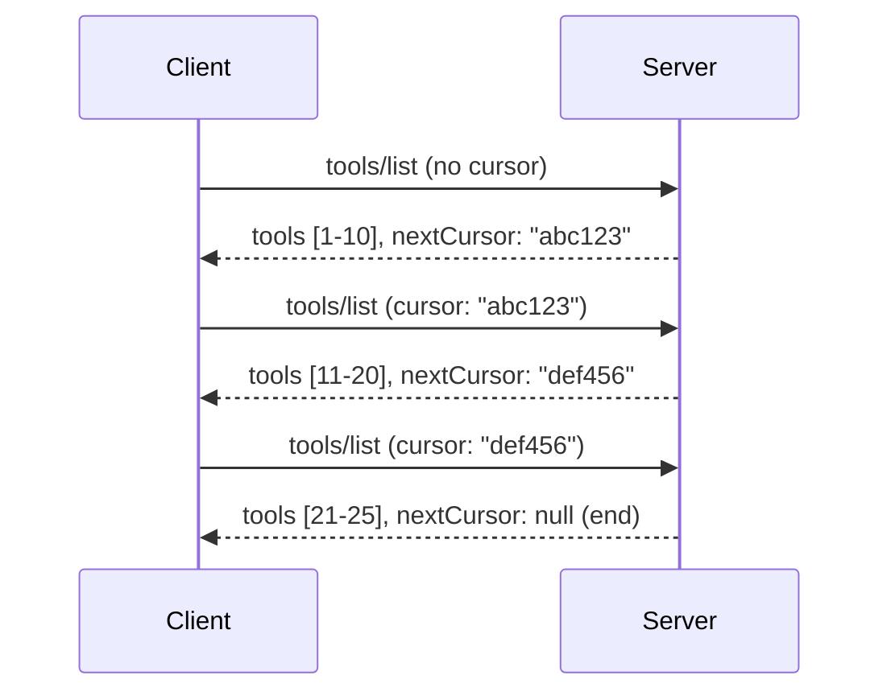

# Pagination and Large Result Sets in MCP

When your MCP server handles large datasets - whether listing thousands of files, database records, or search results - you need pagination to manage memory efficiently and provide responsive user experiences. This guide covers how to implement and use pagination in MCP.

## Why Pagination Matters

Without pagination, large responses can cause:

- **Memory exhaustion** - Loading millions of records at once
- **Slow response times** - Users wait while all data loads
- **Timeout errors** - Requests exceed timeout limits
- **Poor AI performance** - LLMs struggle with massive context

MCP uses **cursor-based pagination** for reliable, consistent paging through result sets.

---

## How MCP Pagination Works

### The Cursor Concept

A **cursor** is an opaque string that marks your position in a result set. Think of it like a bookmark in a long book.


### Pagination in MCP Methods

These MCP methods support pagination:

| Method | Returns | Cursor Support |
|--------|---------|----------------|
| `tools/list` | Tool definitions | ✅ |
| `resources/list` | Resource definitions | ✅ |
| `prompts/list` | Prompt definitions | ✅ |
| `resources/templates/list` | Resource templates | ✅ |

---

## Server Implementation

### Python (FastMCP)

```python
from mcp.server import Server
from mcp.types import Tool, ListToolsResult
import math

app = Server("paginated-server")

# Simulated large dataset
ALL_TOOLS = [
    Tool(name=f"tool_{i}", description=f"Tool number {i}", inputSchema={})
    for i in range(100)
]

PAGE_SIZE = 10

@app.list_tools()
async def list_tools(cursor: str | None = None) -> ListToolsResult:
    """List tools with pagination support."""
    
    # Decode cursor to get starting index
    start_index = 0
    if cursor:
        try:
            start_index = int(cursor)
        except ValueError:
            start_index = 0
    
    # Get page of results
    end_index = min(start_index + PAGE_SIZE, len(ALL_TOOLS))
    page_tools = ALL_TOOLS[start_index:end_index]
    
    # Calculate next cursor
    next_cursor = None
    if end_index < len(ALL_TOOLS):
        next_cursor = str(end_index)
    
    return ListToolsResult(
        tools=page_tools,
        nextCursor=next_cursor
    )
```

### TypeScript

```typescript
import { Server } from "@modelcontextprotocol/sdk/server/index.js";
import { ListToolsResultSchema } from "@modelcontextprotocol/sdk/types.js";

const server = new Server({
  name: "paginated-server",
  version: "1.0.0"
});

// Simulated large dataset
const ALL_TOOLS = Array.from({ length: 100 }, (_, i) => ({
  name: `tool_${i}`,
  description: `Tool number ${i}`,
  inputSchema: { type: "object", properties: {} }
}));

const PAGE_SIZE = 10;

server.setRequestHandler(ListToolsResultSchema, async (request) => {
  // Decode cursor
  let startIndex = 0;
  if (request.params?.cursor) {
    startIndex = parseInt(request.params.cursor, 10) || 0;
  }
  
  // Get page of results
  const endIndex = Math.min(startIndex + PAGE_SIZE, ALL_TOOLS.length);
  const pageTools = ALL_TOOLS.slice(startIndex, endIndex);
  
  // Calculate next cursor
  const nextCursor = endIndex < ALL_TOOLS.length ? String(endIndex) : undefined;
  
  return {
    tools: pageTools,
    nextCursor
  };
});
```

### Java (Spring MCP)

```java
@Service
public class PaginatedToolService {
    
    private static final int PAGE_SIZE = 10;
    private final List<Tool> allTools;
    
    public PaginatedToolService() {
        // Initialize large dataset
        this.allTools = IntStream.range(0, 100)
            .mapToObj(i -> new Tool("tool_" + i, "Tool number " + i, Map.of()))
            .collect(Collectors.toList());
    }
    
    @McpMethod("tools/list")
    public ListToolsResult listTools(@Param("cursor") String cursor) {
        // Decode cursor
        int startIndex = 0;
        if (cursor != null && !cursor.isEmpty()) {
            try {
                startIndex = Integer.parseInt(cursor);
            } catch (NumberFormatException e) {
                startIndex = 0;
            }
        }
        
        // Get page of results
        int endIndex = Math.min(startIndex + PAGE_SIZE, allTools.size());
        List<Tool> pageTools = allTools.subList(startIndex, endIndex);
        
        // Calculate next cursor
        String nextCursor = endIndex < allTools.size() ? String.valueOf(endIndex) : null;
        
        return new ListToolsResult(pageTools, nextCursor);
    }
}
```

---

## Client Implementation

### Python Client

```python
from mcp import ClientSession

async def get_all_tools(session: ClientSession) -> list:
    """Fetch all tools using pagination."""
    all_tools = []
    cursor = None
    
    while True:
        result = await session.list_tools(cursor=cursor)
        all_tools.extend(result.tools)
        
        if result.nextCursor is None:
            break
        cursor = result.nextCursor
    
    return all_tools

# Usage
async with client_session as session:
    tools = await get_all_tools(session)
    print(f"Found {len(tools)} tools")
```

### TypeScript Client

```typescript
import { Client } from "@modelcontextprotocol/sdk/client/index.js";

async function getAllTools(client: Client): Promise<Tool[]> {
  const allTools: Tool[] = [];
  let cursor: string | undefined = undefined;
  
  do {
    const result = await client.listTools({ cursor });
    allTools.push(...result.tools);
    cursor = result.nextCursor;
  } while (cursor);
  
  return allTools;
}

// Usage
const tools = await getAllTools(client);
console.log(`Found ${tools.length} tools`);
```

### Lazy Loading Pattern

For very large datasets, load pages on-demand:

```python
class PaginatedToolIterator:
    """Lazily iterate through paginated tools."""
    
    def __init__(self, session: ClientSession):
        self.session = session
        self.cursor = None
        self.buffer = []
        self.exhausted = False
    
    async def __anext__(self):
        # Return from buffer if available
        if self.buffer:
            return self.buffer.pop(0)
        
        # Check if we've exhausted all pages
        if self.exhausted:
            raise StopAsyncIteration
        
        # Fetch next page
        result = await self.session.list_tools(cursor=self.cursor)
        self.buffer = list(result.tools)
        self.cursor = result.nextCursor
        
        if self.cursor is None:
            self.exhausted = True
        
        if not self.buffer:
            raise StopAsyncIteration
        
        return self.buffer.pop(0)
    
    def __aiter__(self):
        return self

# Usage - memory efficient for large datasets
async for tool in PaginatedToolIterator(session):
    process_tool(tool)
```

---

## Pagination for Resources

Resources often need pagination for directories or large datasets:

```python
from mcp.server import Server
from mcp.types import Resource, ListResourcesResult
import os

app = Server("file-server")

@app.list_resources()
async def list_resources(cursor: str | None = None) -> ListResourcesResult:
    """List files in directory with pagination."""
    
    directory = "/data/files"
    all_files = sorted(os.listdir(directory))
    
    # Decode cursor (file index)
    start_index = int(cursor) if cursor else 0
    page_size = 20
    end_index = min(start_index + page_size, len(all_files))
    
    # Create resource list for this page
    resources = []
    for filename in all_files[start_index:end_index]:
        filepath = os.path.join(directory, filename)
        resources.append(Resource(
            uri=f"file://{filepath}",
            name=filename,
            mimeType="application/octet-stream"
        ))
    
    # Calculate next cursor
    next_cursor = str(end_index) if end_index < len(all_files) else None
    
    return ListResourcesResult(
        resources=resources,
        nextCursor=next_cursor
    )
```

---

## Cursor Design Strategies

### Strategy 1: Index-Based (Simple)

```python
# Cursor is just the index
cursor = "50"  # Start at item 50
```

**Pros:** Simple, stateless
**Cons:** Results can shift if items are added/removed

### Strategy 2: ID-Based (Stable)

```python
# Cursor is the last seen ID
cursor = "item_abc123"  # Start after this item
```

**Pros:** Stable even if items change
**Cons:** Requires ordered IDs

### Strategy 3: Encoded State (Complex)

```python
import base64
import json

def encode_cursor(state: dict) -> str:
    return base64.b64encode(json.dumps(state).encode()).decode()

def decode_cursor(cursor: str) -> dict:
    return json.loads(base64.b64decode(cursor).decode())

# The cursor contains multiple state fields
cursor = encode_cursor({
    "offset": 50,
    "filter": "active",
    "sort": "name"
})
```

**Pros:** Can encode complex state
**Cons:** More complex, larger cursor strings

---

## Best Practices

### 1. Choose Appropriate Page Sizes

```python
# Consider the data size
PAGE_SIZE_SMALL_ITEMS = 100   # Simple metadata
PAGE_SIZE_MEDIUM_ITEMS = 20   # Richer objects
PAGE_SIZE_LARGE_ITEMS = 5     # Complex content
```

### 2. Handle Invalid Cursors Gracefully

```python
@app.list_tools()
async def list_tools(cursor: str | None = None) -> ListToolsResult:
    try:
        start_index = int(cursor) if cursor else 0
        if start_index < 0 or start_index >= len(ALL_TOOLS):
            start_index = 0  # Reset to beginning
    except (ValueError, TypeError):
        start_index = 0  # Invalid cursor, start fresh
    # ...
```

### 3. Include Total Count (Optional)

```python
return ListToolsResult(
    tools=page_tools,
    nextCursor=next_cursor,
    # Some implementations include total for UI progress
    _meta={"total": len(ALL_TOOLS)}
)
```

### 4. Test Edge Cases

```python
async def test_pagination():
    # Empty result set
    result = await session.list_tools()
    assert result.tools == []
    assert result.nextCursor is None
    
    # Single page
    result = await session.list_tools()
    assert len(result.tools) <= PAGE_SIZE
    
    # Invalid cursor
    result = await session.list_tools(cursor="invalid")
    assert result.tools  # Should return first page
```

---

## Common Pitfalls

### ❌ Returning All Results Then Paginating Client-Side

```python
# BAD: Loads everything into memory
@app.list_tools()
async def list_tools() -> ListToolsResult:
    all_tools = load_all_tools()  # 1 million tools!
    return ListToolsResult(tools=all_tools)
```

### ✅ Paginate at the Data Source

```python
# GOOD: Only loads what's needed
@app.list_tools()
async def list_tools(cursor: str | None = None) -> ListToolsResult:
    offset = int(cursor) if cursor else 0
    tools = await db.query_tools(offset=offset, limit=PAGE_SIZE)
    return ListToolsResult(tools=tools, nextCursor=...)
```

---

## What's Next

- [Module 5.14 - Context Engineering](../../05-AdvancedTopics/mcp-contextengineering/README.md)
- [Module 8 - Best Practices](../../08-BestPractices/README.md)
- [3.8 - Testing Your MCP Server](../../03-GettingStarted/08-testing/README.md)

---

## Additional Resources

- [MCP Specification - Pagination](https://spec.modelcontextprotocol.io/specification/2025-11-25/)
- [Cursor-Based Pagination Explained](https://slack.engineering/evolving-api-pagination-at-slack/)
- [Python SDK pagination tests](https://github.com/modelcontextprotocol/python-sdk/blob/main/tests/client/test_list_methods_cursor.py)

---

<!-- CO-OP TRANSLATOR DISCLAIMER START -->
**Disclaimer**:
This document has been translated using the AI translation service [Co-op Translator](https://github.com/Azure/co-op-translator). While we strive for accuracy, please be aware that automated translations may contain errors or inaccuracies. The original document in its native language should be considered the authoritative source. For critical information, professional human translation is recommended. We are not liable for any misunderstandings or misinterpretations arising from the use of this translation.
<!-- CO-OP TRANSLATOR DISCLAIMER END -->