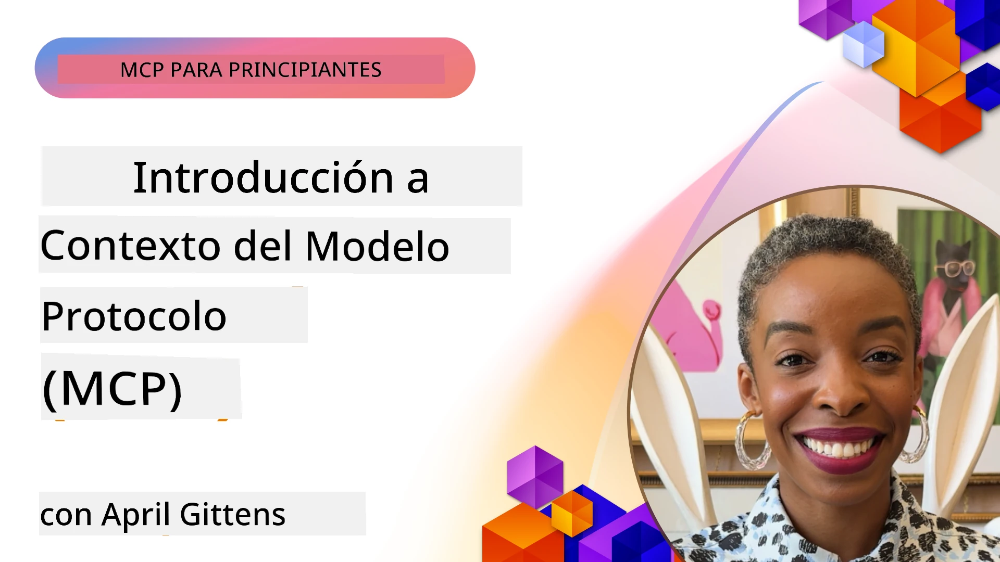
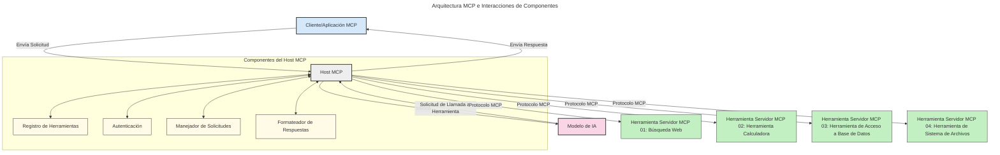

# Introducción al Protocolo de Contexto de Modelo (MCP): Por Qué Importa para Aplicaciones de IA Escalables

[](https://youtu.be/agBbdiOPLQA)

_(Haz clic en la imagen de arriba para ver el video de esta lección)_

Las aplicaciones de IA generativa representan un gran avance, ya que a menudo permiten al usuario interactuar con la aplicación mediante indicaciones en lenguaje natural. Sin embargo, a medida que se invierte más tiempo y recursos en estas aplicaciones, quieres asegurarte de poder integrar funcionalidades y recursos fácilmente de manera que sea simple extenderlas, que tu aplicación pueda atender más de un modelo utilizado y manejar diversas particularidades del modelo. En resumen, construir aplicaciones de IA generativa es fácil al principio, pero a medida que crecen y se vuelven más complejas, necesitas comenzar a definir una arquitectura y probablemente necesitarás confiar en un estándar para garantizar que tus aplicaciones se construyan de manera consistente. Aquí es donde MCP entra para organizar las cosas y proporcionar un estándar.

---

## **🔍 ¿Qué es el Protocolo de Contexto de Modelo (MCP)?**

El **Protocolo de Contexto de Modelo (MCP)** es una **interfaz abierta y estandarizada** que permite a los Modelos de Lenguaje Grande (LLMs) interactuar sin problemas con herramientas externas, APIs y fuentes de datos. Proporciona una arquitectura consistente para mejorar la funcionalidad de los modelos de IA más allá de sus datos de entrenamiento, permitiendo sistemas de IA más inteligentes, escalables y sensibles.

---

## **🎯 Por Qué la Estandarización en IA Importa**

A medida que las aplicaciones de IA generativa se vuelven más complejas, es esencial adoptar estándares que aseguren la **escalabilidad, extensibilidad, mantenibilidad** y **evitar el bloqueo por proveedor**. MCP aborda estas necesidades al:

- Unificar las integraciones modelo-herramienta
- Reducir soluciones personalizadas únicas y frágiles
- Permitir que múltiples modelos de distintos proveedores coexistan dentro de un mismo ecosistema

**Nota:** Aunque MCP se presenta como un estándar abierto, no hay planes para estandarizar MCP a través de organismos de estándares existentes como IEEE, IETF, W3C, ISO u otro organismo de estándares.

---

## **📚 Objetivos de Aprendizaje**

Al final de este artículo, podrás:

- Definir el **Protocolo de Contexto de Modelo (MCP)** y sus casos de uso
- Entender cómo MCP estandariza la comunicación entre modelo y herramienta
- Identificar los componentes centrales de la arquitectura MCP
- Explorar aplicaciones reales de MCP en contextos empresariales y de desarrollo

---

## **💡 Por Qué el Protocolo de Contexto de Modelo (MCP) Es un Cambio Radical**

### **🔗 MCP Resuelve la Fragmentación en las Interacciones de IA**

Antes de MCP, integrar modelos con herramientas requería:

- Código personalizado por cada par herramienta-modelo
- APIs no estándar para cada proveedor
- Rupturas frecuentes debido a actualizaciones
- Mala escalabilidad conforme aumentaban las herramientas

### **✅ Beneficios de la Estandarización MCP**

| **Beneficio**            | **Descripción**                                                               |
|--------------------------|-------------------------------------------------------------------------------|
| Interoperabilidad        | Los LLMs funcionan sin problemas con herramientas de diferentes proveedores   |
| Consistencia             | Comportamiento uniforme en plataformas y herramientas                         |
| Reusabilidad             | Herramientas construidas una vez pueden usarse en proyectos y sistemas        |
| Desarrollo Acelerado     | Se reduce el tiempo de desarrollo usando interfaces estandarizadas y plug-and-play |

---

## **🧱 Visión General de la Arquitectura MCP a Alto Nivel**

MCP sigue un **modelo cliente-servidor**, donde:

- **Hosts MCP** ejecutan los modelos de IA
- **Clientes MCP** inician solicitudes
- **Servidores MCP** proveen contexto, herramientas y capacidades

### **Componentes Clave:**

- **Recursos** – Datos estáticos o dinámicos para los modelos  
- **Prompts** – Flujos de trabajo predefinidos para generación guiada  
- **Herramientas** – Funciones ejecutables como búsqueda, cálculos  
- **Muestreo** – Comportamiento agentico mediante interacciones recursivas  
- **Elicitación** – Solicitudes iniciadas por el servidor para entrada de usuario  
- **Raíces** – Límites del sistema de archivos para control de acceso del servidor  

### **Arquitectura del Protocolo:**

MCP usa una arquitectura de dos capas:
- **Capa de Datos**: Comunicación basada en JSON-RPC 2.0 con administración del ciclo de vida y primitivas
- **Capa de Transporte**: Comunicación por STDIO (local) y HTTP Streamable con SSE (remoto)

---

## Cómo Funcionan los Servidores MCP

Los servidores MCP operan de la siguiente manera:

- **Flujo de Solicitud**:
    1. Una solicitud es iniciada por un usuario final o software que actúa en su nombre.
    2. El **Cliente MCP** envía la solicitud a un **Host MCP**, que administra el entorno de ejecución del Modelo de IA.
    3. El **Modelo de IA** recibe la indicación del usuario y puede solicitar acceso a herramientas externas o datos a través de una o más llamadas de herramientas.
    4. El **Host MCP**, no el modelo directamente, se comunica con el/los **Servidor(es) MCP** apropiado(s) usando el protocolo estandarizado.
- **Funcionalidad del Host MCP**:
    - **Registro de Herramientas**: Mantiene un catálogo de herramientas disponibles y sus capacidades.
    - **Autenticación**: Verifica permisos para el acceso a herramientas.
    - **Manejador de Solicitudes**: Procesa las solicitudes entrantes de herramientas provenientes del modelo.
    - **Formateador de Respuestas**: Estructura las salidas de herramientas en un formato que el modelo entienda.
- **Ejecución del Servidor MCP**:
    - El **Host MCP** enruta las llamadas a herramientas a uno o más **Servidores MCP**, cada uno exponiendo funciones especializadas (por ejemplo, búsqueda, cálculos, consultas a bases de datos).
    - Los **Servidores MCP** ejecutan sus operaciones respectivas y devuelven resultados al **Host MCP** en un formato consistente.
    - El **Host MCP** formatea y transmite estos resultados al **Modelo de IA**.
- **Finalización de la Respuesta**:
    - El **Modelo de IA** incorpora las salidas de las herramientas en una respuesta final.
    - El **Host MCP** envía esta respuesta de vuelta al **Cliente MCP**, que la entrega al usuario final o software solicitante.
    


## 👨‍💻 Cómo Construir un Servidor MCP (Con Ejemplos)

Los servidores MCP te permiten extender las capacidades de los LLM proporcionando datos y funcionalidades.

¿Listo para probarlo? Aquí tienes SDKs específicos por lenguaje y/o stack con ejemplos para crear servidores MCP simples en diferentes lenguajes/stacks:

- **SDK Python**: https://github.com/modelcontextprotocol/python-sdk

- **SDK TypeScript**: https://github.com/modelcontextprotocol/typescript-sdk

- **SDK Java**: https://github.com/modelcontextprotocol/java-sdk

- **SDK C#/.NET**: https://github.com/modelcontextprotocol/csharp-sdk


## 🌍 Casos de Uso Reales para MCP

MCP habilita una amplia gama de aplicaciones al extender las capacidades de IA:

| **Aplicación**                | **Descripción**                                                             |
|------------------------------|-----------------------------------------------------------------------------|
| Integración de Datos Empresariales | Conectar LLMs a bases de datos, CRM o herramientas internas               |
| Sistemas de IA Agents        | Permitir agentes autónomos con acceso a herramientas y flujos de toma de decisiones |
| Aplicaciones multimodales    | Combinar herramientas de texto, imagen y audio en una sola aplicación de IA unificada |
| Integración de Datos en Tiempo Real | Incorporar datos en vivo en interacciones con IA para resultados más precisos y actualizados |


### 🧠 MCP = Estándar Universal para Interacciones con IA

El Protocolo de Contexto de Modelo (MCP) actúa como un estándar universal para interacciones de IA, al igual que USB-C estandarizó conexiones físicas para dispositivos. En el mundo de la IA, MCP provee una interfaz consistente que permite a los modelos (clientes) integrarse sin problemas con herramientas externas y proveedores de datos (servidores). Esto elimina la necesidad de protocolos diversos y personalizados para cada API o fuente de datos.

Bajo MCP, una herramienta compatible con MCP (denominada servidor MCP) sigue un estándar unificado. Estos servidores pueden listar las herramientas o acciones que ofrecen y ejecutar esas acciones cuando son solicitadas por un agente de IA. Las plataformas de agentes de IA que soportan MCP son capaces de descubrir herramientas disponibles de los servidores e invocarlas mediante este protocolo estándar.

### 💡 Facilita el acceso al conocimiento

Más allá de ofrecer herramientas, MCP también facilita el acceso al conocimiento. Permite a las aplicaciones proporcionar contexto a los modelos de lenguaje grande (LLMs) vinculándolos a diversas fuentes de datos. Por ejemplo, un servidor MCP podría representar el repositorio documental de una empresa, permitiendo a los agentes recuperar información relevante bajo demanda. Otro servidor podría manejar acciones específicas como enviar correos o actualizar registros. Desde la perspectiva del agente, estas son simplemente herramientas que puede usar—algunas herramientas retornan datos (contexto de conocimiento), mientras que otras realizan acciones. MCP gestiona ambos eficazmente.

Un agente que se conecta a un servidor MCP aprende automáticamente las capacidades disponibles y los datos accesibles del servidor mediante un formato estándar. Esta estandarización permite disponibilidad dinámica de herramientas. Por ejemplo, añadir un nuevo servidor MCP al sistema de un agente hace que sus funciones sean inmediatamente utilizables sin requerir más personalización en las instrucciones del agente.

Esta integración simplificada se alinea con el flujo representado en el siguiente diagrama, donde los servidores proveen tanto herramientas como conocimiento, garantizando una colaboración fluida entre sistemas.

### 👉 Ejemplo: Solución de Agente Escalable

```mermaid
---
title: Solución de Agente Escalable con MCP
description: Un diagrama que ilustra cómo un usuario interactúa con un LLM que se conecta a múltiples servidores MCP, con cada servidor proporcionando tanto conocimiento como herramientas, creando una arquitectura de sistema de IA escalable
---
graph TD
    User -->|Prompt| LLM
    LLM -->|Response| User
    LLM -->|MCP| ServerA
    LLM -->|MCP| ServerB
    ServerA -->|Universal connector| ServerB
    ServerA --> KnowledgeA
    ServerA --> ToolsA
    ServerB --> KnowledgeB
    ServerB --> ToolsB

    subgraph Server A
        KnowledgeA[Conocimiento]
        ToolsA[Herramientas]
    end

    subgraph Server B
        KnowledgeB[Conocimiento]
        ToolsB[Herramientas]
    end
```El Conector Universal permite que los servidores MCP se comuniquen y compartan capacidades entre sí, permitiendo que ServerA delegue tareas a ServerB o acceda a sus herramientas y conocimiento. Esto federara herramientas y datos entre servidores, apoyando arquitecturas de agentes escalables y modulares. Debido a que MCP estandariza la exposición de herramientas, los agentes pueden descubrir y enrutar solicitudes dinámicamente entre servidores sin integraciones codificadas.

Federación de herramientas y conocimiento: Se puede acceder a herramientas y datos a través de servidores, lo que habilita arquitecturas agenticas más escalables y modulares.

### 🔄 Escenarios Avanzados de MCP con Integración de LLM en el Lado Cliente

Más allá de la arquitectura básica MCP, hay escenarios avanzados donde tanto cliente como servidor contienen LLMs, habilitando interacciones más sofisticadas. En el siguiente diagrama, **App Cliente** podría ser un IDE con un número de herramientas MCP disponibles para uso del LLM:

```mermaid
---
title: Escenarios Avanzados de MCP con Integración Cliente-Servidor de LLM
description: Un diagrama de secuencia que muestra el flujo detallado de interacción entre el usuario, la aplicación cliente, el LLM cliente, múltiples servidores MCP y el LLM servidor, ilustrando el descubrimiento de herramientas, interacción del usuario, llamada directa a herramientas y fases de negociación de características
---
sequenceDiagram
    autonumber
    actor User as 👤 Usuario
    participant ClientApp as 🖥️ Aplicación Cliente
    participant ClientLLM as 🧠 LLM Cliente
    participant Server1 as 🔧 Servidor MCP 1
    participant Server2 as 📚 Servidor MCP 2
    participant ServerLLM as 🤖 LLM Servidor
    
    %% Discovery Phase
    rect rgb(220, 240, 255)
        Note over ClientApp, Server2: FASE DE DESCUBRIMIENTO DE HERRAMIENTAS
        ClientApp->>+Server1: Solicitar herramientas/recursos disponibles
        Server1-->>-ClientApp: Devolver lista de herramientas (JSON)
        ClientApp->>+Server2: Solicitar herramientas/recursos disponibles
        Server2-->>-ClientApp: Devolver lista de herramientas (JSON)
        Note right of ClientApp: Almacenar catálogo combinado<br/>de herramientas localmente
    end
    
    %% User Interaction
    rect rgb(255, 240, 220)
        Note over User, ClientLLM: FASE DE INTERACCIÓN CON EL USUARIO
        User->>+ClientApp: Ingresar prompt en lenguaje natural
        ClientApp->>+ClientLLM: Reenviar prompt + catálogo de herramientas
        ClientLLM->>-ClientLLM: Analizar prompt y seleccionar herramientas
    end
    
    %% Scenario A: Direct Tool Calling
    alt Llamada Directa a Herramienta
        rect rgb(220, 255, 220)
            Note over ClientApp, Server1: ESCENARIO A: LLAMADA DIRECTA A HERRAMIENTAS
            ClientLLM->>+ClientApp: Solicitar ejecución de herramienta
            ClientApp->>+Server1: Ejecutar herramienta específica
            Server1-->>-ClientApp: Devolver resultados
            ClientApp->>+ClientLLM: Procesar resultados
            ClientLLM-->>-ClientApp: Generar respuesta
            ClientApp-->>-User: Mostrar respuesta final
        end
    
    %% Scenario B: Feature Negotiation (VS Code style)
    else Negociación de Características (estilo VS Code)
        rect rgb(255, 220, 220)
            Note over ClientApp, ServerLLM: ESCENARIO B: NEGOCIACIÓN DE CARACTERÍSTICAS
            ClientLLM->>+ClientApp: Identificar capacidades necesarias
            ClientApp->>+Server2: Negociar características/capacidades
            Server2->>+ServerLLM: Solicitar contexto adicional
            ServerLLM-->>-Server2: Proporcionar contexto
            Server2-->>-ClientApp: Devolver características disponibles
            ClientApp->>+Server2: Llamar a herramientas negociadas
            Server2-->>-ClientApp: Devolver resultados
            ClientApp->>+ClientLLM: Procesar resultados
            ClientLLM-->>-ClientApp: Generar respuesta
            ClientApp-->>-User: Mostrar respuesta final
        end
    end
```
## 🔐 Beneficios Prácticos de MCP

Estos son los beneficios prácticos de usar MCP:

- **Actualización**: Los modelos pueden acceder a información actualizada más allá de sus datos de entrenamiento
- **Extensión de Capacidades**: Los modelos pueden aprovechar herramientas especializadas para tareas para las que no fueron entrenados
- **Reducción de Alucinaciones**: Las fuentes de datos externas proporcionan una base factual
- **Privacidad**: Datos sensibles pueden permanecer dentro de entornos seguros en lugar de estar incrustados en prompts

## 📌 Conclusiones Clave

Las siguientes son conclusiones clave sobre el uso de MCP:

- **MCP** estandariza cómo los modelos de IA interactúan con herramientas y datos  
- Promueve **extensibilidad, consistencia e interoperabilidad**  
- MCP ayuda a **reducir el tiempo de desarrollo, mejorar la confiabilidad y extender las capacidades del modelo**  
- La arquitectura cliente-servidor **habilita aplicaciones de IA flexibles y extensibles**

## 🧠 Ejercicio

Piensa en una aplicación de IA que te interese construir.

- ¿Qué **herramientas externas o datos** podrían mejorar sus capacidades?  
- ¿Cómo podría MCP hacer la integración **más simple y confiable**?  

## Recursos Adicionales

- [Repositorio MCP en GitHub](https://github.com/modelcontextprotocol)


## Qué sigue

Siguiente: [Capítulo 1: Conceptos Básicos](../01-CoreConcepts/README.md)

---

<!-- CO-OP TRANSLATOR DISCLAIMER START -->
**Aviso Legal**:  
Este documento ha sido traducido utilizando el servicio de traducción automática [Co-op Translator](https://github.com/Azure/co-op-translator). Aunque nos esforzamos por lograr precisión, tenga en cuenta que las traducciones automáticas pueden contener errores o inexactitudes. El documento original en su idioma nativo debe considerarse la fuente autorizada. Para información crítica, se recomienda la traducción profesional realizada por humanos. No nos hacemos responsables por malentendidos o interpretaciones erróneas derivadas del uso de esta traducción.
<!-- CO-OP TRANSLATOR DISCLAIMER END -->