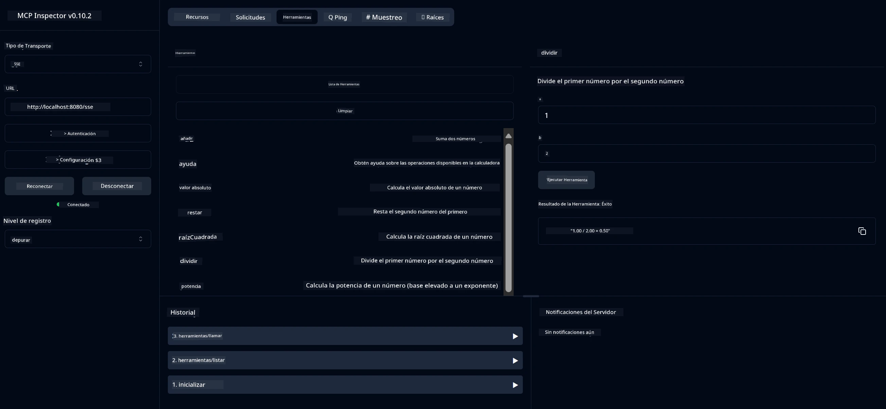

# Servicio Básico de Calculadora MCP

Este servicio ofrece operaciones básicas de calculadora a través del Protocolo de Contexto de Modelo (MCP) usando Spring Boot con transporte WebFlux. Está diseñado como un ejemplo sencillo para principiantes que están aprendiendo sobre implementaciones MCP.

Para más información, consulta la documentación de referencia de [MCP Server Boot Starter](https://docs.spring.io/spring-ai/reference/api/mcp/mcp-server-boot-starter-docs.html).


## Uso del Servicio

El servicio expone los siguientes endpoints API a través del protocolo MCP:

- `add(a, b)`: Suma dos números
- `subtract(a, b)`: Resta el segundo número del primero
- `multiply(a, b)`: Multiplica dos números
- `divide(a, b)`: Divide el primer número por el segundo (con verificación de cero)
- `power(base, exponent)`: Calcula la potencia de un número
- `squareRoot(number)`: Calcula la raíz cuadrada (con verificación de números negativos)
- `modulus(a, b)`: Calcula el residuo de la división
- `absolute(number)`: Calcula el valor absoluto

## Dependencias

El proyecto requiere las siguientes dependencias clave:

```xml
<dependency>
    <groupId>org.springframework.ai</groupId>
    <artifactId>spring-ai-starter-mcp-server-webflux</artifactId>
</dependency>
```

## Construcción del Proyecto

Construye el proyecto usando Maven:
```bash
./mvnw clean install -DskipTests
```

## Ejecución del Servidor

### Usando Java

```bash
java -jar target/calculator-server-0.0.1-SNAPSHOT.jar
```

### Usando MCP Inspector

El MCP Inspector es una herramienta útil para interactuar con servicios MCP. Para usarlo con este servicio de calculadora:

1. **Instala y ejecuta MCP Inspector** en una nueva ventana de terminal:
   ```bash
   npx @modelcontextprotocol/inspector
   ```

2. **Accede a la interfaz web** haciendo clic en la URL que muestra la aplicación (normalmente http://localhost:6274)

3. **Configura la conexión**:
   - Establece el tipo de transporte a "SSE"
   - Pon la URL al endpoint SSE de tu servidor en ejecución: `http://localhost:8080/sse`
   - Haz clic en "Connect"

4. **Usa las herramientas**:
   - Haz clic en "List Tools" para ver las operaciones de calculadora disponibles
   - Selecciona una herramienta y haz clic en "Run Tool" para ejecutar una operación



**Aviso legal**:  
Este documento ha sido traducido utilizando el servicio de traducción automática [Co-op Translator](https://github.com/Azure/co-op-translator). Aunque nos esforzamos por la precisión, tenga en cuenta que las traducciones automáticas pueden contener errores o inexactitudes. El documento original en su idioma nativo debe considerarse la fuente autorizada. Para información crítica, se recomienda la traducción profesional realizada por humanos. No nos hacemos responsables de malentendidos o interpretaciones erróneas derivadas del uso de esta traducción.