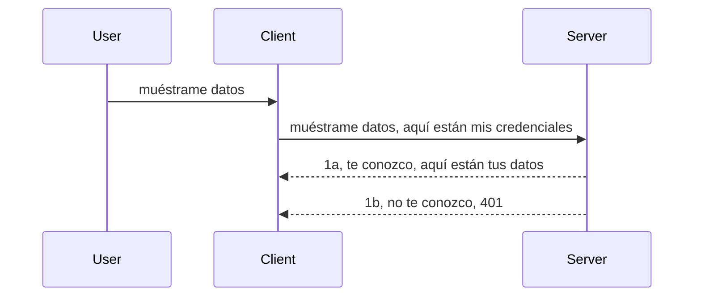

# Autenticación simple

Los SDK de MCP admiten el uso de OAuth 2.1 que, para ser justos, es un proceso bastante complejo que involucra conceptos como servidor de autenticación, servidor de recursos, envío de credenciales, obtención de un código, intercambio del código por un token portador hasta que finalmente se puede obtener los datos del recurso. Si no estás acostumbrado a OAuth, que es algo excelente para implementar, es buena idea comenzar con un nivel básico de autenticación y avanzar hacia una seguridad cada vez mejor. Por eso existe este capítulo, para guiarte hacia una autenticación más avanzada.

## Autenticación, ¿a qué nos referimos?

Auth es la abreviatura de autenticación y autorización. La idea es que necesitamos hacer dos cosas:

- **Autenticación**, que es el proceso de averiguar si dejamos que una persona entre en nuestra casa, que tiene el derecho de estar "aquí", es decir, tener acceso a nuestro servidor de recursos donde viven las funciones de nuestro MCP Server.
- **Autorización**, es el proceso de descubrir si un usuario debería tener acceso a estos recursos específicos que está solicitando, por ejemplo, estos pedidos o estos productos, o si tiene permitido leer el contenido pero no eliminarlo, como otro ejemplo.

## Credenciales: cómo le decimos al sistema quiénes somos

Bueno, la mayoría de desarrolladores web comienzan pensando en términos de proporcionar una credencial al servidor, usualmente un secreto que indique si tienen permiso para estar aquí "Autenticación". Esta credencial suele ser una versión codificada en base64 de nombre de usuario y contraseña o una clave API que identifica de manera única a un usuario específico.

Esto implica enviarla vía un encabezado llamado "Authorization" así:

```json
{ "Authorization": "secret123" }
```

Esto se suele conocer como autenticación básica. El flujo general funciona de la siguiente manera:


Ahora que entendemos cómo funciona desde el punto de vista del flujo, ¿cómo lo implementamos? Bueno, la mayoría de los servidores web tienen un concepto llamado middleware, un fragmento de código que se ejecuta como parte de la petición que puede verificar las credenciales, y si son válidas permite que la petición pase. Si la petición no tiene credenciales válidas, entonces obtienes un error de autenticación. Veamos cómo puede implementarse:

**Python**

```python
class AuthMiddleware(BaseHTTPMiddleware):
    async def dispatch(self, request, call_next):

        has_header = request.headers.get("Authorization")
        if not has_header:
            print("-> Missing Authorization header!")
            return Response(status_code=401, content="Unauthorized")

        if not valid_token(has_header):
            print("-> Invalid token!")
            return Response(status_code=403, content="Forbidden")

        print("Valid token, proceeding...")
       
        response = await call_next(request)
        # agregue cualquier encabezado personalizado o cambie la respuesta de alguna manera
        return response


starlette_app.add_middleware(CustomHeaderMiddleware)
```

Aquí tenemos: 

- Creado un middleware llamado `AuthMiddleware` donde su método `dispatch` es invocado por el servidor web.
- Agregado el middleware al servidor web:

    ```python
    starlette_app.add_middleware(AuthMiddleware)
    ```

- Escrito la lógica de validación que verifica si el encabezado Authorization está presente y si el secreto enviado es válido:

    ```python
    has_header = request.headers.get("Authorization")
    if not has_header:
        print("-> Missing Authorization header!")
        return Response(status_code=401, content="Unauthorized")

    if not valid_token(has_header):
        print("-> Invalid token!")
        return Response(status_code=403, content="Forbidden")
    ```

    si el secreto está presente y es válido, dejamos que la petición pase llamando a `call_next` y devolvemos la respuesta.

    ```python
    response = await call_next(request)
    # agregar cualquier encabezado personalizado o cambiar la respuesta de alguna manera
    return response
    ```

Cómo funciona es que si se realiza una petición web hacia el servidor, el middleware será invocado y dado su implementación, permitirá que la petición pase o terminará devolviendo un error que indica que el cliente no tiene permiso para continuar.

**TypeScript**

Aquí creamos un middleware con el popular framework Express e interceptamos la petición antes de que llegue al MCP Server. Aquí está el código para eso:

```typescript
function isValid(secret) {
    return secret === "secret123";
}

app.use((req, res, next) => {
    // 1. ¿Encabezado de autorización presente?
    if(!req.headers["Authorization"]) {
        res.status(401).send('Unauthorized');
    }
    
    let token = req.headers["Authorization"];

    // 2. Verificar validez.
    if(!isValid(token)) {
        res.status(403).send('Forbidden');
    }

   
    console.log('Middleware executed');
    // 3. Pasa la solicitud al siguiente paso en la tubería de solicitudes.
    next();
});
```

En este código:

1. Verificamos si el encabezado Authorization está presente, si no, enviamos un error 401.
2. Nos aseguramos de que la credencial/token es válido, si no, enviamos un error 403.
3. Finalmente pasa la petición en la cadena y devuelve el recurso solicitado.

## Ejercicio: Implementar autenticación

Tomemos nuestro conocimiento e intentemos implementarlo. Aquí está el plan:

Servidor

- Crear un servidor web y una instancia MCP.
- Implementar un middleware para el servidor.

Cliente

- Enviar una petición web, con credencial, a través del encabezado.

### -1- Crear un servidor web y una instancia MCP

En nuestro primer paso, necesitamos crear la instancia del servidor web y el MCP Server.

**Python**

Aquí creamos una instancia de MCP server, creamos una app web starlette y la hospedamos con uvicorn.

```python
# creando servidor MCP

app = FastMCP(
    name="MCP Resource Server",
    instructions="Resource Server that validates tokens via Authorization Server introspection",
    host=settings["host"],
    port=settings["port"],
    debug=True
)

# creando aplicación web starlette
starlette_app = app.streamable_http_app()

# sirviendo la aplicación mediante uvicorn
async def run(starlette_app):
    import uvicorn
    config = uvicorn.Config(
            starlette_app,
            host=app.settings.host,
            port=app.settings.port,
            log_level=app.settings.log_level.lower(),
        )
    server = uvicorn.Server(config)
    await server.serve()

run(starlette_app)
```

En este código:

- Creamos el MCP Server.
- Construimos la app web starlette a partir del MCP Server, `app.streamable_http_app()`.
- Hospedamos y servimos la app web usando uvicorn `server.serve()`.

**TypeScript**

Aquí creamos una instancia MCP Server.

```typescript
const server = new McpServer({
      name: "example-server",
      version: "1.0.0"
    });

    // ... configurar recursos del servidor, herramientas y avisos ...
```

Esta creación del MCP Server tendrá que ocurrir dentro de la definición de ruta POST /mcp, así que tomemos el código anterior y muévalo así:

```typescript
import express from "express";
import { randomUUID } from "node:crypto";
import { McpServer } from "@modelcontextprotocol/sdk/server/mcp.js";
import { StreamableHTTPServerTransport } from "@modelcontextprotocol/sdk/server/streamableHttp.js";
import { isInitializeRequest } from "@modelcontextprotocol/sdk/types.js"

const app = express();
app.use(express.json());

// Mapa para almacenar transportes por ID de sesión
const transports: { [sessionId: string]: StreamableHTTPServerTransport } = {};

// Manejar solicitudes POST para comunicación de cliente a servidor
app.post('/mcp', async (req, res) => {
  // Comprobar si existe ID de sesión
  const sessionId = req.headers['mcp-session-id'] as string | undefined;
  let transport: StreamableHTTPServerTransport;

  if (sessionId && transports[sessionId]) {
    // Reutilizar transporte existente
    transport = transports[sessionId];
  } else if (!sessionId && isInitializeRequest(req.body)) {
    // Nueva solicitud de inicialización
    transport = new StreamableHTTPServerTransport({
      sessionIdGenerator: () => randomUUID(),
      onsessioninitialized: (sessionId) => {
        // Almacenar el transporte por ID de sesión
        transports[sessionId] = transport;
      },
      // La protección contra rebinding de DNS está deshabilitada por defecto para compatibilidad con versiones anteriores. Si está ejecutando este servidor
      // localmente, asegúrese de configurar:
      // enableDnsRebindingProtection: true,
      // allowedHosts: ['127.0.0.1'],
    });

    // Limpieza del transporte cuando se cierra
    transport.onclose = () => {
      if (transport.sessionId) {
        delete transports[transport.sessionId];
      }
    };
    const server = new McpServer({
      name: "example-server",
      version: "1.0.0"
    });

    // ... configurar recursos, herramientas y prompts del servidor ...

    // Conectar al servidor MCP
    await server.connect(transport);
  } else {
    // Solicitud inválida
    res.status(400).json({
      jsonrpc: '2.0',
      error: {
        code: -32000,
        message: 'Bad Request: No valid session ID provided',
      },
      id: null,
    });
    return;
  }

  // Manejar la solicitud
  await transport.handleRequest(req, res, req.body);
});

// Manejador reutilizable para solicitudes GET y DELETE
const handleSessionRequest = async (req: express.Request, res: express.Response) => {
  const sessionId = req.headers['mcp-session-id'] as string | undefined;
  if (!sessionId || !transports[sessionId]) {
    res.status(400).send('Invalid or missing session ID');
    return;
  }
  
  const transport = transports[sessionId];
  await transport.handleRequest(req, res);
};

// Manejar solicitudes GET para notificaciones del servidor al cliente vía SSE
app.get('/mcp', handleSessionRequest);

// Manejar solicitudes DELETE para terminación de sesión
app.delete('/mcp', handleSessionRequest);

app.listen(3000);
```

Ahora ves cómo la creación del MCP Server fue movida dentro de `app.post("/mcp")`.

Pasemos al siguiente paso de crear el middleware para poder validar la credencial entrante.

### -2- Implementar un middleware para el servidor

Pasemos a la parte del middleware a continuación. Aquí crearemos un middleware que busca una credencial en el encabezado `Authorization` y la valida. Si es aceptable, la petición seguirá para hacer lo que debe (por ejemplo listar herramientas, leer un recurso o cualquier funcionalidad MCP que el cliente esté pidiendo).

**Python**

Para crear el middleware, necesitamos crear una clase que herede de `BaseHTTPMiddleware`. Hay dos piezas interesantes:

- La petición `request`, de la que leemos la info de los encabezados.
- `call_next` el callback que debemos invocar si el cliente trajo una credencial que aceptamos.

Primero, necesitamos manejar el caso si el encabezado `Authorization` falta:

```python
has_header = request.headers.get("Authorization")

# no hay encabezado presente, falla con 401, de lo contrario continúa.
if not has_header:
    print("-> Missing Authorization header!")
    return Response(status_code=401, content="Unauthorized")
```

Aquí enviamos un mensaje 401 unauthorized ya que el cliente falla en autenticación.

Luego, si se envió una credencial, necesitamos verificar su validez así:

```python
 if not valid_token(has_header):
    print("-> Invalid token!")
    return Response(status_code=403, content="Forbidden")
```

Nota cómo enviamos un mensaje 403 forbidden arriba. Veamos el middleware completo a continuación implementando todo lo mencionado:

```python
class AuthMiddleware(BaseHTTPMiddleware):
    async def dispatch(self, request, call_next):

        has_header = request.headers.get("Authorization")
        if not has_header:
            print("-> Missing Authorization header!")
            return Response(status_code=401, content="Unauthorized")

        if not valid_token(has_header):
            print("-> Invalid token!")
            return Response(status_code=403, content="Forbidden")

        print("Valid token, proceeding...")
        print(f"-> Received {request.method} {request.url}")
        response = await call_next(request)
        response.headers['Custom'] = 'Example'
        return response

```

Genial, ¿pero qué hay de la función `valid_token`? Aquí está abajo:
:

```python
# NO usar para producción - ¡mejoralo!
def valid_token(token: str) -> bool:
    # eliminar el prefijo "Bearer "
    if token.startswith("Bearer "):
        token = token[7:]
        return token == "secret-token"
    return False
```

Esto obviamente debería mejorar.

IMPORTANTE: Nunca deberías tener secretos como este en código. Idealmente, deberías obtener el valor a comparar desde una fuente de datos o de un IDP (proveedor de identidad) o mejor aún, que el IDP haga la validación.

**TypeScript**

Para implementarlo con Express, necesitamos llamar al método `use` que toma funciones middleware.

Necesitamos:

- Interactuar con la variable request para revisar la credencial pasada en la propiedad `Authorization`.
- Validar la credencial, y si es así, dejar que la petición continúe y que la solicitud MCP del cliente haga lo que debe (por ejemplo listar herramientas, leer recursos o cualquier cosa relacionada con MCP).

Aquí, estamos verificando si el encabezado `Authorization` está presente y si no, detenemos la petición:

```typescript
if(!req.headers["authorization"]) {
    res.status(401).send('Unauthorized');
    return;
}
```

Si el encabezado no se envía, recibes un 401.

Luego, verificamos si la credencial es válida, si no, detenemos la petición de nuevo pero con un mensaje ligeramente distinto:

```typescript
if(!isValid(token)) {
    res.status(403).send('Forbidden');
    return;
} 
```

Nota cómo ahora obtienes un error 403.

Aquí está el código completo:

```typescript
app.use((req, res, next) => {
    console.log('Request received:', req.method, req.url, req.headers);
    console.log('Headers:', req.headers["authorization"]);
    if(!req.headers["authorization"]) {
        res.status(401).send('Unauthorized');
        return;
    }
    
    let token = req.headers["authorization"];

    if(!isValid(token)) {
        res.status(403).send('Forbidden');
        return;
    }  

    console.log('Middleware executed');
    next();
});
```

Hemos configurado el servidor web para aceptar un middleware que revise la credencial que esperamos el cliente nos envíe. ¿Y el cliente?

### -3- Enviar petición web con credencial vía encabezado

Necesitamos asegurarnos que el cliente pase la credencial mediante el encabezado. Como vamos a usar un cliente MCP para esto, necesitamos averiguar cómo se hace.

**Python**

Para el cliente, necesitamos pasar un encabezado con nuestra credencial así:

```python
# NO codifiques el valor, tenlo al menos en una variable de entorno o en un almacenamiento más seguro
token = "secret-token"

async with streamablehttp_client(
        url = f"http://localhost:{port}/mcp",
        headers = {"Authorization": f"Bearer {token}"}
    ) as (
        read_stream,
        write_stream,
        session_callback,
    ):
        async with ClientSession(
            read_stream,
            write_stream
        ) as session:
            await session.initialize()
      
            # TODO, lo que quieres que se haga en el cliente, por ejemplo listar herramientas, llamar a herramientas, etc.
```

Nota cómo llenamos la propiedad `headers` así ` headers = {"Authorization": f"Bearer {token}"}`.

**TypeScript**

Podemos resolver esto en dos pasos:

1. Llenar un objeto de configuración con nuestra credencial.
2. Pasar el objeto de configuración al transporte.

```typescript

// NO codifiques el valor directamente como se muestra aquí. Como mínimo, tenlo como una variable de entorno y usa algo como dotenv (en modo desarrollo).
let token = "secret123"

// define un objeto de opciones de transporte para el cliente
let options: StreamableHTTPClientTransportOptions = {
  sessionId: sessionId,
  requestInit: {
    headers: {
      "Authorization": "secret123"
    }
  }
};

// pasa el objeto de opciones al transporte
async function main() {
   const transport = new StreamableHTTPClientTransport(
      new URL(serverUrl),
      options
   );
```

Aquí ves arriba cómo tuvimos que crear un objeto `options` y colocar nuestros encabezados bajo la propiedad `requestInit`.

IMPORTANTE: ¿Cómo mejoramos esto? Bueno, la implementación actual tiene algunos problemas. Primero, pasar una credencial así es bastante riesgoso a menos que al menos tengas HTTPS. Incluso así, la credencial puede ser robada, por lo que necesitas un sistema donde puedas revocar fácilmente el token y añadir chequeos adicionales como desde dónde en el mundo viene, si la petición ocurre demasiado seguido (comportamiento de bots), en resumen, hay toda una lista de preocupaciones.

Debe decirse que, para APIs muy simples donde no quieres que nadie llame tu API sin estar autenticado, lo que tenemos aquí es un buen comienzo.

Dicho esto, intentemos fortalecer la seguridad un poco usando un formato estandarizado como JSON Web Token, también conocidos como JWT o tokens "JOT".

## JSON Web Tokens, JWT

Entonces, estamos tratando de mejorar las cosas desde enviar credenciales muy simples. ¿Cuáles son las mejoras inmediatas al adoptar JWT?

- **Mejoras de seguridad**. En auth básica, envías nombre de usuario y contraseña como token codificado base64 (o envías una clave API) una y otra vez lo que aumenta el riesgo. Con JWT, envías tu usuario y contraseña y recibes un token a cambio y además está limitado en el tiempo, es decir, expira. JWT permite usar control de acceso detallado usando roles, ámbitos y permisos.
- **Sin estado y escalabilidad**. Los JWT son autocontenidos, llevan toda la info del usuario y eliminan la necesidad de almacenar sesión del lado del servidor. El token también puede validarse localmente.
- **Interoperabilidad y federación**. Los JWT son centrales en Open ID Connect y se usan con proveedores de identidad conocidos como Entra ID, Google Identity y Auth0. También permiten usar inicio de sesión único y mucho más, haciéndolos aptos para empresas.
- **Modularidad y flexibilidad**. Los JWT también pueden usarse con API Gateways como Azure API Management, NGINX y más. También soporta escenarios de autenticación de uso y comunicación servidor a servicio incluyendo escenarios de suplantación y delegación.
- **Rendimiento y caché**. Los JWT pueden cacharse después de decodificarse, lo que reduce la necesidad de parsing. Esto ayuda especialmente con apps de alto tráfico pues mejora el rendimiento y reduce la carga en la infraestructura elegida.
- **Características avanzadas**. También soporta introspección (chequear validez en servidor) y revocación (hacer un token inválido).

Con todos estos beneficios, veamos cómo llevar nuestra implementación al siguiente nivel.

## Transformando auth básica en JWT

Entonces, los cambios que necesitamos a grandes rasgos son:

- **Aprender a construir un token JWT** y dejarlo listo para enviarse de cliente a servidor.
- **Validar un token JWT**, y si es válido, dejar que el cliente tenga nuestros recursos.
- **Almacenamiento seguro del token**. Cómo almacenamos este token.
- **Proteger las rutas**. Necesitamos proteger las rutas, en nuestro caso, proteger rutas y funcionalidades MCP específicas.
- **Agregar tokens de refresco**. Asegurar la creación de tokens de corta duración pero con tokens de refresco de larga duración que puedan usarse para obtener nuevos tokens si expiran. También asegurar que existe un endpoint de refresco y una estrategia de rotación.

### -1- Construir un token JWT

Primero, un token JWT tiene las siguientes partes:

- **encabezado**, algoritmo usado y tipo de token.
- **carga útil (payload)**, claims, como sub (el usuario o entidad que representa el token. En un escenario de autenticación típicamente el userid), exp (cuándo expira), role (el rol)
- **firma**, firmada con un secreto o clave privada.

Para esto, necesitaremos construir el encabezado, payload y el token codificado.

**Python**

```python

import jwt
import jwt
from jwt.exceptions import ExpiredSignatureError, InvalidTokenError
import datetime

# Clave secreta usada para firmar el JWT
secret_key = 'your-secret-key'

header = {
    "alg": "HS256",
    "typ": "JWT"
}

# la información del usuario, sus reclamaciones y tiempo de expiración
payload = {
    "sub": "1234567890",               # Sujeto (ID de usuario)
    "name": "User Userson",                # Reclamación personalizada
    "admin": True,                     # Reclamación personalizada
    "iat": datetime.datetime.utcnow(),# Emitido en
    "exp": datetime.datetime.utcnow() + datetime.timedelta(hours=1)  # Expiración
}

# codificarlo
encoded_jwt = jwt.encode(payload, secret_key, algorithm="HS256", headers=header)
```

En el código anterior hemos:

- Definido un encabezado usando HS256 como algoritmo y tipo JWT.
- Construido un payload que contiene un sujeto o id de usuario, un nombre de usuario, un rol, cuándo fue emitido y cuándo expira, implementando así el aspecto temporal que mencionamos.

**TypeScript**

Aquí necesitaremos algunas dependencias que nos ayudarán a construir el token JWT.

Dependencias

```sh

npm install jsonwebtoken
npm install --save-dev @types/jsonwebtoken
```

Ahora que tenemos esto, creemos el encabezado, payload y a partir de ahí el token codificado.

```typescript
import jwt from 'jsonwebtoken';

const secretKey = 'your-secret-key'; // Utilizar variables de entorno en producción

// Definir la carga útil
const payload = {
  sub: '1234567890',
  name: 'User usersson',
  admin: true,
  iat: Math.floor(Date.now() / 1000), // Emitido en
  exp: Math.floor(Date.now() / 1000) + 60 * 60 // Expira en 1 hora
};

// Definir el encabezado (opcional, jsonwebtoken establece valores predeterminados)
const header = {
  alg: 'HS256',
  typ: 'JWT'
};

// Crear el token
const token = jwt.sign(payload, secretKey, {
  algorithm: 'HS256',
  header: header
});

console.log('JWT:', token);
```

Este token está:

Firmado con HS256
Es válido por 1 hora
Incluye claims como sub, name, admin, iat y exp.

### -2- Validar un token

También necesitaremos validar un token, esto es algo que deberíamos hacer en el servidor para asegurar que lo que el cliente nos está enviando es válido. Hay muchas verificaciones que debemos hacer aquí, desde validar la estructura hasta su validez. También se recomienda agregar otras verificaciones para asegurar que el usuario está en nuestro sistema y más.

Para validar un token, necesitamos decodificarlo para poder leerlo y comenzar a verificar su validez:

**Python**

```python

# Decodificar y verificar el JWT
try:
    decoded = jwt.decode(token, secret_key, algorithms=["HS256"])
    print("✅ Token is valid.")
    print("Decoded claims:")
    for key, value in decoded.items():
        print(f"  {key}: {value}")
except ExpiredSignatureError:
    print("❌ Token has expired.")
except InvalidTokenError as e:
    print(f"❌ Invalid token: {e}")

```

En este código, llamamos `jwt.decode` usando el token, la clave secreta y el algoritmo elegido como entrada. Nota cómo usamos un constructo try-catch ya que una validación fallida genera un error.

**TypeScript**

Aquí necesitamos llamar `jwt.verify` para obtener una versión decodificada del token que podemos analizar. Si esta llamada falla, significa que la estructura del token es incorrecta o no es válido.

```typescript

try {
  const decoded = jwt.verify(token, secretKey);
  console.log('Decoded Payload:', decoded);
} catch (err) {
  console.error('Token verification failed:', err);
}
```

NOTA: como se mencionó antes, deberíamos realizar chequeos adicionales para asegurar que este token corresponde a un usuario en nuestro sistema y que el usuario tiene los derechos que reclama tener.
A continuación, veamos el control de acceso basado en roles, también conocido como RBAC.

## Añadiendo control de acceso basado en roles

La idea es que queremos expresar que diferentes roles tienen diferentes permisos. Por ejemplo, asumimos que un administrador puede hacer todo y que un usuario normal puede leer/escribir y que un invitado solo puede leer. Por lo tanto, aquí hay algunos posibles niveles de permiso:

- Admin.Write 
- User.Read
- Guest.Read

Veamos cómo podemos implementar dicho control con middleware. Los middlewares pueden agregarse por ruta así como para todas las rutas.

**Python**

```python
from starlette.middleware.base import BaseHTTPMiddleware
from starlette.responses import JSONResponse
import jwt

# NO tengas el secreto en el código como este, esto es solo para fines de demostración. Léelo desde un lugar seguro.
SECRET_KEY = "your-secret-key" # pon esto en una variable de entorno
REQUIRED_PERMISSION = "User.Read"

class JWTPermissionMiddleware(BaseHTTPMiddleware):
    async def dispatch(self, request, call_next):
        auth_header = request.headers.get("Authorization")
        if not auth_header or not auth_header.startswith("Bearer "):
            return JSONResponse({"error": "Missing or invalid Authorization header"}, status_code=401)

        token = auth_header.split(" ")[1]
        try:
            decoded = jwt.decode(token, SECRET_KEY, algorithms=["HS256"])
        except jwt.ExpiredSignatureError:
            return JSONResponse({"error": "Token expired"}, status_code=401)
        except jwt.InvalidTokenError:
            return JSONResponse({"error": "Invalid token"}, status_code=401)

        permissions = decoded.get("permissions", [])
        if REQUIRED_PERMISSION not in permissions:
            return JSONResponse({"error": "Permission denied"}, status_code=403)

        request.state.user = decoded
        return await call_next(request)


```

Hay varias maneras de agregar el middleware como se muestra a continuación:

```python

# Alternativa 1: agregar middleware mientras se construye la aplicación starlette
middleware = [
    Middleware(JWTPermissionMiddleware)
]

app = Starlette(routes=routes, middleware=middleware)

# Alternativa 2: agregar middleware después de que la aplicación starlette ya está construida
starlette_app.add_middleware(JWTPermissionMiddleware)

# Alternativa 3: agregar middleware por ruta
routes = [
    Route(
        "/mcp",
        endpoint=..., # manejador
        middleware=[Middleware(JWTPermissionMiddleware)]
    )
]
```

**TypeScript**

Podemos usar `app.use` y un middleware que se ejecutará para todas las solicitudes.

```typescript
app.use((req, res, next) => {
    console.log('Request received:', req.method, req.url, req.headers);
    console.log('Headers:', req.headers["authorization"]);

    // 1. Verificar si se ha enviado el encabezado de autorización

    if(!req.headers["authorization"]) {
        res.status(401).send('Unauthorized');
        return;
    }
    
    let token = req.headers["authorization"];

    // 2. Verificar si el token es válido
    if(!isValid(token)) {
        res.status(403).send('Forbidden');
        return;
    }  

    // 3. Verificar si el usuario del token existe en nuestro sistema
    if(!isExistingUser(token)) {
        res.status(403).send('Forbidden');
        console.log("User does not exist");
        return;
    }
    console.log("User exists");

    // 4. Verificar que el token tenga los permisos correctos
    if(!hasScopes(token, ["User.Read"])){
        res.status(403).send('Forbidden - insufficient scopes');
    }

    console.log("User has required scopes");

    console.log('Middleware executed');
    next();
});

```

Hay varias cosas que podemos dejar que nuestro middleware haga y que nuestro middleware DEBE hacer, a saber:

1. Verificar si el encabezado de autorización está presente
2. Verificar si el token es válido, llamamos a `isValid` que es un método que escribimos que verifica la integridad y validez del token JWT.
3. Verificar que el usuario exista en nuestro sistema, deberíamos comprobar esto.

   ```typescript
    // usuarios en la base de datos
   const users = [
     "user1",
     "User usersson",
   ]

   function isExistingUser(token) {
     let decodedToken = verifyToken(token);

     // TODO, comprobar si el usuario existe en la base de datos
     return users.includes(decodedToken?.name || "");
   }
   ```

   Arriba, hemos creado una lista muy simple de `users`, que obviamente debería estar en una base de datos.

4. Además, también debemos verificar que el token tenga los permisos adecuados.

   ```typescript
   if(!hasScopes(token, ["User.Read"])){
        res.status(403).send('Forbidden - insufficient scopes');
   }
   ```

   En este código anterior del middleware, verificamos que el token contenga el permiso User.Read, si no, enviamos un error 403. A continuación está el método auxiliar `hasScopes`.

   ```typescript
   function hasScopes(scope: string, requiredScopes: string[]) {
     let decodedToken = verifyToken(scope);
    return requiredScopes.every(scope => decodedToken?.scopes.includes(scope));
  }
   ```

Have a think which additional checks you should be doing, but these are the absolute minimum of checks you should be doing.

Using Express as a web framework is a common choice. There are helpers library when you use JWT so you can write less code.

- `express-jwt`, helper library that provides a middleware that helps decode your token.
- `express-jwt-permissions`, this provides a middleware `guard` that helps check if a certain permission is on the token.

Here's what these libraries can look like when used:

```typescript
const express = require('express');
const jwt = require('express-jwt');
const guard = require('express-jwt-permissions')();

const app = express();
const secretKey = 'your-secret-key'; // put this in env variable

// Decode JWT and attach to req.user
app.use(jwt({ secret: secretKey, algorithms: ['HS256'] }));

// Check for User.Read permission
app.use(guard.check('User.Read'));

// multiple permissions
// app.use(guard.check(['User.Read', 'Admin.Access']));

app.get('/protected', (req, res) => {
  res.json({ message: `Welcome ${req.user.name}` });
});

// Error handler
app.use((err, req, res, next) => {
  if (err.code === 'permission_denied') {
    return res.status(403).send('Forbidden');
  }
  next(err);
});

```

Ahora que has visto cómo se puede usar middleware tanto para autenticación como para autorización, ¿qué hay del MCP, cambia la forma en que hacemos la autenticación? Descubrámoslo en la siguiente sección.

### -3- Agregar RBAC a MCP

Hasta ahora has visto cómo puedes añadir RBAC mediante middleware, sin embargo, para MCP no hay una forma sencilla de agregar RBAC por función MCP, ¿qué hacemos entonces? Bueno, simplemente tenemos que añadir código como este que verifica en este caso si el cliente tiene los derechos para llamar a una herramienta específica:

Tienes varias opciones para lograr RBAC por función, aquí hay algunas:

- Agregar una verificación para cada herramienta, recurso, prompt donde necesites comprobar el nivel de permiso.

   **python**

   ```python
   @tool()
   def delete_product(id: int):
      try:
          check_permissions(role="Admin.Write", request)
      catch:
        pass # el cliente no autorizó, generar un error de autorización
   ```

   **typescript**

   ```typescript
   server.registerTool(
    "delete-product",
    {
      title: Delete a product",
      description: "Deletes a product",
      inputSchema: { id: z.number() }
    },
    async ({ id }) => {
      
      try {
        checkPermissions("Admin.Write", request);
        // todo, enviar id a productService y entrada remota
      } catch(Exception e) {
        console.log("Authorization error, you're not allowed");  
      }

      return {
        content: [{ type: "text", text: `Deletected product with id ${id}` }]
      };
    }
   );
   ```


- Usar un enfoque avanzado de servidor y los manejadores de solicitud para minimizar cuántos lugares necesitas para hacer la verificación.

   **Python**

   ```python
   
   tool_permission = {
      "create_product": ["User.Write", "Admin.Write"],
      "delete_product": ["Admin.Write"]
   }

   def has_permission(user_permissions, required_permissions) -> bool:
      # user_permissions: lista de permisos que tiene el usuario
      # required_permissions: lista de permisos requeridos para la herramienta
      return any(perm in user_permissions for perm in required_permissions)

   @server.call_tool()
   async def handle_call_tool(
     name: str, arguments: dict[str, str] | None
   ) -> list[types.TextContent]:
    # Asumir que request.user.permissions es una lista de permisos del usuario
     user_permissions = request.user.permissions
     required_permissions = tool_permission.get(name, [])
     if not has_permission(user_permissions, required_permissions):
        # Lanzar error "No tienes permiso para usar la herramienta {name}"
        raise Exception(f"You don't have permission to call tool {name}")
     # continuar y llamar a la herramienta
     # ...
   ```   
   

   **TypeScript**

   ```typescript
   function hasPermission(userPermissions: string[], requiredPermissions: string[]): boolean {
       if (!Array.isArray(userPermissions) || !Array.isArray(requiredPermissions)) return false;
       // Devuelve verdadero si el usuario tiene al menos un permiso requerido
       
       return requiredPermissions.some(perm => userPermissions.includes(perm));
   }
  
   server.setRequestHandler(CallToolRequestSchema, async (request) => {
      const { params: { name } } = request;
  
      let permissions = request.user.permissions;
  
      if (!hasPermission(permissions, toolPermissions[name])) {
         return new Error(`You don't have permission to call ${name}`);
      }
  
      // continúa..
   });
   ```

   Nota, deberás asegurarte de que tu middleware asigne un token decodificado a la propiedad user de la solicitud para que el código anterior sea sencillo.

### Resumiendo

Ahora que hemos discutido cómo añadir soporte para RBAC en general y para MCP en particular, es momento de intentar implementar seguridad por tu cuenta para asegurarte de que entendiste los conceptos que se te presentaron.

## Tarea 1: Construir un servidor MCP y un cliente MCP usando autenticación básica

Aquí tomarás lo que aprendiste en términos de enviar credenciales a través de encabezados.

## Solución 1

[Solución 1](./code/basic/README.md)

## Tarea 2: Mejorar la solución de la Tarea 1 para usar JWT

Toma la primera solución pero esta vez, mejoremos sobre ella.

En lugar de usar Autenticación Básica, usemos JWT.

## Solución 2

[Solución 2](./solution/jwt-solution/README.md)

## Desafío

Agrega RBAC por herramienta como describimos en la sección "Agregar RBAC a MCP".

## Resumen

Esperamos que hayas aprendido mucho en este capítulo, desde no tener seguridad en absoluto, hasta seguridad básica, hasta JWT y cómo puede añadirse a MCP.

Hemos construido una base sólida con JWTs personalizados, pero a medida que escalamos, nos movemos hacia un modelo de identidad basado en estándares. Adoptar un IdP como Entra o Keycloak nos permite descargar la emisión, validación y gestión del ciclo de vida de tokens a una plataforma confiable — liberándonos para enfocarnos en la lógica de la aplicación y la experiencia del usuario.

Para eso, tenemos un capítulo más [avanzado sobre Entra](../../05-AdvancedTopics/mcp-security-entra/README.md)

## Qué sigue

- Siguiente: [Configurando Hosts MCP](../12-mcp-hosts/README.md)

---

<!-- CO-OP TRANSLATOR DISCLAIMER START -->
**Descargo de responsabilidad**:
Este documento ha sido traducido utilizando el servicio de traducción automática [Co-op Translator](https://github.com/Azure/co-op-translator). Aunque nos esforzamos por la precisión, tenga en cuenta que las traducciones automáticas pueden contener errores o inexactitudes. El documento original en su idioma nativo debe considerarse la fuente autorizada. Para información crítica, se recomienda la traducción profesional humana. No nos hacemos responsables de malentendidos o interpretaciones erróneas que puedan derivarse del uso de esta traducción.
<!-- CO-OP TRANSLATOR DISCLAIMER END -->