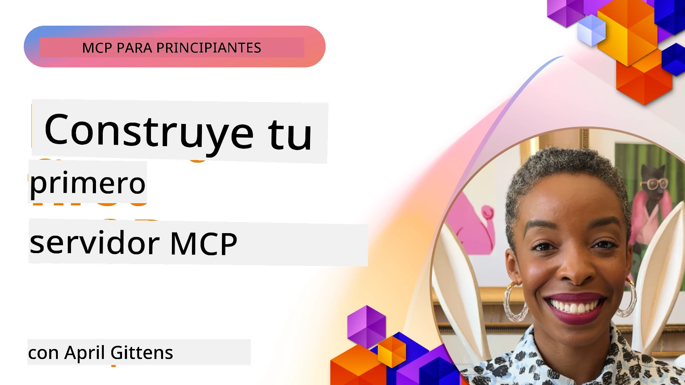

## Comenzando  

_(Haz clic en la imagen de arriba para ver el video de esta lección)_

Esta sección consta de varias lecciones:

- **1 Tu primer servidor**, en esta primera lección aprenderás cómo crear tu primer servidor e inspeccionarlo con la herramienta inspector, una forma valiosa de probar y depurar tu servidor, [a la lección](01-first-server/README.md)

- **2 Cliente**, en esta lección aprenderás cómo escribir un cliente que pueda conectarse a tu servidor, [a la lección](02-client/README.md)

- **3 Cliente con LLM**, una forma aún mejor de escribir un cliente es agregándole un LLM para que pueda "negociar" con tu servidor qué hacer, [a la lección](03-llm-client/README.md)

- **4 Consumiendo un modo Agente de GitHub Copilot en Visual Studio Code**. Aquí, veremos cómo ejecutar nuestro Servidor MCP desde Visual Studio Code, [a la lección](04-vscode/README.md)

- **5 Servidor de transporte stdio** stdio es el estándar recomendado para la comunicación local servidor MCP-cliente, proporcionando comunicación segura basada en subprocesos con aislamiento de procesos incorporado [a la lección](05-stdio-server/README.md)

- **6 Transmisión HTTP con MCP (HTTP transmisible)**. Aprende sobre el transporte moderno de transmisión HTTP (el enfoque recomendado para servidores MCP remotos según [Especificación MCP 2025-11-25](https://spec.modelcontextprotocol.io/specification/2025-11-25/basic/transports/#streamable-http)), notificaciones de progreso, y cómo implementar servidores y clientes MCP escalables en tiempo real usando HTTP transmisible. [a la lección](06-http-streaming/README.md)

- **7 Utilizando AI Toolkit para VSCode** para consumir y probar tus Clientes y Servidores MCP [a la lección](07-aitk/README.md)

- **8 Pruebas**. Aquí nos enfocaremos especialmente en cómo podemos probar nuestro servidor y cliente de diferentes maneras, [a la lección](08-testing/README.md)

- **9 Despliegue**. Este capítulo examinará diferentes maneras de desplegar tus soluciones MCP, [a la lección](09-deployment/README.md)

- **10 Uso avanzado del servidor**. Este capítulo cubre el uso avanzado del servidor, [a la lección](./10-advanced/README.md)

- **11 Autenticación**. Este capítulo cubre cómo agregar autenticación simple, desde Basic Auth hasta usar JWT y RBAC. Te recomendamos comenzar aquí y luego revisar Temas Avanzados en el Capítulo 5 y realizar un endurecimiento adicional de seguridad mediante las recomendaciones en el Capítulo 2, [a la lección](./11-simple-auth/README.md)

- **12 Anfitriones MCP**. Configura y utiliza clientes anfitriones MCP populares incluyendo Claude Desktop, Cursor, Cline y Windsurf. Aprende los tipos de transporte y solución de problemas, [a la lección](./12-mcp-hosts/README.md)

- **13 Inspector MCP**. Depura y prueba tus servidores MCP interactivamente utilizando la herramienta Inspector MCP. Aprende a resolver problemas de herramientas, recursos y mensajes de protocolo, [a la lección](./13-mcp-inspector/README.md)

El Protocolo de Contexto del Modelo (MCP) es un protocolo abierto que estandariza cómo las aplicaciones proporcionan contexto a los LLM. Piensa en MCP como un puerto USB-C para aplicaciones de IA: proporciona una manera estandarizada de conectar modelos de IA a diferentes fuentes de datos y herramientas.

## Objetivos de aprendizaje

Al final de esta lección, podrás:

- Configurar entornos de desarrollo para MCP en C#, Java, Python, TypeScript y JavaScript
- Construir y desplegar servidores MCP básicos con funciones personalizadas (recursos, prompts y herramientas)
- Crear aplicaciones anfitrionas que se conectan a servidores MCP
- Probar y depurar implementaciones MCP
- Entender los desafíos comunes de configuración y sus soluciones
- Conectar tus implementaciones MCP a servicios LLM populares

## Configurando tu entorno MCP

Antes de comenzar a trabajar con MCP, es importante preparar tu entorno de desarrollo y entender el flujo básico de trabajo. Esta sección te guiará a través de los pasos iniciales para asegurar un comienzo fluido con MCP.

### Prerrequisitos

Antes de sumergirte en el desarrollo de MCP, asegúrate de tener:

- **Entorno de desarrollo**: para tu lenguaje elegido (C#, Java, Python, TypeScript o JavaScript)
- **IDE/Editor**: Visual Studio, Visual Studio Code, IntelliJ, Eclipse, PyCharm, o cualquier editor de código moderno
- **Gestores de paquetes**: NuGet, Maven/Gradle, pip, o npm/yarn
- **Claves API**: para cualquier servicio de IA que planees usar en tus aplicaciones anfitrionas

### SDKs oficiales

En los próximos capítulos verás soluciones construidas usando Python, TypeScript, Java y .NET. Aquí están todos los SDK oficiales soportados.

MCP proporciona SDK oficiales para múltiples lenguajes (alineados con [Especificación MCP 2025-11-25](https://spec.modelcontextprotocol.io/specification/2025-11-25/)):
- [SDK C#](https://github.com/modelcontextprotocol/csharp-sdk) - Mantenido en colaboración con Microsoft
- [SDK Java](https://github.com/modelcontextprotocol/java-sdk) - Mantenido en colaboración con Spring AI
- [SDK TypeScript](https://github.com/modelcontextprotocol/typescript-sdk) - La implementación oficial en TypeScript
- [SDK Python](https://github.com/modelcontextprotocol/python-sdk) - La implementación oficial en Python (FastMCP)
- [SDK Kotlin](https://github.com/modelcontextprotocol/kotlin-sdk) - La implementación oficial en Kotlin
- [SDK Swift](https://github.com/modelcontextprotocol/swift-sdk) - Mantenido en colaboración con Loopwork AI
- [SDK Rust](https://github.com/modelcontextprotocol/rust-sdk) - La implementación oficial en Rust
- [SDK Go](https://github.com/modelcontextprotocol/go-sdk) - La implementación oficial en Go

## Puntos clave

- Configurar un entorno de desarrollo MCP es sencillo con SDKs específicos para cada lenguaje
- Construir servidores MCP implica crear y registrar herramientas con esquemas claros
- Los clientes MCP se conectan a servidores y modelos para aprovechar capacidades extendidas
- Las pruebas y la depuración son esenciales para implementaciones MCP confiables
- Las opciones de despliegue varían desde desarrollo local hasta soluciones en la nube

## Práctica

Tenemos un conjunto de ejemplos que complementan los ejercicios que verás en todos los capítulos de esta sección. Además, cada capítulo también tiene sus propios ejercicios y tareas

- [Calculadora Java](./samples/java/calculator/README.md)
- [Calculadora .Net](../../../03-GettingStarted/samples/csharp)
- [Calculadora JavaScript](./samples/javascript/README.md)
- [Calculadora TypeScript](./samples/typescript/README.md)
- [Calculadora Python](../../../03-GettingStarted/samples/python)

## Recursos adicionales

- [Construir agentes usando el Protocolo de Contexto del Modelo en Azure](https://learn.microsoft.com/azure/developer/ai/intro-agents-mcp)
- [MCP remoto con Azure Container Apps (Node.js/TypeScript/JavaScript)](https://learn.microsoft.com/samples/azure-samples/mcp-container-ts/mcp-container-ts/)
- [Agente MCP OpenAI .NET](https://learn.microsoft.com/samples/azure-samples/openai-mcp-agent-dotnet/openai-mcp-agent-dotnet/)

## Qué sigue

Comienza con la primera lección: [Creando tu primer servidor MCP](01-first-server/README.md)

Una vez completes este módulo, continua con: [Módulo 4: Implementación práctica](../04-PracticalImplementation/README.md)

---

<!-- CO-OP TRANSLATOR DISCLAIMER START -->
**Aviso Legal**:
Este documento ha sido traducido utilizando el servicio de traducción automática [Co-op Translator](https://github.com/Azure/co-op-translator). Aunque nos esforzamos por la exactitud, tenga en cuenta que las traducciones automáticas pueden contener errores o inexactitudes. El documento original en su idioma nativo debe considerarse la fuente autorizada. Para información crítica, se recomienda una traducción profesional realizada por humanos. No nos hacemos responsables de cualquier malentendido o interpretación errónea derivada del uso de esta traducción.
<!-- CO-OP TRANSLATOR DISCLAIMER END -->