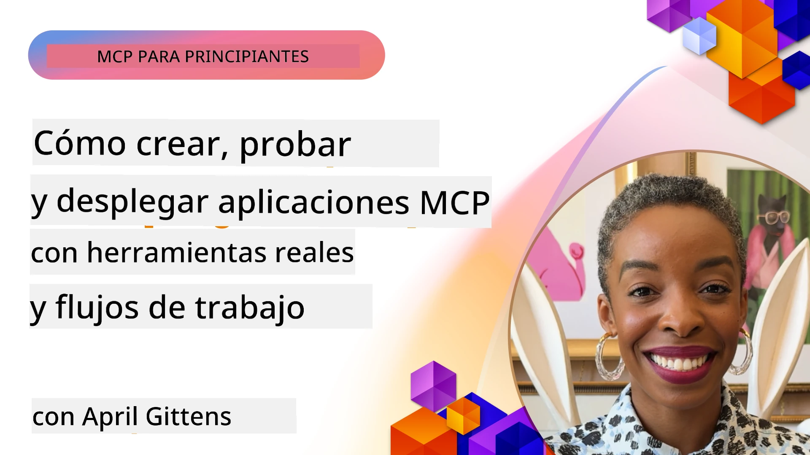
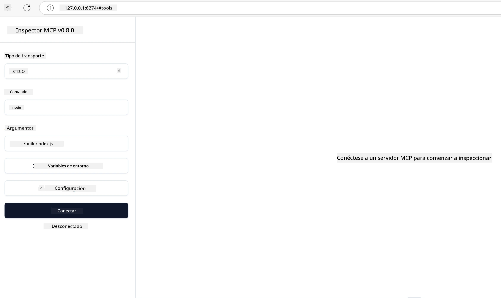

# Implementación Práctica

[](https://youtu.be/vCN9-mKBDfQ)

_(Haz clic en la imagen de arriba para ver el video de esta lección)_

La implementación práctica es donde el poder del Protocolo de Contexto del Modelo (MCP) se vuelve tangible. Aunque entender la teoría y la arquitectura detrás de MCP es importante, el valor real emerge cuando aplicas estos conceptos para construir, probar y desplegar soluciones que resuelven problemas del mundo real. Este capítulo cierra la brecha entre el conocimiento conceptual y el desarrollo práctico, guiándote a través del proceso de dar vida a aplicaciones basadas en MCP.

Ya sea que estés desarrollando asistentes inteligentes, integrando IA en flujos de trabajo empresariales o creando herramientas personalizadas para el procesamiento de datos, MCP proporciona una base flexible. Su diseño independiente del lenguaje y SDKs oficiales para lenguajes de programación populares lo hacen accesible a una amplia gama de desarrolladores. Aprovechando estos SDKs, puedes prototipar, iterar y escalar rápidamente tus soluciones en diferentes plataformas y entornos.

En las secciones siguientes, encontrarás ejemplos prácticos, código de muestra y estrategias de despliegue que demuestran cómo implementar MCP en C#, Java con Spring, TypeScript, JavaScript y Python. También aprenderás a depurar y probar tus servidores MCP, gestionar APIs y desplegar soluciones en la nube usando Azure. Estos recursos prácticos están diseñados para acelerar tu aprendizaje y ayudarte a construir con confianza aplicaciones MCP robustas y listas para producción.

## Visión General

Esta lección se centra en aspectos prácticos de la implementación de MCP en múltiples lenguajes de programación. Exploraremos cómo usar los SDKs de MCP en C#, Java con Spring, TypeScript, JavaScript y Python para construir aplicaciones robustas, depurar y probar servidores MCP, y crear recursos, prompts y herramientas reutilizables.

## Objetivos de Aprendizaje

Al final de esta lección, serás capaz de:

- Implementar soluciones MCP usando SDKs oficiales en varios lenguajes de programación
- Depurar y probar servidores MCP sistemáticamente
- Crear y usar funcionalidades del servidor (Recursos, Prompts y Herramientas)
- Diseñar flujos de trabajo MCP efectivos para tareas complejas
- Optimizar implementaciones MCP para rendimiento y fiabilidad

## Recursos Oficiales de SDK

El Protocolo de Contexto del Modelo ofrece SDKs oficiales para múltiples lenguajes (alineados con [Especificación MCP 2025-11-25](https://spec.modelcontextprotocol.io/specification/2025-11-25/)):

- [SDK de C#](https://github.com/modelcontextprotocol/csharp-sdk)
- [SDK de Java con Spring](https://github.com/modelcontextprotocol/java-sdk) **Nota:** requiere dependencia en [Project Reactor](https://projectreactor.io). (Ver [discusión issue 246](https://github.com/orgs/modelcontextprotocol/discussions/246).)
- [SDK de TypeScript](https://github.com/modelcontextprotocol/typescript-sdk)
- [SDK de Python](https://github.com/modelcontextprotocol/python-sdk)
- [SDK de Kotlin](https://github.com/modelcontextprotocol/kotlin-sdk)
- [SDK de Go](https://github.com/modelcontextprotocol/go-sdk)

## Trabajando con los SDKs de MCP

Esta sección proporciona ejemplos prácticos de implementación de MCP en varios lenguajes de programación. Puedes encontrar código de muestra en el directorio `samples` organizado por lenguaje.

### Muestras Disponibles

El repositorio incluye [implementaciones de muestra](../../../04-PracticalImplementation/samples) en los siguientes lenguajes:

- [C#](./samples/csharp/README.md)
- [Java con Spring](./samples/java/containerapp/README.md)
- [TypeScript](./samples/typescript/README.md)
- [JavaScript](./samples/javascript/README.md)
- [Python](./samples/python/README.md)

Cada muestra demuestra conceptos clave de MCP y patrones de implementación para ese lenguaje y ecosistema específico.

### Guías Prácticas

Guías adicionales para la implementación práctica de MCP:

- [Paginación y conjuntos de resultados grandes](./pagination/README.md) - Maneja paginación basada en cursor para herramientas, recursos y grandes conjuntos de datos

## Funciones Clave del Servidor

Los servidores MCP pueden implementar cualquier combinación de estas características:

### Recursos

Los recursos proporcionan contexto y datos para que el usuario o el modelo de IA los utilice:

- Repositorios de documentos
- Bases de conocimiento
- Fuentes de datos estructurados
- Sistemas de archivos

### Prompts

Los prompts son mensajes y flujos de trabajo con plantillas para usuarios:

- Plantillas de conversación predefinidas
- Patrones de interacción guiada
- Estructuras de diálogo especializadas

### Herramientas

Las herramientas son funciones que el modelo de IA puede ejecutar:

- Utilidades de procesamiento de datos
- Integraciones con APIs externas
- Capacidades computacionales
- Funcionalidad de búsqueda

## Implementaciones de Muestra: Implementación en C#

El repositorio oficial del SDK de C# contiene varias implementaciones de muestra que demuestran diferentes aspectos de MCP:

- **Cliente MCP Básico**: Ejemplo simple que muestra cómo crear un cliente MCP y llamar a herramientas
- **Servidor MCP Básico**: Implementación mínima de servidor con registro básico de herramientas
- **Servidor MCP Avanzado**: Servidor completo con registro de herramientas, autenticación y manejo de errores
- **Integración con ASP.NET**: Ejemplos demostrando integración con ASP.NET Core
- **Patrones de Implementación de Herramientas**: Varios patrones para implementar herramientas con diferentes niveles de complejidad

El SDK de MCP para C# está en vista previa y las APIs pueden cambiar. Actualizaremos este blog de forma continua a medida que el SDK evolucione.

### Características Clave

- [C# MCP Nuget ModelContextProtocol](https://www.nuget.org/packages/ModelContextProtocol)
- Construyendo tu [primer Servidor MCP](https://devblogs.microsoft.com/dotnet/build-a-model-context-protocol-mcp-server-in-csharp/).

Para muestras completas de implementación en C#, visita el [repositorio oficial de muestras del SDK C#](https://github.com/modelcontextprotocol/csharp-sdk)

## Implementación de muestra: Implementación en Java con Spring

El SDK de Java con Spring ofrece opciones robustas de implementación MCP con características de nivel empresarial.

### Características Clave

- Integración con el Framework Spring
- Fuerte tipado seguro
- Soporte para programación reactiva
- Manejo completo de errores

Para una muestra completa de implementación en Java con Spring, consulta [muestra de Java con Spring](samples/java/containerapp/README.md) en el directorio de muestras.

## Implementación de muestra: Implementación en JavaScript

El SDK de JavaScript proporciona un enfoque ligero y flexible para la implementación de MCP.

### Características Clave

- Soporte para Node.js y navegador
- API basada en Promesas
- Integración fácil con Express y otros frameworks
- Soporte para WebSocket para streaming

Para una muestra completa de implementación en JavaScript, consulta [muestra de JavaScript](samples/javascript/README.md) en el directorio de muestras.

## Implementación de muestra: Implementación en Python

El SDK de Python ofrece un enfoque pythonico para la implementación de MCP con excelentes integraciones para frameworks de ML.

### Características Clave

- Soporte async/await con asyncio
- Integración FastAPI
- Registro sencillo de herramientas
- Integración nativa con bibliotecas populares de ML

Para una muestra completa de implementación en Python, consulta [muestra de Python](samples/python/README.md) en el directorio de muestras.

## Gestión de API

Azure API Management es una excelente respuesta para cómo podemos asegurar los Servidores MCP. La idea es poner una instancia de Azure API Management delante de tu Servidor MCP y dejar que maneje funcionalidades que probablemente desees como:

- limitación de tasa
- gestión de tokens
- monitoreo
- balanceo de carga
- seguridad

### Muestra de Azure

Aquí tienes una muestra de Azure haciendo exactamente eso, i.e [creando un Servidor MCP y asegurándolo con Azure API Management](https://github.com/Azure-Samples/remote-mcp-apim-functions-python).

Observa cómo ocurre el flujo de autorización en la imagen a continuación:


En la imagen precedente, sucede lo siguiente:

- La autenticación/autorización ocurre usando Microsoft Entra.
- Azure API Management actúa como una puerta de enlace y usa políticas para dirigir y gestionar el tráfico.
- Azure Monitor registra todas las solicitudes para un análisis posterior.

#### Flujo de autorización

Veamos el flujo de autorización con más detalle:


#### Especificación de autorización MCP

Aprende más sobre la [especificación de Autorización MCP](https://spec.modelcontextprotocol.io/specification/2025-11-25/basic/authorization/)

## Desplegar Servidor MCP Remoto en Azure

Veamos si podemos desplegar la muestra que mencionamos antes:

1. Clona el repositorio

    ```bash
    git clone https://github.com/Azure-Samples/remote-mcp-apim-functions-python.git
    cd remote-mcp-apim-functions-python
    ```

1. Registra el proveedor de recursos `Microsoft.App`.

   - Si usas Azure CLI, ejecuta `az provider register --namespace Microsoft.App --wait`.
   - Si usas Azure PowerShell, ejecuta `Register-AzResourceProvider -ProviderNamespace Microsoft.App`. Luego ejecuta `(Get-AzResourceProvider -ProviderNamespace Microsoft.App).RegistrationState` después de un tiempo para verificar si el registro está completo.

1. Ejecuta este comando [azd](https://aka.ms/azd) para aprovisionar el servicio de gestión de API, la función app (con código) y todos los demás recursos necesarios en Azure

    ```shell
    azd up
    ```

    Este comando debería desplegar todos los recursos en la nube en Azure

### Probar tu servidor con MCP Inspector

1. En una **nueva ventana de terminal**, instala y ejecuta MCP Inspector

    ```shell
    npx @modelcontextprotocol/inspector
    ```

    Deberías ver una interfaz similar a:

    

1. CTRL clic para cargar la aplicación web MCP Inspector desde la URL que muestra la aplicación (e.g. [http://127.0.0.1:6274/#resources](http://127.0.0.1:6274/#resources))
1. Configura el tipo de transporte a `SSE`
1. Establece la URL al endpoint SSE de tu API Management en ejecución que se muestra después de `azd up` y **Conectar**:

    ```shell
    https://<apim-servicename-from-azd-output>.azure-api.net/mcp/sse
    ```

1. **Listar Herramientas**. Haz clic en una herramienta y **Ejecutar Herramienta**.

Si todos los pasos han funcionado, ahora deberías estar conectado al servidor MCP y haber podido llamar a una herramienta.

## Servidores MCP para Azure

[Remote-mcp-functions](https://github.com/Azure-Samples/remote-mcp-functions-dotnet): Este conjunto de repositorios es una plantilla rápida para construir y desplegar servidores remotos MCP (Protocolo de Contexto del Modelo) personalizados usando Azure Functions con Python, C# .NET o Node/TypeScript.

Las muestras proporcionan una solución completa que permite a los desarrolladores:

- Construir y ejecutar localmente: desarrollar y depurar un servidor MCP en una máquina local
- Desplegar en Azure: desplegar fácilmente en la nube con un simple comando azd up
- Conectar desde clientes: conectar al servidor MCP desde varios clientes incluyendo el modo agente Copilot de VS Code y la herramienta MCP Inspector

### Características Clave

- Seguridad por diseño: el servidor MCP está protegido usando claves y HTTPS
- Opciones de autenticación: soporte para OAuth usando autenticación incorporada y/o API Management
- Aislamiento de red: permite aislamiento de red usando Redes Virtuales de Azure (VNET)
- Arquitectura serverless: aprovecha Azure Functions para ejecución escalable y basada en eventos
- Desarrollo local: soporte completo para desarrollo y depuración local
- Despliegue simple: proceso de despliegue optimizado a Azure

El repositorio incluye todos los archivos de configuración, código fuente y definiciones de infraestructura necesarias para comenzar rápidamente con una implementación de servidor MCP lista para producción.

- [Azure Remote MCP Functions Python](https://github.com/Azure-Samples/remote-mcp-functions-python) - Implementación de ejemplo de MCP usando Azure Functions con Python

- [Azure Remote MCP Functions .NET](https://github.com/Azure-Samples/remote-mcp-functions-dotnet) - Implementación de ejemplo de MCP usando Azure Functions con C# .NET

- [Azure Remote MCP Functions Node/Typescript](https://github.com/Azure-Samples/remote-mcp-functions-typescript) - Implementación de ejemplo de MCP usando Azure Functions con Node/TypeScript.

## Puntos Clave

- Los SDKs MCP proporcionan herramientas específicas de lenguaje para implementar soluciones MCP robustas
- El proceso de depuración y prueba es crítico para aplicaciones MCP confiables
- Las plantillas de prompts reutilizables permiten interacciones consistentes con IA
- Los flujos de trabajo bien diseñados pueden orquestar tareas complejas usando múltiples herramientas
- Implementar soluciones MCP requiere considerar seguridad, rendimiento y manejo de errores

## Ejercicio

Diseña un flujo de trabajo MCP práctico que aborde un problema real en tu dominio:

1. Identifica 3-4 herramientas que serían útiles para resolver este problema
2. Crea un diagrama de flujo mostrando cómo estas herramientas interactúan
3. Implementa una versión básica de una de las herramientas usando tu lenguaje preferido
4. Crea una plantilla de prompt que ayude al modelo a usar eficazmente tu herramienta

## Recursos Adicionales

---

## Qué Sigue

Siguiente: [Temas Avanzados](../05-AdvancedTopics/README.md)

---

<!-- CO-OP TRANSLATOR DISCLAIMER START -->
**Aviso legal**:
Este documento ha sido traducido utilizando el servicio de traducción automática [Co-op Translator](https://github.com/Azure/co-op-translator). Aunque nos esforzamos por la precisión, tenga en cuenta que las traducciones automáticas pueden contener errores o inexactitudes. El documento original en su idioma nativo debe considerarse la fuente autorizada. Para información crítica, se recomienda una traducción profesional realizada por humanos. No nos hacemos responsables de malentendidos o interpretaciones erróneas que surjan del uso de esta traducción.
<!-- CO-OP TRANSLATOR DISCLAIMER END -->