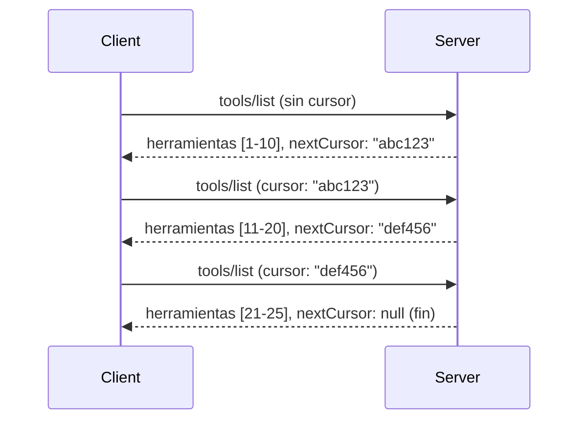

# Paginación y Grandes Conjuntos de Resultados en MCP

Cuando tu servidor MCP maneja grandes conjuntos de datos, ya sea listando miles de archivos, registros de bases de datos o resultados de búsqueda, necesitas la paginación para gestionar la memoria de manera eficiente y proporcionar experiencias de usuario receptivas. Esta guía cubre cómo implementar y usar la paginación en MCP.

## Por Qué Importa la Paginación

Sin paginación, las respuestas grandes pueden causar:

- **Agotamiento de memoria** - Cargar millones de registros a la vez
- **Tiempos de respuesta lentos** - Los usuarios esperan mientras se cargan todos los datos
- **Errores de tiempo de espera** - Las solicitudes superan los límites de tiempo
- **Rendimiento deficiente de IA** - Los LLMs tienen dificultades con contextos masivos

MCP usa **paginación basada en cursor** para un paginado confiable y consistente a través de conjuntos de resultados.

---

## Cómo Funciona la Paginación en MCP

### El Concepto de Cursor

Un **cursor** es una cadena opaca que marca tu posición en un conjunto de resultados. Piénsalo como un marcador en un libro largo.


### Paginación en Métodos MCP

Estos métodos MCP soportan paginación:

| Método | Retorna | Soporte de Cursor |
|--------|---------|-------------------|
| `tools/list` | Definiciones de herramientas | ✅ |
| `resources/list` | Definiciones de recursos | ✅ |
| `prompts/list` | Definiciones de prompts | ✅ |
| `resources/templates/list` | Plantillas de recursos | ✅ |

---

## Implementación en el Servidor

### Python (FastMCP)

```python
from mcp.server import Server
from mcp.types import Tool, ListToolsResult
import math

app = Server("paginated-server")

# Conjunto de datos grande simulado
ALL_TOOLS = [
    Tool(name=f"tool_{i}", description=f"Tool number {i}", inputSchema={})
    for i in range(100)
]

PAGE_SIZE = 10

@app.list_tools()
async def list_tools(cursor: str | None = None) -> ListToolsResult:
    """List tools with pagination support."""
    
    # Decodificar el cursor para obtener el índice inicial
    start_index = 0
    if cursor:
        try:
            start_index = int(cursor)
        except ValueError:
            start_index = 0
    
    # Obtener página de resultados
    end_index = min(start_index + PAGE_SIZE, len(ALL_TOOLS))
    page_tools = ALL_TOOLS[start_index:end_index]
    
    # Calcular el siguiente cursor
    next_cursor = None
    if end_index < len(ALL_TOOLS):
        next_cursor = str(end_index)
    
    return ListToolsResult(
        tools=page_tools,
        nextCursor=next_cursor
    )
```

### TypeScript

```typescript
import { Server } from "@modelcontextprotocol/sdk/server/index.js";
import { ListToolsResultSchema } from "@modelcontextprotocol/sdk/types.js";

const server = new Server({
  name: "paginated-server",
  version: "1.0.0"
});

// Conjunto de datos grande simulado
const ALL_TOOLS = Array.from({ length: 100 }, (_, i) => ({
  name: `tool_${i}`,
  description: `Tool number ${i}`,
  inputSchema: { type: "object", properties: {} }
}));

const PAGE_SIZE = 10;

server.setRequestHandler(ListToolsResultSchema, async (request) => {
  // Decodificar cursor
  let startIndex = 0;
  if (request.params?.cursor) {
    startIndex = parseInt(request.params.cursor, 10) || 0;
  }
  
  // Obtener página de resultados
  const endIndex = Math.min(startIndex + PAGE_SIZE, ALL_TOOLS.length);
  const pageTools = ALL_TOOLS.slice(startIndex, endIndex);
  
  // Calcular siguiente cursor
  const nextCursor = endIndex < ALL_TOOLS.length ? String(endIndex) : undefined;
  
  return {
    tools: pageTools,
    nextCursor
  };
});
```

### Java (Spring MCP)

```java
@Service
public class PaginatedToolService {
    
    private static final int PAGE_SIZE = 10;
    private final List<Tool> allTools;
    
    public PaginatedToolService() {
        // Inicializar conjunto de datos grande
        this.allTools = IntStream.range(0, 100)
            .mapToObj(i -> new Tool("tool_" + i, "Tool number " + i, Map.of()))
            .collect(Collectors.toList());
    }
    
    @McpMethod("tools/list")
    public ListToolsResult listTools(@Param("cursor") String cursor) {
        // Decodificar cursor
        int startIndex = 0;
        if (cursor != null && !cursor.isEmpty()) {
            try {
                startIndex = Integer.parseInt(cursor);
            } catch (NumberFormatException e) {
                startIndex = 0;
            }
        }
        
        // Obtener página de resultados
        int endIndex = Math.min(startIndex + PAGE_SIZE, allTools.size());
        List<Tool> pageTools = allTools.subList(startIndex, endIndex);
        
        // Calcular siguiente cursor
        String nextCursor = endIndex < allTools.size() ? String.valueOf(endIndex) : null;
        
        return new ListToolsResult(pageTools, nextCursor);
    }
}
```

---

## Implementación del Cliente

### Cliente Python

```python
from mcp import ClientSession

async def get_all_tools(session: ClientSession) -> list:
    """Fetch all tools using pagination."""
    all_tools = []
    cursor = None
    
    while True:
        result = await session.list_tools(cursor=cursor)
        all_tools.extend(result.tools)
        
        if result.nextCursor is None:
            break
        cursor = result.nextCursor
    
    return all_tools

# Uso
async with client_session as session:
    tools = await get_all_tools(session)
    print(f"Found {len(tools)} tools")
```

### Cliente TypeScript

```typescript
import { Client } from "@modelcontextprotocol/sdk/client/index.js";

async function getAllTools(client: Client): Promise<Tool[]> {
  const allTools: Tool[] = [];
  let cursor: string | undefined = undefined;
  
  do {
    const result = await client.listTools({ cursor });
    allTools.push(...result.tools);
    cursor = result.nextCursor;
  } while (cursor);
  
  return allTools;
}

// Uso
const tools = await getAllTools(client);
console.log(`Found ${tools.length} tools`);
```

### Patrón de Carga Perezosa

Para conjuntos de datos muy grandes, carga las páginas bajo demanda:

```python
class PaginatedToolIterator:
    """Lazily iterate through paginated tools."""
    
    def __init__(self, session: ClientSession):
        self.session = session
        self.cursor = None
        self.buffer = []
        self.exhausted = False
    
    async def __anext__(self):
        # Devolver desde el búfer si está disponible
        if self.buffer:
            return self.buffer.pop(0)
        
        # Comprobar si hemos agotado todas las páginas
        if self.exhausted:
            raise StopAsyncIteration
        
        # Obtener la siguiente página
        result = await self.session.list_tools(cursor=self.cursor)
        self.buffer = list(result.tools)
        self.cursor = result.nextCursor
        
        if self.cursor is None:
            self.exhausted = True
        
        if not self.buffer:
            raise StopAsyncIteration
        
        return self.buffer.pop(0)
    
    def __aiter__(self):
        return self

# Uso - eficiente en memoria para grandes conjuntos de datos
async for tool in PaginatedToolIterator(session):
    process_tool(tool)
```

---

## Paginación para Recursos

Los recursos a menudo necesitan paginación para directorios o grandes conjuntos de datos:

```python
from mcp.server import Server
from mcp.types import Resource, ListResourcesResult
import os

app = Server("file-server")

@app.list_resources()
async def list_resources(cursor: str | None = None) -> ListResourcesResult:
    """List files in directory with pagination."""
    
    directory = "/data/files"
    all_files = sorted(os.listdir(directory))
    
    # Decodificar cursor (índice de archivo)
    start_index = int(cursor) if cursor else 0
    page_size = 20
    end_index = min(start_index + page_size, len(all_files))
    
    # Crear lista de recursos para esta página
    resources = []
    for filename in all_files[start_index:end_index]:
        filepath = os.path.join(directory, filename)
        resources.append(Resource(
            uri=f"file://{filepath}",
            name=filename,
            mimeType="application/octet-stream"
        ))
    
    # Calcular siguiente cursor
    next_cursor = str(end_index) if end_index < len(all_files) else None
    
    return ListResourcesResult(
        resources=resources,
        nextCursor=next_cursor
    )
```

---

## Estrategias de Diseño de Cursor

### Estrategia 1: Basada en Índice (Simple)

```python
# El cursor es solo el índice
cursor = "50"  # Comenzar en el elemento 50
```

**Ventajas:** Simple, sin estado  
**Desventajas:** Los resultados pueden desplazarse si se agregan o eliminan elementos

### Estrategia 2: Basada en ID (Estable)

```python
# El cursor es el último ID visto
cursor = "item_abc123"  # Comenzar después de este ítem
```

**Ventajas:** Estable incluso si los elementos cambian  
**Desventajas:** Requiere IDs ordenados

### Estrategia 3: Estado Codificado (Compleja)

```python
import base64
import json

def encode_cursor(state: dict) -> str:
    return base64.b64encode(json.dumps(state).encode()).decode()

def decode_cursor(cursor: str) -> dict:
    return json.loads(base64.b64decode(cursor).decode())

# El cursor contiene múltiples campos de estado
cursor = encode_cursor({
    "offset": 50,
    "filter": "active",
    "sort": "name"
})
```

**Ventajas:** Puede codificar estados complejos  
**Desventajas:** Más compleja, cadenas de cursor más grandes

---

## Mejores Prácticas

### 1. Elige Tamaños de Página Adecuados

```python
# Considera el tamaño de los datos
PAGE_SIZE_SMALL_ITEMS = 100   # Metadatos simples
PAGE_SIZE_MEDIUM_ITEMS = 20   # Objetos más ricos
PAGE_SIZE_LARGE_ITEMS = 5     # Contenido complejo
```

### 2. Maneja Cursors Inválidos de Forma Elegante

```python
@app.list_tools()
async def list_tools(cursor: str | None = None) -> ListToolsResult:
    try:
        start_index = int(cursor) if cursor else 0
        if start_index < 0 or start_index >= len(ALL_TOOLS):
            start_index = 0  # Reiniciar al principio
    except (ValueError, TypeError):
        start_index = 0  # Cursor inválido, empezar de nuevo
    # ...
```

### 3. Incluye Conteo Total (Opcional)

```python
return ListToolsResult(
    tools=page_tools,
    nextCursor=next_cursor,
    # Algunas implementaciones incluyen total para el progreso de la interfaz de usuario
    _meta={"total": len(ALL_TOOLS)}
)
```

### 4. Prueba Casos Límite

```python
async def test_pagination():
    # Conjunto de resultados vacío
    result = await session.list_tools()
    assert result.tools == []
    assert result.nextCursor is None
    
    # Página única
    result = await session.list_tools()
    assert len(result.tools) <= PAGE_SIZE
    
    # Cursor inválido
    result = await session.list_tools(cursor="invalid")
    assert result.tools  # Debería devolver la primera página
```

---

## Errores Comunes

### ❌ Retornar Todos los Resultados y Luego Paginarlos en el Cliente

```python
# MALO: Carga todo en la memoria
@app.list_tools()
async def list_tools() -> ListToolsResult:
    all_tools = load_all_tools()  # ¡1 millón de herramientas!
    return ListToolsResult(tools=all_tools)
```

### ✅ Paginación en la Fuente de Datos

```python
# BIEN: Solo carga lo que se necesita
@app.list_tools()
async def list_tools(cursor: str | None = None) -> ListToolsResult:
    offset = int(cursor) if cursor else 0
    tools = await db.query_tools(offset=offset, limit=PAGE_SIZE)
    return ListToolsResult(tools=tools, nextCursor=...)
```

---

## Qué Sigue

- [Módulo 5.14 - Ingeniería de Contexto](../../05-AdvancedTopics/mcp-contextengineering/README.md)
- [Módulo 8 - Mejores Prácticas](../../08-BestPractices/README.md)
- [3.8 - Probando tu Servidor MCP](../../03-GettingStarted/08-testing/README.md)

---

## Recursos Adicionales

- [Especificación MCP - Paginación](https://spec.modelcontextprotocol.io/specification/2025-11-25/)
- [Paginación Basada en Cursor Explicada](https://slack.engineering/evolving-api-pagination-at-slack/)
- [Pruebas de paginación en SDK Python](https://github.com/modelcontextprotocol/python-sdk/blob/main/tests/client/test_list_methods_cursor.py)

---

<!-- CO-OP TRANSLATOR DISCLAIMER START -->
**Aviso legal**:
Este documento ha sido traducido utilizando el servicio de traducción AI [Co-op Translator](https://github.com/Azure/co-op-translator). Aunque nos esforzamos por la precisión, tenga en cuenta que las traducciones automáticas pueden contener errores o inexactitudes. El documento original en su idioma nativo debe considerarse la fuente autoritativa. Para información crítica, se recomienda una traducción profesional realizada por humanos. No nos hacemos responsables de ningún malentendido o interpretación errónea derivada del uso de esta traducción.
<!-- CO-OP TRANSLATOR DISCLAIMER END -->