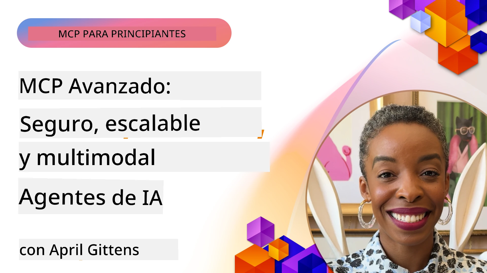

# Temas avanzados en MCP

_(Haz clic en la imagen de arriba para ver el video de esta lección)_

Este capítulo cubre una serie de temas avanzados en la implementación del Protocolo de Contexto de Modelo (MCP), incluyendo integración multimodal, escalabilidad, mejores prácticas de seguridad e integración empresarial. Estos temas son cruciales para construir aplicaciones MCP robustas y listas para producción que puedan satisfacer las demandas de los sistemas modernos de IA.

## Descripción general

Esta lección explora conceptos avanzados en la implementación del Protocolo de Contexto de Modelo, enfocándose en la integración multimodal, escalabilidad, mejores prácticas de seguridad e integración empresarial. Estos temas son esenciales para construir aplicaciones MCP de nivel productivo que puedan manejar requisitos complejos en entornos empresariales.

## Objetivos de aprendizaje

Al final de esta lección, podrás:

- Implementar capacidades multimodales dentro de frameworks MCP
- Diseñar arquitecturas de MCP escalables para escenarios de alta demanda
- Aplicar mejores prácticas de seguridad alineadas con los principios de seguridad de MCP
- Integrar MCP con sistemas y frameworks empresariales de IA
- Optimizar el rendimiento y la fiabilidad en entornos de producción

## Lecciones y proyectos de muestra

| Enlace | Título | Descripción |
|------|-------|-------------|
| [5.1 Integración con Azure](./mcp-integration/README.md) | Integración con Azure | Aprende cómo integrar tu servidor MCP en Azure |
| [5.2 Ejemplo multimodal](./mcp-multi-modality/README.md) | Ejemplos multimodales MCP | Ejemplos para audio, imagen y respuesta multimodal |
| [5.3 Ejemplo MCP OAuth2](../../../05-AdvancedTopics/mcp-oauth2-demo) | Demostración MCP OAuth2 | Aplicación mínima Spring Boot mostrando OAuth2 con MCP, tanto como servidor de autorización como de recursos. Demuestra emisión segura de tokens, endpoints protegidos, despliegue en Azure Container Apps e integración con API Management. |
| [5.4 Contextos raíz](./mcp-root-contexts/README.md) | Contextos raíz | Aprende más sobre el contexto raíz y cómo implementarlo |
| [5.5 Enrutamiento](./mcp-routing/README.md) | Enrutamiento | Aprende diferentes tipos de enrutamiento |
| [5.6 Muestreo](./mcp-sampling/README.md) | Muestreo | Aprende a trabajar con muestreo |
| [5.7 Escalado](./mcp-scaling/README.md) | Escalado | Aprende sobre escalado |
| [5.8 Seguridad](./mcp-security/README.md) | Seguridad | Asegura tu servidor MCP |
| [5.9 Ejemplo búsqueda web](./web-search-mcp/README.md) | Búsqueda web MCP | Servidor y cliente MCP en Python que integran SerpAPI para búsquedas web en tiempo real, noticias, productos y preguntas. Demuestra orquestación multi-herramienta, integración con API externas y manejo robusto de errores. |
| [5.10 Transmisión en tiempo real](./mcp-realtimestreaming/README.md) | Streaming | La transmisión de datos en tiempo real se ha vuelto esencial en el mundo actual orientado a datos, donde negocios y aplicaciones requieren acceso inmediato a información para tomar decisiones oportunas. |
| [5.11 Búsqueda web en tiempo real](./mcp-realtimesearch/README.md) | Búsqueda web | Cómo MCP transforma la búsqueda web en tiempo real proporcionando un enfoque estandarizado para la gestión de contexto entre modelos de IA, motores de búsqueda y aplicaciones. | 
| [5.12 Autenticación Entra ID para servidores MCP](./mcp-security-entra/README.md) | Autenticación Entra ID | Microsoft Entra ID provee una solución robusta de gestión de identidad y acceso basada en la nube, ayudando a asegurar que sólo usuarios y aplicaciones autorizadas interactúen con tu servidor MCP. |
| [5.13 Integración con agente Azure AI Foundry](./mcp-foundry-agent-integration/README.md) | Integración Azure AI Foundry | Aprende cómo integrar servidores Protocolo de Contexto de Modelo con agentes Azure AI Foundry, habilitando una poderosa orquestación de herramientas y capacidades de IA empresarial con conexiones estandarizadas a fuentes de datos externas. |
| [5.14 Ingeniería del contexto](./mcp-contextengineering/README.md) | Ingeniería del contexto | Oportunidades futuras de técnicas de ingeniería del contexto para servidores MCP, incluyendo optimización de contexto, gestión dinámica del contexto y estrategias para ingeniería efectiva de prompts dentro de frameworks MCP. |
| [5.15 Transporte personalizado MCP](./mcp-transport/README.md) | Transporte personalizado | Aprende cómo implementar mecanismos de transporte personalizados para escenarios especializados de comunicación MCP. |
| [5.16 Profundización en características del protocolo](./mcp-protocol-features/README.md) | Características del protocolo | Domina características avanzadas del protocolo incluyendo notificaciones de progreso, cancelación de solicitudes, plantillas de recursos y patrones de manejo de errores. |

> **Nuevo en la especificación MCP 2025-11-25**: La especificación ahora incluye soporte experimental para **Tareas** (operaciones de larga duración con seguimiento de progreso), **Anotaciones de herramientas** (metadatos sobre comportamiento de herramientas para seguridad), **Elicitación de modo URL** (solicitando contenido URL específico de los clientes), y mejoras en **Raíces** (para gestión de contexto de espacios de trabajo). Consulta el [registro de cambios de la especificación MCP](https://spec.modelcontextprotocol.io/) para detalles completos.

## Referencias adicionales

Para obtener la información más actualizada sobre temas avanzados de MCP, consulta:
- [Documentación MCP](https://modelcontextprotocol.io/)
- [Especificación MCP (2025-11-25)](https://spec.modelcontextprotocol.io/specification/2025-11-25/)
- [Repositorio GitHub](https://github.com/modelcontextprotocol)
- [OWASP MCP Top 10](https://microsoft.github.io/mcp-azure-security-guide/mcp/) - Riesgos de seguridad y mitigaciones
- [Taller MCP Security Summit (Sherpa)](https://azure-samples.github.io/sherpa/) - Capacitación práctica en seguridad

## Puntos clave

- Las implementaciones multimodales MCP extienden las capacidades de IA más allá del procesamiento de texto
- La escalabilidad es esencial para despliegues empresariales y puede abordarse mediante escalado horizontal y vertical
- Medidas integrales de seguridad protegen los datos y aseguran el control adecuado de acceso
- La integración empresarial con plataformas como Azure OpenAI y Microsoft AI Foundry potencia las capacidades MCP
- Las implementaciones avanzadas MCP se benefician de arquitecturas optimizadas y una gestión cuidadosa de recursos

## Ejercicio

Diseña una implementación MCP de nivel empresarial para un caso de uso específico:

1. Identifica los requisitos multimodales para tu caso de uso
2. Describe los controles de seguridad necesarios para proteger datos sensibles
3. Diseña una arquitectura escalable que pueda manejar cargas variables
4. Planifica puntos de integración con sistemas empresariales de IA
5. Documenta potenciales cuellos de botella en rendimiento y estrategias de mitigación

## Recursos adicionales

- [Documentación Azure OpenAI](https://learn.microsoft.com/en-us/azure/ai-services/openai/)
- [Documentación Microsoft AI Foundry](https://learn.microsoft.com/en-us/ai-services/)

---

## Qué sigue

Explora las lecciones de este módulo empezando por: [5.1 Integración MCP](./mcp-integration/README.md)

Una vez completes este módulo, continúa con: [Módulo 6: Contribuciones de la comunidad](../06-CommunityContributions/README.md)

---

<!-- CO-OP TRANSLATOR DISCLAIMER START -->
**Descargo de responsabilidad**:  
Este documento ha sido traducido utilizando el servicio de traducción automática [Co-op Translator](https://github.com/Azure/co-op-translator). Aunque nos esforzamos por la precisión, tenga en cuenta que las traducciones automáticas pueden contener errores o inexactitudes. El documento original en su idioma nativo debe considerarse la fuente autorizada. Para información crítica, se recomienda la traducción profesional realizada por humanos. No nos hacemos responsables por malentendidos o interpretaciones erróneas derivadas del uso de esta traducción.
<!-- CO-OP TRANSLATOR DISCLAIMER END -->