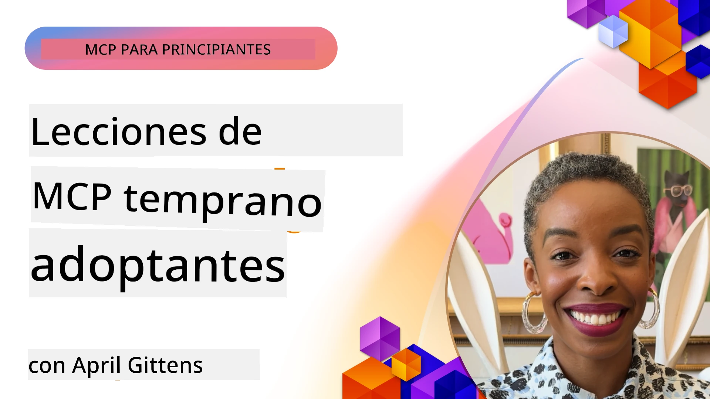

# 🌟 Lecciones de los Primeros Adoptantes

[](https://youtu.be/jds7dSmNptE)

_(Haz clic en la imagen de arriba para ver el video de esta lección)_

## 🎯 Qué Cubre Este Módulo

Este módulo explora cómo organizaciones y desarrolladores reales están aprovechando el Protocolo de Contexto de Modelo (MCP) para resolver desafíos reales e impulsar la innovación. A través de estudios de caso detallados, proyectos prácticos y ejemplos útiles, descubrirás cómo MCP permite una integración de IA segura y escalable que conecta modelos de lenguaje, herramientas y datos empresariales.

### 📚 Ver MCP en Acción

¿Quieres ver estos principios aplicados a herramientas listas para producción? Consulta nuestros [**10 Servidores MCP de Microsoft que Están Transformando la Productividad de Desarrolladores**](microsoft-mcp-servers.md), que presenta servidores MCP reales de Microsoft que puedes usar hoy.

## Resumen

Esta lección explora cómo los primeros adoptantes han aprovechado el Protocolo de Contexto de Modelo (MCP) para resolver desafíos del mundo real y fomentar la innovación en diversas industrias. A través de estudios de caso detallados y proyectos prácticos, verás cómo MCP habilita una integración de IA estándar, segura y escalable: conectando grandes modelos de lenguaje, herramientas y datos empresariales en un marco unificado. Obtendrás experiencia práctica diseñando y construyendo soluciones basadas en MCP, aprenderás de patrones de implementación probados y descubrirás mejores prácticas para desplegar MCP en entornos de producción. La lección también destaca tendencias emergentes, direcciones futuras y recursos de código abierto para ayudarte a mantenerte a la vanguardia de la tecnología MCP y su ecosistema en evolución.

## Objetivos de Aprendizaje

- Analizar implementaciones reales de MCP en distintas industrias
- Diseñar y construir aplicaciones completas basadas en MCP
- Explorar tendencias emergentes y direcciones futuras en la tecnología MCP
- Aplicar mejores prácticas en escenarios reales de desarrollo

## Implementaciones Reales de MCP

### Estudio de Caso 1: Automatización de Soporte al Cliente Empresarial

Una corporación multinacional implementó una solución basada en MCP para estandarizar las interacciones de IA en sus sistemas de soporte al cliente. Esto les permitió:

- Crear una interfaz unificada para múltiples proveedores de LLM
- Mantener una gestión coherente de prompts en todos los departamentos
- Implementar controles robustos de seguridad y cumplimiento
- Cambiar fácilmente entre diferentes modelos de IA según necesidades específicas

**Implementación Técnica:**

```python
# Implementación del servidor MCP en Python para soporte al cliente
import logging
import asyncio
from modelcontextprotocol import create_server, ServerConfig
from modelcontextprotocol.server import MCPServer
from modelcontextprotocol.transports import create_http_transport
from modelcontextprotocol.resources import ResourceDefinition
from modelcontextprotocol.prompts import PromptDefinition
from modelcontextprotocol.tool import ToolDefinition

# Configurar el registro
logging.basicConfig(level=logging.INFO)

async def main():
    # Crear configuración del servidor
    config = ServerConfig(
        name="Enterprise Customer Support Server",
        version="1.0.0",
        description="MCP server for handling customer support inquiries"
    )
    
    # Inicializar el servidor MCP
    server = create_server(config)
    
    # Registrar recursos de la base de conocimiento
    server.resources.register(
        ResourceDefinition(
            name="customer_kb",
            description="Customer knowledge base documentation"
        ),
        lambda params: get_customer_documentation(params)
    )
    
    # Registrar plantillas de prompts
    server.prompts.register(
        PromptDefinition(
            name="support_template",
            description="Templates for customer support responses"
        ),
        lambda params: get_support_templates(params)
    )
    
    # Registrar herramientas de soporte
    server.tools.register(
        ToolDefinition(
            name="ticketing",
            description="Create and update support tickets"
        ),
        handle_ticketing_operations
    )
    
    # Iniciar servidor con transporte HTTP
    transport = create_http_transport(port=8080)
    await server.run(transport)

if __name__ == "__main__":
    asyncio.run(main())
```

**Resultados:** Reducción del 30% en costos de modelos, mejora del 45% en la consistencia de respuestas y mayor cumplimiento en operaciones globales.

### Estudio de Caso 2: Asistente de Diagnóstico en Salud

Un proveedor de salud desarrolló una infraestructura MCP para integrar múltiples modelos médicos especializados de IA, asegurando que los datos sensibles de los pacientes permanecieran protegidos:

- Cambio fluido entre modelos médicos generalistas y especialistas
- Controles estrictos de privacidad y registros de auditoría
- Integración con sistemas existentes de Record Electrónico de Salud (EHR)
- Ingeniería de prompts coherente para terminología médica

**Implementación Técnica:**

```csharp
// C# MCP host application implementation in healthcare application
using Microsoft.Extensions.DependencyInjection;
using ModelContextProtocol.SDK.Client;
using ModelContextProtocol.SDK.Security;
using ModelContextProtocol.SDK.Resources;

public class DiagnosticAssistant
{
    private readonly MCPHostClient _mcpClient;
    private readonly PatientContext _patientContext;
    
    public DiagnosticAssistant(PatientContext patientContext)
    {
        _patientContext = patientContext;
        
        // Configure MCP client with healthcare-specific settings
        var clientOptions = new ClientOptions
        {
            Name = "Healthcare Diagnostic Assistant",
            Version = "1.0.0",
            Security = new SecurityOptions
            {
                Encryption = EncryptionLevel.Medical,
                AuditEnabled = true
            }
        };
        
        _mcpClient = new MCPHostClientBuilder()
            .WithOptions(clientOptions)
            .WithTransport(new HttpTransport("https://healthcare-mcp.example.org"))
            .WithAuthentication(new HIPAACompliantAuthProvider())
            .Build();
    }
    
    public async Task<DiagnosticSuggestion> GetDiagnosticAssistance(
        string symptoms, string patientHistory)
    {
        // Create request with appropriate resources and tool access
        var resourceRequest = new ResourceRequest
        {
            Name = "patient_records",
            Parameters = new Dictionary<string, object>
            {
                ["patientId"] = _patientContext.PatientId,
                ["requestingProvider"] = _patientContext.ProviderId
            }
        };
        
        // Request diagnostic assistance using appropriate prompt
        var response = await _mcpClient.SendPromptRequestAsync(
            promptName: "diagnostic_assistance",
            parameters: new Dictionary<string, object>
            {
                ["symptoms"] = symptoms,
                patientHistory = patientHistory,
                relevantGuidelines = _patientContext.GetRelevantGuidelines()
            });
            
        return DiagnosticSuggestion.FromMCPResponse(response);
    }
}
```

**Resultados:** Mejoras en sugerencias diagnósticas para médicos manteniendo cumplimiento total con HIPAA y reducción significativa de cambios contextuales entre sistemas.

### Estudio de Caso 3: Análisis de Riesgos en Servicios Financieros

Una institución financiera implementó MCP para estandarizar sus procesos de análisis de riesgos en diferentes departamentos:

- Creó una interfaz unificada para modelos de riesgo crediticio, detección de fraudes y riesgo de inversiones
- Implementó controles estrictos de acceso y versionado de modelos
- Aseguró auditabilidad de todas las recomendaciones de IA
- Mantuvo formatos de datos consistentes a través de sistemas diversos

**Implementación Técnica:**

```java
// Servidor MCP de Java para evaluación de riesgo financiero
import org.mcp.server.*;
import org.mcp.security.*;

public class FinancialRiskMCPServer {
    public static void main(String[] args) {
        // Crear servidor MCP con funciones de cumplimiento financiero
        MCPServer server = new MCPServerBuilder()
            .withModelProviders(
                new ModelProvider("risk-assessment-primary", new AzureOpenAIProvider()),
                new ModelProvider("risk-assessment-audit", new LocalLlamaProvider())
            )
            .withPromptTemplateDirectory("./compliance/templates")
            .withAccessControls(new SOCCompliantAccessControl())
            .withDataEncryption(EncryptionStandard.FINANCIAL_GRADE)
            .withVersionControl(true)
            .withAuditLogging(new DatabaseAuditLogger())
            .build();
            
        server.addRequestValidator(new FinancialDataValidator());
        server.addResponseFilter(new PII_RedactionFilter());
        
        server.start(9000);
        
        System.out.println("Financial Risk MCP Server running on port 9000");
    }
}
```

**Resultados:** Mejor cumplimiento regulatorio, ciclos de despliegue de modelos un 40% más rápidos y mayor consistencia en la evaluación de riesgos en departamentos.

### Estudio de Caso 4: Servidor MCP Microsoft Playwright para Automatización de Navegadores

Microsoft desarrolló el [Servidor MCP Playwright](https://github.com/microsoft/playwright-mcp) para habilitar la automatización de navegadores segura y estandarizada mediante el Protocolo de Contexto de Modelo. Este servidor listo para producción permite que agentes de IA y LLMs interactúen con navegadores web de manera controlada, auditable y extensible — habilitando casos de uso como pruebas web automatizadas, extracción de datos y flujos de trabajo de extremo a extremo.

> **🎯 Herramienta Lista para Producción**
> 
> Este estudio de caso muestra un servidor MCP real que puedes usar hoy. Aprende más sobre el Servidor MCP Playwright y otros 9 servidores MCP listos para producción de Microsoft en nuestra [**Guía de Servidores MCP de Microsoft**](microsoft-mcp-servers.md#8--playwright-mcp-server).

**Características Clave:**
- Expone capacidades de automatización de navegadores (navegación, llenado de formularios, captura de pantallas, etc.) como herramientas MCP
- Implementa controles estrictos de acceso y sandboxing para prevenir acciones no autorizadas
- Proporciona registros detallados de auditoría para todas las interacciones con el navegador
- Soporta integración con Azure OpenAI y otros proveedores de LLM para automatización dirigida por agentes
- Alimenta el Agente de Codificación de GitHub Copilot con capacidades de navegación web

**Implementación Técnica:**

```typescript
// TypeScript: Registrando herramientas de automatización del navegador Playwright en un servidor MCP
import { createServer, ToolDefinition } from 'modelcontextprotocol';
import { launch } from 'playwright';

const server = createServer({
  name: 'Playwright MCP Server',
  version: '1.0.0',
  description: 'MCP server for browser automation using Playwright'
});

// Registrar una herramienta para navegar a una URL y capturar una captura de pantalla
server.tools.register(
  new ToolDefinition({
    name: 'navigate_and_screenshot',
    description: 'Navigate to a URL and capture a screenshot',
    parameters: {
      url: { type: 'string', description: 'The URL to visit' }
    }
  }),
  async ({ url }) => {
    const browser = await launch();
    const page = await browser.newPage();
    await page.goto(url);
    const screenshot = await page.screenshot();
    await browser.close();
    return { screenshot };
  }
);

// Iniciar el servidor MCP
server.listen(8080);
```

**Resultados:**

- Permite automatización programática y segura de navegadores para agentes de IA y LLMs
- Reduce el esfuerzo de pruebas manuales y mejora la cobertura de pruebas para aplicaciones web
- Proporciona un marco reutilizable y extensible para integración de herramientas basadas en navegador en entornos empresariales
- Alimenta las capacidades de navegación web de GitHub Copilot

**Referencias:**

- [Repositorio GitHub Servidor MCP Playwright](https://github.com/microsoft/playwright-mcp)
- [Soluciones de IA y Automatización de Microsoft](https://azure.microsoft.com/en-us/products/ai-services/)

### Estudio de Caso 5: Azure MCP – Protocolo de Contexto de Modelo Empresarial como Servicio

Azure MCP Server ([https://aka.ms/azmcp](https://aka.ms/azmcp)) es la implementación gestionada y empresarial del Protocolo de Contexto de Modelo por Microsoft, diseñada para proveer capacidades de servidor MCP escalables, seguras y conformes como servicio en la nube. Azure MCP permite a las organizaciones desplegar, administrar e integrar rápidamente servidores MCP con servicios de Azure AI, datos y seguridad, reduciendo la sobrecarga operativa y acelerando la adopción de IA.

> **🎯 Herramienta Lista para Producción**
> 
> Este es un servidor MCP real que puedes usar hoy. Aprende más sobre el Servidor MCP Azure AI Foundry en nuestra [**Guía de Servidores MCP de Microsoft**](microsoft-mcp-servers.md).

- Hospedaje totalmente gestionado de servidores MCP con escalado, monitoreo y seguridad integrados
- Integración nativa con Azure OpenAI, Azure AI Search y otros servicios Azure
- Autenticación y autorización empresarial vía Microsoft Entra ID
- Soporte para herramientas personalizadas, plantillas de prompts y conectores de recursos
- Cumple con requerimientos empresariales de seguridad y regulaciones

**Implementación Técnica:**

```yaml
# Example: Azure MCP server deployment configuration (YAML)
apiVersion: mcp.microsoft.com/v1
kind: McpServer
metadata:
  name: enterprise-mcp-server
spec:
  modelProviders:
    - name: azure-openai
      type: AzureOpenAI
      endpoint: https://<your-openai-resource>.openai.azure.com/
      apiKeySecret: <your-azure-keyvault-secret>
  tools:
    - name: document_search
      type: AzureAISearch
      endpoint: https://<your-search-resource>.search.windows.net/
      apiKeySecret: <your-azure-keyvault-secret>
  authentication:
    type: EntraID
    tenantId: <your-tenant-id>
  monitoring:
    enabled: true
    logAnalyticsWorkspace: <your-log-analytics-id>
```

**Resultados:**  
- Reducción del tiempo para obtener valor en proyectos empresariales de IA al proveer una plataforma MCP lista para usar y conforme  
- Integración simplificada de LLMs, herramientas y fuentes de datos empresariales  
- Mayor seguridad, observabilidad y eficiencia operativa para cargas de trabajo MCP  
- Mejor calidad de código con prácticas recomendadas del SDK de Azure y patrones actuales de autenticación

**Referencias:**  
- [Documentación Azure MCP](https://aka.ms/azmcp)  
- [Repositorio GitHub Azure MCP Server](https://github.com/Azure/azure-mcp)  
- [Servicios de IA de Azure](https://azure.microsoft.com/en-us/products/ai-services/)  
- [Centro MCP de Microsoft](https://mcp.azure.com)

## Estudio de Caso 6: NLWeb  
MCP (Protocolo de Contexto de Modelo) es un protocolo emergente para que chatbots y asistentes de IA interactúen con herramientas. Cada instancia de NLWeb también es un servidor MCP, que soporta un método principal, ask, usado para hacerle una pregunta a un sitio web en lenguaje natural. La respuesta devuelta utiliza schema.org, un vocabulario ampliamente usado para describir datos web. En términos generales, MCP es a NLWeb como Http es a HTML. NLWeb combina protocolos, formatos Schema.org y código de ejemplo para ayudar a sitios a crear rápidamente estos puntos finales, beneficiando tanto a humanos con interfaces conversacionales, como a máquinas con interacción natural agente a agente.

NLWeb tiene dos componentes distintos.  
- Un protocolo, muy simple para empezar, para interactuar con un sitio en lenguaje natural y un formato que usa json y schema.org para la respuesta devuelta. Consulta la documentación sobre la API REST para más detalles.  
- Una implementación sencilla de (1) que aprovecha el marcado existente, para sitios que pueden abstraerse como listas de ítems (productos, recetas, atracciones, reseñas, etc.). Junto con un conjunto de widgets de interfaz de usuario, los sitios pueden ofrecer interfaces conversacionales a su contenido fácilmente. Consulta la documentación sobre el Ciclo De Vida de una Consulta de Chat para más detalles sobre cómo funciona.

**Referencias:**  
- [Documentación Azure MCP](https://aka.ms/azmcp)  
- [NLWeb](https://github.com/microsoft/NlWeb)

### Estudio de Caso 7: Servidor Azure AI Foundry MCP – Integración de Agentes IA Empresariales

Los servidores Azure AI Foundry MCP demuestran cómo MCP puede usarse para orquestar y gestionar agentes de IA y flujos de trabajo en entornos empresariales. Al integrar MCP con Azure AI Foundry, las organizaciones pueden estandarizar las interacciones de agentes, aprovechar la gestión de flujos de trabajo de Foundry y asegurar despliegues seguros y escalables.

> **🎯 Herramienta Lista para Producción**  
>  
> Este es un servidor MCP real que puedes usar hoy. Aprende más sobre el Servidor Azure AI Foundry MCP en nuestra [**Guía de Servidores MCP de Microsoft**](microsoft-mcp-servers.md#9--azure-ai-foundry-mcp-server).

**Características Clave:**  
- Acceso completo al ecosistema de IA de Azure, incluyendo catálogos de modelos y gestión de despliegues  
- Indexación de conocimiento con Azure AI Search para aplicaciones RAG  
- Herramientas de evaluación para desempeño y aseguramiento de calidad de modelos IA  
- Integración con Azure AI Foundry Catalog y Labs para modelos de investigación avanzada  
- Capacidades de gestión y evaluación de agentes para escenarios de producción

**Resultados:**  
- Prototipado rápido y monitoreo robusto de flujos de trabajo de agentes IA  
- Integración fluida con servicios de IA de Azure para escenarios avanzados  
- Interfaz unificada para construir, desplegar y monitorear pipelines de agentes  
- Mejoras en seguridad, cumplimiento y eficiencia operativa para empresas  
- Aceleración de la adopción de IA manteniendo control sobre procesos complejos dirigidos por agentes

**Referencias:**  
- [Repositorio GitHub Servidor Azure AI Foundry MCP](https://github.com/azure-ai-foundry/mcp-foundry)  
- [Integrando Agentes IA de Azure con MCP (Blog Microsoft Foundry)](https://devblogs.microsoft.com/foundry/integrating-azure-ai-agents-mcp/)

### Estudio de Caso 8: Foundry MCP Playground – Experimentación y Prototipado

El Foundry MCP Playground ofrece un entorno listo para usar para experimentar con servidores MCP e integraciones con Azure AI Foundry. Los desarrolladores pueden prototipar, probar y evaluar rápidamente modelos de IA y flujos de agentes usando recursos del Azure AI Foundry Catalog y Labs. El playground simplifica la configuración, proporciona proyectos de ejemplo y soporta desarrollo colaborativo, facilitando la exploración de mejores prácticas y nuevos escenarios con mínima carga. Es especialmente útil para equipos que quieren validar ideas, compartir experimentos y acelerar el aprendizaje sin necesidad de infraestructura compleja. Al reducir la barrera de entrada, el playground fomenta la innovación y contribuciones comunitarias en el ecosistema MCP y Azure AI Foundry.

**Referencias:**

- [Repositorio GitHub Foundry MCP Playground](https://github.com/azure-ai-foundry/foundry-mcp-playground)

### Estudio de Caso 9: Servidor MCP Microsoft Learn Docs – Acceso a Documentación Impulsada por IA

El Servidor MCP Microsoft Learn Docs es un servicio alojado en la nube que provee asistentes de IA con acceso en tiempo real a la documentación oficial de Microsoft a través del Protocolo de Contexto de Modelo. Este servidor listo para producción se conecta al completo ecosistema Microsoft Learn y habilita búsqueda semántica a través de todas las fuentes oficiales de Microsoft.

> **🎯 Herramienta Lista para Producción**  
>  
> Este es un servidor MCP real que puedes usar hoy. Aprende más sobre el Servidor MCP Microsoft Learn Docs en nuestra [**Guía de Servidores MCP de Microsoft**](microsoft-mcp-servers.md#1--microsoft-learn-docs-mcp-server).

**Características Clave:**  
- Acceso en tiempo real a documentación oficial de Microsoft, documentos de Azure y Microsoft 365  
- Capacidades avanzadas de búsqueda semántica que entienden contexto e intención  
- Información siempre actualizada conforme se publica contenido en Microsoft Learn  
- Cobertura completa de Microsoft Learn, documentación de Azure y fuentes de Microsoft 365  
- Devuelve hasta 10 fragmentos de contenido de alta calidad con títulos y URLs de artículos

**Por Qué es Crítico:**  
- Soluciona el problema de "conocimiento obsoleto de IA" para tecnologías Microsoft  
- Asegura que asistentes IA accedan a las últimas características de .NET, C#, Azure y Microsoft 365  
- Provee información autorizada y de primera mano para generación precisa de código  
- Esencial para desarrolladores que trabajan con tecnologías Microsoft en rápida evolución

**Resultados:**  
- Mejora dramática en la precisión del código generado por IA para tecnologías Microsoft  
- Reducción del tiempo invertido en buscar documentación actual y mejores prácticas  
- Aumento en la productividad del desarrollador con recuperación contextualizada de documentación  
- Integración fluida con workflows de desarrollo sin salir del IDE

**Referencias:**  
- [Repositorio GitHub Servidor MCP Microsoft Learn Docs](https://github.com/MicrosoftDocs/mcp)  
- [Documentación Microsoft Learn](https://learn.microsoft.com/)

## Proyectos Prácticos

### Proyecto 1: Construir un Servidor MCP Multi-Proveedor

**Objetivo:** Crear un servidor MCP que pueda enrutar solicitudes a múltiples proveedores de modelos IA según criterios específicos.

**Requisitos:**

- Soportar al menos tres proveedores de modelos diferentes (ej., OpenAI, Anthropic, modelos locales)  
- Implementar un mecanismo de enrutamiento basado en metadatos de la solicitud  
- Crear un sistema de configuración para manejar credenciales de proveedores  
- Añadir caching para optimizar rendimiento y costos  
- Construir un panel simple para monitorear uso

**Pasos de Implementación:**

1. Configurar la infraestructura básica del servidor MCP  
2. Implementar adaptadores de proveedor para cada servicio de modelo IA  
3. Crear lógica de enrutamiento basada en atributos de la solicitud  
4. Añadir mecanismos de caching para solicitudes frecuentes  
5. Desarrollar el panel de monitoreo  
6. Probar con varios patrones de solicitud

**Tecnologías:** Elige entre Python (.NET/Java/Python según tu preferencia), Redis para caching y un framework web simple para el panel.

### Proyecto 2: Sistema Empresarial de Gestión de Prompts
**Objetivo:** Desarrollar un sistema basado en MCP para gestionar, versionar y desplegar plantillas de prompts en toda una organización.

**Requisitos:**

- Crear un repositorio centralizado para plantillas de prompts
- Implementar el versionado y flujos de aprobación
- Construir capacidades de prueba de plantillas con entradas de ejemplo
- Desarrollar controles de acceso basados en roles
- Crear una API para la recuperación y despliegue de plantillas

**Pasos de implementación:**

1. Diseñar el esquema de base de datos para el almacenamiento de plantillas
2. Crear la API principal para operaciones CRUD de plantillas
3. Implementar el sistema de versionado
4. Construir el flujo de trabajo de aprobación
5. Desarrollar el marco de pruebas
6. Crear una interfaz web sencilla para la gestión
7. Integrar con un servidor MCP

**Tecnologías:** Elija su framework backend preferido, base de datos SQL o NoSQL, y un framework frontend para la interfaz de gestión.

### Proyecto 3: Plataforma de Generación de Contenido Basada en MCP

**Objetivo:** Construir una plataforma de generación de contenido que aproveche MCP para proporcionar resultados consistentes en diferentes tipos de contenido.

**Requisitos:**

- Soportar múltiples formatos de contenido (entradas de blog, redes sociales, textos de marketing)
- Implementar generación basada en plantillas con opciones de personalización
- Crear un sistema de revisión y retroalimentación de contenido
- Rastrear métricas de desempeño del contenido
- Soportar versionado y iteración de contenido

**Pasos de implementación:**

1. Configurar la infraestructura del cliente MCP
2. Crear plantillas para diferentes tipos de contenido
3. Construir la canalización de generación de contenido
4. Implementar el sistema de revisión
5. Desarrollar el sistema de seguimiento de métricas
6. Crear una interfaz de usuario para la gestión de plantillas y generación de contenido

**Tecnologías:** Su lenguaje de programación preferido, framework web y sistema de base de datos.

## Direcciones Futuras para la Tecnología MCP

### Tendencias Emergentes

1. **MCP Multimodal**
   - Expansión de MCP para estandarizar interacciones con modelos de imagen, audio y video
   - Desarrollo de capacidades de razonamiento cruzado-modal
   - Formatos de prompt estandarizados para diferentes modalidades

2. **Infraestructura Federada MCP**
   - Redes MCP distribuidas que pueden compartir recursos entre organizaciones
   - Protocolos estandarizados para el intercambio seguro de modelos
   - Técnicas de computación que preservan la privacidad

3. **Mercados MCP**
   - Ecosistemas para compartir y monetizar plantillas y plugins MCP
   - Procesos de aseguramiento de calidad y certificación
   - Integración con mercados de modelos

4. **MCP para Computación en el Borde**
   - Adaptación de estándares MCP para dispositivos edge con recursos limitados
   - Protocolos optimizados para entornos de baja capacidad de banda ancha
   - Implementaciones especializadas de MCP para ecosistemas IoT

5. **Marcos Regulatorios**
   - Desarrollo de extensiones MCP para cumplimiento regulatorio
   - Rastros de auditoría estandarizados e interfaces de explicabilidad
   - Integración con marcos emergentes de gobernanza de IA

### Soluciones MCP de Microsoft

Microsoft y Azure han desarrollado varios repositorios de código abierto para ayudar a los desarrolladores a implementar MCP en diversos escenarios:

#### Organización Microsoft

1. [playwright-mcp](https://github.com/microsoft/playwright-mcp) - Servidor MCP Playwright para automatización y pruebas de navegador
2. [files-mcp-server](https://github.com/microsoft/files-mcp-server) - Implementación de servidor MCP para OneDrive para pruebas locales y contribución comunitaria
3. [NLWeb](https://github.com/microsoft/NlWeb) - NLWeb es una colección de protocolos abiertos y herramientas de código abierto asociadas. Su enfoque principal es establecer una capa fundamental para el Web de IA

#### Organización Azure-Samples

1. [mcp](https://github.com/Azure-Samples/mcp) - Enlaces a ejemplos, herramientas y recursos para construir e integrar servidores MCP en Azure usando múltiples lenguajes
2. [mcp-auth-servers](https://github.com/Azure-Samples/mcp-auth-servers) - Servidores MCP de referencia que demuestran autenticación con la especificación actual del Model Context Protocol
3. [remote-mcp-functions](https://github.com/Azure-Samples/remote-mcp-functions) - Página de inicio para implementaciones de servidores MCP remotos en Azure Functions con enlaces a repositorios por lenguaje
4. [remote-mcp-functions-python](https://github.com/Azure-Samples/remote-mcp-functions-python) - Plantilla rápida para construir y desplegar servidores MCP remotos personalizados usando Azure Functions con Python
5. [remote-mcp-functions-dotnet](https://github.com/Azure-Samples/remote-mcp-functions-dotnet) - Plantilla rápida para construir y desplegar servidores MCP remotos personalizados usando Azure Functions con .NET/C#
6. [remote-mcp-functions-typescript](https://github.com/Azure-Samples/remote-mcp-functions-typescript) - Plantilla rápida para construir y desplegar servidores MCP remotos personalizados usando Azure Functions con TypeScript
7. [remote-mcp-apim-functions-python](https://github.com/Azure-Samples/remote-mcp-apim-functions-python) - Gestión de API de Azure como Puerta de Enlace AI para servidores MCP remotos usando Python
8. [AI-Gateway](https://github.com/Azure-Samples/AI-Gateway) - Experimentos APIM ❤️ AI que incluyen capacidades MCP, integrando Azure OpenAI y AI Foundry

Estos repositorios proveen diversas implementaciones, plantillas y recursos para trabajar con el Model Context Protocol en diferentes lenguajes de programación y servicios de Azure. Cubren un rango de casos de uso desde implementaciones básicas de servidor hasta autenticación, despliegue en la nube, y escenarios de integración empresarial.

#### Directorio de Recursos MCP

El [directorio de recursos MCP](https://github.com/microsoft/mcp/tree/main/Resources) en el repositorio oficial MCP de Microsoft ofrece una colección seleccionada de recursos de muestra, plantillas de prompt y definiciones de herramientas para uso con servidores Model Context Protocol. Este directorio está diseñado para ayudar a desarrolladores a comenzar rápidamente con MCP ofreciendo bloques reutilizables y ejemplos de mejores prácticas para:

- **Plantillas de Prompt:** Plantillas listas para usar para tareas y escenarios comunes de IA, que pueden adaptarse para sus propias implementaciones de servidores MCP.
- **Definiciones de Herramientas:** Esquemas de herramientas de ejemplo y metadatos para estandarizar la integración e invocación de herramientas entre diferentes servidores MCP.
- **Recursos de Muestra:** Definiciones de recursos de ejemplo para conectar a fuentes de datos, APIs y servicios externos dentro del marco MCP.
- **Implementaciones de Referencia:** Ejemplos prácticos que demuestran cómo estructurar y organizar recursos, prompts y herramientas en proyectos MCP reales.

Estos recursos aceleran el desarrollo, promueven la estandarización y ayudan a garantizar las mejores prácticas al construir y desplegar soluciones basadas en MCP.

#### Directorio de Recursos MCP

- [Recursos MCP (Prompts de Ejemplo, Herramientas y Definiciones de Recursos)](https://github.com/microsoft/mcp/tree/main/Resources)

### Oportunidades de Investigación

- Técnicas eficientes de optimización de prompts dentro de frameworks MCP
- Modelos de seguridad para despliegues MCP multi-inquilino
- Benchmarking de rendimiento en diferentes implementaciones MCP
- Métodos de verificación formal para servidores MCP

## Conclusión

El Model Context Protocol (MCP) está moldeando rápidamente el futuro de una integración de IA estandarizada, segura e interoperable en múltiples industrias. A través de los estudios de caso y proyectos prácticos en esta lección, has visto cómo los primeros adoptantes — incluyendo Microsoft y Azure — están aprovechando MCP para resolver desafíos reales, acelerar la adopción de IA y asegurar cumplimiento, seguridad y escalabilidad. El enfoque modular de MCP permite a las organizaciones conectar modelos de lenguaje grandes, herramientas y datos empresariales en un marco unificado y auditable. A medida que MCP continúa evolucionando, mantenerse comprometido con la comunidad, explorar recursos de código abierto y aplicar mejores prácticas serán clave para construir soluciones de IA robustas y preparadas para el futuro.

## Recursos Adicionales

- [Repositorio MCP Foundry en GitHub](https://github.com/azure-ai-foundry/mcp-foundry)
- [Foundry MCP Playground](https://github.com/azure-ai-foundry/foundry-mcp-playground)
- [Integrando Agentes Azure AI con MCP (Blog Microsoft Foundry)](https://devblogs.microsoft.com/foundry/integrating-azure-ai-agents-mcp/)
- [Repositorio MCP en GitHub (Microsoft)](https://github.com/microsoft/mcp)
- [Directorio de Recursos MCP (Prompts de Ejemplo, Herramientas y Definiciones de Recursos)](https://github.com/microsoft/mcp/tree/main/Resources)
- [Comunidad y Documentación MCP](https://modelcontextprotocol.io/introduction)
- [Especificación MCP (2025-11-25)](https://spec.modelcontextprotocol.io/specification/2025-11-25/)
- [Documentación Azure MCP](https://aka.ms/azmcp)
- [OWASP MCP Top 10](https://microsoft.github.io/mcp-azure-security-guide/mcp/) - Mejores prácticas de seguridad
- [Repositorio Playwright MCP Server en GitHub](https://github.com/microsoft/playwright-mcp)
- [Servidor Files MCP (OneDrive)](https://github.com/microsoft/files-mcp-server)
- [Azure-Samples MCP](https://github.com/Azure-Samples/mcp)
- [Servidores MCP Auth (Azure-Samples)](https://github.com/Azure-Samples/mcp-auth-servers)
- [Funciones MCP Remotas (Azure-Samples)](https://github.com/Azure-Samples/remote-mcp-functions)
- [Funciones MCP Remotas Python (Azure-Samples)](https://github.com/Azure-Samples/remote-mcp-functions-python)
- [Funciones MCP Remotas .NET (Azure-Samples)](https://github.com/Azure-Samples/remote-mcp-functions-dotnet)
- [Funciones MCP Remotas TypeScript (Azure-Samples)](https://github.com/Azure-Samples/remote-mcp-functions-typescript)
- [Funciones MCP APIM Python (Azure-Samples)](https://github.com/Azure-Samples/remote-mcp-apim-functions-python)
- [AI-Gateway (Azure-Samples)](https://github.com/Azure-Samples/AI-Gateway)
- [Soluciones de IA y Automatización de Microsoft](https://azure.microsoft.com/en-us/products/ai-services/)

## Ejercicios

1. Analiza uno de los estudios de caso y propone un enfoque alternativo de implementación.
2. Elige una de las ideas de proyecto y crea una especificación técnica detallada.
3. Investiga una industria no cubierta en los estudios de caso y describe cómo MCP podría abordar sus desafíos específicos.
4. Explora una de las direcciones futuras y crea un concepto para una nueva extensión MCP que la soporte.

## Qué Sigue

Explora más: [Servidores MCP de Microsoft](./microsoft-mcp-servers.md)

Continúa a: [Módulo 8: Mejores Prácticas](../08-BestPractices/README.md)

---

<!-- CO-OP TRANSLATOR DISCLAIMER START -->
**Aviso**:  
Este documento ha sido traducido utilizando el servicio de traducción automática [Co-op Translator](https://github.com/Azure/co-op-translator). Aunque nos esforzamos por la precisión, tenga en cuenta que las traducciones automáticas pueden contener errores o inexactitudes. El documento original en su idioma nativo debe considerarse la fuente autorizada. Para información crítica, se recomienda una traducción profesional realizada por un humano. No nos hacemos responsables por malentendidos o interpretaciones erróneas derivadas del uso de esta traducción.
<!-- CO-OP TRANSLATOR DISCLAIMER END -->