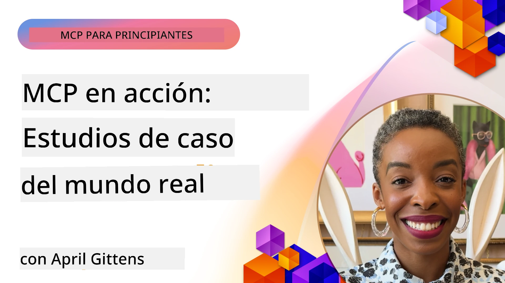

# MCP en Acción: Estudios de Caso del Mundo Real

_(Haz clic en la imagen de arriba para ver el video de esta lección)_

El Protocolo de Contexto de Modelos (MCP) está transformando cómo las aplicaciones de IA interactúan con datos, herramientas y servicios. Esta sección presenta estudios de caso del mundo real que demuestran aplicaciones prácticas de MCP en diversos escenarios empresariales.

## Resumen

Esta sección muestra ejemplos concretos de implementaciones de MCP, resaltando cómo las organizaciones están utilizando este protocolo para resolver desafíos empresariales complejos. Al examinar estos estudios de caso, obtendrás información sobre la versatilidad, escalabilidad y beneficios prácticos de MCP en escenarios reales.

## Objetivos clave de aprendizaje

Al explorar estos estudios de caso, podrás:

- Entender cómo se puede aplicar MCP para resolver problemas empresariales específicos
- Conocer diferentes patrones de integración y enfoques arquitectónicos
- Reconocer las mejores prácticas para implementar MCP en entornos empresariales
- Obtener información sobre los desafíos y soluciones encontrados en implementaciones reales
- Identificar oportunidades para aplicar patrones similares en tus propios proyectos

## Estudios de Caso Destacados

### 1. [Agentes de Viaje AI en Azure – Implementación de Referencia](./travelagentsample.md)

Este estudio de caso examina la solución integral de referencia de Microsoft que demuestra cómo construir una aplicación de planificación de viajes con múltiples agentes impulsada por IA usando MCP, Azure OpenAI y Azure AI Search. El proyecto muestra:

- Orquestación multi-agente a través de MCP
- Integración de datos empresariales con Azure AI Search
- Arquitectura segura y escalable usando servicios de Azure
- Herramientas extensibles con componentes MCP reutilizables
- Experiencia conversacional del usuario potenciada por Azure OpenAI

La arquitectura y detalles de implementación ofrecen valiosos conocimientos para construir sistemas complejos de múltiples agentes con MCP como capa de coordinación.

### 2. [Actualización de Elementos de Azure DevOps desde Datos de YouTube](./UpdateADOItemsFromYT.md)

Este estudio de caso demuestra una aplicación práctica de MCP para automatizar procesos de flujo de trabajo. Muestra cómo se pueden usar herramientas MCP para:

- Extraer datos desde plataformas en línea (YouTube)
- Actualizar elementos de trabajo en sistemas Azure DevOps
- Crear flujos de trabajo de automatización repetibles
- Integrar datos entre sistemas dispares

Este ejemplo ilustra cómo incluso implementaciones relativamente simples de MCP pueden proporcionar ganancias significativas en eficiencia al automatizar tareas rutinarias y mejorar la consistencia de datos entre sistemas.

### 3. [Recuperación de Documentación en Tiempo Real con MCP](./docs-mcp/README.md)

Este estudio de caso te guía para conectar un cliente de consola Python a un servidor MCP para recuperar y registrar documentación de Microsoft en tiempo real, con contexto. Aprenderás a:

- Conectarte a un servidor MCP usando un cliente Python y el SDK oficial MCP
- Usar clientes HTTP de transmisión para recuperación eficiente y en tiempo real de datos
- Llamar a herramientas de documentación en el servidor y registrar respuestas directamente en la consola
- Integrar documentación actualizada de Microsoft en tu flujo de trabajo sin salir del terminal

El capítulo incluye una tarea práctica, un ejemplo mínimo de código funcional y enlaces a recursos adicionales para un aprendizaje más profundo. Consulta el recorrido completo y el código en el capítulo enlazado para comprender cómo MCP puede transformar el acceso a documentación y la productividad de desarrolladores en entornos de consola.

### 4. [Aplicación Web Interactiva Generadora de Planes de Estudio con MCP](./docs-mcp/README.md)

Este estudio de caso demuestra cómo construir una aplicación web interactiva usando Chainlit y el Protocolo de Contexto de Modelos (MCP) para generar planes de estudio personalizados para cualquier tema. Los usuarios pueden especificar un tema (por ejemplo, "certificación AI-900") y una duración de estudio (por ejemplo, 8 semanas), y la app proporcionará un desglose semanal con contenido recomendado. Chainlit permite una interfaz de chat conversacional, haciendo la experiencia atractiva y adaptable.

- Aplicación web conversacional potenciada por Chainlit
- Indicaciones del usuario para tema y duración
- Recomendaciones de contenido semana a semana usando MCP
- Respuestas adaptativas en tiempo real en una interfaz de chat

El proyecto ilustra cómo se puede combinar la IA conversacional y MCP para crear herramientas educativas dinámicas y guiadas por el usuario en un entorno web moderno.

### 5. [Documentación en el Editor con Servidor MCP en VS Code](./docs-mcp/README.md)

Este estudio de caso demuestra cómo llevar Microsoft Learn Docs directamente a tu entorno VS Code usando el servidor MCP—¡no más cambiar entre pestañas del navegador! Verás cómo:

- Buscar y leer documentación instantáneamente dentro de VS Code usando el panel MCP o la paleta de comandos
- Referenciar documentación e insertar enlaces directamente en archivos README o markdown de cursos
- Usar GitHub Copilot y MCP juntos para flujos de trabajo de documentación y código con IA sin interrupciones
- Validar y mejorar tu documentación con retroalimentación en tiempo real y precisión proveniente de Microsoft
- Integrar MCP con flujos de trabajo de GitHub para validación continua de documentación

La implementación incluye:

- Configuración de ejemplo `.vscode/mcp.json` para fácil instalación
- Recorridos con capturas de pantalla de la experiencia dentro del editor
- Consejos para combinar Copilot y MCP para productividad máxima

Este escenario es ideal para autores de cursos, redactores de documentación y desarrolladores que desean mantenerse enfocados en su editor mientras trabajan con docs, Copilot y herramientas de validación—todo potenciado por MCP.

### 6. [Creación de Servidor MCP con APIM](./apimsample.md)

Este estudio de caso proporciona una guía paso a paso sobre cómo crear un servidor MCP usando Azure API Management (APIM). Cubre:

- Configuración de un servidor MCP en Azure API Management
- Exposición de operaciones de API como herramientas MCP
- Configuración de políticas para limitación de tasa y seguridad
- Pruebas del servidor MCP usando Visual Studio Code y GitHub Copilot

Este ejemplo ilustra cómo aprovechar las capacidades de Azure para crear un servidor MCP robusto que puede ser usado en diversas aplicaciones, mejorando la integración de sistemas de IA con APIs empresariales.

### 7. [Registro MCP de GitHub — Acelerando la Integración Agencial](https://github.com/mcp)

Este estudio de caso examina cómo el Registro MCP de GitHub, lanzado en septiembre de 2025, resuelve un desafío crítico en el ecosistema de IA: el descubrimiento y despliegue fragmentado de servidores MCP.

#### Resumen
El **Registro MCP** soluciona el problema creciente de servidores MCP dispersos entre repositorios y registros, que anteriormente hacía que la integración fuera lenta y propensa a errores. Estos servidores permiten que agentes de IA interactúen con sistemas externos como APIs, bases de datos y fuentes de documentación.

#### Declaración del Problema
Los desarrolladores que construyen flujos de trabajo agenciales enfrentaban varios desafíos:
- **Baja descubribilidad** de servidores MCP en distintas plataformas
- **Preguntas redundantes de configuración** dispersas en foros y documentación
- **Riesgos de seguridad** por fuentes no verificadas y no confiables
- **Falta de estandarización** en calidad y compatibilidad de servidores

#### Arquitectura de la Solución
El Registro MCP de GitHub centraliza servidores MCP confiables con características clave:
- **Instalación con un clic** vía VS Code para configuración simplificada
- **Ordenación señal-ruido** basada en estrellas, actividad y validación comunitaria
- **Integración directa** con GitHub Copilot y otras herramientas compatibles con MCP
- **Modelo de contribución abierta** que permite aportes de comunidad y socios empresariales

#### Impacto Comercial
El registro ha entregado mejoras medibles:
- **Incorporación más rápida** para desarrolladores usando herramientas como el Servidor MCP de Microsoft Learn, que transmite documentación oficial directamente a agentes
- **Mayor productividad** mediante servidores especializados como `github-mcp-server`, que facilita la automatización en lenguaje natural de GitHub (creación de PR, reejecución de CI, escaneo de código)
- **Confianza más sólida en el ecosistema** mediante listados curados y estándares transparentes de configuración

#### Valor Estratégico
Para practicantes especializados en gestión del ciclo de vida de agentes y flujos de trabajo reproducibles, el Registro MCP ofrece:
- **Capacidades modulares de despliegue de agentes** con componentes estandarizados
- **Pipelines de evaluación respaldados por el registro** para pruebas y validación consistentes
- **Interoperabilidad entre herramientas** que permite integración fluida entre distintas plataformas de IA

Este estudio de caso demuestra que el Registro MCP es más que un directorio: es una plataforma fundamental para la integración escalable de modelos y despliegue de sistemas agenciales en el mundo real.

## Conclusión

Estos siete estudios de caso integrales demuestran la notable versatilidad y aplicaciones prácticas del Protocolo de Contexto de Modelos en diversos escenarios reales. Desde sistemas complejos de planificación de viajes con múltiples agentes y gestión empresarial de APIs, hasta flujos de trabajo de documentación optimizados y el revolucionario Registro MCP de GitHub, estos ejemplos muestran cómo MCP ofrece una manera estandarizada y escalable para conectar sistemas de IA con las herramientas, datos y servicios que necesitan para entregar un valor excepcional.

Los estudios de caso abarcan múltiples dimensiones de la implementación MCP:
- **Integración Empresarial**: Azure API Management y automatización de Azure DevOps
- **Orquestación Multi-Agente**: Planificación de viajes con agentes AI coordinados
- **Productividad del Desarrollador**: Integración con VS Code y acceso en tiempo real a documentación
- **Desarrollo del Ecosistema**: Registro MCP de GitHub como plataforma fundamental
- **Aplicaciones Educativas**: Generadores de planes de estudio interactivos e interfaces conversacionales

Al estudiar estas implementaciones, obtienes perspectivas críticas sobre:
- **Patrones arquitectónicos** para diferentes escalas y casos de uso
- **Estrategias de implementación** que equilibran funcionalidad y mantenibilidad
- **Consideraciones de seguridad y escalabilidad** para despliegues en producción
- **Mejores prácticas** para desarrollo de servidores MCP e integración de clientes
- **Pensamiento de ecosistema** para construir soluciones interconectadas potenciadas por IA

Estos ejemplos demuestran colectivamente que MCP no es solo un marco teórico, sino un protocolo maduro y listo para producción que posibilita soluciones prácticas a desafíos empresariales complejos. Ya sea que construyas herramientas simples de automatización o sistemas sofisticados de múltiples agentes, los patrones y enfoques aquí ilustrados proveen una base sólida para tus propios proyectos MCP.

## Recursos Adicionales

- [Repositorio GitHub Agentes de Viaje AI en Azure](https://github.com/Azure-Samples/azure-ai-travel-agents)
- [Herramienta MCP para Azure DevOps](https://github.com/microsoft/azure-devops-mcp)
- [Herramienta MCP Playwright](https://github.com/microsoft/playwright-mcp)
- [Servidor MCP Documentación Microsoft](https://github.com/MicrosoftDocs/mcp)
- [Registro MCP GitHub — Acelerando la Integración Agencial](https://github.com/mcp)
- [Ejemplos Comunitarios MCP](https://github.com/microsoft/mcp)

## Qué Sigue

- Anterior: [Módulo 8: Mejores Prácticas](../08-BestPractices/README.md)
- Siguiente: [Módulo 10: Simplificando Flujos de Trabajo de IA: Construcción de un Servidor MCP con AI Toolkit](../10-StreamliningAIWorkflowsBuildingAnMCPServerWithAIToolkit/README.md)

---

<!-- CO-OP TRANSLATOR DISCLAIMER START -->
**Aviso legal**:  
Este documento ha sido traducido utilizando el servicio de traducción AI [Co-op Translator](https://github.com/Azure/co-op-translator). Aunque nos esforzamos por la precisión, tenga en cuenta que las traducciones automáticas pueden contener errores o inexactitudes. El documento original en su idioma nativo debe considerarse la fuente autorizada. Para información crítica, se recomienda la traducción profesional humana. No nos responsabilizamos de ningún malentendido o interpretación errónea derivada del uso de esta traducción.
<!-- CO-OP TRANSLATOR DISCLAIMER END -->