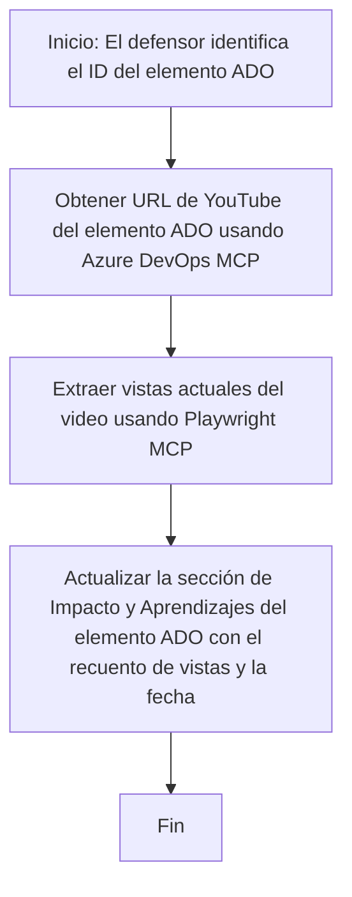

# Estudio de Caso: Actualización de Elementos de Azure DevOps con Datos de YouTube usando MCP

> **Aviso:** Existen herramientas y reportes en línea que pueden automatizar el proceso de actualización de elementos de Azure DevOps con datos de plataformas como YouTube. El siguiente escenario se ofrece únicamente como un caso de uso ejemplo para ilustrar cómo se pueden aplicar las herramientas MCP para tareas de automatización e integración.

## Resumen

Este estudio de caso muestra un ejemplo de cómo el Protocolo de Contexto de Modelo (MCP) y sus herramientas pueden usarse para automatizar el proceso de actualizar elementos de trabajo de Azure DevOps (ADO) con información obtenida de plataformas en línea, como YouTube. El escenario descrito es solo una ilustración de las capacidades más amplias de estas herramientas, que pueden adaptarse a muchas necesidades similares de automatización.

En este ejemplo, un Advocate realiza seguimiento de sesiones en línea usando elementos ADO, donde cada elemento incluye una URL de un video de YouTube. Mediante el uso de las herramientas MCP, el Advocate puede mantener actualizados los elementos ADO con las métricas más recientes de los videos, como el número de visualizaciones, de forma repetible y automatizada. Este enfoque puede generalizarse a otros casos en los que se necesite integrar información de fuentes en línea en ADO u otros sistemas.

## Escenario

Un Advocate es responsable de hacer seguimiento al impacto de sesiones en línea y compromisos con la comunidad. Cada sesión se registra como un elemento de trabajo ADO en el proyecto 'DevRel', y el elemento contiene un campo para la URL del video de YouTube. Para reportar con precisión el alcance de la sesión, el Advocate necesita actualizar el elemento ADO con el número actual de visualizaciones del video y la fecha en que se obtuvo esta información.

## Herramientas usadas

- [Azure DevOps MCP](https://github.com/microsoft/azure-devops-mcp): Permite acceso y actualizaciones programáticas a elementos de trabajo ADO vía MCP.
- [Playwright MCP](https://github.com/microsoft/playwright-mcp): Automatiza acciones del navegador para extraer datos en vivo de páginas web, como estadísticas de videos de YouTube.

## Flujo de trabajo paso a paso

1. **Identificar el elemento ADO**: Comenzar con el ID del elemento de trabajo ADO (por ejemplo, 1234) en el proyecto 'DevRel'.
2. **Recuperar la URL de YouTube**: Usar la herramienta Azure DevOps MCP para obtener la URL de YouTube del elemento de trabajo.
3. **Extraer visualizaciones del video**: Usar la herramienta Playwright MCP para navegar a la URL de YouTube y extraer la cantidad actual de visualizaciones.
4. **Actualizar el elemento ADO**: Escribir la cantidad más reciente de visualizaciones y la fecha de obtención en la sección 'Impacto y Aprendizajes' del elemento ADO usando la herramienta Azure DevOps MCP.

## Ejemplo de Prompt

```bash
- Work with the ADO Item ID: 1234
- The project is '2025-Awesome'
- Get the YouTube URL for the ADO item
- Use Playwright to get the current views from the YouTube video
- Update the ADO item with the current video views and the updated date of the information
```

## Diagrama de flujo Mermaid


## Implementación técnica

- **Orquestación MCP**: El flujo de trabajo es orquestado por un servidor MCP, que coordina el uso de las herramientas Azure DevOps MCP y Playwright MCP.
- **Automatización**: El proceso puede activarse manualmente o programarse para ejecutarse a intervalos regulares para mantener actualizados los elementos ADO.
- **Extensibilidad**: El mismo patrón puede extenderse para actualizar elementos ADO con otras métricas en línea (por ejemplo, likes, comentarios) o de otras plataformas.

## Resultados e impacto

- **Eficiencia**: Reduce el esfuerzo manual de los Advocates al automatizar la obtención y actualización de métricas de videos.
- **Precisión**: Garantiza que los elementos ADO reflejen los datos más actuales disponibles de fuentes en línea.
- **Repetibilidad**: Proporciona un flujo de trabajo reutilizable para escenarios similares que involucren otras fuentes o métricas de datos.

## Referencias

- [Azure DevOps MCP](https://github.com/microsoft/azure-devops-mcp)
- [Playwright MCP](https://github.com/microsoft/playwright-mcp)
- [Model Context Protocol (MCP)](https://modelcontextprotocol.io/)

## Qué sigue

- Volver a: [Estudios de Caso - Resumen](./README.md)
- Siguiente: [Recuperación de Documentación en Tiempo Real con MCP](./docs-mcp/README.md)

---

<!-- CO-OP TRANSLATOR DISCLAIMER START -->
**Aviso legal**:  
Este documento ha sido traducido utilizando el servicio de traducción por IA [Co-op Translator](https://github.com/Azure/co-op-translator). Aunque nos esforzamos por la precisión, tenga en cuenta que las traducciones automáticas pueden contener errores o inexactitudes. El documento original en su idioma nativo debe considerarse la fuente autorizada. Para información crítica, se recomienda una traducción profesional humana. No nos hacemos responsables de ningún malentendido o interpretación errónea derivada del uso de esta traducción.
<!-- CO-OP TRANSLATOR DISCLAIMER END -->