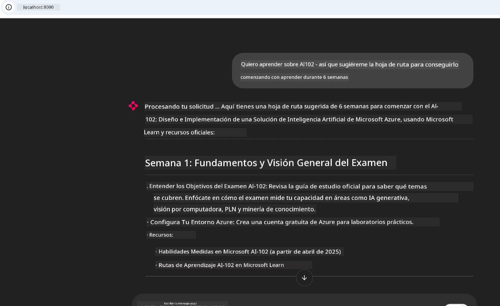
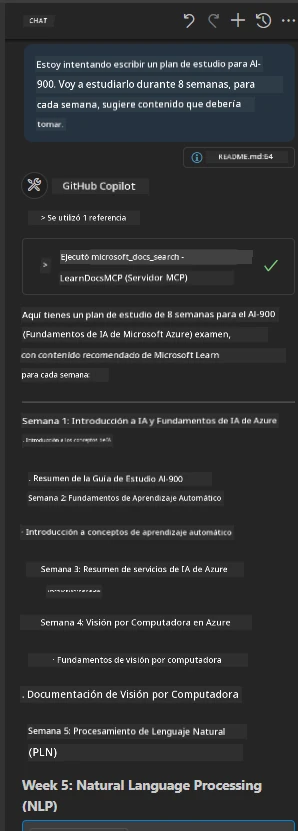

# Estudio de caso: Conexión al servidor MCP de Microsoft Learn Docs desde un cliente

¿Alguna vez te has encontrado alternando entre sitios de documentación, Stack Overflow y pestañas interminables del buscador, todo mientras intentas solucionar un problema en tu código? Quizá tengas un segundo monitor solo para documentación, o estés constantemente cambiando entre tu IDE y un navegador. ¿No sería mejor poder integrar la documentación directamente en tu flujo de trabajo, integrada en tus aplicaciones, tu IDE o incluso en tus propias herramientas personalizadas? En este estudio de caso, exploraremos cómo hacer exactamente eso conectándonos directamente al servidor MCP de Microsoft Learn Docs desde tu propia aplicación cliente.

## Resumen

El desarrollo moderno es más que solo escribir código: se trata de encontrar la información correcta en el momento adecuado. La documentación está en todas partes, pero rara vez donde más la necesitas: dentro de tus herramientas y flujos de trabajo. Al integrar la recuperación de documentación directamente en tus aplicaciones, puedes ahorrar tiempo, reducir el cambio de contexto y aumentar la productividad. En esta sección, te mostraremos cómo conectar un cliente al servidor MCP de Microsoft Learn Docs para que puedas acceder a documentación en tiempo real y consciente del contexto sin salir de tu app.

Recorreremos el proceso de establecer una conexión, enviar una solicitud y manejar respuestas en streaming de manera eficiente. Este enfoque no solo agiliza tu flujo de trabajo, sino que también abre la puerta para construir herramientas de desarrollo más inteligentes y útiles.

## Objetivos de aprendizaje

¿Por qué estamos haciendo esto? Porque las mejores experiencias para desarrolladores son aquellas que eliminan fricciones. Imagina un mundo donde tu editor de código, chatbot o aplicación web pueda responder instantáneamente a tus preguntas de documentación usando el contenido más reciente de Microsoft Learn. Al finalizar este capítulo, sabrás cómo:

- Entender los fundamentos de la comunicación cliente-servidor MCP para documentación  
- Implementar una aplicación de consola o web para conectar con el servidor MCP de Microsoft Learn Docs  
- Usar clientes HTTP con streaming para recuperación en tiempo real de documentación  
- Registrar e interpretar las respuestas de documentación en tu aplicación  

Verás cómo estas habilidades pueden ayudarte a construir herramientas que no solo reaccionan, sino que verdaderamente sean interactivas y conscientes del contexto.

## Escenario 1 - Recuperación de documentación en tiempo real con MCP

En este escenario, te mostraremos cómo conectar un cliente al servidor MCP de Microsoft Learn Docs para que puedas acceder a documentación en tiempo real y consciente del contexto sin salir de tu app. 

Vamos a poner esto en práctica. Tu tarea es escribir una aplicación que se conecte al servidor MCP de Microsoft Learn Docs, invoque la herramienta `microsoft_docs_search` y registre la respuesta en streaming en la consola.

### ¿Por qué este enfoque?
Porque es la base para construir integraciones más avanzadas, ya sea que quieras impulsar un chatbot, una extensión de IDE o un panel web.

Encontrarás el código e instrucciones para este escenario en la carpeta [`solution`](./solution/README.md) dentro de este estudio de caso. Los pasos te guiarán para configurar la conexión:
- Usar el SDK oficial de MCP y un cliente HTTP con capacidad de streaming para la conexión  
- Llamar a la herramienta `microsoft_docs_search` con un parámetro de consulta para recuperar documentación  
- Implementar registro y manejo adecuado de errores  
- Crear una interfaz interactiva de consola que permita ingresar múltiples consultas de búsqueda  

Este escenario demuestra cómo:
- Conectarse al servidor MCP de Docs  
- Enviar una consulta  
- Analizar e imprimir los resultados  

Así podría verse la ejecución de la solución:

```
Prompt> What is Azure Key Vault?
Answer> Azure Key Vault is a cloud service for securely storing and accessing secrets. ...
```
  
A continuación hay un ejemplo mínimo de solución. El código completo y detalles están disponibles en la carpeta de solución.

<details>
<summary>Python</summary>

```python
import asyncio
from mcp.client.streamable_http import streamablehttp_client
from mcp import ClientSession

async def main():
    async with streamablehttp_client("https://learn.microsoft.com/api/mcp") as (read_stream, write_stream, _):
        async with ClientSession(read_stream, write_stream) as session:
            await session.initialize()
            result = await session.call_tool("microsoft_docs_search", {"query": "Azure Functions best practices"})
            print(result.content)

if __name__ == "__main__":
    asyncio.run(main())
```
  
- Para la implementación completa y el registro de datos, consulta [`scenario1.py`](../../../../09-CaseStudy/docs-mcp/solution/python/scenario1.py).  
- Para instrucciones de instalación y uso, mira el archivo [`README.md`](./solution/python/README.md) en la misma carpeta.  
</details>


## Escenario 2 - Generador interactivo de planes de estudio en web con MCP

En este escenario, aprenderás cómo integrar Docs MCP en un proyecto de desarrollo web. El objetivo es permitir a los usuarios buscar documentación de Microsoft Learn directamente desde una interfaz web, haciendo que la documentación sea accesible al instante dentro de tu app o sitio.

Verás cómo:
- Configurar una aplicación web  
- Conectar al servidor MCP de Docs  
- Manejar la entrada del usuario y mostrar resultados  

Así podría verse la ejecución de la solución:

```
User> I want to learn about AI102 - so suggest the roadmap to get it started from learn for 6 weeks

Assistant> Here’s a detailed 6-week roadmap to start your preparation for the AI-102: Designing and Implementing a Microsoft Azure AI Solution certification, using official Microsoft resources and focusing on exam skills areas:

---
## Week 1: Introduction & Fundamentals
- **Understand the Exam**: Review the [AI-102 exam skills outline](https://learn.microsoft.com/en-us/credentials/certifications/exams/ai-102/).
- **Set up Azure**: Sign up for a free Azure account if you don't have one.
- **Learning Path**: [Introduction to Azure AI services](https://learn.microsoft.com/en-us/training/modules/intro-to-azure-ai/)
- **Focus**: Get familiar with Azure portal, AI capabilities, and necessary tools.

....more weeks of the roadmap...

Let me know if you want module-specific recommendations or need more customized weekly tasks!
```
  
A continuación hay un ejemplo mínimo de solución. El código completo y detalles están disponibles en la carpeta de solución.



<details>
<summary>Python (Chainlit)</summary>

Chainlit es un framework para construir aplicaciones web de IA conversacional. Facilita crear chatbots y asistentes interactivos que pueden llamar a herramientas MCP y mostrar resultados en tiempo real. Es ideal para prototipado rápido e interfaces amigables para el usuario.

```python
import chainlit as cl
import requests

MCP_URL = "https://learn.microsoft.com/api/mcp"

@cl.on_message
def handle_message(message):
    query = {"question": message}
    response = requests.post(MCP_URL, json=query)
    if response.ok:
        result = response.json()
        cl.Message(content=result.get("answer", "No answer found.")).send()
    else:
        cl.Message(content="Error: " + response.text).send()
```
  
- Para la implementación completa, consulta [`scenario2.py`](../../../../09-CaseStudy/docs-mcp/solution/python/scenario2.py).  
- Para instrucciones de configuración y ejecución, consulta el [`README.md`](./solution/python/README.md).  
</details>


## Escenario 3: Documentación dentro del editor con el servidor MCP en VS Code

Si quieres obtener Microsoft Learn Docs directamente dentro de tu VS Code (en lugar de cambiar de pestañas del navegador), puedes usar el servidor MCP en tu editor. Esto te permite:
- Buscar y leer documentación en VS Code sin salir de tu entorno de codificación.  
- Referenciar documentación e insertar enlaces directamente en tus archivos README o cursos.  
- Aprovechar GitHub Copilot y MCP juntos para un flujo de trabajo de documentación impulsado por IA sin interrupciones.  

**Verás cómo:**  
- Agregar un archivo válido `.vscode/mcp.json` en la raíz de tu espacio de trabajo (ver ejemplo abajo).  
- Abrir el panel MCP o usar la paleta de comandos en VS Code para buscar e insertar documentación.  
- Referenciar documentación directamente en tus archivos markdown mientras trabajas.  
- Combinar este flujo de trabajo con GitHub Copilot para aún mayor productividad.  

Aquí tienes un ejemplo de cómo configurar el servidor MCP en VS Code:

```json
{
  "servers": {
    "LearnDocsMCP": {
      "url": "https://learn.microsoft.com/api/mcp"
    }
  }
}
```
  
</details>

> Para una guía detallada con capturas de pantalla y pasos, consulta [`README.md`](./solution/scenario3/README.md).



Este enfoque es ideal para quienes crean cursos técnicos, escriben documentación o desarrollan código con necesidades frecuentes de referencia.

## Conclusiones clave

Integrar la documentación directamente en tus herramientas no es solo comodidad, es un cambio radical para la productividad. Al conectarte al servidor MCP de Microsoft Learn Docs desde tu cliente, puedes:

- Eliminar el cambio de contexto entre tu código y la documentación  
- Recuperar documentación actualizada y consciente del contexto en tiempo real  
- Construir herramientas de desarrollo más inteligentes e interactivas  

Estas habilidades te ayudarán a crear soluciones que no solo sean eficientes, sino también agradables de usar.

## Recursos adicionales

Para profundizar tu comprensión, explora estos recursos oficiales:

- [Microsoft Learn Docs MCP Server (GitHub)](https://github.com/MicrosoftDocs/mcp)  
- [Comienza con Azure MCP Server (mcp-python)](https://learn.microsoft.com/en-us/azure/developer/azure-mcp-server/get-started#create-the-python-app)  
- [¿Qué es Azure MCP Server?](https://learn.microsoft.com/en-us/azure/developer/azure-mcp-server/)  
- [Introducción al Model Context Protocol (MCP)](https://modelcontextprotocol.io/introduction)  
- [Agregar plugins desde un servidor MCP (Python)](https://learn.microsoft.com/en-us/semantic-kernel/concepts/plugins/adding-mcp-plugins)  

## Qué sigue

- Volver a: [Resumen de estudios de caso](../README.md)  
- Continuar a: [Módulo 10: Optimización de flujos de trabajo de IA con AI Toolkit](../../10-StreamliningAIWorkflowsBuildingAnMCPServerWithAIToolkit/README.md)

---

<!-- CO-OP TRANSLATOR DISCLAIMER START -->
**Descargo de responsabilidad**:  
Este documento ha sido traducido utilizando el servicio de traducción automática [Co-op Translator](https://github.com/Azure/co-op-translator). Aunque buscamos la precisión, tenga en cuenta que las traducciones automáticas pueden contener errores o inexactitudes. El documento original en su idioma nativo debe considerarse la fuente autorizada. Para información crítica, se recomienda una traducción profesional realizada por humanos. No nos hacemos responsables por malentendidos o interpretaciones erróneas derivadas del uso de esta traducción.
<!-- CO-OP TRANSLATOR DISCLAIMER END -->