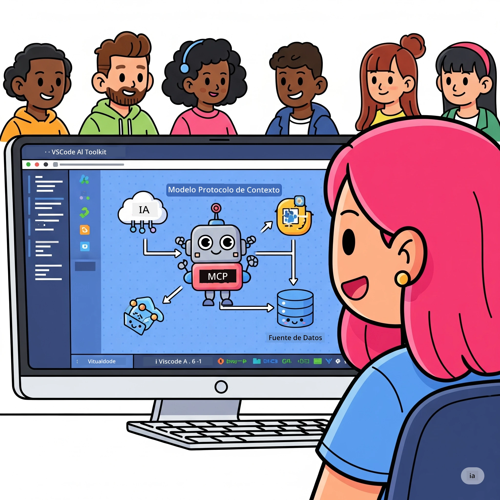
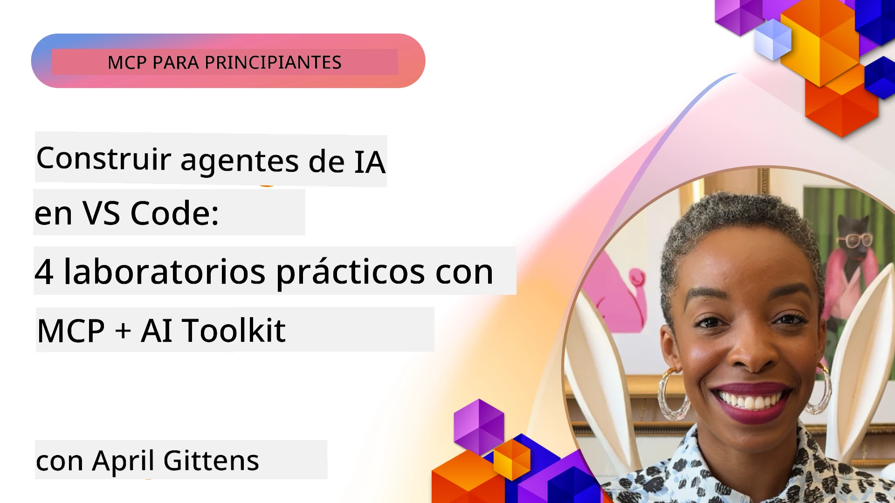

# Optimización de Flujos de Trabajo de IA: Construcción de un Servidor MCP con AI Toolkit

## 🎯  Resumen

_(Haz clic en la imagen arriba para ver el video de esta lección)_

¡Bienvenido al **Taller del Protocolo de Contexto de Modelo (MCP)**! Este taller práctico integral combina dos tecnologías de vanguardia para revolucionar el desarrollo de aplicaciones de IA:

- **🔗 Protocolo de Contexto de Modelo (MCP)**: Un estándar abierto para la integración fluida de herramientas de IA
- **🛠️ AI Toolkit para Visual Studio Code (AITK)**: La potente extensión de desarrollo de IA de Microsoft

### 🎓 Lo que Aprenderás

Al finalizar este taller, dominarás el arte de construir aplicaciones inteligentes que conectan modelos de IA con herramientas y servicios del mundo real. Desde pruebas automatizadas hasta integraciones API personalizadas, obtendrás habilidades prácticas para resolver desafíos empresariales complejos.

## 🏗️ Plataforma Tecnológica

### 🔌 Protocolo de Contexto de Modelo (MCP)

MCP es el **"USB-C para IA"**: un estándar universal que conecta modelos de IA con herramientas externas y fuentes de datos.

**✨ Características Clave:**

- 🔄 **Integración Estandarizada**: Interfaz universal para conexiones con herramientas de IA
- 🏛️ **Arquitectura Flexible**: Servidores locales y remotos mediante transporte stdio/SSE
- 🧰 **Ecosistema Rico**: Herramientas, prompts y recursos en un solo protocolo
- 🔒 **Listo para Empresas**: Seguridad y fiabilidad integradas

**🎯 Por qué MCP Importa:**
Así como USB-C eliminó el caos de cables, MCP elimina la complejidad de las integraciones de IA. Un protocolo, infinitas posibilidades.

### 🤖 AI Toolkit para Visual Studio Code (AITK)

La extensión líder de Microsoft para desarrollo de IA que convierte VS Code en una potencia de IA.

**🚀 Capacidades Principales:**

- 📦 **Catálogo de Modelos**: Acceso a modelos de Azure AI, GitHub, Hugging Face, Ollama
- ⚡ **Inferencia Local**: Ejecución optimizada ONNX para CPU/GPU/NPU
- 🏗️ **Constructor de Agentes**: Desarrollo visual de agentes de IA con integración MCP
- 🎭 **Multimodal**: Soporte para texto, visión y salida estructurada

**💡 Beneficios para el Desarrollo:**

- Despliegue de modelos sin configuración
- Ingeniería visual de prompts
- Área de pruebas en tiempo real
- Integración fluida con servidores MCP

## 📚 Trayectoria de Aprendizaje

### [🚀 Módulo 1: Fundamentos de AI Toolkit](./lab1/README.md)

**Duración**: 15 minutos

- 🛠️ Instalar y configurar AI Toolkit para VS Code
- 🗂️ Explorar el Catálogo de Modelos (más de 100 modelos de GitHub, ONNX, OpenAI, Anthropic, Google)
- 🎮 Dominar el Área Interactiva para pruebas de modelos en tiempo real
- 🤖 Construir tu primer agente de IA con Agent Builder
- 📊 Evaluar el rendimiento del modelo con métricas integradas (F1, relevancia, similitud, coherencia)
- ⚡ Aprender procesamiento por lotes y soporte multimodal

**🎯 Resultado de Aprendizaje**: Crear un agente de IA funcional con comprensión completa de las capacidades de AITK

### [🌐 Módulo 2: Fundamentos de MCP con AI Toolkit](./lab2/README.md)

**Duración**: 20 minutos

- 🧠 Dominar la arquitectura y conceptos del Protocolo de Contexto de Modelo (MCP)
- 🌐 Explorar el ecosistema de servidores MCP de Microsoft
- 🤖 Construir un agente de automatización de navegador usando Playwright MCP server
- 🔧 Integrar servidores MCP con AI Toolkit Agent Builder
- 📊 Configurar y probar herramientas MCP dentro de tus agentes
- 🚀 Exportar y desplegar agentes potenciados con MCP para uso en producción

**🎯 Resultado de Aprendizaje**: Desplegar un agente de IA potenciado con herramientas externas mediante MCP

### [🔧 Módulo 3: Desarrollo Avanzado MCP con AI Toolkit](./lab3/README.md)

**Duración**: 20 minutos

- 💻 Crear servidores MCP personalizados usando AI Toolkit
- 🐍 Configurar y usar el último SDK de MCP para Python (v1.9.3)
- 🔍 Configurar y utilizar MCP Inspector para depuración
- 🛠️ Construir un Servidor MCP de Clima con flujos de trabajo profesionales de depuración
- 🧪 Depurar servidores MCP tanto en Agent Builder como en Inspector

**🎯 Resultado de Aprendizaje**: Desarrollar y depurar servidores MCP personalizados con herramientas modernas

### [🐙 Módulo 4: Desarrollo Práctico MCP - Servidor Clone de GitHub Personalizado](./lab4/README.md)

**Duración**: 30 minutos

- 🏗️ Construir un Servidor MCP Clone de GitHub real para flujos de desarrollo
- 🔄 Implementar clonación inteligente de repositorios con validación y manejo de errores
- 📁 Crear gestión inteligente de directorios e integración con VS Code
- 🤖 Usar GitHub Copilot Agent Mode con herramientas MCP personalizadas
- 🛡️ Aplicar fiabilidad lista para producción y compatibilidad multiplataforma

**🎯 Resultado de Aprendizaje**: Desplegar un servidor MCP listo para producción que optimiza flujos de trabajo reales de desarrollo

## 💡 Aplicaciones e Impacto en el Mundo Real

### 🏢 Casos de Uso Empresariales

#### 🔄 Automatización DevOps

Transforma tu flujo de desarrollo con automatización inteligente:

- **Gestión Inteligente de Repositorios**: Revisión de código y decisiones de merge basadas en IA
- **CI/CD Inteligente**: Optimización automática de pipelines según cambios en el código
- **Clasificación de Issues**: Asignación y categorización automáticas de bugs

#### 🧪 Revolución en Aseguramiento de Calidad

Eleva las pruebas con automatización potenciada por IA:

- **Generación Inteligente de Pruebas**: Creación automática de suites de prueba completas
- **Pruebas de Regresión Visual**: Detección de cambios UI con IA
- **Monitoreo de Rendimiento**: Identificación y resolución proactiva de problemas

#### 📊 Inteligencia en Pipelines de Datos

Construye flujos de procesamiento de datos más inteligentes:

- **Procesos ETL Adaptativos**: Transformaciones de datos auto-optimizables
- **Detección de Anomalías**: Monitoreo en tiempo real de calidad de datos
- **Enrutamiento Inteligente**: Gestión inteligente del flujo de datos

#### 🎧 Mejora de la Experiencia del Cliente

Crea interacciones excepcionales con el cliente:

- **Soporte Contextualizado**: Agentes de IA con acceso al historial del cliente
- **Resolución Proactiva de Problemas**: Servicio predictivo al cliente
- **Integración Multicanal**: Experiencia unificada de IA en diversas plataformas

## 🛠️ Requisitos Previos y Configuración

### 💻 Requisitos del Sistema

| Componente | Requisito | Notas |
|-----------|-------------|-------|
| **Sistema Operativo** | Windows 10+, macOS 10.15+, Linux | Cualquier OS moderno |
| **Visual Studio Code** | Versión estable más reciente | Requerido para AITK |
| **Node.js** | v18.0+ y npm | Para desarrollo de servidores MCP |
| **Python** | 3.10+ | Opcional para servidores MCP en Python |
| **Memoria** | Mínimo 8GB RAM | Recomendado 16GB para modelos locales |

### 🔧 Entorno de Desarrollo

#### Extensiones Recomendadas para VS Code

- **AI Toolkit** (ms-windows-ai-studio.windows-ai-studio)
- **Python** (ms-python.python)
- **Depurador Python** (ms-python.debugpy)
- **GitHub Copilot** (GitHub.copilot) - Opcional pero útil

#### Herramientas Opcionales

- **uv**: Gestor moderno de paquetes para Python
- **MCP Inspector**: Herramienta visual de depuración para servidores MCP
- **Playwright**: Para ejemplos de automatización web

## 🎖️ Resultados de Aprendizaje y Ruta de Certificación

### 🏆 Lista de Dominio de Habilidades

Al completar este taller, lograrás dominio en:

#### 🎯 Competencias Clave

- [ ] **Dominio del Protocolo MCP**: Comprensión profunda de arquitectura y patrones de implementación
- [ ] **Competencia en AITK**: Uso experto de AI Toolkit para desarrollo rápido
- [ ] **Desarrollo de Servidores Personalizados**: Construir, desplegar y mantener servidores MCP en producción
- [ ] **Excelencia en Integración de Herramientas**: Conectar IA sin fallos con flujos de desarrollo existentes
- [ ] **Aplicación para Resolución de Problemas**: Aplicar habilidades para desafíos empresariales reales

#### 🔧 Habilidades Técnicas

- [ ] Configurar y usar AI Toolkit en VS Code
- [ ] Diseñar e implementar servidores MCP personalizados
- [ ] Integrar modelos de GitHub con arquitectura MCP
- [ ] Construir flujos automatizados de pruebas con Playwright
- [ ] Desplegar agentes de IA para uso en producción
- [ ] Depurar y optimizar desempeño de servidores MCP

#### 🚀 Capacidades Avanzadas

- [ ] Arquitectura de integraciones IA a escala empresarial
- [ ] Implementar mejores prácticas de seguridad en aplicaciones IA
- [ ] Diseñar arquitecturas escalables de servidores MCP
- [ ] Crear cadenas de herramientas personalizadas para dominios específicos
- [ ] Mentorear a otros en desarrollo nativo de IA

## 📖 Recursos Adicionales

- [Especificación MCP (2025-11-25)](https://spec.modelcontextprotocol.io/specification/2025-11-25/)
- [Repositorio AI Toolkit en GitHub](https://github.com/microsoft/vscode-ai-toolkit)
- [Colección de servidores MCP de ejemplo](https://github.com/modelcontextprotocol/servers)
- [Guía de Mejores Prácticas](https://modelcontextprotocol.io/docs/best-practices)
- [OWASP MCP Top 10](https://microsoft.github.io/mcp-azure-security-guide/mcp/) - Mejores prácticas de seguridad

---

**🚀 ¿Listo para revolucionar tu flujo de desarrollo de IA?**

¡Construyamos juntos el futuro de las aplicaciones inteligentes con MCP y AI Toolkit!

## Qué Sigue

Continúa con: [Módulo 11: Laboratorios Prácticos de Servidor MCP](../11-MCPServerHandsOnLabs/README.md)

---

<!-- CO-OP TRANSLATOR DISCLAIMER START -->
**Aviso legal**:
Este documento ha sido traducido utilizando el servicio de traducción automática [Co-op Translator](https://github.com/Azure/co-op-translator). Aunque nos esforzamos por la precisión, tenga en cuenta que las traducciones automáticas pueden contener errores o inexactitudes. El documento original en su idioma nativo debe considerarse la fuente autorizada. Para información crítica, se recomienda una traducción profesional realizada por humanos. No nos hacemos responsables de cualquier malentendido o interpretación errónea derivada del uso de esta traducción.
<!-- CO-OP TRANSLATOR DISCLAIMER END -->