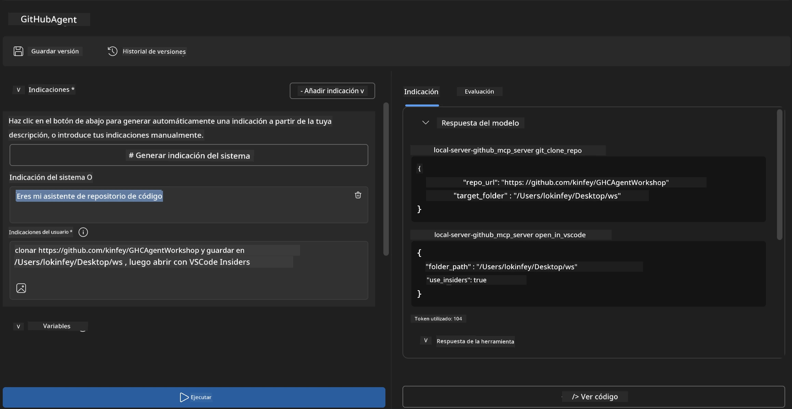
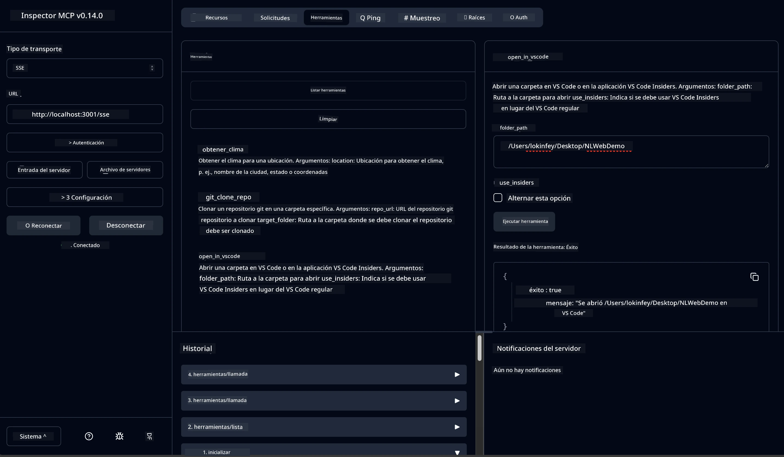

# 🐙 Módulo 4: Desarrollo Práctico de MCP - Servidor Personalizado de Clonación de GitHub


> **⚡ Inicio Rápido:** ¡Construye un servidor MCP listo para producción que automatice la clonación de repositorios de GitHub y la integración con VS Code en solo 30 minutos!

## 🎯 Objetivos de Aprendizaje

Al finalizar este laboratorio, podrás:

- ✅ Crear un servidor MCP personalizado para flujos de trabajo de desarrollo del mundo real
- ✅ Implementar funcionalidad de clonación de repositorios de GitHub a través de MCP
- ✅ Integrar servidores MCP personalizados con VS Code y Agent Builder
- ✅ Usar GitHub Copilot en Modo Agente con herramientas MCP personalizadas
- ✅ Probar y desplegar servidores MCP personalizados en entornos de producción

## 📋 Requisitos Previos

- Haber completado los Laboratorios 1-3 (fundamentos de MCP y desarrollo avanzado)
- Suscripción a GitHub Copilot ([registro gratuito disponible](https://github.com/github-copilot/signup))
- VS Code con extensiones AI Toolkit y GitHub Copilot
- CLI de Git instalado y configurado

## 🏗️ Resumen del Proyecto

### **Desafío de Desarrollo del Mundo Real**
Como desarrolladores, con frecuencia usamos GitHub para clonar repositorios y abrirlos en VS Code o VS Code Insiders. Este proceso manual implica:
1. Abrir la terminal o línea de comandos
2. Navegar al directorio deseado
3. Ejecutar el comando `git clone`
4. Abrir VS Code en el directorio clonado

**¡Nuestra solución MCP simplifica esto en un solo comando inteligente!**

### **Qué Construirás**
Un **Servidor MCP de Clonación GitHub** (`git_mcp_server`) que ofrece:

| Característica | Descripción | Beneficio |
|---------|-------------|---------|
| 🔄 **Clonación Inteligente de Repositorios** | Clona repos de GitHub con validación | Verificación automática de errores |
| 📁 **Gestión Inteligente de Directorios** | Verifica y crea directorios de forma segura | Previene sobreescritura |
| 🚀 **Integración Multiplataforma con VS Code** | Abre proyectos en VS Code/Insiders | Transición fluida del flujo de trabajo |
| 🛡️ **Manejo Robusto de Errores** | Gestiona problemas de red, permisos y rutas | Confiabilidad lista para producción |

---

## 📖 Implementación Paso a Paso

### Paso 1: Crear Agente GitHub en Agent Builder

1. **Inicia Agent Builder** a través de la extensión AI Toolkit
2. **Crea un nuevo agente** con la siguiente configuración:
   ```
   Agent Name: GitHubAgent
   ```

3. **Inicializa el servidor MCP personalizado:**
   - Navega a **Herramientas** → **Agregar Herramienta** → **Servidor MCP**
   - Selecciona **"Crear un nuevo servidor MCP"**
   - Elige **plantilla Python** para máxima flexibilidad
   - **Nombre del servidor:** `git_mcp_server`

### Paso 2: Configurar GitHub Copilot en Modo Agente

1. **Abre GitHub Copilot** en VS Code (Ctrl/Cmd + Shift + P → "GitHub Copilot: Abrir")
2. **Selecciona Modelo de Agente** en la interfaz de Copilot
3. **Elige el modelo Claude 3.7** para mejores capacidades de razonamiento
4. **Habilita la integración MCP** para acceso a herramientas

> **💡 Consejo Profesional:** Claude 3.7 ofrece una comprensión superior de los flujos de trabajo de desarrollo y patrones de manejo de errores.

### Paso 3: Implementar Funcionalidad Principal del Servidor MCP

**Usa el siguiente prompt detallado con GitHub Copilot en Modo Agente:**

```
Create two MCP tools with the following comprehensive requirements:

🔧 TOOL A: clone_repository
Requirements:
- Clone any GitHub repository to a specified local folder
- Return the absolute path of the successfully cloned project
- Implement comprehensive validation:
  ✓ Check if target directory already exists (return error if exists)
  ✓ Validate GitHub URL format (https://github.com/user/repo)
  ✓ Verify git command availability (prompt installation if missing)
  ✓ Handle network connectivity issues
  ✓ Provide clear error messages for all failure scenarios

🚀 TOOL B: open_in_vscode
Requirements:
- Open specified folder in VS Code or VS Code Insiders
- Cross-platform compatibility (Windows/Linux/macOS)
- Use direct application launch (not terminal commands)
- Auto-detect available VS Code installations
- Handle cases where VS Code is not installed
- Provide user-friendly error messages

Additional Requirements:
- Follow MCP 1.9.3 best practices
- Include proper type hints and documentation
- Implement logging for debugging purposes
- Add input validation for all parameters
- Include comprehensive error handling
```

### Paso 4: Prueba tu Servidor MCP

#### 4a. Prueba en Agent Builder

1. **Lanza la configuración de depuración** para Agent Builder
2. **Configura tu agente con este prompt del sistema:**

```
SYSTEM_PROMPT:
You are my intelligent coding repository assistant. You help developers efficiently clone GitHub repositories and set up their development environment. Always provide clear feedback about operations and handle errors gracefully.
```

3. **Prueba con escenarios de usuario realistas:**

```
USER_PROMPT EXAMPLES:

Scenario : Basic Clone and Open
"Clone {Your GitHub Repo link such as https://github.com/kinfey/GHCAgentWorkshop
 } and save to {The global path you specify}, then open it with VS Code Insiders"
```



**Resultados Esperados:**
- ✅ Clonación exitosa con confirmación de ruta
- ✅ Lanzamiento automático de VS Code
- ✅ Mensajes de error claros para escenarios inválidos
- ✅ Manejo correcto de casos límite

#### 4b. Prueba en MCP Inspector




---


**🎉 ¡Felicidades!** Has creado exitosamente un servidor MCP práctico y listo para producción que resuelve desafíos reales de flujos de trabajo de desarrollo. Tu servidor personalizado de clonación GitHub demuestra el poder de MCP para automatizar y mejorar la productividad de los desarrolladores.

### 🏆 Logro Desbloqueado:
- ✅ **Desarrollador MCP** - Creó servidor MCP personalizado
- ✅ **Automatizador de Flujos** - Simplificó procesos de desarrollo  
- ✅ **Experto en Integración** - Conectó múltiples herramientas de desarrollo
- ✅ **Listo para Producción** - Construyó soluciones desplegables

---

## 🎓 Finalización del Taller: Tu Trayectoria con Model Context Protocol

**Estimado participante del taller,**

¡Felicidades por completar los cuatro módulos del taller Model Context Protocol! Has recorrido un largo camino desde entender los conceptos básicos del AI Toolkit hasta construir servidores MCP listos para producción que resuelven desafíos reales de desarrollo.

### 🚀 Recapitulación de tu Ruta de Aprendizaje:

**[Módulo 1](../lab1/README.md)**: Comenzaste explorando fundamentos de AI Toolkit, pruebas de modelos y creando tu primer agente IA.

**[Módulo 2](../lab2/README.md)**: Aprendiste la arquitectura MCP, integraste Playwright MCP y construiste tu primer agente de automatización de navegador.

**[Módulo 3](../lab3/README.md)**: Avanzaste al desarrollo de servidores MCP personalizados con el servidor Weather MCP y dominaste herramientas de depuración.

**[Módulo 4](../lab4/README.md)**: Ahora has aplicado todo para crear una herramienta práctica de automatización de flujos de trabajo con repositorios GitHub.

### 🌟 Lo que Has Domado:

- ✅ **Ecosistema AI Toolkit**: Modelos, agentes y patrones de integración
- ✅ **Arquitectura MCP**: Diseño cliente-servidor, protocolos de transporte y seguridad
- ✅ **Herramientas para Desarrolladores**: De Playground a Inspector y despliegue en producción
- ✅ **Desarrollo Personalizado**: Construcción, prueba y despliegue de tus propios servidores MCP
- ✅ **Aplicaciones Prácticas**: Resolviendo desafíos reales de flujo de trabajo con IA

### 🔮 Tus Próximos Pasos:

1. **Construye tu propio servidor MCP**: Aplica estas habilidades para automatizar tus flujos específicos
2. **Únete a la Comunidad MCP**: Comparte tus creaciones y aprende de otros
3. **Explora Integraciones Avanzadas**: Conecta servidores MCP a sistemas empresariales
4. **Contribuye a Código Abierto**: Ayuda a mejorar las herramientas y documentación MCP

Recuerda, este taller es solo el comienzo. El ecosistema Model Context Protocol está evolucionando rápidamente y ahora estás equipado para estar a la vanguardia de las herramientas de desarrollo potenciadas por IA.

**¡Gracias por tu participación y dedicación al aprendizaje!**

Esperamos que este taller haya inspirado ideas que transformarán cómo construyes e interactúas con herramientas de IA en tu trayectoria como desarrollador.

**¡Feliz codificación!**

---

## Qué Sigue

¡Felicidades por completar todos los laboratorios del Módulo 10!

- Volver a: [Resumen del Módulo 10](../README.md)
- Continuar a: [Módulo 11: Laboratorios Prácticos de Servidor MCP](../../11-MCPServerHandsOnLabs/README.md)

---

<!-- CO-OP TRANSLATOR DISCLAIMER START -->
**Aviso Legal**:  
Este documento ha sido traducido utilizando el servicio de traducción automática [Co-op Translator](https://github.com/Azure/co-op-translator). Aunque nos esforzamos por lograr precisión, tenga en cuenta que las traducciones automáticas pueden contener errores o inexactitudes. El documento original en su idioma nativo debe considerarse la fuente autorizada. Para información crítica, se recomienda la traducción profesional humana. No nos hacemos responsables por cualquier malentendido o interpretación errónea derivada del uso de esta traducción.
<!-- CO-OP TRANSLATOR DISCLAIMER END -->