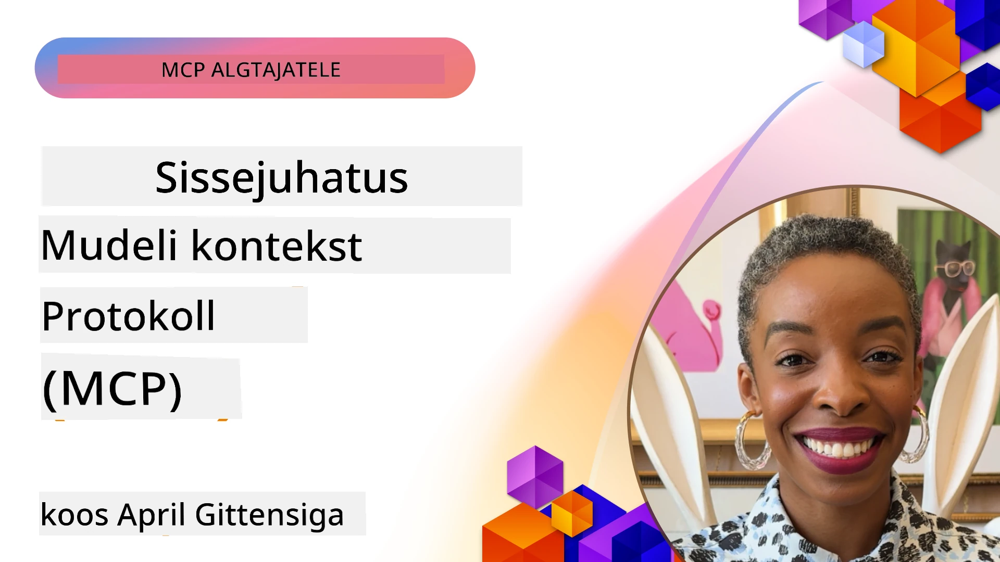
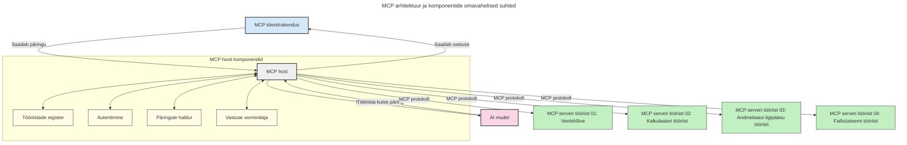

# Sissejuhatus mudeli konteksti protokolli (MCP): miks see on oluline skaleeritavate AI rakenduste jaoks

[](https://youtu.be/agBbdiOPLQA)

_(Klõpsake ülaloleval pildil, et vaadata selle tunni videot)_

Generatiivsed AI rakendused on suur samm edasi, kuna need võimaldavad kasutajal rakendusega suhelda loomulikus keeles päringute kaudu. Kuid kui sellistesse rakendustesse investeeritakse rohkem aega ja ressursse, soovite veenduda, et funktsionaalsusi ja ressursse saab hõlpsasti integreerida nii, et neid oleks lihtne laiendada, teie rakendus saaks toetada mitut erinevat mudelit ja hallata erinevaid mudelipõhiseid nüansse. Lühidalt öeldes on generatiivsete AI rakenduste loomine alguses lihtne, aga kui need kasvavad ja muutuvad keerulisemaks, tuleb hakata määratlema arhitektuuri ja tõenäoliselt vajate standardit, et tagada rakenduste ehitus ühtsel viisil. Siin tulebki mängu MCP, mis korraldab asju ja pakub standardit.

---

## **🔍 Mis on mudeli konteksti protokoll (MCP)?**

**Mudeli konteksti protokoll (MCP)** on **avatud, standardiseeritud liides**, mis võimaldab suurte keelemudelitel (LLM-del) sujuvalt suhelda väliste tööriistade, API-de ja andmeallikatega. See pakub ühtset arhitektuuri, et parandada AI mudelite funktsionaalsust väljaspool nende koolituse andmeid, võimaldades nutikamaid, skaleeritavamaid ja vastuvõtlikumaid AI süsteeme.

---

## **🎯 Miks AI standardiseerimine on oluline**

Kui generatiivsed AI rakendused muutuvad keerukamaks, on oluline võtta kasutusele standardid, mis tagavad **skaleeritavuse, laiendatavuse, hooldatavuse** ja **tootjalukustuse vältimise**. MCP tegeleb nende vajadustega, pakkudes:

- Mudel-tööriista integratsioonide ühtlustamist
- Ühekordsete, haprate kohandatud lahenduste vähendamist
- Mitme erineva tootja mudelite kooseksisteerimise võimaldamist samas ökosüsteemis

**Märkus:** Kuigi MCP nimetab end avatuks standardiks, ei ole kavatsust MCP standardiseerida ühegi olemasoleva standardorganisatsiooni kaudu nagu IEEE, IETF, W3C, ISO või mõne muu standardorganisatsiooni kaudu.

---

## **📚 Õpieesmärgid**

Selle artikli lõpuks oskad:

- Defineerida **mudeli konteksti protokolli (MCP)** ja selle kasutusjuhtumeid
- Mõista, kuidas MCP standardiseerib mudeli ja tööriista suhtlust
- Tuvastada MCP arhitektuuri põhikomponendid
- Uurida MCP reaalse maailma rakendusi ettevõtete ja arenduse kontekstis

---

## **💡 Miks mudeli konteksti protokoll (MCP) on läbimurre**

### **🔗 MCP lahendab killustatuse AI interaktsioonides**

Enne MCP-d nõudis mudelite ühendamine tööriistadega:

- Kohandatud koodi iga tööriista ja mudeli paari jaoks
- Iga tootja jaoks mittestandardseid API-sid
- Sageli katkestusi uuenduste tõttu
- Halba skaleeritavust tööriistade lisamisel

### **✅ MCP standardiseerimise eelised**

| **Eelis**                 | **Kirjeldus**                                                                 |
|---------------------------|-------------------------------------------------------------------------------|
| Ühilduvus                 | LLM-id töötavad sujuvalt koos tööriistadega erinevatelt tootjatelt           |
| Ühtlus                    | Ühtlane käitumine platvormide ja tööriistade vahel                            |
| Taaskasutus               | Kord ehitatud tööriistu saab kasutada mitmes projektis ja süsteemis          |
| Arenduse kiirendus        | Vähendab arendusaega, kasutades standardiseeritud plug-and-play liideseid     |

---

## **🧱 MCP arhitektuuri ülevaade kõrgtasemel**

MCP järgib **klient-server mudelit**, kus:

- **MCP hostid** haldavad AI mudeleid
- **MCP kliendid** algatavad päringuid
- **MCP serverid** pakuvad konteksti, tööriistu ja võimekusi

### **Põhikomponendid:**

- **Ressursid** – staatilised või dünaamilised andmed mudelitele  
- **Päringud** – ette määratud töövood juhitud genereerimiseks  
- **Tööriistad** – täidetavad funktsioonid nagu otsing, arvutused  
- **Valimine** – agentuurne käitumine rekursiivsete interaktsioonide kaudu  
- **Väljakutsumine** – serveri algatatud kasutajapäringud  
- **Juurdepääsurajad** – failisüsteemi piirid serveri ligipääsu kontrollimiseks

### **Protokolli arhitektuur:**

MCP kasutab kahte kihti:
- **Andmekiht**: JSON-RPC 2.0 põhine suhtlus koos elutsükli halduse ja algoperatsioonidega
- **Transpordikiht**: STDIO (kohalik) ja voogedastatav HTTP koos Server-Sent Events (SSE) kaugkommunikatsiooniks

---

## Kuidas MCP serverid töötavad

MCP serverid toimivad järgmiselt:

- **Päringu voog:**
    1. Päringu algatab lõppkasutaja või tarkvara tema nimel.
    2. **MCP klient** saadab päringu **MCP hostile**, mis haldab AI mudeli käivitust.
    3. **AI mudel** saab kasutaja päringu ning võib paluda ligipääsu välistele tööriistadele või andmetele ühe või mitme tööriistakõne kaudu.
    4. **MCP host**, mitte mudel otseselt, suhtleb vastavalt standardprotokollile sobivate **MCP serveritega**.
- **MCP hosti funktsioonid:**
    - **Tööriistaregister**: hoiab tööriistade ja nende võimekuste kataloogi.
    - **Autentimine**: kontrollib õigusi tööriistade ligipääsuks.
    - **Päringutöötlus**: töötleb mudelilt tulevaid tööriistapäringuid.
    - **Vastuse vormistaja**: struktureerib tööriistade väljundid mudeli arusaadavasse formaati.
- **MCP serveri täitmine:**
    - **MCP host** suunab tööriistakutsed ühe või mitme **MCP serveri** poole, millest igaüks pakub spetsiifilisi funktsioone (nt otsing, arvutused, andmebaasi päringud).
    - **MCP serverid** täidavad vastavad operatsioonid ja tagastavad tulemused **MCP hostile** ühtses formaadis.
    - **MCP host** vormistab ja edastab tulemused **AI mudelile**.
- **Vastuse lõpetamine:**
    - **AI mudel** integreerib tööriistade väljundid lõppevastusesse.
    - **MCP host** saadab selle vastuse tagasi **MCP kliendile**, kes edastab selle lõppkasutajale või kutsuvale tarkvarale.


## 👨‍💻 Kuidas ehitada MCP serverit (näidistega)

MCP serverid võimaldavad laiendada LLM võimekusi, pakkudes andmeid ja funktsionaalsust.

Kas oled valmis proovima? Siin on keele- ja/või tehnoloogiapõhised SDK-d koos näidetega lihtsate MCP serverite loomiseks erinevates keeltes/tehnoloogiates:

- **Python SDK**: https://github.com/modelcontextprotocol/python-sdk

- **TypeScript SDK**: https://github.com/modelcontextprotocol/typescript-sdk

- **Java SDK**: https://github.com/modelcontextprotocol/java-sdk

- **C#/.NET SDK**: https://github.com/modelcontextprotocol/csharp-sdk


## 🌍 MCP reaalse maailma kasutusjuhud

MCP võimaldab mitmesuguseid rakendusi, laiendades AI võimekust:

| **Rakendus**                 | **Kirjeldus**                                                                 |
|-----------------------------|-------------------------------------------------------------------------------|
| Ettevõtte andmete integreerimine | Ühenda LLM-id andmebaaside, CRM-ide või sisemiste tööriistadega              |
| Agentse AI süsteemid        | Võimaldab autonoomseid agente tööriistade ligipääsu ja otsustusprotsessidega  |
| Mitme meediumi rakendused   | Ühenda tekst, pildid ja audio tööriistad üheks ühtseks AI rakenduseks          |
| Reaalajas andmete integreerimine | Too reaalajas andmed AI interaktsioonidesse täpsemate ja ajakohasemate tulemuste jaoks |

### 🧠 MCP = universaalne AI interaktsioonide standard

Mudeli konteksti protokoll (MCP) toimib AI interaktsioonide universaalse standardina, sarnaselt USB-C-le, mis standardiseeris seadmete füüsilised ühendused. AI maailmas pakub MCP ühtset liidest, võimaldades mudelitel (klientidel) sujuvalt integreeruda väliste tööriistade ja andmeallikatega (serveritega). See kõrvaldab vajaduse kasutada iga API või andmeallika jaoks eraldi kohandatud protokolle.

MCP kooskõlas olev tööriist (nn MCP server) järgib ühtset standardit. Need serverid saavad loetleda pakutavad tööriistad või teostada toiminguid AI agendi taotlusel. MCP-toega AI agendiplatvormid suudavad avastada serverite saadavalolevaid tööriistu ja neid selle standardprotokolli kaudu kutsuda.

### 💡 Lihtsustab juurdepääsu teadmistele

Lisaks tööriistade pakkumisele hõlbustab MCP ligipääsu teadmistele. See võimaldab rakendustel pakkuda konteksti suurtele keelemudelitele (LLM-id) ühendades neid mitmesuguste andmeallikatega. Näiteks võib MCP server esindada ettevõtte dokumentide hoidlat, võimaldades agentidel asjakohast informatsiooni nõudmisel hankida. Teine server võib hallata konkreetseid toiminguid, nagu e-kirjade saatmine või andmete uuendamine. Agendi vaatenurgast on need lihtsalt kasutatavad tööriistad — mõned toovad andmeid (teadmiste kontekst), teised teostavad toiminguid. MCP haldab mõlemat tõhusalt.

Agent, kes ühendub MCP serveriga, õpib automaatselt serveri saadaval olevad võimekused ja ligipääsetavad andmed standardiseeritud formaadis. See standardiseerimine võimaldab dünaamilist tööriistade saadavust. Näiteks uue MCP serveri lisamine agendi süsteemi muudab selle funktsioonid kohe kasutatavaks ilma täiendavate agenti juhiste kohandamiseta.

See sujuv integratsioon vastab järgmisel joonisel kujutatud voole, kus serverid pakuvad nii tööriistu kui ka teadmist, tagades sujuva koostöö süsteemide vahel.

### 👉 Näide: Skaleeritav agendi lahendus

```mermaid
---
title: Skaalautuv Agendi Lahendus MCP-ga
description: Diagramm, mis illustreerib, kuidas kasutaja suhtleb LLM-iga, mis ühendub mitme MCP serveriga, kus iga server pakub nii teadmisi kui tööriistu, luues skaalautuva tehisintellekti süsteemi arhitektuuri
---
graph TD
    User -->|Käsk| LLM
    LLM -->|Vastus| User
    LLM -->|MCP| ServerA
    LLM -->|MCP| ServerB
    ServerA -->|Universaalne ühendus| ServerB
    ServerA --> KnowledgeA
    ServerA --> ToolsA
    ServerB --> KnowledgeB
    ServerB --> ToolsB

    subgraph Server A
        KnowledgeA[Teadmised]
        ToolsA[Tööriistad]
    end

    subgraph Server B
        KnowledgeB[Teadmised]
        ToolsB[Tööriistad]
    end
```Universaalne ühendaja võimaldab MCP serveritel omavahel suhelda ja võimekusi jagada, võimaldades ServerA-l delegeerida ülesandeid ServerB-le või pääseda ligi selle tööriistadele ja teadmustele. See liidab tööriistad ja andmed serverite vahel, toetades skaleeritavaid ja moodulipõhiseid agendi arhitektuure. Kuna MCP standardiseerib tööriistade avaldamise, saavad agendid dünaamiliselt avastada ja suunata päringuid serverite vahel ilma kodeeritud integratsioonideta.

Tööriistade ja teadmiste ühendamine: tööriistad ja andmed on ligipääsetavad üle serverite, võimaldades skaleeritumaid ja moodulisemaid agentuurseid arhitektuure.

### 🔄 Täiustatud MCP stsenaariumid kliendipoolse LLM integratsiooniga

Põhjarhitektuurist kaugemale liikudes on olemas täiustatud stsenaariumid, kus nii kliendil kui ka serveril on LLM-id, võimaldades keerukamaid interaktsioone. Järgmises joonises võib **Kliendi rakendus** olla IDE, kus on mitmeid MCP tööriistu, mida LLM kasutab:

```mermaid
---
title: Täiustatud MCP stsenaariumid kliendi-serveri LLM integratsiooniga
description: Jada diagramm, mis näitab üksikasjalikku interaktsioonivoolu kasutaja, kliendirakenduse, kliendi LLM-i, mitme MCP serveri ja serveri LLM-i vahel, illustreerides tööriistade avastamist, kasutajaga suhtlemist, otsest tööriista kutsumist ja funktsioonide läbirääkimiste faase
---
sequenceDiagram
    autonumber
    actor User as 👤 Kasutaja
    participant ClientApp as 🖥️ Kliendi rakendus
    participant ClientLLM as 🧠 Kliendi LLM
    participant Server1 as 🔧 MCP server 1
    participant Server2 as 📚 MCP server 2
    participant ServerLLM as 🤖 Serveri LLM
    
    %% Discovery Phase
    rect rgb(220, 240, 255)
        Note over ClientApp, Server2: TÖÖRIISTADE AVASTAMISE ETAPP
        ClientApp->>+Server1: Päring saadaval olevate tööriistade/resursside kohta
        Server1-->>-ClientApp: Tagasta tööriistade nimekiri (JSON)
        ClientApp->>+Server2: Päring saadaval olevate tööriistade/resursside kohta
        Server2-->>-ClientApp: Tagasta tööriistade nimekiri (JSON)
        Note right of ClientApp: Salvestab kombineeritud<br/>tööriistade kataloogi kohalikult
    end
    
    %% User Interaction
    rect rgb(255, 240, 220)
        Note over User, ClientLLM: KASUTAJA SUHTLUSE ETAPP
        User->>+ClientApp: Sisesta loomuliku keele päring
        ClientApp->>+ClientLLM: Edasta päring + tööriistade kataloog
        ClientLLM->>-ClientLLM: Analüüsi päringut ja vali tööriistad
    end
    
    %% Scenario A: Direct Tool Calling
    alt Otsene tööriista kutsumine
        rect rgb(220, 255, 220)
            Note over ClientApp, Server1: STSENAARIUM A: OTSELINE TÖÖRIISTA KUTSUMINE
            ClientLLM->>+ClientApp: Päringu tööriista käivitamiseks
            ClientApp->>+Server1: Käivita konkreetne tööriist
            Server1-->>-ClientApp: Tagasta tulemused
            ClientApp->>+ClientLLM: Töötle tulemused
            ClientLLM-->>-ClientApp: Genereeri vastus
            ClientApp-->>-User: Kuvab lõpliku vastuse
        end
    
    %% Scenario B: Feature Negotiation (VS Code style)
    else Funktsioonide läbirääkimised (VS Code stiilis)
        rect rgb(255, 220, 220)
            Note over ClientApp, ServerLLM: STSENAARIUM B: FUNKTSIOONIDE LÄBIRÄÄKIMISED
            ClientLLM->>+ClientApp: Määra vajalikud võimekused
            ClientApp->>+Server2: Läbirääkimised funktsioonide/võimekuste üle
            Server2->>+ServerLLM: Päringu täiendava konteksti kohta
            ServerLLM-->>-Server2: Esita kontekst
            Server2-->>-ClientApp: Tagasta saadaval olevad funktsioonid
            ClientApp->>+Server2: Kutsu kokkulepitud tööriistad
            Server2-->>-ClientApp: Tagasta tulemused
            ClientApp->>+ClientLLM: Töötle tulemused
            ClientLLM-->>-ClientApp: Genereeri vastus
            ClientApp-->>-User: Kuvab lõpliku vastuse
        end
    end
```
## 🔐 MCP praktilised eelised

Siin on praktikas MCP kasutamise eelised:

- **Ajakohasus**: mudelid pääsevad ligi uuendatud infole, mis ületab nende koolitusandmed
- **Võimekuste laiendus**: mudelid saavad kasutada spetsialiseeritud tööriistu ülesannete täitmiseks, milleks neid ei koolitatud
- **Vähenenud hallutsinatsioonid**: välised andmeallikad pakuvad faktidealustust
- **Privaatsus**: tundlikud andmed võivad jääda turvalisse keskkonda, mitte ei pea olema päringutes manustatud

## 📌 Põhijäreldused

Olulised võtmepunktid MCP kasutamisel:

- **MCP** standardiseerib, kuidas AI mudelid suhtlevad tööriistade ja andmetega
- Edendab **laiendatavust, ühtlust ja ühilduvust**
- MCP aitab **vähendada arendusaega, parandada usaldusväärsust ja laiendada mudeli võimeid**
- Klient-server arhitektuur võimaldab **paindlikke, laiendatavaid AI rakendusi**

## 🧠 Harjutus

Mõtle AI rakendusest, mida soovid ehitada.

- Millised **välised tööriistad või andmed** võiksid selle võimekust suurendada?
- Kuidas võiks MCP muuta integreerimise **lihtsamaks ja usaldusväärsemaks?**

## Täiendavad ressursid

- [MCP GitHubi hoidlasse](https://github.com/modelcontextprotocol)


## Mis järgmisena

Järgmine: [1. peatükk: Põhikontseptsioonid](../01-CoreConcepts/README.md)

---

<!-- CO-OP TRANSLATOR DISCLAIMER START -->
**Vastutühendus**:
See dokument on tõlgitud kasutades tehisintellekti tõlketeenust [Co-op Translator](https://github.com/Azure/co-op-translator). Kuigi püüame täpsust, palun arvestage, et automaatsed tõlked võivad sisaldada vigu või ebatäpsusi. Originaaldokument selle emakeeles tuleks pidada autoriteetseks allikaks. Olulise teabe puhul soovitatakse professionaalset inimtõlget. Me ei vastuta selle tõlkega seotud arusaamatuste või valesti tõlgendamise eest.
<!-- CO-OP TRANSLATOR DISCLAIMER END -->