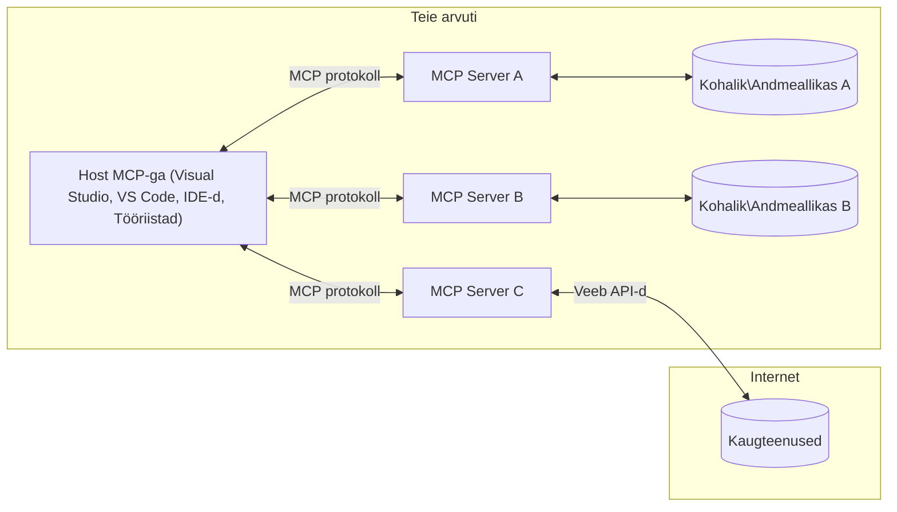

# MCP põhikontseptsioonid: mudelikontekstiprotokolli (MCP) valdamine AI integratsiooniks

[](https://youtu.be/earDzWGtE84)

_(Klõpsake ülaloleval pildil, et vaadata selle tunni videot)_

[Model Context Protocol (MCP)](https://github.com/modelcontextprotocol) on võimas standardiseeritud raamistik, mis optimeerib kommunikatsiooni suuremahuliste keelemudelite (LLM-ide) ja väliste tööriistade, rakenduste ning andmeallikate vahel.  
See juhend juhib teid MCP põhikontseptsioonide kaudu. Õpite selle kliendi-serveri arhitektuuri, olulisi komponente, suhtlemismehhanisme ja parimaid rakendustavasid.

- **Selge kasutaja nõusolek**: Kõik andmetele juurdepääs ja toimingud nõuavad selget kasutaja luba enne teostamist. Kasutajad peavad täpselt teadma, milliseid andmeid töödeldakse ja milliseid samme astutakse, võimalusega granulaarne luba ja volitused hallata.
- **Andmete privaatsuse kaitse**: Kasutaja andmed on avalikustatud ainult selge nõusolekuga ning neid tuleb tugevalt kaitsta juurdepääsukontrolliga kogu suhtlusprotsessi vältel. Rakendused peavad takistama volitamata andmete edastust ning hoida ranget privaatsuspiiri.
- **Tööriistade täitmise turvalisus**: Iga tööriistakutse jaoks on nõutav selge kasutaja luba ja tööriista funktsioonide, parameetrite ning võimaliku mõju arusaamine. Tugevad turvapiirid takistavad soovimatut, ohtlikku või pahatahtlikku tööriistade kasutamist.
- **Transpordikihi turvalisus**: Kõik suhtluskanalid peaksid kasutama sobivat krüpteerimis- ja autentimismehhanismi. Kaugühendused peaksid rakendama turvalisi transpordiprotokolle ja asjakohast mandaatide haldust.

#### Rakendamise juhised:

- **Luba haldus**: Rakenda granulaarseid luba süsteeme, mis võimaldavad kasutajatel kontrollida juurdepääsu serveritele, tööriistadele ja ressurssidele  
- **Autentimine & autoriseerimine**: Kasuta turvalisi autentimismeetodeid (OAuth, API võtmed) koos tokeni halduse ja aegumisega  
- **Sisendi valideerimine**: Kontrolli kõiki parameetreid ja andmesisestusi määratletud skeemide alusel, et vältida süstimisrünnakuid  
- **Auditilogid**: Hoolda põhjalikke logisid kõigist tegevustest turvaseire ja nõuetele vastavuse huvides  

## Ülevaade

Selles tunnis uurime Model Context Protocoli (MCP) põhistruktuuri ja -komponente. Õpite kliendi-serveri arhitektuuri, peamisi komponente ja suhtlusmehhanisme, mis annavad MCP suhtlustele jõu.

## Peamised õpieesmärgid

Selle tunni lõpuks:

- Mõistate MCP kliendi-serveri arhitektuuri.  
- Tuvastate Hostide, Clientide ja Serverite rollid ja vastutused.  
- Analüüsite põhifunktsionaalsusi, mis muudavad MCP paindlikuks integreerimiskihiks.  
- Õpite, kuidas info voog MCP ökosüsteemis liigub.  
- Saate praktilisi teadmisi koodinäidete kaudu .NET, Java, Python ja JavaScripti keeles.  

## MCP arhitektuur: sügavama pilguga

MCP ökosüsteem põhineb kliendi-serveri mudelil. See mooduliline struktuur lubab tehisintellekti rakendustel suhelda tööriistade, andmebaaside, API-de ja kontekstitundlike ressurssidega efektiivselt. Lõhume selle arhitektuuri põhikomponentideks.

Põhiliselt järgib MCP kliendi-serveri arhitektuuri, kus hostrakendus võib ühendada mitme serveriga:


- **MCP Hostid**: Programmid nagu VSCode, Claude Desktop, IDE-d või AI tööriistad, mis soovivad andmetele juurdepääsu MCP kaudu  
- **MCP kliendid**: Protokolli kliendid, kes hoiavad 1:1 ühendust serveritega  
- **MCP serverid**: Kerged programmid, mis igaüks pakuvad kindlaid võimeid standardiseeritud Model Context Protocoli kaudu  
- **Kohalikud andmeallikad**: Teie arvuti failid, andmebaasid ja teenused, millele MCP serverid saavad turvaliselt ligi pääseda  
- **Kaugteenused**: Välised süsteemid internetis, kuhu MCP serverid saavad API-de kaudu ühenduda  

MCP protokoll on arenev standard, kasutades kuupäevapõhist versioonihaldust (formaat YYYY-MM-DD). Praegune protokolli versioon on **2025-11-25**. Viimased uuendused leiate [protokolli spetsifikatsioonist](https://modelcontextprotocol.io/specification/2025-11-25/).

### 1. Hostid

Model Context Protocolis (MCP) on **hostid** AI rakendused, mis toimivad peamise liidesena, mille kaudu kasutajad protokolliga suhtlevad. Hostid koordineerivad ja haldavad ühendusi mitme MCP serveriga, luues iga serveriühenduse jaoks spetsiaalsed MCP kliendid. Hostide näited:

- **AI rakendused**: Claude Desktop, Visual Studio Code, Claude Code  
- **Arenduskeskkonnad**: IDE-d ja koodiredaktorid MCP integratsiooniga  
- **Kohandatud rakendused**: Eesmärgipõhised AI agendid ja tööriistad  

**Hostid** on rakendused, mis koordineerivad AI mudelitega suhtlemist. Need:

- **Orkestreerivad AI mudeleid**: Täidavad või suhtlevad LLMidega vastuste genereerimiseks ja AI töövoogude juhtimiseks  
- **Halduvad kliendiühendused**: Loovad ja hoiavad iga MCP serveriühenduse kohta ühe MCP kliendi  
- **Kontrollivad kasutajaliidest**: Halduvad vestlusevoolu, kasutajate suhtlus ja vastuste esitamisega  
- **Tagavad turvalisuse**: Kontrollivad õigusi, turvapiiranguid ja autentimist  
- **Haldavad kasutaja nõusolekut**: Juhtivad kasutajaluba andmete jagamiseks ja tööriistade käivitamiseks  

### 2. Kliendid

**Kliendid** on olulised komponendid, mis hoiavad pühendatud üks-ühele ühendusi Hostide ja MCP serverite vahel. Iga MCP klient instantsitakse Host'i poolt konkreetse MCP serveriga ühenduseks, tagades organiseeritud ja turvalise suhtluskanali. Mitmed kliendid võimaldavad Hostidel samaaegselt ühendada mitme serveriga.

**Kliendid** on hostrakenduse sees ühenduse komponendid. Need:

- **Protokolli suhtlus**: Saadavad serveritele JSON-RPC 2.0 päringuid koos üleskutsete ja juhistega  
- **Võimekuse läbirääkimine**: Läbiräägivad toetatud funktsioone ja protokolli versioone serveritega initsialiseerimisel  
- **Tööriistade täitmine**: Halduvad mudelite tööriistakäivituse taotlusi ja töötlevad vastuseid  
- **Reaalaegsed uuendused**: Töötlevad serveripoolseid teavitusi ja värskendusi  
- **Vastuste töötlemine**: Töötlevad ning vormindavad serverivastuseid kasutajale kuvamiseks  

### 3. Serverid

**Serverid** on programmid, mis pakuvad konteksti, tööriistu ja funktsioone MCP klientidele. Need võivad töötada lokaalselt (samal masinal, kus Host) või kaugsüsteemides ning vastutavad kliendipäringute töötlemise ja struktureeritud vastuste pakkumise eest. Serverid avavad kindlaid funktsioone standardiseeritud Model Context Protocoli kaudu.

**Serverid** on teenused, mis pakuvad konteksti ja võimeid. Need:

- **Funktsiooni registreerimine**: Registreerivad ja avalikustavad kliendile kättesaadavad primitivesid (ressursid, promptid, tööriistad)  
- **Päringute töötlemine**: Võtavad vastu ja täidavad tööriistakutseid, ressursipäringuid ja promptipäringuid klientidelt  
- **Konteksti pakkumine**: Annavad modelle täiendavat kontekstit ja andmeid vastuste parandamiseks  
- **Seisundi haldus**: Hoiavad sessiooniseisundit ning haldavad vajadusel seisundipõhist suhtlust  
- **Reaalaegsed teavitused**: Saadavad teavitusi võimekuse muutustest ja uuendustest ühendatud klientidele  

Servereid võivad arendada kõik soovijad, et laiendada mudelifunktsionaalsust spetsialiseeritud võimekusega, toetades nii kohalikke kui ka kaugpaigalduste stsenaariume.

### 4. Serveri primitivesid

Model Context Protocolis (MCP) pakuvad serverid kolme põhilist **primitivi**, mis defineerivad rikkalike suhtluste põhistruktuurid klientide, hostide ja keelemudelite vahel. Need primitivesid määratlevad, millist tüüpi kontekstit ja toiminguid protokolli kaudu pakkuda saab.

MCP serverid võivad avalikustada mistahes kombinatsiooni järgmistest kolmest põhielemendist:

#### Ressursid

**Ressursid** on andmeallikad, mis pakuvad AI rakendustele kontekstit. Need esindavad staatilist või dünaamilist sisu, mis aitab mudelit paremini mõista ja otsuseid teha:

- **Kontekstipõhised andmed**: Struktureeritud info ja kontekst AI mudeli tarbeks  
- **Teadmiste baasid**: Dokumendikogud, artiklid, juhendid ja teadustööd  
- **Kohalikud andmeallikad**: Failid, andmebaasid ja kohalik süsteemiinfo  
- **Välised andmed**: API vastused, veebiteenused ja kaugemad süsteemid  
- **Dünaamiline sisu**: Reaalaegsed andmed, mis uuenevad välistest tingimustest lähtuvalt  

Ressursse identifitseeritakse URI-dega ning neid toetavad päringud `resources/list` ja `resources/read`:

```text
file://documents/project-spec.md
database://production/users/schema
api://weather/current
```
  
#### Promptid  

**Promptid** on taaskasutatavad mallid, mis aitavad keelemudelitega suhtlemise struktuuri luua. Need pakuvad standardiseeritud suhtlusmudeleid ning templaatseid töövoogusid:

- **Mallipõhised suhtlused**: Eelstruktureeritud sõnumid ja vestlussoovitused  
- **Töövoo mallid**: Standardiseeritud jadasammud tavapäraste ülesannete jaoks  
- **Mõne näite mallid**: Näidispõhised mallid mudelite juhendamiseks  
- **Süsteemipromptid**: Põhipromptid, mis määravad mudeli käitumise ja konteksti  
- **Dünaamilised mallid**: Parameetriseeritud promptid, mis kohanduvad konkreetse kontekstiga  

Promptid toetavad muutuja asendamist ning neid saab leida `prompts/list` ning lugeda `prompts/get` kaudu:

```markdown
Generate a {{task_type}} for {{product}} targeting {{audience}} with the following requirements: {{requirements}}
```
  
#### Tööriistad  

**Tööriistad** on täidetavad funktsioonid, mida AI mudelid saavad kutsuda konkreetsete toimingute sooritamiseks. Need on MCP ökosüsteemi "teisendid", mis võimaldavad mudelil suhelda välistesüsteemidega:

- **Täidetavad funktsioonid**: Diskreetsed operatsioonid, mida mudel saab kutsuda kindlate parameetritega  
- **Väline süsteemide integratsioon**: API-kutsed, andmebaasipäringud, failitoimingud, arvutused  
- **Unikaalne identiteet**: Igal tööriistal on eristuv nimi, kirjeldus ja parameetrite skeem  
- **Struktureeritud sisend-väljund**: Tööriistad võtavad vastu valideeritud parameetreid ja tagastavad struktureeritud, tüübitud vastuseid  
- **Toimingute võimekus**: Võimaldavad mudelitel sooritada pärismaailma toiminguid ja pärida elusaid andmeid  

Tööriistu defineeritakse JSON skeemiga parameetrite valideerimiseks ning neid avastatakse `tools/list` abil ja jooksutatakse `tools/call` meetodi kaudu. Tööriistadel võivad olla ka **ikoonid** täiendava metaandme kujul parema kasutajaliidese esitlemise tarbeks.  

**Tööriistade annotatsioonid**: Tööriistadel on võimalik määrata käitumise annotatsioone (nt `readOnlyHint`, `destructiveHint`), mis kirjeldavad, kas tööriist on ainult lugemiseks või destruktiivne, aidates klientidel informeeritud otsuseid teha tööriistade täitmisel.

Näidis tööriista definitsioon:

```typescript
server.tool(
  "search_products", 
  {
    query: z.string().describe("Search query for products"),
    category: z.string().optional().describe("Product category filter"),
    max_results: z.number().default(10).describe("Maximum results to return")
  }, 
  async (params) => {
    // Käivita otsing ja tagasta struktureeritud tulemused
    return await productService.search(params);
  }
);
```
  
## Kliendi primitivesid

Model Context Protocolis (MCP) võivad **kliendid** avalikustada primitivesi, mis võimaldavad serveritel hostrakenduselt lisavõimeid küsida. Need kliendipoolse primitivesid lubavad rikkalikumate ning interaktiivsemate serverite rakendusi, mis pääsevad ligi AI mudeli võimalustele ja kasutajasuhtele.

### Väljavõttimine

**Väljavõttimine** võimaldab serveritel pärida keelemudeli lõpetusi kliendi AI rakenduselt. See primitiiv lubab serveritel kasutada LLM võimeid ilma omaenda mudelisõltuvusteta:

- **Mudelist sõltumatu ligipääs**: Serveritel on võimalik pärida lõppvastuseid ilma LLM SDK-sid lisamata või mudeleid hallamata  
- **Serveri algatatud AI**: Lubab serveritel autonoomselt genereerida sisu, kasutades kliendi AI mudelit  
- **Korduvad LLM suhtlused**: Toetab keerukaid stsenaariume, kus serveritel on AI abi vaja edasiseks töötlemiseks  
- **Dünaamiline sisu loomine**: Serverid saavad luua kontekstituid vastuseid hosti mudelit kasutades  
- **Tööriistakutse tugi**: Serverid võivad sisaldada `tools` ja `toolChoice` parameetreid, võimaldades kliendi mudelil tööriistu kutsuda väljavõttimise ajal  

Väljavõttimine algatatakse `sampling/complete` meetodi kaudu, kus serverid saadavad kliendile lõpetuspäringuid.

### Juurdepääsu piirid (Roots)

**Juurdepääsu piirid** pakuvad standardiseeritud viisi, kuidas kliendid saavad serveritele failisüsteemi piire avaldada, aidates serveritel mõista, millistele kaustadele ja failidele neil on ligipääs:

- **Failisüsteemi piirid**: Defineerivad alad, kus serverid võivad failisüsteemis tegutseda  
- **Juurdepääsu kontroll**: Aitavad serveritel mõista, millistele kaustadele ja failidele neil on luba ligi pääseda  
- **Dünaamilised uuendused**: Kliendid saavad serveritele teavitada, kui juurdepääsu piiride nimekiri muutub  
- **URI-põhine tuvastamine**: Juured kasutavad `file://` URI-sid, et kindlaks teha juurdepääsetavad kaustad ja failid  

Juurdepääsu piire otsitakse `roots/list` meetodi kaudu ning kliendid saadavad teavitusi `notifications/roots/list_changed` muutuste korral.

### Andmekogumine (Elicitation)

**Andmekogumine** võimaldab serveritel küsida kliendi liidese kaudu kasutajalt täiendavat infot või kinnitust:

- **Kasutajasisestuse päringud**: Serverid võivad küsida lisainfot tööriistade täitmiseks vajalike parameetrite kohta  
- **Kinnituskastid**: Taotleda kasutaja nõusolekut tundlike või mõjuvate toimingute jaoks  
- **Interaktiivsed töövood**: Lubada serveritel luua samm-sammulisi kasutajaliideseid  
- **Dünaamiline parameetrite kogumine**: Koguda puuduvad või vabatahtlikud parameetrid tööriista täitmisel  

Andmekogumise päringud tehakse `elicitation/request` meetodiga, et koguda kasutajasisendit kliendi liidese kaudu.

**URL-režiimi andmekogumine**: Serverid võivad ka taotleda URL-põhist kasutajaliidest, suunates kasutajaid välistele veebilehtedele autentimiseks, kinnitamiseks või andmete sisestamiseks.

### Logimine

**Logimine** võimaldab serveritel saata struktuuriga logisõnumeid klientidele silumiseks, seireks ja tööettevõtte nähtavuse tagamiseks:

- **Silumise tugi**: Lubab serveritel pakkuda detailseid täitmislogisid veaotsinguks  
- **Tööseire**: Saadab oleku- ja jõudlusmõõdikuid klientidele  
- **Veateadete esitamine**: Pakub üksikasjalikku veakonteksti ja diagnostilist infot  
- **Auditirajad**: Loob põhjalikke logisid serveritegevustest ja otsustest  

Logisõnumeid saadetakse klientidele, et suurendada operatsioonide läbipaistvust ja hõlbustada veaotsingut.

## Infovoog MCP-s

Model Context Protocol (MCP) määratleb struktureeritud teabevoo hostide, klientide, serverite ja mudelite vahel. Selle voo mõistmine aitab selgitada, kuidas kasutajapäringuid töödeldakse ja kuidas mudelivastustes integreeritakse välist tööriistu ja andmeid.

- **Host algatab ühenduse**  
  Hostrakendus (nt IDE või vestlusliides) loob ühenduse MCP serveriga, tavaliselt STDIO, WebSocketi või muu toetatud transpordi kaudu.

- **Võimekuse läbirääkimine**  
  Klient (mis on integreeritud hosti) ja server vahetavad infot toetatud funktsioonide, tööriistade, ressursside ja protokolli versioonide kohta. See tagab, et mõlemad pooled mõistavad, millised võimekused sessioonis saadaval on.

- **Kasutajapäring**  
  Kasutaja suhtleb hostiga (nt sisestab prompti või käsu). Host kogub sisendi ja edastab selle töötlemiseks kliendile.

- **Ressursi või tööriista kasutus**  
  - Klient võib serverilt pärida lisakonteksti või ressursse (nt faile, andmebaasiandmeid või teadmistebaasi artikleid), et rikastada mudeli mõistmist.  
  - Kui mudel otsustab, et on vaja tööriista (nt andmete pärimiseks, arvutuste tegemiseks või API kutsumiseks), saadab klient tööriistakutse päringu serverisse, täpsustades tööriista nime ja parameetreid.  

- **Serveri täitmine**  

  Server võtab vastu ressursi või tööriista päringu, täidab vajalikud toimingud (nagu funktsiooni käivitamine, andmebaasi päring või faili otsimine) ja tagastab tulemused kliendile struktureeritud vormingus.

- **Vastuse loomine**  
  Klient integreerib serveri vastused (ressursiandmed, tööriistade väljundid jms) käimasolevasse mudelisuhtlusse. Mudel kasutab seda teavet põhjaliku ja kontekstitundliku vastuse genereerimiseks.

- **Tulemuste esitamine**  
  Host võtab kliendilt vastu lõpliku väljundi ning esitab selle kasutajale, sageli nii mudeli genereeritud teksti kui ka tööriistade täitmise või ressursside otsingu tulemuste kujul.

See voog võimaldab MCP-l toetada keerukaid, interaktiivseid ja kontekstitundlikke AI rakendusi, ühendades sujuvalt mudeleid väliste tööriistade ja andmeallikatega.

## Protokolli arhitektuur ja kihid

MCP koosneb kahest eraldi arhitektuurikihist, mis töötavad koos, et pakkuda täielikku suhtlusraamistikku:

### Andmekiht

**Andmekiht** rakendab MCP protokolli tuuma, kasutades alusena **JSON-RPC 2.0** protokolli. See kiht määratleb sõnumite struktuuri, semantika ja suhtlusmustrid:

#### Põhikomponendid:

- **JSON-RPC 2.0 protokoll**: Kõik suhtlus toimub standardiseeritud JSON-RPC 2.0 sõnumivormingus meetodikõnede, vastuste ja teadete jaoks
- **Elutsükli haldus**: Haldab ühenduse alustamist, võimekuste läbirääkimist ja seansi lõpetamist klientide ja serverite vahel
- **Serveri primitiivid**: Võimaldab serveritel pakkuda põhifunktsionaalsust tööriistade, ressursside ja käsureatemplaatide kaudu
- **Kliendi primitiivid**: Võimaldab serveritel taotleda LLM-ide proovivõttu, kasutajasisendi väljakutsumist ja logisõnumite saatmist
- **Reaalaja teated**: Toetab asünkroonseid teadete saatmist dünaamiliste uuenduste puhul ilma päringuta

#### Peamised omadused:

- **Protokolli versiooni läbirääkimine**: Kasutab kuupõhist versioonihaldust (AAAA-KK-PP) ühilduvuse tagamiseks
- **Võimekuste avastamine**: Kliendid ja serverid vahetavad toetatud funktsioonide infot algusfaasis
- **Seisundipõhised sessioonid**: Säilitab ühenduse oleku mitme suhtluse vältel konteksti järjepidevuse huvides

### Transpordikiht

**Transpordikiht** haldab MCP osapoolte vahelist suhtluskanalite loomist, sõnumite transporti ja autentimist:

#### Toetatud transpordimehhanismid:

1. **STDIO transport**:
   - Kasutab standardseid sisend/väljund vooge otselingiks protsesside vahel
   - Optimaalne kohalike protsesside vahel sama masina peal ilma võrgu ülekanne kuludeta
   - Sageli kasutatav kohalike MCP serverite rakendustes

2. **Voogedastusega HTTP transport**:
   - Kasutab HTTP POST meetodit kliendilt serverile sõnumite saatmiseks  
   - Valikuline Server-Sent Events (SSE) serverilt kliendile voogedastuseks
   - Võimaldab kaugserveritega suhtlust üle võrkude
   - Toetab standardseid HTTP autentimismeetodeid (tokenid, API võtmed, kohandatud päised)
   - MCP soovitab turvaliseks tokenipõhiseks autentimiseks OAuth kasutamist

#### Transpordi abstraktsioon:

Transpordikiht varjab andmekihilt suhtlustäpi detaile, võimaldades kõigis transpordimehhanismides kasutada sama JSON-RPC 2.0 sõnumivormingut. See abstraktsioon annab rakendustele võimaluse sujuvalt vahetada kohalikke ning kaugrealseid servereid.

### Turvalisuse kaalutlused

MCP rakendused peavad järgima mitmeid olulisi turvapõhimõtteid, et tagada kõikide protokolli toimingute turvalisus, usaldusväärsus ja turvaline suhtlus:

- **Kasutaja nõusolek ja kontroll**: Enne andmete ligipääsu või toimingute tegemist peab kasutaja andma selge nõusoleku. Kasutajatel tuleb olla selge võimekus hallata, millist teavet jagatakse ja millised toimingud on lubatud, seda toetades intuitiivsete kasutajaliidestega tegevuste ülevaatamiseks ja kinnitamiseks.

- **Andmete privaatsus**: Kasutaja andmeid tohib avalikustada ainult eksplitsiitse nõusoleku korral ning need peavad olema kaitstud sobivate juurdepääsu kontrollide kaudu. MCP rakendused peavad vältima volitamata andmeedastust ning tagama privaatsuse kõikides suhtlustes.

- **Tööriistade turvalisus**: Enne tööriista kutsumist on vaja kasutaja selget nõusolekut. Kasutajatele tuleb anda selge ülevaade iga tööriista funktsionaalsusest ning tuleb rakendada tugevad turvapiirangud et vältida soovimatut või ohtlikku tööriistade käivitamist.

Neid turvapõhimõtteid järgides tagab MCP kasutajate usalduse, privaatsuse ja turvalisuse kõigis protokolli suhtlustes ning võimaldab samal ajal võimsaid AI integratsioone.

## Koodi näited: põhikomponendid

Alljärgnevad on mitmes populaarse programmeerimiskeele näited, mis illustreerivad, kuidas rakendada MCP serveri põhikomponente ja tööriistu.

### .NET näide: lihtsa MCP serveri loomine tööriistadega

Praktiline .NET koodi näide, mis demonstreerib lihtsa MCP serveri loomist kohandatud tööriistadega. Näites toimub tööriistade defineerimine ja registreerimine, päringute käsitlemine ning serveri ühendamine Model Context Protocoli abil.

```csharp
using System;
using System.Threading.Tasks;
using ModelContextProtocol.Server;
using ModelContextProtocol.Server.Transport;
using ModelContextProtocol.Server.Tools;

public class WeatherServer
{
    public static async Task Main(string[] args)
    {
        // Create an MCP server
        var server = new McpServer(
            name: "Weather MCP Server",
            version: "1.0.0"
        );
        
        // Register our custom weather tool
        server.AddTool<string, WeatherData>("weatherTool", 
            description: "Gets current weather for a location",
            execute: async (location) => {
                // Call weather API (simplified)
                var weatherData = await GetWeatherDataAsync(location);
                return weatherData;
            });
        
        // Connect the server using stdio transport
        var transport = new StdioServerTransport();
        await server.ConnectAsync(transport);
        
        Console.WriteLine("Weather MCP Server started");
        
        // Keep the server running until process is terminated
        await Task.Delay(-1);
    }
    
    private static async Task<WeatherData> GetWeatherDataAsync(string location)
    {
        // This would normally call a weather API
        // Simplified for demonstration
        await Task.Delay(100); // Simulate API call
        return new WeatherData { 
            Temperature = 72.5,
            Conditions = "Sunny",
            Location = location
        };
    }
}

public class WeatherData
{
    public double Temperature { get; set; }
    public string Conditions { get; set; }
    public string Location { get; set; }
}
```

### Java näide: MCP serveri komponendid

See näide demonstreerib sama MCP serverit ja tööriistade registreerimist nagu eelnevas .NET näites, kuid on teostatud Java keeles.

```java
import io.modelcontextprotocol.server.McpServer;
import io.modelcontextprotocol.server.McpToolDefinition;
import io.modelcontextprotocol.server.transport.StdioServerTransport;
import io.modelcontextprotocol.server.tool.ToolExecutionContext;
import io.modelcontextprotocol.server.tool.ToolResponse;

public class WeatherMcpServer {
    public static void main(String[] args) throws Exception {
        // Loo MCP server
        McpServer server = McpServer.builder()
            .name("Weather MCP Server")
            .version("1.0.0")
            .build();
            
        // Registreeri ilma tööriist
        server.registerTool(McpToolDefinition.builder("weatherTool")
            .description("Gets current weather for a location")
            .parameter("location", String.class)
            .execute((ToolExecutionContext ctx) -> {
                String location = ctx.getParameter("location", String.class);
                
                // Hangi ilmastikuandmed (lihtsustatud)
                WeatherData data = getWeatherData(location);
                
                // Tagasta vormindatud vastus
                return ToolResponse.content(
                    String.format("Temperature: %.1f°F, Conditions: %s, Location: %s", 
                    data.getTemperature(), 
                    data.getConditions(), 
                    data.getLocation())
                );
            })
            .build());
        
        // Ühenda server stdio transpordiga
        try (StdioServerTransport transport = new StdioServerTransport()) {
            server.connect(transport);
            System.out.println("Weather MCP Server started");
            // Hoia server töös kuni protsess on lõpetatud
            Thread.currentThread().join();
        }
    }
    
    private static WeatherData getWeatherData(String location) {
        // Rakendus kutsuks ilma API-d
        // Lihtsustatud näidise eesmärgil
        return new WeatherData(72.5, "Sunny", location);
    }
}

class WeatherData {
    private double temperature;
    private String conditions;
    private String location;
    
    public WeatherData(double temperature, String conditions, String location) {
        this.temperature = temperature;
        this.conditions = conditions;
        this.location = location;
    }
    
    public double getTemperature() {
        return temperature;
    }
    
    public String getConditions() {
        return conditions;
    }
    
    public String getLocation() {
        return location;
    }
}
```

### Python näide: MCP serveri ehitamine

See näide kasutab fastmcp raamistiku, seega veendu, et see on esmalt installitud:

```python
pip install fastmcp
```
Koodinäide:

```python
#!/usr/bin/env python3
import asyncio
from fastmcp import FastMCP
from fastmcp.transports.stdio import serve_stdio

# Loo FastMCP server
mcp = FastMCP(
    name="Weather MCP Server",
    version="1.0.0"
)

@mcp.tool()
def get_weather(location: str) -> dict:
    """Gets current weather for a location."""
    return {
        "temperature": 72.5,
        "conditions": "Sunny",
        "location": location
    }

# Alternatiivne lähenemine, kasutades klassi
class WeatherTools:
    @mcp.tool()
    def forecast(self, location: str, days: int = 1) -> dict:
        """Gets weather forecast for a location for the specified number of days."""
        return {
            "location": location,
            "forecast": [
                {"day": i+1, "temperature": 70 + i, "conditions": "Partly Cloudy"}
                for i in range(days)
            ]
        }

# Registreeri klassi tööriistad
weather_tools = WeatherTools()

# Käivita server
if __name__ == "__main__":
    asyncio.run(serve_stdio(mcp))
```

### JavaScript näide: MCP serveri loomine

Näide demonstreerib MCP serveri loomist JavaScriptis ning kahe ilmaga seotud tööriista registreerimist.

```javascript
// Kasutades ametlikku Model Context Protocol SDK-d
import { McpServer } from "@modelcontextprotocol/sdk/server/mcp.js";
import { StdioServerTransport } from "@modelcontextprotocol/sdk/server/stdio.js";
import { z } from "zod"; // Parameetrite valideerimiseks

// Loo MCP server
const server = new McpServer({
  name: "Weather MCP Server",
  version: "1.0.0"
});

// Määra ilmastikutööriist
server.tool(
  "weatherTool",
  {
    location: z.string().describe("The location to get weather for")
  },
  async ({ location }) => {
    // Tavaliselt kutsutakse siin ilmastiku API-d
    // Näidise lihtsustamiseks
    const weatherData = await getWeatherData(location);
    
    return {
      content: [
        { 
          type: "text", 
          text: `Temperature: ${weatherData.temperature}°F, Conditions: ${weatherData.conditions}, Location: ${weatherData.location}` 
        }
      ]
    };
  }
);

// Määra prognoositööriist
server.tool(
  "forecastTool",
  {
    location: z.string(),
    days: z.number().default(3).describe("Number of days for forecast")
  },
  async ({ location, days }) => {
    // Tavaliselt kutsutakse siin ilmastiku API-d
    // Näidise lihtsustamiseks
    const forecast = await getForecastData(location, days);
    
    return {
      content: [
        { 
          type: "text", 
          text: `${days}-day forecast for ${location}: ${JSON.stringify(forecast)}` 
        }
      ]
    };
  }
);

// Abi funktsioonid
async function getWeatherData(location) {
  // Simuleeri API kõnet
  return {
    temperature: 72.5,
    conditions: "Sunny",
    location: location
  };
}

async function getForecastData(location, days) {
  // Simuleeri API kõnet
  return Array.from({ length: days }, (_, i) => ({
    day: i + 1,
    temperature: 70 + Math.floor(Math.random() * 10),
    conditions: i % 2 === 0 ? "Sunny" : "Partly Cloudy"
  }));
}

// Ühenda server stdio transpordiga
const transport = new StdioServerTransport();
server.connect(transport).catch(console.error);

console.log("Weather MCP Server started");
```

See JavaScripti näide näitab, kuidas luua MCP klient, mis ühendub serveriga, saadab käsu ja töötleb vastuse koos võimalike tehtud tööriistakõnedega.

## Turvalisus ja volitused

MCP sisaldab mitmeid sisseehitatud kontseptsioone ja mehhanisme turvalisuse ja volituste haldamiseks protokolli jooksul:

1. **Tööriistade õiguste kontroll**:  
  Kliendid saavad määrata, milliseid tööriistu mudel tohib sessiooni ajal kasutada. See tagab, et ligipääs on ainult selgelt volitatud tööriistadel, vähendades soovimatute või ohtlike toimingute riski. Õigusi saab konfigureerida dünaamiliselt kasutajapõhiste eelistuste, organisatsioonipoliitikate või suhtluse konteksti põhjal.

2. **Autentimine**:  
  Serverid võivad nõuda autentimist enne tööriistade, ressursside või tundlike toimingute kasutamist. See võib hõlmata API-võtmeid, OAuth tokeneid või muid autentimisskeeme. Korralik autentimine tagab, et ainult usaldusväärsed kliendid ja kasutajad pääsevad serveri võimalustele ligi.

3. **Valideerimine**:  
  Kõigi tööriistade kutsumiste parameetrid valideeritakse. Iga tööriist määratleb oma parameetrite eeldatavad tüübid, vormingud ja piirangud ning server kontrollib saabunud päringuid nende alusel. See takistab vigaste või pahatahtlike sisendite jõudmist tööriistade rakendustesse ja aitab säilitada toimingute terviklikkust.

4. **Kiirusepiirangud**:  
  Kuritarvituste vältimiseks ja serveri ressursside õiglaseks kasutamiseks võivad MCP serverid rakendada päringute ja ressursside kasutamise kiirusepiiranguid. Piiranguid saab seada kasutajapõhiselt, seansi kaupa või üldiselt, aidates kaitsta teenusetõrgete ja ülemäärase ressursikasutuse eest.

Nende mehhanismide kombineerimisel pakub MCP turvalist alust keeltemudelite integreerimiseks väliste tööriistade ja andmeallikatega, võimaldades kasutajatel ja arendajatel täpselt kontrollida ligipääsu ja kasutamist.

## Protokolli sõnumid ja suhtlusvoog

MCP kasutab struktureeritud **JSON-RPC 2.0** sõnumeid, et tagada selged ja usaldusväärsed suhted hostide, klientide ja serverite vahel. Protokoll määratleb konkreetseid sõnumimustreid erinevat tüüpi toimingutele:

### Põhisõnumitüübid:

#### **Initsialiseerimise sõnumid**
- **`initialize` päring**: Loob ühenduse ja läbiräägib protokolli versiooni ning võimekusi
- **`initialize` vastus**: Kinnitab toetatud funktsioonid ja serveri info  
- **`notifications/initialized`**: Teavitab, et initsialiseerimine on lõpetatud ja sessioon valmis

#### **Avastamise sõnumid**
- **`tools/list` päring**: Avastab serverist saadaolevad tööriistad
- **`resources/list` päring**: Loetleb saadaolevad ressursid (andmeallikad)
- **`prompts/list` päring**: Hangib saadaolevad käsureatemplaadid

#### **Täitmise sõnumid**  
- **`tools/call` päring**: Käivitab konkreetse tööriista antud parameetritega
- **`resources/read` päring**: Loeb sisu konkreetse ressursi juurest
- **`prompts/get` päring**: Saab käsureatemplaadi valikuliste parameetritega

#### **Klientpoolsete sõnumid**
- **`sampling/complete` päring**: Server taotleb LLM-i täiendust kliendilt
- **`elicitation/request`**: Server küsib kasutajalt sisendit kliendi liidese kaudu
- **Logisõnumid**: Server saadab struktureeritud logisõnumeid kliendile

#### **Teadete sõnumid**
- **`notifications/tools/list_changed`**: Server teatab tööriistade muudatustest
- **`notifications/resources/list_changed`**: Server teatab ressursside muudatustest  
- **`notifications/prompts/list_changed`**: Server teatab käsureate muudatustest

### Sõnumite struktuur:

Kõik MCP sõnumid järgivad JSON-RPC 2.0 vormingut:
- **Päringusõnumid**: Sisaldavad `id`, `method` ja valikulisi `params` andmeid
- **Vastussõnumid**: Sisaldavad `id` ning kas `result` või `error`  
- **Teatesõnumid**: Sisaldavad `method` ja valikulisi `params` (ilma `id` või vastuseta)

See struktureeritud suhtlus tagab usaldusväärse, jälgitava ja laiendatava koostöö, toetades keerukaid stsenaariume nagu reaalajas uuendused, tööriistade ahelad ja robustne veakäsitlus.

### Ülesanded (katsealune)

**Ülesanded** on katsealune funktsioon, mis pakub kestvaid täitmisümbriseid, võimaldades lükata tulemust väljavõtmise ja staatuse jälgimise hilisemasse aega MCP päringutele:

- **Pika kestvusega toimingud**: Jälgib ressursimahukaid arvutusi, töövoogude automatiseerimist ja partii töötlemist
- **Edasilükatud tulemused**: Pärib ülesande staatust ning hangib tulemused operatsioonide lõpule jõudes
- **Staatuse jälgimine**: Jälgib ülesande edenemist määratletud elutsükli olekutes
- **Mitmeastmelised toimingud**: Toetab keerukaid töövooge, mis hõlmavad mitut suhtlust

Ülesanded ümbritsevad standardseid MCP päringuid, võimaldades asünkroonseid täitmismustreid toimingutele, mida ei saa kohe lõpetada.

## Peamised punktid

- **Arhitektuur**: MCP kasutab kliendi-serveri arhitektuuri, kus hostid haldavad mitut klienti serverite suhtes
- **Osapooled**: Ökosüsteemis on hostid (AI rakendused), kliendid (protokolli ühendajad) ja serverid (võimekuste pakkujad)
- **Transpordimehhanismid**: Suhtlus toetab STDIO (kohalik) ja voogedastusega HTTP koos valikulise SSE-ga (kaug)
- **Põhielemendid**: Serverid avaldavad tööriistu (täidetavad funktsioonid), ressursse (andmeallikad) ja käsureaid (mallid)
- **Kliendi primitiivid**: Serverid saavad taotleda proovivõttu (LLM täiendusi koos tööriistakõnede toetusega), sisendi väljakutsumist (kaasa arvatud URL-režiim), juuri (failisüsteemi piirid) ja logimist klientidelt
- **Katsealused funktsioonid**: Ülesanded pakuvad kestvaid täitmise ümbriseid pika kestvusega tööde jaoks
- **Protokolli alus**: Tugineb JSON-RPC 2.0-le, kasutades kuupõhist versioonihaldust (praegune: 2025-11-25)
- **Reaalaja võimekused**: Toetab teadete saatmist dünaamilisteks uuendusteks ja reaalajas sünkroonimiseks
- **Turvalisus esikohal**: Selge kasutaja nõusolek, andmete privaatsuskaitse ja turvaline transport on põhinõuded

## Harjutus

Kujunda lihtne MCP tööriist, mis oleks kasulik sinu valdkonnas. Määra:
1. Kuidas tööriista nimetatakse
2. Milliseid parameetreid ta saab vastu võtta
3. Millist väljundit ta tagastab
4. Kuidas mudel võiks seda tööriista kasutada kasutajate probleemide lahendamiseks


---

## Mis järgmiseks

Järgmine: [2. peatükk: Turvalisus](../02-Security/README.md)

---

<!-- CO-OP TRANSLATOR DISCLAIMER START -->
**Vastutusest loobumine**:
See dokument on tõlgitud kasutades tehisintellektil põhinevat tõlketeenust [Co-op Translator](https://github.com/Azure/co-op-translator). Kuigi püüame täpsust, palun arvestage, et automatiseeritud tõlked võivad sisaldada vigu või ebatäpsusi. Originaaldokument selle emakeeles tuleks pidada usaldusväärseks allikaks. Tähtsa teabe puhul soovitatakse kasutada professionaalset inimtõlget. Me ei vastuta selle tõlke kasutamisest tulenevate arusaamatuste või valesti tõlgenduste eest.
<!-- CO-OP TRANSLATOR DISCLAIMER END -->