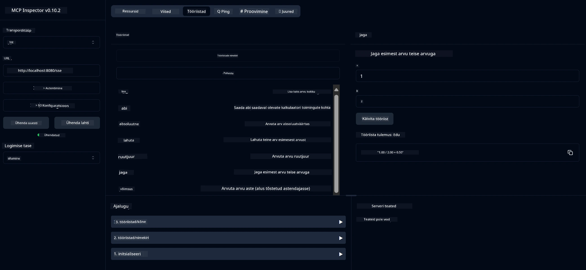

# Põhiline Kalkulaatori MCP Teenus

See teenus pakub põhilisi kalkulaatori operatsioone Model Context Protocol'i (MCP) kaudu, kasutades Spring Boot'i koos WebFlux transpordiga. Teenus on loodud lihtsa näitena algajatele, kes õpivad MCP rakendusi.

Lisateabe saamiseks vaadake [MCP Server Boot Starter](https://docs.spring.io/spring-ai/reference/api/mcp/mcp-server-boot-starter-docs.html) viitedokumentatsiooni.

## Teenuse kasutamine

Teenuse kaudu on MCP protokolli abil kättesaadavad järgmised API lõpp-punktid:

- `add(a, b)`: Liida kaks arvu
- `subtract(a, b)`: Lahuta teine arv esimesest
- `multiply(a, b)`: Korruta kaks arvu
- `divide(a, b)`: Jaga esimene arv teisega (nulli kontrolliga)
- `power(base, exponent)`: Arvuta arvu astendamine
- `squareRoot(number)`: Arvuta ruutjuur (negatiivse arvu kontrolliga)
- `modulus(a, b)`: Arvuta jääk jagamisel
- `absolute(number)`: Arvuta absoluutväärtus

## Sõltuvused

Projekt vajab järgmisi peamisi sõltuvusi:

```xml
<dependency>
    <groupId>org.springframework.ai</groupId>
    <artifactId>spring-ai-starter-mcp-server-webflux</artifactId>
</dependency>
```

## Projekti ehitamine

Ehita projekt Maveniga:
```bash
./mvnw clean install -DskipTests
```

## Serveri käivitamine

### Java kasutamine

```bash
java -jar target/calculator-server-0.0.1-SNAPSHOT.jar
```

### MCP Inspectori kasutamine

MCP Inspector on kasulik tööriist MCP teenustega suhtlemiseks. Selle kalkulaatori teenusega kasutamiseks:

1. **Paigalda ja käivita MCP Inspector** uues terminaliaknas:
   ```bash
   npx @modelcontextprotocol/inspector
   ```

2. **Ava veebiliides** klõpsates rakenduse poolt kuvatud URL-il (tavaliselt http://localhost:6274)

3. **Konfigureeri ühendus**:
   - Määra transporditüübiks "SSE"
   - Määra URL oma töötava serveri SSE lõpp-punktile: `http://localhost:8080/sse`
   - Klõpsa "Connect"

4. **Kasuta tööriistu**:
   - Klõpsa "List Tools", et näha saadaolevaid kalkulaatori operatsioone
   - Vali tööriist ja klõpsa "Run Tool", et operatsiooni käivitada



---

**Lahtiütlus**:  
See dokument on tõlgitud AI tõlketeenuse [Co-op Translator](https://github.com/Azure/co-op-translator) abil. Kuigi püüame tagada täpsust, palume arvestada, et automaatsed tõlked võivad sisaldada vigu või ebatäpsusi. Algne dokument selle algses keeles tuleks pidada autoriteetseks allikaks. Olulise teabe puhul soovitame kasutada professionaalset inimtõlget. Me ei vastuta selle tõlke kasutamisest tulenevate arusaamatuste või valesti tõlgenduste eest.