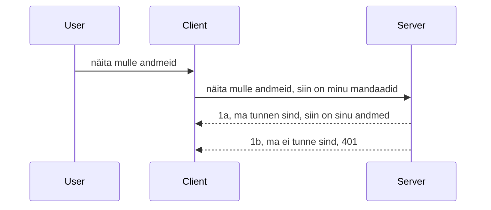

# Lihtne autentimine

MCP SDK-d toetavad OAuth 2.1 kasutamist, mis on tõsi rääkides üsna keeruline protsess, mis hõlmab mõisteid nagu autentimiserver, ressursiserver, kasutajatunnuste postitamine, koodi saamine, koodi vahetamine kandjatõendi vastu kuni lõpuks saad oma ressursiandmed. Kui sa pole OAuthiga harjunud, mis on suurepärane asi rakendada, on hea mõte alustada kõige lihtsamast autentimistasemest ja edasi liikuda aina parema turvalisuse suunas. Just sellepärast see peatükk olemas on, et aidata sul jõuda keerukama autentimiseni.

## Autentimine, mida me silmas peame?

Autentimine on lühend autentimisest ja autoriseerimisest. Mõte on selles, et me peame tegema kaks asja:

- **Autentimine**, mis on protsess kontrollimaks, kas me lubame inimesel meie majja siseneda, et tal on õigus olla "siin", st juurdepääs meie ressursiserverile, kus asuvad meie MCP serveri funktsioonid.
- **Autoriseerimine**, on protsess, mille käigus selgub, kas kasutajal peaks olema juurdepääs konkreetsetele ressurssidele, mida nad küsivad, näiteks need tellimused või need tooted, või kas nad tohtivad sisu lugeda, kuid mitte kustutada, nagu näiteks teine näide.

## Kasutajatunnused: kuidas me süsteemile ütleme, kes me oleme

Enamik veebi arendajaid mõtleb tavaliselt selle peale, kuidas serverile anda kasutajatunnistus, tavaliselt saladus, mis ütleb, kas neil on lubatud siin olla "Autentimine". See kasutajatunnistus on tavaliselt kasutajanime ja parooli base64 kodeeritud versioon või API võti, mis identifitseerib unikaalselt konkreetse kasutaja.

See saadetakse päises nimega "Authorization" järgmiselt:

```json
{ "Authorization": "secret123" }
```
  
Seda nimetatakse tavaliselt baasauthentimiseks. Kogu vool töötab siis järgmiselt:


Nüüd kui me mõistame, kuidas see vooluga töötab, kuidas me seda rakendame? Enamik veebiservereid kasutavad nn middleware’i, mis on kooditükk, mis töötab taotluse osana ja kontrollib kasutajatunnuseid; kui need on kehtivad, lubab taotluse läbi, kui ei ole, siis väljastab autentimisvea. Vaatame, kuidas seda saab teha:

**Python**

```python
class AuthMiddleware(BaseHTTPMiddleware):
    async def dispatch(self, request, call_next):

        has_header = request.headers.get("Authorization")
        if not has_header:
            print("-> Missing Authorization header!")
            return Response(status_code=401, content="Unauthorized")

        if not valid_token(has_header):
            print("-> Invalid token!")
            return Response(status_code=403, content="Forbidden")

        print("Valid token, proceeding...")
       
        response = await call_next(request)
        # lisa kliendi päised või muuda vastust mingil moel
        return response


starlette_app.add_middleware(CustomHeaderMiddleware)
```
  
Siin me:

- Loodud middleware’i nimega `AuthMiddleware`, mille `dispatch` meetod kutsutakse veebiserveri poolt välja.  
- Lisanud middleware’i veebiserverisse:

    ```python
    starlette_app.add_middleware(AuthMiddleware)
    ```
  
- Kirjutanud valideerimisloogika, mis kontrollib, kas Authorization päis on olemas ja kas saadetud saladus on kehtiv:

    ```python
    has_header = request.headers.get("Authorization")
    if not has_header:
        print("-> Missing Authorization header!")
        return Response(status_code=401, content="Unauthorized")

    if not valid_token(has_header):
        print("-> Invalid token!")
        return Response(status_code=403, content="Forbidden")
    ```
  
  Kui saladus on olemas ja kehtiv, lubame taotluse läbi, kutsudes `call_next` ja tagastame vastuse.

    ```python
    response = await call_next(request)
    # lisa mis tahes kliendipead või muuda vastust mingil moel
    return response
    ```
  
See töötab nii, et kui veebitaotlus serverile suunatakse, kutsutakse middleware välja ja selle implementatsiooni põhjal kas lubatakse taotlus läbi või tagastatakse tõrge, mis näitab, et klient ei tohi jätkata.

**TypeScript**

Siin loome middleware’i populaarse raamistiku Express abil ja püüame taotluse kinni enne, kui see jõuab MCP serverisse. Siin on kood:

```typescript
function isValid(secret) {
    return secret === "secret123";
}

app.use((req, res, next) => {
    // 1. Kas autoriseerimis päis on olemas?
    if(!req.headers["Authorization"]) {
        res.status(401).send('Unauthorized');
    }
    
    let token = req.headers["Authorization"];

    // 2. Kontrolli kehtivust.
    if(!isValid(token)) {
        res.status(403).send('Forbidden');
    }

   
    console.log('Middleware executed');
    // 3. Edasta päring järgmisele etapile päringutöötluses.
    next();
});
```
  
Selles koodis me:

1. Kontrollime esmalt, kas Authorization päis on olemas, kui mitte, saadame 401 vea.  
2. Veendume, et kasutajatunnistus/token on kehtiv, kui ei, saadame 403 vea.  
3. Lõpuks laseb taotluse edasi taotluse torus ja tagastab küsitud ressursi.

## Harjutus: Rakenda autentimine

Võtame oma teadmised ja proovime seda rakendada. Plaan on järgmine:

Server

- Loo veebiserver ja MCP eksemplar.  
- Rakenda middleware serverile.

Kliendi pool

- Saada veebitaotlus koos kasutajatunnistusega päise kaudu.

### -1- Loo veebiserver ja MCP eksemplar

Esimeses sammuna peame looma veebiserveri eksemplari ja MCP serveri.

**Python**

Siin loome MCP serveri eksemplari, koostame Starlette veebirakenduse ja majutame selle uvicorniga.

```python
# MCP serveri loomine

app = FastMCP(
    name="MCP Resource Server",
    instructions="Resource Server that validates tokens via Authorization Server introspection",
    host=settings["host"],
    port=settings["port"],
    debug=True
)

# starlette veebirakenduse loomine
starlette_app = app.streamable_http_app()

# rakenduse serveerimine uvicorni kaudu
async def run(starlette_app):
    import uvicorn
    config = uvicorn.Config(
            starlette_app,
            host=app.settings.host,
            port=app.settings.port,
            log_level=app.settings.log_level.lower(),
        )
    server = uvicorn.Server(config)
    await server.serve()

run(starlette_app)
```
  
Selles koodis me:

- Lood MCP serveri.  
- Koostame Starlette veebirakenduse MCP serverist `app.streamable_http_app()`.  
- Jooksutame ja pakume veebirakendust uvicorni abil `server.serve()`.

**TypeScript**

Siin loome MCP serveri eksemplari.

```typescript
const server = new McpServer({
      name: "example-server",
      version: "1.0.0"
    });

    // ... seadista serveri ressursid, tööriistad ja vihjed ...
```
  
See MCP serveri loomine peab toimuma meie POST /mcp marsruudis, nii et liigume eelneva koodiga saadud kohale:

```typescript
import express from "express";
import { randomUUID } from "node:crypto";
import { McpServer } from "@modelcontextprotocol/sdk/server/mcp.js";
import { StreamableHTTPServerTransport } from "@modelcontextprotocol/sdk/server/streamableHttp.js";
import { isInitializeRequest } from "@modelcontextprotocol/sdk/types.js"

const app = express();
app.use(express.json());

// Kaart transpordi salvestamiseks sessiooni ID järgi
const transports: { [sessionId: string]: StreamableHTTPServerTransport } = {};

// Töötle POST-päringuid kliendi ja serveri vaheliseks suhtluseks
app.post('/mcp', async (req, res) => {
  // Kontrolli olemasolevat sessiooni ID-d
  const sessionId = req.headers['mcp-session-id'] as string | undefined;
  let transport: StreamableHTTPServerTransport;

  if (sessionId && transports[sessionId]) {
    // Kasuta olemasolevat transporti uuesti
    transport = transports[sessionId];
  } else if (!sessionId && isInitializeRequest(req.body)) {
    // Uus initsialiseerimispäring
    transport = new StreamableHTTPServerTransport({
      sessionIdGenerator: () => randomUUID(),
      onsessioninitialized: (sessionId) => {
        // Salvesta transport sessiooni ID järgi
        transports[sessionId] = transport;
      },
      // DNSi taaskohandamise kaitse on vaikimisi välja lülitatud tagurpidi ühilduvuse tõttu. Kui sa jooksutad seda serverit
      // kohapeal, siis veendu, et oleks seatud:
      // enableDnsRebindingProtection: true,
      // allowedHosts: ['127.0.0.1'],
    });

    // Puhasta transport, kui see suletakse
    transport.onclose = () => {
      if (transport.sessionId) {
        delete transports[transport.sessionId];
      }
    };
    const server = new McpServer({
      name: "example-server",
      version: "1.0.0"
    });

    // ... seadista serveri ressursid, tööriistad ja viited ...

    // Ühenda MCP serveriga
    await server.connect(transport);
  } else {
    // Vigane päring
    res.status(400).json({
      jsonrpc: '2.0',
      error: {
        code: -32000,
        message: 'Bad Request: No valid session ID provided',
      },
      id: null,
    });
    return;
  }

  // Töötle päringut
  await transport.handleRequest(req, res, req.body);
});

// Taaskasutatav töötleja GET ja DELETE päringutele
const handleSessionRequest = async (req: express.Request, res: express.Response) => {
  const sessionId = req.headers['mcp-session-id'] as string | undefined;
  if (!sessionId || !transports[sessionId]) {
    res.status(400).send('Invalid or missing session ID');
    return;
  }
  
  const transport = transports[sessionId];
  await transport.handleRequest(req, res);
};

// Töötle GET päringuid serveri kliendile suunatud teatiste jaoks SSE kaudu
app.get('/mcp', handleSessionRequest);

// Töötle DELETE päringuid sessiooni lõpetamiseks
app.delete('/mcp', handleSessionRequest);

app.listen(3000);
```
  
Nüüd näed, kuidas MCP serveri loomine on viidud `app.post("/mcp")` sisse.

Liigume edasi järgmise sammu juurde, middleware’i loomisele, et valideerida saabuv kasutajatunnistus.

### -2- Rakenda middleware serverile

Järgmine samm on middleware. Siin loome middleware’i, mis otsib kasutajatunnistust `Authorization` päisest ja valideerib selle. Kui see on aktsepteeritav, laseb taotluse edasi, et teha, mida vaja (nt loetleda tööriistu, lugeda ressurssi või mida iganes klient MCP-lt küsis).

**Python**

Middleware’i loomiseks loome klassi, mis pärib `BaseHTTPMiddleware`-st. Huvi pakuvad kaks asja:

- Taotlus `request`, millest loeme päise info.  
- `call_next`, millist funktsiooni kutsutakse, kui klient on toonud sobiva kasutajatunnistuse.

Kõigepealt peame käsitlema olukorda, kui `Authorization` päis puudub:

```python
has_header = request.headers.get("Authorization")

# päis puudub, tagasta 401, muul juhul liigu edasi.
if not has_header:
    print("-> Missing Authorization header!")
    return Response(status_code=401, content="Unauthorized")
```
  
Siin saadame 401 unauthorized sõnumi, kuna klient ebaõnnestub autentimisel.

Järgmiseks, kui kasutajatunnistus esitati, kontrollime selle kehtivust järgmiselt:

```python
 if not valid_token(has_header):
    print("-> Invalid token!")
    return Response(status_code=403, content="Forbidden")
```
  
Pane tähele, et siin saadetakse 403 keelatud sõnum. Vaatame kogu middleware’i all, mis rakendab kõike eelnevat:

```python
class AuthMiddleware(BaseHTTPMiddleware):
    async def dispatch(self, request, call_next):

        has_header = request.headers.get("Authorization")
        if not has_header:
            print("-> Missing Authorization header!")
            return Response(status_code=401, content="Unauthorized")

        if not valid_token(has_header):
            print("-> Invalid token!")
            return Response(status_code=403, content="Forbidden")

        print("Valid token, proceeding...")
        print(f"-> Received {request.method} {request.url}")
        response = await call_next(request)
        response.headers['Custom'] = 'Example'
        return response

```
  
Hea, aga mis on `valid_token` funktsioon? Siin see on:

```python
# ÄRGE kasutage tootmises - parandage see !!
def valid_token(token: str) -> bool:
    # eemaldage "Bearer " eesliide
    if token.startswith("Bearer "):
        token = token[7:]
        return token == "secret-token"
    return False
```
  
See võiks kindlasti parem olla.

OLULINE: Sa EI TOHI iial omada selliseid salasõnu koodis. Sobivam on väärtus võtta andmeallikast või identiteediteenuse pakkujast (IDP) või veel parem on lasta IDP-l valideerimine teha.

**TypeScript**

Selle rakendamiseks Expressiga peame kasutama `use` meetodit, mis võtab middleware funktsioone.

Peame:

- Kontrollima taotlust, et saada kasutajatunnistus `Authorization` atribuudist.  
- Valideerima kasutajatunnistust ja kui see on hea, laskma taotluse edasi, et kliendi MCP taotlus saaks toimida (nt loetleda tööriistu, lugeda ressurssi vms).

Siin kontrollime, kas `Authorization` päis on olemas ja kui ei ole, peatame taotluse:

```typescript
if(!req.headers["authorization"]) {
    res.status(401).send('Unauthorized');
    return;
}
```
  
Kui päis puudub, saad 401.

Järgmiseks kontrollime kasutajatunnistuse kehtivust, kui see pole korras, peatame taotluse sarnase, kuid erineva sõnumiga:

```typescript
if(!isValid(token)) {
    res.status(403).send('Forbidden');
    return;
} 
```
  
Nüüd saad 403 vea.

Siin on kogu kood:

```typescript
app.use((req, res, next) => {
    console.log('Request received:', req.method, req.url, req.headers);
    console.log('Headers:', req.headers["authorization"]);
    if(!req.headers["authorization"]) {
        res.status(401).send('Unauthorized');
        return;
    }
    
    let token = req.headers["authorization"];

    if(!isValid(token)) {
        res.status(403).send('Forbidden');
        return;
    }  

    console.log('Middleware executed');
    next();
});
```
  
Seadsime veebiserveri vastu võtma middleware'i, et kontrollida klientidelt saadetavat kasutajatunnistust. Aga kuidas on kliendiga?

### -3- Saada veebitaotlus koos kasutajatunnistusega päises

Peame tagama, et klient saadab kasutajatunnistuse läbi päise. Kuna kasutame MCP klienti, peame välja mõtlema, kuidas seda tehakse.

**Python**

Kliendi jaoks peame päisesse lisama kasutajatunnistuse nii:

```python
# ÄRA kõvenda väärtust, hoia seda vähemalt keskkonnamuutujas või turvalisemas salvestuses
token = "secret-token"

async with streamablehttp_client(
        url = f"http://localhost:{port}/mcp",
        headers = {"Authorization": f"Bearer {token}"}
    ) as (
        read_stream,
        write_stream,
        session_callback,
    ):
        async with ClientSession(
            read_stream,
            write_stream
        ) as session:
            await session.initialize()
      
            # TODO, mida soovid kliendis teha, nt tööriistade loetelu, tööriistade kutsumine jne.
```
  
Pane tähele, kuidas me täidame `headers` atribuuti: `headers = {"Authorization": f"Bearer {token}"}`.

**TypeScript**

Seda saab lahendada kahes etapis:

1. Täida konfiguratsioonimassiiv meie kasutajatunnistusega.  
2. Sööda konfiguratsioonimassiiv transpordile.

```typescript

// ÄRGE kõvakodeerige väärtust nagu siin näidatud. Vähemalt hoidke see keskkonnamuutujana ja kasutage midagi sellist nagu dotenv (arendusrežiimis).
let token = "secret123"

// määratlege kliendi transpordi valikute objekt
let options: StreamableHTTPClientTransportOptions = {
  sessionId: sessionId,
  requestInit: {
    headers: {
      "Authorization": "secret123"
    }
  }
};

// edastage valikute objekt transpordile
async function main() {
   const transport = new StreamableHTTPClientTransport(
      new URL(serverUrl),
      options
   );
```
  
Ülal näed, kuidas lõime `options` objekti ja panime päised `requestInit` atribuudi alla.

OLULINE: Kuidas seda paremaks muuta? Praegune lahendus on natuke riskantne, eriti kui sul pole HTTPS-i. Isegi siis võib kasutajatunnistus varastada, nii et vajad süsteemi, kus tokenit saab kergesti tagasi kutsuda ja lisada lisakontrolle, näiteks kust maailmast ta pärineb, kas taotlused tulevad liiga tihti (botilaadne käitumine), kokkuvõttes on palju kaalutlusi.

Siiski tuleb öelda, et väga lihtsate API-de puhul, kus sa ei soovi, et keegi helistaks sinu API-le ilma autentita, on see hea algus.

Sellegipoolest proovime turvalisust natuke tugevdada, kasutades standardiseeritud vormingut nagu JSON Web Token ehk JWT või "JOT" tokenid.

## JSON Web Tokenid, JWT

Proovime paremaks muuta lihtsa kasutajatunnistuse saatmist. Millised on lähteparandused JWT kasutamisel?

- **Turvalisuse paranemine**. Baasauth'is saadad pidevalt kasutajanime ja parooli base64 kodeerituna (või API võtme), mis suurendab riski. JWT kasutamisel saadad oma kasutajanime ja parooli ja vastu saad tokeni, mis on ajaliselt piiratud, s.t see aegub. JWT võimaldab kasutada peenhäälestatud juurdepääsu kaudu rolle, skoopasid ja õigusi.  
- **Seisunditu ja skaleeritavus**. JWT-d kannavad kasutaja infot endas ja elimineerivad vajaduse hoida serveripoolset sessioonisalvestust. Tokenit saab valideerida kohapeal.  
- **Ühilduvus ja föderatsioon**. JWT on keskne Open ID Connect’is ja kasutatakse tuntud identiteedipakkujate nagu Entra ID, Google Identity ja Auth0-ga. Nad võimaldavad ka ühtset sisselogimist (SSO) ja palju muud, muutes selle ettevõtteklassiks.  
- **Moodulaarne ja paindlik**. JWT-d saab kasutada ka API väravate nagu Azure API Management, NGINX ja teistega. See toetab erinevaid autentimisstsenaariume ja serveri-vahelist suhtlust, sealhulgas esindamist ja volituste andmist.  
- **Jõudlus ja vahemälu**. JWT-d saab dekodeerimise järel vahemällu panna, mis vähendab vajadust parsimiseks. See aitab eriti suurte koormuste korral parandades läbilaset ja vähendades infrastruktuuri koormust.  
- **Täiustatud funktsioonid**. Toetab ka introspektsiooni (kehtivuse kontroll serveris) ja tühistamist (tokeni kehtetuks muutmist).

Kõikide nende eeliste tõttu vaatame, kuidas oma lahendust järgmisele tasemele viia.

## Baasauth teisendamine JWT-ks

Põhimõtteliselt peame tegema järgmised muudatused:

- **Õppima JWT tokeni konstrueerima** ja valmistama selle ette kliendilt serverile saatmiseks.  
- **JWT tokenit valideerima**, ning kui see on korrektne, lubama kliendil ligipääsu meie ressurssidele.  
- **Hoida token turvaliselt**. Kuidas me seda tokenit hoiustame.  
- **Kaitsta marsruute**. Peame kaitsma marsruute, meie puhul MCP marsruute ja spetsiifilisi funktsioone.  
- **Lisa uuendus-tokenid**. Tagada, et loome lühiajalisi tokeneid, aga ka pikemaajalise kehtivusega uuendus-tokenid, mille abil saab uusi tokeneid pidada kui vanad aeguvad. Samuti peab olema uuendus-endpoint ja rotatsiooni strateegia.

### -1- Konstrueeri JWT token

JWT token koosneb järgmistest osadest:

- **päis (header)**, kasutatav algoritm ja tokeni tüüp.  
- **koormus (payload)**, claims ehk avaldused nagu `sub` (kasutaja või entiteedi ID, kelle esindamisel token on, tavaliselt kasutaja ID), `exp` (aegumiskuupäev), roll (role).  
- **allkiri (signature)**, mille signeeritakse saladuse või privaatvõtmega.

Vajame päise, koormuse ja kodeeritud tokeni konstrueerimist.

**Python**

```python

import jwt
import jwt
from jwt.exceptions import ExpiredSignatureError, InvalidTokenError
import datetime

# Saladusvõti JWT allkirjastamiseks
secret_key = 'your-secret-key'

header = {
    "alg": "HS256",
    "typ": "JWT"
}

# kasutaja info ning selle nõuded ja aegumisaeg
payload = {
    "sub": "1234567890",               # Teema (kasutaja ID)
    "name": "User Userson",                # Kohandatud nõue
    "admin": True,                     # Kohandatud nõue
    "iat": datetime.datetime.utcnow(),# Väljaandmise aeg
    "exp": datetime.datetime.utcnow() + datetime.timedelta(hours=1)  # Aegumisaeg
}

# kodeeri see
encoded_jwt = jwt.encode(payload, secret_key, algorithm="HS256", headers=header)
```
  
Ülaltoodud koodis:

- Määrasime päise HS256 algoritmi ja JWT tüübiga.  
- Koostasime koormuse, mis sisaldab teemat (subject või userid), kasutajanime, rolli, väljastamise aega ja aegumisaja, mis realiseerib ajaliselt piiratud tokeni.

**TypeScript**

Siin vajame mõningaid sõltuvusi, mis aitavad JWT tokenit konstrueerida.

Sõltuvused

```sh

npm install jsonwebtoken
npm install --save-dev @types/jsonwebtoken
```
  
Nüüd kui see on olemas, loome päise, koormuse ja läbi selle kodeeritud tokeni.

```typescript
import jwt from 'jsonwebtoken';

const secretKey = 'your-secret-key'; // Kasuta keskkonnamuutujaid tootmises

// Määratle koormus
const payload = {
  sub: '1234567890',
  name: 'User usersson',
  admin: true,
  iat: Math.floor(Date.now() / 1000), // Väljastatud ajal
  exp: Math.floor(Date.now() / 1000) + 60 * 60 // Aegub 1 tunni pärast
};

// Määratle päis (valikuline, jsonwebtoken määrab vaikeväärtused)
const header = {
  alg: 'HS256',
  typ: 'JWT'
};

// Loo token
const token = jwt.sign(payload, secretKey, {
  algorithm: 'HS256',
  header: header
});

console.log('JWT:', token);
```
  
See token:

- On signeeritud HS256-ga  
- Kehtib 1 tunni  
- Sisaldab claims nagu sub, name, admin, iat ja exp.

### -2- Tokeni valideerimine

Tokenit tuleb valideerida serveri poolel, et veenduda, kas klient saadab tõepoolest kehtiva tokeni. Peame tegema palju kontrolle alates struktuuri kontrollist kuni kehtivuseni. Soovitav on lisaks veenduda, et token viitab süsteemis olevale kasutajale ja kasutajal on õigused, mida token väidab.

Tokeni valideerimiseks dekodeerime selle, et seda lugeda ja kontrollida:

**Python**

```python

# Dekodeeri ja kontrolli JWT-d
try:
    decoded = jwt.decode(token, secret_key, algorithms=["HS256"])
    print("✅ Token is valid.")
    print("Decoded claims:")
    for key, value in decoded.items():
        print(f"  {key}: {value}")
except ExpiredSignatureError:
    print("❌ Token has expired.")
except InvalidTokenError as e:
    print(f"❌ Invalid token: {e}")

```
  
Selles koodis kutsume `jwt.decode` funktsiooni, sisendiks token, saladusvõti ja algoritm. Kasutame proovikonstrukt, sest ebaõnnestunud valideerimisel tõstetakse viga.

**TypeScript**

Siin kutsume `jwt.verify` funktsiooni, et saada dekodeeritud tokenit, mida edasi uurida. Kui see ebaõnnestub, on tokeni struktuur vale või see ei ole kehtiv.

```typescript

try {
  const decoded = jwt.verify(token, secretKey);
  console.log('Decoded Payload:', decoded);
} catch (err) {
  console.error('Token verification failed:', err);
}
```
  
MÄRKUS: nagu eelnevalt mainitud, peaksime tegema veel lisakontrolle, et kontrollida, kas see token viitab mõnele kasutajale meie süsteemis ja kas tal on nõutavad õigused.
Järgmine samm on vaadata rollipõhist juurdepääsukontrolli, tuntud ka kui RBAC.

## Rollipõhise juurdepääsukontrolli lisamine

Idee on, et me tahame väljendada, et erinevatel rollidel on erinevad õigused. Näiteks eeldame, et admin saab kõike teha, tavakasutaja saab lugeda/kirjutada ja külaline saab ainult lugeda. Seega on mõned võimalikud õiguste tasemed:

- Admin.Write 
- User.Read
- Guest.Read

Vaatame, kuidas saame sellist kontrolli vahevara abil rakendada. Vahemooduleid saab lisada nii raja kohta kui ka kõigile radadele.

**Python**

```python
from starlette.middleware.base import BaseHTTPMiddleware
from starlette.responses import JSONResponse
import jwt

# ÄRA hoia saladust koodis, see on ainult demonstratsiooni eesmärgil. Loe see turvalisest kohast.
SECRET_KEY = "your-secret-key" # pane see keskkonnamuutujasse
REQUIRED_PERMISSION = "User.Read"

class JWTPermissionMiddleware(BaseHTTPMiddleware):
    async def dispatch(self, request, call_next):
        auth_header = request.headers.get("Authorization")
        if not auth_header or not auth_header.startswith("Bearer "):
            return JSONResponse({"error": "Missing or invalid Authorization header"}, status_code=401)

        token = auth_header.split(" ")[1]
        try:
            decoded = jwt.decode(token, SECRET_KEY, algorithms=["HS256"])
        except jwt.ExpiredSignatureError:
            return JSONResponse({"error": "Token expired"}, status_code=401)
        except jwt.InvalidTokenError:
            return JSONResponse({"error": "Invalid token"}, status_code=401)

        permissions = decoded.get("permissions", [])
        if REQUIRED_PERMISSION not in permissions:
            return JSONResponse({"error": "Permission denied"}, status_code=403)

        request.state.user = decoded
        return await call_next(request)


```

On mitu erinevat võimalust sellise vahevara lisamiseks nagu allpool:

```python

# Alt 1: lisa vahevara rakenduse loomise ajal starlette'i jaoks
middleware = [
    Middleware(JWTPermissionMiddleware)
]

app = Starlette(routes=routes, middleware=middleware)

# Alt 2: lisa vahevara pärast starlette'i rakenduse juba loomist
starlette_app.add_middleware(JWTPermissionMiddleware)

# Alt 3: lisa vahevara iga marsruudi jaoks
routes = [
    Route(
        "/mcp",
        endpoint=..., # käsitleja
        middleware=[Middleware(JWTPermissionMiddleware)]
    )
]
```

**TypeScript**

Saame kasutada `app.use` ja vahevara, mis jookseb kõigi päringute puhul. 

```typescript
app.use((req, res, next) => {
    console.log('Request received:', req.method, req.url, req.headers);
    console.log('Headers:', req.headers["authorization"]);

    // 1. Kontrolli, kas volituse päis on saadetud

    if(!req.headers["authorization"]) {
        res.status(401).send('Unauthorized');
        return;
    }
    
    let token = req.headers["authorization"];

    // 2. Kontrolli, kas märgis on kehtiv
    if(!isValid(token)) {
        res.status(403).send('Forbidden');
        return;
    }  

    // 3. Kontrolli, kas märgi kasutaja eksisteerib meie süsteemis
    if(!isExistingUser(token)) {
        res.status(403).send('Forbidden');
        console.log("User does not exist");
        return;
    }
    console.log("User exists");

    // 4. Kontrolli, kas märgil on õiged õigused
    if(!hasScopes(token, ["User.Read"])){
        res.status(403).send('Forbidden - insufficient scopes');
    }

    console.log("User has required scopes");

    console.log('Middleware executed');
    next();
});

```

On päris palju asju, mida me saame ja PEAME lubama oma vahemoodulis teha, nimelt:

1. Kontrollida, kas autoriseerimispealkiri on olemas
2. Kontrollida, kas token on kehtiv, kutsume `isValid` meetodit, mille me kirjutasime, et kontrollida JWT tokeni terviklikkust ja kehtivust.
3. Kontrollida, kas kasutaja eksisteerib meie süsteemis, seda peaksime kontrollima.

   ```typescript
    // kasutajad andmebaasis
   const users = [
     "user1",
     "User usersson",
   ]

   function isExistingUser(token) {
     let decodedToken = verifyToken(token);

     // TODO, kontrolli, kas kasutaja on andmebaasis olemas
     return users.includes(decodedToken?.name || "");
   }
   ```

   Ülal loodi väga lihtne `users` nimekiri, mis peaks loomulikult olema andmebaasis.

4. Lisaks peaksime kontrollima, kas tokenil on õiged õigused.

   ```typescript
   if(!hasScopes(token, ["User.Read"])){
        res.status(403).send('Forbidden - insufficient scopes');
   }
   ```

   Ülalolevas vahemooduli koodis kontrollime, et token sisaldab User.Read õigust, kui mitte, saadame 403 vea. Allpool on `hasScopes` abimeetod.

   ```typescript
   function hasScopes(scope: string, requiredScopes: string[]) {
     let decodedToken = verifyToken(scope);
    return requiredScopes.every(scope => decodedToken?.scopes.includes(scope));
  }
   ```

Have a think which additional checks you should be doing, but these are the absolute minimum of checks you should be doing.

Using Express as a web framework is a common choice. There are helpers library when you use JWT so you can write less code.

- `express-jwt`, helper library that provides a middleware that helps decode your token.
- `express-jwt-permissions`, this provides a middleware `guard` that helps check if a certain permission is on the token.

Here's what these libraries can look like when used:

```typescript
const express = require('express');
const jwt = require('express-jwt');
const guard = require('express-jwt-permissions')();

const app = express();
const secretKey = 'your-secret-key'; // put this in env variable

// Decode JWT and attach to req.user
app.use(jwt({ secret: secretKey, algorithms: ['HS256'] }));

// Check for User.Read permission
app.use(guard.check('User.Read'));

// multiple permissions
// app.use(guard.check(['User.Read', 'Admin.Access']));

app.get('/protected', (req, res) => {
  res.json({ message: `Welcome ${req.user.name}` });
});

// Error handler
app.use((err, req, res, next) => {
  if (err.code === 'permission_denied') {
    return res.status(403).send('Forbidden');
  }
  next(err);
});

```

Nüüd olete näinud, kuidas vahevara saab kasutada nii autentimiseks kui ka autoriseerimiseks, aga kuidas on MCP-ga, kas see muudab autentimist? Vaatame seda järgmises jaotises.

### -3- Lisa RBAC MCP-le

Olete seni näinud, kuidas saate RBAC-i lisada vahevara kaudu, kuid MCP puhul puudub lihtne viis lisada per-MCP funktsiooni RBAC-i, nii et mida me teeme? Me lihtsalt lisame sellise koodi, mis kontrollib, kas klientil on õigus kutsuda konkreetset tööriista:

Teil on mitu erinevat võimalust, kuidas saavutada per-funktsiooni RBAC, siin on mõned:

- Lisada kontroll iga tööriista, ressursi, prompti jaoks, kus peate kontrollima õigustaset.

   **python**

   ```python
   @tool()
   def delete_product(id: int):
      try:
          check_permissions(role="Admin.Write", request)
      catch:
        pass # klient ebaõnnestus autoriseerimisel, tõsta autoriseerimisviga
   ```

   **typescript**

   ```typescript
   server.registerTool(
    "delete-product",
    {
      title: Delete a product",
      description: "Deletes a product",
      inputSchema: { id: z.number() }
    },
    async ({ id }) => {
      
      try {
        checkPermissions("Admin.Write", request);
        // todo, saada id productService'i ja kaugentryle
      } catch(Exception e) {
        console.log("Authorization error, you're not allowed");  
      }

      return {
        content: [{ type: "text", text: `Deletected product with id ${id}` }]
      };
    }
   );
   ```


- Kasutada täiustatud serveri lähenemist ja päringu käitlejaid, et vähendada kohtade arvu, kus peate kontrolli tegema.

   **Python**

   ```python
   
   tool_permission = {
      "create_product": ["User.Write", "Admin.Write"],
      "delete_product": ["Admin.Write"]
   }

   def has_permission(user_permissions, required_permissions) -> bool:
      # kasutajaõiguste nimekiri, mis kasutajal on
      # nõutavate õiguste nimekiri tööriista jaoks
      return any(perm in user_permissions for perm in required_permissions)

   @server.call_tool()
   async def handle_call_tool(
     name: str, arguments: dict[str, str] | None
   ) -> list[types.TextContent]:
    # Eeldatakse, et request.user.permissions on kasutaja õiguste nimekiri
     user_permissions = request.user.permissions
     required_permissions = tool_permission.get(name, [])
     if not has_permission(user_permissions, required_permissions):
        # Tõsta viga "Teil puudub luba tööriista {name} kutsumiseks"
        raise Exception(f"You don't have permission to call tool {name}")
     # jätka ja kutsu tööriist
     # ...
   ```   
   

   **TypeScript**

   ```typescript
   function hasPermission(userPermissions: string[], requiredPermissions: string[]): boolean {
       if (!Array.isArray(userPermissions) || !Array.isArray(requiredPermissions)) return false;
       // Tagasta true, kui kasutajal on vähemalt üks nõutav luba
       
       return requiredPermissions.some(perm => userPermissions.includes(perm));
   }
  
   server.setRequestHandler(CallToolRequestSchema, async (request) => {
      const { params: { name } } = request;
  
      let permissions = request.user.permissions;
  
      if (!hasPermission(permissions, toolPermissions[name])) {
         return new Error(`You don't have permission to call ${name}`);
      }
  
      // jätka..
   });
   ```

   Märkus, teil tuleb tagada, et teie vahevara määraks dekrüpteeritud tokeni päringu user omaduseks, nii on kood ülal lihtsam.

### Kokkuvõte

Nüüd kui me arutasime, kuidas lisada toetust RBAC-ile üldiselt ja MCP-le konkreetsemalt, on aeg proovida ise turvalisust rakendada, et veenduda, et mõistate teie ees esitatud kontseptsioone.

## Ülesanne 1: Ehita MCP server ja MCP klient, kasutades baasautentimist

Siin kasutate seda, mida õppisite volituste saatmise kohta päiste kaudu.

## Lahendus 1

[Lahendus 1](./code/basic/README.md)

## Ülesanne 2: Uuenda Ülesande 1 lahendust, kasutades JWT-d

Võta esimene lahendus ja seekord parandame seda.

Basic Auth asemel kasutame JWT-d.

## Lahendus 2

[Lahendus 2](./solution/jwt-solution/README.md)

## Väljakutse

Lisa RBAC iga tööriista jaoks, nagu on kirjeldatud jaotises "Lisa RBAC MCP-le".

## Kokkuvõte

Loodetavasti olete selles peatükis palju õppinud, alates turvalisuseta olukorrast, baastasemel turvalisusest, JWT-st ja selle lisamisest MCP-le.

Oleme loonud tugeva aluse kohandatud JWT-dega, kuid kui me skaleerime, liigume standardipõhise identiteedimudeli suunas. IdP nagu Entra või Keycloak kasutusele võtmine võimaldab meil tokenite väljastamise, valideerimise ja elutsükli halduse usaldusväärsele platvormile üle anda — vabastades meid rakenduse loogikale ja kasutajakogemusele keskendumiseks.

Selle jaoks on meil edasijõudnutele mõeldud [peatükk Entra kohta](../../05-AdvancedTopics/mcp-security-entra/README.md)

## Mis järgnevalt

- Järgmine: [MCP hostide seadistamine](../12-mcp-hosts/README.md)

---

<!-- CO-OP TRANSLATOR DISCLAIMER START -->
**Vastutusest loobumine**:
See dokument on tõlgitud tehisintellekti tõlke teenuse [Co-op Translator](https://github.com/Azure/co-op-translator) abil. Kuigi püüame tagada täpsuse, olge teadlikud, et automaatsed tõlked võivad sisaldada vigu või ebatäpsusi. Originaaldokument selle emakeeles tuleks pidada autoriteetseks allikaks. Olulise teabe puhul soovitatakse kasutada professionaalset inimtõlget. Me ei vastuta mingite arusaamatuste või valesti tõlgenduste eest, mis võivad tekkida selle tõlke kasutamisest.
<!-- CO-OP TRANSLATOR DISCLAIMER END -->