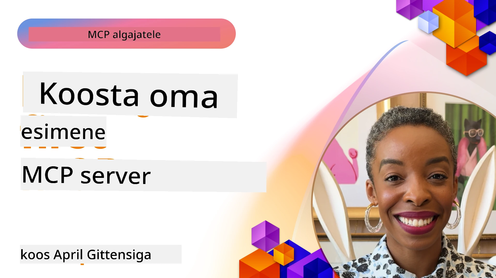

## Alustamine  

_(Klõpsa ülaloleval pildil, et vaadata selle õppetunni videot)_

See sektsioon koosneb mitmest õppetunnist:

- **1 Sinu esimene server**, selles esimeses õppetunnis õpid, kuidas luua oma esimene server ja uurida seda inspector-tööriistaga, mis on väärtuslik viis serveri testimiseks ja silumiseks, [õppetundi](01-first-server/README.md)

- **2 Klient**, selles õppetunnis õpid, kuidas kirjutada klient, kes suudab su serveriga ühenduda, [õppetundi](02-client/README.md)

- **3 Klient koos LLM-iga**, veelgi parem viis kliendi kirjutamiseks on lisada sellesse LLM, et ta saaks oma serveriga "läbirääkimisi" pidada, mida teha, [õppetundi](03-llm-client/README.md)

- **4 Serveri kasutamine GitHub Copilot Agent režiimis Visual Studio Code’is**. Siin vaatleme, kuidas käivitada meie MCP-serverit Visual Studio Code’i sees, [õppetundi](04-vscode/README.md)

- **5 stdio transpordi server** stdio transport on MCP serveri ja kliendi vahelise lokaalse suhtluse soovitatud standard, mis pakub turvalist protsessipõhist suhtlust sisemise protsesside isolatsiooniga [õppetundi](05-stdio-server/README.md)

- **6 HTTP striiming MCP-ga (Streamable HTTP)**. Õpi moodsa HTTP striiming transpordi kohta (soovitatav lähenemine kaug-MCP serverite puhul vastavalt [MCP spetsifikatsioonile 2025-11-25](https://spec.modelcontextprotocol.io/specification/2025-11-25/basic/transports/#streamable-http)), edenemisteavitused ning kuidas realiseerida skaleeritavaid, reaalajas MCP servereid ja kliente Streamable HTTP abil. [õppetundi](06-http-streaming/README.md)

- **7 AI tööriistakomplekti kasutamine VSCode’is** oma MCP klientide ja serverite testimiseks ja tarbimiseks [õppetundi](07-aitk/README.md)

- **8 Testimine**. Siin keskendume eelkõige sellele, kuidas testida meie serverit ja klienti erinevatel viisidel, [õppetundi](08-testing/README.md)

- **9 Juhtimine**. Selles peatükis vaatleme erinevaid viise, kuidas MCP lahendusi juurutada, [õppetundi](09-deployment/README.md)

- **10 Täiustatud serveri kasutamine**. See peatükk käsitleb serveri täiustatud kasutamist, [õppetundi](./10-advanced/README.md)

- **11 Autentimine**. Selles peatükis käsitletakse lihtsa autentimise lisamist, alates Basic Auth kuni JWT ja RBAC kasutamiseni. Soovitame alustada siit ja seejärel vaadata täiendavaid turvatõstmise soovitusi peatükis 5 ja 2, [õppetundi](./11-simple-auth/README.md)

- **12 MCP host’id**. Konfigureeri ja kasuta populaarseid MCP host-kliente nagu Claude Desktop, Cursor, Cline ja Windsurf. Õpi transporditüüpe ja tõrkeotsingut, [õppetundi](./12-mcp-hosts/README.md)

- **13 MCP Inspector**. Silu ja testi oma MCP servereid interaktiivselt MCP Inspector tööriista abil. Õpi lahendama tööriistade, ressursside ja protokollisõnumite probleeme, [õppetundi](./13-mcp-inspector/README.md)

Model Context Protocol (MCP) on avatud protokoll, mis standardiseerib, kuidas rakendused pakuvad konteksti LLM-idele. Mõtle MCP-le nagu USB-C port AI-rakendustele – see pakub standardiseeritud viisi AI mudelite ühendamiseks erinevate andmeallikate ja tööriistadega.

## Õpieesmärgid

Selle õppetunni lõpuks oskad:

- Seadistada MCP arenduskeskkonnad C#, Java, Python, TypeScript ja JavaScript jaoks
- Luua ja juurutada põhilisi MCP servereid kohandatud võimalustega (ressursid, promptid ja tööriistad)
- Luua host-rakendusi, mis ühenduvad MCP serveritega
- Testida ja siluda MCP rakendusi
- Mõista tavalisi seadistamise väljakutseid ja nende lahendusi
- Ühenduda oma MCP rakendustega populaarsete LLM teenustega

## MCP keskkonna seadistamine

Enne kui hakkad MCP-ga tööle, on tähtis ette valmistada oma arenduskeskkond ja mõista põhivoogu. See jaotis juhendab sind esmase seadistuse sammudes, et MCP-ga sujuvalt alustada.

### Nõuded

Enne MCP arendusse süvenemist peaksid olema olemas:

- **Arenduskeskkond**: oma valitud keele jaoks (C#, Java, Python, TypeScript või JavaScript)
- **IDE/tekstiredaktor**: Visual Studio, Visual Studio Code, IntelliJ, Eclipse, PyCharm või mõni kaasaegne koodiredaktor
- **Pakettide haldurid**: NuGet, Maven/Gradle, pip või npm/yarn
- **API võtmekaardid**: mis tahes AI teenuste jaoks, mida plaanid host-rakendustes kasutada

### Ametlikud SDK-d

Järgmistes peatükkides näed lahendusi, mis on ehitatud Pythonis, TypeScriptis, Javas ja .NET-s. Siin on kõik ametlikult toetatud SDK-d.

MCP pakub ametlikke SDK-sid mitmele keeltele (kooskõlas [MCP spetsifikatsiooniga 2025-11-25](https://spec.modelcontextprotocol.io/specification/2025-11-25/)):
- [C# SDK](https://github.com/modelcontextprotocol/csharp-sdk) - Hooldatud koostöös Microsoftiga
- [Java SDK](https://github.com/modelcontextprotocol/java-sdk) - Hooldatud koostöös Spring AI-ga
- [TypeScript SDK](https://github.com/modelcontextprotocol/typescript-sdk) - Ametlik TypeScripti teostus
- [Python SDK](https://github.com/modelcontextprotocol/python-sdk) - Ametlik Pythoni teostus (FastMCP)
- [Kotlin SDK](https://github.com/modelcontextprotocol/kotlin-sdk) - Ametlik Kotlin'i teostus
- [Swift SDK](https://github.com/modelcontextprotocol/swift-sdk) - Hooldatud koostöös Loopwork AI-ga
- [Rust SDK](https://github.com/modelcontextprotocol/rust-sdk) - Ametlik Rusti teostus
- [Go SDK](https://github.com/modelcontextprotocol/go-sdk) - Ametlik Go teostus

## Põhipunktid

- MCP arenduskeskkonna seadistamine on lihtne, kasutades keelespetsiifilisi SDK-sid
- MCP serverite loomine hõlmab tööriistade loomist ja registreerimist selgete skeemidega
- MCP kliendid ühenduvad serverite ja mudelitega, et kasutada laiendatud võimalusi
- Testimine ja silumine on olulised usaldusväärsete MCP rakenduste kindlustamiseks
- Juhtimisvalikud ulatuvad lokaalsest arendusest pilvepõhiste lahendusteni

## Harjutamine

Meil on hulk näiteid, mis täiendavad kõigi selle sektsiooni peatükkide harjutusi. Igal peatükil on ka oma harjutused ja ülesanded.

- [Java kalkulaator](./samples/java/calculator/README.md)
- [.Net kalkulaator](../../../03-GettingStarted/samples/csharp)
- [JavaScript kalkulaator](./samples/javascript/README.md)
- [TypeScript kalkulaator](./samples/typescript/README.md)
- [Python kalkulaator](../../../03-GettingStarted/samples/python)

## Lisamaterjalid

- [Ehita agendid Model Context Protocoli abil Azure’is](https://learn.microsoft.com/azure/developer/ai/intro-agents-mcp)
- [Kaug-MCP Azure Container Appsiga (Node.js/TypeScript/JavaScript)](https://learn.microsoft.com/samples/azure-samples/mcp-container-ts/mcp-container-ts/)
- [.NET OpenAI MCP agent](https://learn.microsoft.com/samples/azure-samples/openai-mcp-agent-dotnet/openai-mcp-agent-dotnet/)

## Mis nüüd edasi

Alusta esimesest õppetunnist: [Loo oma esimene MCP server](01-first-server/README.md)

Kui oled selle mooduli lõpetanud, jätka: [Moodul 4: Praktiline rakendus](../04-PracticalImplementation/README.md)

---

<!-- CO-OP TRANSLATOR DISCLAIMER START -->
**Vastutusest loobumine**:
See dokument on tõlgitud AI tõlke teenuse [Co-op Translator](https://github.com/Azure/co-op-translator) abil. Kuigi püüame täpsust, palun arvestage, et automatiseeritud tõlked võivad sisaldada vigu või ebatäpsusi. Originaaldokument selle algkeeles tuleb pidada autoriteetseks allikaks. Tähtsa informatsiooni puhul soovitatakse kasutada professionaalset inimtõlget. Me ei vastuta selle tõlke kasutamisest tulenevate arusaamatuste või valesti mõistmiste eest.
<!-- CO-OP TRANSLATOR DISCLAIMER END -->