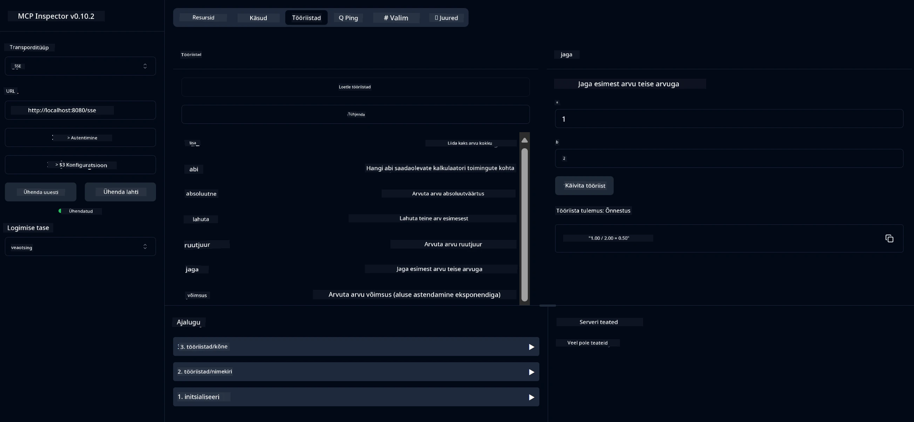

# Põhiline Kalkulaatori MCP Teenus

See teenus pakub põhilisi kalkulaatori operatsioone Model Context Protocoli (MCP) kaudu, kasutades Spring Booti koos WebFlux transpordiga. Teenus on loodud lihtsa näitena algajatele, kes õpivad MCP rakendusi.

Lisateabe saamiseks vaadake [MCP Server Boot Starter](https://docs.spring.io/spring-ai/reference/api/mcp/mcp-server-boot-starter-docs.html) viitedokumentatsiooni.

## Ülevaade

Teenus demonstreerib:
- SSE (Server-Sent Events) tuge
- Automaatset tööriistade registreerimist Spring AI `@Tool` annotatsiooni abil
- Põhilisi kalkulaatori funktsioone:
  - Liitmine, lahutamine, korrutamine, jagamine
  - Astendamine ja ruutjuur
  - Modulus (jääk) ja absoluutväärtus
  - Abi funktsioon operatsioonide kirjelduste jaoks

## Funktsioonid

See kalkulaatori teenus pakub järgmisi võimalusi:

1. **Põhilised aritmeetilised operatsioonid**:
   - Kahe arvu liitmine
   - Ühe arvu lahutamine teisest
   - Kahe arvu korrutamine
   - Ühe arvu jagamine teisega (nulliga jagamise kontrolliga)

2. **Täiustatud operatsioonid**:
   - Astendamine (baasi tõstmine eksponendini)
   - Ruutjuure arvutamine (negatiivse arvu kontrolliga)
   - Modulus (jäägi) arvutamine
   - Absoluutväärtuse arvutamine

3. **Abi süsteem**:
   - Sisseehitatud abi funktsioon, mis selgitab kõiki saadaolevaid operatsioone

## Teenuse kasutamine

Teenus pakub järgmisi API lõpp-punkte MCP protokolli kaudu:

- `add(a, b)`: Kahe arvu liitmine
- `subtract(a, b)`: Teise arvu lahutamine esimesest
- `multiply(a, b)`: Kahe arvu korrutamine
- `divide(a, b)`: Esimese arvu jagamine teisega (nulliga jagamise kontrolliga)
- `power(base, exponent)`: Arvu astendamine
- `squareRoot(number)`: Ruutjuure arvutamine (negatiivse arvu kontrolliga)
- `modulus(a, b)`: Jäägi arvutamine jagamisel
- `absolute(number)`: Absoluutväärtuse arvutamine
- `help()`: Teave saadaolevate operatsioonide kohta

## Testklient

Lihtne testklient on kaasatud `com.microsoft.mcp.sample.client` paketti. `SampleCalculatorClient` klass demonstreerib kalkulaatori teenuse saadaolevaid operatsioone.

## LangChain4j kliendi kasutamine

Projekt sisaldab LangChain4j näiteklienti `com.microsoft.mcp.sample.client.LangChain4jClient` paketis, mis näitab, kuidas integreerida kalkulaatori teenust LangChain4j ja GitHubi mudelitega:

### Eeltingimused

1. **GitHubi tokeni seadistamine**:
   
   GitHubi AI mudelite (näiteks phi-4) kasutamiseks vajate GitHubi isiklikku juurdepääsutokenit:

   a. Minge oma GitHubi konto seadistustesse: https://github.com/settings/tokens
   
   b. Klõpsake "Generate new token" → "Generate new token (classic)"
   
   c. Andke oma tokenile kirjeldav nimi
   
   d. Valige järgmised ulatused:
      - `repo` (Täielik kontroll privaatsete repositooriumide üle)
      - `read:org` (Organisatsiooni ja meeskonna liikmelisuse lugemine, organisatsiooni projektide lugemine)
      - `gist` (Gistide loomine)
      - `user:email` (Kasutaja e-posti aadresside lugemine (ainult lugemisõigus))
   
   e. Klõpsake "Generate token" ja kopeerige oma uus token
   
   f. Seadistage see keskkonnamuutujana:
      
      Windowsis:
      ```
      set GITHUB_TOKEN=your-github-token
      ```
      
      macOS/Linuxis:
      ```bash
      export GITHUB_TOKEN=your-github-token
      ```

   g. Püsiva seadistuse jaoks lisage see oma keskkonnamuutujatesse süsteemi seadistuste kaudu

2. Lisage LangChain4j GitHubi sõltuvus oma projekti (juba kaasatud pom.xml-sse):
   ```xml
   <dependency>
       <groupId>dev.langchain4j</groupId>
       <artifactId>langchain4j-github</artifactId>
       <version>${langchain4j.version}</version>
   </dependency>
   ```

3. Veenduge, et kalkulaatori server töötab aadressil `localhost:8080`

### LangChain4j kliendi käivitamine

See näide demonstreerib:
- Ühenduse loomist kalkulaatori MCP serveriga SSE transpordi kaudu
- LangChain4j kasutamist vestlusroboti loomiseks, mis kasutab kalkulaatori operatsioone
- Integreerimist GitHubi AI mudelitega (kasutades nüüd phi-4 mudelit)

Klient saadab järgmised näidispäringud, et demonstreerida funktsionaalsust:
1. Kahe arvu summa arvutamine
2. Arvu ruutjuure leidmine
3. Abi teabe saamine kalkulaatori operatsioonide kohta

Käivitage näide ja kontrollige konsooli väljundit, et näha, kuidas AI mudel kasutab kalkulaatori tööriistu päringutele vastamiseks.

### GitHubi mudeli konfiguratsioon

LangChain4j klient on konfigureeritud kasutama GitHubi phi-4 mudelit järgmiste seadistustega:

```java
ChatLanguageModel model = GitHubChatModel.builder()
    .apiKey(System.getenv("GITHUB_TOKEN"))
    .timeout(Duration.ofSeconds(60))
    .modelName("phi-4")
    .logRequests(true)
    .logResponses(true)
    .build();
```

Teiste GitHubi mudelite kasutamiseks muutke lihtsalt `modelName` parameetrit mõnele teisele toetatud mudelile (nt "claude-3-haiku-20240307", "llama-3-70b-8192" jne).

## Sõltuvused

Projekt nõuab järgmisi peamisi sõltuvusi:

```xml
<!-- For MCP Server -->
<dependency>
    <groupId>org.springframework.ai</groupId>
    <artifactId>spring-ai-starter-mcp-server-webflux</artifactId>
</dependency>

<!-- For LangChain4j integration -->
<dependency>
    <groupId>dev.langchain4j</groupId>
    <artifactId>langchain4j-mcp</artifactId>
    <version>${langchain4j.version}</version>
</dependency>

<!-- For GitHub models support -->
<dependency>
    <groupId>dev.langchain4j</groupId>
    <artifactId>langchain4j-github</artifactId>
    <version>${langchain4j.version}</version>
</dependency>
```

## Projekti ehitamine

Ehitage projekt Maveniga:
```bash
./mvnw clean install -DskipTests
```

## Serveri käivitamine

### Java kasutamine

```bash
java -jar target/calculator-server-0.0.1-SNAPSHOT.jar
```

### MCP Inspectori kasutamine

MCP Inspector on kasulik tööriist MCP teenustega suhtlemiseks. Selle kalkulaatori teenuse kasutamiseks:

1. **Installige ja käivitage MCP Inspector** uues terminaliaknas:
   ```bash
   npx @modelcontextprotocol/inspector
   ```

2. **Avage veebiliides** klõpsates rakenduse kuvatud URL-i (tavaliselt http://localhost:6274)

3. **Konfigureerige ühendus**:
   - Määrake transporditüübiks "SSE"
   - Määrake URL oma töötava serveri SSE lõpp-punktile: `http://localhost:8080/sse`
   - Klõpsake "Connect"

4. **Kasutage tööriistu**:
   - Klõpsake "List Tools", et näha saadaolevaid kalkulaatori operatsioone
   - Valige tööriist ja klõpsake "Run Tool", et operatsiooni käivitada



### Dockeri kasutamine

Projekt sisaldab Dockerfile'i konteineripõhiseks juurutamiseks:

1. **Looge Dockeri pilt**:
   ```bash
   docker build -t calculator-mcp-service .
   ```

2. **Käivitage Dockeri konteiner**:
   ```bash
   docker run -p 8080:8080 calculator-mcp-service
   ```

See:
- Loob mitmeastmelise Dockeri pildi Maven 3.9.9 ja Eclipse Temurin 24 JDK-ga
- Loob optimeeritud konteineripildi
- Avab teenuse pordi 8080 kaudu
- Käivitab MCP kalkulaatori teenuse konteineri sees

Teenusele pääseb aadressil `http://localhost:8080`, kui konteiner töötab.

## Tõrkeotsing

### Tavalised probleemid GitHubi tokeniga

1. **Tokeni õiguste probleemid**: Kui saate 403 Forbidden vea, kontrollige, et teie tokenil oleks õiged õigused, nagu eeltingimustes kirjeldatud.

2. **Tokeni puudumine**: Kui saate "No API key found" vea, veenduge, et GITHUB_TOKEN keskkonnamuutuja oleks õigesti seadistatud.

3. **Kvoodipiirangud**: GitHubi API-l on kvoodipiirangud. Kui kohtate kvoodipiirangu viga (olekukood 429), oodake paar minutit enne uuesti proovimist.

4. **Tokeni aegumine**: GitHubi tokenid võivad aeguda. Kui saate autentimisvead mõne aja pärast, looge uus token ja värskendage oma keskkonnamuutujat.

Kui vajate täiendavat abi, vaadake [LangChain4j dokumentatsiooni](https://github.com/langchain4j/langchain4j) või [GitHubi API dokumentatsiooni](https://docs.github.com/en/rest).

---

**Lahtiütlus**:  
See dokument on tõlgitud AI tõlketeenuse [Co-op Translator](https://github.com/Azure/co-op-translator) abil. Kuigi püüame tagada täpsust, palume arvestada, et automaatsed tõlked võivad sisaldada vigu või ebatäpsusi. Algne dokument selle algses keeles tuleks pidada autoriteetseks allikaks. Olulise teabe puhul soovitame kasutada professionaalset inimtõlget. Me ei vastuta selle tõlke kasutamisest tulenevate arusaamatuste või valesti tõlgenduste eest.