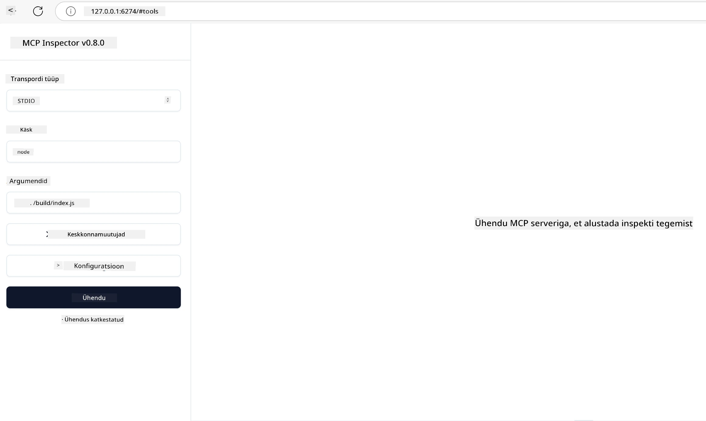

# Praktiline rakendamine

[](https://youtu.be/vCN9-mKBDfQ)

_(Klõpsa ülaloleval pildil, et vaadata selle õppetunni videot)_

Praktiline rakendamine on koht, kus Model Context Protocoli (MCP) jõud muutub käegakatsutavaks. Kuigi MCP tagamaade ja arhitektuuri mõistmine on oluline, ilmneb tegelik väärtus siis, kui rakendad neid kontseptsioone, et ehitada, testida ja juurutada lahendusi, mis lahendavad päris maailma probleeme. See peatükk sillutab lõhe kontseptuaalse teadmise ja praktilise arenduse vahel, juhendades sind läbi MCP-põhiste rakenduste elluviimise protsessi.

Olgu sinu eesmärgiks intelligentsete assistentide arendamine, tehisintellekti integreerimine äriprotsessidesse või kohandatud tööriistade loomine andmetöötluseks – MCP pakub paindlikku alust. Selle keeleagnostiline disain ja ametlikud SDK-d populaarsetele programmeerimiskeeltele muudavad selle kättesaadavaks paljudele arendajatele. Nende SDK-de kasutamisel saad kiiresti prototüüpida, iteratiivselt arendada ja skaleerida oma lahendusi erinevatel platvormidel ja keskkondades.

Järgmistes osades leiad praktilisi näiteid, koodinäiteid ja juurutamisstrateegiaid, mis näitavad, kuidas MCP-d rakendada C#, Java Springiga, TypeScripti, JavaScripti ja Pythoni keeles. Õpid ka, kuidas MCP servereid siluda ja testida, API-sid hallata ning lahendusi Azure pilve juurutada. Need praktilised ressursid on loodud õppimist kiirendama ja aitama sul kindlalt ehitada vastupidavaid, tootmiskõlblikke MCP rakendusi.

## Ülevaade

See õppetund keskendub MCP praktilisele rakendamisele mitmes programmeerimiskeeles. Uurime, kuidas kasutada MCP SDK-sid C#, Java Springiga, TypeScripti, JavaScripti ja Pythoniga, et ehitada usaldusväärseid rakendusi, siluda ja testida MCP servereid ning luua taaskasutatavaid ressursse, kõnesid ja tööriistu.

## Õpieesmärgid

Selle õppetunni lõpuks oskad:

- Rakendada MCP lahendusi ametlike SDK-de abil mitmes programmeerimiskeeles
- Süsteemsel viisil siluda ja testida MCP servereid
- Luua ja kasutada serveri funktsioone (ressursid, kõned, tööriistad)
- Kujundada tõhusaid MCP töövooge keerukate ülesannete jaoks
- Optimeerida MCP rakendusi jõudluse ja töökindluse osas

## Ametlikud SDK ressursid

Model Context Protocol pakub ametlikke SDK-sid mitmele keelele (vastavalt [MCP spetsifikatsioonile 2025-11-25](https://spec.modelcontextprotocol.io/specification/2025-11-25/)):

- [C# SDK](https://github.com/modelcontextprotocol/csharp-sdk)
- [Java Springiga SDK](https://github.com/modelcontextprotocol/java-sdk) **Märkus:** nõuab sõltuvust [Project Reactor'ist](https://projectreactor.io). (Vt [arutelu numbri 246 teemat](https://github.com/orgs/modelcontextprotocol/discussions/246).)
- [TypeScript SDK](https://github.com/modelcontextprotocol/typescript-sdk)
- [Python SDK](https://github.com/modelcontextprotocol/python-sdk)
- [Kotlin SDK](https://github.com/modelcontextprotocol/kotlin-sdk)
- [Go SDK](https://github.com/modelcontextprotocol/go-sdk)

## MCP SDK-dega töötamine

See osa annab praktilisi näiteid MCP rakendamisest mitmes programmeerimiskeeles. Näidiskoodi leiad `samples` kataloogist, mis on organiseeritud keelte kaupa.

### Saadaval näited

Hoop sisaldab [näidistoteerimisi](../../../04-PracticalImplementation/samples) järgmistes keeltes:

- [C#](./samples/csharp/README.md)
- [Java Springiga](./samples/java/containerapp/README.md)
- [TypeScript](./samples/typescript/README.md)
- [JavaScript](./samples/javascript/README.md)
- [Python](./samples/python/README.md)

Iga näide demonstreerib MCP põhikontseptsioone ja rakendusmustreid vastavas keeles ja ökosüsteemis.

### Praktilised juhendid

Täiendavad juhendid MCP praktiliseks rakendamiseks:

- [Lehekülgedehaldus ja suured tulemitsed](./pagination/README.md) - Kursoripõhise lehekülgedehaldusega tööriistadele, ressurssidele ja suurtele andmekogumitele

## Põhilised serveri funktsioonid

MCP serverid võivad rakendada ükskõik millist järgmistest funktsioonidest:

### Ressursid

Ressursid pakuvad kasutajale või AI mudelile konteksti ja andmeid:

- Dokumendihaldus
- Teadmistebaasid
- Struktureeritud andmeallikad
- Failisüsteemid

### Kõned

Kõned on mallil põhinevad sõnumid ja töövood kasutajatele:

- Eelmääratud vestlusmallid
- Juhtitud suhtlusmustrid
- Spetsialiseeritud dialoogistruktuurid

### Tööriistad

Tööriistad on AI mudeli jaoks täidetavad funktsioonid:

- Andmetöötluse utiliidid
- Välised API integratsioonid
- Arvutusvõimekused
- Otsingufunktsionaalsus

## Näidiste rakendused: C# rakendus

Ametlik C# SDK hoidla sisaldab mitmeid näiteid, mis demonstreerivad MCP erinevaid aspekte:

- **Põhiline MCP klient**: Lihtne näide MCP kliendi loomisest ja tööriistade kutsumisest
- **Põhiline MCP server**: Minimaalne serveri rakendus koos tööriistade registreerimisega
- **Täiustatud MCP server**: Täisfunktsionaalsusega server tööriistade registreerimise, autentimise ja veakäsitlusega
- **ASP.NET integreerimine**: Näited ASP.NET Core'iga integreerimisest
- **Tööriistade rakendusmustrid**: Mitmesugused tööriistade rakendusmustrid eri keerukusastmetega

MCP C# SDK on eelvaates ja API-d võivad muutuda. Jätkame selle blogi uuendamist SDK arenguga.

### Peamised omadused

- [C# MCP Nuget ModelContextProtocol](https://www.nuget.org/packages/ModelContextProtocol)
- Ehitades oma [esimest MCP serverit](https://devblogs.microsoft.com/dotnet/build-a-model-context-protocol-mcp-server-in-csharp/).

Täpsemate C# rakenduste näidete saamiseks külasta [ametlikke C# SDK näidiste hoidlat](https://github.com/modelcontextprotocol/csharp-sdk)

## Näidiserakendus: Java Springiga rakendus

Java Springi SDK pakub tugevaid MCP rakenduse võimalusi ettevõtte taseme funktsioonidega.

### Peamised omadused

- Spring Frameworki integreerimine
- Tugev tüübiturvalisus
- Reaktiivse programmeerimise tugi
- Põhjalik veakäsitlus

Täieliku Java Springiga rakenduse näite leiad [siit](samples/java/containerapp/README.md) näidiste kataloogis.

## Näidiserakendus: JavaScripti rakendus

JavaScripti SDK pakub kerget ja paindlikku lähenemist MCP rakendamisel.

### Peamised omadused

- Toetus Node.js-ile ja brauserile
- Lubadustel põhinev API
- Lihtne integreerimine Expressi ja teiste raamistikudega
- WebSocketi tugi voogedastuseks

Täieliku JavaScripti rakenduse näite leiad [siit](samples/javascript/README.md) näidiste kataloogis.

## Näidiserakendus: Python rakendus

Python SDK pakub Pythonile omast MCP rakendamist suurepäraste masinõppe raamistikute integreerimisega.

### Peamised omadused

- Async/await tugi asyncio-ga
- FastAPI integreerimine
- Lihtne tööriistade registreerimine
- Loomulik integreerimine populaarsete masinõppe raamatukogudega

Täieliku Python rakenduse näite leiad [siit](samples/python/README.md) näidiste kataloogis.

## API haldus

Azure API Management on suurepärane lahendus MCP serverite turvamiseks. Idee on panna Azure API Managementi eksemplar oma MCP serveri ette ja lasta sel hallata funktsioone, mida sa võid soovida, nagu:

- päringute kiiruse piiramine
- tokenite haldus
- järelevalve
- koormuse tasakaalustamine
- turvalisus

### Azure näide

Siin on Azure näide, mis teeb täpselt seda, st [loomine MCP server ja selle kaitsmine Azure API Managementiga](https://github.com/Azure-Samples/remote-mcp-apim-functions-python).

Vaata allolevalt pildilt, kuidas autoriseerimise voog kulgeb:


Eelmisel pildil toimub:

- Autentimine/autoriseerimine läbi Microsoft Entra.
- Azure API Management tegutseb väravana ning kasutab poliitikaid liikluse suunamiseks ja haldamiseks.
- Azure Monitor logib kõik päringud edasiseks analüüsiks.

#### Autoriseerimise voog

Vaata autoriseerimise voogu lähemalt:


#### MCP autoriseerimise spetsifikatsioon

Lisateave [MCP autoriseerimise spetsifikatsiooni kohta](https://spec.modelcontextprotocol.io/specification/2025-11-25/basic/authorization/)

## Juuruta kaugsuhe MCP server Azure'i

Vaatame, kas saame eelmainitud näite juurutada:

1. Kloneeri hoidla

    ```bash
    git clone https://github.com/Azure-Samples/remote-mcp-apim-functions-python.git
    cd remote-mcp-apim-functions-python
    ```

1. Registreeri ressursside pakkuja `Microsoft.App`.

   - Kui kasutad Azure CLI, käivita `az provider register --namespace Microsoft.App --wait`.
   - Kui kasutad Azure PowerShelli, käivita `Register-AzResourceProvider -ProviderNamespace Microsoft.App`. Seejärel kontrolli pärast mõnda aega registreerimise olekut käsuga `(Get-AzResourceProvider -ProviderNamespace Microsoft.App).RegistrationState`.

1. Käivita see [azd](https://aka.ms/azd) käsk, et luua API haldus, funktsioonirakendus (koodiga) ja kõik muud vajalikud Azure ressursid

    ```shell
    azd up
    ```

    See käsk peaks juurutama kõik pilveressursid Azure'i

### Serveri testimine MCP Inspectoriga

1. Ava **uus terminali aken**, paigalda ja käivita MCP Inspector

    ```shell
    npx @modelcontextprotocol/inspector
    ```

    Peaks avanema liides, mis näeb välja umbes nii:

    

1. CTRL-klõpsuga ava MCP Inspectori veebirakendus rakenduse kuvaval URL-il (nt [http://127.0.0.1:6274/#resources](http://127.0.0.1:6274/#resources))
1. Määra transporditüübiks `SSE`
1. Määra URL-iks oma töötava API Management SSE lõpp-punkt, mis kuvatakse pärast `azd up` ja **Ühenda**:

    ```shell
    https://<apim-servicename-from-azd-output>.azure-api.net/mcp/sse
    ```

1. **Näita tööriistu**. Klõpsa tööriista ja vali **Käivita tööriist**.

Kui kõik sammud on õnnestunud, oled nüüd MCP serveriga ühendatud ja võimalik on tööriista kutsuda.

## MCP serverid Azure jaoks

[Remote-mcp-functions](https://github.com/Azure-Samples/remote-mcp-functions-dotnet): Need hoidlad on kiirstardimallid kohandatud MCP (Model Context Protocol) kaugsuhe serverite ehitamiseks ja juurutamiseks kasutades Azure Functions Pythonis, C# .NET-s või Node/TypeScriptis.

Näited pakuvad täielikku lahendust, mis võimaldab arendajatel:

- Ehita ja käivita lokaalselt: Arenda ja silu MCP serverit oma lokaalarvutis
- Juuruta Azure'i: Lihtne pilvejuurutamine ühe azd up käsuga
- Ühendu klientidelt: Ühendu MCP serveriga erinevatest klientidest, sealhulgas VS Code'i Copiloti agendirežiimist ja MCP Inspectori tööriistast

### Peamised omadused

- Turvalisus sisseehitatud: MCP server on kaitstud võtmete ja HTTPS-iga
- Autentimise valikud: Toetab OAuth-i sisseehitatud autentimise ja/või API Managementiga
- Võrgu isolatsioon: Võimaldab võrgu isolatsiooni Azure Virtual Network'ide (VNET) abil
- Serverivaba arhitektuur: Kasutab Azure Functionsi skaleeritava, sündmuspõhise täitmise jaoks
- Kohalik arendamine: Ulatuslik kohalik arendus- ja silumisabi
- Lihtne juurutus: Sujuv juurutusprotsess Azure'i

Hoidlad sisaldavad kõiki vajalikke konfiguratsioonifaile, lähtekoodi ja infrastruktuuri definitsioone, et kiiresti alustada tootmiskõlbliku MCP serveri rakendusega.

- [Azure Remote MCP Functions Python](https://github.com/Azure-Samples/remote-mcp-functions-python) - MCP näidiserakendus Azure Functionsitega Pythonis

- [Azure Remote MCP Functions .NET](https://github.com/Azure-Samples/remote-mcp-functions-dotnet) - MCP näidiserakendus Azure Functionsitega C# .NET-s

- [Azure Remote MCP Functions Node/Typescript](https://github.com/Azure-Samples/remote-mcp-functions-typescript) - MCP näidiserakendus Azure Functionsitega Node/TypeScriptis.

## Peamised järeldused

- MCP SDK-d pakuvad keelespetsiifilisi tööriistu vastupidavate MCP lahenduste jaoks
- Silumine ja testimine on usaldusväärsete MCP rakenduste jaoks hädavajalik
- Taaskasutatavad kõnemallid võimaldavad järjepidevaid AI suhtlusi
- Hästi kujundatud töövood suudavad orkestreerida keerukaid ülesandeid mitme tööriistaga
- MCP lahenduste rakendamisel tuleb arvestada turvalisuse, jõudluse ja veakäsitlusega

## Harjutus

Mõtle välja praktiline MCP töövoog, mis lahendab sinu valdkonna päris maailma probleemi:

1. Määra 3-4 tööriista, mis oleksid selle probleemi lahendamiseks kasulikud
2. Joonista töövoo skeem, mis näitab, kuidas need tööriistad omavahel suhtlevad
3. Rakenda ühe tööriista põhiline versioon oma eelistatud keeles
4. Loo kõnemall, mis aitaks mudelil sinu tööriista tõhusalt kasutada

## Täiendavad ressursid

---

## Mis siis edasi

Järgmine: [Täiustatud teemat](../05-AdvancedTopics/README.md)

---

<!-- CO-OP TRANSLATOR DISCLAIMER START -->
**Lahtiütlus**:  
See dokument on tõlgitud kasutades AI tõlkimisteenust [Co-op Translator](https://github.com/Azure/co-op-translator). Kuigi püüame tagada täpsust, palun arvestage, et automaatsed tõlked võivad sisaldada vigu või ebatäpsusi. Originaaldokument selle emakeeles tuleks pidada autoriteetseks allikaks. Olulise teabe puhul soovitatakse kasutada professionaalset inimtõlget. Me ei vastuta võimalike arusaamatuste või valesti mõistmiste eest, mis võivad tuleneda selle tõlke kasutamisest.
<!-- CO-OP TRANSLATOR DISCLAIMER END -->