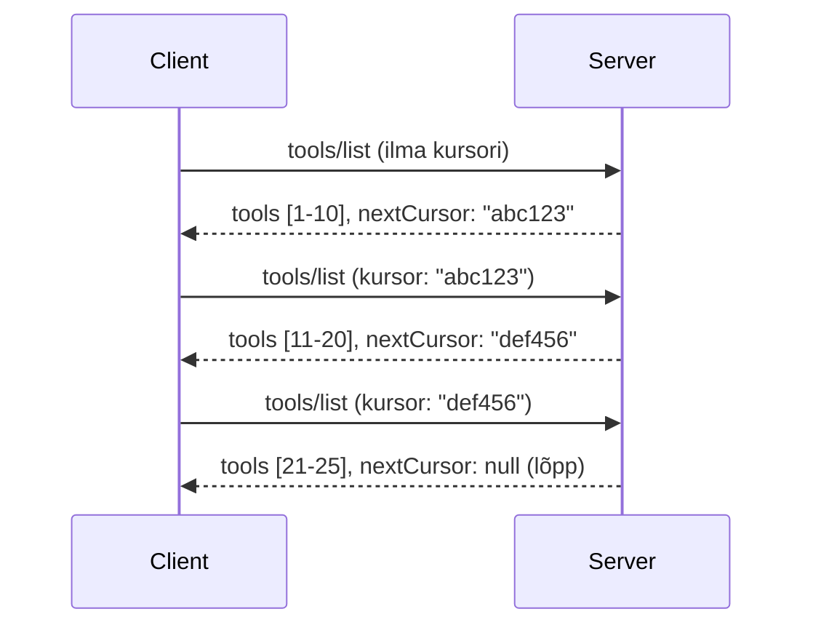

# Leheküljed ja suured tulemite kogumid MCP-s

Kui teie MCP server käsitleb suuri andmekogumeid – olgu selleks tuhandeid faile, andmebaasi kirjeid või otsingutulemusi – vajate mäluhalduse tõhusaks korraldamiseks ja reageerimisvõimelise kasutajaliidese tagamiseks lehekülgede jagamist. See juhend käsitleb, kuidas MCP-s lehekülgede jagamist rakendada ja kasutada.

## Miks lehekülgede jagamine on oluline

Ilma lehekülgede jagamiseta võivad suured vastused põhjustada:

- **Mälu ammendumine** – miljonite kirjetega korraga laadimine
- **Aeglad vastamisajad** – kasutajad ootavad, kuni kogu andmestik laetakse
- **Aegumise vead** – päringud ületavad lubatud ooteaja
- **Aeglane tehisintellekti jõudlus** – LLM-idel on raskusi tohutu kontekstiga

MCP kasutab usaldusväärseks ja järjepidevaks juhtimiseks **kursori-põhist lehekülgede jagamist**.

---

## Kuidas MCP lehekülgede jagamine töötab

### Kursori mõiste

**Kursor** on läbipaistev string, mis märgib teie asukohta tulemikogumis. Mõelge sellele nagu järjehoidjale pika raamatu sees.


### Lehekülgede jagamine MCP meetodites

Need MCP meetodid toetavad lehekülgede jagamist:

| Meetod | Tagastab | Kursori tugi |
|--------|----------|--------------|
| `tools/list` | Tööriistade definitsioonid | ✅ |
| `resources/list` | Ressursside definitsioonid | ✅ |
| `prompts/list` | Käskluste definitsioonid | ✅ |
| `resources/templates/list` | Ressursside mallid | ✅ |

---

## Serveri rakendus

### Python (FastMCP)

```python
from mcp.server import Server
from mcp.types import Tool, ListToolsResult
import math

app = Server("paginated-server")

# Simuleeritud suur andmekogum
ALL_TOOLS = [
    Tool(name=f"tool_{i}", description=f"Tool number {i}", inputSchema={})
    for i in range(100)
]

PAGE_SIZE = 10

@app.list_tools()
async def list_tools(cursor: str | None = None) -> ListToolsResult:
    """List tools with pagination support."""
    
    # Dekodeeri kursori väärtus, et saada algusindeks
    start_index = 0
    if cursor:
        try:
            start_index = int(cursor)
        except ValueError:
            start_index = 0
    
    # Hangi tulemuste leht
    end_index = min(start_index + PAGE_SIZE, len(ALL_TOOLS))
    page_tools = ALL_TOOLS[start_index:end_index]
    
    # Arvuta järgmine kursor
    next_cursor = None
    if end_index < len(ALL_TOOLS):
        next_cursor = str(end_index)
    
    return ListToolsResult(
        tools=page_tools,
        nextCursor=next_cursor
    )
```

### TypeScript

```typescript
import { Server } from "@modelcontextprotocol/sdk/server/index.js";
import { ListToolsResultSchema } from "@modelcontextprotocol/sdk/types.js";

const server = new Server({
  name: "paginated-server",
  version: "1.0.0"
});

// Simuleeritud suur andmekogum
const ALL_TOOLS = Array.from({ length: 100 }, (_, i) => ({
  name: `tool_${i}`,
  description: `Tool number ${i}`,
  inputSchema: { type: "object", properties: {} }
}));

const PAGE_SIZE = 10;

server.setRequestHandler(ListToolsResultSchema, async (request) => {
  // Dekodeeri kursor
  let startIndex = 0;
  if (request.params?.cursor) {
    startIndex = parseInt(request.params.cursor, 10) || 0;
  }
  
  // Hangi tulemuste leht
  const endIndex = Math.min(startIndex + PAGE_SIZE, ALL_TOOLS.length);
  const pageTools = ALL_TOOLS.slice(startIndex, endIndex);
  
  // Arvuta järgmine kursor
  const nextCursor = endIndex < ALL_TOOLS.length ? String(endIndex) : undefined;
  
  return {
    tools: pageTools,
    nextCursor
  };
});
```

### Java (Spring MCP)

```java
@Service
public class PaginatedToolService {
    
    private static final int PAGE_SIZE = 10;
    private final List<Tool> allTools;
    
    public PaginatedToolService() {
        // Initsialiseeri suur andmekogum
        this.allTools = IntStream.range(0, 100)
            .mapToObj(i -> new Tool("tool_" + i, "Tool number " + i, Map.of()))
            .collect(Collectors.toList());
    }
    
    @McpMethod("tools/list")
    public ListToolsResult listTools(@Param("cursor") String cursor) {
        // Dekodeeri kursor
        int startIndex = 0;
        if (cursor != null && !cursor.isEmpty()) {
            try {
                startIndex = Integer.parseInt(cursor);
            } catch (NumberFormatException e) {
                startIndex = 0;
            }
        }
        
        // Hangi tulemuste leht
        int endIndex = Math.min(startIndex + PAGE_SIZE, allTools.size());
        List<Tool> pageTools = allTools.subList(startIndex, endIndex);
        
        // Arvuta järgmine kursor
        String nextCursor = endIndex < allTools.size() ? String.valueOf(endIndex) : null;
        
        return new ListToolsResult(pageTools, nextCursor);
    }
}
```

---

## Kliendi rakendus

### Python klient

```python
from mcp import ClientSession

async def get_all_tools(session: ClientSession) -> list:
    """Fetch all tools using pagination."""
    all_tools = []
    cursor = None
    
    while True:
        result = await session.list_tools(cursor=cursor)
        all_tools.extend(result.tools)
        
        if result.nextCursor is None:
            break
        cursor = result.nextCursor
    
    return all_tools

# Kasutus
async with client_session as session:
    tools = await get_all_tools(session)
    print(f"Found {len(tools)} tools")
```

### TypeScript klient

```typescript
import { Client } from "@modelcontextprotocol/sdk/client/index.js";

async function getAllTools(client: Client): Promise<Tool[]> {
  const allTools: Tool[] = [];
  let cursor: string | undefined = undefined;
  
  do {
    const result = await client.listTools({ cursor });
    allTools.push(...result.tools);
    cursor = result.nextCursor;
  } while (cursor);
  
  return allTools;
}

// Kasutus
const tools = await getAllTools(client);
console.log(`Found ${tools.length} tools`);
```

### Laisk laadimise muster

Väga suurte andmekogumite puhul laadige leheküljed nõudmisel:

```python
class PaginatedToolIterator:
    """Lazily iterate through paginated tools."""
    
    def __init__(self, session: ClientSession):
        self.session = session
        self.cursor = None
        self.buffer = []
        self.exhausted = False
    
    async def __anext__(self):
        # Tagasta puhvrist, kui saadaval
        if self.buffer:
            return self.buffer.pop(0)
        
        # Kontrolli, kas oleme kõik lehed läbi saanud
        if self.exhausted:
            raise StopAsyncIteration
        
        # Hangi järgmine leht
        result = await self.session.list_tools(cursor=self.cursor)
        self.buffer = list(result.tools)
        self.cursor = result.nextCursor
        
        if self.cursor is None:
            self.exhausted = True
        
        if not self.buffer:
            raise StopAsyncIteration
        
        return self.buffer.pop(0)
    
    def __aiter__(self):
        return self

# Kasutus - mälu tõhus suurte andmekogude puhul
async for tool in PaginatedToolIterator(session):
    process_tool(tool)
```

---

## Lehekülgede jagamine ressursside puhul

Ressurssid vajavad sageli lehekülgede jagamist kaustade või suurte andmekogumite jaoks:

```python
from mcp.server import Server
from mcp.types import Resource, ListResourcesResult
import os

app = Server("file-server")

@app.list_resources()
async def list_resources(cursor: str | None = None) -> ListResourcesResult:
    """List files in directory with pagination."""
    
    directory = "/data/files"
    all_files = sorted(os.listdir(directory))
    
    # Dekodeeri kursor (faili indeks)
    start_index = int(cursor) if cursor else 0
    page_size = 20
    end_index = min(start_index + page_size, len(all_files))
    
    # Loo selle lehe jaoks ressursside nimekiri
    resources = []
    for filename in all_files[start_index:end_index]:
        filepath = os.path.join(directory, filename)
        resources.append(Resource(
            uri=f"file://{filepath}",
            name=filename,
            mimeType="application/octet-stream"
        ))
    
    # Arvuta järgmine kursor
    next_cursor = str(end_index) if end_index < len(all_files) else None
    
    return ListResourcesResult(
        resources=resources,
        nextCursor=next_cursor
    )
```

---

## Kursori disaini strateegiad

### Strateegia 1: Indeksi-põhine (lihtne)

```python
# Kursor on lihtsalt indeks
cursor = "50"  # Alusta kirjest 50
```

**Eelised:** Lihtne, staatust mittehoidev  
**Puudused:** Tulemused võivad nihkuda, kui elemente lisatakse või eemaldatakse

### Strateegia 2: ID-põhine (stabiilne)

```python
# Kursor on viimane nähtud ID
cursor = "item_abc123"  # Alusta pärast seda elementi
```

**Eelised:** Stabiilne, isegi kui elemendid muutuvad  
**Puudused:** Nõuab järjestatud ID-sid

### Strateegia 3: Kodeeritud olek (keeruline)

```python
import base64
import json

def encode_cursor(state: dict) -> str:
    return base64.b64encode(json.dumps(state).encode()).decode()

def decode_cursor(cursor: str) -> dict:
    return json.loads(base64.b64decode(cursor).decode())

# Kursor sisaldab mitu olekuvälja
cursor = encode_cursor({
    "offset": 50,
    "filter": "active",
    "sort": "name"
})
```

**Eelised:** Võib kodeerida keerulisi olekuid  
**Puudused:** Keerulisem, suuremad kursori stringid

---

## Parimad tavad

### 1. Valige sobivad lehekülgede suurused

```python
# Arvesta andmete suurusega
PAGE_SIZE_SMALL_ITEMS = 100   # Lihtne metaandmed
PAGE_SIZE_MEDIUM_ITEMS = 20   # Rikkalikumad objektid
PAGE_SIZE_LARGE_ITEMS = 5     # Kompleksne sisu
```

### 2. Töötlege vigaseid kursoreid elegantse vigadega

```python
@app.list_tools()
async def list_tools(cursor: str | None = None) -> ListToolsResult:
    try:
        start_index = int(cursor) if cursor else 0
        if start_index < 0 or start_index >= len(ALL_TOOLS):
            start_index = 0  # Lähtesta algusesse
    except (ValueError, TypeError):
        start_index = 0  # Sobimatu kursor, alusta uuesti
    # ...
```

### 3. Lisage koguarv (valikuline)

```python
return ListToolsResult(
    tools=page_tools,
    nextCursor=next_cursor,
    # Mõned teostused sisaldavad kasutajaliidese edenemise kogusummat
    _meta={"total": len(ALL_TOOLS)}
)
```

### 4. Testige äärejuhtumeid

```python
async def test_pagination():
    # Tühi tulemuste kogum
    result = await session.list_tools()
    assert result.tools == []
    assert result.nextCursor is None
    
    # Üks lehekülg
    result = await session.list_tools()
    assert len(result.tools) <= PAGE_SIZE
    
    # Sobimatu kursor
    result = await session.list_tools(cursor="invalid")
    assert result.tools  # Peaks tagastama esimese lehekülje
```

---

## Levinumad lõksud

### ❌ Kõik tulemused korraga tagastamine ja seejärel kliendis lehekülgede jagamine

```python
# HALB: Laadib kõik mällu
@app.list_tools()
async def list_tools() -> ListToolsResult:
    all_tools = load_all_tools()  # 1 miljon tööriista!
    return ListToolsResult(tools=all_tools)
```

### ✅ Lehekülgede jagamine andmeallikast

```python
# HEA: Laadib ainult vajamineva
@app.list_tools()
async def list_tools(cursor: str | None = None) -> ListToolsResult:
    offset = int(cursor) if cursor else 0
    tools = await db.query_tools(offset=offset, limit=PAGE_SIZE)
    return ListToolsResult(tools=tools, nextCursor=...)
```

---

## Mis järgmiseks

- [Moodul 5.14 - Konteksti inseneritöö](../../05-AdvancedTopics/mcp-contextengineering/README.md)
- [Moodul 8 - Parimad tavad](../../08-BestPractices/README.md)
- [3.8 - Testi oma MCP serverit](../../03-GettingStarted/08-testing/README.md)

---

## Täiendavad ressursid

- [MCP spetsifikatsioon – lehekülgede jagamine](https://spec.modelcontextprotocol.io/specification/2025-11-25/)
- [Kursori-põhise lehekülgede jagamise selgitus](https://slack.engineering/evolving-api-pagination-at-slack/)
- [Python SDK lehekülgede jagamise testid](https://github.com/modelcontextprotocol/python-sdk/blob/main/tests/client/test_list_methods_cursor.py)

---

<!-- CO-OP TRANSLATOR DISCLAIMER START -->
**Vastutusest vabastamine**:  
See dokument on tõlgitud kasutades tehisintellekti tõlketeenust [Co-op Translator](https://github.com/Azure/co-op-translator). Kuigi me püüame täpsust, palun pange tähele, et automatiseeritud tõlked võivad sisaldada vigu või ebatäpsusi. Originaaldokument selle algses keeles tuleks pidada autoriteetseks allikaks. Olulise info puhul soovitatakse kasutada professionaalset inimtõlget. Me ei vastuta selle tõlkega seotud arusaamatuste ega valesti mõistmiste eest.
<!-- CO-OP TRANSLATOR DISCLAIMER END -->