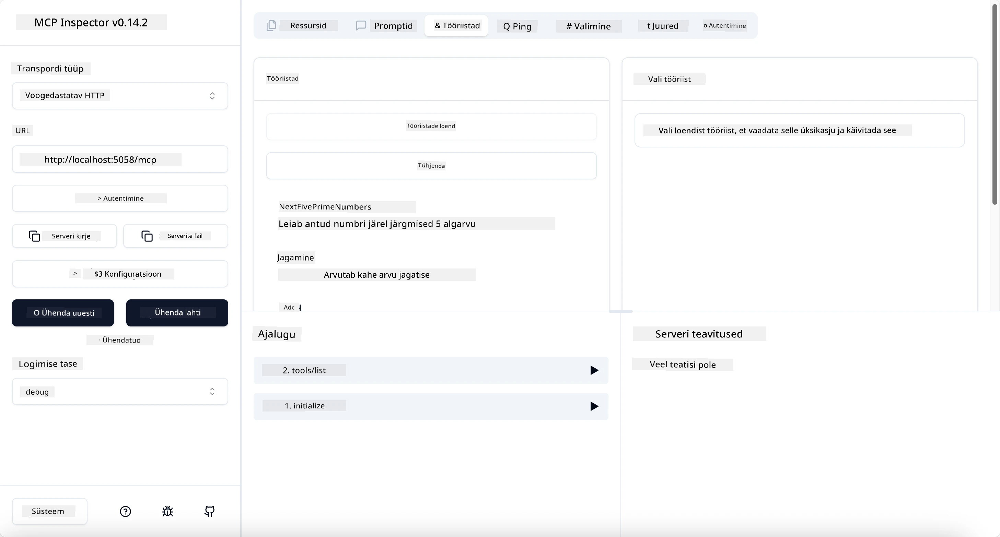
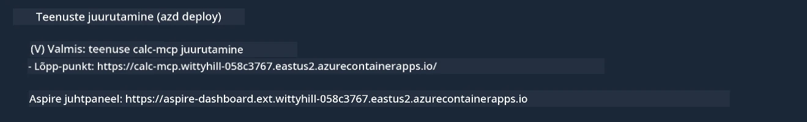

# Näidis

Eelmine näide näitab, kuidas kasutada kohalikku .NET projekti `stdio` tüüpi abil ja kuidas serverit konteineris kohapeal käivitada. See on paljudes olukordades hea lahendus. Kuid võib olla kasulik, kui server töötab kaugkeskkonnas, näiteks pilves. Siin tuleb mängu `http` tüüp.

Vaadates lahendust kaustas `04-PracticalImplementation`, võib see tunduda palju keerulisem kui eelmine. Tegelikult see nii ei ole. Kui vaatate lähemalt projekti `src/Calculator`, näete, et see on enamasti sama kood nagu eelmises näites. Ainus erinevus on see, et kasutame teist teeki `ModelContextProtocol.AspNetCore`, et hallata HTTP päringuid. Lisaks muudame meetodi `IsPrime` privaatseks, et näidata, et teie koodis võivad olla privaatsed meetodid. Ülejäänud kood on sama nagu varem.

Teised projektid pärinevad [.NET Aspire](https://learn.microsoft.com/dotnet/aspire/get-started/aspire-overview). .NET Aspire'i lisamine lahendusse parandab arendaja kogemust arendamise ja testimise ajal ning aitab jälgitavusega. See ei ole serveri käivitamiseks vajalik, kuid on hea tava seda lahenduses kasutada.

## Serveri käivitamine kohapeal

1. VS Code'is (koos C# DevKit laiendiga) navigeerige kausta `04-PracticalImplementation/samples/csharp`.
1. Käivitage järgmine käsk serveri käivitamiseks:

   ```bash
    dotnet watch run --project ./src/AppHost
   ```

1. Kui veebibrauser avab .NET Aspire'i juhtpaneeli, märkige üles `http` URL. See peaks olema midagi sellist nagu `http://localhost:5058/`.

   

## Testige voogedastatavat HTTP-d MCP Inspectoriga

Kui teil on Node.js versioon 22.7.5 või uuem, saate MCP Inspectorit kasutada serveri testimiseks.

Käivitage server ja käivitage terminalis järgmine käsk:

```bash
npx @modelcontextprotocol/inspector http://localhost:5058
```



- Valige transporditüübiks `Streamable HTTP`.
- Sisestage URL-i väljale varem märgitud serveri URL ja lisage `/mcp`. See peaks olema `http` (mitte `https`), midagi sellist nagu `http://localhost:5058/mcp`.
- Vajutage nuppu Connect.

Inspector on kasulik, kuna see annab hea ülevaate toimuvast.

- Proovige loetleda saadaolevaid tööriistu.
- Proovige mõnda neist, need peaksid töötama nagu varem.

## Testige MCP serverit GitHub Copilot Chatiga VS Code'is

Streamable HTTP transpordi kasutamiseks GitHub Copilot Chatiga muutke varem loodud `calc-mcp` serveri konfiguratsiooni selliseks:

```jsonc
// .vscode/mcp.json
{
  "servers": {
    "calc-mcp": {
      "type": "http",
      "url": "http://localhost:5058/mcp"
    }
  }
}
```

Tehke mõned testid:

- Küsige "3 algarvu pärast 6780". Pange tähele, kuidas Copilot kasutab uusi tööriistu `NextFivePrimeNumbers` ja tagastab ainult esimesed 3 algarvu.
- Küsige "7 algarvu pärast 111", et näha, mis juhtub.
- Küsige "Johnil on 24 kommi ja ta tahab need jagada oma 3 lapse vahel. Mitu kommi saab iga laps?", et näha, mis juhtub.

## Serveri juurutamine Azure'i

Juurutame serveri Azure'i, et rohkem inimesi saaks seda kasutada.

Terminalis navigeerige kausta `04-PracticalImplementation/samples/csharp` ja käivitage järgmine käsk:

```bash
azd up
```

Kui juurutamine on lõppenud, peaksite nägema sellist teadet:



Haarake URL ja kasutage seda MCP Inspectoris ja GitHub Copilot Chatis.

```jsonc
// .vscode/mcp.json
{
  "servers": {
    "calc-mcp": {
      "type": "http",
      "url": "https://calc-mcp.gentleriver-3977fbcf.australiaeast.azurecontainerapps.io/mcp"
    }
  }
}
```

## Mis edasi?

Proovisime erinevaid transporditüüpe ja testimisvahendeid. Juurutasime teie MCP serveri Azure'i. Aga mis siis, kui meie server vajab juurdepääsu privaatsetele ressurssidele? Näiteks andmebaasile või privaatsele API-le? Järgmises peatükis vaatame, kuidas saame serveri turvalisust parandada.

---

**Lahtiütlus**:  
See dokument on tõlgitud, kasutades AI tõlketeenust [Co-op Translator](https://github.com/Azure/co-op-translator). Kuigi püüame tagada täpsust, palun arvestage, et automaatsed tõlked võivad sisaldada vigu või ebatäpsusi. Algne dokument selle algkeeles tuleks lugeda autoriteetseks allikaks. Olulise teabe puhul on soovitatav kasutada professionaalset inimtõlget. Me ei vastuta selle tõlke kasutamisest tulenevate arusaamatuste või valede tõlgenduste eest.