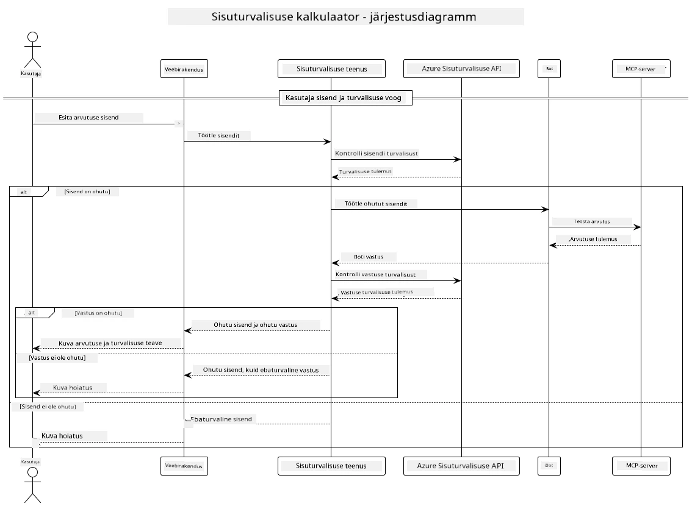

## Süsteemi arhitektuur

See projekt demonstreerib veebirakendust, mis kasutab sisuturvalisuse kontrolli enne kasutaja sisendite edastamist kalkulaatoriteenusele Model Context Protocol (MCP) kaudu.



### Kuidas see töötab

1. **Kasutaja sisend**: Kasutaja sisestab veebiliideses arvutuse sisendi
2. **Sisuturvalisuse kontroll (sisend)**: Sisendit analüüsitakse Azure Content Safety API abil
3. **Turvalisuse otsus (sisend)**:
   - Kui sisu on turvaline (kõigis kategooriates raskusaste < 2), edastatakse see kalkulaatorile
   - Kui sisu märgitakse potentsiaalselt kahjulikuks, protsess peatub ja tagastatakse hoiatus
4. **Kalkulaatori integreerimine**: Turvaline sisu töödeldakse LangChain4j abil, mis suhtleb MCP kalkulaatoriserveriga
5. **Sisuturvalisuse kontroll (väljund)**: Boti vastust analüüsitakse Azure Content Safety API abil
6. **Turvalisuse otsus (väljund)**:
   - Kui boti vastus on turvaline, kuvatakse see kasutajale
   - Kui boti vastus märgitakse potentsiaalselt kahjulikuks, asendatakse see hoiatusega
7. **Vastus**: Tulemused (kui need on turvalised) kuvatakse kasutajale koos mõlema turvalisuse analüüsiga

## Model Context Protocol (MCP) kasutamine kalkulaatoriteenustega

See projekt demonstreerib, kuidas kasutada Model Context Protocol (MCP), et kutsuda kalkulaatori MCP teenuseid LangChain4j kaudu. Rakendus kasutab kohalikku MCP serverit, mis töötab pordil 8080 ja pakub kalkulaatori operatsioone.

### Azure Content Safety teenuse seadistamine

Enne sisuturvalisuse funktsioonide kasutamist peate looma Azure Content Safety teenuse ressursi:

1. Logige sisse [Azure portaalis](https://portal.azure.com)
2. Klõpsake "Create a resource" ja otsige "Content Safety"
3. Valige "Content Safety" ja klõpsake "Create"
4. Sisestage oma ressursile unikaalne nimi
5. Valige oma tellimus ja ressursigrupp (või looge uus)
6. Valige toetatud piirkond (vaadake [Piirkonna saadavus](https://azure.microsoft.com/en-us/global-infrastructure/services/?products=cognitive-services) üksikasjade jaoks)
7. Valige sobiv hinnaklass
8. Klõpsake "Create", et ressurss juurutada
9. Kui juurutamine on lõpule viidud, klõpsake "Go to resource"
10. Vasakul paneelil, jaotises "Resource Management", valige "Keys and Endpoint"
11. Kopeerige üks võtmetest ja lõpp-punkti URL, et kasutada järgmises etapis

### Keskkonnamuutujate konfigureerimine

Seadistage `GITHUB_TOKEN` keskkonnamuutuja GitHubi mudelite autentimiseks:
```sh
export GITHUB_TOKEN=<your_github_token>
```

Sisuturvalisuse funktsioonide jaoks seadistage:
```sh
export CONTENT_SAFETY_ENDPOINT=<your_content_safety_endpoint>
export CONTENT_SAFETY_KEY=<your_content_safety_key>
```

Need keskkonnamuutujad võimaldavad rakendusel autentida Azure Content Safety teenusega. Kui neid muutujaid ei ole seadistatud, kasutab rakendus näidisväärtusi, kuid sisuturvalisuse funktsioonid ei tööta korralikult.

### Kalkulaatori MCP serveri käivitamine

Enne kliendi käivitamist peate käivitama kalkulaatori MCP serveri SSE režiimis localhost:8080.

## Projekti kirjeldus

See projekt demonstreerib Model Context Protocol (MCP) integreerimist LangChain4j-ga, et kutsuda kalkulaatoriteenuseid. Peamised funktsioonid hõlmavad:

- MCP kasutamine kalkulaatoriteenusega ühenduse loomiseks põhiliste matemaatiliste operatsioonide jaoks
- Kahekihiline sisuturvalisuse kontroll nii kasutaja sisendite kui ka boti vastuste puhul
- GitHubi gpt-4.1-nano mudeli integreerimine LangChain4j kaudu
- Server-Sent Events (SSE) kasutamine MCP transpordiks

## Sisuturvalisuse integreerimine

Projekt sisaldab põhjalikke sisuturvalisuse funktsioone, et tagada, et nii kasutaja sisendid kui ka süsteemi vastused oleksid kahjuliku sisuta:

1. **Sisendi kontroll**: Kõik kasutaja sisendid analüüsitakse kahjuliku sisu kategooriate, nagu vihkamisavaldused, vägivald, enesevigastus ja seksuaalne sisu, osas enne töötlemist.

2. **Väljundi kontroll**: Isegi potentsiaalselt tsenseerimata mudelite kasutamisel kontrollib süsteem kõiki genereeritud vastuseid samade sisuturvalisuse filtrite abil enne nende kuvamist kasutajale.

See kahekihiline lähenemine tagab, et süsteem jääb turvaliseks sõltumata sellest, millist AI mudelit kasutatakse, kaitstes kasutajaid nii kahjulike sisendite kui ka potentsiaalselt probleemsete AI genereeritud väljundite eest.

## Veebiklient

Rakendus sisaldab kasutajasõbralikku veebiliidest, mis võimaldab kasutajatel suhelda sisuturvalisuse kalkulaatorisüsteemiga:

### Veebiliidese funktsioonid

- Lihtne ja intuitiivne vorm arvutuse sisendite sisestamiseks
- Kahekihiline sisuturvalisuse valideerimine (sisend ja väljund)
- Reaalajas tagasiside sisendi ja vastuse turvalisuse kohta
- Värvikoodiga turvalisuse indikaatorid lihtsaks tõlgendamiseks
- Puhas ja reageeriv disain, mis töötab erinevatel seadmetel
- Näidiseks turvalised sisendid, et kasutajaid juhendada

### Veebikliendi kasutamine

1. Käivitage rakendus:
   ```sh
   mvn spring-boot:run
   ```

2. Avage oma brauser ja navigeerige aadressile `http://localhost:8087`

3. Sisestage arvutuse sisend etteantud tekstialale (nt "Arvuta 24.5 ja 17.3 summa")

4. Klõpsake "Submit", et oma päringut töödelda

5. Vaadake tulemusi, mis sisaldavad:
   - Teie sisendi sisuturvalisuse analüüsi
   - Arvutatud tulemust (kui sisend oli turvaline)
   - Boti vastuse sisuturvalisuse analüüsi
   - Kõiki hoiatusi, kui sisend või väljund märgiti

Veebiklient haldab automaatselt mõlemat sisuturvalisuse kontrolliprotsessi, tagades, et kõik interaktsioonid on turvalised ja sobivad sõltumata sellest, millist AI mudelit kasutatakse.

---

**Lahtiütlus**:  
See dokument on tõlgitud AI tõlketeenuse [Co-op Translator](https://github.com/Azure/co-op-translator) abil. Kuigi püüame tagada täpsust, palume arvestada, et automaatsed tõlked võivad sisaldada vigu või ebatäpsusi. Algne dokument selle algses keeles tuleks pidada autoriteetseks allikaks. Olulise teabe puhul soovitame kasutada professionaalset inimtõlget. Me ei vastuta selle tõlke kasutamisest tulenevate arusaamatuste või valesti tõlgenduste eest.