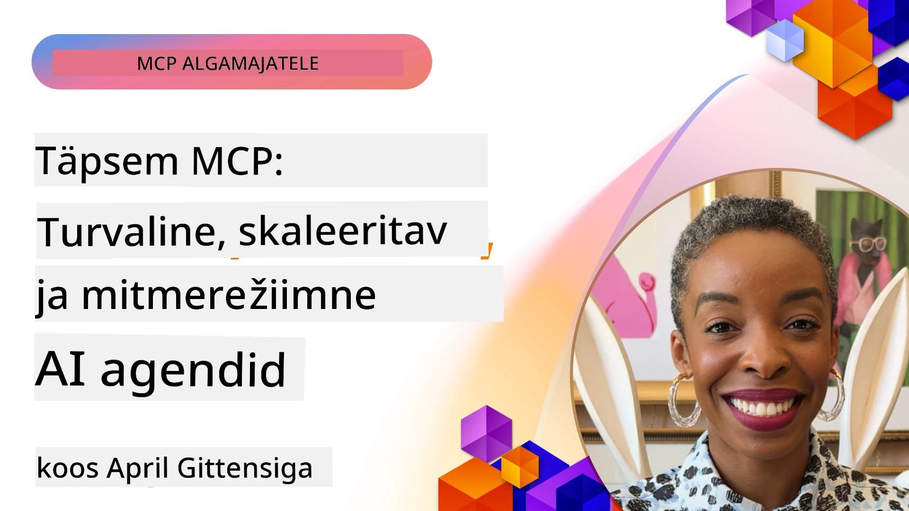

# Täiustatud teemad MCP-s

_(Klõpsake ülaloleval pildil, et vaadata selle õppetunni videot)_

See peatükk käsitleb mitmeid täiustatud teemasid Model Context Protocoli (MCP) rakendamises, sealhulgas multimodaalset integratsiooni, mastaapsust, turvaliste tavade rakendamist ja ettevõtte integratsiooni. Need teemad on olulised tugevate ja tootmiskõlbulike MCP rakenduste ehitamiseks, mis suudavad vastata kaasaegsete tehisintellekti süsteemide nõudmistele.

## Ülevaade

See õppetund uurib Model Context Protocoli rakendamise täiustatud kontseptsioone, keskendudes multimodaalsele integratsioonile, mastaapsusele, turvalistele tavadele ja ettevõtte integratsioonile. Need teemad on olulised tootmiskõlbulike MCP rakenduste loomiseks, mis suudavad lahendada keerukaid nõudmisi ettevõtte keskkondades.

## Õpieesmärgid

Selle õppetunni lõpuks suudate:

- Rakendada multimodaalseid võimeid MCP raamistikus
- Kujundada mastaapseid MCP arhitektuure kõrgete nõudmistega olukordades
- Rakendada turvalisi parimaid tavasid, mis vastavad MCP turvapõhimõtetele
- Integreerida MCP ettevõtte tehisintellekti süsteemide ja raamistikudega
- Optimeerida jõudlust ja töökindlust tootmiskeskkondades

## Õppetunnid ja näidistööprojektid

| Link | Pealkiri | Kirjeldus |
|------|----------|-----------|
| [5.1 Integratsioon Azure'iga](./mcp-integration/README.md) | Integratsioon Azure'iga | Õpi, kuidas integreerida oma MCP-server Azure'iga |
| [5.2 Multimodaalsete näidete komplekt](./mcp-multi-modality/README.md) | MCP multimodaalsed näited | Näited heli, pildi ja multimodaalse vastuse jaoks |
| [5.3 MCP OAuth2 näidis](../../../05-AdvancedTopics/mcp-oauth2-demo) | MCP OAuth2 demo | Minimalistlik Spring Boot rakendus, mis demonstreerib OAuth2 kasutamist MCP-ga nii autoriseerimise kui ressursiserveri rollis. Näitab turvalist tokeni väljastamist, kaitstud otspunkte, Azure Container Apps juurutust ja API halduse integratsiooni. |
| [5.4 Juurekontekstid](./mcp-root-contexts/README.md) | Juurekontekstid | Õpi rohkem juuurekonteksti kohta ja kuidas neid rakendada |
| [5.5 Suunamine](./mcp-routing/README.md) | Suunamine | Õpi erinevaid suunamisviise |
| [5.6 Proovimine](./mcp-sampling/README.md) | Proovimine | Õpi, kuidas proovimist kasutada |
| [5.7 Skaleerimine](./mcp-scaling/README.md) | Skaleerimine | Õpi skaleerimise kohta |
| [5.8 Turvalisus](./mcp-security/README.md) | Turvalisus | Kinnita oma MCP-serveri turvalisus |
| [5.9 Veebipõhine otsing MCP-ga](./web-search-mcp/README.md) | Veebipõhine otsing MCP | Python MCP server ja klient, mis integreerib SerpAPI reaalajas veebipõhise, uudiste-, toodete otsingu ja K&V funktsioonidega. Näitab mitme tööriista orkestreerimist, väliste API-de integratsiooni ja tugevat veahaldust. |
| [5.10 Reaalajas voogedastus](./mcp-realtimestreaming/README.md) | Voogedastus | Reaalajas andmevoogude edastamine on tänapäeva andmepõhises maailmas oluline, kus ettevõtted ja rakendused vajavad infole viivitamatut ligipääsu, et teha kiireid otsuseid. |
| [5.11 Reaalajas veebipõhine otsing](./mcp-realtimesearch/README.md) | Veebipõhine otsing | Kuidas MCP muudab reaalajas veebipõhist otsingut, pakkudes standardiseeritud lähenemist konteksti haldamiseks tehisintellektimudelite, otsingumootorite ja rakenduste vahel. |
| [5.12 Entra ID autentimine Model Context Protocoli serveritele](./mcp-security-entra/README.md) | Entra ID autentimine | Microsoft Entra ID pakub tugevat pilvepõhist identiteedi- ja juurdepääsuhalduslahendust, aidates tagada, et ainult volitatud kasutajad ja rakendused saavad suhelda teie MCP serveriga. |
| [5.13 Azure AI Foundry agendi integratsioon](./mcp-foundry-agent-integration/README.md) | Azure AI Foundry integratsioon | Õpi, kuidas integreerida Model Context Protocoli serverid Azure AI Foundry agentidega, võimaldades võimsaid tööriistade orkestreerimise ja ettevõtte tehisintellekti võimekusi standardiseeritud väliste andmeallikate ühendustega. |
| [5.14 Konteksti inseneriteadus](./mcp-contextengineering/README.md) | Konteksti inseneriteadus | Tuleviku võimalused konteksti inseneriteaduse tehnikate rakendamisel MCP serveritele, sh konteksti optimeerimine, dünaamiline konteksti haldus ja tõhusa käsu inseneritehnika strateegiad MCP raamistikus. |
| [5.15 MCP kohandatud transpordimehhanismid](./mcp-transport/README.md) | Kohandatud transpordimehhanismid | Õpi, kuidas rakendada kohandatud transpordimehhanisme spetsiaalseteks MCP suhtlusstsenaariumideks. |
| [5.16 Protokolli omaduste süvitsi käsitlus](./mcp-protocol-features/README.md) | Protokolli omadused | Omaenda arenenud protokollifunktsioonide valdamine, sealhulgas edenemise teavitused, päringute tühistamine, ressursside mallid ja vigade käsitlusmustrid. |

> **Uus MCP spetsifikatsioonis 2025-11-25**: spetsifikatsioon sisaldab nüüd eksperimentaalset tuge **Ülesannetele** (pikkadele tegevustele edenemiste jälgimisega), **Tööriistade annotatsioonidele** (væristusmeetmed tööriistade käitumise kohta ohutuse tagamiseks), **URL-režiimi esiletoomisele** (soovides klientidelt konkreetset URL-sisu) ja täiustatud **Juurtel** (tööruumi konteksti haldamiseks). Täpsemate üksikasjade saamiseks vaadake [MCP spetsifikatsiooni muudatustelogit](https://spec.modelcontextprotocol.io/).

## Täiendavad viited

Kõige uuema info saamiseks täiustatud MCP teemadel vaadake:
- [MCP dokumentatsioon](https://modelcontextprotocol.io/)
- [MCP spetsifikatsioon (2025-11-25)](https://spec.modelcontextprotocol.io/specification/2025-11-25/)
- [GitHubi hoidla](https://github.com/modelcontextprotocol)
- [OWASP MCP Top 10](https://microsoft.github.io/mcp-azure-security-guide/mcp/) - turvariskid ja leevendused
- [MCP turvasumma töötoad (Sherpa)](https://azure-samples.github.io/sherpa/) - praktilised turbakoolitused

## Peamised järeldused

- Multimodaalsed MCP rakendused laiendavad tehisintellekti võimeid tekstitöötlusest kaugemale
- Mastaapsus on ettevõtte juurutusteks hädavajalik ning seda saab lahendada horisontaalse ja vertikaalse skaleerimise kaudu
- Ulatuslikud turvameetmed kaitsevad andmeid ja tagavad korrektse juurdepääsu kontrolli
- Ettevõtte integratsioon platvormidega nagu Azure OpenAI ja Microsoft AI Foundry parandab MCP võimeid
- Täiustatud MCP rakendused saavad kasu optimeeritud arhitektuuridest ja hoolikast ressursside haldusest

## Harjutus

Kujunda ettevõtte klassi MCP rakendus konkreetse kasutusjuhtumi jaoks:

1. Määra oma kasutusjuhtumi multimodaalsed nõuded
2. Kirjelda turvakontrollid, mis on vajalikud tundlike andmete kaitsmiseks
3. Kujunda mastaapne arhitektuur, mis suudab hallata muutuvaid koormusi
4. Plaani integratsioonipunktid ettevõtte tehisintellekti süsteemidega
5. Dokumenteeri potentsiaalsed jõudluse kitsaskohad ja nende leevendamise strateegiad

## Täiendavad ressursid

- [Azure OpenAI dokumentatsioon](https://learn.microsoft.com/en-us/azure/ai-services/openai/)
- [Microsoft AI Foundry dokumentatsioon](https://learn.microsoft.com/en-us/ai-services/)

---

## Mis edasi

Uuri selle mooduli õppetunde, alustades: [5.1 MCP integratsioon](./mcp-integration/README.md)

Kui oled selle mooduli lõpetanud, jätka: [Moodul 6: Kogukonna panused](../06-CommunityContributions/README.md)

---

<!-- CO-OP TRANSLATOR DISCLAIMER START -->
**Vastutusest loobumine**:
See dokument on tõlgitud tehisintellekti tõlketeenuse [Co-op Translator](https://github.com/Azure/co-op-translator) abil. Kuigi püüame tagada täpsust, palun arvestage, et automaatsed tõlked võivad sisaldada vigu või ebatäpsusi. Originaaldokument selle emakeeles tuleks lugeda autoriteetseks allikaks. Olulise teabe puhul soovitatakse kasutada professionaalset inimtõlget. Me ei vastuta selle tõlke kasutamisest tingitud mõistmis- ega tõlgendusvigade eest.
<!-- CO-OP TRANSLATOR DISCLAIMER END -->