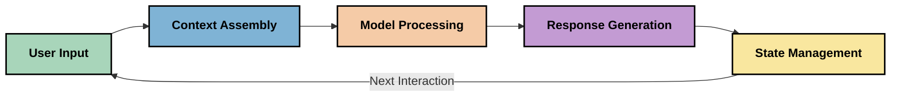
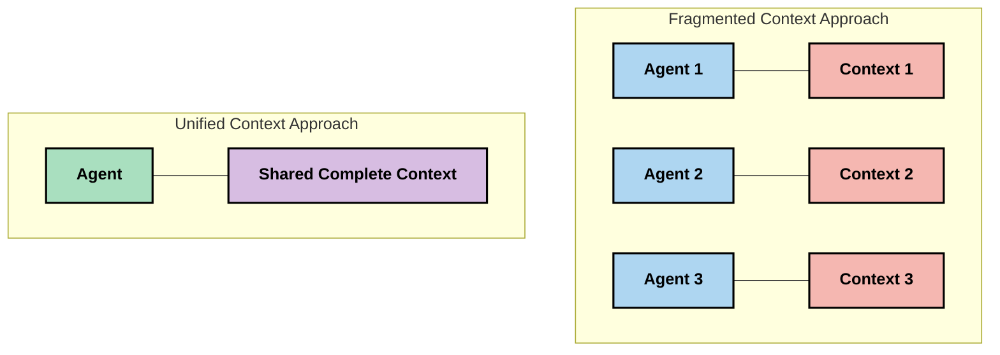
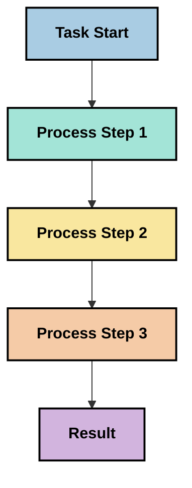
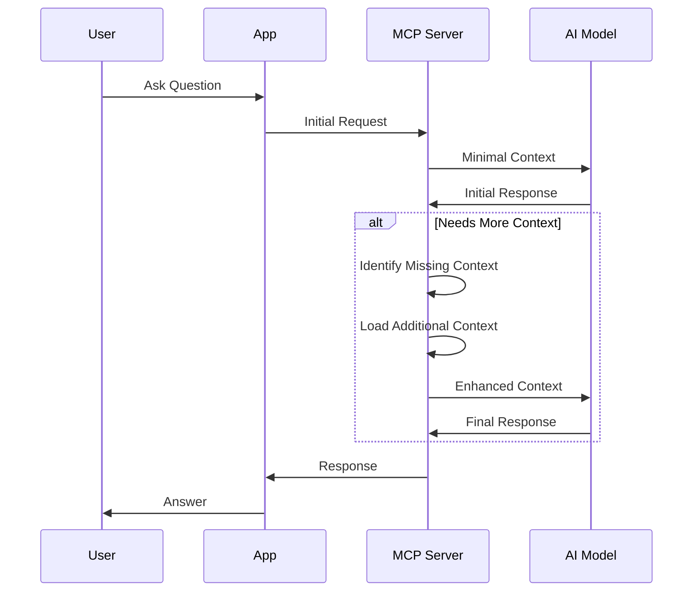
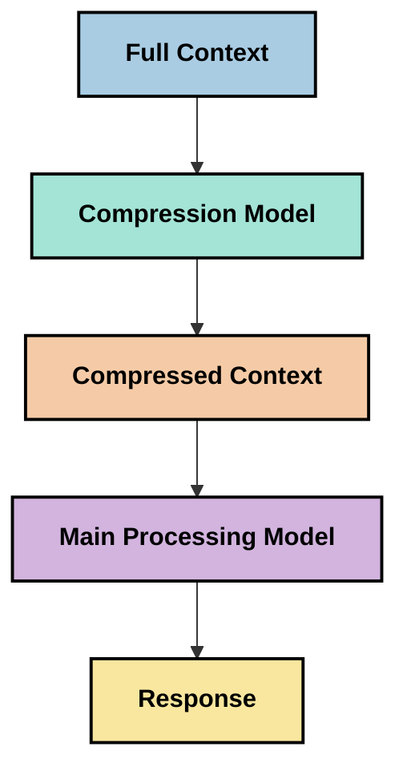

# Kontekstiinseneeria: Tekkiv kontseptsioon MCP ökosüsteemis

## Ülevaade

Kontekstiinseneeria on tekkiv kontseptsioon tehisintellekti valdkonnas, mis uurib, kuidas informatsiooni struktureeritakse, edastatakse ja säilitatakse klientide ja tehisintellekti teenuste vaheliste interaktsioonide käigus. Kuna Model Context Protocol (MCP) ökosüsteem areneb, muutub konteksti tõhus haldamine üha olulisemaks. See moodul tutvustab kontekstiinseneeria kontseptsiooni ja uurib selle potentsiaalseid rakendusi MCP lahendustes.

## Õpieesmärgid

Selle mooduli lõpuks suudad:

- Mõista kontekstiinseneeria tekkivat kontseptsiooni ja selle võimalikku rolli MCP rakendustes
- Tuvastada konteksti haldamise peamised väljakutsed, mida MCP protokolli disain käsitleb
- Uurida tehnikaid mudeli jõudluse parandamiseks parema konteksti käsitlemise kaudu
- Mõelda lähenemistele, kuidas mõõta ja hinnata konteksti tõhusust
- Rakendada neid tekkivaid kontseptsioone, et MCP raamistiku abil parandada tehisintellekti kogemusi

## Sissejuhatus kontekstiinseneeriasse

Kontekstiinseneeria keskendub informatsiooni voolu teadlikule disainile ja haldamisele kasutajate, rakenduste ja tehisintellekti mudelite vahel. Erinevalt väljakujunenud valdkondadest, nagu prompt engineering, on kontekstiinseneeria alles kujunemisjärgus, kuna praktikud töötavad välja lahendusi, et pakkuda tehisintellekti mudelitele õiget informatsiooni õigel ajal.

Kuna suured keelemudelid (LLM-id) on arenenud, on konteksti tähtsus muutunud üha ilmsemaks. Konteksti kvaliteet, asjakohasus ja struktuur mõjutavad otseselt mudeli väljundeid. Kontekstiinseneeria uurib seda suhet ja püüab välja töötada põhimõtteid tõhusaks konteksti haldamiseks.

> "Aastal 2025 on mudelid äärmiselt intelligentsed. Kuid isegi kõige targem inimene ei suuda oma tööd tõhusalt teha ilma kontekstita, mida neilt oodatakse... 'Kontekstiinseneeria' on järgmine tase prompt engineering'ist. See seisneb selles, et seda tehakse automaatselt dünaamilises süsteemis." — Walden Yan, Cognition AI

Kontekstiinseneeria võib hõlmata:

1. **Konteksti valik**: Määratlemine, milline informatsioon on konkreetse ülesande jaoks asjakohane
2. **Konteksti struktureerimine**: Informatsiooni organiseerimine, et maksimeerida mudeli arusaamist
3. **Konteksti edastamine**: Optimeerimine, kuidas ja millal informatsioon mudelile saadetakse
4. **Konteksti säilitamine**: Konteksti seisundi ja evolutsiooni haldamine aja jooksul
5. **Konteksti hindamine**: Konteksti tõhususe mõõtmine ja parandamine

Need fookusvaldkonnad on eriti olulised MCP ökosüsteemis, mis pakub standardiseeritud viisi rakendustele konteksti edastamiseks LLM-idele.

## Konteksti teekonna perspektiiv

Üks viis kontekstiinseneeria visualiseerimiseks on jälgida informatsiooni teekonda MCP süsteemis:



### Konteksti teekonna peamised etapid:

1. **Kasutaja sisend**: Kasutaja poolt esitatud toorinfo (tekst, pildid, dokumendid)
2. **Konteksti koostamine**: Kasutaja sisendi kombineerimine süsteemi konteksti, vestluse ajaloo ja muu leitud informatsiooniga
3. **Mudeli töötlemine**: Tehisintellekti mudel töötleb koostatud konteksti
4. **Vastuse genereerimine**: Mudel loob väljundi antud konteksti põhjal
5. **Seisundi haldamine**: Süsteem uuendab oma sisemist seisundit vastavalt interaktsioonile

See perspektiiv toob esile konteksti dünaamilise olemuse tehisintellekti süsteemides ja tõstatab olulisi küsimusi, kuidas informatsiooni igas etapis kõige paremini hallata.

## Tekkivad põhimõtted kontekstiinseneerias

Kuna kontekstiinseneeria valdkond kujuneb, hakkavad praktikutelt esile kerkima esimesed põhimõtted. Need põhimõtted võivad aidata MCP rakenduste valikuid suunata:

### Põhimõte 1: Jaga konteksti täielikult

Kontekst tuleks jagada täielikult kõigi süsteemi komponentide vahel, mitte killustada mitme agendi või protsessi vahel. Kui kontekst on jaotatud, võivad otsused, mis tehakse ühes süsteemi osas, olla vastuolus mujal tehtud otsustega.



MCP rakendustes viitab see süsteemide disainile, kus kontekst voolab sujuvalt läbi kogu torustiku, mitte ei ole killustatud.

### Põhimõte 2: Tunnista, et tegevused sisaldavad kaudseid otsuseid

Iga mudeli tegevus sisaldab kaudseid otsuseid selle kohta, kuidas konteksti tõlgendada. Kui erinevad komponendid tegutsevad erinevate kontekstide põhjal, võivad need kaudsed otsused olla vastuolulised, põhjustades ebajärjekindlaid tulemusi.

Sellel põhimõttel on MCP rakenduste jaoks olulised tagajärjed:
- Eelista keerukate ülesannete lineaarset töötlemist paralleelse täitmise asemel killustatud kontekstiga
- Tagada, et kõik otsustuspunktid pääsevad ligi samale kontekstuaalsele informatsioonile
- Disainida süsteeme, kus hilisemad etapid näevad varasemate otsuste täielikku konteksti

### Põhimõte 3: Tasakaalusta konteksti sügavus akna piirangutega

Kuna vestlused ja protsessid muutuvad pikemaks, ületavad konteksti aknad lõpuks oma mahupiirangud. Tõhus kontekstiinseneeria uurib lähenemisi, kuidas hallata pinget põhjaliku konteksti ja tehniliste piirangute vahel.

Võimalikud lähenemised, mida uuritakse, hõlmavad:
- Konteksti tihendamine, mis säilitab olulise informatsiooni, vähendades samal ajal tokenite kasutust
- Konteksti järkjärguline laadimine vastavalt hetkevajadustele
- Eelmiste interaktsioonide kokkuvõtete loomine, säilitades olulised otsused ja faktid

## Konteksti väljakutsed ja MCP protokolli disain

Model Context Protocol (MCP) on loodud teadlikult konteksti haldamise unikaalsete väljakutsete lahendamiseks. Nende väljakutsete mõistmine aitab selgitada MCP protokolli disaini põhiaspekte:

### Väljakutse 1: Konteksti akna piirangud
Enamik tehisintellekti mudeleid omab fikseeritud konteksti akna suurust, mis piirab, kui palju informatsiooni nad korraga töödelda suudavad.

**MCP disaini vastus:** 
- Protokoll toetab struktureeritud, ressurssipõhist konteksti, mida saab tõhusalt viidata
- Ressursse saab lehekülgedeks jagada ja järk-järgult laadida

### Väljakutse 2: Asjakohasuse määramine
Raske on kindlaks teha, milline informatsioon on kõige asjakohasem konteksti lisamiseks.

**MCP disaini vastus:**
- Paindlikud tööriistad võimaldavad dünaamilist informatsiooni leidmist vastavalt vajadusele
- Struktureeritud prompt'id võimaldavad järjepidevat konteksti organiseerimist

### Väljakutse 3: Konteksti püsivus
Seisundi haldamine interaktsioonide vahel nõuab konteksti hoolikat jälgimist.

**MCP disaini vastus:**
- Standardiseeritud sessioonihaldus
- Selgelt määratletud interaktsioonimustrid konteksti evolutsiooniks

### Väljakutse 4: Multimodaalne kontekst
Erinevat tüüpi andmed (tekst, pildid, struktureeritud andmed) vajavad erinevat käsitlemist.

**MCP disaini vastus:**
- Protokolli disain mahutab erinevaid sisutüüpe
- Multimodaalse informatsiooni standardiseeritud esitus

### Väljakutse 5: Turvalisus ja privaatsus
Kontekst sisaldab sageli tundlikku informatsiooni, mida tuleb kaitsta.

**MCP disaini vastus:**
- Selged piirid kliendi ja serveri vastutuste vahel
- Kohalik töötlemine, et minimeerida andmete avalikustamist

Nende väljakutsete mõistmine ja MCP lahenduste tundmine loob aluse keerukamate kontekstiinseneeria tehnikate uurimiseks.

## Tekkivad kontekstiinseneeria lähenemised

Kontekstiinseneeria valdkonna arenedes kerkivad esile mitmed paljulubavad lähenemised. Need esindavad praegust mõtlemist, mitte väljakujunenud parimaid praktikaid, ja tõenäoliselt arenevad, kui MCP rakendustega kogemusi juurde saadakse.

### 1. Ühe niidiga lineaarne töötlemine

Erinevalt multi-agent arhitektuuridest, mis jaotavad konteksti, leiavad mõned praktikud, et ühe niidiga lineaarne töötlemine annab järjepidevamaid tulemusi. See on kooskõlas põhimõttega säilitada ühtne kontekst.



Kuigi see lähenemine võib tunduda vähem tõhus kui paralleelne töötlemine, annab see sageli sidusamaid ja usaldusväärsemaid tulemusi, kuna iga samm tugineb täielikule arusaamisele varasematest otsustest.

### 2. Konteksti tükeldamine ja prioriseerimine

Suure konteksti jagamine hallatavateks osadeks ja kõige olulisema valimine.

```python
# Conceptual Example: Context Chunking and Prioritization
def process_with_chunked_context(documents, query):
    # 1. Break documents into smaller chunks
    chunks = chunk_documents(documents)
    
    # 2. Calculate relevance scores for each chunk
    scored_chunks = [(chunk, calculate_relevance(chunk, query)) for chunk in chunks]
    
    # 3. Sort chunks by relevance score
    sorted_chunks = sorted(scored_chunks, key=lambda x: x[1], reverse=True)
    
    # 4. Use the most relevant chunks as context
    context = create_context_from_chunks([chunk for chunk, score in sorted_chunks[:5]])
    
    # 5. Process with the prioritized context
    return generate_response(context, query)
```

Ülaltoodud kontseptsioon illustreerib, kuidas me võiksime suuri dokumente jagada hallatavateks osadeks ja valida kontekstiks ainult kõige asjakohasemad osad. See lähenemine aitab töötada konteksti akna piirangute raames, kasutades samal ajal suuri teadmistebaase.

### 3. Järkjärguline konteksti laadimine

Konteksti laadimine järk-järgult vastavalt vajadusele, mitte kõik korraga.



Järkjärguline konteksti laadimine algab minimaalse kontekstiga ja laieneb ainult siis, kui see on vajalik. See võib oluliselt vähendada tokenite kasutust lihtsate päringute puhul, säilitades samal ajal võime käsitleda keerulisi küsimusi.

### 4. Konteksti tihendamine ja kokkuvõtete loomine

Konteksti suuruse vähendamine, säilitades samal ajal olulise informatsiooni.



Konteksti tihendamine keskendub:
- Korduva informatsiooni eemaldamisele
- Pika sisu kokkuvõtete loomisele
- Oluliste faktide ja detailide eraldamisele
- Kriitiliste konteksti elementide säilitamisele
- Tokenite tõhususe optimeerimisele

See lähenemine võib olla eriti väärtuslik pikkade vestluste säilitamiseks konteksti akendes või suurte dokumentide tõhusaks töötlemiseks. Mõned praktikud kasutavad spetsiaalseid mudeleid, mis on mõeldud konteksti tihendamiseks ja vestluse ajaloo kokkuvõtete loomiseks.

## Uurimuslikud kaalutlused kontekstiinseneerias

Kontekstiinseneeria tekkiva valdkonna uurimisel tasub MCP rakendustega töötades arvestada mitmeid kaalutlusi. Need ei ole ettekirjutatud parimad praktikad, vaid pigem uurimisvaldkonnad, mis võivad teie konkreetse kasutusjuhtumi puhul parandusi tuua.

### Mõtle oma konteksti eesmärkidele

Enne keerukate konteksti haldamise lahenduste rakendamist sõnasta selgelt, mida sa püüad saavutada:
- Millist konkreetset informatsiooni mudel vajab, et olla edukas?
- Milline informatsioon on oluline ja milline täiendav?
- Millised on sinu jõudluspiirangud (latentsus, tokenite piirangud, kulud)?

### Uuri kihilist konteksti lähenemisi

Mõned praktikud leiavad edu kontekstiga, mis on korraldatud kontseptuaalseteks kihtideks:
- **Tuumkiht**: Oluline informatsioon, mida mudel alati vajab
- **Situatsioonikiht**: Kontekst, mis on spetsiifiline praegusele interaktsioonile
- **Toetav kiht**: Täiendav informatsioon, mis võib olla kasulik
- **Tagavarakiht**: Informatsioon, mida kasutatakse ainult vajadusel

### Uuri leidmisstrateegiaid

Konteksti tõhusus sõltub sageli sellest, kuidas informatsiooni leitakse:
- Semantiline otsing ja sisukorrad kontseptuaalselt asjakohase informatsiooni leidmiseks
- Märksõnapõhine otsing konkreetsete faktide leidmiseks
- Hübriidlähenemised, mis kombineerivad mitmeid leidmismeetodeid
- Metaandmete filtreerimine, et kitsendada ulatust kategooriate, kuupäevade või allikate põhjal

### Katseta konteksti sidusust

Konteksti struktuur ja voog võivad mõjutada mudeli arusaamist:
- Seotud informatsiooni rühmitamine kokku
- Järjepideva vormingu ja organiseerimise kasutamine
- Loogilise või kronoloogilise järjestuse säilitamine, kui see on asjakohane
- Vastuolulise informatsiooni vältimine

### Kaalu multi-agent arhitektuuride kompromisse

Kuigi multi-agent arhitektuurid on populaarsed paljudes tehisintellekti raamistikutes, kaasnevad nendega olulised väljakutsed konteksti haldamisel:
- Konteksti killustumine võib viia vastuoluliste otsusteni agentide vahel
- Paralleelne töötlemine võib tekitada konflikte, mida on raske lahendada
- Agentidevaheline kommunikatsioon võib vähendada jõudluse eeliseid
- Kompleksne seisundi haldamine on vajalik sidususe säilitamiseks

Paljudel juhtudel võib ühe agendi lähenemine koos tervikliku konteksti haldamisega anda usaldusväärsemaid tulemusi kui mitme spetsialiseeritud agendi lähenemine killustatud kontekstiga.

### Arenda hindamismeetodeid

Kontekstiinseneeria aja jooksul parandamiseks mõtle, kuidas sa mõõdad edu:
- A/B testimine erinevate konteksti struktuuridega
- Tokenite kasutuse ja vastuseaegade jälgimine
- Kasutajate rahulolu ja ülesannete täitmise määrade jälgimine
- Analüüs, millal ja miks konteksti strateegiad ebaõnnestuvad

Need kaalutlused esindavad aktiivseid uurimisvaldkondi kontekstiinseneeria valdkonnas. Kui valdkond küpseb, ilmuvad tõenäoliselt selgemad mustrid ja praktikad.

## Konteksti tõhususe mõõtmine: kujunev raamistik

Kontekstiinseneeria tekkiva kontseptsioonina hakkavad praktikud uurima, kuidas selle tõhusust võiks mõõta. Kuigi väljakujunenud raamistikku veel ei eksisteeri, kaalutakse mitmeid mõõdikuid, mis võiksid tulevast tööd suunata.

### Potentsiaalsed mõõtmisdimensioonid

#### 1. Sisendi tõhususe kaalutlused

- **Konteksti ja vastuse suhe**: Kui palju konteksti on vaja võrreldes vastuse suurusega?
- **Tokenite kasutus**: Milline protsent antud konteksti tokenitest mõjutab vastust?
- **Konteksti vähendamine**: Kui tõhusalt suudame toorinformatsiooni tihendada?

#### 2. Jõudluse kaalutlused

- **Latentsuse mõju**: Kuidas konteksti haldamine mõjutab vastuseaega?
- **Tokenite ökonoomia**: Kas me optimeerime tokenite kasutust tõhusalt?
- **Leidmise täpsus**: Kui asjakohane on leitud informatsioon?
- **Ressursside kasutus**: Milliseid arvutusressursse on vaja?

#### 3. Kvaliteedi kaalutlused

- **Vastuse asjakohasus**: Kui hästi vastus päringule vastab?
- **Faktiline täpsus**: Kas konteksti haldamine parandab faktilist korrektsust?
- **Järjepidevus**: Kas vastused on järjepidevad sarnaste päringute puhul?
- **Hallutsinatsioonide määr**: Kas parem kontekst vähendab mudeli hallutsinatsioone?

#### 4. Kasutajakogemuse kaalutlused


- [Model Context Protocoli veebisait](https://modelcontextprotocol.io/)
- [Model Context Protocoli spetsifikatsioon](https://github.com/modelcontextprotocol/modelcontextprotocol)
- [MCP dokumentatsioon](https://modelcontextprotocol.io/docs)
- [MCP C# SDK](https://github.com/modelcontextprotocol/csharp-sdk)
- [MCP Python SDK](https://github.com/modelcontextprotocol/python-sdk)
- [MCP TypeScript SDK](https://github.com/modelcontextprotocol/typescript-sdk)
- [MCP Inspector](https://github.com/modelcontextprotocol/inspector) - Visuaalne testimistööriist MCP serverite jaoks

### Artiklid konteksti inseneeriast
- [Ära loo multi-agent süsteeme: konteksti inseneeria põhimõtted](https://cognition.ai/blog/dont-build-multi-agents) - Walden Yani arusaamad konteksti inseneeria põhimõtetest
- [Praktiline juhend agentide loomiseks](https://cdn.openai.com/business-guides-and-resources/a-practical-guide-to-building-agents.pdf) - OpenAI juhend tõhusate agentide disainimiseks
- [Tõhusate agentide loomine](https://www.anthropic.com/engineering/building-effective-agents) - Anthropicu lähenemine agentide arendamisele

### Seotud teadusuuringud
- [Dünaamiline otsingu täiendamine suurte keelemudelite jaoks](https://arxiv.org/abs/2310.01487) - Uuring dünaamiliste otsingu meetodite kohta
- [Kadunud keskel: kuidas keelemudelid kasutavad pikki kontekste](https://arxiv.org/abs/2307.03172) - Oluline uurimus konteksti töötlemise mustrite kohta
- [Hierarhiline tekstipõhine pildigeneratsioon CLIP latentidega](https://arxiv.org/abs/2204.06125) - DALL-E 2 artikkel konteksti struktureerimise kohta
- [Konteksti rolli uurimine suurte keelemudelite arhitektuurides](https://aclanthology.org/2023.findings-emnlp.124/) - Hiljutine uurimus konteksti käsitlemise kohta
- [Multi-agent koostöö: ülevaade](https://arxiv.org/abs/2304.03442) - Uuring multi-agent süsteemide ja nende väljakutsete kohta

### Täiendavad ressursid
- [Konteksti akna optimeerimise tehnikad](https://learn.microsoft.com/en-us/azure/ai-services/openai/concepts/context-window)
- [Täiustatud RAG tehnikad](https://www.microsoft.com/en-us/research/blog/retrieval-augmented-generation-rag-and-frontier-models/)
- [Semantiline tuuma dokumentatsioon](https://github.com/microsoft/semantic-kernel)
- [AI tööriistakomplekt konteksti haldamiseks](https://github.com/microsoft/aitoolkit)

## Mis edasi

- [5.15 MCP kohandatud transport](../mcp-transport/README.md)

---

**Lahtiütlus**:  
See dokument on tõlgitud AI tõlketeenuse [Co-op Translator](https://github.com/Azure/co-op-translator) abil. Kuigi püüame tagada täpsust, palun arvestage, et automaatsed tõlked võivad sisaldada vigu või ebatäpsusi. Algne dokument selle algses keeles tuleks lugeda autoriteetseks allikaks. Olulise teabe puhul on soovitatav kasutada professionaalset inimtõlget. Me ei vastuta selle tõlke kasutamisest tulenevate arusaamatuste või valede tõlgenduste eest.