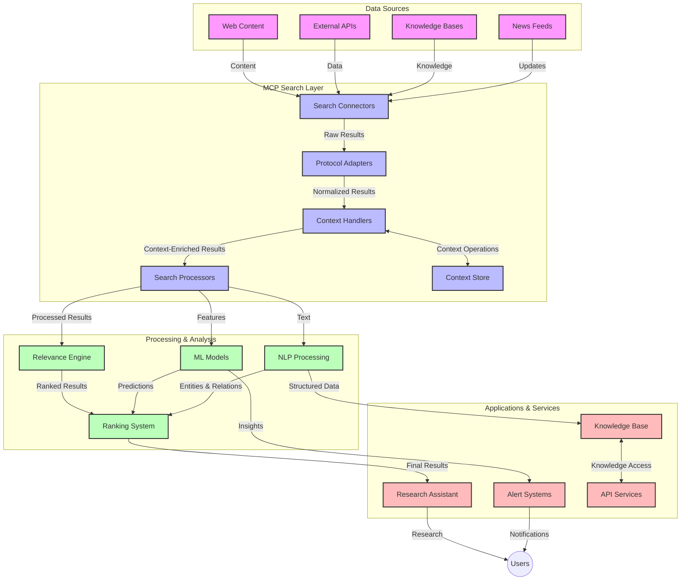

# Mudeli Kontekstiprotokoll reaalajas veebipäringute jaoks

## Ülevaade

Reaalajas veebipäringud on tänapäeva infokeskses keskkonnas muutunud hädavajalikuks, kuna rakendused vajavad kohest juurdepääsu ajakohasele teabele internetis, et pakkuda asjakohaseid ja õigeaegseid vastuseid. Mudeli Kontekstiprotokoll (MCP) tähistab olulist edasiminekut nende reaalajas otsinguprotsesside optimeerimisel, parandades otsingutõhusust, säilitades konteksti terviklikkust ja tõstes süsteemi üldist jõudlust.

See moodul uurib, kuidas MCP muudab reaalajas veebipäringuid, pakkudes standardiseeritud lähenemist konteksti haldamiseks AI mudelite, otsingumootorite ja rakenduste vahel.

### Mida õpid

Selles põhjalikus juhendis saad teada:

- Kuidas MCP loob sujuva silla AI mudelite ja reaalajas veebipäringute võimaluste vahel
- Arhitektuurilised mustrid MCP-ga tõhusate ja skaleeritavate otsingulahenduste rakendamiseks
- Tehnikad otsingukonteksti säilitamiseks mitme päringu ja interaktsiooni jooksul
- Praktilised koodi näited Pythonis ja JavaScriptis erinevate otsingustsenaariumide jaoks
- Meetodid MCP-põhiste otsingusüsteemide asjakohasuse, ajakohasuse ja jõudluse tasakaalustamiseks

## Sissejuhatus reaalajas veebipäringutesse

Reaalajas veebipäringud on tehnoloogiline lähenemine, mis võimaldab pidevat veebipõhise teabe päringut, töötlemist ja analüüsi selle avaldamise või värskendamise ajal, võimaldades süsteemidel pakkuda värsket ja asjakohast teavet minimaalse viivitusega. Erinevalt traditsioonilistest otsingusüsteemidest, mis töötavad indekseeritud andmetega, mis võivad olla tundide või päevade vanused, töötlevad reaalajas otsingud veebist pärinevaid elavaid andmeid, pakkudes teadmisi ja teavet, mis kajastavad veebisisu praegust seisundit.

### Reaalajas veebipäringute põhikontseptsioonid:

- **Pidev päringutöötlus**: Otsingupäringuid töödeldakse pidevalt uuenevate andmeallikate vastu
- **Ajakohasuse prioriteet**: Süsteemid on loodud värske teabe prioriteetimiseks
- **Asjakohasuse tasakaalustamine**: Tasakaalu säilitamine asjakohasuse ja ajakohasuse vahel
- **Skaleeritav arhitektuur**: Süsteemid peavad toime tulema muutuvate päringukoormuste ja andmemahtudega
- **Kontekstuaalne mõistmine**: Kasutajakonteksti säilitamine otsingukorduste jooksul on olulise tulemuse saavutamiseks hädavajalik
- **Dünaamiline päringute reformuleerimine**: Päringute kohandamine konteksti ja varasemate tulemuste põhjal
- **Mitme allika integreerimine**: Tulemuste kombineerimine mitmest otsingupakkujast ja veebiallikast
- **Semantiline mõistmine**: Päringute ja sisu töötlemine tähenduse, mitte ainult märksõnade põhjal
- **Reaalajas järjestamine**: Tulemuste järjestuse pidev kohandamine uue teabe ilmumisel

### Mudeli Kontekstiprotokoll ja reaalajas veebipäringud

Mudeli Kontekstiprotokoll (MCP) lahendab mitmeid kriitilisi väljakutseid reaalajas veebipäringute keskkondades:

1. **Otsingukonteksti säilitamine**: MCP standardiseerib, kuidas konteksti hoitakse hajutatud otsingukomponentide vahel, tagades, et AI mudelitel ja töötlemissõlmedel on juurdepääs asjakohasele päringuloole ja kasutaja eelistustele.

2. **Tõhus päringute haldamine**: Struktureeritud mehhanismide pakkumisega konteksti edastamiseks vähendab MCP vajadust konteksti kordamiseks igas otsingukorduses.

3. **Interoperatiivsus**: MCP loob ühise keele konteksti jagamiseks erinevate otsingutehnoloogiate ja AI mudelite vahel, võimaldades paindlikumaid ja laiendatavamaid arhitektuure.

4. **Otsingule optimeeritud kontekst**: MCP rakendused võivad prioriteerida, millised konteksti elemendid on tõhusaks otsinguks kõige olulisemad, optimeerides nii jõudlust kui ka täpsust.

5. **Kohanduv otsingutöötlus**: MCP abil korralikult hallatud kontekstiga otsingusüsteemid saavad dünaamiliselt kohandada töötlemist vastavalt kasutaja vajaduste ja teabe maastike muutumisele.

Kaasaegsetes rakendustes, alates uudiste koondamisest kuni uurimisassistentideni, võimaldab MCP integreerimine veebipäringute tehnoloogiatega intelligentsemat, kontekstitundlikku otsingut, mis suudab pakkuda üha asjakohasemaid tulemusi, kui kasutaja interaktsioonid jätkuvad.

## Õpieesmärgid

Selle õppetunni lõpuks suudad:

- Mõista reaalajas veebipäringute põhitõdesid ja nende väljakutseid kaasaegsetes rakendustes
- Selgitada, kuidas Mudeli Kontekstiprotokoll (MCP) parandab reaalajas veebipäringute võimalusi
- Rakendada MCP-põhiseid otsingulahendusi populaarsete raamistikute ja API-de abil
- Kavandada ja juurutada skaleeritavaid, suure jõudlusega otsinguarhitektuure MCP-ga
- Rakendada MCP kontseptsioone erinevates kasutusjuhtudes, sealhulgas semantiline otsing, uurimisabi ja AI-toega sirvimine
- Hinnata MCP-põhiste otsingutehnoloogiate arenevaid suundumusi ja tulevikuinnovatsioone
- Arendada kontekstitundlikke otsingusüsteeme, mis õpivad kasutaja interaktsioonidest
- Integreerida veebipäringute võimalusi AI assistentidesse, kasutades standardiseeritud MCP protokolle
- Luua mitmeastmelisi otsingutorusid, mis täpsustavad tulemusi järk-järgult konteksti põhjal
- Optimeerida otsingujõudlust, säilitades samal ajal ulatusliku kontekstitundlikkuse

### Definitsioon ja tähtsus

Reaalajas veebipäringud hõlmavad veebipõhise teabe pidevat päringut, hankimist ja edastamist minimaalse viivitusega. Erinevalt traditsioonilistest otsingumootoritest, mis indekseerivad veebisisu perioodiliselt, püüab reaalajas otsing tuua esile teavet selle ilmumise ajal, võimaldades kohest juurdepääsu kõige värskematele sisudele.

Reaalajas veebipäringute peamised omadused hõlmavad:

- **Värskus**: Värske sisu ja värskenduste prioriteetimine
- **Pidev töötlemine**: Uue teabe pidev jälgimine
- **Päringute kohandamine**: Otsingupäringute täpsustamine konteksti ja tagasiside põhjal
- **Kohene edastamine**: Otsingutulemuste pakkumine minimaalse viivitusega
- **Konteksti säilitamine**: Eelmiste päringute põhjal tulemuste asjakohasuse parandamine

### Traditsioonilise veebipäringu väljakutsed

Traditsioonilised veebipäringute lähenemised seisavad silmitsi mitmete piirangutega, kui neid rakendatakse reaalajas stsenaariumides:

1. **Konteksti killustatus**: Raskused otsingukonteksti säilitamisel mitme päringu jooksul
2. **Teabe värskus**: Värskeima teabe hankimise ja prioriteetimise väljakutsed
3. **Integreerimise keerukus**: Probleemid otsingusüsteemide ja rakenduste koostalitlusvõimega
4. **Viivituse probleemid**: Kuidas tasakaalustada põhjalikku otsingut ja vastuseaega
5. **Asjakohasuse häälestamine**: Täpsuse ja asjakohasuse tagamine, samal ajal ajakohasust prioriteetides

## Mudeli Kontekstiprotokolli (MCP) mõistmine otsingute jaoks

### Mis on MCP otsingukontekstides?

Mudeli Kontekstiprotokoll (MCP) on standardiseeritud suhtlusprotokoll, mis on loodud tõhusa interaktsiooni hõlbustamiseks AI mudelite ja rakenduste vahel. Reaalajas veebipäringute kontekstis pakub MCP raamistikku:

- Otsingukonteksti säilitamiseks päringujadade jooksul
- Otsingupäringute ja tulemuste formaatide standardiseerimiseks
- Otsinguparameetrite ja tulemuste edastamise optimeerimiseks
- Mudeli ja otsingumootori vahelise suhtluse parandamiseks

### Põhikomponendid ja arhitektuur

MCP arhitektuur reaalajas veebipäringute jaoks koosneb mitmest olulisest komponendist:

1. **Päringukonteksti haldurid**: Haldavad ja säilitavad otsingukonteksti mitme päringu jooksul
2. **Otsingutöötlejad**: Töötlevad sisenevaid otsingupäringuid kontekstitundlike tehnikate abil
3. **Protokolli adapterid**: Konverteerivad erinevate otsingumootorite API-de vahel, säilitades konteksti
4. **Konteksti salvestus**: Salvestab ja hangib tõhusalt otsinguloo ja eelistused
5. **Otsinguühendused**: Ühendavad erinevate otsingumootorite ja veebipõhiste API-dega



### Kuidas MCP parandab reaalajas veebipäringuid

MCP lahendab traditsiooniliste veebipäringute väljakutsed järgmiselt:

- **Kontekstuaalne järjepidevus**: Suhete säilitamine päringute vahel kogu otsinguseansi jooksul
- **Optimeeritud edastamine**: Otsinguparameetrite kordamise vähendamine intelligentse konteksti haldamise kaudu
- **Standardiseeritud liidesed**: Ühtsete API-de pakkumine otsingukomponentidele
- **Vähendatud viivitus**: Töötlemiskoormuse minimeerimine tõhusa konteksti haldamise kaudu
- **Parendatud asjakohasus**: Otsingutulemuste asjakohasuse parandamine kasutaja kavatsuse säilitamise kaudu mitme päringu jooksul

## Integreerimine ja rakendamine

Reaalajas veebipäringusüsteemid nõuavad hoolikat arhitektuurilist kujundust ja rakendamist, et säilitada nii jõudlust kui ka konteksti terviklikkust. Mudeli Kontekstiprotokoll pakub standardiseeritud lähenemist AI mudelite ja otsingutehnoloogiate integreerimiseks, võimaldades keerukamaid, kontekstitundlikke otsingutorusid.

### MCP integreerimise ülevaade otsinguarhitektuurides

MCP rakendamine reaalajas veebipäringute keskkondades hõlmab mitmeid olulisi kaalutlusi:

1. **Otsingukonteksti serialiseerimine**: MCP pakub tõhusaid mehhanisme kontekstuaalse teabe kodeerimiseks otsingupäringutes, tagades, et oluline kontekst järgib päringut kogu töötlemistorus. See hõlmab otsinguga seotud metaandmete jaoks optimeeritud standardiseeritud serialiseerimisformaate.

2. **Oleku säilitav otsingutöötlus**: MCP võimaldab intelligentsemat oleku säilitavat töötlemist, säilitades järjepideva konteksti esinduse otsingukorduste jooksul. See on eriti väärtuslik mitmeastmelistes otsingutorudes, kus konteksti täpsustamine parandab tulemusi.

3. **Päringute laiendamine ja täpsustamine**: MCP rakendused otsingusüsteemides võivad hõlbustada keerukaid päringute laiendusi ja täpsustusi kogutud konteksti põhjal, võimaldades otsinguseansi edenedes üha asjakohasemaid tulemusi.

4. **Tulemuste vahemällu salvestamine ja prioriteetide seadmine**: Konteksti haldamise standardiseerimise kaudu aitab MCP hallata tulemuste vahemällu salvestamist ja prioriteetide seadmist, võimaldades komponentidel kohaneda vastavalt muutuvale otsingukontekstile.

5. **Otsinguföderatsioon ja agregatsioon**: MCP hõlbustab keerukamat otsinguföderatsiooni mitme taustsüsteemi vahel, pakkudes otsingukonteksti struktureeritud esindusi, võimaldades mitmekesiste allikate tulemuste tähenduslikumat agregatsiooni.

MCP rakendamine erinevates otsingutehnoloogiates loob ühtse lähenemise konteksti haldamiseks, vähendades vajadust kohandatud integreerimiskoodi järele ja parandades süsteemi võimet säilitada tähenduslikku konteksti, kui otsingupäringud arenevad.

### MCP erinevates veebipäringute rakendustes

Need näited järgivad praegust MCP spetsifikatsiooni, mis keskendub JSON-RPC-põhisele protokollile koos eristuvate transpordimehhanismidega. Kood näitab, kuidas rakendada kohandatud otsinguintegratsioone, säilitades täieliku ühilduvuse MCP protokolliga.

<details>
<summary>Python rakendus üldise otsingu API-ga</summary>

```python
import asyncio
import json
import aiohttp
from typing import Dict, Any, Optional, List
from contextlib import asynccontextmanager
from collections.abc import AsyncIterator

# Import standard MCP libraries
from mcp.client.session import ClientSession
from mcp.client.streamable_http import streamablehttp_client
from mcp.types import TextContent, CreateMessageRequestParams, CreateMessageResult
from mcp.server.fastmcp import FastMCP

# Create a FastMCP server for web search
search_server = FastMCP("WebSearch")

# Class to handle web search operations
class WebSearchHandler:
    def __init__(self, api_endpoint: str, api_key: str):
        self.api_endpoint = api_endpoint
        self.api_key = api_key
        self.session = None
        
    async def initialize(self):
        """Initialize the HTTP session"""
        self.session = aiohttp.ClientSession(
            headers={"Authorization": f"Bearer {self.api_key}"}
        )
    
    async def close(self):
        """Close the HTTP session"""
        if self.session:
            await self.session.close()
            
    async def perform_search(self, query: str, max_results: int = 5, 
                           include_domains: List[str] = None, 
                           exclude_domains: List[str] = None,
                           time_period: str = "any") -> Dict[str, Any]:
        """Perform web search using the search API"""
        # Construct search parameters
        search_params = {
            "q": query,
            "limit": max_results,
            "time": time_period
        }
        
        if include_domains:
            search_params["site"] = ",".join(include_domains)
            
        if exclude_domains:
            search_params["exclude_site"] = ",".join(exclude_domains)
        
        # Perform the search request
        try:
            async with self.session.get(
                self.api_endpoint,
                params=search_params
            ) as response:
                if response.status != 200:
                    error_text = await response.text()
                    raise Exception(f"Search API error: {response.status} - {error_text}")
                
                search_data = await response.json()
                
                # Transform API-specific response to a standard format
                results = []
                for item in search_data.get("results", []):
                    results.append({
                        "title": item.get("title", ""),
                        "url": item.get("url", ""),
                        "snippet": item.get("snippet", ""),
                        "date": item.get("published_date", ""),
                        "source": item.get("source", "")
                    })
                
                return {
                    "query": query,
                    "totalResults": len(results),
                    "results": results
                }
        except Exception as e:
            print(f"Search API request error: {e}")
            raise

# Initialize the search handler
search_handler = WebSearchHandler(
    api_endpoint="https://api.search-service.example/search",
    api_key="your-api-key-here"
)

# Setup lifespan to manage the search handler
@asyncio.asynccontextmanager
async def app_lifespan(server: FastMCP):
    """Manage application lifecycle"""
    await search_handler.initialize()
    try:
        yield {"search_handler": search_handler}
    finally:
        await search_handler.close()

# Set lifespan for the server
search_server = FastMCP("WebSearch", lifespan=app_lifespan)

# Register a web search tool
@search_server.tool()
async def web_search(query: str, max_results: int = 5, 
                   include_domains: List[str] = None,
                   exclude_domains: List[str] = None,
                   time_period: str = "any") -> Dict[str, Any]:
    """
    Search the web for information
    
    Args:
        query: The search query
        max_results: Maximum number of results to return (default: 5)
        include_domains: List of domains to include in search results
        exclude_domains: List of domains to exclude from search results
        time_period: Time period for results ("day", "week", "month", "any")
        
    Returns:
        Dictionary containing search results
    """
    ctx = search_server.get_context()
    search_handler = ctx.request_context.lifespan_context["search_handler"]
    
    results = await search_handler.perform_search(
        query=query,
        max_results=max_results,
        include_domains=include_domains,
        exclude_domains=exclude_domains,
        time_period=time_period
    )
    
    return results

# Example client usage
async def client_example():
    # Connect to the search server using Streamable HTTP transport
    async with streamablehttp_client("http://localhost:8000/mcp") as (read, write, _):
        async with ClientSession(read, write) as session:
            # Initialize the connection
            await session.initialize()
            
            # Call the web_search tool
            search_results = await session.call_tool(
                "web_search", 
                {
                    "query": "latest developments in AI and Model Context Protocol",
                    "max_results": 5,
                    "time_period": "day",
                    "include_domains": ["github.com", "microsoft.com"]
                }
            )
            
            print(f"Search results: {search_results}")

# Server execution example
if __name__ == "__main__":
    # Run the server with Streamable HTTP transport
    search_server.run(transport="streamable-http")
```
</details> 

<details>
<summary>JavaScripti rakendus brauseripõhise otsinguga</summary>

```javascript
// MCP server implementation for web search
import { McpServer, ResourceTemplate } from '@modelcontextprotocol/sdk/server/mcp.js';
import { StreamableHTTPServerTransport } from '@modelcontextprotocol/sdk/server/streamableHttp.js';
import { z } from 'zod';

// Create an MCP server for web search
const searchServer = new McpServer({
    name: "BrowserSearch",
    description: "A server that provides web search capabilities"
});

// Search service class
class SearchService {
    constructor(searchApiUrl, apiKey) {
        this.searchApiUrl = searchApiUrl;
        this.apiKey = apiKey;
    }

    async performSearch(parameters) {
        const {
            query = '',
            maxResults = 5,
            includeDomains = [],
            excludeDomains = [],
            timePeriod = 'any'
        } = parameters;
        
        // Construct search URL with parameters
        const url = new URL(this.searchApiUrl);
        url.searchParams.append('q', query);
        url.searchParams.append('limit', maxResults);
        url.searchParams.append('time', timePeriod);
        
        if (includeDomains.length > 0) {
            url.searchParams.append('site', includeDomains.join(','));
        }
        
        if (excludeDomains.length > 0) {
            url.searchParams.append('exclude_site', excludeDomains.join(','));
        }
        
        try {
            const response = await fetch(url.toString(), {
                method: 'GET',
                headers: {
                    'Authorization': `Bearer ${this.apiKey}`,
                    'Content-Type': 'application/json'
                }
            });
            
            if (!response.ok) {
                const errorText = await response.text();
                throw new Error(`Search API error: ${response.status} - ${errorText}`);
            }
            
            const searchData = await response.json();
            
            // Transform API-specific response to a standard format
            const results = searchData.results?.map(item => ({
                title: item.title || '',
                url: item.url || '',
                snippet: item.snippet || '',
                date: item.published_date || '',
                source: item.source || ''
            })) || [];
            
            return {
                query,
                totalResults: results.length,
                results
            };
        } catch (error) {
            console.error('Search API request error:', error);
            throw error;
        }
    }
}

// Initialize the search service
const searchService = new SearchService(
    'https://api.search-service.example/search',
    'your-api-key-here'
);

// Setup the context provider for the server
searchServer.setContextProvider(() => {
    return {
        searchService
    };
});

// Register web search tool
searchServer.tool({
    name: 'web_search',
    description: 'Search the web for information',
    parameters: {
        type: 'object',
        properties: {
            query: {
                type: 'string',
                description: 'The search query'
            },
            maxResults: {
                type: 'integer',
                description: 'Maximum number of results to return',
                default: 5
            },
            includeDomains: {
                type: 'array',
                items: { type: 'string' },
                description: 'List of domains to include in search results'
            },
            excludeDomains: {
                type: 'array',
                items: { type: 'string' },
                description: 'List of domains to exclude from search results'
            },
            timePeriod: {
                type: 'string',
                description: 'Time period for results',
                enum: ['day', 'week', 'month', 'any'],
                default: 'any'
            }
        },
        required: ['query']
    },
    handler: async (params, context) => {
        const { searchService } = context;
        return await searchService.performSearch(params);
    }
});

// Example client code to connect to the search server
import { Client } from '@modelcontextprotocol/sdk/client/index.js';
import { StreamableHTTPClientTransport } from '@modelcontextprotocol/sdk/client/streamableHttp.js';

async function connectToSearchServer() {
    // Connect to the search server
    const transport = new StreamableHTTPClientTransport(
        new URL('http://localhost:8000/mcp')
    );
    
    const client = new Client({
        name: 'search-client',
        version: '1.0.0'
    });
    
    await client.connect(transport);
    
    // Execute the search tool
    const searchResults = await client.callTool({
        name: 'web_search',
        arguments: {
            query: 'Model Context Protocol implementation examples',
            maxResults: 10,
            timePeriod: 'week',
            includeDomains: ['github.com', 'docs.microsoft.com']
        }
    });
    
    console.log('Search results:', searchResults);
    
    // Cleanup
    await client.disconnect();
}

// Start the server
const transport = new StreamableHTTPServerTransport();
await searchServer.connect(transport);
console.log('Search server running at http://localhost:8000/mcp');

// In a separate process or after server is started
// connectToSearchServer().catch(console.error);
```
</details> 

## Koodinäidete lahtiütlus

> **Oluline märkus**: Allpool toodud koodinäited demonstreerivad Mudeli Kontekstiprotokolli (MCP) integreerimist veebipäringute funktsionaalsusega. Kuigi need järgivad ametlike MCP SDK-de mustreid ja struktuure, on need hariduslikel eesmärkidel lihtsustatud.
> 
> Need näited näitavad:
> 
> 1. **Python rakendus**: FastMCP serveri rakendus, mis pakub veebipäringute tööriista ja ühendub välise otsingu API-ga. Näide demonstreerib elutsükli haldamist, konteksti käsitlemist ja tööriista rakendamist vastavalt [ametliku MCP Python SDK](https://github.com/modelcontextprotocol/python-sdk) mustritele. Server kasutab soovitatud Streamable HTTP transporti, mis on tootmises asendanud vanema SSE transpordi.
> 
> 2. **JavaScripti rakendus**: TypeScript/JavaScripti rakendus, mis kasutab FastMCP mustrit [ametlikust MCP TypeScript SDK-st](https://github.com/modelcontextprotocol/typescript-sdk), et luua otsinguserver koos korralike tööriistade määratluste ja kliendiühendustega. See järgib uusimaid soovitatud mustreid seansi haldamiseks ja konteksti säilitamiseks.
> 
> Need näited vajaksid tootmiskasutuseks täiendavat veakäsitlust, autentimist ja konkreetset API integreerimiskoodi. Näidatud otsingu API lõpp-punktid (`https://api.search-service.example/search`) on kohatäited ja need tuleks asendada tegelike otsinguteenuse lõpp-punktidega.
> 
> Täielike rakendusdetailide ja kõige ajakohasemate lähenemiste jaoks vaata [ametlikku MCP spetsifikatsiooni](https://spec.modelcontextprotocol.io/) ja SDK dokumentatsiooni.

## Põhikontseptsioonid

### Mudeli Kontekstiprotokolli (MCP) raamistik

MCP pakub standardiseeritud viisi AI mudelite, rakenduste ja teenuste vahel konteksti vahetamiseks. Reaalajas veebipäringutes on see raamistik hädavajalik, et luua sidusaid, mitme pöördega otsingukogemusi. Olulised komponendid hõlmavad:

1. **Kliendi-serveri arhitektuur**: MCP eristab selgelt otsingukliendid (päringute esitajad) ja otsinguserverid (teenusepakkujad), võimaldades paindlikke juurutusmudeleid.

2. **JSON-RPC suhtlus**: Protokoll kasutab JSON-RPC-d sõnumivahetuseks, muutes selle ühilduvaks veebitehnoloogiatega ja lihtsasti rakendatavaks erinevatel platvormidel.

3. **Konteksti haldamine**: MCP määratleb struktureeritud meetodid otsingukonteksti säilitamiseks, uuendamiseks ja kasutamiseks mitme interaktsiooni jooksul.

4. **Tööriistade määratlused**
Ootame, et MCP areneb tulevikus, et lahendada järgmisi valdkondi:

- **Multimodaalne otsing**: Teksti, pildi, heli ja video otsingu integreerimine säilitades konteksti
- **Detsentraliseeritud otsing**: Hajutatud ja föderatiivsete otsingusüsteemide toetamine
- **Otsingu privaatsus**: Kontekstitundlikud privaatsust säilitavad otsingumehhanismid
- **Päringute mõistmine**: Loodusliku keele otsingupäringute sügav semantiline analüüs

### Potentsiaalsed tehnoloogia edusammud

Tekkivad tehnoloogiad, mis kujundavad MCP otsingu tulevikku:

1. **Neuraalsed otsinguarhitektuurid**: MCP jaoks optimeeritud otsingusüsteemid, mis põhinevad sisseehitatud mudelitel
2. **Personaalne otsingukontekst**: Kasutaja individuaalsete otsingumustrite õppimine aja jooksul
3. **Teadmiste graafiku integreerimine**: Kontekstitundlik otsing, mida täiustavad valdkonnaspetsiifilised teadmiste graafikud
4. **Ristmodaalne kontekst**: Konteksti säilitamine erinevate otsingumodaalsuste vahel

## Praktilised harjutused

### Harjutus 1: Põhilise MCP otsingutoru seadistamine

Selles harjutuses õpid:
- Konfigureerima põhilist MCP otsingukeskkonda
- Rakendama konteksti haldureid veebipõhiseks otsinguks
- Testima ja valideerima konteksti säilitamist otsingukorduste vahel

### Harjutus 2: MCP otsinguga teadusassistent

Loo täielik rakendus, mis:
- Töötleb loodusliku keele teadusküsimusi
- Viib läbi kontekstitundlikke veebipõhiseid otsinguid
- Sünteesib teavet mitmest allikast
- Esitab organiseeritud teadustulemusi

### Harjutus 3: Mitme allika otsingu föderatsiooni rakendamine MCP-ga

Edasijõudnute harjutus, mis hõlmab:
- Kontekstitundlikku päringute suunamist mitmele otsingumootorile
- Tulemuste järjestamist ja koondamist
- Otsingutulemuste kontekstuaalset dubleerimise vältimist
- Allikaspetsiifilise metaandmete käsitlemist

## Lisamaterjalid

- [Model Context Protocol Specification](https://spec.modelcontextprotocol.io/) - MCP ametlik spetsifikatsioon ja detailne protokolli dokumentatsioon
- [Model Context Protocol Documentation](https://modelcontextprotocol.io/) - Üksikasjalikud õpetused ja rakendusjuhendid
- [MCP Python SDK](https://github.com/modelcontextprotocol/python-sdk) - MCP protokolli ametlik Python'i rakendus
- [MCP TypeScript SDK](https://github.com/modelcontextprotocol/typescript-sdk) - MCP protokolli ametlik TypeScript'i rakendus
- [MCP Reference Servers](https://github.com/modelcontextprotocol/servers) - MCP serverite viiteimplementatsioonid
- [Bing Web Search API Documentation](https://learn.microsoft.com/en-us/bing/search-apis/bing-web-search/overview) - Microsofti veebipõhise otsingu API
- [Google Custom Search JSON API](https://developers.google.com/custom-search/v1/overview) - Google'i programmeeritav otsingumootor
- [SerpAPI Documentation](https://serpapi.com/search-api) - Otsingumootori tulemuste lehe API
- [Meilisearch Documentation](https://www.meilisearch.com/docs) - Avatud lähtekoodiga otsingumootor
- [Elasticsearch Documentation](https://www.elastic.co/guide/index.html) - Hajutatud otsingu- ja analüütikamootor
- [LangChain Documentation](https://python.langchain.com/docs/get_started/introduction) - Rakenduste loomine LLM-idega

## Õpitulemused

Selle mooduli läbimisega suudad:

- Mõista reaalajas veebipõhise otsingu põhitõdesid ja selle väljakutseid
- Selgitada, kuidas Model Context Protocol (MCP) täiustab reaalajas veebipõhise otsingu võimalusi
- Rakendada MCP-põhiseid otsingulahendusi populaarsete raamistikute ja API-de abil
- Kavandada ja juurutada skaleeritavaid, suure jõudlusega otsinguarhitektuure MCP-ga
- Rakendada MCP kontseptsioone erinevates kasutusjuhtudes, sealhulgas semantiline otsing, teadusassistent ja AI-toega sirvimine
- Hinnata MCP-põhiste otsingutehnoloogiate tekkivaid trende ja tulevikuinnovatsioone

### Usalduse ja turvalisuse kaalutlused

MCP-põhiste veebipõhiste otsingulahenduste rakendamisel pea meeles järgmisi olulisi põhimõtteid MCP spetsifikatsioonist:

1. **Kasutaja nõusolek ja kontroll**: Kasutajad peavad selgesõnaliselt nõustuma ja mõistma kõiki andmete juurdepääsu ja toiminguid. See on eriti oluline veebipõhiste otsingurakenduste puhul, mis võivad pääseda välistele andmeallikatele.

2. **Andmete privaatsus**: Tagage otsingupäringute ja tulemuste asjakohane käsitlemine, eriti kui need võivad sisaldada tundlikku teavet. Rakendage asjakohaseid juurdepääsukontrolle, et kaitsta kasutajaandmeid.

3. **Tööriistade turvalisus**: Rakendage otsingutööriistade jaoks korralik autoriseerimine ja valideerimine, kuna need kujutavad endast potentsiaalseid turvariske suvalise koodi täitmise kaudu. Tööriistade käitumise kirjeldusi tuleks pidada ebausaldusväärseks, kui neid ei ole saadud usaldusväärselt serverilt.

4. **Selge dokumentatsioon**: Esitage selge dokumentatsioon oma MCP-põhise otsingurakenduse võimaluste, piirangute ja turvalisuse kaalutluste kohta, järgides MCP spetsifikatsiooni rakendusjuhiseid.

5. **Tugevad nõusolekuvood**: Looge tugevad nõusoleku- ja autoriseerimisvood, mis selgitavad selgelt, mida iga tööriist teeb enne selle kasutamise autoriseerimist, eriti tööriistade puhul, mis suhtlevad väliste veebiallikatega.

MCP turvalisuse ja usalduse kaalutluste täielike üksikasjade saamiseks vaadake [ametlikku dokumentatsiooni](https://modelcontextprotocol.io/specification/2025-03-26#security-and-trust-%26-safety).

## Mis edasi

- [5.12 Entra ID Authentication for Model Context Protocol Servers](../mcp-security-entra/README.md)

---

**Lahtiütlus**:  
See dokument on tõlgitud AI tõlketeenuse [Co-op Translator](https://github.com/Azure/co-op-translator) abil. Kuigi püüame tagada täpsust, palume arvestada, et automaatsed tõlked võivad sisaldada vigu või ebatäpsusi. Algne dokument selle algses keeles tuleks pidada autoriteetseks allikaks. Olulise teabe puhul soovitame kasutada professionaalset inimtõlget. Me ei vastuta selle tõlke kasutamisest tulenevate arusaamatuste või valesti tõlgenduste eest.