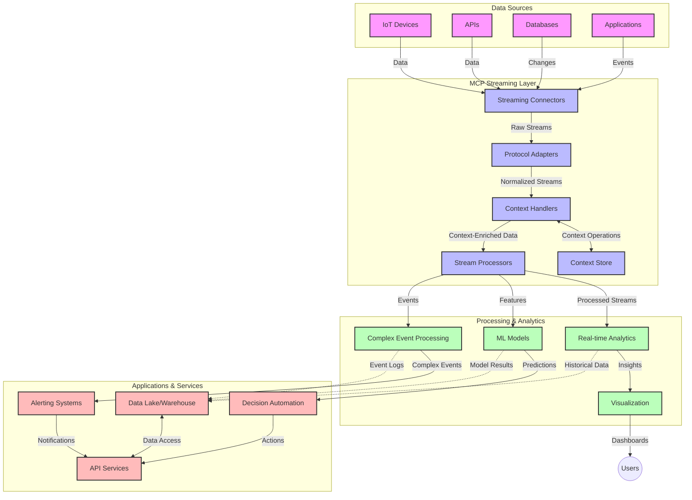

# Mudeli Konteksti Protokoll reaalajas andmevoogude jaoks

## Ülevaade

Reaalajas andmevoogude töötlemine on muutunud tänapäeva andmepõhises maailmas hädavajalikuks, kus ettevõtted ja rakendused vajavad kohest juurdepääsu teabele, et teha õigeaegseid otsuseid. Mudeli Konteksti Protokoll (MCP) tähistab olulist edasiminekut nende reaalajas voogude optimeerimisel, parandades andmetöötluse efektiivsust, säilitades konteksti terviklikkust ja tõstes süsteemi üldist jõudlust.

See moodul uurib, kuidas MCP muudab reaalajas andmevoogude töötlemist, pakkudes standardiseeritud lähenemist konteksti haldamiseks AI mudelite, voogedastusplatvormide ja rakenduste vahel.

## Sissejuhatus reaalajas andmevoogudesse

Reaalajas andmevoogude töötlemine on tehnoloogiline paradigma, mis võimaldab andmete pidevat edastamist, töötlemist ja analüüsi nende genereerimise ajal, võimaldades süsteemidel koheselt reageerida uuele teabele. Erinevalt traditsioonilisest partiitöötlusest, mis töötab staatiliste andmekogumitega, töödeldakse voogesituse käigus andmeid liikumise ajal, pakkudes teadmisi ja tegevusi minimaalse viivitusega.

### Reaalajas andmevoogude põhikontseptsioonid:

- **Pidev andmevoog**: Andmeid töödeldakse pideva, lõputu sündmuste või kirjete voona.
- **Madal latentsus**: Süsteemid on loodud minimeerima aega andmete genereerimise ja töötlemise vahel.
- **Mastaapsus**: Voogedastusarhitektuurid peavad toime tulema muutuva andmemahtude ja kiirusega.
- **Tõrketaluvus**: Süsteemid peavad olema vastupidavad rikete suhtes, et tagada katkematu andmevoog.
- **Oleku säilitamine**: Konteksti säilitamine sündmuste vahel on oluline tähendusliku analüüsi jaoks.

### Mudeli Konteksti Protokoll ja reaalajas voogedastus

Mudeli Konteksti Protokoll (MCP) lahendab mitmeid olulisi väljakutseid reaalajas voogedastuskeskkondades:

1. **Konteksti järjepidevus**: MCP standardiseerib, kuidas konteksti säilitatakse hajutatud voogedastuskomponentide vahel, tagades, et AI mudelitel ja töötlemissõlmedel on juurdepääs asjakohasele ajaloolisele ja keskkonna kontekstile.

2. **Tõhus oleku haldamine**: MCP pakub struktureeritud mehhanisme konteksti edastamiseks, vähendades voogedastustorustike oleku haldamise koormust.

3. **Interoperatiivsus**: MCP loob ühise keele konteksti jagamiseks erinevate voogedastustehnoloogiate ja AI mudelite vahel, võimaldades paindlikumaid ja laiendatavamaid arhitektuure.

4. **Voogedastusele optimeeritud kontekst**: MCP rakendused saavad prioriteerida, millised konteksti elemendid on reaalajas otsuste tegemiseks kõige olulisemad, optimeerides nii jõudlust kui ka täpsust.

5. **Kohanduv töötlemine**: MCP abil saavad voogedastussüsteemid dünaamiliselt kohandada töötlemist vastavalt andmete muutuvatele tingimustele ja mustritele.

Kaasaegsetes rakendustes, alates IoT sensorvõrkudest kuni finantstehingute platvormideni, võimaldab MCP integreerimine voogedastustehnoloogiatega intelligentsemat, kontekstitundlikku töötlemist, mis suudab keerukatele ja muutuvatele olukordadele reaalajas asjakohaselt reageerida.

## Õpieesmärgid

Selle õppetunni lõpuks suudate:

- Mõista reaalajas andmevoogude töötlemise põhitõdesid ja väljakutseid
- Selgitada, kuidas Mudeli Konteksti Protokoll (MCP) parandab reaalajas andmevoogude töötlemist
- Rakendada MCP-põhiseid voogedastuslahendusi populaarsete raamistikudega nagu Kafka ja Pulsar
- Kavandada ja juurutada tõrketaluvusega, suure jõudlusega voogedastusarhitektuure MCP abil
- Rakendada MCP kontseptsioone IoT, finantstehingute ja AI-põhiste analüütikate kasutusjuhtumites
- Hinnata MCP-põhiste voogedastustehnoloogiate arenevaid trende ja tulevikuinnovatsioone

### Definitsioon ja tähtsus

Reaalajas andmevoogude töötlemine hõlmab andmete pidevat genereerimist, töötlemist ja edastamist minimaalse latentsusega. Erinevalt partiitöötlusest, kus andmeid kogutakse ja töödeldakse gruppidena, töödeldakse voogedastusandmeid järk-järgult nende saabumisel, võimaldades koheseid teadmisi ja tegevusi.

Reaalajas andmevoogude töötlemise peamised omadused:

- **Madal latentsus**: Andmete töötlemine ja analüüs millisekundite kuni sekundite jooksul
- **Pidev voog**: Katkematud andmevood erinevatest allikatest
- **Kohene töötlemine**: Andmete analüüs nende saabumisel, mitte partiidena
- **Sündmuspõhine arhitektuur**: Reageerimine sündmustele nende toimumise ajal

### Traditsioonilise andmevoogude töötlemise väljakutsed

Traditsioonilised andmevoogude töötlemise lähenemised seisavad silmitsi mitmete piirangutega:

1. **Konteksti kadumine**: Raskused konteksti säilitamisel hajutatud süsteemides
2. **Mastaapsuse probleemid**: Väljakutsed suure mahu ja kiirusega andmete töötlemisel
3. **Integratsiooni keerukus**: Probleemid erinevate süsteemide koostalitlusvõimega
4. **Latentsuse haldamine**: Läbilaskevõime ja töötlemisaja tasakaalustamine
5. **Andmete järjepidevus**: Andmete täpsuse ja terviklikkuse tagamine voogude vahel

## Mudeli Konteksti Protokolli (MCP) mõistmine

### Mis on MCP?

Mudeli Konteksti Protokoll (MCP) on standardiseeritud suhtlusprotokoll, mis on loodud tõhusa suhtluse hõlbustamiseks AI mudelite ja rakenduste vahel. Reaalajas andmevoogude töötlemise kontekstis pakub MCP raamistikku:

- Konteksti säilitamiseks kogu andmetorustiku ulatuses
- Andmevahetusvormingute standardiseerimiseks
- Suurte andmekogumite edastamise optimeerimiseks
- Mudelitevahelise ja mudeli-rakenduse suhtluse parandamiseks

### Põhikomponendid ja arhitektuur

MCP arhitektuur reaalajas voogedastuse jaoks koosneb mitmest olulisest komponendist:

1. **Konteksti haldurid**: Haldavad ja säilitavad kontekstuaalset teavet voogedastustorustiku ulatuses
2. **Voogtöötlejad**: Töötlevad sisenevaid andmevooge kontekstitundlike tehnikatega
3. **Protokolli adapterid**: Konverteerivad erinevate voogedastusprotokollide vahel, säilitades konteksti
4. **Konteksti salvestus**: Säilitab ja hangib kontekstuaalset teavet tõhusalt
5. **Voogühendused**: Ühenduvad erinevate voogedastusplatvormidega (Kafka, Pulsar, Kinesis jne)



### Kuidas MCP parandab reaalajas andmete töötlemist

MCP lahendab traditsioonilisi voogedastuse väljakutseid järgmiselt:

- **Konteksti terviklikkus**: Säilitab andmepunktide vahelised seosed kogu torustiku ulatuses
- **Optimeeritud edastus**: Vähendab andmevahetuse üleliigsust intelligentse konteksti haldamise kaudu
- **Standardiseeritud liidesed**: Pakub voogedastuskomponentidele ühtseid API-sid
- **Vähendatud latentsus**: Minimeerib töötlemise koormust tõhusa konteksti haldamise kaudu
- **Parendatud mastaapsus**: Toetab horisontaalset mastaapsust, säilitades samal ajal konteksti

## Integreerimine ja rakendamine

Reaalajas andmevoogude töötlemise süsteemid nõuavad hoolikat arhitektuurilist kujundust ja rakendamist, et säilitada nii jõudlust kui ka konteksti terviklikkust. Mudeli Konteksti Protokoll pakub standardiseeritud lähenemist AI mudelite ja voogedastustehnoloogiate integreerimiseks, võimaldades keerukamaid, kontekstitundlikke töötlemistorustikke.

### MCP integreerimise ülevaade voogedastusarhitektuurides

MCP rakendamine reaalajas voogedastuskeskkondades hõlmab mitmeid olulisi kaalutlusi:

1. **Konteksti serialiseerimine ja transport**: MCP pakub tõhusaid mehhanisme kontekstuaalse teabe kodeerimiseks voogedastusandmepakettidesse, tagades, et oluline kontekst järgib andmeid kogu töötlemistorustiku ulatuses. See hõlmab standardiseeritud serialiseerimisvorminguid, mis on optimeeritud voogedastuse transpordiks.

2. **Olekuvoogude töötlemine**: MCP võimaldab intelligentsemat olekuvoogude töötlemist, säilitades töötlemissõlmede vahel järjepideva konteksti esitusviisi. See on eriti väärtuslik hajutatud voogedastusarhitektuurides, kus oleku haldamine on traditsiooniliselt keeruline.

3. **Sündmuse aeg vs töötlemise aeg**: MCP rakendused voogedastussüsteemides peavad tegelema tavapärase väljakutsega eristada, millal sündmused toimusid ja millal neid töödeldakse. Protokoll võib sisaldada ajalist konteksti, mis säilitab sündmuse aja semantika.

4. **Tagasivoolu haldamine**: Standardiseerides konteksti haldamist, aitab MCP voogedastussüsteemides tagasivoolu hallata, võimaldades komponentidel suhelda oma töötlemisvõimekust ja vastavalt voogu kohandada.

5. **Konteksti akende ja agregatsiooni haldamine**: MCP hõlbustab keerukamaid akende operatsioone, pakkudes struktureeritud esitusviise ajalistest ja relatsioonilistest kontekstidest, võimaldades tähenduslikumaid agregatsioone sündmuste voogude vahel.

6. **Täpselt üks kord töötlemine**: Voogedastussüsteemides, mis nõuavad täpselt üks kord semantikat, võib MCP sisaldada töötlemise metaandmeid, mis aitavad jälgida ja kinnitada töötlemise olekut hajutatud komponentide vahel.

MCP rakendamine erinevates voogedastustehnoloogiates loob ühtse lähenemise konteksti haldamiseks, vähendades vajadust kohandatud integratsioonikoodi järele ja parandades süsteemi võimet säilitada tähenduslikku konteksti, kui andmed voogedastustorustikus liiguvad.

### MCP erinevates voogedastusraamistikudes

Need näited järgivad praegust MCP spetsifikatsiooni, mis keskendub JSON-RPC-põhisele protokollile koos eristuvate transpordimehhanismidega. Kood näitab, kuidas saate rakendada kohandatud transpordimehhanisme, mis integreerivad voogedastusplatvorme nagu Kafka ja Pulsar, säilitades täieliku ühilduvuse MCP protokolliga.

Näited on loodud näitamaks, kuidas voogedastusplatvorme saab MCP-ga integreerida, et pakkuda reaalajas andmetöötlust, säilitades samal ajal MCP keskse kontekstitundlikkuse. See lähenemine tagab, et koodinäited kajastavad täpselt MCP spetsifikatsiooni praegust seisundit juuni 2025 seisuga.

MCP saab integreerida populaarsete voogedastusraamistikudega, sealhulgas:

#### Apache Kafka integreerimine

```python
import asyncio
import json
from typing import Dict, Any, Optional
from confluent_kafka import Consumer, Producer, KafkaError
from mcp.client import Client, ClientCapabilities
from mcp.core.message import JsonRpcMessage
from mcp.core.transports import Transport

# Custom transport class to bridge MCP with Kafka
class KafkaMCPTransport(Transport):
    def __init__(self, bootstrap_servers: str, input_topic: str, output_topic: str):
        self.bootstrap_servers = bootstrap_servers
        self.input_topic = input_topic
        self.output_topic = output_topic
        self.producer = Producer({'bootstrap.servers': bootstrap_servers})
        self.consumer = Consumer({
            'bootstrap.servers': bootstrap_servers,
            'group.id': 'mcp-client-group',
            'auto.offset.reset': 'earliest'
        })
        self.message_queue = asyncio.Queue()
        self.running = False
        self.consumer_task = None
        
    async def connect(self):
        """Connect to Kafka and start consuming messages"""
        self.consumer.subscribe([self.input_topic])
        self.running = True
        self.consumer_task = asyncio.create_task(self._consume_messages())
        return self
        
    async def _consume_messages(self):
        """Background task to consume messages from Kafka and queue them for processing"""
        while self.running:
            try:
                msg = self.consumer.poll(1.0)
                if msg is None:
                    await asyncio.sleep(0.1)
                    continue
                
                if msg.error():
                    if msg.error().code() == KafkaError._PARTITION_EOF:
                        continue
                    print(f"Consumer error: {msg.error()}")
                    continue
                
                # Parse the message value as JSON-RPC
                try:
                    message_str = msg.value().decode('utf-8')
                    message_data = json.loads(message_str)
                    mcp_message = JsonRpcMessage.from_dict(message_data)
                    await self.message_queue.put(mcp_message)
                except Exception as e:
                    print(f"Error parsing message: {e}")
            except Exception as e:
                print(f"Error in consumer loop: {e}")
                await asyncio.sleep(1)
    
    async def read(self) -> Optional[JsonRpcMessage]:
        """Read the next message from the queue"""
        try:
            message = await self.message_queue.get()
            return message
        except Exception as e:
            print(f"Error reading message: {e}")
            return None
    
    async def write(self, message: JsonRpcMessage) -> None:
        """Write a message to the Kafka output topic"""
        try:
            message_json = json.dumps(message.to_dict())
            self.producer.produce(
                self.output_topic,
                message_json.encode('utf-8'),
                callback=self._delivery_report
            )
            self.producer.poll(0)  # Trigger callbacks
        except Exception as e:
            print(f"Error writing message: {e}")
    
    def _delivery_report(self, err, msg):
        """Kafka producer delivery callback"""
        if err is not None:
            print(f'Message delivery failed: {err}')
        else:
            print(f'Message delivered to {msg.topic()} [{msg.partition()}]')
    
    async def close(self) -> None:
        """Close the transport"""
        self.running = False
        if self.consumer_task:
            self.consumer_task.cancel()
            try:
                await self.consumer_task
            except asyncio.CancelledError:
                pass
        self.consumer.close()
        self.producer.flush()

# Example usage of the Kafka MCP transport
async def kafka_mcp_example():
    # Create MCP client with Kafka transport
    client = Client(
        {"name": "kafka-mcp-client", "version": "1.0.0"},
        ClientCapabilities({})
    )
    
    # Create and connect the Kafka transport
    transport = KafkaMCPTransport(
        bootstrap_servers="localhost:9092",
        input_topic="mcp-responses",
        output_topic="mcp-requests"
    )
    
    await client.connect(transport)
    
    try:
        # Initialize the MCP session
        await client.initialize()
        
        # Example of executing a tool via MCP
        response = await client.execute_tool(
            "process_data",
            {
                "data": "sample data",
                "metadata": {
                    "source": "sensor-1",
                    "timestamp": "2025-06-12T10:30:00Z"
                }
            }
        )
        
        print(f"Tool execution response: {response}")
        
        # Clean shutdown
        await client.shutdown()
    finally:
        await transport.close()

# Run the example
if __name__ == "__main__":
    asyncio.run(kafka_mcp_example())
```

#### Apache Pulsar rakendamine

```python
import asyncio
import json
import pulsar
from typing import Dict, Any, Optional
from mcp.core.message import JsonRpcMessage
from mcp.core.transports import Transport
from mcp.server import Server, ServerOptions
from mcp.server.tools import Tool, ToolExecutionContext, ToolMetadata

# Create a custom MCP transport that uses Pulsar
class PulsarMCPTransport(Transport):
    def __init__(self, service_url: str, request_topic: str, response_topic: str):
        self.service_url = service_url
        self.request_topic = request_topic
        self.response_topic = response_topic
        self.client = pulsar.Client(service_url)
        self.producer = self.client.create_producer(response_topic)
        self.consumer = self.client.subscribe(
            request_topic,
            "mcp-server-subscription",
            consumer_type=pulsar.ConsumerType.Shared
        )
        self.message_queue = asyncio.Queue()
        self.running = False
        self.consumer_task = None
    
    async def connect(self):
        """Connect to Pulsar and start consuming messages"""
        self.running = True
        self.consumer_task = asyncio.create_task(self._consume_messages())
        return self
    
    async def _consume_messages(self):
        """Background task to consume messages from Pulsar and queue them for processing"""
        while self.running:
            try:
                # Non-blocking receive with timeout
                msg = self.consumer.receive(timeout_millis=500)
                
                # Process the message
                try:
                    message_str = msg.data().decode('utf-8')
                    message_data = json.loads(message_str)
                    mcp_message = JsonRpcMessage.from_dict(message_data)
                    await self.message_queue.put(mcp_message)
                    
                    # Acknowledge the message
                    self.consumer.acknowledge(msg)
                except Exception as e:
                    print(f"Error processing message: {e}")
                    # Negative acknowledge if there was an error
                    self.consumer.negative_acknowledge(msg)
            except Exception as e:
                # Handle timeout or other exceptions
                await asyncio.sleep(0.1)
    
    async def read(self) -> Optional[JsonRpcMessage]:
        """Read the next message from the queue"""
        try:
            message = await self.message_queue.get()
            return message
        except Exception as e:
            print(f"Error reading message: {e}")
            return None
    
    async def write(self, message: JsonRpcMessage) -> None:
        """Write a message to the Pulsar output topic"""
        try:
            message_json = json.dumps(message.to_dict())
            self.producer.send(message_json.encode('utf-8'))
        except Exception as e:
            print(f"Error writing message: {e}")
    
    async def close(self) -> None:
        """Close the transport"""
        self.running = False
        if self.consumer_task:
            self.consumer_task.cancel()
            try:
                await self.consumer_task
            except asyncio.CancelledError:
                pass
        self.consumer.close()
        self.producer.close()
        self.client.close()

# Define a sample MCP tool that processes streaming data
@Tool(
    name="process_streaming_data",
    description="Process streaming data with context preservation",
    metadata=ToolMetadata(
        required_capabilities=["streaming"]
    )
)
async def process_streaming_data(
    ctx: ToolExecutionContext,
    data: str,
    source: str,
    priority: str = "medium"
) -> Dict[str, Any]:
    """
    Process streaming data while preserving context
    
    Args:
        ctx: Tool execution context
        data: The data to process
        source: The source of the data
        priority: Priority level (low, medium, high)
        
    Returns:
        Dict containing processed results and context information
    """
    # Example processing that leverages MCP context
    print(f"Processing data from {source} with priority {priority}")
    
    # Access conversation context from MCP
    conversation_id = ctx.conversation_id if hasattr(ctx, 'conversation_id') else "unknown"
    
    # Return results with enhanced context
    return {
        "processed_data": f"Processed: {data}",
        "context": {
            "conversation_id": conversation_id,
            "source": source,
            "priority": priority,
            "processing_timestamp": ctx.get_current_time_iso()
        }
    }

# Example MCP server implementation using Pulsar transport
async def run_mcp_server_with_pulsar():
    # Create MCP server
    server = Server(
        {"name": "pulsar-mcp-server", "version": "1.0.0"},
        ServerOptions(
            capabilities={"streaming": True}
        )
    )
    
    # Register our tool
    server.register_tool(process_streaming_data)
    
    # Create and connect Pulsar transport
    transport = PulsarMCPTransport(
        service_url="pulsar://localhost:6650",
        request_topic="mcp-requests",
        response_topic="mcp-responses"
    )
    
    try:
        # Start the server with the Pulsar transport
        await server.run(transport)
    finally:
        await transport.close()

# Run the server
if __name__ == "__main__":
    asyncio.run(run_mcp_server_with_pulsar())
```

### Parimad praktikad juurutamiseks

MCP rakendamisel reaalajas voogedastuse jaoks:

1. **Kavandage tõrketaluvust**:
   - Rakendage korralik veakäsitlus
   - Kasutage ebaõnnestunud sõnumite jaoks "surnud kirjade järjekordi"
   - Kavandage idempotentsed töötlejad

2. **Optimeerige jõudlust**:
   - Konfigureerige sobivad puhvri suurused
   - Kasutage vajadusel partiitöötlust
   - Rakendage tagasivoolu mehhanisme

3. **Jälgige ja jälgige**:
   - Jälgige voogtöötluse mõõdikuid
   - Jälgige konteksti levikut
   - Seadistage anomaaliate jaoks hoiatused

4. **Turvalisus voogudele**:
   - Rakendage tundlike andmete krüpteerimist
   - Kasutage autentimist ja autoriseerimist
   - Rakendage sobivaid juurdepääsukontrolle

### MCP IoT-s ja servtöötluses

MCP täiustab IoT voogedastust järgmiselt:

- Säilitades seadme konteksti kogu töötlemistorustiku ulatuses
- Võimaldades tõhusat servast pilve andmevoogedastust
- Toetades reaalajas analüütikat IoT andmevoogudele
- Hõlbustades seadmetevahelist suhtlust kontekstiga

Näide: Nutika linna sensorvõrgud
```
Sensors → Edge Gateways → MCP Stream Processors → Real-time Analytics → Automated Responses
```

### Roll finantstehingutes ja kõrgsageduslikus kauplemises

MCP pakub olulisi eeliseid finantsandmete voogedastuses:

- Ülimadal latentsus kauplemisotsuste jaoks
- Tehingu konteksti säilitamine kogu töötlemise ulatuses
- Toetades keerukat sündmuste töötlemist kontekstitundlikkusega
- Tagades andmete järjepidevuse hajutatud kauplemissüsteemides

### AI-põhise andmeanalüütika täiustamine

MCP loob uusi võimalusi voogedastusanalüütikaks:

- Reaalajas mudelite treenimine ja järeldamine
- Pidev õppimine voogedastusandmetest
- Kontekstitundlik tunnuste ekstraheerimine
- Mitme mudeli järeldustorustikud säilitatud kontekstiga

## Tuleviku trendid ja innovatsioonid

### MCP areng reaalajas keskkondades

Tulevikku vaadates eeldatakse MCP arengut, et lahendada:

- **Kvantarvutuse integreerimine**: Valmistumine kvantpõhiste voogedastussüsteemide jaoks
- **Servapõhine töötlemine**: Rohkem kontekstitundlikku töötlemist servaseadmetes
- **Autonoomne voogedastuse haldamine**: Iseoptimeerivad voogedastustorustikud
- **Federatiivne voogedastus**: Hajutatud töötlemine, säilitades samal ajal privaatsuse

### Potentsiaalsed tehnoloogia edusammud

Tekkivad tehnoloogiad, mis kujundavad MCP voogedastuse tulevikku:

1. **AI-optimeeritud voogedastusprotokollid**: Kohandatud protokollid, mis on spetsiaalselt loodud AI töökoormuste jaoks
2. **Neuromorfse arvutuse integreerimine**: Aju inspireeritud arvutus voogtöötluseks
3. **Serverivaba voogedastus**: Sündmuspõhine, mastaapselt skaleeritav voogedastus ilma infrastruktuuri haldamiseta
4. **Hajutatud konteksti salvestus**: Globaalne hajutatud, kuid väga järjepidev konteksti haldamine

## Praktilised harjutused

### Harjutus 1: Põhilise MCP voogedastustorustiku seadistamine

Selles harjutuses õpite:
- Konfigureerima põhilist MCP voogedastuskeskkonda
- Rakendama konteksti haldureid voogtöötluseks
- Testima ja valideerima konteksti säilitamist

### Harjutus 2: Reaalajas analüütika juhtpaneeli loomine

Looge täielik rakendus, mis:
-

---

**Lahtiütlus**:  
See dokument on tõlgitud AI tõlketeenuse [Co-op Translator](https://github.com/Azure/co-op-translator) abil. Kuigi püüame tagada täpsust, palume arvestada, et automaatsed tõlked võivad sisaldada vigu või ebatäpsusi. Algne dokument selle algses keeles tuleks pidada autoriteetseks allikaks. Olulise teabe puhul soovitame kasutada professionaalset inimtõlget. Me ei vastuta selle tõlke kasutamisest tulenevate arusaamatuste või valesti tõlgenduste eest.