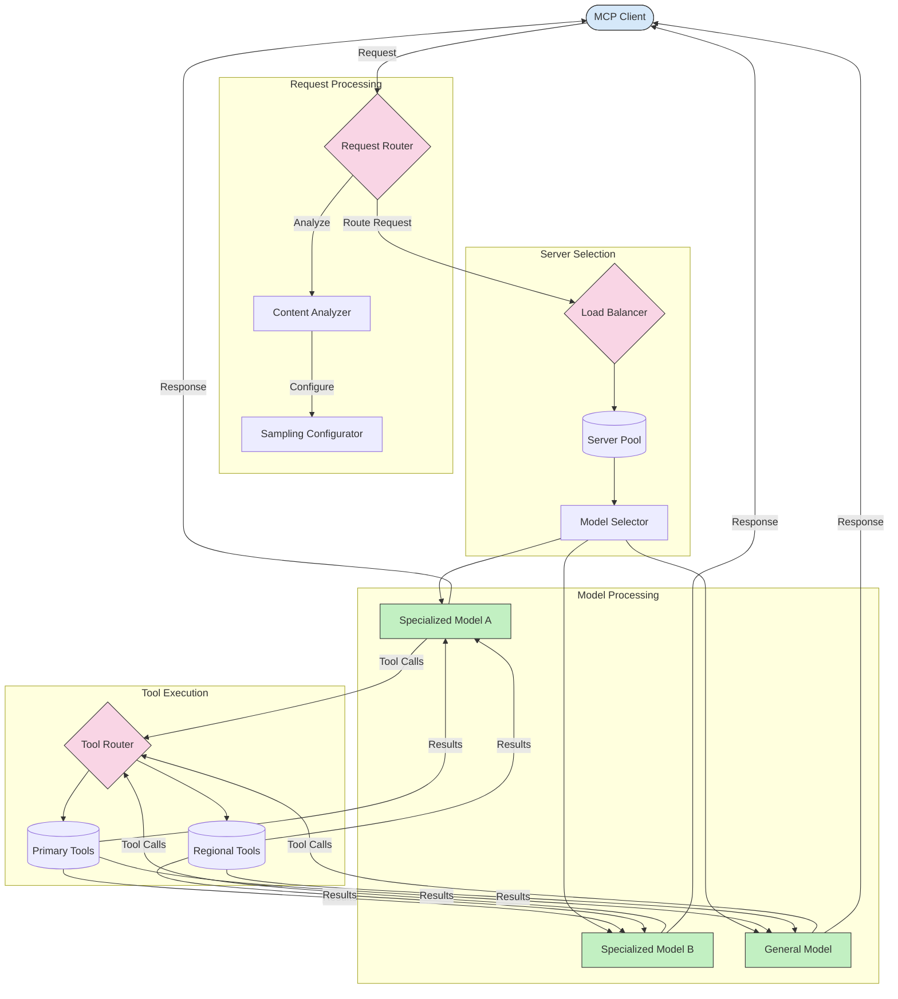

# Marsruutimine Model Context Protocolis

Marsruutimine on oluline, et suunata päringud MCP ökosüsteemis sobivatesse mudelitesse, tööriistadesse või teenustesse.

## Sissejuhatus

Marsruutimine Model Context Protocolis (MCP) hõlmab päringute suunamist kõige sobivamatesse mudelitesse või teenustesse, lähtudes erinevatest kriteeriumidest, nagu sisu tüüp, kasutaja kontekst ja süsteemi koormus. See tagab tõhusa töötlemise ja optimaalse ressursside kasutamise.

## Õpieesmärgid

Selle õppetunni lõpuks oskad:

- Mõista MCP marsruutimise põhimõtteid.
- Rakendada sisupõhist marsruutimist, et suunata päringud spetsialiseeritud teenustesse.
- Kasutada intelligentseid koormuse tasakaalustamise strateegiaid ressursside optimeerimiseks.
- Rakendada dünaamilist tööriistade marsruutimist päringu konteksti alusel.

## Sisupõhine marsruutimine

Sisupõhine marsruutimine suunab päringud spetsialiseeritud teenustesse, lähtudes päringu sisust. Näiteks koodigeneratsiooniga seotud päringud saab suunata spetsialiseeritud koodimudelisse, samas kui loova kirjutamise päringud saadetakse loova kirjutamise mudelisse.

Vaatame näidet erinevates programmeerimiskeeltes.

<details>
<summary>.NET</summary>

```csharp
// .NET Example: Content-based routing in MCP
public class ContentBasedRouter
{
    private readonly Dictionary<string, McpClient> _specializedClients;
    private readonly RoutingClassifier _classifier;
    
    public ContentBasedRouter()
    {
        // Initialize specialized clients for different domains
        _specializedClients = new Dictionary<string, McpClient>
        {
            ["code"] = new McpClient("https://code-specialized-mcp.com"),
            ["creative"] = new McpClient("https://creative-specialized-mcp.com"),
            ["scientific"] = new McpClient("https://scientific-specialized-mcp.com"),
            ["general"] = new McpClient("https://general-mcp.com")
        };
        
        // Initialize content classifier
        _classifier = new RoutingClassifier();
    }
    
    public async Task<McpResponse> RouteAndProcessAsync(string prompt, IDictionary<string, object> parameters = null)
    {
        // Classify the prompt to determine the best specialized service
        string category = await _classifier.ClassifyPromptAsync(prompt);
        
        // Get the appropriate client or fall back to general
        var client = _specializedClients.ContainsKey(category) 
            ? _specializedClients[category] 
            : _specializedClients["general"];
            
        Console.WriteLine($"Routing request to {category} specialized service");
        
        // Send request to the selected service
        return await client.SendPromptAsync(prompt, parameters);
    }
    
    // Simple classifier for routing decisions
    private class RoutingClassifier
    {
        public Task<string> ClassifyPromptAsync(string prompt)
        {
            prompt = prompt.ToLowerInvariant();
            
            if (prompt.Contains("code") || prompt.Contains("function") || 
                prompt.Contains("program") || prompt.Contains("algorithm"))
            {
                return Task.FromResult("code");
            }
            
            if (prompt.Contains("story") || prompt.Contains("creative") || 
                prompt.Contains("imagine") || prompt.Contains("design"))
            {
                return Task.FromResult("creative");
            }
            
            if (prompt.Contains("science") || prompt.Contains("research") || 
                prompt.Contains("analyze") || prompt.Contains("study"))
            {
                return Task.FromResult("scientific");
            }
            
            return Task.FromResult("general");
        }
    }
}
```

Eelnevas koodis oleme:

- Loonud `ContentBasedRouter` klassi, mis suunab päringud lähtudes päringu sisust.
- Initsialiseerinud spetsialiseeritud kliendid erinevate valdkondade jaoks (kood, loov, teaduslik, üldine).
- Rakendanud lihtsa klassifikaatori, mis määrab päringu kategooria ja suunab selle sobivasse spetsialiseeritud teenusesse.
- Kasutanud varumehhanismi, et suunata päringud üldisesse teenusesse, kui spetsialiseeritud teenus pole saadaval.
- Rakendanud asünkroonse töötlemise, et päringuid tõhusalt hallata.
- Kasutanud sõnastikku, et kaardistada sisukategooriad spetsialiseeritud MCP klientidele.
- Rakendanud lihtsa klassifikaatori, mis analüüsib päringut ja tagastab sobiva kategooria.
- Kasutanud spetsialiseeritud klienti päringu saatmiseks ja vastuse saamiseks.
- Käsitlenud juhtumeid, kus päring ei vasta ühelegi spetsialiseeritud kategooriale, suunates selle üldisesse teenusesse.

</details>

## Intelligentne koormuse tasakaalustamine

Koormuse tasakaalustamine optimeerib ressursside kasutamist ja tagab MCP teenuste kõrge saadavuse. Koormuse tasakaalustamist saab rakendada mitmel viisil, näiteks ringja jaotuse, kaalutud vastuseaja või sisuteadlike strateegiate abil.

Vaatame allpool näidet, mis kasutab järgmisi strateegiaid:

- **Ringja jaotus**: Jaotab päringud ühtlaselt saadaval olevate serverite vahel.
- **Kaalutud vastuseaeg**: Suunab päringud serveritesse, lähtudes nende keskmisest vastuseajast.
- **Sisuteadlik**: Suunab päringud spetsialiseeritud serveritesse, lähtudes päringu sisust.

<details>
<summary>Java</summary>

```java
// Java Example: Intelligent load balancing for MCP servers
public class McpLoadBalancer {
    private final List<McpServerNode> serverNodes;
    private final LoadBalancingStrategy strategy;
    
    public McpLoadBalancer(List<McpServerNode> nodes, LoadBalancingStrategy strategy) {
        this.serverNodes = new ArrayList<>(nodes);
        this.strategy = strategy;
    }
    
    public McpResponse processRequest(McpRequest request) {
        // Select the best server based on strategy
        McpServerNode selectedNode = strategy.selectNode(serverNodes, request);
        
        try {
            // Route the request to the selected node
            return selectedNode.processRequest(request);
        } catch (Exception e) {
            // Handle failure - implement retry or fallback logic
            System.err.println("Error processing request on node " + selectedNode.getId() + ": " + e.getMessage());
            
            // Mark node as potentially unhealthy
            selectedNode.recordFailure();
            
            // Try next best node as fallback
            List<McpServerNode> remainingNodes = new ArrayList<>(serverNodes);
            remainingNodes.remove(selectedNode);
            
            if (!remainingNodes.isEmpty()) {
                McpServerNode fallbackNode = strategy.selectNode(remainingNodes, request);
                return fallbackNode.processRequest(request);
            } else {
                throw new RuntimeException("All MCP server nodes failed to process the request");
            }
        }
    }
    
    // Node health check task
    public void startHealthChecks(Duration interval) {
        ScheduledExecutorService scheduler = Executors.newScheduledThreadPool(1);
        scheduler.scheduleAtFixedRate(() -> {
            for (McpServerNode node : serverNodes) {
                try {
                    boolean isHealthy = node.checkHealth();
                    System.out.println("Node " + node.getId() + " health status: " + 
                                      (isHealthy ? "HEALTHY" : "UNHEALTHY"));
                } catch (Exception e) {
                    System.err.println("Health check failed for node " + node.getId());
                    node.setHealthy(false);
                }
            }
        }, 0, interval.toMillis(), TimeUnit.MILLISECONDS);
    }
    
    // Interface for load balancing strategies
    public interface LoadBalancingStrategy {
        McpServerNode selectNode(List<McpServerNode> nodes, McpRequest request);
    }
    
    // Round-robin strategy
    public static class RoundRobinStrategy implements LoadBalancingStrategy {
        private AtomicInteger counter = new AtomicInteger(0);
        
        @Override
        public McpServerNode selectNode(List<McpServerNode> nodes, McpRequest request) {
            List<McpServerNode> healthyNodes = nodes.stream()
                .filter(McpServerNode::isHealthy)
                .collect(Collectors.toList());
            
            if (healthyNodes.isEmpty()) {
                throw new RuntimeException("No healthy nodes available");
            }
            
            int index = counter.getAndIncrement() % healthyNodes.size();
            return healthyNodes.get(index);
        }
    }
    
    // Weighted response time strategy
    public static class ResponseTimeStrategy implements LoadBalancingStrategy {
        @Override
        public McpServerNode selectNode(List<McpServerNode> nodes, McpRequest request) {
            return nodes.stream()
                .filter(McpServerNode::isHealthy)
                .min(Comparator.comparing(McpServerNode::getAverageResponseTime))
                .orElseThrow(() -> new RuntimeException("No healthy nodes available"));
        }
    }
    
    // Content-aware strategy
    public static class ContentAwareStrategy implements LoadBalancingStrategy {
        @Override
        public McpServerNode selectNode(List<McpServerNode> nodes, McpRequest request) {
            // Determine request characteristics
            boolean isCodeRequest = request.getPrompt().contains("code") || 
                                   request.getAllowedTools().contains("codeInterpreter");
            
            boolean isCreativeRequest = request.getPrompt().contains("creative") || 
                                       request.getPrompt().contains("story");
            
            // Find specialized nodes
            Optional<McpServerNode> specializedNode = nodes.stream()
                .filter(McpServerNode::isHealthy)
                .filter(node -> {
                    if (isCodeRequest && node.getSpecialization().equals("code")) {
                        return true;
                    }
                    if (isCreativeRequest && node.getSpecialization().equals("creative")) {
                        return true;
                    }
                    return false;
                })
                .findFirst();
            
            // Return specialized node or least loaded node
            return specializedNode.orElse(
                nodes.stream()
                    .filter(McpServerNode::isHealthy)
                    .min(Comparator.comparing(McpServerNode::getCurrentLoad))
                    .orElseThrow(() -> new RuntimeException("No healthy nodes available"))
            );
        }
    }
}
```

Eelnevas koodis oleme:

- Loonud `McpLoadBalancer` klassi, mis haldab MCP serveri sõlmede loendit ja suunab päringud valitud koormuse tasakaalustamise strateegia alusel.
- Rakendanud erinevaid koormuse tasakaalustamise strateegiaid: `RoundRobinStrategy`, `ResponseTimeStrategy` ja `ContentAwareStrategy`.
- Kasutanud `ScheduledExecutorService`-i, et perioodiliselt kontrollida serveri sõlmede tervist.
- Rakendanud tervisekontrolli mehhanismi, mis märgib sõlmed terveteks või mitteterveteks, lähtudes nende vastusest tervisekontrollidele.
- Käsitlenud päringute töötlemist veakäsitluse ja varumehhanismiga, et tagada kõrge saadavus.
- Kasutanud `McpServerNode` klassi, et esindada individuaalseid MCP serveri sõlmi, sealhulgas nende tervislikku seisundit, keskmist vastuseaega ja praegust koormust.
- Rakendanud `McpRequest` klassi, et kapseldada päringu üksikasjad, nagu sisend ja lubatud tööriistad.
- Kasutanud Java Streamsi, et filtreerida ja valida sõlmed, lähtudes tervislikust seisundist ja spetsialiseerumisest.

</details>

## Dünaamiline tööriistade marsruutimine

Tööriistade marsruutimine tagab, et tööriistakutsed suunatakse kõige sobivamasse teenusesse, lähtudes kontekstist. Näiteks võib ilmatööriista kutse vajada suunamist piirkondlikule lõpp-punktile, lähtudes kasutaja asukohast, või kalkulaatoritööriist võib vajada konkreetse API versiooni kasutamist.

Vaatame näidet, mis demonstreerib dünaamilist tööriistade marsruutimist, lähtudes päringu analüüsist, piirkondlikest lõpp-punktidest ja versioonitoest.

<details>
<summary>Python</summary>

```python
# Python Example: Dynamic tool routing based on request analysis
class McpToolRouter:
    def __init__(self):
        # Register available tool endpoints
        self.tool_endpoints = {
            "weatherTool": "https://weather-service.example.com/api",
            "calculatorTool": "https://calculator-service.example.com/compute",
            "databaseTool": "https://database-service.example.com/query",
            "searchTool": "https://search-service.example.com/search"
        }
        
        # Regional endpoints for global distribution
        self.regional_endpoints = {
            "us": {
                "weatherTool": "https://us-west.weather-service.example.com/api",
                "searchTool": "https://us.search-service.example.com/search"
            },
            "europe": {
                "weatherTool": "https://eu.weather-service.example.com/api",
                "searchTool": "https://eu.search-service.example.com/search"
            },
            "asia": {
                "weatherTool": "https://asia.weather-service.example.com/api",
                "searchTool": "https://asia.search-service.example.com/search"
            }
        }
        
        # Tool versioning support
        self.tool_versions = {
            "weatherTool": {
                "default": "v2",
                "v1": "https://weather-service.example.com/api/v1",
                "v2": "https://weather-service.example.com/api/v2",
                "beta": "https://weather-service.example.com/api/beta"
            }
        }
    
    async def route_tool_request(self, tool_name, parameters, user_context=None):
        """Route a tool request to the appropriate endpoint based on context"""
        endpoint = self._select_endpoint(tool_name, parameters, user_context)
        
        if not endpoint:
            raise ValueError(f"No endpoint available for tool: {tool_name}")
        
        # Perform the actual request to the selected endpoint
        return await self._execute_tool_request(endpoint, tool_name, parameters)
    
    def _select_endpoint(self, tool_name, parameters, user_context=None):
        """Select the most appropriate endpoint based on context"""
        # Base endpoint from registry
        if tool_name not in self.tool_endpoints:
            return None
            
        base_endpoint = self.tool_endpoints[tool_name]
        
        # Check if we need to use a specific tool version
        if tool_name in self.tool_versions:
            version_info = self.tool_versions[tool_name]
            
            # Use specified version or default
            requested_version = parameters.get("_version", version_info["default"])
            if requested_version in version_info:
                base_endpoint = version_info[requested_version]
        
        # Check for regional routing if user region is known
        if user_context and "region" in user_context:
            user_region = user_context["region"]
            
            if user_region in self.regional_endpoints:
                regional_tools = self.regional_endpoints[user_region]
                
                if tool_name in regional_tools:
                    # Use region-specific endpoint
                    return regional_tools[tool_name]
        
        # Check for data residency requirements
        if user_context and "data_residency" in user_context:
            # This would implement logic to ensure data remains in specified jurisdiction
            pass
        
        # Check for latency-based routing
        if user_context and "latency_sensitive" in user_context and user_context["latency_sensitive"]:
            # This would implement logic to select lowest-latency endpoint
            pass
            
        return base_endpoint
        
    async def _execute_tool_request(self, endpoint, tool_name, parameters):
        """Execute the actual tool request to the selected endpoint"""
        try:
            async with aiohttp.ClientSession() as session:
                async with session.post(
                    endpoint,
                    json={"toolName": tool_name, "parameters": parameters},
                    headers={"Content-Type": "application/json"}
                ) as response:
                    if response.status == 200:
                        result = await response.json()
                        return result
                    else:
                        error_text = await response.text()
                        raise Exception(f"Tool execution failed: {error_text}")
        except Exception as e:
            # Implement retry logic or fallback strategy
            print(f"Error executing tool {tool_name} at {endpoint}: {str(e)}")
            raise
```

Eelnevas koodis oleme:

- Loonud `McpToolRouter` klassi, mis haldab tööriistade marsruutimist, lähtudes päringu analüüsist, piirkondlikest lõpp-punktidest ja versioonitoest.
- Registreerinud saadaval olevad tööriistade lõpp-punktid ja piirkondlikud lõpp-punktid globaalseks jaotuseks.
- Rakendanud dünaamilise marsruutimise loogika, mis valib sobiva lõpp-punkti, lähtudes kasutaja kontekstist, nagu piirkond ja andmete säilitamise nõuded.
- Rakendanud tööriistade versioonitoe, mis võimaldab kasutajatel määrata, millist tööriista versiooni nad soovivad kasutada.
- Kasutanud asünkroonseid HTTP päringuid tööriistakutsete täitmiseks ja vastuste käsitlemiseks.

</details>

## MCP proovivõtu ja marsruutimise arhitektuur

Proovivõtt on Model Context Protocoli (MCP) oluline komponent, mis võimaldab tõhusat päringute töötlemist ja marsruutimist. See hõlmab sissetulevate päringute analüüsimist, et määrata kõige sobivam mudel või teenus nende käsitlemiseks, lähtudes erinevatest kriteeriumidest, nagu sisu tüüp, kasutaja kontekst ja süsteemi koormus.

Proovivõtu ja marsruutimise kombineerimine võimaldab luua tugeva arhitektuuri, mis optimeerib ressursside kasutamist ja tagab kõrge saadavuse. Proovivõtu protsessi saab kasutada päringute klassifitseerimiseks, samas kui marsruutimine suunab need sobivatesse mudelitesse või teenustesse.

Allolev diagramm illustreerib, kuidas proovivõtt ja marsruutimine töötavad koos terviklikus MCP arhitektuuris:



## Mis edasi

- [5.6 Proovivõtt](../mcp-sampling/README.md)

---

**Lahtiütlus**:  
See dokument on tõlgitud AI tõlketeenuse [Co-op Translator](https://github.com/Azure/co-op-translator) abil. Kuigi püüame tagada täpsust, palume arvestada, et automaatsed tõlked võivad sisaldada vigu või ebatäpsusi. Algne dokument selle algses keeles tuleks pidada autoriteetseks allikaks. Olulise teabe puhul soovitame kasutada professionaalset inimtõlget. Me ei vastuta selle tõlke kasutamisest tulenevate arusaamatuste või valesti tõlgenduste eest.