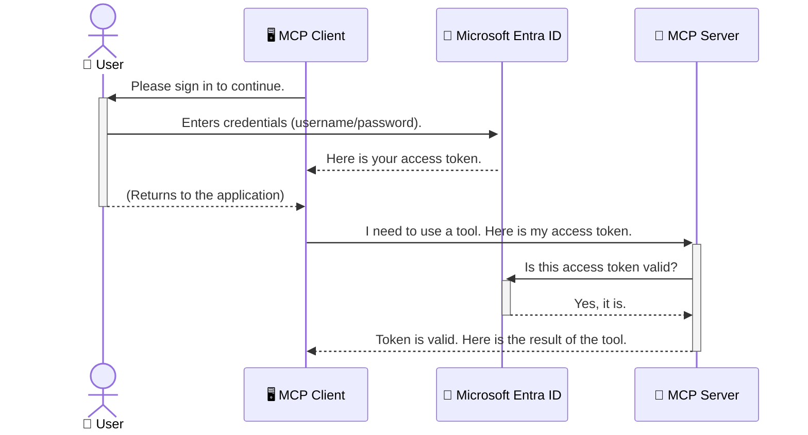

# AI Töövoogude Turvalisus: Entra ID autentimine mudeli kontekstiprotokolli serveritele

## Sissejuhatus
Mudeli kontekstiprotokolli (MCP) serveri turvalisus on sama oluline kui kodu välisukse lukustamine. MCP serveri avamine jätab teie tööriistad ja andmed volitamata juurdepääsule, mis võib viia turvarikkumisteni. Microsoft Entra ID pakub tugevat pilvepõhist identiteedi- ja juurdepääsuhaldust, aidates tagada, et ainult volitatud kasutajad ja rakendused saavad teie MCP serveriga suhelda. Selles jaotises õpite, kuidas kaitsta oma AI töövooge Entra ID autentimise abil.

## Õpieesmärgid
Selle jaotise lõpuks oskate:

- Mõista MCP serverite turvalisuse olulisust.
- Selgitada Microsoft Entra ID ja OAuth 2.0 autentimise põhimõtteid.
- Eristada avalikke ja konfidentsiaalseid kliente.
- Rakendada Entra ID autentimist nii kohalikes (avalik klient) kui ka kaugserveri (konfidentsiaalne klient) MCP serveri stsenaariumides.
- Rakendada turvalisuse parimaid tavasid AI töövoogude arendamisel.

## Turvalisus ja MCP

Nii nagu te ei jätaks oma kodu välisust lukustamata, ei tohiks te jätta oma MCP serverit kõigile kättesaadavaks. AI töövoogude turvalisus on hädavajalik, et luua usaldusväärseid ja ohutuid rakendusi. Selles peatükis tutvustatakse, kuidas kasutada Microsoft Entra ID-d MCP serverite turvamiseks, tagades, et ainult volitatud kasutajad ja rakendused saavad teie tööriistade ja andmetega suhelda.

## Miks MCP serverite turvalisus on oluline

Kujutage ette, et teie MCP serveril on tööriist, mis suudab saata e-kirju või pääseda juurde kliendi andmebaasile. Turvamata server tähendaks, et igaüks võiks potentsiaalselt seda tööriista kasutada, mis viiks volitamata andmete juurde pääsemiseni, rämpsposti saatmiseni või muude pahatahtlike tegevusteni.

Autentimise rakendamisega tagate, et iga serverile tehtud päring on kontrollitud, kinnitades päringu teinud kasutaja või rakenduse identiteeti. See on AI töövoogude turvalisuse esimene ja kõige olulisem samm.

## Tutvustus Microsoft Entra ID-le

[**Microsoft Entra ID**](https://adoption.microsoft.com/microsoft-security/entra/) on pilvepõhine identiteedi- ja juurdepääsuhaldusteenus. Mõelge sellele kui universaalsele turvamehele teie rakenduste jaoks. See haldab keerulist protsessi kasutajate identiteetide kontrollimiseks (autentimine) ja määrab, mida nad teha võivad (autorisatsioon).

Entra ID kasutamise eelised:

- Võimaldab turvalist sisselogimist kasutajatele.
- Kaitseb API-sid ja teenuseid.
- Haldab juurdepääsupoliitikaid ühest kohast.

MCP serverite jaoks pakub Entra ID tugevat ja laialdaselt usaldatud lahendust, et hallata, kes pääseb teie serveri funktsioonidele ligi.

---

## Kuidas Entra ID autentimine töötab

Entra ID kasutab avatud standardeid, nagu **OAuth 2.0**, autentimise haldamiseks. Kuigi detailid võivad olla keerulised, on põhimõte lihtne ja seda saab mõista analoogia abil.

### Lihtne sissejuhatus OAuth 2.0-le: Valetvõti

Mõelge OAuth 2.0-le nagu auto parkimisteenusele. Kui jõuate restorani, ei anna te parkimisteenindajale oma peavõtit. Selle asemel annate **valetvõtme**, millel on piiratud õigused—see saab autot käivitada ja uksi lukustada, kuid ei saa avada pagasiruumi ega kindalaegast.

Selles analoogias:

- **Teie** olete **kasutaja**.
- **Teie auto** on **MCP server** oma väärtuslike tööriistade ja andmetega.
- **Parkimisteenindaja** on **Microsoft Entra ID**.
- **Parkimiskorraldaja** on **MCP klient** (rakendus, mis üritab serverile ligi pääseda).
- **Valetvõti** on **juurdepääsutoken**.

Juurdepääsutoken on turvaline tekstistring, mille MCP klient saab Entra ID-lt pärast teie sisselogimist. Klient esitab selle tokeni MCP serverile iga päringuga. Server saab tokeni kontrollida, et veenduda päringu legitiimsuses ja kliendi õigustes, ilma et oleks vaja käsitleda teie tegelikke mandaate (näiteks parooli).

### Autentimise voog

Siin on protsessi praktiline toimimine:



### Microsoft Authentication Library (MSAL) tutvustus

Enne koodi juurde asumist on oluline tutvustada üht võtmekomponenti, mida näete näidetes: **Microsoft Authentication Library (MSAL)**.

MSAL on Microsofti poolt arendatud teek, mis muudab autentimise haldamise arendajatele palju lihtsamaks. Selle asemel, et kirjutada kogu keeruline kood turvatokenite haldamiseks, sisselogimisteks ja sessioonide värskendamiseks, teeb MSAL kogu raske töö ära.

MSAL-i kasutamise eelised:

- **Turvalisus:** See rakendab tööstusharu standardprotokolle ja turvalisuse parimaid tavasid, vähendades teie koodis haavatavuste riski.
- **Arendamise lihtsus:** See abstraheerib OAuth 2.0 ja OpenID Connect protokollide keerukuse, võimaldades lisada tugeva autentimise rakendusse vaid mõne koodirea abil.
- **Hooldatavus:** Microsoft hooldab ja uuendab MSAL-i aktiivselt, et lahendada uusi turvaohtusid ja platvormimuudatusi.

MSAL toetab mitmesuguseid keeli ja rakenduste raamistikke, sealhulgas .NET, JavaScript/TypeScript, Python, Java, Go ja mobiiliplatvorme nagu iOS ja Android. See tähendab, et saate kasutada samu järjepidevaid autentimismustreid kogu oma tehnoloogiapaketis.

MSAL-i kohta lisateabe saamiseks vaadake ametlikku [MSAL ülevaate dokumentatsiooni](https://learn.microsoft.com/entra/identity-platform/msal-overview).

---

## MCP serveri turvamine Entra ID-ga: Samm-sammuline juhend

Nüüd vaatame, kuidas turvata kohalik MCP server (mis suhtleb `stdio` kaudu) Entra ID abil. See näide kasutab **avalikku klienti**, mis sobib rakendustele, mis töötavad kasutaja arvutis, näiteks töölauarakendus või kohalik arendusserver.

### Stsenaarium 1: Kohaliku MCP serveri turvamine (avaliku kliendiga)

Selles stsenaariumis vaatame MCP serverit, mis töötab kohapeal, suhtleb `stdio` kaudu ja kasutab Entra ID-d kasutaja autentimiseks enne tööriistadele juurdepääsu lubamist. Serveril on üks tööriist, mis toob kasutaja profiiliandmed Microsoft Graph API-st.

#### 1. Rakenduse seadistamine Entra ID-s

Enne koodi kirjutamist peate registreerima oma rakenduse Microsoft Entra ID-s. See teavitab Entra ID-d teie rakendusest ja annab sellele loa kasutada autentimisteenust.

1. Minge **[Microsoft Entra portaali](https://entra.microsoft.com/)**.
2. Valige **Rakenduste registreerimine** ja klõpsake **Uus registreerimine**.
3. Andke oma rakendusele nimi (nt "Minu kohalik MCP server").
4. **Toetatud kontotüüpide** jaoks valige **Ainult selle organisatsiooni kataloogi kontod**.
5. **Ümbersuunamise URI** võib selle näite jaoks tühjaks jätta.
6. Klõpsake **Registreeri**.

Pärast registreerimist märkige üles **Rakenduse (kliendi) ID** ja **Kataloogi (rentniku) ID**. Neid on koodis vaja.

#### 2. Kood: Ülevaade

Vaatame autentimise haldamise koodi põhiosi. Selle näite täielik kood on saadaval [Entra ID - Kohalik - WAM](https://github.com/Azure-Samples/mcp-auth-servers/tree/main/src/entra-id-local-wam) kaustas [mcp-auth-servers GitHubi repos](https://github.com/Azure-Samples/mcp-auth-servers).

**`AuthenticationService.cs`**

See klass vastutab suhtluse eest Entra ID-ga.

- **`CreateAsync`**: See meetod initsialiseerib MSAL-i (Microsoft Authentication Library) `PublicClientApplication`. See on konfigureeritud teie rakenduse `clientId` ja `tenantId` abil.
- **`WithBroker`**: See võimaldab kasutada vahendajat (nagu Windows Web Account Manager), mis pakub turvalisemat ja sujuvamat ühekordset sisselogimiskogemust.
- **`AcquireTokenAsync`**: See on põhimeetod. See üritab esmalt saada tokeni vaikselt (kasutaja ei pea uuesti sisse logima, kui tal on juba kehtiv sessioon). Kui vaikset tokenit ei saa hankida, palub see kasutajal interaktiivselt sisse logida.

```csharp
// Simplified for clarity
public static async Task<AuthenticationService> CreateAsync(ILogger<AuthenticationService> logger)
{
    var msalClient = PublicClientApplicationBuilder
        .Create(_clientId) // Your Application (client) ID
        .WithAuthority(AadAuthorityAudience.AzureAdMyOrg)
        .WithTenantId(_tenantId) // Your Directory (tenant) ID
        .WithBroker(new BrokerOptions(BrokerOptions.OperatingSystems.Windows))
        .Build();

    // ... cache registration ...

    return new AuthenticationService(logger, msalClient);
}

public async Task<string> AcquireTokenAsync()
{
    try
    {
        // Try silent authentication first
        var accounts = await _msalClient.GetAccountsAsync();
        var account = accounts.FirstOrDefault();

        AuthenticationResult? result = null;

        if (account != null)
        {
            result = await _msalClient.AcquireTokenSilent(_scopes, account).ExecuteAsync();
        }
        else
        {
            // If no account, or silent fails, go interactive
            result = await _msalClient.AcquireTokenInteractive(_scopes).ExecuteAsync();
        }

        return result.AccessToken;
    }
    catch (Exception ex)
    {
        _logger.LogError(ex, "An error occurred while acquiring the token.");
        throw; // Optionally rethrow the exception for higher-level handling
    }
}
```

**`Program.cs`**

Siin seadistatakse MCP server ja integreeritakse autentimisteenus.

- **`AddSingleton<AuthenticationService>`**: See registreerib `AuthenticationService` sõltuvuste süstimise konteineris, et seda saaks kasutada rakenduse teistes osades (näiteks meie tööriistas).
- **`GetUserDetailsFromGraph` tööriist**: See tööriist vajab `AuthenticationService` eksemplari. Enne midagi tegemist kutsub see `authService.AcquireTokenAsync()`, et saada kehtiv juurdepääsutoken. Kui autentimine õnnestub, kasutab see tokenit Microsoft Graph API-le turvalise kõne tegemiseks ja kasutaja andmete hankimiseks.

```csharp
// Simplified for clarity
[McpServerTool(Name = "GetUserDetailsFromGraph")]
public static async Task<string> GetUserDetailsFromGraph(
    AuthenticationService authService)
{
    try
    {
        // This will trigger the authentication flow
        var accessToken = await authService.AcquireTokenAsync();

        // Use the token to create a GraphServiceClient
        var graphClient = new GraphServiceClient(
            new BaseBearerTokenAuthenticationProvider(new TokenProvider(authService)));

        var user = await graphClient.Me.GetAsync();

        return System.Text.Json.JsonSerializer.Serialize(user);
    }
    catch (Exception ex)
    {
        return $"Error: {ex.Message}";
    }
}
```

#### 3. Kuidas kõik koos töötab

1. Kui MCP klient üritab kasutada tööriista `GetUserDetailsFromGraph`, kutsub tööriist esmalt `AcquireTokenAsync`.
2. `AcquireTokenAsync` käivitab MSAL-i teegi, et kontrollida kehtivat tokenit.
3. Kui tokenit ei leita, palub MSAL vahendaja kaudu kasutajal sisse logida oma Entra ID kontoga.
4. Kui kasutaja logib sisse, väljastab Entra ID juurdepääsutokeni.
5. Tööriist saab tokeni ja kasutab seda Microsoft Graph API-le turvalise kõne tegemiseks.
6. Kasutaja andmed tagastatakse MCP kliendile.

See protsess tagab, et ainult autentitud kasutajad saavad tööriista kasutada, turvates tõhusalt teie kohaliku MCP serveri.

### Stsenaarium 2: Kaug-MCP serveri turvamine (konfidentsiaalse kliendiga)

Kui teie MCP server töötab kaugmasinas (näiteks pilveserveris) ja suhtleb protokolli kaudu nagu HTTP voogedastus, on turvanõuded erinevad. Sel juhul peaksite kasutama **konfidentsiaalset klienti** ja **Authorization Code Flow** meetodit. See on turvalisem meetod, kuna rakenduse saladusi ei avaldata kunagi brauserile.

See näide kasutab TypeScript-põhist MCP serverit, mis kasutab Express.js-i HTTP päringute haldamiseks.

#### 1. Rakenduse seadistamine Entra ID-s

Entra ID seadistus on sarnane avaliku kliendiga, kuid ühe olulise erinevusega: peate looma **kliendi saladuse**.

1. Minge **[Microsoft Entra portaali](https://entra.microsoft.com/)**.
2. Oma rakenduse registreerimisel minge vahekaardile **Sertifikaadid ja saladused**.
3. Klõpsake **Uus kliendi saladus**, andke sellele kirjeldus ja klõpsake **Lisa**.
4. **Oluline:** Kopeerige saladuse väärtus kohe. Te ei saa seda hiljem uuesti näha.
5. Peate konfigureerima ka **Ümbersuunamise URI**. Minge vahekaardile **Autentimine**, klõpsake **Lisa platvorm**, valige **Veeb** ja sisestage oma rakenduse ümbersuunamise URI (nt `http://localhost:3001/auth/callback`).

> **⚠️ Oluline turvanõuanne:** Tootmisrakenduste jaoks soovitab Microsoft tungivalt kasutada **saladusteta autentimismeetodeid**, nagu **Managed Identity** või **Workload Identity Federation**, kliendi saladuste asemel. Kliendi saladused kujutavad endast turvariske, kuna need võivad olla avatud või kompromiteeritud. Hallatud identiteedid pakuvad turvalisemat lähenemist, kõrvaldades vajaduse salvestada mandaate koodis või konfiguratsioonis.
>
> Lisateabe saamiseks hallatud identiteetide ja nende rakendamise kohta vaadake [Hallatud identiteetide ülevaadet Azure'i ressursside jaoks](https://learn.microsoft.com/entra/identity/managed-identities-azure-resources/overview).

#### 2. Kood: Ülevaade

See näide kasutab sessioonipõhist lähenemist. Kui kasutaja autentib, salvestab server juurdepääsu- ja värskendustokeni sessioonis ning annab kasutajale sessioonitokeni. Seda sessioonitokenit kasutatakse järgnevate päringute jaoks. Näite täielik kood on saadaval [Entra ID - Konfidentsiaalne klient](https://github.com/Azure-Samples/mcp-auth-servers/tree/main/src/entra-id-cca-session) kaustas [mcp-auth-servers GitHubi repos](https://github.com/Azure-Samples/mcp-auth-servers).

**`Server.ts`**

See fail seadistab Express serveri ja MCP transpordikihi.

- **`requireBearerAuth`**: See on vahevara, mis kaitseb `/sse` ja `/message` lõpp-punkte. See kontrollib päringu `Authorization` päises kehtivat tokenit.
- **`EntraIdServerAuthProvider`**: See on kohandatud klass, mis rakendab `McpServerAuthorizationProvider` liidest. See vastutab OAuth 2.0 voo haldamise eest.
- **`/auth/callback`**: See lõpp-punkt haldab Entra ID-st suunamist pärast kasutaja autentimist. See vahetab autoriseerimiskoodi juurdepääsu- ja värskendustokeni vastu.

```typescript
// Simplified for clarity
const app = express();
const { server } = createServer();
const provider = new EntraIdServerAuthProvider();

// Protect the SSE endpoint
app.get("/sse", requireBearerAuth({
  provider,
  requiredScopes: ["User.Read"]
}), async (req, res) => {
  // ... connect to the transport ...
});

// Protect the message endpoint
app.post("/message", requireBearerAuth({
  provider,
  requiredScopes: ["User.Read"]
}), async (req, res) => {
  // ... handle the message ...
});

// Handle the OAuth 2.0 callback
app.get("/auth/callback", (req, res) => {
  provider.handleCallback(req.query.code, req.query.state)
    .then(result => {
      // ... handle success or failure ...
    });
});
```

**`Tools.ts`**

See fail määratleb tööriistad, mida MCP server pakub. `getUserDetails` tööriist on sarnane eelmise näitega, kuid see saab juurdepääsutokeni sessioonist.

```typescript
// Simplified for clarity
server.setRequestHandler(CallToolRequestSchema, async (request) => {
  const { name } = request.params;
  const context = request.params?.context as { token?: string } | undefined;
  const sessionToken = context?.token;

  if (name === ToolName.GET_USER_DETAILS) {
    if (!sessionToken) {
      throw new AuthenticationError("Authentication token is missing or invalid. Ensure the token is provided in the request context.");
    }

    // Get the Entra ID token from the session store
    const tokenData = tokenStore.getToken(sessionToken);
    const entraIdToken = tokenData.accessToken;

    const graphClient = Client.init({
      authProvider: (done) => {
        done(null, entraIdToken);
      }
    });

    const user = await graphClient.api('/me').get();

    // ... return user details ...
  }
});
```

**`auth/EntraIdServerAuthProvider.ts`**

See klass haldab loogikat:

- Kasutaja suunamist Entra ID sisselogimislehele.
- Autoriseerimiskoodi vahetamist juurdepääsutokeni vastu.
- Tokenite salvestamist `tokenStore`-is.
- Juurdepääsutokeni värskendamist selle aegumisel.

#### 3. Kuidas kõik koos töötab

1. Kui kasutaja üritab esimest korda MCP serveriga ühendust luua, tuvastab `requireBearerAuth` vahevara, et tal pole kehtivat sessiooni, ja suunab ta Entra ID sisselogimislehele.
2. Kasutaja logib sisse oma Entra ID kontoga.  
3. Entra ID suunab kasutaja tagasi `/auth/callback` lõpp-punkti koos autoriseerimiskoodiga.  
4. Server vahetab koodi juurdepääsutokeni ja värskendustokeni vastu, salvestab need ning loob sessioonitokeni, mis saadetakse kliendile.  
5. Klient saab nüüd kasutada seda sessioonitokenit `Authorization` päises kõigi tulevaste päringute jaoks MCP serverile.  
6. Kui kutsutakse `getUserDetails` tööriista, kasutatakse sessioonitokenit Entra ID juurdepääsutokeni leidmiseks, millega tehakse päring Microsoft Graph API-le.  

See voog on keerukam kui avaliku kliendi voog, kuid vajalik interneti kaudu ligipääsetavate lõpp-punktide jaoks. Kuna kaug-MCP serverid on avaliku interneti kaudu kättesaadavad, vajavad nad tugevamaid turvameetmeid, et kaitsta volitamata juurdepääsu ja võimalike rünnakute eest.  

## Turvalisuse parimad praktikad  

- **Kasuta alati HTTPS-i**: Krüpteeri suhtlus kliendi ja serveri vahel, et kaitsta tokeneid pealtkuulamise eest.  
- **Rakenda rollipõhist juurdepääsukontrolli (RBAC)**: Ära kontrolli ainult seda, *kas* kasutaja on autentitud, vaid ka seda, *mida* tal on lubatud teha. Sa saad määratleda rolle Entra ID-s ja kontrollida neid oma MCP serveris.  
- **Monitoori ja auditeeri**: Logi kõik autentimissündmused, et tuvastada ja reageerida kahtlasele tegevusele.  
- **Käsitle päringute piiranguid ja throttlingut**: Microsoft Graph ja teised API-d rakendavad päringute piiranguid, et vältida kuritarvitamist. Rakenda MCP serveris eksponentsiaalset tagasipõrget ja uuesti proovimise loogikat, et käsitleda HTTP 429 (Liiga palju päringuid) vastuseid. Kaalu sageli ligipääsetava info vahemällu salvestamist, et vähendada API päringute arvu.  
- **Turvaline tokenite salvestamine**: Salvesta juurdepääsutokenid ja värskendustokenid turvaliselt. Kohalike rakenduste puhul kasuta süsteemi turvalisi salvestusmehhanisme. Serverirakenduste puhul kaalu krüpteeritud salvestust või turvalisi võtmehaldusteenuseid, nagu Azure Key Vault.  
- **Tokenite aegumise käsitlemine**: Juurdepääsutokenitel on piiratud eluiga. Rakenda automaatset tokenite värskendamist värskendustokenite abil, et tagada sujuv kasutajakogemus ilma uuesti autentimist nõudmata.  
- **Kaalu Azure API Managementi kasutamist**: Kuigi turvalisuse rakendamine otse MCP serveris annab sulle peenhäälestatud kontrolli, võivad API väravad, nagu Azure API Management, automaatselt käsitleda paljusid turvaprobleeme, sealhulgas autentimist, autoriseerimist, päringute piiranguid ja monitoorimist. Need pakuvad tsentraliseeritud turvakihti, mis asub klientide ja MCP serverite vahel. Lisateavet API väravate kasutamise kohta MCP-ga leiad meie [Azure API Management Your Auth Gateway For MCP Servers](https://techcommunity.microsoft.com/blog/integrationsonazureblog/azure-api-management-your-auth-gateway-for-mcp-servers/4402690).  

## Olulised punktid  

- MCP serveri turvalisus on oluline sinu andmete ja tööriistade kaitsmiseks.  
- Microsoft Entra ID pakub tugevat ja skaleeritavat lahendust autentimiseks ja autoriseerimiseks.  
- Kasuta **avalikku klienti** kohalike rakenduste jaoks ja **konfidentsiaalset klienti** kaugserverite jaoks.  
- **Autoriseerimiskoodi voog** on kõige turvalisem valik veebirakenduste jaoks.  

## Harjutus  

1. Mõtle MCP serverile, mida sa võiksid ehitada. Kas see oleks kohalik server või kaugserver?  
2. Lähtuvalt oma vastusest, kas sa kasutaksid avalikku või konfidentsiaalset klienti?  
3. Milliseid õigusi sinu MCP server küsiks, et teha toiminguid Microsoft Graphi vastu?  

## Praktilised harjutused  

### Harjutus 1: Rakenduse registreerimine Entra ID-s  
Liigu Microsoft Entra portaali.  
Registreeri uus rakendus oma MCP serveri jaoks.  
Salvesta rakenduse (kliendi) ID ja kataloogi (rentniku) ID.  

### Harjutus 2: Kohaliku MCP serveri turvalisus (avalik klient)  
- Järgi koodinäidet, et integreerida MSAL (Microsoft Authentication Library) kasutaja autentimiseks.  
- Testi autentimisvoogu, kutsudes MCP tööriista, mis toob kasutaja andmed Microsoft Graphist.  

### Harjutus 3: Kaug-MCP serveri turvalisus (konfidentsiaalne klient)  
- Registreeri konfidentsiaalne klient Entra ID-s ja loo kliendi saladus.  
- Konfigureeri oma Express.js MCP server kasutama autoriseerimiskoodi voogu.  
- Testi kaitstud lõpp-punkte ja kinnita tokenipõhine juurdepääs.  

### Harjutus 4: Rakenda turvalisuse parimad praktikad  
- Luba HTTPS oma kohaliku või kaugserveri jaoks.  
- Rakenda rollipõhist juurdepääsukontrolli (RBAC) oma serveri loogikas.  
- Lisa tokenite aegumise käsitlemine ja turvaline tokenite salvestamine.  

## Ressursid  

1. **MSAL Ülevaate dokumentatsioon**  
   Õpi, kuidas Microsoft Authentication Library (MSAL) võimaldab turvalist tokenite hankimist erinevatel platvormidel:  
   [MSAL Overview on Microsoft Learn](https://learn.microsoft.com/en-gb/entra/msal/overview)  

2. **Azure-Samples/mcp-auth-servers GitHubi repositoorium**  
   MCP serverite viiteimplementatsioonid, mis demonstreerivad autentimisvooge:  
   [Azure-Samples/mcp-auth-servers on GitHub](https://github.com/Azure-Samples/mcp-auth-servers)  

3. **Hallatavate identiteetide ülevaade Azure'i ressursside jaoks**  
   Saa aru, kuidas elimineerida saladusi, kasutades süsteemi- või kasutaja määratud hallatavaid identiteete:  
   [Managed Identities Overview on Microsoft Learn](https://learn.microsoft.com/en-us/entra/identity/managed-identities-azure-resources/)  

4. **Azure API Management: Sinu autentimisvärav MCP serverite jaoks**  
   Süvitsi ülevaade APIM-i kasutamisest turvalise OAuth2 väravana MCP serverite jaoks:  
   [Azure API Management Your Auth Gateway For MCP Servers](https://techcommunity.microsoft.com/blog/integrationsonazureblog/azure-api-management-your-auth-gateway-for-mcp-servers/4402690)  

5. **Microsoft Graphi õiguste viide**  
   Delegaatide ja rakenduste õiguste põhjalik loetelu Microsoft Graphi jaoks:  
   [Microsoft Graph Permissions Reference](https://learn.microsoft.com/zh-tw/graph/permissions-reference)  

## Õpitulemused  
Pärast selle jaotise läbimist suudad:  

- Selgitada, miks autentimine on MCP serverite ja AI töövoogude jaoks kriitiline.  
- Seadistada ja konfigureerida Entra ID autentimist nii kohalike kui ka kaug-MCP serveri stsenaariumide jaoks.  
- Valida sobiva klienditüübi (avalik või konfidentsiaalne) vastavalt serveri juurutusele.  
- Rakendada turvalise kodeerimise praktikaid, sealhulgas tokenite salvestamist ja rollipõhist autoriseerimist.  
- Kaitsta oma MCP serverit ja selle tööriistu volitamata juurdepääsu eest.  

## Mis edasi  

- [5.13 Mudeli konteksti protokolli (MCP) integreerimine Azure AI Foundryga](../mcp-foundry-agent-integration/README.md)  

---

**Lahtiütlus**:  
See dokument on tõlgitud AI tõlketeenuse [Co-op Translator](https://github.com/Azure/co-op-translator) abil. Kuigi püüame tagada täpsust, palume arvestada, et automaatsed tõlked võivad sisaldada vigu või ebatäpsusi. Algne dokument selle algses keeles tuleks pidada autoriteetseks allikaks. Olulise teabe puhul soovitame kasutada professionaalset inimtõlget. Me ei vastuta selle tõlke kasutamisest tulenevate arusaamatuste või valesti tõlgenduste eest.