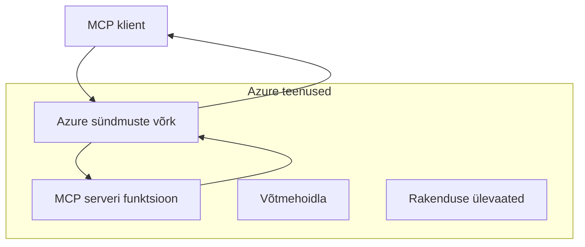
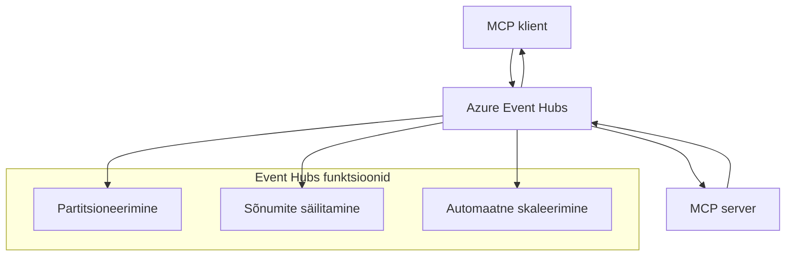

# MCP kohandatud transpordid - täiustatud rakendusjuhend

Model Context Protocol (MCP) pakub paindlikkust transpordimehhanismides, võimaldades kohandatud rakendusi spetsialiseeritud ettevõttekeskkondade jaoks. See täiustatud juhend uurib kohandatud transpordi rakendusi, kasutades praktiliste näidetena Azure Event Gridi ja Azure Event Hubsi, et luua skaleeritavaid, pilvepõhiseid MCP lahendusi.

## Sissejuhatus

Kuigi MCP standardtranspordid (stdio ja HTTP voogedastus) teenindavad enamiku kasutusjuhtudest, vajavad ettevõttekeskkonnad sageli spetsialiseeritud transpordimehhanisme parema skaleeritavuse, töökindluse ja olemasoleva pilveinfrastruktuuriga integreerimise jaoks. Kohandatud transpordid võimaldavad MCP-l kasutada pilvepõhiseid sõnumiteenuseid asünkroonseks suhtluseks, sündmuspõhiste arhitektuuride ja hajutatud töötlemise jaoks.

See õppetund uurib täiustatud transpordi rakendusi, mis põhinevad uusimal MCP spetsifikatsioonil (2025-11-25), Azure sõnumiteenustel ja kehtestatud ettevõtte integratsioonimustritel.

### **MCP transpordi arhitektuur**

**MCP spetsifikatsioonist (2025-11-25):**

- **Standardtranspordid**: stdio (soovitatav), HTTP voogedastus (kaugjuhtumite jaoks)
- **Kohandatud transpordid**: iga transpordimehhanism, mis rakendab MCP sõnumivahetusprotokolli
- **Sõnumi formaat**: JSON-RPC 2.0 koos MCP-spetsiifiliste laiendustega
- **Kahepoolsed suhtluskanalid**: täielik dupleks suhtlus vajalik teavituste ja vastuste jaoks

## Õpieesmärgid

Selle täiustatud õppetunni lõpuks oskad:

- **Mõista kohandatud transpordi nõudeid**: rakendada MCP protokolli mis tahes transpordikihi peal, säilitades vastavuse
- **Luua Azure Event Grid transpordilahendus**: ehitada sündmuspõhiseid MCP servereid serverivaba skaleeritavuse jaoks
- **Rakendada Azure Event Hubsi transporti**: kujundada kõrge läbilaskevõimega MCP lahendusi reaalajas voogedastuseks
- **Kasutada ettevõtte mustreid**: integreerida kohandatud transpordid olemasoleva Azure infrastruktuuri ja turvemudelitega
- **Käsitleda transpordi töökindlust**: rakendada sõnumite vastupidavust, järjekorda ja veahaldust ettevõtte stsenaariumides
- **Optimeerida jõudlust**: kujundada transpordilahendusi skaleeritavuse, latentsuse ja läbilaskevõime nõuete jaoks

## **Transpordi nõuded**

### **Põhinõuded MCP spetsifikatsioonist (2025-11-25):**

```yaml
Message Protocol:
  format: "JSON-RPC 2.0 with MCP extensions"
  bidirectional: "Full duplex communication required"
  ordering: "Message ordering must be preserved per session"
  
Transport Layer:
  reliability: "Transport MUST handle connection failures gracefully"
  security: "Transport MUST support secure communication"
  identification: "Each session MUST have unique identifier"
  
Custom Transport:
  compliance: "MUST implement complete MCP message exchange"
  extensibility: "MAY add transport-specific features"
  interoperability: "MUST maintain protocol compatibility"
```

## **Azure Event Grid transpordi rakendus**

Azure Event Grid pakub serverivaba sündmuste marsruutimise teenust, mis sobib ideaalselt sündmuspõhiste MCP arhitektuuride jaoks. See rakendus demonstreerib, kuidas ehitada skaleeritavaid, lahtiselt seotud MCP süsteeme.

### **Arhitektuuri ülevaade**


### **C# rakendus - Event Grid transport**

```csharp
using Azure.Messaging.EventGrid;
using Microsoft.Extensions.Azure;
using System.Text.Json;

public class EventGridMcpTransport : IMcpTransport
{
    private readonly EventGridPublisherClient _publisher;
    private readonly string _topicEndpoint;
    private readonly string _clientId;
    
    public EventGridMcpTransport(string topicEndpoint, string accessKey, string clientId)
    {
        _publisher = new EventGridPublisherClient(
            new Uri(topicEndpoint), 
            new AzureKeyCredential(accessKey));
        _topicEndpoint = topicEndpoint;
        _clientId = clientId;
    }
    
    public async Task SendMessageAsync(McpMessage message)
    {
        var eventGridEvent = new EventGridEvent(
            subject: $"mcp/{_clientId}",
            eventType: "MCP.MessageReceived",
            dataVersion: "1.0",
            data: JsonSerializer.Serialize(message))
        {
            Id = Guid.NewGuid().ToString(),
            EventTime = DateTimeOffset.UtcNow
        };
        
        await _publisher.SendEventAsync(eventGridEvent);
    }
    
    public async Task<McpMessage> ReceiveMessageAsync(CancellationToken cancellationToken)
    {
        // Event Grid is push-based, so implement webhook receiver
        // This would typically be handled by Azure Functions trigger
        throw new NotImplementedException("Use EventGridTrigger in Azure Functions");
    }
}

// Azure Function for receiving Event Grid events
[FunctionName("McpEventGridReceiver")]
public async Task<IActionResult> HandleEventGridMessage(
    [EventGridTrigger] EventGridEvent eventGridEvent,
    ILogger log)
{
    try
    {
        var mcpMessage = JsonSerializer.Deserialize<McpMessage>(
            eventGridEvent.Data.ToString());
        
        // Process MCP message
        var response = await _mcpServer.ProcessMessageAsync(mcpMessage);
        
        // Send response back via Event Grid
        await _transport.SendMessageAsync(response);
        
        return new OkResult();
    }
    catch (Exception ex)
    {
        log.LogError(ex, "Error processing Event Grid MCP message");
        return new BadRequestResult();
    }
}
```

### **TypeScript rakendus - Event Grid transport**

```typescript
import { EventGridPublisherClient, AzureKeyCredential } from "@azure/eventgrid";
import { McpTransport, McpMessage } from "./mcp-types";

export class EventGridMcpTransport implements McpTransport {
    private publisher: EventGridPublisherClient;
    private clientId: string;
    
    constructor(
        private topicEndpoint: string,
        private accessKey: string,
        clientId: string
    ) {
        this.publisher = new EventGridPublisherClient(
            topicEndpoint,
            new AzureKeyCredential(accessKey)
        );
        this.clientId = clientId;
    }
    
    async sendMessage(message: McpMessage): Promise<void> {
        const event = {
            id: crypto.randomUUID(),
            source: `mcp-client-${this.clientId}`,
            type: "MCP.MessageReceived",
            time: new Date(),
            data: message
        };
        
        await this.publisher.sendEvents([event]);
    }
    
    // Sündmuspõhine vastuvõtt Azure Functions kaudu
    onMessage(handler: (message: McpMessage) => Promise<void>): void {
        // Rakenduses kasutataks Azure Functions Event Grid käivitajat
        // See on kontseptuaalne liides webhooki vastuvõtjale
    }
}

// Azure Functions rakendus
import { app, InvocationContext, EventGridEvent } from "@azure/functions";

app.eventGrid("mcpEventGridHandler", {
    handler: async (event: EventGridEvent, context: InvocationContext) => {
        try {
            const mcpMessage = event.data as McpMessage;
            
            // Töötle MCP sõnumit
            const response = await mcpServer.processMessage(mcpMessage);
            
            // Saada vastus Event Gridi kaudu
            await transport.sendMessage(response);
            
        } catch (error) {
            context.error("Error processing MCP message:", error);
            throw error;
        }
    }
});
```

### **Python rakendus - Event Grid transport**

```python
from azure.eventgrid import EventGridPublisherClient, EventGridEvent
from azure.core.credentials import AzureKeyCredential
import asyncio
import json
from typing import Callable, Optional
import uuid
from datetime import datetime

class EventGridMcpTransport:
    def __init__(self, topic_endpoint: str, access_key: str, client_id: str):
        self.client = EventGridPublisherClient(
            topic_endpoint, 
            AzureKeyCredential(access_key)
        )
        self.client_id = client_id
        self.message_handler: Optional[Callable] = None
    
    async def send_message(self, message: dict) -> None:
        """Send MCP message via Event Grid"""
        event = EventGridEvent(
            data=message,
            subject=f"mcp/{self.client_id}",
            event_type="MCP.MessageReceived",
            data_version="1.0"
        )
        
        await self.client.send(event)
    
    def on_message(self, handler: Callable[[dict], None]) -> None:
        """Register message handler for incoming events"""
        self.message_handler = handler

# Azure Functionsi rakendus
import azure.functions as func
import logging

def main(event: func.EventGridEvent) -> None:
    """Azure Functions Event Grid trigger for MCP messages"""
    try:
        # Analüüsi MCP sõnum Event Gridi sündmusest
        mcp_message = json.loads(event.get_body().decode('utf-8'))
        
        # Töötle MCP sõnumit
        response = process_mcp_message(mcp_message)
        
        # Saada vastus tagasi Event Gridi kaudu
        # (Rakendus looks uue Event Gridi kliendi)
        
    except Exception as e:
        logging.error(f"Error processing MCP Event Grid message: {e}")
        raise
```

## **Azure Event Hubsi transpordi rakendus**

Azure Event Hubs pakub kõrge läbilaskevõimega, reaalajas voogedastuse võimalusi MCP stsenaariumide jaoks, mis nõuavad madalat latentsust ja suurt sõnumite mahtu.

### **Arhitektuuri ülevaade**


### **C# rakendus - Event Hubs transport**

```csharp
using Azure.Messaging.EventHubs;
using Azure.Messaging.EventHubs.Producer;
using Azure.Messaging.EventHubs.Consumer;
using System.Text;

public class EventHubsMcpTransport : IMcpTransport, IDisposable
{
    private readonly EventHubProducerClient _producer;
    private readonly EventHubConsumerClient _consumer;
    private readonly string _consumerGroup;
    private readonly CancellationTokenSource _cancellationTokenSource;
    
    public EventHubsMcpTransport(
        string connectionString, 
        string eventHubName,
        string consumerGroup = "$Default")
    {
        _producer = new EventHubProducerClient(connectionString, eventHubName);
        _consumer = new EventHubConsumerClient(
            consumerGroup, 
            connectionString, 
            eventHubName);
        _consumerGroup = consumerGroup;
        _cancellationTokenSource = new CancellationTokenSource();
    }
    
    public async Task SendMessageAsync(McpMessage message)
    {
        var messageBody = JsonSerializer.Serialize(message);
        var eventData = new EventData(Encoding.UTF8.GetBytes(messageBody));
        
        // Add MCP-specific properties
        eventData.Properties.Add("MessageType", message.Method ?? "response");
        eventData.Properties.Add("MessageId", message.Id);
        eventData.Properties.Add("Timestamp", DateTimeOffset.UtcNow);
        
        await _producer.SendAsync(new[] { eventData });
    }
    
    public async Task StartReceivingAsync(
        Func<McpMessage, Task> messageHandler)
    {
        await foreach (PartitionEvent partitionEvent in _consumer.ReadEventsAsync(
            _cancellationTokenSource.Token))
        {
            try
            {
                var messageBody = Encoding.UTF8.GetString(
                    partitionEvent.Data.EventBody.ToArray());
                var mcpMessage = JsonSerializer.Deserialize<McpMessage>(messageBody);
                
                await messageHandler(mcpMessage);
            }
            catch (Exception ex)
            {
                // Handle deserialization or processing errors
                Console.WriteLine($"Error processing message: {ex.Message}");
            }
        }
    }
    
    public void Dispose()
    {
        _cancellationTokenSource?.Cancel();
        _producer?.DisposeAsync().AsTask().Wait();
        _consumer?.DisposeAsync().AsTask().Wait();
        _cancellationTokenSource?.Dispose();
    }
}
```

### **TypeScript rakendus - Event Hubs transport**

```typescript
import { 
    EventHubProducerClient, 
    EventHubConsumerClient, 
    EventData 
} from "@azure/event-hubs";

export class EventHubsMcpTransport implements McpTransport {
    private producer: EventHubProducerClient;
    private consumer: EventHubConsumerClient;
    private isReceiving = false;
    
    constructor(
        private connectionString: string,
        private eventHubName: string,
        private consumerGroup: string = "$Default"
    ) {
        this.producer = new EventHubProducerClient(
            connectionString, 
            eventHubName
        );
        this.consumer = new EventHubConsumerClient(
            consumerGroup,
            connectionString,
            eventHubName
        );
    }
    
    async sendMessage(message: McpMessage): Promise<void> {
        const eventData: EventData = {
            body: JSON.stringify(message),
            properties: {
                messageType: message.method || "response",
                messageId: message.id,
                timestamp: new Date().toISOString()
            }
        };
        
        await this.producer.sendBatch([eventData]);
    }
    
    async startReceiving(
        messageHandler: (message: McpMessage) => Promise<void>
    ): Promise<void> {
        if (this.isReceiving) return;
        
        this.isReceiving = true;
        
        const subscription = this.consumer.subscribe({
            processEvents: async (events, context) => {
                for (const event of events) {
                    try {
                        const messageBody = event.body as string;
                        const mcpMessage: McpMessage = JSON.parse(messageBody);
                        
                        await messageHandler(mcpMessage);
                        
                        // Uuenda kontrollpunkti vähemalt-üks-kord kohaletoimetamiseks
                        await context.updateCheckpoint(event);
                    } catch (error) {
                        console.error("Error processing Event Hubs message:", error);
                    }
                }
            },
            processError: async (err, context) => {
                console.error("Event Hubs error:", err);
            }
        });
    }
    
    async close(): Promise<void> {
        this.isReceiving = false;
        await this.producer.close();
        await this.consumer.close();
    }
}
```

### **Python rakendus - Event Hubs transport**

```python
from azure.eventhub import EventHubProducerClient, EventHubConsumerClient
from azure.eventhub import EventData
import json
import asyncio
from typing import Callable, Dict, Any
import logging

class EventHubsMcpTransport:
    def __init__(
        self, 
        connection_string: str, 
        eventhub_name: str,
        consumer_group: str = "$Default"
    ):
        self.producer = EventHubProducerClient.from_connection_string(
            connection_string, 
            eventhub_name=eventhub_name
        )
        self.consumer = EventHubConsumerClient.from_connection_string(
            connection_string,
            consumer_group=consumer_group,
            eventhub_name=eventhub_name
        )
        self.is_receiving = False
    
    async def send_message(self, message: Dict[str, Any]) -> None:
        """Send MCP message via Event Hubs"""
        event_data = EventData(json.dumps(message))
        
        # Lisa MCP-spetsiifilised omadused
        event_data.properties = {
            "messageType": message.get("method", "response"),
            "messageId": message.get("id"),
            "timestamp": "2025-01-14T10:30:00Z"  # Kasuta tegelikku ajatemplit
        }
        
        async with self.producer:
            event_data_batch = await self.producer.create_batch()
            event_data_batch.add(event_data)
            await self.producer.send_batch(event_data_batch)
    
    async def start_receiving(
        self, 
        message_handler: Callable[[Dict[str, Any]], None]
    ) -> None:
        """Start receiving MCP messages from Event Hubs"""
        if self.is_receiving:
            return
        
        self.is_receiving = True
        
        async with self.consumer:
            await self.consumer.receive(
                on_event=self._on_event_received(message_handler),
                starting_position="-1"  # Alusta algusest
            )
    
    def _on_event_received(self, handler: Callable):
        """Internal event handler wrapper"""
        async def handle_event(partition_context, event):
            try:
                # Töötle MCP sõnum Event Hubs sündmusest
                message_body = event.body_as_str(encoding='UTF-8')
                mcp_message = json.loads(message_body)
                
                # Töötle MCP sõnumit
                await handler(mcp_message)
                
                # Uuenda kontrollpunkti vähemalt kordse kohaletoimetamise jaoks
                await partition_context.update_checkpoint(event)
                
            except Exception as e:
                logging.error(f"Error processing Event Hubs message: {e}")
        
        return handle_event
    
    async def close(self) -> None:
        """Clean up transport resources"""
        self.is_receiving = False
        await self.producer.close()
        await self.consumer.close()
```

## **Täiustatud transpordi mustrid**

### **Sõnumite vastupidavus ja töökindlus**

```csharp
// Implementing message durability with retry logic
public class ReliableTransportWrapper : IMcpTransport
{
    private readonly IMcpTransport _innerTransport;
    private readonly RetryPolicy _retryPolicy;
    
    public async Task SendMessageAsync(McpMessage message)
    {
        await _retryPolicy.ExecuteAsync(async () =>
        {
            try
            {
                await _innerTransport.SendMessageAsync(message);
            }
            catch (TransportException ex) when (ex.IsRetryable)
            {
                // Log and retry
                throw;
            }
        });
    }
}
```

### **Transpordi turvaintegratsioon**

```csharp
// Integrating Azure Key Vault for transport security
public class SecureTransportFactory
{
    private readonly SecretClient _keyVaultClient;
    
    public async Task<IMcpTransport> CreateEventGridTransportAsync()
    {
        var accessKey = await _keyVaultClient.GetSecretAsync("EventGridAccessKey");
        var topicEndpoint = await _keyVaultClient.GetSecretAsync("EventGridTopic");
        
        return new EventGridMcpTransport(
            topicEndpoint.Value.Value,
            accessKey.Value.Value,
            Environment.MachineName
        );
    }
}
```

### **Transpordi jälgimine ja nähtavus**

```csharp
// Adding telemetry to custom transports
public class ObservableTransport : IMcpTransport
{
    private readonly IMcpTransport _transport;
    private readonly ILogger _logger;
    private readonly TelemetryClient _telemetryClient;
    
    public async Task SendMessageAsync(McpMessage message)
    {
        using var activity = Activity.StartActivity("MCP.Transport.Send");
        activity?.SetTag("transport.type", "EventGrid");
        activity?.SetTag("message.method", message.Method);
        
        var stopwatch = Stopwatch.StartNew();
        
        try
        {
            await _transport.SendMessageAsync(message);
            
            _telemetryClient.TrackDependency(
                "EventGrid",
                "SendMessage",
                DateTime.UtcNow.Subtract(stopwatch.Elapsed),
                stopwatch.Elapsed,
                true
            );
        }
        catch (Exception ex)
        {
            _telemetryClient.TrackException(ex);
            throw;
        }
    }
}
```

## **Ettevõtte integratsiooni stsenaariumid**

### **Stsenaarium 1: hajutatud MCP töötlemine**

Azure Event Gridi kasutamine MCP päringute jaotamiseks mitme töötlemissõlme vahel:

```yaml
Architecture:
  - MCP Client sends requests to Event Grid topic
  - Multiple Azure Functions subscribe to process different tool types
  - Results aggregated and returned via separate response topic
  
Benefits:
  - Horizontal scaling based on message volume
  - Fault tolerance through redundant processors
  - Cost optimization with serverless compute
```

### **Stsenaarium 2: reaalajas MCP voogedastus**

Azure Event Hubsi kasutamine kõrgsageduslike MCP interaktsioonide jaoks:

```yaml
Architecture:
  - MCP Client streams continuous requests via Event Hubs
  - Stream Analytics processes and routes messages
  - Multiple consumers handle different aspect of processing
  
Benefits:
  - Low latency for real-time scenarios
  - High throughput for batch processing
  - Built-in partitioning for parallel processing
```

### **Stsenaarium 3: hübriidne transpordi arhitektuur**

Mitme transpordi kombineerimine erinevate kasutusjuhtude jaoks:

```csharp
public class HybridMcpTransport : IMcpTransport
{
    private readonly IMcpTransport _realtimeTransport; // Event Hubs
    private readonly IMcpTransport _batchTransport;    // Event Grid
    private readonly IMcpTransport _fallbackTransport; // HTTP Streaming
    
    public async Task SendMessageAsync(McpMessage message)
    {
        // Route based on message characteristics
        var transport = message.Method switch
        {
            "tools/call" when IsRealtime(message) => _realtimeTransport,
            "resources/read" when IsBatch(message) => _batchTransport,
            _ => _fallbackTransport
        };
        
        await transport.SendMessageAsync(message);
    }
}
```

## **Jõudluse optimeerimine**

### **Sõnumite grupeerimine Event Gridi jaoks**

```csharp
public class BatchingEventGridTransport : IMcpTransport
{
    private readonly List<McpMessage> _messageBuffer = new();
    private readonly Timer _flushTimer;
    private const int MaxBatchSize = 100;
    
    public async Task SendMessageAsync(McpMessage message)
    {
        lock (_messageBuffer)
        {
            _messageBuffer.Add(message);
            
            if (_messageBuffer.Count >= MaxBatchSize)
            {
                _ = Task.Run(FlushMessages);
            }
        }
    }
    
    private async Task FlushMessages()
    {
        List<McpMessage> toSend;
        lock (_messageBuffer)
        {
            toSend = new List<McpMessage>(_messageBuffer);
            _messageBuffer.Clear();
        }
        
        if (toSend.Any())
        {
            var events = toSend.Select(CreateEventGridEvent);
            await _publisher.SendEventsAsync(events);
        }
    }
}
```

### **Partitsioneerimisstrateegia Event Hubsi jaoks**

```csharp
public class PartitionedEventHubsTransport : IMcpTransport
{
    public async Task SendMessageAsync(McpMessage message)
    {
        // Partition by client ID for session affinity
        var partitionKey = ExtractClientId(message);
        
        var eventData = new EventData(JsonSerializer.SerializeToUtf8Bytes(message))
        {
            PartitionKey = partitionKey
        };
        
        await _producer.SendAsync(new[] { eventData });
    }
}
```

## **Kohandatud transpordide testimine**

### **Ühiktestimine testtopeltidega**

```csharp
[Test]
public async Task EventGridTransport_SendMessage_PublishesCorrectEvent()
{
    // Arrange
    var mockPublisher = new Mock<EventGridPublisherClient>();
    var transport = new EventGridMcpTransport(mockPublisher.Object);
    var message = new McpMessage { Method = "tools/list", Id = "test-123" };
    
    // Act
    await transport.SendMessageAsync(message);
    
    // Assert
    mockPublisher.Verify(
        x => x.SendEventAsync(
            It.Is<EventGridEvent>(e => 
                e.EventType == "MCP.MessageReceived" &&
                e.Subject == "mcp/test-client"
            )
        ),
        Times.Once
    );
}
```

### **Integratsioonitestimine Azure Test Containersiga**

```csharp
[Test]
public async Task EventHubsTransport_IntegrationTest()
{
    // Using Testcontainers for integration testing
    var eventHubsContainer = new EventHubsContainer()
        .WithEventHub("test-hub");
    
    await eventHubsContainer.StartAsync();
    
    var transport = new EventHubsMcpTransport(
        eventHubsContainer.GetConnectionString(),
        "test-hub"
    );
    
    // Test message round-trip
    var sentMessage = new McpMessage { Method = "test", Id = "123" };
    McpMessage receivedMessage = null;
    
    await transport.StartReceivingAsync(msg => {
        receivedMessage = msg;
        return Task.CompletedTask;
    });
    
    await transport.SendMessageAsync(sentMessage);
    await Task.Delay(1000); // Allow for message processing
    
    Assert.That(receivedMessage?.Id, Is.EqualTo("123"));
}
```

## **Parimad tavad ja juhised**

### **Transpordi disaini põhimõtted**

1. **Idempotentsus**: tagada sõnumite töötlemise idempotentsus duplikaatide käsitlemiseks
2. **Vea käsitlemine**: rakendada põhjalik veahaldus ja surnud kirjade järjekorrad
3. **Jälgimine**: lisada detailne telemeetria ja tervisekontrollid
4. **Turvalisus**: kasutada hallatavaid identiteete ja minimaalset ligipääsu
5. **Jõudlus**: kujundada vastavalt konkreetsetele latentsuse ja läbilaskevõime nõuetele

### **Azure-spetsiifilised soovitused**

1. **Kasuta hallatavat identiteeti**: väldi ühendusstringe tootmiskeskkonnas
2. **Rakenda vooluahela katkestajaid**: kaitse Azure teenuste katkestuste eest
3. **Jälgi kulusid**: jälgi sõnumite mahtu ja töötlemiskulusid
4. **Plaani skaleerimist**: kujunda partitsioneerimise ja skaleerimise strateegiad varakult
5. **Testi põhjalikult**: kasuta Azure DevTest Labi põhjalikuks testimiseks

## **Kokkuvõte**

Kohandatud MCP transpordid võimaldavad võimsaid ettevõtte stsenaariume, kasutades Azure sõnumiteenuseid. Rakendades Event Gridi või Event Hubsi transpordid, saad luua skaleeritavaid, töökindlaid MCP lahendusi, mis integreeruvad sujuvalt olemasoleva Azure infrastruktuuriga.

Esitatud näited demonstreerivad tootmiseks valmis mustreid kohandatud transpordide rakendamiseks, säilitades MCP protokolli vastavuse ja Azure parimad tavad.

## **Täiendavad ressursid**

- [MCP spetsifikatsioon 2025-06-18](https://spec.modelcontextprotocol.io/specification/2025-06-18/)
- [Azure Event Grid dokumentatsioon](https://docs.microsoft.com/azure/event-grid/)
- [Azure Event Hubs dokumentatsioon](https://docs.microsoft.com/azure/event-hubs/)
- [Azure Functions Event Grid käivitaja](https://docs.microsoft.com/azure/azure-functions/functions-bindings-event-grid)
- [Azure SDK .NET jaoks](https://github.com/Azure/azure-sdk-for-net)
- [Azure SDK TypeScripti jaoks](https://github.com/Azure/azure-sdk-for-js)
- [Azure SDK Python jaoks](https://github.com/Azure/azure-sdk-for-python)

---

> *See juhend keskendub praktilistele rakendusmustritele tootmiskeskkonna MCP süsteemide jaoks. Kontrolli alati transpordi rakendusi vastavalt oma konkreetsetele nõuetele ja Azure teenuste piirangutele.*
> **Kehtiv standard**: see juhend kajastab [MCP spetsifikatsiooni 2025-06-18](https://spec.modelcontextprotocol.io/specification/2025-06-18/) transpordinõudeid ja täiustatud transpordimustreid ettevõttekeskkondade jaoks.


## Mis järgmiseks
- [6. Kogukonna panused](../../06-CommunityContributions/README.md)

---

<!-- CO-OP TRANSLATOR DISCLAIMER START -->
**Vastutusest loobumine**:
See dokument on tõlgitud kasutades tehisintellektil põhinevat tõlketeenust [Co-op Translator](https://github.com/Azure/co-op-translator). Kuigi püüame tagada täpsust, palun arvestage, et automaatsed tõlked võivad sisaldada vigu või ebatäpsusi. Originaaldokument selle emakeeles tuleks pidada autoriteetseks allikaks. Olulise teabe puhul soovitatakse kasutada professionaalset inimtõlget. Me ei vastuta selle tõlke kasutamisest tulenevate arusaamatuste või valesti mõistmiste eest.
<!-- CO-OP TRANSLATOR DISCLAIMER END -->