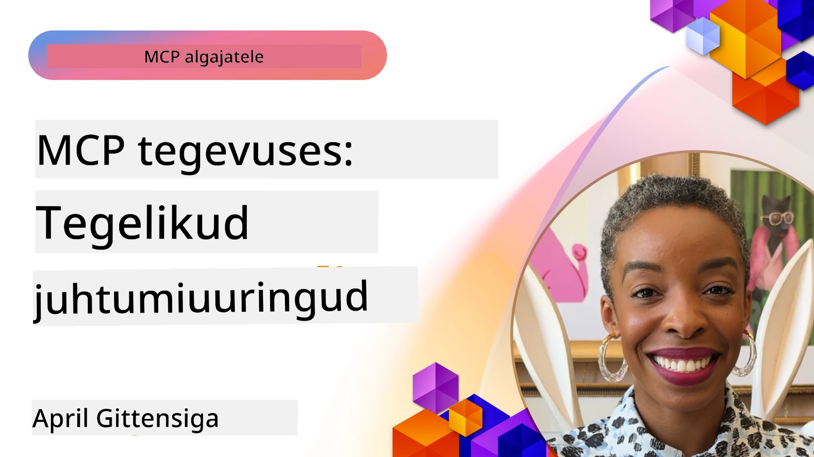

# MCP tegevuses: tegelike juhtumiuuringute näited

_(Klõpsa ülaloleval pildil, et vaadata selle õppetunni videot)_

Mudeli konteksti protokoll (MCP) muudab seda, kuidas tehisintellekti rakendused suhtlevad andmete, tööriistade ja teenustega. Selles osas esitletakse tegelike juhtumiuuringute näiteid, mis demonstreerivad MCP praktilisi rakendusi erinevates ettevõttesisestes olukordades.

## Ülevaade

See osa tutvustab MCP rakenduste konkreetseid näiteid, rõhutades, kuidas organisatsioonid kasutavad seda protokolli keeruliste äriprobleemide lahendamiseks. Nende juhtumiuuringute uurimisega saate ülevaate MCP mitmekülgsusest, skaleeritavusest ja praktilistest eelistest reaalses elus.

## Peamised õppimise eesmärgid

Nende juhtumiuuringute uurimisel saate:

- Mõista, kuidas MCP-d saab rakendada konkreetsete äriprobleemide lahendamiseks
- Tutvuda erinevate integratsioonimustrite ja arhitektuuriliste lähenemistega
- Tuvastada parimaid tavasid MCP rakendamiseks ettevõtte keskkondades
- Saada ülevaate MCP praktiliste rakenduste raskustest ja lahendustest
- Tuvastada võimalusi sarnaste mustrite rakendamiseks oma projektides

## Esile toodud juhtumiuuringud

### 1. [Azure AI reisibüroo agendid – viitenäide](./travelagentsample.md)

See juhtumiuuring vaatleb Microsofti põhjalikku viitenäidet, mis demonstreerib, kuidas MCP, Azure OpenAI ja Azure AI Search abil luua mitme agendi ja tehisintellektiga reisiplaneerimise rakendus. Projekt näitab:

- Mitme agendi orkestreerimist MCP kaudu
- Ettevõtte andmete integratsiooni Azure AI Search abil
- Turvalist, skaleeritavat arhitektuuri Azure teenustega
- Laiendatavaid tööriistu korduvkasutatavate MCP komponentidega
- Vestlusliidest, mida jõustab Azure OpenAI

Arhitektuuri ja rakenduse üksikasjad annavad väärtuslikke teadmisi keerukate mitme agenti süsteemide ehitamisest MCP koordineerimiskihina.

### 2. [Azure DevOpsi üksuste uuendamine YouTube andmetega](./UpdateADOItemsFromYT.md)

See juhtumiuuring demonstreerib MCP praktilist kasutust töövoogude automatiseerimiseks. Selgitatakse, kuidas MCP tööriistu saab kasutada:

- Andmete hankimiseks veebiplatvormidelt (YouTube)
- Tööülesannete uuendamiseks Azure DevOpsi süsteemides
- Automatiseeritud töövoogude loomiseks, mida saab korduvalt kasutada
- Andmete integreerimiseks erinevate süsteemide vahel

See näide illustreerib, kuidas isegi suhteliselt lihtsad MCP rakendused võivad oluliselt efektiivsust parandada, automatiseerides rutiinseid ülesandeid ja parandades andmete järjepidevust süsteemide vahel.

### 3. [Reaalajas dokumentatsiooni päring MCP-ga](./docs-mcp/README.md)

See juhtumiuuring juhendab teid, kuidas ühendada Python konsooliklient MCP serveriga, et pärida ja logida reaalajas, kontekstitundlikku Microsofti dokumentatsiooni. Õpite:

- MCP serveriga ühenduse loomist Python kliendi ja ametliku MCP SDK abil
- Andmete tõhusa ja reaalajas hankimise jaoks voogedastusega HTTP klientide kasutamist
- Dokumentatsioonitööriistade kutsumist serveris ja vastuste logimist otse konsooli
- Microsofti ajakohase dokumentatsiooni integreerimist oma töövoogu ilma terminalist lahkumata

Peatükk sisaldab praktilist ülesannet, minimaalset töötavat koodinäidet ja lingid lisamaterjalidele sügavama õppe jaoks. Vaadake kogu juhendit ja koodi lingitud peatükis, et mõista, kuidas MCP võib muuta dokumentatsioonile ligipääsu ja arendaja tootlikkust konsooli keskkonnas.

### 4. [Interaktiivne õppekavu genereeriv veebirakendus MCP-ga](./docs-mcp/README.md)

See juhtumiuuring näitab, kuidas ehitada Chainlit ja MCP abil interaktiivne veebirakendus, mis genereerib isikupärastatud õppekavasid ükskõik millisel teemal. Kasutajad saavad määrata teema (nt "AI-900 sertifikaat") ja õppeaja (nt 8 nädalat), ning rakendus pakub soovitusi nädalate kaupa. Chainlit võimaldab vestlusliidest, muutes kogemuse kaasahaaravaks ja kohanduvaks.

- Vestlusliides veebirakenduses, mida jõustab Chainlit
- Kasutajalt lähtuvad päringud teemade ja kestuste kohta
- Nädalate kaupa soovitatud sisu MCP abil
- Reaalajas kohanduvad vastused vestlusliideses

Projekt illustreerib, kuidas vestluslik tehisintellekt ja MCP kombineeruvad dünaamiliste, kasutajakesksete hariduslike tööriistade loomiseks kaasaegses veebikeskkonnas.

### 5. [Redaktori sees dokumendid MCP serveriga VS Code’is](./docs-mcp/README.md)

See juhtumiuuring näitab, kuidas tuua Microsoft Learn dokumendid otse VS Code’i keskkonda, kasutades MCP serverit — pole enam vaja brauserit vahetada! Õpite:

- Dokumendihaku ja lugemise kohest toimimist VS Code’is, kasutades MCP paneeli või käsupaneeli
- Viidete ja linkide lisamist otse oma README või kursuse markdown failidesse
- GitHub Copiloti ja MCP ühendamist sujuvaks, AI-põhiseks dokumentatsiooni ja koodi töövoogudeks
- Dokumentatsiooni valideerimist ning täiustamist reaalajas tagasiside ja Microsofti allika täpsusega
- MCP integreerimist GitHub töövoogudega pidevaks dokumentatsiooni kontrolliks

Rakenduses on sisaldatud:

- Näidiskonfiguratsioon `.vscode/mcp.json` lihtsaks seadistuseks
- Ekraanipiltide kaudu juhendid redaktoris toimuvast
- Näpunäiteid Copiloti ja MCP kombineerimiseks maksimaalse tootlikkuse saamiseks

See stsenaarium sobib ideaalselt kursuste autoritele, dokumentatsiooni kirjutajatele ja arendajatele, kes soovivad oma redaktoris keskenduda samal ajal dokumentide, Copiloti ja valideerimisvahenditega töötamisele — kõik MCP jõul.

### 6. [APIM MCP serveri loomine](./apimsample.md)

See juhtumiuuring annab samm-sammult juhendi MCP serveri loomisel Azure API Managementi (APIM) abil. Kaetakse:

- MCP serveri seadistamine Azure API Managementis
- API operatsioonide avaldamine MCP tööriistadena
- Reeglite seadmine kiirusepiirangute ja turvalisuse tagamiseks
- MCP serveri testimine Visual Studio Code’i ja GitHub Copiloti abil

See näide illustreerib, kuidas Azure võimalusi ära kasutades luua tugeva MCP serveri, mida saab kasutada erinevates rakendustes, parandades tehisintellekti süsteemide integratsiooni ettevõtte API-dega.

### 7. [GitHub MCP registratuur — agentide integratsiooni kiirendamine](https://github.com/mcp)

See juhtumiuuring vaatleb, kuidas GitHubi MCP registratuur, mis käivitus septembris 2025, lahendab AI ökosüsteemi kriitilise väljakutse: Model Context Protocol (MCP) serverite killustunud leidmine ja juurutamine.

#### Ülevaade  
**MCP registratuur** lahendab kasvava probleemi MCP serverite hajutatusest repode ja registrite vahel, mis varasemalt aeglustas ja muutis integratsiooni vigaseks. Need serverid võimaldavad AI agentidel suhelda väliste süsteemidega nagu API-d, andmebaasid ja dokumentatsiooni allikad.

#### Probleemi kirjeldus  
Agentipõhiste töövoogude ehitajad kohtasid mitmeid raskusi:  
- **Halb leitavus** MCP serverite osas erinevatel platvormidel  
- **Korduvad seadistusküsimused**, mis on laiali foorumites ja dokumentatsioonis  
- **Turvariskid** kontrollimata ja usaldamata allikatest  
- **Standardite puudumine** serverite kvaliteedi ja ühilduvuse osas  

#### Lahenduse arhitektuur  
GitHubi MCP registratuur koondab usaldusväärsed MCP serverid koos peamiste omadustega:  
- **Ühese klõpsuga paigaldus** VS Code’i kaudu lihtsustatud seadistuseks  
- **Signaali müra seast sorteerimine** tähtede, aktiivsuse ja kogukonna valideerimise järgi  
- **Otseintegratsioon** GitHub Copiloti ja teiste MCP ühilduvate tööriistadega  
- **Avatud panustamise mudel** kogukonna ja ettevõtete partneritele  

#### Äriline mõju  
Registratuur on toonud mõõdetavaid parendusi:  
- **Kiirem kasutuselevõtt** arendajatele, kasutades tööriistu nagu Microsoft Learn MCP server, mis voogedastab ametlikku dokumentatsiooni otse agentidesse  
- **Paranenud tootlikkus** spetsiaalsete serverite, nagu `github-mcp-server`, abil, mis võimaldavad GitHubi loomuliku keele automatiseerimist (PR loomine, CI uuesti käivitamine, koodi skaneerimine)  
- **Tugevam ökosüsteemi usaldus** kureeritud nimekirjade ja läbipaistvate konfiguratsioonistandardite kaudu  

#### Strateegiline väärtus  
Agentide elutsükli halduse ja reprodutseeritavate töövoogude spetsialistidele pakub MCP registratuur:  
- **Moodulipõhist agentide juurutamise võimekust** standardiseeritud komponentidega  
- **Registratuuri toetatud hindamisvooge** järjepidevaks testimiseks ja valideerimiseks  
- **Tööriistadevahelist koostalitlust**, mis võimaldab sujuvat integreerimist erinevate AI platvormide vahel  

See juhtumiuuring näitab, et MCP registratuur ei ole lihtsalt kataloog – see on fundamentaalne platvorm skaleeritavate, reaalse maailma mudelite integratsiooniks ja agentpõhiste süsteemide juurutamiseks.

## Kokkuvõte

Need seitse põhjalikku juhtumiuuringut näitavad Mudeli Konteksti Protokolli tähelepanuväärset mitmekülgsust ja praktilist kasutust erinevates reaalse elu olukordades. Alates keerukatest mitme agentiga reisiplaneerimise süsteemidest ja ettevõtte API haldusest kuni sujuvate dokumentatsioonitöövoogude ning revolutsioonilise GitHub MCP registratuurini, demonstreerivad need näited, kuidas MCP pakub standardiseeritud ja skaleeritavat viisi AI süsteemide ühendamiseks vajalike tööriistade, andmete ja teenustega erakordse väärtuse loomisel.

Juhtumiuuringud hõlmavad MCP rakenduse mitut mõõdet:  
- **Ettevõtte integratsioon**: Azure API Management ja Azure DevOps automatiseerimine  
- **Mitme agendi orkestreerimine**: reisiplaneerimine koordineeritud AI agentidega  
- **Arendaja produktiivsus**: VS Code integreerimine ja reaalajas dokumentatsiooni ligipääs  
- **Ökosüsteemi areng**: GitHubi MCP registratuur fundamentaalplatvormina  
- **Hariduslikud rakendused**: interaktiivsed õppekavade generaatorid ja vestlusliidesed  

Nende rakenduste uurimise kaudu saate olulisi teadmisi:  
- **Arhitektuurilisi mustreid** erinevate mõõtmete ja kasutusjuhtude jaoks  
- **Rakendusstrateegiaid**, mis tasakaalustavad funktsionaalsust ja hooldatavust  
- **Turvalisusega ning skaleeritavusega seotud kaalutlusi** tootmises  
- **Parimaid tavasid** MCP serverite arendamisel ja klientide integratsioonis  
- **Ökosüsteemset mõtteviisi** sidusate AI-põhiste lahenduste loomiseks  

Need näited näitavad üheskoos, et MCP pole mitte ainult teoreetiline raamistik, vaid küps, tootmiskõlbulik protokoll, mis võimaldab praktilisi lahendusi keerulistele äriprobleemidele. Olgu teil eesmärgiks lihtsad automatiseerimisvahendid või keerukad mitme agenti süsteemid – siin kujutatud mustrid ja lähenemised annavad kindla aluse teie enda MCP projektidele.

## Lisamaterjalid

- [Azure AI reisibüroo agendid GitHubi hoidla](https://github.com/Azure-Samples/azure-ai-travel-agents)
- [Azure DevOps MCP tööriist](https://github.com/microsoft/azure-devops-mcp)
- [Playwright MCP tööriist](https://github.com/microsoft/playwright-mcp)
- [Microsoft Docs MCP server](https://github.com/MicrosoftDocs/mcp)
- [GitHub MCP registratuur — agentide integratsiooni kiirendamine](https://github.com/mcp)
- [MCP kogukonna näited](https://github.com/microsoft/mcp)

## Mis järgmiseks

- Eelmine: [Moodul 8: Parimad tavad](../08-BestPractices/README.md)
- Järgmine: [Moodul 10: AI töövoogude lihtsustamine: MCP serveri loomine AI tööriistakomplektiga](../10-StreamliningAIWorkflowsBuildingAnMCPServerWithAIToolkit/README.md)

---

<!-- CO-OP TRANSLATOR DISCLAIMER START -->
**Vastutusest loobumine**:
See dokument on tõlgitud AI-tõlketeenuse [Co-op Translator](https://github.com/Azure/co-op-translator) abil. Kuigi me pingutame täpsuse nimel, palun arvestage, et automaatsed tõlked võivad sisaldada vigu või ebatäpsusi. Originaaldokument oma emakeeles tuleks pidada autoriteetseks allikaks. Olulise teabe puhul soovitatakse kasutada professionaalset inimtõlget. Me ei vastuta selle tõlke kasutamisest tulenevate arusaamatuste või valesti mõistmiste eest.
<!-- CO-OP TRANSLATOR DISCLAIMER END -->