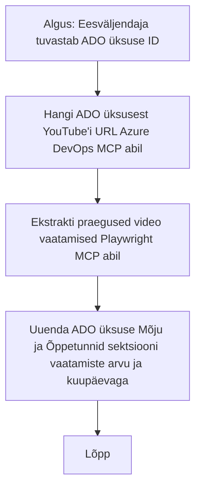

# Juhtumiuuring: Azure DevOpsi üksuste värskendamine YouTube'i andmetega MCP abil

> **Erlus:** On olemas veebipõhised tööriistad ja aruanded, mis võimaldavad automatiseerida Azure DevOpsi üksuste värskendamist platvormidelt nagu YouTube pärinevate andmetega. Järgmine stsenaarium esitatakse puhtalt näitena, et illustreerida, kuidas MCP tööriistu saab rakendada automatiseerimise ja integreerimise ülesannete jaoks.

## Ülevaade

See juhtumiuuring demonstreerib üht näidet, kuidas Mudelikonteksti Protokolli (MCP) ja selle tööriistu saab kasutada Azure DevOpsi (ADO) tööülesannete värskendamise protsessi automatiseerimiseks, kasutades veebiplatvormidelt, näiteks YouTube'ist, pärinevat teavet. Kirjeldatud stsenaarium on üks illustratsioon laiematest tööriistade võimalustest, mida saab kohandada paljudele sarnastele automatiseerimisvajadustele.

Selles näites jälgib Advokaat veebisessioone ADO üksuste kaudu, kus igaüks sisaldab YouTube'i videosisu URL-i. MCP tööriistade abil saab Advokaat hoida ADO üksused ajakohastatuna viimaste video mõõdikute, näiteks vaatamiste arvuga, korduva ja automaatse protsessina. Seda lähenemist saab üldistada teistele kasutusjuhtudele, kus veebiallikatest pärinev teave tuleb integreerida ADO-sse või teistesse süsteemidesse.

## Stsenaarium

Advokaat on vastutav veebisessioonide ja kogukonnaga seotud tegevuste mõjude jälgimise eest. Iga sessioon registreeritakse ADO tööülesandena 'DevRel' projektis ning tööülesande sees on väli YouTube'i video URL-iga. Et täpselt aru anda sessiooni ulatusest, peab Advokaat värskendama ADO üksust videot vaatamiste arvu ja selle kuupäevaga, millal see teave saadi.

## Kasutatavad tööriistad

- [Azure DevOps MCP](https://github.com/microsoft/azure-devops-mcp): Võimaldab programmiliselt ligi pääseda ja värskendada ADO tööülesandeid MCP kaudu.
- [Playwright MCP](https://github.com/microsoft/playwright-mcp): Automatiseerib brauseri tegevusi, et väljavõtta otseveebilehtedelt andmeid, näiteks YouTube'i video statistikat.

## Samm-sammuline töövoog

1. **Tuvaste ADO üksus**: Alusta ADO tööülesande ID-ga (nt 1234) 'DevRel' projektis.
2. **Hangi YouTube URL**: Kasuta Azure DevOps MCP tööriista, et saada tööülesandest YouTube URL.
3. **Võta videovaate arv**: Kasuta Playwright MCP tööriista, et minna YouTube URL-ile ja väljavõtta praegune vaatamiste arv.
4. **Värskenda ADO üksust**: Kirjuta kõige uuem vaatamiste arv ja väljavõtmise kuupäev 'Mõju ja õppetunnid' sektsiooni ADO tööülesandes, kasutades Azure DevOps MCP tööriista.

## Näidispäring

```bash
- Work with the ADO Item ID: 1234
- The project is '2025-Awesome'
- Get the YouTube URL for the ADO item
- Use Playwright to get the current views from the YouTube video
- Update the ADO item with the current video views and the updated date of the information
```

## Mermaid voo diagramm


## Tehniline rakendus

- **MCP orkestreerimine**: Töövoogu juhib MCP server, mis koordineerib nii Azure DevOpsi MCP kui ka Playwright MCP tööriistade kasutamist.
- **Automatiseerimine**: Protsess võib käivituda käsitsi või olla ajastatud regulaarselt, et hoida ADO üksused ajakohasena.
- **Laiendatavus**: Sama mustrit saab laiendada ADO üksuste värskendamiseks teiste veebimõõdikutega (nt meeldimised, kommentaarid) või muudelt platvormidelt.

## Tulemused ja mõju

- **Tõhusus**: Vähendab Automaatiseerimine vähendab Advokaatide käsitsi pingutust videomõõdikute kogumisel ja värskendamisel.
- **Täpsus**: Kindlustab, et ADO üksused peegeldavad veebiallikatest saadavaid kõige uuemaid andmeid.
- **Korduvkasutatavus**: Pakub korduvkasutatavat töövoogu sarnaste stsenaariumite jaoks, mis hõlmavad teisi andmeallikaid või mõõdikuid.

## Viited

- [Azure DevOps MCP](https://github.com/microsoft/azure-devops-mcp)
- [Playwright MCP](https://github.com/microsoft/playwright-mcp)
- [Mudelikonteksti protokoll (MCP)](https://modelcontextprotocol.io/)

## Mis järgmiseks

- Tagasi: [Juhtumiuuringute ülevaade](./README.md)
- Järgmine: [Reaalajas dokumentide päring MCP-ga](./docs-mcp/README.md)

---

<!-- CO-OP TRANSLATOR DISCLAIMER START -->
**Teatise**:
See dokument on tõlgitud kasutades tehisintellektil põhinevat tõlke teenust [Co-op Translator](https://github.com/Azure/co-op-translator). Kuigi püüame tagada täpsuse, palun arvestage, et automaatsed tõlked võivad sisaldada vigu või ebatäpsusi. Originaaldokument omakeelses versioonis tuleks pidada usaldusväärseks allikaks. Olulise teabe puhul soovitatakse kasutada professionaalset inimtõlget. Me ei vastuta selle tõlke kasutamisest tingitud arusaamatuste või valesti mõistmiste eest.
<!-- CO-OP TRANSLATOR DISCLAIMER END -->