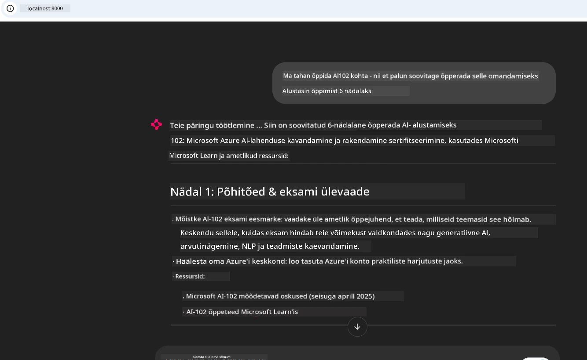

# Juhtumiuuring: Ühendamine Microsoft Learn Docs MCP-serveriga kliendist

Kas oled kunagi pidanud tasakaalustama dokumentatsioonisaite, Stack Overflow’d ja lõputuid otsingumootori kaarte, püüdes samal ajal oma koodi probleemi lahendada? Võib-olla hoiad teist monitori ainult dokumentatsiooni jaoks või vahetad pidevalt Alt-Tabi abil IDE ja brauseri vahel. Kas poleks parem, kui saaksid dokumentatsiooni tuua otse oma töövoogu—integreerituna oma rakendustesse, IDE-sse või isegi omaenda kohandatud tööriistadesse? Selles juhtumiuuringus uurime, kuidas teha täpselt seda, ühendades otse Microsoft Learn Docs MCP-serveriga omaenda kliendirakendusest.

## Ülevaade

Tänapäevane arendus ei seisne ainult koodi kirjutamises—see on õige teabe leidmises õigel ajal. Dokumentatsioon on kõikjal, aga harva seal, kus seda kõige enam vaja on: sinu tööriistades ja töövoogudes. Dokumentatsiooni päringu integreerimisega otse oma rakendustesse saad säästa aega, vähendada konteksti vahetamist ja suurendada tootlikkust. Selles jaotises näitame, kuidas ühendada klient Microsoft Learn Docs MCP-serveriga, et pääseda reaalajas, kontekstitundlikule dokumentatsioonile ligi, ilma et peaksid oma rakendusest lahkuma.

Samm-sammult kõnnime läbi ühenduse loomise protsessi, päringu saatmise ja voo vastuste efektiivse käsitlemise. See lähenemine lihtsustab su töövoogu ja avab võimaluse ehitada nutikamaid, abistavamaid arendajatööriistu.

## Õpieesmärgid

Miks me seda teeme? Sest parimad arendajakogemused eemaldavad takistused. Kujuta ette maailma, kus su koodiredaktor, vestlusrobot või veebiäpi vastab sinu dokumentatsiooniküsimustele hetkega, kasutades Microsoft Learni uusimat sisu. Selle peatüki lõpuks oskad:

- Mõista MCP serveri-kliendi suhtluse aluseid dokumentatsiooni jaoks
- Rakendada konsooli- või veebirakendust, mis ühendub Microsoft Learn Docs MCP-serveriga
- Kasutada voogedastusega HTTP-kliente reaalajas dokumentatsiooni pärimiseks
- Logida ja tõlgendada dokumentatsioonivastuseid oma rakenduses

Näed, kuidas need oskused aitavad sul ehitada tööriistu, mis ei ole lihtsalt reaktsioonilised, vaid tõeliselt interaktiivsed ja kontekstitundlikud.

## Stsenaarium 1 - Reaalajas dokumentatsiooni päring MCP-ga

Selles stsenaariumis näitame, kuidas ühendada klient Microsoft Learn Docs MCP-serveriga, et pääseda reaalajas, kontekstitundlikule dokumentatsioonile ligi, ilma et peaksid oma rakendusest lahkuma.

Pane see praktikas proovile. Sinu ülesandeks on kirjutada rakendus, mis ühendub Microsoft Learn Docs MCP-serveriga, kutsub `microsoft_docs_search` tööriista ja logib voovastuse konsooli.

### Miks just see lähenemine?
Sest see on alus keerukamate integratsioonide ehitamiseks—olgu selleks vestlusrobot, IDE laiendus või veebipaneel.

Leiad koodi ja juhised selle stsenaariumi kohta [`solution`](./solution/README.md) kaustast selles juhtumiuuringus. Sammud juhendavad sind ühenduse seadistamisel:
- Kasuta ametlikku MCP SDK-d ja voogedastusega HTTP klienti ühenduse loomiseks
- Kutsu `microsoft_docs_search` tööriista koos päringuparameetriga dokumentatsiooni pärimiseks
- Rakenda korrektne logimine ja vigade käsitlemine
- Loo interaktiivne konsooli liides, et kasutajad saaksid sisestada mitut otsingupäringut

See stsenaarium demonstreerib, kuidas:
- Ühenduda Docs MCP-serveriga
- Saata päring
- Tulemusi analüüsida ja kuvada

Siin on näide, kuidas lahenduse käivitamine võiks välja näha:

```
Prompt> What is Azure Key Vault?
Answer> Azure Key Vault is a cloud service for securely storing and accessing secrets. ...
```

Allpool on minimaalne proovilahendus. Täielik kood ja detailid on saadaval lahenduse kaustas.

<details>
<summary>Python</summary>

```python
import asyncio
from mcp.client.streamable_http import streamablehttp_client
from mcp import ClientSession

async def main():
    async with streamablehttp_client("https://learn.microsoft.com/api/mcp") as (read_stream, write_stream, _):
        async with ClientSession(read_stream, write_stream) as session:
            await session.initialize()
            result = await session.call_tool("microsoft_docs_search", {"query": "Azure Functions best practices"})
            print(result.content)

if __name__ == "__main__":
    asyncio.run(main())
```

- Täieliku rakenduse ja logimise jaoks vaata [`scenario1.py`](../../../../09-CaseStudy/docs-mcp/solution/python/scenario1.py).
- Paigaldus- ja kasutusjuhised leiad samast kaustast failist [`README.md`](./solution/python/README.md).
</details>

## Stsenaarium 2 - Interaktiivne õppekava generaatori veebirakendus MCP-ga

Selles stsenaariumis õpid, kuidas integreerida Docs MCP veebiarendusprojekti. Eesmärk on võimaldada kasutajatel otsida Microsoft Learni dokumentatsiooni otse veebiliidese kaudu, muutes dokumentatsiooni koheselt kättesaadavaks sinu äpis või saidil.

Näed, kuidas:
- Seadistada veebirakendus
- Ühenduda Docs MCP-serveriga
- Töötlema kasutaja sisendit ja kuvama tulemusi

Siin on näide, kuidas lahenduse käivitamine võiks välja näha:

```
User> I want to learn about AI102 - so suggest the roadmap to get it started from learn for 6 weeks

Assistant> Here’s a detailed 6-week roadmap to start your preparation for the AI-102: Designing and Implementing a Microsoft Azure AI Solution certification, using official Microsoft resources and focusing on exam skills areas:

---
## Week 1: Introduction & Fundamentals
- **Understand the Exam**: Review the [AI-102 exam skills outline](https://learn.microsoft.com/en-us/credentials/certifications/exams/ai-102/).
- **Set up Azure**: Sign up for a free Azure account if you don't have one.
- **Learning Path**: [Introduction to Azure AI services](https://learn.microsoft.com/en-us/training/modules/intro-to-azure-ai/)
- **Focus**: Get familiar with Azure portal, AI capabilities, and necessary tools.

....more weeks of the roadmap...

Let me know if you want module-specific recommendations or need more customized weekly tasks!
```

Allpool on minimaalne proovilahendus. Täielik kood ja detailid on saadaval lahenduse kaustas.



<details>
<summary>Python (Chainlit)</summary>

Chainlit on raamistik vestluslike AI veebirakenduste loomiseks. See muudab lihtsaks interaktiivsete vestlusrobotite ja assistentide loomise, kes saavad kutsuda MCP tööriistu ja kuvada tulemusi reaalajas. Sobib hästi kiireks prototüüpimiseks ja kasutajasõbralikuks liideseks.

```python
import chainlit as cl
import requests

MCP_URL = "https://learn.microsoft.com/api/mcp"

@cl.on_message
def handle_message(message):
    query = {"question": message}
    response = requests.post(MCP_URL, json=query)
    if response.ok:
        result = response.json()
        cl.Message(content=result.get("answer", "No answer found.")).send()
    else:
        cl.Message(content="Error: " + response.text).send()
```

- Täieliku rakenduse leidmiseks vaata [`scenario2.py`](../../../../09-CaseStudy/docs-mcp/solution/python/scenario2.py).
- Paigalduse ja käivitamise juhised leiad failist [`README.md`](./solution/python/README.md).
</details>

## Stsenaarium 3: Redaktorisisesed dokumendid MCP-serveriga VS Code’is

Kui tahad saada Microsoft Learni dokumente otse oma VS Code’i (ilma brauserikaardilt lahkumata), saad kasutada MCP-serverit oma redaktoris. See võimaldab:
- Otsida ja lugeda dokumente VS Code’is, jäädes oma kodeerimiskeskkonda.
- Viidata dokumentatsioonile ja lisada linke otse oma README või õppefailidesse.
- Kasutada GitHub Copilotit ja MCP-d koos sujuvaks tehisintellektipõhiseks dokumentatsiooni töövooguks.

**Sa näed, kuidas:**
- Lisa kehtiv `.vscode/mcp.json` fail oma tööruumi juurkausta (näide allpool).
- Ava MCP paneel või kasuta käskude paletti VS Code’is dokumentide otsimiseks ja lisamiseks.
- Viita dokumentatsioonile otse markdown-failides töö käigus.
- Ühenda see töövoog GitHub Copilotiga veelgi suurema tootlikkuse jaoks.

Siin on näide, kuidas MCP-serverit VS Code’is seadistada:

```json
{
  "servers": {
    "LearnDocsMCP": {
      "url": "https://learn.microsoft.com/api/mcp"
    }
  }
}
```

</details>

> Üksikasjaliku juhendi ja ekraanipiltidega samm-sammult läbiva kirjelduse leiad failist [`README.md`](./solution/scenario3/README.md).


See lähenemine on ideaalne kõigile, kes loovad tehnilisi kursuseid, kirjutavad dokumentatsiooni või arendavad koodi sagedaste viidete vajadusega.

## Peamised järeldused

Dokumentatsiooni integreerimine otse tööriistadesse ei ole lihtsalt mugavus—it’s tootlikkuse mängumuutja. Ühendades Microsoft Learn Docs MCP-serveriga oma kliendist saad:

- Vähendada konteksti vahetamise vajadust koodi ja dokumentatsiooni vahel
- Pääseda reaalajas juurde ajakohastele, kontekstitundlikele dokumentidele
- Ehita nutikamaid, interaktiivsemaid arendajatööriistu

Need oskused aitavad sul luua lahendusi, mis on mitte ainult tõhusad, vaid ka meeldivad kasutada.

## Lisamaterjalid

Sügavama arusaama saamiseks vaata järgmisi ametlikke ressursse:

- [Microsoft Learn Docs MCP Server (GitHub)](https://github.com/MicrosoftDocs/mcp)
- [Alustamine Azure MCP Serveriga (mcp-python)](https://learn.microsoft.com/en-us/azure/developer/azure-mcp-server/get-started#create-the-python-app)
- [Mis on Azure MCP Server?](https://learn.microsoft.com/en-us/azure/developer/azure-mcp-server/)
- [Model Context Protocol (MCP) tutvustus](https://modelcontextprotocol.io/introduction)
- [Lisa pistikprogramme MCP Serverist (Python)](https://learn.microsoft.com/en-us/semantic-kernel/concepts/plugins/adding-mcp-plugins)

## Järgmine samm

- Tagasi: [Juhtumiuuringute ülevaade](../README.md)
- Jätka: [Moodul 10: AI töövoogude tõhustamine AI tööriistakomplektiga](../../10-StreamliningAIWorkflowsBuildingAnMCPServerWithAIToolkit/README.md)

---

<!-- CO-OP TRANSLATOR DISCLAIMER START -->
**Lahtiütlus**:
See dokument on tõlgitud kasutades tehisintellekti tõlketeenust [Co-op Translator](https://github.com/Azure/co-op-translator). Kuigi püüame tagada täpsuse, palun arvestage, et automatiseeritud tõlked võivad sisaldada vigu või ebatäpsusi. Originaaldokument selle emakeeles tuleks pidada autoriteetseks allikaks. Olulise teabe puhul soovitatakse kasutada professionaalset inimtõlget. Me ei vastuta selle tõlke kasutamisest tingitud arusaamatuste ega väärarusaamade eest.
<!-- CO-OP TRANSLATOR DISCLAIMER END -->