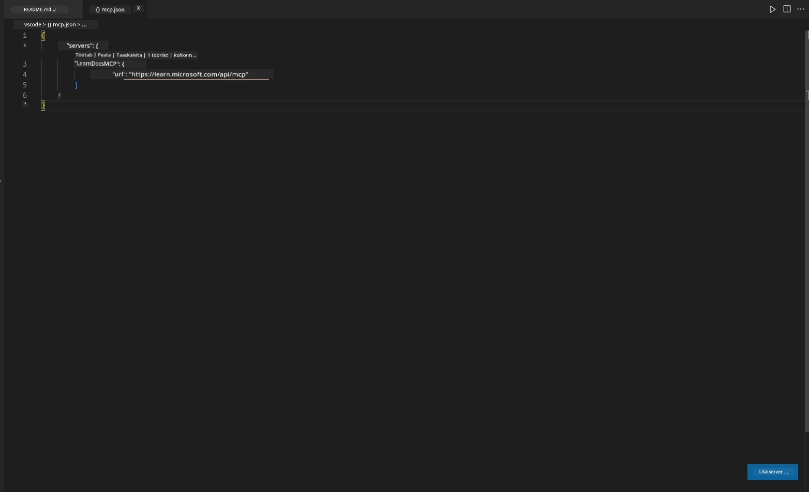
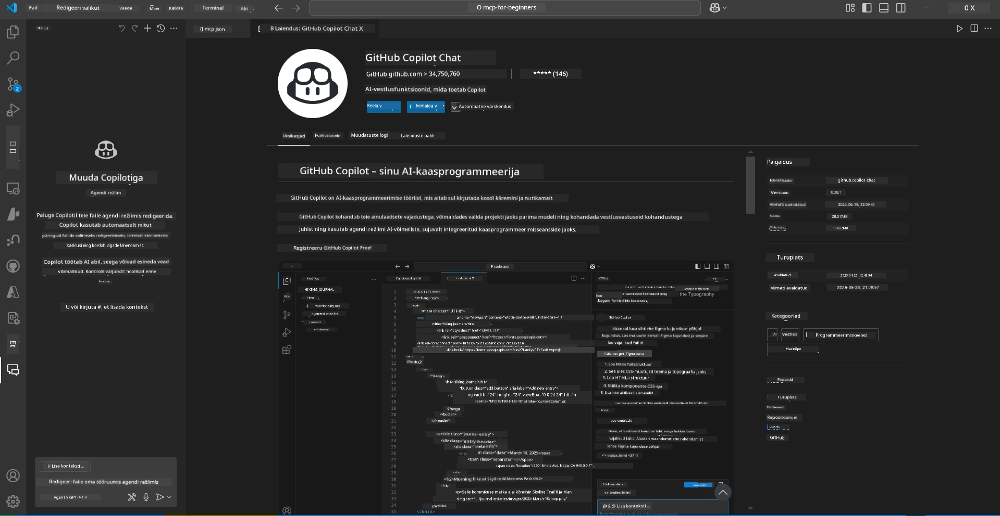
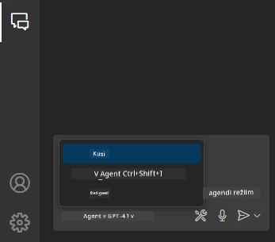
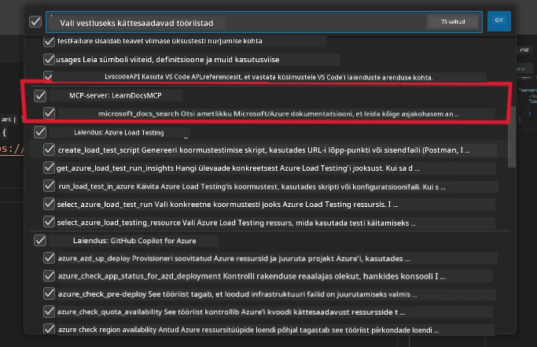
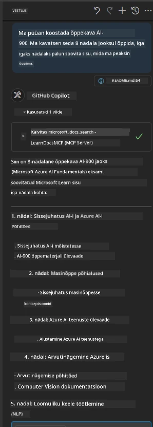
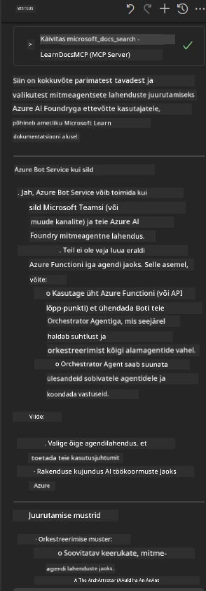

# Stsenaarium 3: Toimetaja sees olevad dokumendid MCP serveriga VS Code'is

## Ülevaade

Selles stsenaariumis õpid, kuidas tuua Microsoft Learn dokumendid otse oma Visual Studio Code'i keskkonda, kasutades MCP serverit. Selle asemel, et pidevalt brauseri vahelehtede vahel vahetada, et dokumentatsiooni otsida, saad juurdepääsu ametlikele dokumentidele, neid otsida ja viidata otse oma toimetajas. See lähenemine lihtsustab töövoogu, hoiab sind keskendununa ja võimaldab sujuvat integreerimist selliste tööriistadega nagu GitHub Copilot.

- Otsi ja loe dokumente otse VS Code'is, lahkumata oma kodeerimiskeskkonnast.
- Viita dokumentatsioonile ja lisa lingid otse oma README või kursuse failidesse.
- Kasuta GitHub Copilotit ja MCP-d koos sujuvaks, tehisintellektil põhinevaks dokumentatsioonitöövooks.

## Õpieesmärgid

Selle peatüki lõpuks mõistad, kuidas seadistada ja kasutada MCP serverit VS Code'is, et täiustada oma dokumentatsiooni ja arendustöövoogu. Sa oskad:

- Seadistada oma tööruumi MCP serveri kasutamiseks dokumentatsiooni otsinguks.
- Otsida ja lisada dokumentatsiooni otse VS Code'ist.
- Kombineerida GitHub Copiloti ja MCP võimekust produktiivsemaks, tehisintellekti abil täiustatud töövooks.

Need oskused aitavad sul püsida keskendununa, parandada dokumentatsiooni kvaliteeti ja suurendada oma tootlikkust arendaja või tehnilise kirjutajana.

## Lahendus

Toimetaja sees dokumentatsioonile juurdepääsu saavutamiseks järgige samme, mis integreerivad MCP serveri VS Code'i ja GitHub Copilotiga. See lahendus sobib ideaalselt kursuste autoritele, dokumentatsiooni kirjutajatele ja arendajatele, kes soovivad töötada dokumentide ja Copilotiga otse toimetajas.

- Lisa kiiresti viitelinke README-sse, kirjutades kursuse või projekti dokumentatsiooni.
- Kasuta Copilotit koodi genereerimiseks ja MCP-d, et koheselt leida ja viidata asjakohastele dokumentidele.
- Püsi keskendununa oma toimetajas ja suurenda tootlikkust.

### Samm-sammuline juhend

Alustamiseks järgi neid samme. Iga sammu jaoks saad lisada ekraanipildi kaustast "assets", et protsessi visuaalselt illustreerida.

1. **Lisa MCP konfiguratsioon:**
   Loo oma projekti juurkausta `.vscode/mcp.json` fail ja lisa järgmine konfiguratsioon:
   ```json
   {
     "servers": {
       "LearnDocsMCP": {
         "url": "https://learn.microsoft.com/api/mcp"
       }
     }
   }
   ```
   See konfiguratsioon ütleb VS Code'ile, kuidas ühendada [`Microsoft Learn Docs MCP serveriga`](https://github.com/MicrosoftDocs/mcp).
   
   
    
2. **Ava GitHub Copilot Chat paneel:**
   Kui sul pole veel GitHub Copilot laiendust installitud, mine VS Code'i laienduste vaatesse ja installi see. Sa saad selle otse alla laadida [Visual Studio Code Marketplace'ist](https://marketplace.visualstudio.com/items?itemName=GitHub.copilot-chat). Seejärel ava Copilot Chat paneel külgribalt.

   

3. **Luba agent-režiim ja kontrolli tööriistu:**
   Luba Copilot Chat paneelil agent-režiim.

   

   Pärast agent-režiimi lubamist kontrolli, et MCP server oleks loetletud ühe saadaoleva tööriistana. See tagab, et Copilot agent saab dokumentatsiooniserverile juurde pääseda ja asjakohast teavet hankida.
   
   
4. **Alusta uut vestlust ja esita agentile küsimus:**
   Ava Copilot Chat paneelil uus vestlus. Nüüd saad esitada agentile oma dokumentatsiooniga seotud küsimusi. Agent kasutab MCP serverit, et hankida ja kuvada asjakohast Microsoft Learn dokumentatsiooni otse sinu toimetajas.

   - *"Ma püüan koostada õppeplaani teema X jaoks. Kavatsen seda õppida 8 nädalat, palun soovita iga nädala jaoks sobivat sisu."*

   

5. **Reaalajas päring:**

   > Võtame reaalajas päringu [#get-help](https://discord.gg/D6cRhjHWSC) jaotisest Azure AI Foundry Discordis ([vaata algset sõnumit](https://discord.com/channels/1113626258182504448/1385498306720829572)):
   
   *"Otsin vastuseid, kuidas juurutada mitme agendi lahendust, kus AI agendid on välja töötatud Azure AI Foundry's. Ma näen, et otsest juurutusmeetodit, nagu Copilot Studio kanalid, pole. Millised on erinevad viisid, kuidas seda juurutust teha, et ettevõtte kasutajad saaksid suhelda ja töö tehtud? On palju artikleid/blogisid, mis ütlevad, et selle töö tegemiseks saab kasutada Azure Bot teenust, mis võib toimida silla rollis MS Teamsi ja Azure AI Foundry agentide vahel. Kas see töötab, kui seadistan Azure boti, mis ühendub Azure AI Foundry Orkestreerimisagendiga Azure funktsiooni kaudu, et orkestreerimist teostada, või pean looma iga mitme agendi lahenduse osa jaoks eraldi Azure funktsiooni, et teha orkestreerimist Bot Frameworkis? Kõik muud ettepanekud on teretulnud."*

   

   Agent vastab asjakohaste dokumentatsioonilinkide ja kokkuvõtetega, mida saad seejärel otse oma markdown-failidesse lisada või kasutada viidetena oma koodis.
   
### Näidispäringud

Siin on mõned näidispäringud, mida võid proovida. Need päringud näitavad, kuidas MCP server ja Copilot saavad koos töötada, et pakkuda koheseid, kontekstitundlikke dokumente ja viiteid, lahkumata VS Code'ist:

- "Näita, kuidas kasutada Azure Functions'i triggereid."
- "Lisa link ametlikule dokumentatsioonile Azure Key Vaulti kohta."
- "Millised on parimad tavad Azure'i ressursside turvamiseks?"
- "Leia kiire alustamise juhend Azure AI teenuste jaoks."

Need päringud näitavad, kuidas MCP server ja Copilot saavad koos töötada, et pakkuda koheseid, kontekstitundlikke dokumente ja viiteid, lahkumata VS Code'ist.

---

---

**Lahtiütlus**:  
See dokument on tõlgitud AI tõlketeenuse [Co-op Translator](https://github.com/Azure/co-op-translator) abil. Kuigi püüame tagada täpsust, palume arvestada, et automaatsed tõlked võivad sisaldada vigu või ebatäpsusi. Algne dokument selle algses keeles tuleks pidada autoriteetseks allikaks. Olulise teabe puhul soovitame kasutada professionaalset inimtõlget. Me ei vastuta selle tõlke kasutamisest tulenevate arusaamatuste või valesti tõlgenduste eest.