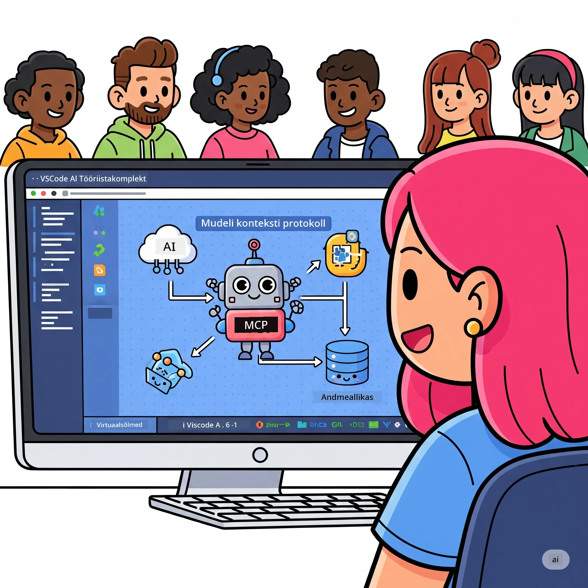
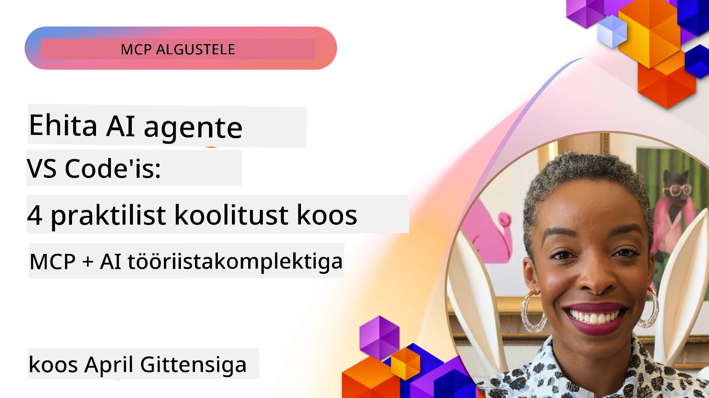

# AI töövoogude sujuvamaks muutmine: MCP-serveri ehitamine AI tööriistakomplektiga

## 🎯 Ülevaade

_(Klõpsa ülaltoodud pildil, et vaadata selle tunni videot)_

Tere tulemast **Model Context Protocol (MCP) töötuppa**! See põhjalik praktiline tööklass ühendab kaks tipptasemel tehnoloogiat, mis muudavad AI rakenduste arenduse revolutsiooniliseks:

- **🔗 Model Context Protocol (MCP)**: Avatud standard sujuvaks AI-tööriistade integreerimiseks
- **🛠️ AI tööriistakomplekt Visual Studio Code’ile (AITK)**: Microsofti võimas AI arenduslisa

### 🎓 Mida sa õpid

Selle töötoa lõpuks valdad nutikate rakenduste loomise oskuse, mis ühendavad AI mudelid reaalsete tööriistade ja teenustega. Alates automatiseeritud testimisest kuni kohandatud API integratsioonideni - saad praktilised oskused keerukate äriprobleemide lahendamiseks.

## 🏗️ Tehnoloogiapinu

### 🔌 Model Context Protocol (MCP)

MCP on **"USB-C AI-le"** – universaalne standard, mis ühendab AI mudelid väliste tööriistade ja andmeallikatega.

**✨ Peamised omadused:**

- 🔄 **Standardiseeritud integreerimine**: Universaalne liides AI-tööriistade ühendamiseks
- 🏛️ **Paindlik arhitektuur**: Kohalikud ja kaugel asuvad serverid stdio/SSE transpordi kaudu
- 🧰 **Rikas ökosüsteem**: Tööriistad, käsud ja ressursid ühes protokollis
- 🔒 **Ettevõttevalmidus**: Sisseehitatud turvalisus ja usaldusväärsus

**🎯 Miks MCP on oluline:**
Nii nagu USB-C kaotas kaablite segaduse, nii ka MCP kaotab AI integratsioonide keerukuse. Üks protokoll, piiritud võimalused.

### 🤖 AI tööriistakomplekt Visual Studio Code’ile (AITK)

Microsofti lipulaeva AI arenduslisa, mis muudab VS Code’i AI võimsuskeskuseks.

**🚀 Peamised võimekused:**

- 📦 **Mudelite kataloog**: Juhtmudelid Azure AI-st, GitHubist, Hugging Face’ist, Ollamast
- ⚡ **Kohalik tuletamine**: ONNX-optimeeritud CPU/GPU/NPU täideviimine
- 🏗️ **Agendi ehitaja**: Visuaalne AI agendi arendus MCP integratsiooniga
- 🎭 **Mitme meediumi tugi**: Tekst, pilt ja struktureeritud väljund

**💡 Arendusmugavused:**

- Null-konfiguratsiooniga mudelite kasutuselevõtt
- Visuaalne käsuinsener
- Reaalaegne testimisplatvorm
- Sujuv MCP serverite integratsioon

## 📚 Õppeprogramm

### [🚀 Moodul 1: AI tööriistakomplekti alused](./lab1/README.md)

**Kestus**: 15 minutit

- 🛠️ AI tööriistakomplekti paigaldamine ja seadistamine VS Code’is
- 🗂️ Mudelite kataloogi uurimine (üle 100 mudeli GitHubist, ONNX-ist, OpenAI-st, Anthropic-ist, Google’ilt)
- 🎮 Interaktiivse katseplatvormi valdamine mudelite reaalaegseks testimiseks
- 🤖 Esimese AI agendi ehitamine Agent Builderiga
- 📊 Mudelite jõudluse hindamine sisseehitatud mõõdikute abil (F1, asjakohasus, sarnasus, sidusus)
- ⚡ Grupitöötluse ja mitme meediumi toe õppimine

**🎯 Õpitulemus**: Loo funktsionaalne AI agent pikaulatusliku AITK võimekuse mõistmisega

### [🌐 Moodul 2: MCP AI tööriistakomplektiga](./lab2/README.md)

**Kestus**: 20 minutit

- 🧠 Model Context Protocoli (MCP) arhitektuuri ja mõistete valdamine
- 🌐 Microsofti MCP serveri ökosüsteemi uurimine
- 🤖 Brauseriautomaatika agendi loomine Playwright MCP serveri abil
- 🔧 MCP serverite integratsioon AI tööriistakomplekti Agent Builderiga
- 📊 MCP tööriistade seadistamine ja testimine agentides
- 🚀 MCP-põhiste agentide eksport ja tootmiskasutusse viimine

**🎯 Õpitulemus**: Käivita AI agent, mis on võimendatud väliste tööriistade abil MCP kaudu

### [🔧 Moodul 3: Täiustatud MCP arendus AI tööriistakomplektiga](./lab3/README.md)

**Kestus**: 20 minutit

- 💻 Kohandatud MCP serverite loomine AI tööriistakomplekti abil
- 🐍 Uusima MCP Python SDK (v1.9.3) seadistamine ja kasutamine
- 🔍 MCP Inspectori seadistamine ja kasutamine silumiseks
- 🛠️ Ilmateate MCP serveri ehitamine professionaalsete silumisvoogudega
- 🧪 MCP serverite silumine Agent Builderi ja Inspectori keskkondades

**🎯 Õpitulemus**: Arenda ja silu kohandatud MCP servereid kaasaegsete tööriistadega

### [🐙 Moodul 4: Praktiline MCP arendus – Kohandatud GitHub klooni server](./lab4/README.md)

**Kestus**: 30 minutit

- 🏗️ Tööstusliku GitHub Clone MCP serveri loomine arendusprotsesside jaoks
- 🔄 Nutika hoidla kloonimise rakendamine valideerimise ja veahaldusega
- 📁 Intelligente kataloogihalduse ja VS Code’i integratsiooni loomine
- 🤖 GitHub Copilot agendi režiimi kasutamine kohandatud MCP tööriistadega
- 🛡️ Tootmisvalmiduse usaldusväärsus ja platvormidevaheline ühilduvus

**🎯 Õpitulemus**: Kasuta tootmisvalmis MCP serverit, mis sujuvdab tegelikke arendusprotsesse

## 💡 Reaalse maailma rakendused ja mõju

### 🏢 Ettevõtete kasutusjuhtumid

#### 🔄 DevOpsi automatiseerimine

Muuda oma arendusprotsess nutikaks automatiseerimisega:

- **Nutikas hoidlahaldus**: AI-põhine koodi ülevaatus ja liitmise otsused
- **Tark CI/CD**: Automaatne torujuhtme optimeerimine koodimuudatuste põhjal
- **Probleemide triage**: Veaparanduste automaatne klassifitseerimine ja määramine

#### 🧪 Kvaliteedikontrolli revolutsioon

Tõsta testimine AI-põhise automatiseerimisega uuele tasemele:

- **Nutikas testide genereerimine**: Kattuvate testikomplektide loomine automaatselt
- **Visuaalne regressioonitestimine**: AI toetatud kasutajaliidese muutuste tuvastamine
- **Jõudluse jälgimine**: Probleemide ennetav tuvastamine ja lahendamine

#### 📊 Andmevoogude intelligentsus

Ehita nutikamaid andmetöötlusvooge:

- **Kohanduvad ETL-protsessid**: Eneseoptimeeruvad andmemuutused
- **Anomaaliate tuvastus**: Reaalaegne andmekvaliteedi monitooring
- **Nutikas marsruutimine**: Tark andmevoo juhtimine

#### 🎧 Kliendikogemuse parandamine

Loo erakordseid kliendisuhtlusi:

- **Kontekstiteadlik tugi**: AI agendid kliendi ajaloo juurdepääsuga
- **Proaktiivne probleemilahendus**: Prognoositav klienditeenindus
- **Mitme kanali integratsioon**: Ühtne AI-kogemus platvormide vahel

## 🛠️ Nõuded ja seadistamine

### 💻 Süsteeminõuded

| Komponent | Nõue | Märkmed |
|-----------|-------|---------|
| **Operatsioonisüsteem** | Windows 10+, macOS 10.15+, Linux | Ükskõik milline moodsama aja OS |
| **Visual Studio Code** | Viimane stabiilne versioon | Vajalik AITK jaoks |
| **Node.js** | v18.0+ ja npm | MCP serveri arenduseks |
| **Python** | 3.10+ | Valikuline Python MCP serverite jaoks |
| **Mälu** | Vähemalt 8GB RAM | Soovitatav 16GB kohalikeks mudeliteks |

### 🔧 Arenduskeskkond

#### Soovitatud VS Code’i lisad

- **AI tööriistakomplekt** (ms-windows-ai-studio.windows-ai-studio)
- **Python** (ms-python.python)
- **Python silur** (ms-python.debugpy)
- **GitHub Copilot** (GitHub.copilot) - Valikuline, kuid kasulik

#### Valikulised tööriistad

- **uv**: Moodne Python paketihaldur
- **MCP Inspector**: Vaatleja MCP serverite silumiseks
- **Playwright**: Veebiautomaatika näideteks

## 🎖️ Õpitulemused ja sertifitseerimisrada

### 🏆 Oskuste valdamise kontrollnimekiri

Selle töötoa lõpetamisega saavutad valduse järgmistes valdkondades:

#### 🎯 Põhioskused

- [ ] **MCP protokolli valdamine**: Sügav arusaam arhitektuurist ja rakendusmustritest
- [ ] **AITK oskus**: Eksperditase AI tööriistakomplekti kasutamisel kiireks arenduseks
- [ ] **Kohandatud serveri arendus**: Tootmisvalmis MCP serverite ehitamine, kasutuselevõtt ja haldus
- [ ] **Tööriistade integreerimise oskus**: AI sujuv ühendamine olemasolevate arendusvoogudega
- [ ] **Probleemilahenduse rakendamine**: Õpitud oskuste mõistlik kasutamine äriprobleemide lahendamisel

#### 🔧 Tehnilised oskused

- [ ] AI tööriistakomplekti seadistamine ja konfigureerimine VS Code’is
- [ ] Kohandatud MCP serverite disain ja realiseerimine
- [ ] GitHub mudelite integreerimine MCP arhitektuuriga
- [ ] Automatiseeritud testimisvoogude loomine Playwrightiga
- [ ] AI agentide juurutamine tootmises
- [ ] MCP serveri jõudluse silumine ja optimeerimine

#### 🚀 Täiustatud võimed

- [ ] Ettevõtteskaala AI integratsioonide arhitektuur
- [ ] AI rakenduste turvalisuse parimate tavade rakendamine
- [ ] Skaleeritavate MCP serverite disain
- [ ] Spetsiifiliste valdkondade jaoks kohandatud tööriistakettide loomine
- [ ] Teiste juhendamine AI-põhises arenduses

## 📖 Lisamaterjalid

- [MCP spetsifikatsioon (2025-11-25)](https://spec.modelcontextprotocol.io/specification/2025-11-25/)
- [AI tööriistakomplekti GitHubi hoidla](https://github.com/microsoft/vscode-ai-toolkit)
- [MCP näidisserverite kogu](https://github.com/modelcontextprotocol/servers)
- [Parimate tavade juhend](https://modelcontextprotocol.io/docs/best-practices)
- [OWASP MCP Top 10](https://microsoft.github.io/mcp-azure-security-guide/mcp/) - Turvalisuse parimad praktikad

---

**🚀 Oled valmis revolutsioneerima oma AI arendusvoogu?**

Loome koos MCP ja AI tööriistakomplektiga nutikate rakenduste tuleviku!

## Mis järgmiseks

Jätka: [Moodul 11: MCP serveri praktilised töötoad](../11-MCPServerHandsOnLabs/README.md)

---

<!-- CO-OP TRANSLATOR DISCLAIMER START -->
**Vastutusest loobumine**:  
See dokument on tõlgitud tehisintellekti tõlketeenuse [Co-op Translator](https://github.com/Azure/co-op-translator) abil. Kuigi püüame täpsust, tuleb arvestada, et automatiseeritud tõlked võivad sisaldada vigu või ebatäpsusi. Originaaldokument oma emakeeles tuleks pidada autoriteetseks allikaks. Olulise info puhul soovitatakse kasutada professionaalset inimtõlget. Me ei vastuta selle tõlke kasutamisest tingitud väärarusaamade või valesti mõistmiste eest.
<!-- CO-OP TRANSLATOR DISCLAIMER END -->