# 🌐 Moodul 2: MCP ja AI Toolkit põhialused

[]()
[]()
[]()

## 📋 Õpieesmärgid

Selle mooduli lõpuks suudad:
- ✅ Mõista Model Context Protocol (MCP) arhitektuuri ja eeliseid
- ✅ Uurida Microsofti MCP serverite ökosüsteemi
- ✅ Integreerida MCP servereid AI Toolkit Agent Builderiga
- ✅ Luua funktsionaalne brauseri automatiseerimise agent Playwright MCP abil
- ✅ Konfigureerida ja testida MCP tööriistu oma agentides
- ✅ Eksportida ja juurutada MCP-põhiseid agente tootmiskeskkonnas

## 🎯 Moodul 1 jätkamine

Moodulis 1 õppisime AI Toolkiti põhialuseid ja lõime oma esimese Python-agendi. Nüüd **võimendame** sinu agente, ühendades need väliste tööriistade ja teenustega revolutsioonilise **Model Context Protocol (MCP)** abil.

Mõtle sellele kui üleminekule lihtsast kalkulaatorist täisväärtuslikuks arvutiks – sinu AI agendid saavad võimekuse:
- 🌐 Sirvida ja suhelda veebisaitidega
- 📁 Juurdepääs ja failide haldamine
- 🔧 Integreerimine ettevõtte süsteemidega
- 📊 Reaalajas andmete töötlemine API-de kaudu

## 🧠 Model Context Protocol (MCP) mõistmine

### 🔍 Mis on MCP?

Model Context Protocol (MCP) on **"USB-C AI rakenduste jaoks"** – revolutsiooniline avatud standard, mis ühendab suured keelemudelid (LLM-id) väliste tööriistade, andmeallikate ja teenustega. Nii nagu USB-C kõrvaldas kaablite segaduse, pakkudes üht universaalset ühendust, kõrvaldab MCP AI integratsiooni keerukuse ühe standardiseeritud protokolliga.

### 🎯 Probleem, mida MCP lahendab

**Enne MCP-d:**
- 🔧 Kohandatud integratsioonid iga tööriista jaoks
- 🔄 Tootja sõltuvus patenteeritud lahendustest  
- 🔒 Turvaprobleemid juhuslike ühenduste tõttu
- ⏱️ Kuud arendust lihtsate integratsioonide jaoks

**MCP-ga:**
- ⚡ Plug-and-play tööriistade integratsioon
- 🔄 Tootja-sõltumatu arhitektuur
- 🛡️ Sisseehitatud turvalisuse parimad praktikad
- 🚀 Uute võimekuste lisamine minutitega

### 🏗️ MCP arhitektuuri süvaanalüüs

MCP järgib **klient-server arhitektuuri**, mis loob turvalise ja skaleeritava ökosüsteemi:

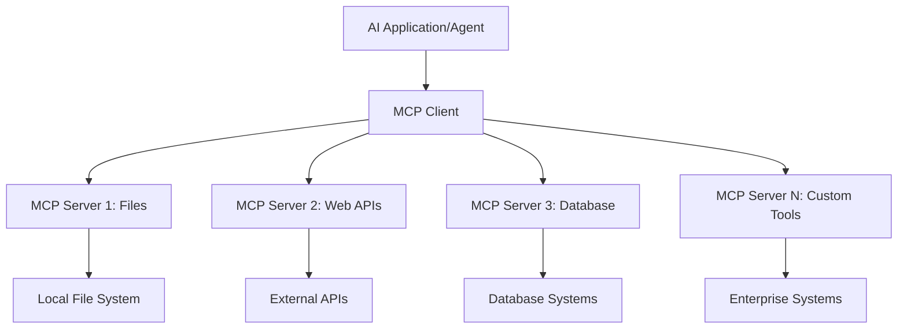

**🔧 Põhikomponendid:**

| Komponent | Roll | Näited |
|-----------|------|----------|
| **MCP Hostid** | Rakendused, mis tarbivad MCP teenuseid | Claude Desktop, VS Code, AI Toolkit |
| **MCP Kliendid** | Protokolli käsitlejad (1:1 serveritega) | Sisseehitatud hostrakendustesse |
| **MCP Serverid** | Pakuvad võimekusi standardprotokolli kaudu | Playwright, Files, Azure, GitHub |
| **Transpordikiht** | Kommunikatsioonimeetodid | stdio, HTTP, WebSockets |

## 🏢 Microsofti MCP serverite ökosüsteem

Microsoft juhib MCP ökosüsteemi ulatusliku ettevõtte tasemel serverite komplektiga, mis vastavad reaalsetele ärivajadustele.

### 🌟 Microsofti MCP serverite esiletõstetud näited

#### 1. ☁️ Azure MCP Server
**🔗 Repositoorium**: [azure/azure-mcp](https://github.com/azure/azure-mcp)
**🎯 Eesmärk**: Ulatuslik Azure'i ressursside haldamine AI integratsiooniga

**✨ Põhifunktsioonid:**
- Deklaratiivne infrastruktuuri ettevalmistamine
- Reaalajas ressursside jälgimine
- Kulude optimeerimise soovitused
- Turvalisuse vastavuse kontroll

**🚀 Kasutamisjuhtumid:**
- Infrastruktuur kui kood AI abiga
- Automaatne ressursside skaleerimine
- Pilvekulude optimeerimine
- DevOps töövoogude automatiseerimine

#### 2. 📊 Microsoft Dataverse MCP
**📚 Dokumentatsioon**: [Microsoft Dataverse Integration](https://go.microsoft.com/fwlink/?linkid=2320176)
**🎯 Eesmärk**: Loomulik keeleliides ärilistele andmetele

**✨ Põhifunktsioonid:**
- Loomuliku keele andmebaasi päringud
- Ärikonteksti mõistmine
- Kohandatud promptide mallid
- Ettevõtte andmete haldamine

**🚀 Kasutamisjuhtumid:**
- Ärianalüüsi aruandlus
- Kliendiandmete analüüs
- Müügitoru ülevaated
- Vastavusandmete päringud

#### 3. 🌐 Playwright MCP Server
**🔗 Repositoorium**: [microsoft/playwright-mcp](https://github.com/microsoft/playwright-mcp)
**🎯 Eesmärk**: Brauseri automatiseerimine ja veebisuhtluse võimekus

**✨ Põhifunktsioonid:**
- Mitme brauseri automatiseerimine (Chrome, Firefox, Safari)
- Nutikas elementide tuvastamine
- Ekraanipiltide ja PDF-ide genereerimine
- Võrguliikluse jälgimine

**🚀 Kasutamisjuhtumid:**
- Automatiseeritud testimise töövood
- Veebikraapimine ja andmete kogumine
- UI/UX jälgimine
- Konkurentsianalüüsi automatiseerimine

#### 4. 📁 Files MCP Server
**🔗 Repositoorium**: [microsoft/files-mcp-server](https://github.com/microsoft/files-mcp-server)
**🎯 Eesmärk**: Nutikad failisüsteemi toimingud

**✨ Põhifunktsioonid:**
- Deklaratiivne failihaldus
- Sisu sünkroniseerimine
- Versioonikontrolli integratsioon
- Metaandmete eraldamine

**🚀 Kasutamisjuhtumid:**
- Dokumentide haldamine
- Koodirepositooriumi organiseerimine
- Sisupublitseerimise töövood
- Andmetorustiku failihaldus

#### 5. 📝 MarkItDown MCP Server
**🔗 Repositoorium**: [microsoft/markitdown](https://github.com/microsoft/markitdown)
**🎯 Eesmärk**: Täiustatud Markdowni töötlemine ja manipuleerimine

**✨ Põhifunktsioonid:**
- Rikkalik Markdowni parsimine
- Vormingu konverteerimine (MD ↔ HTML ↔ PDF)
- Sisustruktuuri analüüs
- Mallide töötlemine

**🚀 Kasutamisjuhtumid:**
- Tehnilise dokumentatsiooni töövood
- Sisuhaldussüsteemid
- Aruannete genereerimine
- Teadmistebaasi automatiseerimine

#### 6. 📈 Clarity MCP Server
**📦 Pakett**: [@microsoft/clarity-mcp-server](https://www.npmjs.com/package/@microsoft/clarity-mcp-server)
**🎯 Eesmärk**: Veebianalüütika ja kasutajakäitumise ülevaated

**✨ Põhifunktsioonid:**
- Heatmap andmete analüüs
- Kasutajaseansside salvestamine
- Jõudlusmõõdikud
- Konversioonilehtri analüüs

**🚀 Kasutamisjuhtumid:**
- Veebisaidi optimeerimine
- Kasutajakogemuse uurimine
- A/B testimise analüüs
- Ärianalüüsi juhtpaneelid

### 🌍 Kogukonna ökosüsteem

Lisaks Microsofti serveritele sisaldab MCP ökosüsteem:
- **🐙 GitHub MCP**: Repositooriumi haldamine ja koodianalüüs
- **🗄️ Andmebaasi MCP-d**: PostgreSQL, MySQL, MongoDB integratsioonid
- **☁️ Pilveteenuse MCP-d**: AWS, GCP, Digital Ocean tööriistad
- **📧 Kommunikatsiooni MCP-d**: Slack, Teams, e-posti integratsioonid

## 🛠️ Praktiline labor: Brauseri automatiseerimise agendi loomine

**🎯 Projekti eesmärk**: Luua intelligentne brauseri automatiseerimise agent Playwright MCP serveri abil, mis suudab navigeerida veebisaitidel, koguda teavet ja teostada keerukaid veebitoiminguid.

### 🚀 Faas 1: Agendi aluse seadistamine

#### Samm 1: Agendi initsialiseerimine
1. **Ava AI Toolkit Agent Builder**
2. **Loo uus agent** järgmise konfiguratsiooniga:
   - **Nimi**: `BrowserAgent`
   - **Mudel**: Vali GPT-4o 

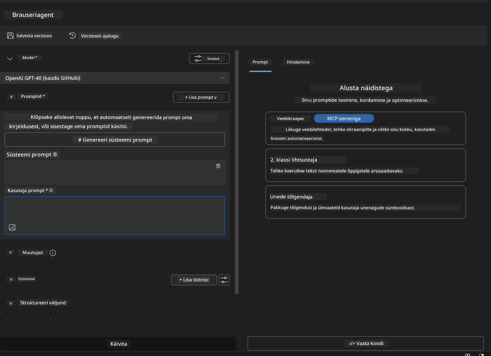

### 🔧 Faas 2: MCP integratsiooni töövoog

#### Samm 3: MCP serveri integratsiooni lisamine
1. **Liigu tööriistade sektsiooni** Agent Builderis
2. **Klõpsa "Lisa tööriist"**, et avada integratsioonimenüü
3. **Vali "MCP Server"** saadaolevate valikute hulgast

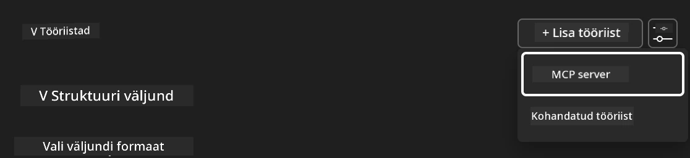

**🔍 Tööriistade tüüpide mõistmine:**
- **Sisseehitatud tööriistad**: Eelkonfigureeritud AI Toolkiti funktsioonid
- **MCP serverid**: Väliste teenuste integratsioonid
- **Kohandatud API-d**: Sinu enda teenuse lõpp-punktid
- **Funktsioonide kutsumine**: Mudeli otsene funktsioonide kasutamine

#### Samm 4: MCP serveri valik
1. **Vali "MCP Server"**, et jätkata


2. **Sirvi MCP kataloogi**, et uurida saadaolevaid integratsioone
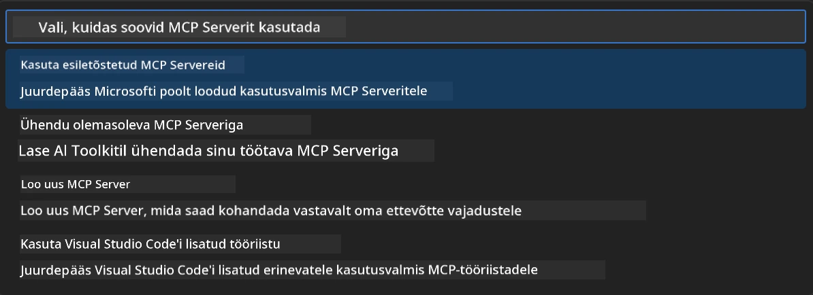

### 🎮 Faas 3: Playwright MCP konfigureerimine

#### Samm 5: Playwrighti valimine ja seadistamine
1. **Klõpsa "Kasuta esiletõstetud MCP servereid"**, et pääseda Microsofti kontrollitud serveritele
2. **Vali "Playwright"** esiletõstetud nimekirjast
3. **Aktsepteeri vaikimisi MCP ID** või kohanda vastavalt oma keskkonnale

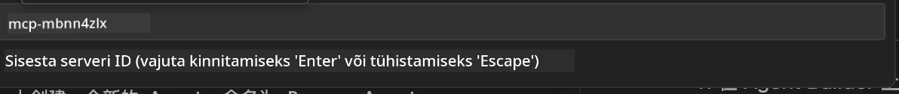

#### Samm 6: Playwrighti võimekuste lubamine
**🔑 Oluline samm**: Vali **KÕIK** saadaolevad Playwrighti meetodid maksimaalse funktsionaalsuse jaoks

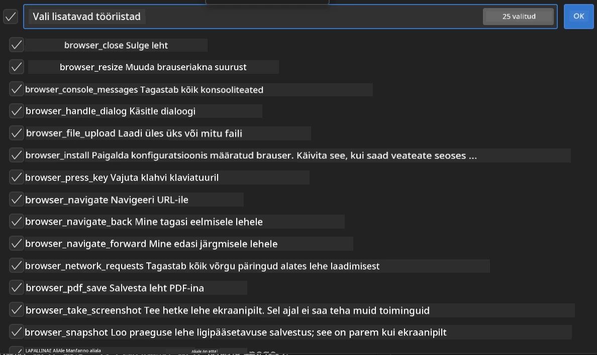

**🛠️ Olulised Playwrighti tööriistad:**
- **Navigeerimine**: `goto`, `goBack`, `goForward`, `reload`
- **Interaktsioon**: `click`, `fill`, `press`, `hover`, `drag`
- **Ekstraktsioon**: `textContent`, `innerHTML`, `getAttribute`
- **Valideerimine**: `isVisible`, `isEnabled`, `waitForSelector`
- **Pildistamine**: `screenshot`, `pdf`, `video`
- **Võrk**: `setExtraHTTPHeaders`, `route`, `waitForResponse`

#### Samm 7: Integratsiooni edukuse kontrollimine
**✅ Edu indikaatorid:**
- Kõik tööriistad ilmuvad Agent Builderi liideses
- Integratsioonipaneelil ei ole veateateid
- Playwrighti serveri staatus näitab "Ühendatud"

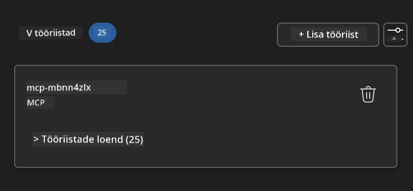

**🔧 Levinud probleemide lahendamine:**
- **Ühendus ebaõnnestus**: Kontrolli internetiühendust ja tulemüüri seadeid
- **Puuduvad tööriistad**: Veendu, et kõik võimekused valiti seadistamise ajal
- **Luba vead**: Kontrolli, et VS Code'il on vajalikud süsteemiload

### 🎯 Faas 4: Täiustatud promptide loomine

#### Samm 8: Nutikate süsteemipromptide kujundamine
Loo keerukad promptid, mis kasutavad Playwrighti täielikku võimekust:

```markdown
# Web Automation Expert System Prompt

## Core Identity
You are an advanced web automation specialist with deep expertise in browser automation, web scraping, and user experience analysis. You have access to Playwright tools for comprehensive browser control.

## Capabilities & Approach
### Navigation Strategy
- Always start with screenshots to understand page layout
- Use semantic selectors (text content, labels) when possible
- Implement wait strategies for dynamic content
- Handle single-page applications (SPAs) effectively

### Error Handling
- Retry failed operations with exponential backoff
- Provide clear error descriptions and solutions
- Suggest alternative approaches when primary methods fail
- Always capture diagnostic screenshots on errors

### Data Extraction
- Extract structured data in JSON format when possible
- Provide confidence scores for extracted information
- Validate data completeness and accuracy
- Handle pagination and infinite scroll scenarios

### Reporting
- Include step-by-step execution logs
- Provide before/after screenshots for verification
- Suggest optimizations and alternative approaches
- Document any limitations or edge cases encountered

## Ethical Guidelines
- Respect robots.txt and rate limiting
- Avoid overloading target servers
- Only extract publicly available information
- Follow website terms of service
```

#### Samm 9: Dünaamiliste kasutajapromptide loomine
Kujunda promptid, mis demonstreerivad erinevaid võimekusi:

**🌐 Veebianalüüsi näide:**
```markdown
Navigate to github.com/kinfey and provide a comprehensive analysis including:
1. Repository structure and organization
2. Recent activity and contribution patterns  
3. Documentation quality assessment
4. Technology stack identification
5. Community engagement metrics
6. Notable projects and their purposes

Include screenshots at key steps and provide actionable insights.
```

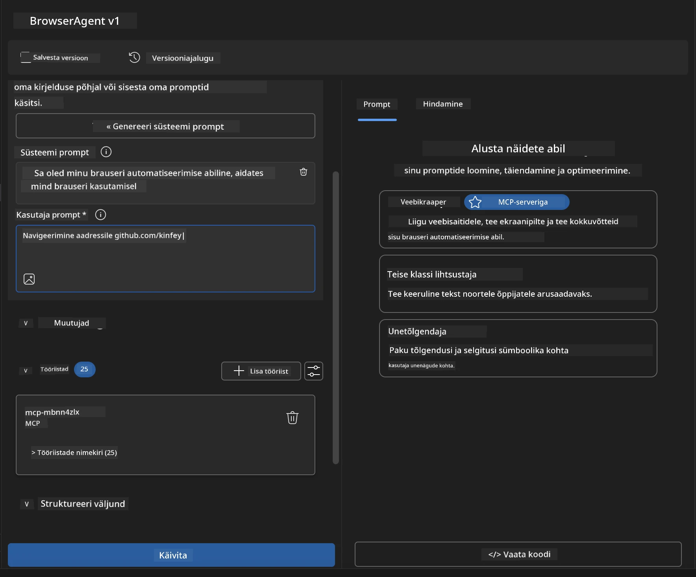

### 🚀 Faas 5: Käivitamine ja testimine

#### Samm 10: Esimese automatiseerimise käivitamine
1. **Klõpsa "Käivita"**, et käivitada automatiseerimise järjestus
2. **Jälgi reaalajas täitmist**:
   - Chrome'i brauser käivitub automaatselt
   - Agent navigeerib sihtveebisaidile
   - Ekraanipildid salvestavad iga suurema sammu
   - Analüüsi tulemused voogesitatakse reaalajas

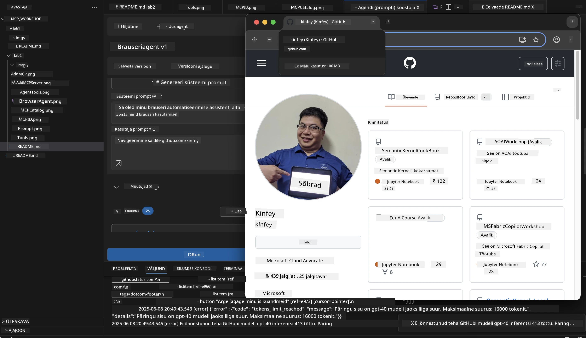

#### Samm 11: Tulemuste ja ülevaadete analüüs
Vaata põhjalikku analüüsi Agent Builderi liideses:

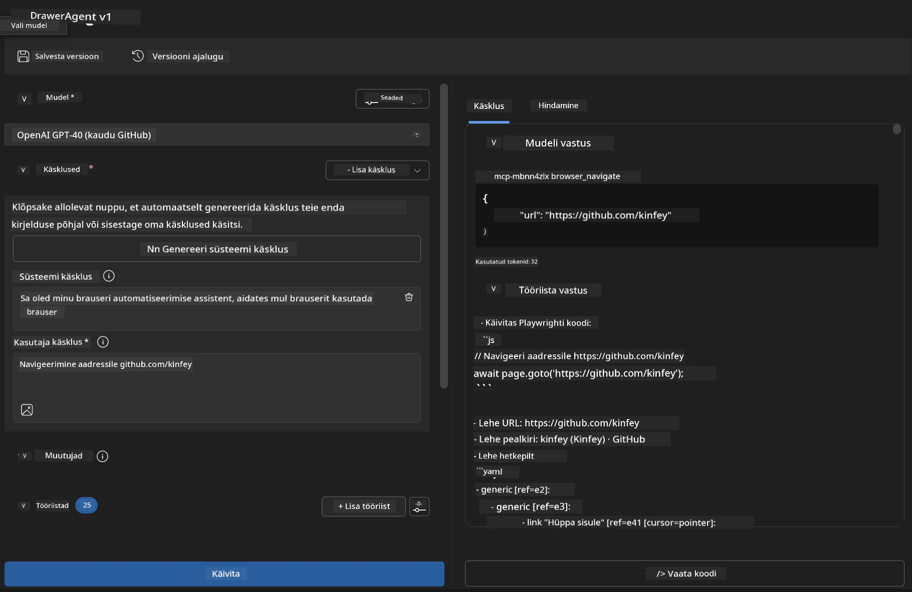

### 🌟 Faas 6: Täiustatud võimekused ja juurutamine

#### Samm 12: Eksport ja tootmiskeskkonna juurutamine
Agent Builder toetab mitmeid juurutamisvõimalusi:

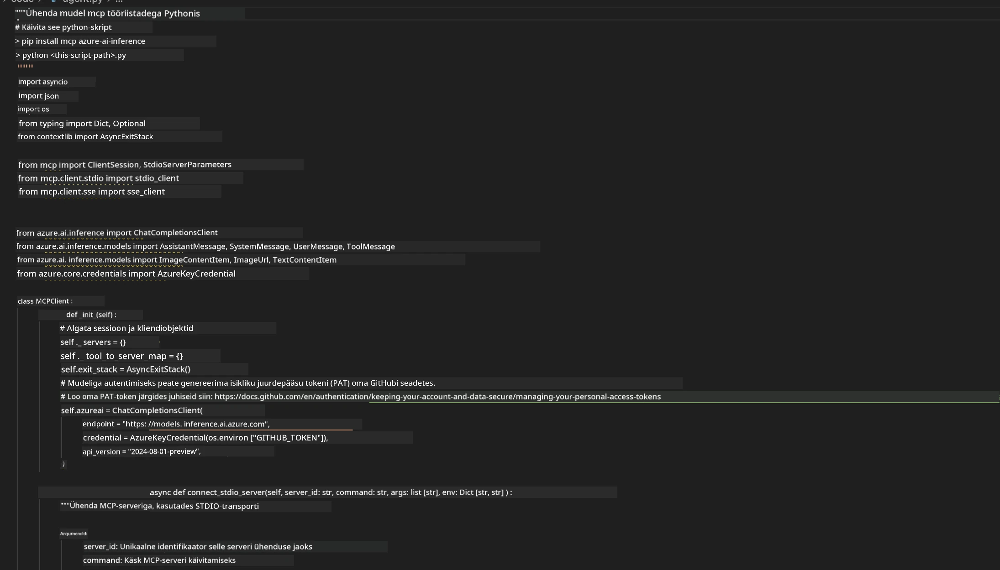

## 🎓 Moodul 2 kokkuvõte ja järgmised sammud

### 🏆 Saavutus saavutatud: MCP integratsiooni meister

**✅ Omandatud oskused:**
- [ ] MCP arhitektuuri ja eeliste mõistmine
- [ ] Microsofti MCP serverite ökosüsteemi navigeerimine
- [ ] Playwright MCP integreerimine AI Toolkitiga
- [ ] Täiustatud brauseri automatiseerimise agentide loomine
- [ ] Täiustatud promptide loomine veebiautomatiseerimiseks

### 📚 Lisamaterjalid

- **🔗 MCP spetsifikatsioon**: [Ametlik protokolli dokumentatsioon](https://modelcontextprotocol.io/)
- **🛠️ Playwright API**: [Täielik meetodite viide](https://playwright.dev/docs/api/class-playwright)
- **🏢 Microsofti MCP serverid**: [Ettevõtte integratsiooni juhend](https://github.com/microsoft/mcp-servers)
- **🌍 Kogukonna näited**: [MCP serverite galerii](https://github.com/modelcontextprotocol/servers)

**🎉 Palju õnne!** Oled edukalt omandanud MCP integratsiooni ja suudad nüüd luua tootmiskeskkonna jaoks valmis AI agente, millel on väliste tööriistade võimekus!

### 🔜 Jätka järgmise mooduliga

Valmis MCP oskusi järgmisele tasemele viima? Jätka **[Moodul 3: Täiustatud MCP arendus AI Toolkitiga](../lab3/README.md)**, kus õpid:
- Looma oma kohandatud MCP servereid
- Konfigureerima ja kasutama uusimat MCP Python SDK-d
- Seadistama MCP Inspectorit silumiseks
- Valdama MCP serverite arendamise täiustatud töövooge
- Ehita ilmastiku MCP server nullist

---

**Lahtiütlus**:  
See dokument on tõlgitud AI tõlketeenuse [Co-op Translator](https://github.com/Azure/co-op-translator) abil. Kuigi püüame tagada täpsust, palume arvestada, et automaatsed tõlked võivad sisaldada vigu või ebatäpsusi. Algne dokument selle algses keeles tuleks pidada autoriteetseks allikaks. Olulise teabe puhul soovitame kasutada professionaalset inimtõlget. Me ei vastuta selle tõlke kasutamisest tulenevate arusaamatuste või valesti tõlgenduste eest.