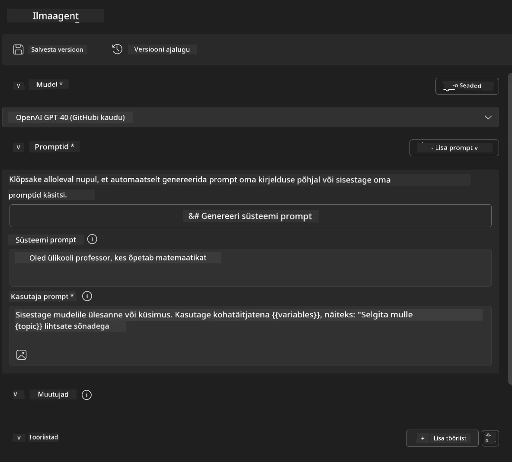
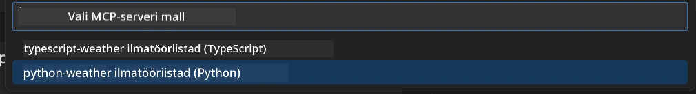
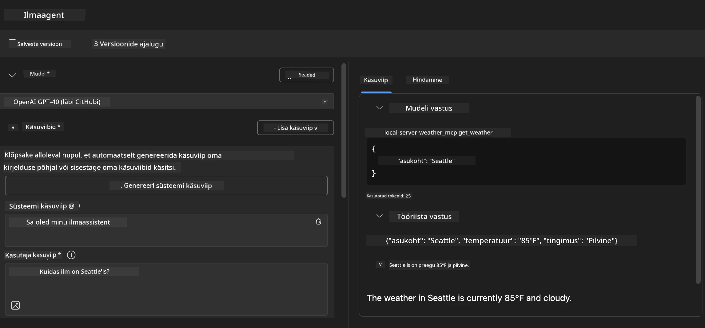
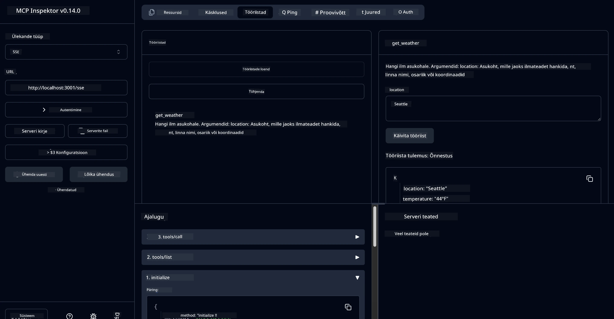

# 🔧 Moodul 3: Täiustatud MCP arendus AI tööriistakomplektiga


## 🎯 Õpieesmärgid

Selle labori lõpuks suudad:

- ✅ Luua kohandatud MCP servereid, kasutades AI tööriistakomplekti
- ✅ Konfigureerida ja kasutada uusimat MCP Python SDK-d (v1.9.3)
- ✅ Seadistada ja kasutada MCP Inspectori tööriista silumiseks
- ✅ Siluda MCP servereid nii Agent Builderi kui ka Inspectori keskkonnas
- ✅ Mõista täiustatud MCP serveri arenduse töövooge

## 📋 Eeltingimused

- Labori 2 (MCP põhialused) läbimine
- VS Code koos AI tööriistakomplekti laiendusega
- Python 3.10+ keskkond
- Node.js ja npm Inspectori seadistamiseks

## 🏗️ Mida sa ehitad

Selles laboris lood **Ilma MCP serveri**, mis demonstreerib:
- Kohandatud MCP serveri rakendamist
- Integratsiooni AI tööriistakomplekti Agent Builderiga
- Professionaalseid silumisvooge
- Kaasaegseid MCP SDK kasutusmustreid

---

## 🔧 Põhikomponentide ülevaade

### 🐍 MCP Python SDK
Model Context Protocol Python SDK on aluseks kohandatud MCP serverite loomisel. Kasutame versiooni 1.9.3, mis pakub täiustatud silumisvõimalusi.

### 🔍 MCP Inspector
Võimas silumisvahend, mis pakub:
- Reaalajas serveri jälgimist
- Tööriistade täitmise visualiseerimist
- Võrgutaotluste ja vastuste analüüsi
- Interaktiivset testimiskeskkonda

---

## 📖 Samm-sammuline juhend

### Samm 1: Loo Agent Builderis WeatherAgent

1. **Käivita Agent Builder** VS Code'is AI tööriistakomplekti laienduse kaudu
2. **Loo uus agent** järgmiste seadistustega:
   - Agendi nimi: `WeatherAgent`



### Samm 2: Algata MCP serveri projekt

1. **Liigu tööriistade juurde** → **Lisa tööriist** Agent Builderis
2. **Vali "MCP Server"** saadaolevate valikute hulgast
3. **Vali "Loo uus MCP Server"**
4. **Vali `python-weather` mall**
5. **Nimeta oma server:** `weather_mcp`



### Samm 3: Ava ja vaata projekti üle

1. **Ava loodud projekt** VS Code'is
2. **Vaata üle projekti struktuur:**
   ```
   weather_mcp/
   ├── src/
   │   ├── __init__.py
   │   └── server.py
   ├── inspector/
   │   ├── package.json
   │   └── package-lock.json
   ├── .vscode/
   │   ├── launch.json
   │   └── tasks.json
   ├── pyproject.toml
   └── README.md
   ```

### Samm 4: Uuenda MCP SDK uusimale versioonile

> **🔍 Miks uuendada?** Soovime kasutada uusimat MCP SDK-d (v1.9.3) ja Inspectori teenust (0.14.0), et saada paremaid funktsioone ja silumisvõimalusi.

#### 4a. Uuenda Python'i sõltuvused

**Muuda `pyproject.toml`:** uuenda [./code/weather_mcp/pyproject.toml](../../../../10-StreamliningAIWorkflowsBuildingAnMCPServerWithAIToolkit/lab3/code/weather_mcp/pyproject.toml)

#### 4b. Uuenda Inspectori konfiguratsioon

**Muuda `inspector/package.json`:** uuenda [./code/weather_mcp/inspector/package.json](../../../../10-StreamliningAIWorkflowsBuildingAnMCPServerWithAIToolkit/lab3/code/weather_mcp/inspector/package.json)

#### 4c. Uuenda Inspectori sõltuvused

**Muuda `inspector/package-lock.json`:** uuenda [./code/weather_mcp/inspector/package-lock.json](../../../../10-StreamliningAIWorkflowsBuildingAnMCPServerWithAIToolkit/lab3/code/weather_mcp/inspector/package-lock.json)

> **📝 Märkus:** See fail sisaldab ulatuslikke sõltuvuste määratlusi. Allpool on näidatud põhistruktuur - täielik sisu tagab korrektse sõltuvuste lahendamise.

> **⚡ Täielik Package Lock:** Täielik package-lock.json sisaldab ~3000 rida sõltuvuste määratlusi. Ülaltoodu näitab põhistruktuuri - kasutage täieliku sõltuvuste lahendamise jaoks antud faili.

### Samm 5: Konfigureeri VS Code'i silumine

*Märkus: Palun kopeeri fail määratud asukohta, et asendada vastav kohalik fail*

#### 5a. Uuenda käivitamise konfiguratsioon

**Muuda `.vscode/launch.json`:**

```json
{
  "version": "0.2.0",
  "configurations": [
    {
      "name": "Attach to Local MCP",
      "type": "debugpy",
      "request": "attach",
      "connect": {
        "host": "localhost",
        "port": 5678
      },
      "presentation": {
        "hidden": true
      },
      "internalConsoleOptions": "neverOpen",
      "postDebugTask": "Terminate All Tasks"
    },
    {
      "name": "Launch Inspector (Edge)",
      "type": "msedge",
      "request": "launch",
      "url": "http://localhost:6274?timeout=60000&serverUrl=http://localhost:3001/sse#tools",
      "cascadeTerminateToConfigurations": [
        "Attach to Local MCP"
      ],
      "presentation": {
        "hidden": true
      },
      "internalConsoleOptions": "neverOpen"
    },
    {
      "name": "Launch Inspector (Chrome)",
      "type": "chrome",
      "request": "launch",
      "url": "http://localhost:6274?timeout=60000&serverUrl=http://localhost:3001/sse#tools",
      "cascadeTerminateToConfigurations": [
        "Attach to Local MCP"
      ],
      "presentation": {
        "hidden": true
      },
      "internalConsoleOptions": "neverOpen"
    }
  ],
  "compounds": [
    {
      "name": "Debug in Agent Builder",
      "configurations": [
        "Attach to Local MCP"
      ],
      "preLaunchTask": "Open Agent Builder",
    },
    {
      "name": "Debug in Inspector (Edge)",
      "configurations": [
        "Launch Inspector (Edge)",
        "Attach to Local MCP"
      ],
      "preLaunchTask": "Start MCP Inspector",
      "stopAll": true
    },
    {
      "name": "Debug in Inspector (Chrome)",
      "configurations": [
        "Launch Inspector (Chrome)",
        "Attach to Local MCP"
      ],
      "preLaunchTask": "Start MCP Inspector",
      "stopAll": true
    }
  ]
}
```

**Muuda `.vscode/tasks.json`:**

```
{
  "version": "2.0.0",
  "tasks": [
    {
      "label": "Start MCP Server",
      "type": "shell",
      "command": "python -m debugpy --listen 127.0.0.1:5678 src/__init__.py sse",
      "isBackground": true,
      "options": {
        "cwd": "${workspaceFolder}",
        "env": {
          "PORT": "3001"
        }
      },
      "problemMatcher": {
        "pattern": [
          {
            "regexp": "^.*$",
            "file": 0,
            "location": 1,
            "message": 2
          }
        ],
        "background": {
          "activeOnStart": true,
          "beginsPattern": ".*",
          "endsPattern": "Application startup complete|running"
        }
      }
    },
    {
      "label": "Start MCP Inspector",
      "type": "shell",
      "command": "npm run dev:inspector",
      "isBackground": true,
      "options": {
        "cwd": "${workspaceFolder}/inspector",
        "env": {
          "CLIENT_PORT": "6274",
          "SERVER_PORT": "6277",
        }
      },
      "problemMatcher": {
        "pattern": [
          {
            "regexp": "^.*$",
            "file": 0,
            "location": 1,
            "message": 2
          }
        ],
        "background": {
          "activeOnStart": true,
          "beginsPattern": "Starting MCP inspector",
          "endsPattern": "Proxy server listening on port"
        }
      },
      "dependsOn": [
        "Start MCP Server"
      ]
    },
    {
      "label": "Open Agent Builder",
      "type": "shell",
      "command": "echo ${input:openAgentBuilder}",
      "presentation": {
        "reveal": "never"
      },
      "dependsOn": [
        "Start MCP Server"
      ],
    },
    {
      "label": "Terminate All Tasks",
      "command": "echo ${input:terminate}",
      "type": "shell",
      "problemMatcher": []
    }
  ],
  "inputs": [
    {
      "id": "openAgentBuilder",
      "type": "command",
      "command": "ai-mlstudio.agentBuilder",
      "args": {
        "initialMCPs": [ "local-server-weather_mcp" ],
        "triggeredFrom": "vsc-tasks"
      }
    },
    {
      "id": "terminate",
      "type": "command",
      "command": "workbench.action.tasks.terminate",
      "args": "terminateAll"
    }
  ]
}
```


---

## 🚀 MCP serveri käivitamine ja testimine

### Samm 6: Paigalda sõltuvused

Pärast konfiguratsioonimuudatuste tegemist käivita järgmised käsud:

**Paigalda Python'i sõltuvused:**
```bash
uv sync
```

**Paigalda Inspectori sõltuvused:**
```bash
cd inspector
npm install
```

### Samm 7: Silumine Agent Builderiga

1. **Vajuta F5** või kasuta **"Debug in Agent Builder"** konfiguratsiooni
2. **Vali ühendatud konfiguratsioon** silumispaneelilt
3. **Oota, kuni server käivitub** ja Agent Builder avaneb
4. **Testi oma ilma MCP serverit** loomuliku keele päringutega

Sisesta näiteks selline päring

SYSTEM_PROMPT

```
You are my weather assistant
```

USER_PROMPT

```
How's the weather like in Seattle
```



### Samm 8: Silumine MCP Inspectoriga

1. **Kasuta "Debug in Inspector"** konfiguratsiooni (Edge või Chrome)
2. **Ava Inspectori liides** aadressil `http://localhost:6274`
3. **Uuri interaktiivset testimiskeskkonda:**
   - Vaata saadaolevaid tööriistu
   - Testi tööriistade täitmist
   - Jälgi võrgutaotlusi
   - Silu serveri vastuseid



---

## 🎯 Peamised õpitulemused

Selle labori läbimisega oled:

- [x] **Loonud kohandatud MCP serveri** AI tööriistakomplekti mallide abil
- [x] **Uuendanud MCP SDK uusimale versioonile** (v1.9.3) täiustatud funktsionaalsuse jaoks
- [x] **Konfigureerinud professionaalsed silumisvood** nii Agent Builderi kui ka Inspectori jaoks
- [x] **Seadistanud MCP Inspectori** interaktiivseks serveri testimiseks
- [x] **Omandanud VS Code'i silumiskonfiguratsioonid** MCP arenduseks

## 🔧 Uuritud täiustatud funktsioonid

| Funktsioon | Kirjeldus | Kasutusjuht |
|------------|-----------|-------------|
| **MCP Python SDK v1.9.3** | Uusim protokolli rakendus | Kaasaegne serveriarendus |
| **MCP Inspector 0.14.0** | Interaktiivne silumisvahend | Reaalajas serveri testimine |
| **VS Code'i silumine** | Integreeritud arenduskeskkond | Professionaalne silumisvoog |
| **Agent Builderi integratsioon** | Otsene AI tööriistakomplekti ühendus | Lõpp-to-lõpp agendi testimine |

## 📚 Lisamaterjalid

- [MCP Python SDK dokumentatsioon](https://modelcontextprotocol.io/docs/sdk/python)
- [AI tööriistakomplekti juhend](https://code.visualstudio.com/docs/ai/ai-toolkit)
- [VS Code'i silumise dokumentatsioon](https://code.visualstudio.com/docs/editor/debugging)
- [Model Context Protocol spetsifikatsioon](https://modelcontextprotocol.io/docs/concepts/architecture)

---

**🎉 Palju õnne!** Oled edukalt lõpetanud Labori 3 ja oskad nüüd luua, siluda ja juurutada kohandatud MCP servereid, kasutades professionaalseid arendustöövooge.

### 🔜 Jätka järgmise mooduliga

Valmis rakendama oma MCP oskusi reaalses arendustöös? Jätka **[Moodul 4: Praktiline MCP arendus - kohandatud GitHubi klooniserver](../lab4/README.md)**, kus sa:
- Lood tootmiskõlbuliku MCP serveri, mis automatiseerib GitHubi repositooriumi toiminguid
- Rakendad GitHubi repositooriumi kloonimise funktsionaalsust MCP kaudu
- Integreerid kohandatud MCP serverid VS Code'i ja GitHub Copilot Agent Mode'iga
- Testid ja juurutad kohandatud MCP servereid tootmiskeskkondades
- Õpid praktilist töövoo automatiseerimist arendajatele

---

**Lahtiütlus**:  
See dokument on tõlgitud, kasutades AI tõlketeenust [Co-op Translator](https://github.com/Azure/co-op-translator). Kuigi püüame tagada täpsust, palun arvestage, et automaatsed tõlked võivad sisaldada vigu või ebatäpsusi. Algne dokument selle algkeeles tuleks lugeda autoriteetseks allikaks. Olulise teabe puhul on soovitatav kasutada professionaalset inimtõlget. Me ei vastuta selle tõlke kasutamisest tulenevate arusaamatuste või valede tõlgenduste eest.