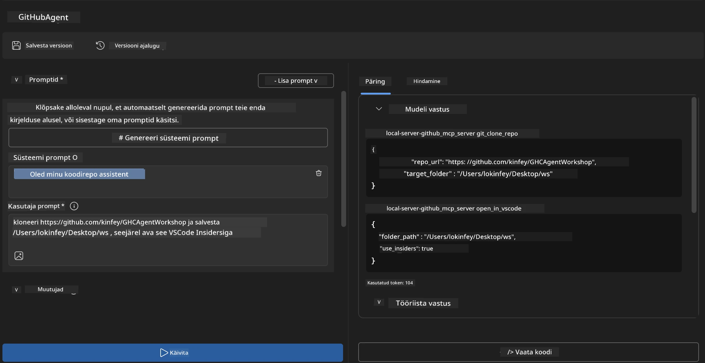
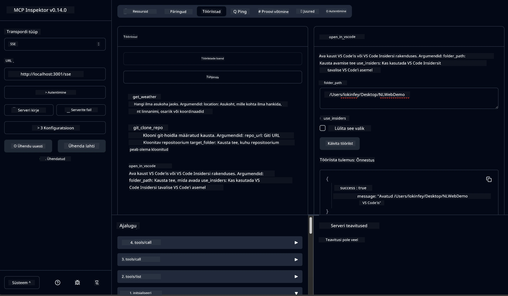

# 🐙 Moodul 4: Praktiline MCP arendus - Kohandatud GitHub klooniserver


> **⚡ Kiire alustamine:** Ehitage tootmiseks valmis MCP server, mis automatiseerib GitHubi hoidlate kloonimise ja VS Code integratsiooni vaid 30 minutiga!

## 🎯 Õpieesmärgid

Selle labori lõpuks oskad:

- ✅ Luua kohandatud MCP server reaalse maailma arendustöövoogude jaoks
- ✅ Rakendada GitHubi hoidlate kloonimise funktsionaalsust MCP kaudu
- ✅ Integreerida kohandatud MCP serverid VS Code’i ja Agent Builderiga
- ✅ Kasutada GitHub Copilot Agent Mode’i koos kohandatud MCP tööriistadega
- ✅ Testida ja juurutada kohandatud MCP servereid tootmiskeskkondades

## 📋 Eeldused

- Labide 1-3 läbimine (MCP alused ja edasijõudnud arendus)
- GitHub Copilot tellimus ([saadaval tasuta registreerumine](https://github.com/github-copilot/signup))
- VS Code koos AI Toolkit ja GitHub Copilot laiendustega
- Git käsurea liides installitud ja seadistatud

## 🏗️ Projekti ülevaade

### **Reaalse maailma arenduse väljakutse**
Arendajatena kasutame tihti GitHubi hoidlate kloonimiseks ning nende avamiseks VS Code’is või VS Code Insidersis. See käsitsi protsess hõlmab:
1. Terminali/käsuviiba avamist
2. Soovitava kataloogi navigeerimist
3. `git clone` käsu käivitamist
4. VS Code’i avamist kloonitud kataloogis

**Meie MCP lahendus muudab selle üheks nutikaks käsuks!**

### **Mida Sa ehitad**
**GitHub Clone MCP Serveri** (`git_mcp_server`), mis pakub:

| Funktsioon | Kirjeldus | Kasu |
|---------|-------------|---------|
| 🔄 **Nutikas hoidla kloonimine** | GitHubi hoidlate kloonimine valideerimisega | Automaatne vigade kontroll |
| 📁 **Nutikas kataloogihaldus** | Kontrollib ja loob katalooge turvaliselt | Vältib ülekirjutamist |
| 🚀 **Platvormideülene VS Code integratsioon** | Projektide avamine VS Code’is/Insidersis | Sujuv töövoo üleminek |
| 🛡️ **Tugev vigade käsitlemine** | Võrgustiku, õiguste ja tee probleemide lahendamine | Tootmiskõlbulik töökindlus |

---

## 📖 Samm-sammult teostus

### Samm 1: Loo GitHub Agent Agent Builderis

1. **Käivita Agent Builder** läbi AI Toolkit laienduse
2. **Loo uus agent** järgmise konfiguratsiooniga:
   ```
   Agent Name: GitHubAgent
   ```

3. **Initsialiseeri kohandatud MCP server:**
   - Navigeeri **Tools** → **Add Tool** → **MCP Server**
   - Vali **"Create A new MCP Server"**
   - Vali **Python mall** maksimaalse paindlikkuse jaoks
   - **Serveri nimi:** `git_mcp_server`

### Samm 2: Sea sisse GitHub Copilot Agent Mode

1. **Ava GitHub Copilot** VS Code’is (Ctrl/Cmd + Shift + P → "GitHub Copilot: Open")
2. **Vali Agent Model** Copilot liideses
3. **Vali Claude 3.7 mudel** täiustatud loogikavõimete tõttu
4. **Luba MCP integratsioon** tööriistadele ligipääsu jaoks

> **💡 Näpunäide:** Claude 3.7 pakub paremat arusaamist arendusvoogudest ja veakäsitluse mustritest.

### Samm 3: Rakenda põhifunktsioonid MCP serverisse

**Kasuta järgmist detailset prompti GitHub Copilot Agent Mode’is:**

```
Create two MCP tools with the following comprehensive requirements:

🔧 TOOL A: clone_repository
Requirements:
- Clone any GitHub repository to a specified local folder
- Return the absolute path of the successfully cloned project
- Implement comprehensive validation:
  ✓ Check if target directory already exists (return error if exists)
  ✓ Validate GitHub URL format (https://github.com/user/repo)
  ✓ Verify git command availability (prompt installation if missing)
  ✓ Handle network connectivity issues
  ✓ Provide clear error messages for all failure scenarios

🚀 TOOL B: open_in_vscode
Requirements:
- Open specified folder in VS Code or VS Code Insiders
- Cross-platform compatibility (Windows/Linux/macOS)
- Use direct application launch (not terminal commands)
- Auto-detect available VS Code installations
- Handle cases where VS Code is not installed
- Provide user-friendly error messages

Additional Requirements:
- Follow MCP 1.9.3 best practices
- Include proper type hints and documentation
- Implement logging for debugging purposes
- Add input validation for all parameters
- Include comprehensive error handling
```

### Samm 4: Testi oma MCP serverit

#### 4a. Testi Agent Builderis

1. **Käivita debug konfiguratsioon** Agent Builderis
2. **Seadista agent järgnevate süsteemipromptidega:**

```
SYSTEM_PROMPT:
You are my intelligent coding repository assistant. You help developers efficiently clone GitHub repositories and set up their development environment. Always provide clear feedback about operations and handle errors gracefully.
```

3. **Testi realistlike kasutajastsenaariumitega:**

```
USER_PROMPT EXAMPLES:

Scenario : Basic Clone and Open
"Clone {Your GitHub Repo link such as https://github.com/kinfey/GHCAgentWorkshop
 } and save to {The global path you specify}, then open it with VS Code Insiders"
```



**Oodatud tulemused:**
- ✅ Edukas kloonimine koos tee kinnitusega
- ✅ Automaatne VS Code avamine
- ✅ Selged veateated vigaste stsenaariumide korral
- ✅ Servajuhtumite korrektne käsitlemine

#### 4b. Testi MCP Inspectoris



---

**🎉 Palju õnne!** Sa oled edukalt loonud praktilise, tootmiseks valmis MCP serveri, mis lahendab reaalseid arendusvoogude väljakutseid. Sinu kohandatud GitHub klooniserver demonstreerib MCP võimsust arendaja tootlikkuse automatiseerimisel ja parandamisel.

### 🏆 Saavutus avatud:
- ✅ **MCP Arendaja** - Loodud kohandatud MCP server
- ✅ **Töövoo Automaatne** - Tänu lihtsustatud arendusprotsessidele  
- ✅ **Integratsiooni Ekspert** - Ühendatud mitmeid arendustööriistu
- ✅ **Tootmiskõlbulik** - Ehitatud juurutatavad lahendused

---

## 🎓 Töötuba lõpetatud: Sinu teekond Model Context Protokolliga

**Lugupeetud töötuba osaleja,**

Palju õnne Model Context Protokoll töötuba kõigi nelja mooduli läbimise puhul! Sa oled jõudnud pikk tee AI Toolkiti põhikonseptsioonide mõistmisest tootmiseks valmis MCP serverite loomiseni, mis lahendavad reaalseid arendusprobleeme.

### 🚀 Sinu õppeteekond kokkuvõttes:

**[Moodul 1](../lab1/README.md)**: Sa alustasid AI Toolkiti alustest, mudelite testimisest ja esimese AI agendi loomisest.

**[Moodul 2](../lab2/README.md)**: Õppisid MCP arhitektuuri, integreerisid Playwright MCP ja ehitasid esimese brauseriautomaatika agendi.

**[Moodul 3](../lab3/README.md)**: Arendasid kohandatud MCP serverit koos Weather MCP serveriga ja valdasid silumise tööriistu.

**[Moodul 4](../lab4/README.md)**: Kasutasid kõike õpitut, et luua praktiline GitHubi hoidla töövoo automatiseerimise tööriist.

### 🌟 Mida Sa oled valdama õppinud:

- ✅ **AI Toolkiti ökosüsteem**: Mudelid, agendid ja integratsioonimustrid
- ✅ **MCP arhitektuur**: Klient-server disain, transpordiprotokollid ja turvalisus
- ✅ **Arendustööriistad**: Playground-ist Inspector-ini ja tootmisjuurutuseni
- ✅ **Kohandatud arendus**: Oma MCP serverite ehitamine, testimine ja juurutamine
- ✅ **Praktilised rakendused**: AI abil reaalse maailma töövoogude lahendamine

### 🔮 Sinu järgmised sammud:

1. **Ehita oma MCP server**: Kasuta oskusi oma unikaalsete töövoogude automatiseerimiseks
2. **Liitu MCP kogukonnaga**: Jaga oma loodud lahendusi ja õpi teistelt
3. **Uuri edasi arenenud integratsioone**: Ühenda MCP servereid ettevõtte süsteemidega
4. **Panusta avatud lähtekoodi**: Aita parandada MCP tööriistu ja dokumentatsiooni

Pea meeles, et see töötuba on alles algus. Model Context Protocol ökosüsteem areneb kiiresti ning nüüd oled varustatud olema AI-jõuliste arendustööriistade esirinnas.

**Täname osalemise ja pühendumise eest õppimisel!**

Loodame, et see töötuba on süstinud ideid, mis muudavad su AI tööriistadega suhtlemist ja ehitamist arendusteekonnal.

**Head kodeerimist!**

---

## Mis järgmiseks

Palju õnne, et lõpetasid kõik labid Moodulis 10!

- Tagasi: [Moodul 10 Ülevaade](../README.md)
- Jätka: [Moodul 11: MCP serveri praktilised labid](../../11-MCPServerHandsOnLabs/README.md)

---

<!-- CO-OP TRANSLATOR DISCLAIMER START -->
**Vastutusest loobumine**:
See dokument on tõlgitud kasutades tehisintellektil põhinevat tõlke teenust [Co-op Translator](https://github.com/Azure/co-op-translator). Kuigi püüame tagada täpsust, võib automaatne tõlge sisaldada vigu või ebatäpsusi. Originaaldokument selle emakeeles tuleks pidada usaldusväärseks allikaks. Olulise info puhul soovitatakse kasutada professionaalset inimtõlget. Me ei vastuta selle tõlke kasutamisest tingitud väärarusaamade või valesti mõistmiste eest.
<!-- CO-OP TRANSLATOR DISCLAIMER END -->