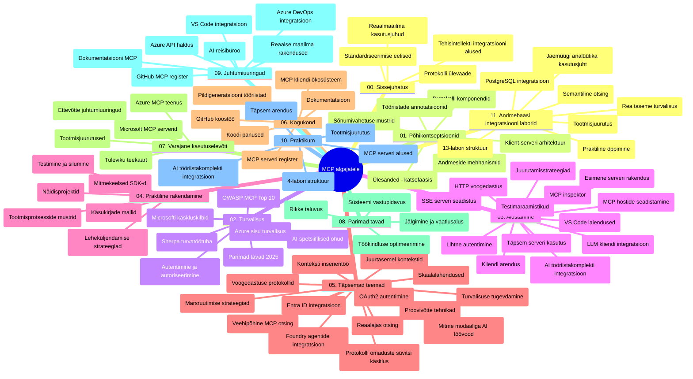

# Mudelikonteksti protokoll (MCP) algajatele - õppejuhend

See õppejuhend annab ülevaate hoidla struktuurist ja sisust kursuse „Mudelikonteksti protokoll (MCP) algajatele“ jaoks. Kasuta seda juhendit, et navigeerida hoidlas tõhusalt ja kasutada maksimaalselt saadaolevaid ressursse.

## Hoidla ülevaade

Mudelikonteksti protokoll (MCP) on standardiseeritud raamistik tehisintellekti mudelite ja kliendirakenduste vaheliseks suhtluseks. Algupäraselt lõi Anthropic, praegu hooldab MCP laiema kogukonna kaudu ametlik GitHubi organisatsioon. See hoidla pakub põhjalikku õppekava praktiliste koodinäidetega C#, Java, JavaScripti, Pythoni ja TypeScripti keeltes, mis on mõeldud tehisintellekti arendajatele, süsteemiarhitektidele ja tarkvarainseneridele.

## Visuaalne õppekava kaart

## Hoidla struktuur

Hoidla on korraldatud üheteistkümne peamise sektsiooni alla, millest igaüks keskendub MCP erinevatele aspektidele:

1. **Sissejuhatus (00-Introduction/)**
   - Mudelikonteksti protokolli ülevaade
   - Miks on standardiseerimine tehisintellekti voogudes oluline
   - Praktilised kasutusjuhud ja eelised

2. **Põhikontseptsioonid (01-CoreConcepts/)**
   - Kliendi-teenuse arhitektuur
   - Peamised protokolli komponendid
   - Sõnumivahetuse mustrid MCP-s

3. **Turvalisus (02-Security/)**
   - Rünnakud MCP-põhistes süsteemides
   - Parimad praktikad turvalisuse tagamiseks
   - Autentimise ja autoriseerimise strateegiad
   - **Põhjalik turvalisuse dokumentatsioon**:
     - MCP turvaparimad praktikad 2025
     - Azure sisu turvalisuse rakendamise juhend
     - MCP turvakontrollid ja tehnikad
     - MCP parimate praktikate kiire ülevaade
   - **Olulised turvateemad**:
     - Prompti süstimine ja tööriista mürgitamise rünnakud
     - Sessioonikaaperdamine ja segaduses vahendaja probleemid
     - Sisselogimisandmete läbipääsu haavatavused
     - Liigne õiguste tase ja juurdepääsukontroll
     - Tarneahela turvalisus AI komponentidele
     - Microsoft Prompt Shields integratsioon

4. **Algus (03-GettingStarted/)**
   - Keskkonna seadistamine ja konfigureerimine
   - Põhiliste MCP serverite ja klientide loomine
   - Integreerimine olemasolevate rakendustega
   - Sisaldab jaotisi:
     - Esimene serveri rakendus
     - Kliendi arendus
     - LLM kliendi integratsioon
     - VS Code integreerimine
     - Server-Sent Events (SSE) server
     - Täiustatud serverikasutus
     - HTTP voogedastus
     - AI tööriistakomplekti integratsioon
     - Testimise strateegiad
     - Deployment juhised

5. **Praktiline rakendamine (04-PracticalImplementation/)**
   - SDK-de kasutamine erinevates programmeerimiskeeltes
   - Silumine, testimine ja valideerimine
   - Taaskasutatavate prompti mallide ja töösuundade loomine
   - Näidiste projektid koos rakendusnäidetega

6. **Täiustatud teemad (05-AdvancedTopics/)**
   - Konteksti insenertehnika meetodid
   - Foundry agendi integratsioon
   - Mitmemodaalsed AI töösuundad
   - OAuth2 autentimise demo
   - Reaalaegne otsinguvõimekus
   - Reaalaegne voogedastus
   - Juurekonktekstide rakendamine
   - Marsruutimise strateegiad
   - Valimismeetodid
   - Skaleerimise lähenemised
   - Turvalisuse kaalutlused
   - Entra ID turvakinnituse integratsioon
   - Veebiotsingu integratsioon

7. **Kogukonna panused (06-CommunityContributions/)**
   - Kuidas anda panus koodi ja dokumentatsiooni kaudu
   - Koostöö GitHubi platvormil
   - Kogukonna algatatud täiustused ja tagasiside
   - Mitmesuguste MCP klientide kasutamine (Claude Desktop, Cline, VSCode)
   - Populaarsete MCP serveritega töötamine, sealhulgas pildigeneratsioon

8. **Varajaste kasutajate õppetunnid (07-LessonsfromEarlyAdoption/)**
   - Tõelised rakendused ja edulood
   - MCP-põhiste lahenduste loomine ja juurutamine
   - Trendide ja tuleviku tegevusplaani ülevaade
   - **Microsoft MCP serverite juhend**: põhjalik juhend kümne tootmiskõlbuliku Microsofti MCP serveri kohta, sealhulgas:
     - Microsoft Learn Docs MCP server
     - Azure MCP server (15+ spetsialiseeritud pistikut)
     - GitHub MCP server
     - Azure DevOps MCP server
     - MarkItDown MCP server
     - SQL Server MCP server
     - Playwright MCP server
     - Dev Box MCP server
     - Azure AI Foundry MCP server
     - Microsoft 365 Agents Toolkit MCP server

9. **Parimad praktikad (08-BestPractices/)**
   - Jõudluse häälestamine ja optimeerimine
   - Vigade taluvate MCP süsteemide disain
   - Testimise ja vastupidavuse strateegiad

10. **Juhtumiuuringud (09-CaseStudy/)**
    - **Seitse põhjalikku juhtumiuuringut**, mis demonstreerivad MCP paindlikkust eri stsenaariumites:
    - **Azure AI reisiesindajad**: mitme agendi orkestreerimine Azure OpenAI ja AI Search abil
    - **Azure DevOps integratsioon**: töövoo automatiseerimine YouTube andmete uuendustega
    - **Reaalaegne dokumentatsiooni päring**: Python konsooliklient koos HTTP voogedastusega
    - **Interaktiivne õppekava generaator**: Chainlit veebirakendus vestlusliku AI-ga
    - **Redaktorisisesed dokumentatsioonid**: VS Code integreerimine GitHub Copiloti töösuundadega
    - **Azure API haldus**: ettevõtte API integratsioon MCP serveri loomisega
    - **GitHub MCP register**: ökosüsteemi arendamine ja agentide integratsiooniplatvorm
    - Rakendusnäited ulatuvad ettevõtte integratsioonist, arendaja produktiivsusest ja ökosüsteemi arendusest

11. **Praktiline töötoa osa (10-StreamliningAIWorkflowsBuildingAnMCPServerWithAIToolkit/)**
    - Põhjalik praktiline töötoa osa MCP ja AI tööriistakomplekti ühendamiseks
    - Intelligentsed rakendused, mis ühendavad AI mudelid reaalse maailma tööriistadega
    - Praktilised moodulid, mis katavad alused, kohandatud serveri arenduse ja tootmisjuurutuse strateegiad
    - **Labide struktuur**:
      - Lab 1: MCP serveri alused
      - Lab 2: Täiustatud MCP serveri arendus
      - Lab 3: AI tööriistakomplekti integratsioon
      - Lab 4: Tootmisjuurutus ja skaleerimine
    - Labipõhine õppeviis samm-sammult juhistega

12. **MCP serveri andmebaasi integratsiooni labid (11-MCPServerHandsOnLabs/)**
    - **Põhjalik 13-labi õppekursus töökindlate MCP serverite loomiseks koos PostgreSQL integratsiooniga**
    - **Tõelise maailma jaemüügi analüütika rakendus Zava Retail kasutusjuhtumiga**
    - **Ettevõtte taseme mustrid**, sealhulgas ridade taseme turvalisus (RLS), semantiline otsing ja mitme kasutaja andmejuurdepääs
    - **Täielik labide struktuur**:
      - **Labid 00-03: Alused** - sissejuhatus, arhitektuur, turvalisus, keskkonna seadistamine
      - **Labid 04-06: MCP serveri ehitamine** - andmebaasi kujundus, MCP serveri rakendamine, tööriistade arendus
      - **Labid 07-09: Täiustatud funktsioonid** - semantiline otsing, testimine ja silumine, VS Code integratsioon
      - **Labid 10-12: Tootmine ja parimad praktikad** - juurutus, jälgimine, optimeerimine
    - **Kaetud tehnoloogiad**: FastMCP raamistik, PostgreSQL, Azure OpenAI, Azure Container Apps, Application Insights
    - **Õpitulemused**: tootmiskõlblikud MCP serverid, andmebaasi integratsioonimustrid, AI-põhine analüütika, ettevõtte taseme turvalisus

## Täiendavad ressursid

Hoidla sisaldab tugivahendeid:

- **Pildikaust**: sisaldab skeeme ja illustratsioone, mida kasutatakse kogu õppekavas
- **Tõlked**: mitmekeelne tugi koos automatiseeritud dokumentatsiooni tõlgetega
- **Ametlikud MCP ressursid**:
  - [MCP dokumentatsioon](https://modelcontextprotocol.io/)
  - [MCP spetsifikatsioon](https://spec.modelcontextprotocol.io/)
  - [MCP GitHubi hoidla](https://github.com/modelcontextprotocol)

## Kuidas seda hoidlat kasutada

1. **Järjestikune õppimine**: järgi peatükke järjekorras (00 kuni 11) struktureeritud õppimise jaoks.
2. **Keelespetsiifiline keskendumine**: kui sind huvitab konkreetne programmeerimiskeel, vaata mustandite katalooge oma eelistatud keeles rakenduste jaoks.
3. **Praktiline rakendamine**: alusta sektsioonist „Algus“, et seadistada keskkond ja luua oma esimene MCP server ja klient.
4. **Täiustatud uurimine**: kui põhitõed on selged, süvene täiustatud teemadesse, et teadmisi laiendada.
5. **Kogukonnaga suhtlemine**: ühine MCP kogukonnaga GitHubi arutelude ja Discordi kanalite kaudu, et suhelda ekspertide ja kaasarendajatega.

## MCP kliendid ja tööriistad

Õppekava katab mitmeid MCP kliente ja tööriistu:

1. **Ametlikud kliendid**:
   - Visual Studio Code
   - MCP Visual Studio Codes
   - Claude Desktop
   - Claude VSCode-is
   - Claude API

2. **Kogukonna kliendid**:
   - Cline (terminalipõhine)
   - Cursor (koodiredaktor)
   - ChatMCP
   - Windsurf

3. **MCP haldustööriistad**:
   - MCP CLI
   - MCP Manager
   - MCP Linker
   - MCP Router

## Populaarsed MCP serverid

Hoidla tutvustab mitmeid MCP servereid, sealhulgas:

1. **Ametlikud Microsofti MCP serverid**:
   - Microsoft Learn Docs MCP server
   - Azure MCP server (15+ spetsialiseeritud pistikut)
   - GitHub MCP server
   - Azure DevOps MCP server
   - MarkItDown MCP server
   - SQL Server MCP server
   - Playwright MCP server
   - Dev Box MCP server
   - Azure AI Foundry MCP server
   - Microsoft 365 Agents Toolkit MCP server

2. **Ametlikud viiteserverid**:
   - Failisüsteem
   - Fetch
   - Mälu
   - Järjestikune mõtlemine

3. **Pildigeneratsioon**:
   - Azure OpenAI DALL-E 3
   - Stable Diffusion WebUI
   - Replicate

4. **Arendustööriistad**:
   - Git MCP
   - Terminal Control
   - Code Assistant

5. **Spetsialiseeritud serverid**:
   - Salesforce
   - Microsoft Teams
   - Jira & Confluence

## Panustamine

See hoidla tervitab kogukonna panuseid. Vaata sektsiooni Kogukonna panused, et saada juhiseid, kuidas efektiivselt MCP ökosüsteemi panustada.

----

*See õppejuhend uuendati viimati 5. veebruaril 2026, kajastades uusimat MCP spetsifikatsiooni 2025-11-25 ning annab hoidla ülevaate seisuga sellel kuupäeval. Hoidla sisu võidakse uuendada pärast seda kuupäeva.*

---

<!-- CO-OP TRANSLATOR DISCLAIMER START -->
**Vastutusest loobumine**:  
See dokument on tõlgitud kasutades tehisintellektil põhinevat tõlke teenust [Co-op Translator](https://github.com/Azure/co-op-translator). Kuigi püüame tagada täpsust, palun arvestage, et automatiseeritud tõlked võivad sisaldada vigu või ebatäpsusi. Originaaldokument selle emakeeles on usaldusväärseks allikaks. Olulise info puhul soovitatakse kasutada professionaalset inimtõlget. Me ei vastuta selle tõlke kasutamisest tingitud arusaamatuste või valesti mõistmiste eest.
<!-- CO-OP TRANSLATOR DISCLAIMER END -->