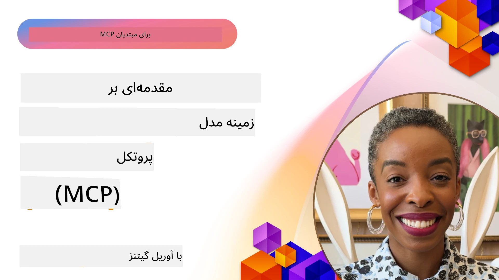
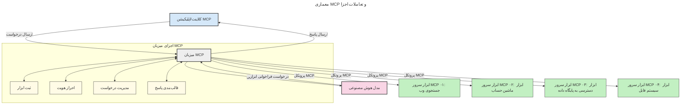

# مقدمه‌ای بر پروتکل مدل کانتکست (MCP): چرا برای برنامه‌های هوش مصنوعی مقیاس‌پذیر اهمیت دارد

[](https://youtu.be/agBbdiOPLQA)

_(برای دیدن ویدیوی این درس روی تصویر بالا کلیک کنید)_

برنامه‌های هوش مصنوعی مولد گامی بزرگ به جلو هستند زیرا اغلب به کاربران اجازه می‌دهند با استفاده از دستورات زبان طبیعی با برنامه تعامل داشته باشند. اما با گذشت زمان و سرمایه‌گذاری منابع بیشتر در چنین برنامه‌هایی، می‌خواهید مطمئن شوید که می‌توانید عملکردها و منابع را به شکلی ساده یکپارچه کنید، به طوری که توسعه‌پذیر باشد، برنامه شما بتواند از چند مدل استفاده کند و پیچیدگی‌های مختلف مدل‌ها را مدیریت کند. به طور خلاصه، ساخت برنامه‌های هوش مصنوعی مولد از ابتدا آسان است، اما با رشد و پیچیده‌تر شدن، باید معماری‌ای تعریف کنید و احتمالاً به استانداردی تکیه کنید تا اطمینان حاصل شود برنامه‌های شما به صورت سازگار ساخته شده‌اند. اینجا است که MCP وارد عمل می‌شود تا همه چیز را سازماندهی و استاندارد کند.

---

## **🔍 پروتکل مدل کانتکست (MCP) چیست؟**

**پروتکل مدل کانتکست (MCP)** یک **رابط استاندارد و باز** است که به مدل‌های زبان بزرگ (LLMها) اجازه می‌دهد بدون مشکل با ابزارهای خارجی، API‌ها و منابع داده تعامل کنند. این پروتکل معماری یکپارچه‌ای فراهم می‌کند تا عملکرد مدل‌های هوش مصنوعی را فراتر از داده‌های آموزشی آن‌ها افزایش دهد و سیستم‌های هوشمندتر، مقیاس‌پذیرتر و پاسخگوتر ایجاد کند.

---

## **🎯 اهمیت استانداردسازی در هوش مصنوعی**

با پیچیده‌تر شدن برنامه‌های هوش مصنوعی مولد، ضروری است استانداردهایی اتخاذ شود که **مقیاس‌پذیری، توسعه‌پذیری، نگهداری آسان** و **جلوگیری از وابستگی به یک فروشنده خاص** را تضمین کنند. MCP این نیازها را با:

- یکپارچه‌سازی مدل‌ها و ابزارها
- کاهش راه‌حل‌های شکست‌پذیر و سفارشی یک‌به‌یک
- اجازه دادن به استفاده همزمان چندین مدل از فروشندگان مختلف در یک اکوسیستم

پاسخ می‌دهد.

**توجه:** اگرچه MCP به‌عنوان یک استاندارد باز معرفی می‌شود، برنامه‌ای برای استانداردسازی آن از طریق نهادهای استانداردگذاری موجود مانند IEEE، IETF، W3C، ISO یا دیگر نهادهای استاندارد نیست.

---

## **📚 اهداف یادگیری**

تا پایان این مقاله، قادر خواهید بود:

- تعریف کنید **پروتکل مدل کانتکست (MCP)** چیست و کاربردهای آن را بشناسید
- درک کنید که MCP چگونه ارتباط مدل-به-ابزار را استانداردسازی می‌کند
- اجزای اصلی معماری MCP را شناسایی کنید
- کاربردهای واقعی MCP را در زمینه‌های سازمانی و توسعه بررسی کنید

---

## **💡 چرا پروتکل مدل کانتکست (MCP) تحول‌آفرین است**

### **🔗 MCP از بخش‌بندی تعامل‌های هوش مصنوعی جلوگیری می‌کند**

قبل از MCP، ادغام مدل‌ها با ابزارها نیازمند:

- کد سفارشی برای هر جفت مدل-ابزار
- APIهای غیر استاندارد برای هر فروشنده
- شکست‌های مکرر به دلیل بروزرسانی‌ها
- مقیاس‌پذیری ضعیف با افزایش تعداد ابزارها بود

### **✅ مزایای استانداردسازی MCP**

| **مزیت**                | **توضیح**                                                                   |
|-------------------------|-----------------------------------------------------------------------------|
| قابلیت همکاری           | مدل‌های زبان بزرگ به راحتی با ابزارهای فروشندگان مختلف کار می‌کنند       |
| سازگاری                 | رفتار یکنواخت در میان پلتفرم‌ها و ابزارها                                  |
| قابلیت استفاده مجدد    | ابزارهایی که یک بار ساخته می‌شوند، در پروژه‌ها و سیستم‌ها قابل استفاده‌اند |
| تسریع توسعه             | کاهش زمان توسعه با استفاده از رابط‌های استاندارد و آماده‌ی استفاده       |

---

## **🧱 مرور معماری سطح بالا MCP**

MCP از مدل **مشتری-سرور** پیروی می‌کند که:

- **میزبان‌های MCP** مدل‌های هوش مصنوعی را اجرا می‌کنند
- **مشتریان MCP** درخواست‌ها را آغاز می‌کنند
- **سرورهای MCP** بستر کانتکست، ابزارها و قابلیت‌ها را ارائه می‌دهند

### **اجزای کلیدی:**

- **منابع** – داده‌های ایستا یا پویا برای مدل‌ها  
- **پرومپت‌ها** – جریان‌های کاری از پیش تعریف شده برای تولید هدایت شده  
- **ابزارها** – توابع اجرایی مانند جستجو، محاسبات  
- **نمونه‌گیری** – رفتار عاملی از طریق تعاملات بازگشتی  
- **استخراج** – درخواست‌های سروری برای دریافت ورودی کاربر  
- **ریشه‌ها** – مرزهای سیستم فایل برای کنترل دسترسی سرور  

### **معماری پروتکل:**

MCP از معماری دو لایه استفاده می‌کند:
- **لایه داده**: ارتباط مبتنی بر JSON-RPC 2.0 با مدیریت چرخه عمر و امکانات پایه  
- **لایه انتقال**: کانال‌های ارتباطی محلی STDIO و HTTP قابل جریان با SSE (از راه دور)  

---

## نحوه کار سرورهای MCP

سرورهای MCP به صورت زیر عمل می‌کنند:

- **جریان درخواست**:
    1. یک درخواست توسط کاربر نهایی یا نرم‌افزاری که از طرف او عمل می‌کند آغاز می‌شود.
    2. **مشتری MCP** درخواست را به **میزبان MCP** ارسال می‌کند، که زمان اجرای مدل هوش مصنوعی را مدیریت می‌کند.
    3. **مدل هوش مصنوعی** پرومپت کاربر را دریافت کرده و ممکن است درخواست دسترسی به ابزارها یا داده‌های خارجی از طریق یک یا چند فراخوانی ابزار کند.
    4. **میزبان MCP** نه مدل به طور مستقیم، بلکه با استفاده از پروتکل استاندارد با **یک یا چند سرور MCP** ارتباط برقرار می‌کند.
- **وظایف میزبان MCP**:
    - **ثبت ابزارها**: فهرست ابزارهای در دسترس و قابلیت‌های آن‌ها را نگهداری می‌کند.
    - **احراز هویت**: دسترسی به ابزار را تایید می‌کند.
    - **مدیریت درخواست**: درخواست‌های ابزار ورودی از مدل را پردازش می‌کند.
    - **قالب‌بندی پاسخ**: خروجی ابزارها را در قالبی ساختار یافته تولید می‌کند که مدل بتواند درک کند.
- **اجرای سرور MCP**:
    - **میزبان MCP** فراخوانی ابزارها را به یک یا چند **سرور MCP** ارسال می‌کند که هرکدام توابع تخصصی مانند جستجو، محاسبات، کوئری پایگاه داده را ارائه می‌دهند.
    - **سرورهای MCP** عملیات مربوطه را انجام داده و نتایج را به **میزبان MCP** در قالبی سازگار بازمی‌گردانند.
    - **میزبان MCP** این نتایج را قالب‌بندی کرده و به **مدل هوش مصنوعی** منتقل می‌کند.
- **تکمیل پاسخ**:
    - **مدل هوش مصنوعی** خروجی ابزارها را در یک پاسخ نهایی جمع‌بندی می‌کند.
    - **میزبان MCP** این پاسخ را به **مشتری MCP** ارسال می‌کند که آن را به کاربر نهایی یا نرم‌افزار فراخواننده منتقل می‌کند.
    


## 👨‍💻 چگونه یک سرور MCP بسازیم (با مثال‌ها)

سرورهای MCP به شما امکان می‌دهند قابلیت‌های LLM را با ارائه داده‌ها و عملکردها گسترش دهید.

آماده‌اید امتحان کنید؟ در اینجا SDKهای مخصوص زبان و/یا پشته‌های مختلف با مثال‌هایی از ایجاد سرورهای ساده MCP در زبان‌ها/پشته‌های مختلف آورده شده‌است:

- **SDK پایتون**: https://github.com/modelcontextprotocol/python-sdk

- **SDK تایپ‌اسکریپت**: https://github.com/modelcontextprotocol/typescript-sdk

- **SDK جاوا**: https://github.com/modelcontextprotocol/java-sdk

- **SDK سی‌شارپ/.NET**: https://github.com/modelcontextprotocol/csharp-sdk


## 🌍 کاربردهای واقعی MCP

MCP دامنه گسترده‌ای از برنامه‌ها را با گسترش قابلیت‌های هوش مصنوعی امکان‌پذیر می‌کند:

| **کاربرد**                   | **توضیح**                                                                    |
|------------------------------|-------------------------------------------------------------------------------|
| یکپارچه‌سازی داده‌های سازمان | اتصال LLMها به پایگاه داده‌ها، CRMها، یا ابزارهای داخلی                       |
| سیستم‌های هوش مصنوعی عاملی   | فراهم کردن دسترسی به ابزار و جریان‌های تصمیم‌گیری خودکار برای عامل‌ها          |
| برنامه‌های چندرسانه‌ای        | ترکیب ابزارهای متن، تصویر و صدا در یک برنامه هوش مصنوعی یکپارچه               |
| یکپارچه‌سازی داده‌های زنده    | وارد کردن داده‌های زنده به تعاملات هوش مصنوعی برای خروجی‌های دقیق‌تر و به‌روز |

### 🧠 MCP = استاندارد جهانی برای تعاملات هوش مصنوعی

پروتکل مدل کانتکست (MCP) یک استاندارد جهانی برای تعاملات هوش مصنوعی است، مشابه نحوه‌ای که USB-C اتصالات فیزیکی دستگاه‌ها را استاندارد کرد. در دنیای هوش مصنوعی، MCP یک رابط یکنواخت فراهم می‌کند که به مدل‌ها (مشتریان) اجازه می‌دهد به‌راحتی با ابزارهای خارجی و ارائه‌دهندگان داده (سرورها) ادغام شوند. این نیاز به پروتکل‌های متنوع و سفارشی برای هر API یا منبع داده را حذف می‌کند.

در چارچوب MCP، یک ابزار سازگار با MCP (که به آن سرور MCP گفته می‌شود) از یک استاندارد یکپارچه پیروی می‌کند. این سرورها می‌توانند فهرست ابزارها یا عملکردهای ارائه شده خود را منتشر کرده و در هنگام درخواست یک عامل هوش مصنوعی آن‌ها را اجرا کنند. پلتفرم‌های عامل هوش مصنوعی که MCP را پشتیبانی می‌کنند، قادرند ابزارهای در دسترس از سرورها را کشف و از طریق این پروتکل استاندارد فراخوانی کنند.

### 💡 تسهیل دسترسی به دانش

علاوه بر ارائه ابزارها، MCP دسترسی به دانش را نیز تسهیل می‌کند. این پروتکل به برنامه‌ها امکان می‌دهد کانتکستی به مدل‌های زبان بزرگ (LLMها) ارائه دهند با اتصال آن‌ها به منابع داده مختلف. برای مثال، یک سرور MCP ممکن است نمایانگر مخزن اسناد یک شرکت باشد که به عامل‌ها اجازه می‌دهد اطلاعات مرتبط را بر حسب تقاضا دریافت کنند. سرور دیگری می‌تواند عملکردهای خاصی مانند ارسال ایمیل یا به‌روزرسانی سوابق را انجام دهد. از دید عامل، این‌ها تنها ابزارهایی هستند که می‌تواند استفاده کند — برخی ابزارها داده (کانتکست دانش) برمی‌گردانند و برخی دیگر عمل انجام می‌دهند. MCP به طور موثر هر دو را مدیریت می‌کند.

یک عامل هنگام اتصال به سرور MCP به طور خودکار قابلیت‌ها و داده‌های در دسترس آن سرور را از طریق قالب استاندارد می‌آموزد. این استانداردسازی امکان در دسترس بودن داینامیک ابزارها را فراهم می‌کند. برای مثال، افزودن یک سرور MCP جدید به سیستم عامل یک عامل، عملکردهای آن را فوراً قابل استفاده می‌کند بدون نیاز به سفارشی‌سازی بیشتر دستورالعمل‌های عامل.

این ادغام ساده مطابق با جریان نشان داده شده در نمودار زیر است، جایی که سرورها ابزارها و دانش را فراهم می‌کنند و همکاری یکپارچه بین سیستم‌ها تضمین می‌شود.

### 👉 مثال: راه‌حل عامل مقیاس‌پذیر  

```mermaid
---
title: راه‌حل عامل مقیاس‌پذیر با MCP
description: نموداری که نشان می‌دهد چگونه یک کاربر با یک LLM تعامل دارد که به چندین سرور MCP متصل است، به طوری که هر سرور هم دانش و هم ابزارها را فراهم می‌کند، ایجاد معماری سیستمی هوش مصنوعی مقیاس‌پذیر
---
graph TD
    User -->|پرومت| LLM
    LLM -->|پاسخ| User
    LLM -->|MCP| ServerA
    LLM -->|MCP| ServerB
    ServerA -->|اتصال‌دهنده جهانی| ServerB
    ServerA --> KnowledgeA
    ServerA --> ToolsA
    ServerB --> KnowledgeB
    ServerB --> ToolsB

    subgraph Server A
        KnowledgeA[دانش]
        ToolsA[ابزارها]
    end

    subgraph Server B
        KnowledgeB[دانش]
        ToolsB[ابزارها]
    end
```اتصال‌دهنده جهانی به سرورهای MCP اجازه می‌دهد تا با هم ارتباط برقرار کرده و قابلیت‌هایشان را به اشتراک بگذارند، که به ServerA امکان می‌دهد وظایف را به ServerB واگذار کرده یا به ابزارها و دانش آن دسترسی داشته باشد. این، فدرالیزه شدن ابزارها و داده‌ها بین سرورها را فراهم می‌کند و معماری‌های عاملی مقیاس‌پذیر و ماژولار را پشتیبانی می‌کند. از آنجایی که MCP نمایش ابزارها را استاندارد می‌کند، عامل‌ها می‌توانند به‌صورت پویا ابزارها را کشف و درخواست‌ها را بین سرورها بدون نیاز به ادغام‌های سخت‌کد شده روت کنند.

فدرالیزه شدن ابزار و دانش: دسترسی به ابزارها و داده‌ها در سراسر سرورها امکان‌پذیر است که معماری‌های عاملی مقیاس‌پذیر و ماژولار را فراهم می‌کند.

### 🔄 سناریوهای پیشرفته MCP با ادغام LLM سمت مشتری

فراتر از معماری پایه MCP، سناریوهای پیشرفته‌ای وجود دارد که در هر دو سمت مشتری و سرور مدل‌های زبان بزرگ قرار دارند و تعامل پیچیده‌تری را ممکن می‌سازند. در نمودار زیر، **اپلیکیشن مشتری** می‌تواند یک محیط توسعه (IDE) باشد که تعدادی از ابزارهای MCP برای استفاده مدل LLM در دسترس دارد:

```mermaid
---
title: سناریوهای پیشرفته MCP با ادغام LLM کلاینت-سرور
description: یک نمودار توالی که جریان تعامل دقیق بین کاربر، برنامه کلاینت، LLM کلاینت، چندین سرور MCP و LLM سرور را نشان می‌دهد، که مراحل کشف ابزار، تعامل کاربر، فراخوانی مستقیم ابزار و مذاکره ویژگی را به تصویر می‌کشد
---
sequenceDiagram
    autonumber
    actor User as 👤 کاربر
    participant ClientApp as 🖥️ برنامه کلاینت
    participant ClientLLM as 🧠 LLM کلاینت
    participant Server1 as 🔧 سرور MCP ۱
    participant Server2 as 📚 سرور MCP ۲
    participant ServerLLM as 🤖 LLM سرور
    
    %% Discovery Phase
    rect rgb(220, 240, 255)
        Note over ClientApp, Server2: مرحله کشف ابزار
        ClientApp->>+Server1: درخواست ابزارها/منابع موجود
        Server1-->>-ClientApp: بازگرداندن لیست ابزار (JSON)
        ClientApp->>+Server2: درخواست ابزارها/منابع موجود
        Server2-->>-ClientApp: بازگرداندن لیست ابزار (JSON)
        Note right of ClientApp: ذخیره فهرست ترکیبی<br/>ابزارها به‌صورت محلی
    end
    
    %% User Interaction
    rect rgb(255, 240, 220)
        Note over User, ClientLLM: مرحله تعامل کاربر
        User->>+ClientApp: وارد کردن درخواست به زبان طبیعی
        ClientApp->>+ClientLLM: ارسال درخواست + فهرست ابزار
        ClientLLM->>-ClientLLM: تحلیل درخواست و انتخاب ابزارها
    end
    
    %% Scenario A: Direct Tool Calling
    alt Direct Tool Calling
        rect rgb(220, 255, 220)
            Note over ClientApp, Server1: سناریو الف: فراخوانی مستقیم ابزار
            ClientLLM->>+ClientApp: درخواست اجرای ابزار
            ClientApp->>+Server1: اجرای ابزار خاص
            Server1-->>-ClientApp: بازگرداندن نتایج
            ClientApp->>+ClientLLM: پردازش نتایج
            ClientLLM-->>-ClientApp: تولید پاسخ
            ClientApp-->>-User: نمایش پاسخ نهایی
        end
    
    %% Scenario B: Feature Negotiation (VS Code style)
    else Feature Negotiation (VS Code style)
        rect rgb(255, 220, 220)
            Note over ClientApp, ServerLLM: سناریو ب: مذاکره ویژگی‌ها
            ClientLLM->>+ClientApp: شناسایی قابلیت‌های مورد نیاز
            ClientApp->>+Server2: مذاکره ویژگی‌ها/قابلیت‌ها
            Server2->>+ServerLLM: درخواست زمینه اضافی
            ServerLLM-->>-Server2: ارائه زمینه
            Server2-->>-ClientApp: بازگرداندن ویژگی‌های موجود
            ClientApp->>+Server2: فراخوانی ابزارهای مذاکره شده
            Server2-->>-ClientApp: بازگرداندن نتایج
            ClientApp->>+ClientLLM: پردازش نتایج
            ClientLLM-->>-ClientApp: تولید پاسخ
            ClientApp-->>-User: نمایش پاسخ نهایی
        end
    end
```
## 🔐 مزایای عملی استفاده از MCP

در اینجا مزایای عملی استفاده از MCP آورده شده‌است:

- **به‌روزبودن**: مدل‌ها می‌توانند به اطلاعات به‌روز فراتر از داده‌های آموزشی خود دسترسی داشته باشند  
- **گسترش قابلیت‌ها**: مدل‌ها می‌توانند از ابزارهای تخصصی برای وظایفی که برایشان آموزش داده نشده‌اند استفاده کنند  
- **کاهش توهم‌های مدل**: منابع داده خارجی باعث تقویت صحت اطلاعات می‌شوند  
- **حفظ حریم خصوصی**: داده‌های حساس می‌توانند در محیط‌های امن باقی بمانند و در پرومپت‌ها جاسازی نشوند  

## 📌 نکات کلیدی

چند نکته کلیدی برای استفاده از MCP:

- **MCP** استانداردسازی نحوه تعامل مدل‌های هوش مصنوعی با ابزارها و داده‌ها را فراهم می‌کند  
- توسعه‌پذیری، سازگاری و قابلیت همکاری را ترویج می‌کند  
- MCP به کاهش زمان توسعه، بهبود قابلیت اطمینان و گسترش قابلیت‌های مدل کمک می‌کند  
- معماری مشتری-سرور امکان برنامه‌های هوش مصنوعی منعطف و توسعه‌پذیر را فراهم می‌کند  

## 🧠 تمرین

به برنامه هوش مصنوعی که علاقه‌مند به ساخت آن هستید فکر کنید.

- کدام **ابزارها یا داده‌های خارجی** می‌توانند قابلیت‌های آن را بهبود بخشند؟  
- چگونه MCP می‌تواند یکپارچه‌سازی را **ساده‌تر و مطمئن‌تر** کند؟  

## منابع بیشتر

- [مخزن GitHub پروتکل مدل کانتکست](https://github.com/modelcontextprotocol)


## قدم بعدی

بعدی: [فصل ۱: مفاهیم پایه](../01-CoreConcepts/README.md)

---

<!-- CO-OP TRANSLATOR DISCLAIMER START -->
**سلب مسئولیت**:  
این سند با استفاده از سرویس ترجمه هوش مصنوعی [Co-op Translator](https://github.com/Azure/co-op-translator) ترجمه شده است. در حالی که ما برای دقت تلاش می‌کنیم، لطفاً توجه داشته باشید که ترجمه‌های خودکار ممکن است اشتباه یا نادرستی‌هایی داشته باشند. سند اصلی به زبان بومی آن باید به عنوان منبع معتبر در نظر گرفته شود. برای اطلاعات حیاتی، توصیه می‌شود از ترجمه حرفه‌ای انسانی استفاده کنید. ما در قبال هرگونه سوءتفاهم یا تفسیر نادرست ناشی از استفاده از این ترجمه مسئولیتی نداریم.
<!-- CO-OP TRANSLATOR DISCLAIMER END -->