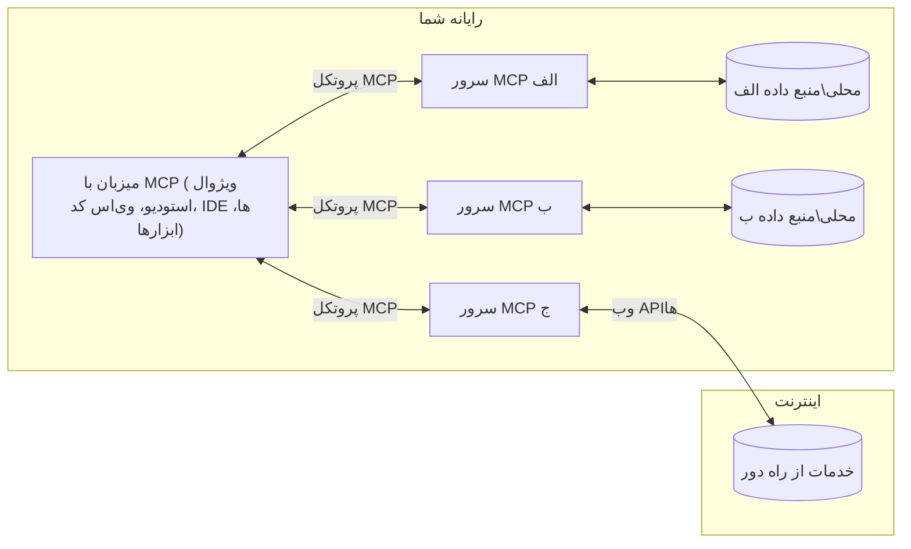

# مفاهیم پایه MCP: تسلط بر پروتکل زمینه مدل برای یکپارچه‌سازی هوش مصنوعی

[](https://youtu.be/earDzWGtE84)

_(برای مشاهده ویدیو این درس روی تصویر بالا کلیک کنید)_

[پروتکل زمینه مدل (MCP)](https://github.com/modelcontextprotocol) چارچوبی قوی و استاندارد شده است که ارتباط میان مدل‌های زبان بزرگ (LLMs) و ابزارها، برنامه‌ها و منابع داده خارجی را بهینه می‌کند.  
این راهنما شما را با مفاهیم اصلی MCP آشنا می‌کند. شما با معماری کلاینت-سرور آن، مؤلفه‌های اساسی، مکانیزم‌های ارتباطی و بهترین شیوه‌های پیاده‌سازی آشنا خواهید شد.

- **رضایت صریح کاربر**: همه دسترسی‌ها و عملیات داده‌ای نیاز به تأیید واضح و صریح کاربر پیش از اجرا دارند. کاربران باید به وضوح بدانند که کدام داده‌ها دسترسی داده می‌شوند و چه اقداماتی انجام خواهد شد، با کنترل دقیق روی مجوزها و احراز هویت‌ها.

- **حفاظت از حریم خصوصی داده‌ها**: داده‌های کاربر تنها با رضایت صریح آن‌ها افشا می‌شود و باید در سراسر چرخه تعامل با کنترل‌های دسترسی قوی محافظت شود. پیاده‌سازی‌ها باید مانع انتقال غیرمجاز داده‌ها شده و مرزهای سختگیرانه حفظ حریم خصوصی را رعایت کنند.

- **ایمنی اجرای ابزار**: هر فراخوانی ابزار نیاز به رضایت صریح کاربر دارد به همراه درک روشن از عملکرد، پارامترها و تأثیر احتمالی ابزار. مرزهای امنیتی قوی باید از اجرای ناخواسته، ناامن یا مخرب ابزار جلوگیری کنند.

- **امنیت لایه انتقال**: تمامی کانال‌های ارتباطی باید از رمزنگاری و مکانیزم‌های احراز هویت مناسب بهره‌مند باشند. اتصال‌های راه دور باید پروتکل‌های انتقال امن و مدیریت صحیح اعتبارنامه‌ها را پیاده‌سازی کنند.

#### راهنمایی‌های پیاده‌سازی:

- **مدیریت مجوز**: سیستم‌های مجوزدهی دقیق پیاده کنید که به کاربران امکانات کنترل سرورها، ابزارها و منابع قابل دسترس را بدهد  
- **احراز هویت و مجوزدهی**: از روش‌های امن احراز هویت (OAuth، کلیدهای API) با مدیریت و انقضای صحیح توکن‌ها استفاده کنید  
- **اعتبارسنجی ورودی**: همه پارامترها و ورودی‌ها را بر اساس اسکیماهای تعریف‌شده بررسی کنید تا از حملات تزریق جلوگیری شود  
- **ثبت فعالیت‌ها (Audit Logging)**: ثبت کاملی از همه عملیات برای نظارت امنیتی و تطابق قانونی داشته باشید  

## مرور کلی

این درس به بررسی معماری اساسی و مؤلفه‌هایی می‌پردازد که اکوسیستم پروتکل زمینه مدل (MCP) را تشکیل می‌دهند. شما با معماری کلاینت-سرور، مؤلفه‌های کلیدی و مکانیزم‌های ارتباطی که تعاملات MCP را توانمند می‌کنند آشنا خواهید شد.

## اهداف کلیدی یادگیری

تا پایان این درس، شما قادر خواهید بود:

- معماری کلاینت-سرور MCP را درک کنید.  
- نقش‌ها و مسئولیت‌های میزبان‌ها (Hosts)، کلاینت‌ها و سرورها را شناسایی کنید.  
- ویژگی‌های اصلی که باعث توانمندی MCP به عنوان لایه انعطاف‌پذیر یکپارچه‌سازی می‌شوند را تحلیل کنید.  
- نحوه جریان اطلاعات در اکوسیستم MCP را یاد بگیرید.  
- از طریق مثال‌های کد در .NET، جاوا، پایتون و جاوااسکریپت بینش عملی کسب کنید.  

## معماری MCP: نگاهی عمیق‌تر

اکوسیستم MCP بر پایه مدل کلاینت-سرور ساخته شده است. این ساختار مدولار اجازه می‌دهد برنامه‌های هوش مصنوعی به طور مؤثر با ابزارها، پایگاه‌داده‌ها، APIها و منابع زمینه‌ای تعامل کنند. بیایید این معماری را به مؤلفه‌های اصلی آن تفکیک کنیم.

در هسته خود، MCP از معماری کلاینت-سرور پیروی می‌کند که یک برنامه میزبان می‌تواند به چندین سرور متصل شود:


- **میزبان‌های MCP**: برنامه‌هایی مانند VSCode، Claude Desktop، IDEها یا ابزارهای هوش مصنوعی که می‌خواهند از طریق MCP به داده‌ها دسترسی داشته باشند  
- **کلاینت‌های MCP**: کلاینت‌های پروتکل که اتصال یک‌به‌یک با سرورها را حفظ می‌کنند  
- **سرورهای MCP**: برنامه‌های سبک‌وزن که هر کدام قابلیت‌های خاصی را از طریق پروتکل استاندارد شده Model Context Protocol ارائه می‌دهند  
- **منابع داده محلی**: فایل‌ها، پایگاه‌داده‌ها و سرویس‌های کامپیوتر شما که سرورهای MCP می‌توانند به صورت امن به آن‌ها دسترسی داشته باشند  
- **سرویس‌های راه دور**: سامانه‌های خارجی که از طریق اینترنت در دسترس هستند و سرورهای MCP می‌توانند با APIها به آن‌ها متصل شوند  

پروتکل MCP یک استاندارد در حال تحول است که از نسخه‌بندی تاریخی تاریخ‌دار (فرمت YYYY-MM-DD) استفاده می‌کند. نسخه فعلی پروتکل **2025-11-25** است. شما می‌توانید آخرین به‌روزرسانی‌های [مشخصات پروتکل](https://modelcontextprotocol.io/specification/2025-11-25/) را مشاهده کنید.

### ۱. میزبان‌ها

در پروتکل زمینه مدل (MCP)، **میزبان‌ها** برنامه‌های هوش مصنوعی هستند که به عنوان رابط اصلی تعامل کاربران با پروتکل عمل می‌کنند. میزبان‌ها اتصال به چندین سرور MCP را هماهنگ و مدیریت کرده و برای هر سرور یک کلاینت MCP اختصاصی ایجاد می‌کنند. مثال‌هایی از میزبان‌ها عبارتند از:

- **برنامه‌های هوش مصنوعی**: Claude Desktop، Visual Studio Code، Claude Code  
- **محیط‌های توسعه**: IDEها و ویرایشگرهای کد با یکپارچه‌سازی MCP  
- **برنامه‌های سفارشی**: عامل‌ها و ابزارهای هوش مصنوعی هدفمند ایجاد شده

**میزبان‌ها** برنامه‌هایی هستند که تعاملات مدل‌های هوش مصنوعی را هماهنگ می‌کنند. آن‌ها:

- **هماهنگی مدل‌های هوش مصنوعی**: اجرای مدل‌های LLM یا تعامل با آن‌ها برای تولید پاسخ و هماهنگی جریان‌های کاری هوش مصنوعی  
- **مدیریت اتصال کلاینت‌ها**: ایجاد و نگهداری یک کلاینت MCP برای هر اتصال سرور MCP  
- **کنترل رابط کاربری**: مدیریت جریان گفتگو، تعاملات کاربر و نمایش پاسخ‌ها  
- **اجرای سیاست‌های امنیتی**: کنترل مجوزها، محدودیت‌های امنیتی و احراز هویت  
- **رسیدگی به رضایت کاربر**: مدیریت تأیید کاربران برای اشتراک‌گذاری داده‌ها و اجرای ابزارها  

### ۲. کلاینت‌ها

**کلاینت‌ها** مؤلفه‌های اساسی هستند که اتصال اختصاصی یک‌به‌یک بین میزبان‌ها و سرورهای MCP را حفظ می‌کنند. هر کلاینت MCP توسط میزبان ساخته می‌شود تا به یک سرور MCP خاص متصل شود و کانال‌های ارتباطی سازمان‌یافته و امنی فراهم کند. وجود چندین کلاینت به میزبان‌ها امکان اتصال همزمان به چندین سرور را می‌دهد.

**کلاینت‌ها** مؤلفه‌های اتصالی درون برنامه میزبان هستند. آن‌ها:

- **ارتباط پروتکل**: ارسال درخواست‌های JSON-RPC 2.0 به سرورها شامل فرمان‌ها و دستورالعمل‌ها  
- **مذاکره قابلیت‌ها**: در زمان مقداردهی اولیه، مذاکره ویژگی‌های پشتیبانی شده و نسخه‌های پروتکل با سرورها  
- **اجرای ابزار**: مدیریت درخواست‌های اجرای ابزار از مدل‌ها و پردازش پاسخ‌ها  
- **به‌روزرسانی‌های آنی**: دریافت اعلان‌ها و به‌روزرسانی‌های زنده از سرورها  
- **پردازش پاسخ‌ها**: پردازش و قالب‌بندی پاسخ سرورها برای نمایش به کاربران  

### ۳. سرورها

**سرورها** برنامه‌هایی هستند که زمینه، ابزارها و قابلیت‌ها را در اختیار کلاینت‌های MCP قرار می‌دهند. آن‌ها می‌توانند به صورت محلی (روی همان ماشین میزبان) یا به صورت راه دور (روی پلتفرم‌های خارجی) اجرا شوند و مسئول دریافت درخواست‌های کلاینت و ارائه پاسخ‌های ساختاریافته هستند. سرورها عملکرد خاصی را از طریق پروتکل استاندارد شده Model Context Protocol ارائه می‌دهند.

**سرورها** سرویس‌هایی هستند که زمینه و قابلیت‌ها را ارائه می‌کنند. آن‌ها:

- **ثبت قابلیت‌ها**: ثبت و ارائه ابزارها، منابع و پرامپت‌های موجود به کلاینت‌ها  
- **پردازش درخواست**: دریافت و اجرای فراخوانی‌های ابزار، درخواست منابع و پرامپت از کلاینت‌ها  
- **تأمین زمینه**: ارائه اطلاعات و داده‌های زمینه‌ای برای بهبود پاسخ‌های مدل  
- **مدیریت وضعیت**: حفظ حالت جلسه و مدیریت تعاملات دارای حالت در صورت نیاز  
- **اعلان‌های زنده**: ارسال اعلان درباره تغییرات قابلیت‌ها و به‌روزرسانی‌ها به کلاینت‌های متصل  

سرورها می‌توانند توسط هر کسی برای گسترش قابلیت‌های مدل با عملکرد تخصصی توسعه یابند و از هر دو سناریوی استقرار محلی و راه دور پشتیبانی می‌کنند.

### ۴. پرمیتیوس سرور

سرورها در پروتکل زمینه مدل (MCP) سه **پرمیتیو** اصلی ارائه می‌دهند که بلوک‌های بنیادین برای تعاملات غنی بین کلاینت‌ها، میزبان‌ها و مدل‌های زبان را تعریف می‌کنند. این پرمیتیوها انواع اطلاعات زمینه‌ای و عملیات قابل دسترسی از طریق پروتکل را مشخص می‌کنند.

سرورهای MCP می‌توانند هر ترکیبی از سه پرمیتیو اصلی زیر را ارائه دهند:

#### منابع

**منابع** منابع داده‌ای هستند که اطلاعات زمینه‌ای را به برنامه‌های هوش مصنوعی ارائه می‌دهند. آن‌ها محتوای ایستا یا پویا را نمایش می‌دهند که می‌تواند درک مدل و تصمیم‌گیری را ارتقا دهد:

- **داده‌های زمینه‌ای**: اطلاعات ساختاریافته و زمینه برای مصرف مدل هوش مصنوعی  
- **پایگاه‌های دانش**: مخازن اسناد، مقالات، راهنماها و مقالات پژوهشی  
- **منابع داده محلی**: فایل‌ها، پایگاه‌داده‌ها و اطلاعات سیستم محلی  
- **داده‌های خارجی**: پاسخ‌های API، سرویس‌های وب و داده‌های سیستم‌های راه دور  
- **محتوای پویا**: داده‌های زمان واقعی که بر اساس شرایط خارجی به‌روزرسانی می‌شوند  

منابع با URIها شناسایی شده و از طریق روش‌های `resources/list` برای کشف و `resources/read` برای بازیابی پشتیبانی می‌شوند:

```text
file://documents/project-spec.md
database://production/users/schema
api://weather/current
```
  
#### پرامپت‌ها

**پرامپت‌ها** قالب‌های قابل استفاده مجددی هستند که به ساختاردهی تعاملات با مدل‌های زبان کمک می‌کنند. آن‌ها الگوهای استاندارد شده تعامل و گردش کار قالب‌بندی شده را ارائه می‌دهند:

- **تعاملات مبتنی بر قالب**: پیام‌ها و شروع‌کننده‌های گفتگو از پیش ساختاربندی شده  
- **قالب‌های گردش کار**: توالی‌های استاندارد برای وظایف و تعاملات رایج  
- **مثال‌های نمونه‌دار**: قالب‌های مبتنی بر نمونه برای دستور دادن به مدل  
- **پرامپت‌های سیستمی**: پرامپت‌های بنیادی که رفتار و زمینه مدل را تعریف می‌کنند  
- **قالب‌های پویا**: پرامپت‌های پارامترده که با توجه به زمینه‌های خاص سازگار می‌شوند  

پرامپت‌ها از جایگزینی متغیرها پشتیبانی کرده و می‌توانند از طریق `prompts/list` کشف شده و با `prompts/get` بازیابی شوند:

```markdown
Generate a {{task_type}} for {{product}} targeting {{audience}} with the following requirements: {{requirements}}
```
  
#### ابزارها

**ابزارها** تابع‌های اجرایی هستند که مدل‌های هوش مصنوعی می‌توانند برای انجام عمل خاصی فراخوانی کنند. آن‌ها «افعال» اکوسیستم MCP هستند که اجازه می‌دهند مدل‌ها با سیستم‌های خارجی تعامل داشته باشند:

- **توابع اجرایی**: عملیات مجزایی که مدل‌ها می‌توانند با پارامترهای مشخص فراخوانی کنند  
- **یکپارچه‌سازی سیستم خارجی**: فراخوانی APIها، جستجوی پایگاه‌داده، عملیات روی فایل و محاسبات  
- **هویت یکتا**: هر ابزار نام، توصیف و طرح اسکیما پارامتر منحصر به فردی دارد  
- **ورودی و خروجی ساختاریافته**: ابزارها پارامترهای اعتبارسنجی شده را دریافت و پاسخ‌هایی ساختاریافته و تایپ شده بازمی‌گردانند  
- **قابلیت‌های عملیاتی**: امکان انجام کارهای دنیای واقعی و بازیابی داده زنده توسط مدل‌ها فراهم است  

ابزارها با JSON Schema برای اعتبارسنجی پارامترها تعریف می‌شوند و از طریق `tools/list` کشف و با `tools/call` اجرا می‌گردند. ابزارها می‌توانند شامل **آیکون‌ها** به عنوان فراداده اضافه برای ارائه بهتر UI باشند.

**توضیحات ابزار**: ابزارها از توضیحات رفتاری پشتیبانی می‌کنند (مانند `readOnlyHint`، `destructiveHint`) که بیان می‌کند آیا ابزار فقط خواندنی یا مخرب است، این به کلاینت‌ها کمک می‌کند تصمیم آگاهانه‌تری در مورد اجرای ابزار بگیرند.

نمونه تعریف ابزار:

```typescript
server.tool(
  "search_products", 
  {
    query: z.string().describe("Search query for products"),
    category: z.string().optional().describe("Product category filter"),
    max_results: z.number().default(10).describe("Maximum results to return")
  }, 
  async (params) => {
    // اجرای جستجو و بازگرداندن نتایج ساختار یافته
    return await productService.search(params);
  }
);
```
  
## پرمیتیوس کلاینت

در پروتکل زمینه مدل (MCP)، **کلاینت‌ها** می‌توانند پرمیتیوس‌هایی را افشا کنند که به سرورها اجازه می‌دهد قابلیت‌های اضافی را از برنامه میزبان درخواست کنند. این پرمیتیوس‌های سمت کلاینت امکان پیاده‌سازی‌های سروری غنی‌تر و تعاملی‌تر فراهم می‌کند که می‌توانند به توانایی‌های مدل هوش مصنوعی و تعاملات کاربر دسترسی داشته باشند.

### نمونه‌برداری

**نمونه‌برداری** به سرورها امکان می‌دهد درخواست تکمیل مدل زبان را از برنامه هوش مصنوعی کلاینت بکنند. این پرمیتیوس به سرورها اجازه می‌دهد بدون جاسازی وابستگی‌های مدل خود، به قابلیت‌های LLM دسترسی پیدا کنند:

- **دسترسی مستقل از مدل**: سرورها می‌توانند درخواست‌های تکمیل بدون نیاز به SDKهای LLM یا مدیریت دسترسی مدل ارسال کنند  
- **هوش مصنوعی شروع شده توسط سرور**: امکان تولید خودکار محتوا با استفاده از مدل هوش مصنوعی کلاینت توسط سرورها  
- **تعاملات بازگشتی LLM**: پشتیبانی از سناریوهای پیچیده که سرورها به کمک هوش مصنوعی برای پردازش نیاز دارند  
- **تولید محتوای پویا**: اجازه می‌دهد سرورها پاسخ‌های زمینه‌ای با استفاده از مدل میزبان ایجاد کنند  
- **پشتیبانی از فراخوانی ابزار**: سرورها می‌توانند پارامترهای `tools` و `toolChoice` را شامل کنند تا مدل کلاینت قادر به فراخوانی ابزارها در طول نمونه‌برداری باشد  

نمونه‌برداری از طریق متد `sampling/complete` شروع می‌شود، جایی که سرورها درخواست‌های تکمیل را به کلاینت ارسال می‌کنند.

### ریشه‌ها

**ریشه‌ها** راهی استاندارد برای کلاینت‌ها فراهم می‌کنند تا محدودیت‌های سیستم فایل را به سرورها معرفی کنند، و به سرورها کمک کنند درک کنند به کدام دایرکتوری‌ها و فایل‌ها دسترسی دارند:

- **محدوده‌های سیستم فایل**: تعریف محدوده‌هایی که سرورها می‌توانند در آن‌ها عمل کنند  
- **کنترل دسترسی**: کمک به سرورها برای فهمیدن اینکه کدام دایرکتوری‌ها و فایل‌ها مجوز دسترسی دارند  
- **به‌روزرسانی‌های پویا**: کلاینت‌ها می‌توانند وقتی فهرست ریشه‌ها تغییر کرد به سرورها اطلاع دهند  
- **شناسایی مبتنی بر URI**: ریشه‌ها از URIهای `file://` برای شناسایی دایرکتوری‌ها و فایل‌های قابل دسترس استفاده می‌کنند  

ریشه‌ها از طریق متد `roots/list` کشف می‌شوند و کلاینت‌ها هنگام تغییر ریشه‌ها اعلان `notifications/roots/list_changed` ارسال می‌کنند.

### درخواست اطلاعات (Elicitation)

**درخواست اطلاعات** به سرورها امکان می‌دهد که از طریق رابط کلاینت اطلاعات یا تأیید بیشتر از کاربران درخواست کنند:

- **درخواست ورودی از کاربر**: سرورها می‌توانند زمان نیاز به اجرای ابزار اطلاعات بیشتری بخواهند  
- **دیالوگ‌های تأیید**: درخواست تأیید کاربر برای عملیات حساس یا تاثیرگذار  
- **گردش‌کارهای تعاملی**: امکان ایجاد تعاملات گام‌به‌گام با کاربر برای سرورها فراهم است  
- **جمع‌آوری پارامترهای پویا**: جمع‌آوری پارامترهای گم‌شده یا اختیاری هنگام اجرای ابزار  

درخواست‌های elicitation با استفاده از متد `elicitation/request` انجام می‌شوند تا ورودی کاربر از طریق رابط کلاینت جمع‌آوری شود.

**حالت URL در درخواست اطلاعات**: سرورها همچنین می‌توانند تعاملات مبتنی بر URL را درخواست کنند، تا بتوانند کاربران را به صفحات وب خارجی برای احراز هویت، تایید یا ورود داده‌ها هدایت کنند.

### ثبت لاگ

**ثبت لاگ** به سرورها اجازه می‌دهد پیام‌های لاگ ساختاریافته را برای کلاینت‌ها ارسال کنند تا برای دیباگ، نظارت و شفافیت عملیاتی استفاده شوند:

- **پشتیبانی از دیباگ**: امکان ارائه لاگ‌های دقیق اجرای سرور برای رفع اشکال  
- **نظارت عملیاتی**: ارسال به‌روزرسانی وضعیت و معیارهای عملکرد به کلاینت‌ها  
- **گزارش خطا**: ارائه زمینه دقیق خطاها و اطلاعات تشخیصی  
- **ردیابی حسابرسی**: ایجاد لاگ‌های جامع از عملیات و تصمیمات سرور  

پیام‌های لاگ به کلاینت‌ها ارسال می‌شود تا شفافیت عملیات سرور فراهم شود و دیباگ تسهیل گردد.

## جریان اطلاعات در MCP

پروتکل زمینه مدل (MCP) جریان منظم اطلاعات میان میزبان‌ها، کلاینت‌ها، سرورها و مدل‌ها را تعریف می‌کند. درک این جریان به روشن شدن چگونگی پردازش درخواست‌های کاربر و یکپارچه‌سازی ابزارها و داده‌های خارجی در پاسخ‌های مدل کمک می‌کند.

- **میزبان اتصال را آغاز می‌کند**  
  برنامه میزبان (مانند IDE یا رابط چت) اتصال به سرور MCP را برقرار می‌کند، معمولاً از طریق STDIO، WebSocket یا روش انتقال پشتیبانی شده دیگر.

- **مذاکره قابلیت‌ها**  
  کلاینت (قرار گرفته در میزبان) و سرور اطلاعات مربوط به ویژگی‌ها، ابزارها، منابع و نسخه‌های پروتکل را مبادله می‌کنند. این اطمینان می‌دهد هر دو طرف از قابلیت‌های در دسترس جلسه آگاه هستند.

- **درخواست کاربر**  
  کاربر با میزبان تعامل می‌کند (مثلاً یک پرامپت یا دستور وارد می‌کند). میزبان این ورودی را جمع‌آوری کرده و برای پردازش به کلاینت ارسال می‌کند.

- **استفاده از منابع یا ابزار**  
  - کلاینت ممکن است درخواست زمینه یا منابع اضافی از سرور (مثل فایل‌ها، ورودی‌های پایگاه‌داده یا مقالات پایگاه دانش) بدهد تا درک مدل را غنی‌تر کند.  
  - اگر مدل تشخیص دهد که نیاز به ابزار است (مثلاً برای واکشی داده، انجام محاسبات یا فراخوانی API)، کلاینت درخواست فراخوانی ابزار را به سرور می‌فرستد که نام ابزار و پارامترها را مشخص می‌کند.

- **اجرای سرور**  
  سرور درخواست منبع یا ابزار را دریافت می‌کند، عملیات لازم را اجرا می‌کند (مانند اجرای یک تابع، پرس‌وجو در پایگاه داده، یا بازیابی یک فایل) و نتایج را به صورت ساختارمند به کلاینت بازمی‌گرداند.

- **تولید پاسخ**  
  کلاینت پاسخ‌های سرور (داده‌های منبع، خروجی ابزارها و غیره) را در تعامل جاری مدل ادغام می‌کند. مدل از این اطلاعات برای تولید پاسخی جامع و مرتبط با زمینه استفاده می‌کند.

- **ارائه نتیجه**  
  میزبان خروجی نهایی را از کلاینت دریافت کرده و آن را به کاربر ارائه می‌دهد، که اغلب شامل متن تولیدشده توسط مدل و همچنین هر نتیجه‌ای از اجرای ابزارها یا جستجو در منابع است.

این جریان به MCP امکان می‌دهد که برنامه‌های پیشرفته، تعاملی و آگاه به زمینه هوش مصنوعی را با اتصال روان مدل‌ها به ابزارها و منابع خارجی پشتیبانی کند.

## معماری و لایه‌های پروتکل

MCP شامل دو لایه معماری متمایز است که با هم برای فراهم کردن یک چارچوب کامل ارتباطی کار می‌کنند:

### لایه داده

لایه **داده** پروتکل اصلی MCP را با استفاده از **JSON-RPC 2.0** به عنوان اساس پیاده‌سازی می‌کند. این لایه ساختار پیام، معناشناسی و الگوهای تعامل را تعریف می‌کند:

#### اجزای اصلی:

- **پروتکل JSON-RPC 2.0**: تمام ارتباطات از فرمت استاندارد پیام JSON-RPC 2.0 برای تماس‌های متد، پاسخ‌ها و اعلان‌ها استفاده می‌کند  
- **مدیریت چرخه عمر**: شامل راه‌اندازی اتصال، مذاکره قابلیت‌ها و خاتمه جلسه بین کلاینت‌ها و سرورها  
- **اولیه‌های سرور**: به سرورها امکان ارائه عملکرد اصلی از طریق ابزارها، منابع و درخواست‌ها را می‌دهد  
- **اولیه‌های کلاینت**: به سرورها امکان درخواست نمونه‌گیری از LLM ها، دریافت ورودی کاربر و ارسال پیام‌های لاگ را می‌دهد  
- **اعلان‌های زمان واقعی**: از اعلان‌های ناهمزمان برای به‌روزرسانی‌های پویا بدون نیاز به نظرسنجی پشتیبانی می‌کند  

#### ویژگی‌های کلیدی:

- **مذاکره نسخه پروتکل**: از نسخه‌بندی مبتنی بر تاریخ (YYYY-MM-DD) برای اطمینان از سازگاری استفاده می‌کند  
- **کشف قابلیت‌ها**: کلاینت‌ها و سرورها در هنگام راه‌اندازی اطلاعات ویژگی‌های پشتیبانی‌شده را مبادله می‌کنند  
- **جلسات حالت‌دار**: حالت اتصال را در چندین تعامل برای پیوستگی زمینه حفظ می‌کند  

### لایه انتقال

لایه **انتقال** کانال‌های ارتباطی، قاب‌بندی پیام‌ها و احراز هویت بین شرکت‌کنندگان MCP را مدیریت می‌کند:

#### مکانیزم‌های انتقال پشتیبانی‌شده:

1. **انتقال STDIO**:  
   - از جریان‌های ورودی/خروجی استاندارد برای ارتباط مستقیم فرآیند استفاده می‌کند  
   - برای فرآیندهای محلی روی همان دستگاه بدون بار شبکه بهینه است  
   - معمولاً برای پیاده‌سازی‌های محلی سرور MCP استفاده می‌شود  

2. **انتقال HTTP قابل پخش**:  
   - از HTTP POST برای ارسال پیام‌های کلاینت به سرور استفاده می‌کند  
   - به صورت اختیاری از Server-Sent Events (SSE) برای پخش سرور به کلاینت پشتیبانی می‌کند  
   - امکان ارتباط سرور از راه دور از طریق شبکه‌ها را فراهم می‌کند  
   - از احراز هویت استاندارد HTTP (توکن‌های bearer، کلیدهای API، هدرهای سفارشی) پشتیبانی می‌کند  
   - MCP توصیه می‌کند از OAuth برای احراز هویت امن مبتنی بر توکن استفاده شود  

#### انتزاع انتقال:

لایه انتقال جزئیات ارتباط را از لایه داده جدا می‌کند و اجازه می‌دهد همان فرمت پیام JSON-RPC 2.0 در تمام مکانیزم‌های انتقال استفاده شود. این انتزاع به برنامه‌ها امکان می‌دهد به راحتی بین سرورهای محلی و راه دور جابجا شوند.

### ملاحظات امنیتی

پیاده‌سازی‌های MCP باید به چندین اصل امنیتی مهم پایبند باشند تا تعاملات پروتکل را ایمن، قابل اعتماد و مطمئن کنند:

- **رضایت و کنترل کاربر**: کاربران باید قبل از دسترسی به هر داده یا انجام هر عملی رضایت صریح خود را ارائه دهند. آنها باید کنترل واضحی بر داده‌های به اشتراک‌گذاشته شده و عملیات مجاز داشته باشند، که با رابط‌های کاربری شهودی برای بازبینی و تأیید فعالیت‌ها پشتیبانی شود.  
- **حریم خصوصی داده‌ها**: داده‌های کاربر فقط با رضایت صریح افشا شوند و باید توسط کنترل‌های دسترسی مناسب محافظت شوند. پیاده‌سازی‌های MCP باید در برابر انتقال غیرمجاز داده محافظت کنند و اطمینان حاصل کنند که حریم خصوصی در طول تمام تعاملات حفظ می‌شود.  
- **ایمنی ابزارها**: قبل از فراخوانی هر ابزار رضایت صریح کاربر لازم است. کاربران باید درک واضحی از عملکرد هر ابزار داشته باشند و مرزهای امنیتی محکمی باید برای جلوگیری از اجرای ناخواسته یا غیرامن ابزارها وجود داشته باشد.  

با پیروی از این اصول امنیتی، MCP اطمینان حاصل می‌کند که اعتماد، حریم خصوصی و ایمنی کاربر طی تمام تعاملات پروتکل حفظ می‌شود و در عین حال امکان یکپارچه‌سازی‌های قدرتمند هوش مصنوعی را فراهم می‌آورد.

## نمونه‌های کد: اجزای کلیدی

در ادامه نمونه‌های کدی به چند زبان برنامه‌نویسی محبوب برای پیاده‌سازی اجزای کلیدی سرور MCP و ابزارها آورده شده است.

### نمونه .NET: ایجاد یک سرور MCP ساده با ابزارها

در اینجا یک مثال کد عملی از .NET برای پیاده‌سازی یک سرور ساده MCP با ابزارهای سفارشی دیده می‌شود. این مثال نحوه تعریف و ثبت ابزارها، مدیریت درخواست‌ها و اتصال سرور با استفاده از Model Context Protocol را نشان می‌دهد.

```csharp
using System;
using System.Threading.Tasks;
using ModelContextProtocol.Server;
using ModelContextProtocol.Server.Transport;
using ModelContextProtocol.Server.Tools;

public class WeatherServer
{
    public static async Task Main(string[] args)
    {
        // Create an MCP server
        var server = new McpServer(
            name: "Weather MCP Server",
            version: "1.0.0"
        );
        
        // Register our custom weather tool
        server.AddTool<string, WeatherData>("weatherTool", 
            description: "Gets current weather for a location",
            execute: async (location) => {
                // Call weather API (simplified)
                var weatherData = await GetWeatherDataAsync(location);
                return weatherData;
            });
        
        // Connect the server using stdio transport
        var transport = new StdioServerTransport();
        await server.ConnectAsync(transport);
        
        Console.WriteLine("Weather MCP Server started");
        
        // Keep the server running until process is terminated
        await Task.Delay(-1);
    }
    
    private static async Task<WeatherData> GetWeatherDataAsync(string location)
    {
        // This would normally call a weather API
        // Simplified for demonstration
        await Task.Delay(100); // Simulate API call
        return new WeatherData { 
            Temperature = 72.5,
            Conditions = "Sunny",
            Location = location
        };
    }
}

public class WeatherData
{
    public double Temperature { get; set; }
    public string Conditions { get; set; }
    public string Location { get; set; }
}
```

### نمونه جاوا: اجزای سرور MCP

این مثال همان سرور MCP و ثبت ابزار را که در مثال .NET بالا بود نشان می‌دهد، اما به زبان جاوا پیاده‌سازی شده است.

```java
import io.modelcontextprotocol.server.McpServer;
import io.modelcontextprotocol.server.McpToolDefinition;
import io.modelcontextprotocol.server.transport.StdioServerTransport;
import io.modelcontextprotocol.server.tool.ToolExecutionContext;
import io.modelcontextprotocol.server.tool.ToolResponse;

public class WeatherMcpServer {
    public static void main(String[] args) throws Exception {
        // ایجاد سرور MCP
        McpServer server = McpServer.builder()
            .name("Weather MCP Server")
            .version("1.0.0")
            .build();
            
        // ثبت ابزار هواشناسی
        server.registerTool(McpToolDefinition.builder("weatherTool")
            .description("Gets current weather for a location")
            .parameter("location", String.class)
            .execute((ToolExecutionContext ctx) -> {
                String location = ctx.getParameter("location", String.class);
                
                // دریافت داده‌های هواشناسی (ساده‌شده)
                WeatherData data = getWeatherData(location);
                
                // بازگرداندن پاسخ قالب‌بندی شده
                return ToolResponse.content(
                    String.format("Temperature: %.1f°F, Conditions: %s, Location: %s", 
                    data.getTemperature(), 
                    data.getConditions(), 
                    data.getLocation())
                );
            })
            .build());
        
        // اتصال سرور با استفاده از انتقال stdio
        try (StdioServerTransport transport = new StdioServerTransport()) {
            server.connect(transport);
            System.out.println("Weather MCP Server started");
            // حفظ سرور در حال اجرا تا زمان خاتمه فرآیند
            Thread.currentThread().join();
        }
    }
    
    private static WeatherData getWeatherData(String location) {
        // پیاده‌سازی، فراخوانی یک API هواشناسی خواهد بود
        // ساده‌شده برای اهداف مثالی
        return new WeatherData(72.5, "Sunny", location);
    }
}

class WeatherData {
    private double temperature;
    private String conditions;
    private String location;
    
    public WeatherData(double temperature, String conditions, String location) {
        this.temperature = temperature;
        this.conditions = conditions;
        this.location = location;
    }
    
    public double getTemperature() {
        return temperature;
    }
    
    public String getConditions() {
        return conditions;
    }
    
    public String getLocation() {
        return location;
    }
}
```

### نمونه پایتون: ساخت سرور MCP

این مثال از fastmcp استفاده می‌کند، پس لطفاً ابتدا آن را نصب کنید:

```python
pip install fastmcp
```
نمونه کد:

```python
#!/usr/bin/env python3
import asyncio
from fastmcp import FastMCP
from fastmcp.transports.stdio import serve_stdio

# ایجاد سرور FastMCP
mcp = FastMCP(
    name="Weather MCP Server",
    version="1.0.0"
)

@mcp.tool()
def get_weather(location: str) -> dict:
    """Gets current weather for a location."""
    return {
        "temperature": 72.5,
        "conditions": "Sunny",
        "location": location
    }

# رویکرد جایگزین با استفاده از کلاس
class WeatherTools:
    @mcp.tool()
    def forecast(self, location: str, days: int = 1) -> dict:
        """Gets weather forecast for a location for the specified number of days."""
        return {
            "location": location,
            "forecast": [
                {"day": i+1, "temperature": 70 + i, "conditions": "Partly Cloudy"}
                for i in range(days)
            ]
        }

# ثبت ابزارهای کلاس
weather_tools = WeatherTools()

# شروع سرور
if __name__ == "__main__":
    asyncio.run(serve_stdio(mcp))
```

### نمونه جاوااسکریپت: ایجاد سرور MCP

این مثال ایجاد سرور MCP در جاوااسکریپت و نحوه ثبت دو ابزار مرتبط با آب و هوا را نشان می‌دهد.

```javascript
// استفاده از کیت توسعه نرم‌افزار رسمی پروتکل مدل کانتکست
import { McpServer } from "@modelcontextprotocol/sdk/server/mcp.js";
import { StdioServerTransport } from "@modelcontextprotocol/sdk/server/stdio.js";
import { z } from "zod"; // برای اعتبارسنجی پارامتر

// ایجاد یک سرور MCP
const server = new McpServer({
  name: "Weather MCP Server",
  version: "1.0.0"
});

// تعریف یک ابزار آب و هوا
server.tool(
  "weatherTool",
  {
    location: z.string().describe("The location to get weather for")
  },
  async ({ location }) => {
    // این معمولاً یک API آب و هوا را فرا می‌خواند
    // ساده‌شده برای نمایش
    const weatherData = await getWeatherData(location);
    
    return {
      content: [
        { 
          type: "text", 
          text: `Temperature: ${weatherData.temperature}°F, Conditions: ${weatherData.conditions}, Location: ${weatherData.location}` 
        }
      ]
    };
  }
);

// تعریف یک ابزار پیش‌بینی
server.tool(
  "forecastTool",
  {
    location: z.string(),
    days: z.number().default(3).describe("Number of days for forecast")
  },
  async ({ location, days }) => {
    // این معمولاً یک API آب و هوا را فرا می‌خواند
    // ساده‌شده برای نمایش
    const forecast = await getForecastData(location, days);
    
    return {
      content: [
        { 
          type: "text", 
          text: `${days}-day forecast for ${location}: ${JSON.stringify(forecast)}` 
        }
      ]
    };
  }
);

// توابع کمکی
async function getWeatherData(location) {
  // شبیه‌سازی فراخوانی API
  return {
    temperature: 72.5,
    conditions: "Sunny",
    location: location
  };
}

async function getForecastData(location, days) {
  // شبیه‌سازی فراخوانی API
  return Array.from({ length: days }, (_, i) => ({
    day: i + 1,
    temperature: 70 + Math.floor(Math.random() * 10),
    conditions: i % 2 === 0 ? "Sunny" : "Partly Cloudy"
  }));
}

// اتصال سرور با استفاده از ترنسپورت stdio
const transport = new StdioServerTransport();
server.connect(transport).catch(console.error);

console.log("Weather MCP Server started");
```

این مثال جاوااسکریپت نشان می‌دهد چگونه یک کلاینت MCP ایجاد کنیم که به سرور متصل می‌شود، یک درخواست ارسال می‌کند، و پاسخ را از جمله هر فراخوانی ابزاری که انجام شده پردازش می‌کند.

## امنیت و مجوزها

MCP چندین مفهوم و مکانیزم ساخته‌شده برای مدیریت امنیت و مجوزها در طول پروتکل را شامل می‌شود:

1. **کنترل مجوز ابزار**:  
  کلاینت‌ها می‌توانند مشخص کنند کدام ابزارها در طول جلسه اجازه استفاده توسط مدل دارند. این تضمین می‌کند که فقط ابزارهای صریحاً مجاز قابل دسترس هستند و ریسک عملیات ناخواسته یا غیرامن کاهش می‌یابد. مجوزها می‌توانند به صورت پویا بر اساس ترجیحات کاربر، سیاست‌های سازمانی یا زمینه تعامل تنظیم شوند.

2. **احراز هویت**:  
  سرورها می‌توانند قبل از اعطای دسترسی به ابزارها، منابع یا عملیات حساس احراز هویت را لازم بدانند. این ممکن است شامل کلیدهای API، توکن‌های OAuth، یا دیگر طرح‌های احراز هویت باشد. احراز هویت مناسب اطمینان می‌دهد فقط کلاینت‌ها و کاربران مورد اعتماد می‌توانند قابلیت‌های سمت سرور را فراخوانی کنند.

3. **اعتبارسنجی**:  
  اعتبارسنجی پارامترها برای همه فراخوانی‌های ابزار اعمال می‌شود. هر ابزار نوع، قالب و محدودیت‌های مورد انتظار پارامترهایش را تعریف می‌کند و سرور درخواست‌های ورودی را مطابق آن اعتبارسنجی می‌کند. این از رسیدن داده‌های نادرست یا مخرب به پیاده‌سازی ابزارها جلوگیری می‌کند و به حفظ یکپارچگی عملیات کمک می‌کند.

4. **محدودیت نرخ**:  
  برای جلوگیری از سوءاستفاده و تضمین استفاده عادلانه از منابع سرور، سرورهای MCP می‌توانند محدودیت نرخ برای تماس‌های ابزار و دسترسی به منابع اعمال کنند. محدودیت‌ها می‌توانند برای هر کاربر، هر جلسه یا به صورت کلی اعمال شوند و به محافظت در برابر حملات انکار سرویس یا مصرف بیش از حد منابع کمک کنند.

با ترکیب این مکانیزم‌ها، MCP پایه‌ای امن برای یکپارچه‌سازی مدل‌های زبانی با ابزارها و منابع داده خارجی فراهم می‌کند، و در عین حال کنترل دقیق بر دسترسی و استفاده را به کاربران و توسعه‌دهندگان ارائه می‌دهد.

## پیام‌های پروتکل و جریان ارتباطی

ارتباط MCP از پیام‌های ساخت‌یافته **JSON-RPC 2.0** برای تسهیل تعاملات واضح و قابل اطمینان بین میزبان‌ها، کلاینت‌ها و سرورها استفاده می‌کند. پروتکل الگوهای پیام خاصی برای انواع مختلف عملیات تعریف می‌کند:

### انواع اصلی پیام:

#### **پیام‌های راه‌اندازی**
- درخواست **`initialize`**: برقراری اتصال و مذاکره نسخه پروتکل و قابلیت‌ها  
- پاسخ **`initialize`**: تأیید ویژگی‌های پشتیبانی شده و اطلاعات سرور  
- **`notifications/initialized`**: اعلان اینکه راه‌اندازی کامل شده و جلسه آماده است  

#### **پیام‌های کشف**
- درخواست **`tools/list`**: کشف ابزارهای موجود در سرور  
- درخواست **`resources/list`**: فهرست منابع (منابع داده) موجود  
- درخواست **`prompts/list`**: دریافت قالب‌های درخواست موجود  

#### **پیام‌های اجرای فرمان**  
- درخواست **`tools/call`**: اجرای ابزار خاص با پارامترهای ارائه‌شده  
- درخواست **`resources/read`**: بازیابی محتوا از منبع خاص  
- درخواست **`prompts/get`**: واکشی قالب درخواست با پارامترهای اختیاری  

#### **پیام‌های سمت کلاینت**
- درخواست **`sampling/complete`**: سرور درخواست تکمیل LLM از کلاینت  
- درخواست **`elicitation/request`**: سرور درخواست ورودی کاربر از طریق رابط کلاینت  
- پیام‌های ثبت لاگ: سرور پیام‌های لاگ ساختارمند به کلاینت ارسال می‌کند  

#### **پیام‌های اعلان**
- **`notifications/tools/list_changed`**: سرور به کلاینت تغییرات ابزارها را اطلاع می‌دهد  
- **`notifications/resources/list_changed`**: سرور به کلاینت تغییرات منابع را اطلاع می‌دهد  
- **`notifications/prompts/list_changed`**: سرور به کلاینت تغییرات درخواست‌ها را اطلاع می‌دهد  

### ساختار پیام:

تمام پیام‌های MCP از فرمت JSON-RPC 2.0 تبعیت می‌کنند با:  
- پیام‌های درخواست: شامل `id`، `method` و پارامترهای اختیاری  
- پیام‌های پاسخ: شامل `id` و یا `result` یا `error`  
- پیام‌های اعلان: شامل `method` و پارامترهای اختیاری (بدون `id` و بدون انتظار پاسخ)  

این ارتباط ساختاریافته تعاملات قابل اطمینان، قابل پیگیری و قابل توسعه را پشتیبانی می‌کند که سناریوهای پیشرفته‌ای مانند به‌روزرسانی‌های زمان واقعی، زنجیر‌سازی ابزارها و مدیریت خطاهای قوی را ممکن می‌سازد.

### وظایف (آزمایشی)

**وظایف** یک ویژگی آزمایشی است که بسته‌های اجرای مقاوم فراهم می‌کند که امکان بازیابی نتایج به تأخیر افتاده و پیگیری وضعیت برای درخواست‌های MCP را مهیا می‌کند:

- عملیات طولانی مدت: پیگیری محاسبات هزینه‌بر، خودکارسازی جریان کار و پردازش دسته‌ای  
- نتایج به تأخیر افتاده: نظرسنجی وضعیت وظیفه و بازیابی نتایج پس از پایان عملیات  
- پیگیری وضعیت: نظارت بر پیشرفت وظیفه از طریق حالت‌های چرخه عمر تعریف شده  
- عملیات چند مرحله‌ای: پشتیبانی از جریان‌های کاری پیچیده که در چندین تعامل گسترش می‌یابند  

وظایف، درخواست‌های استاندارد MCP را بسته‌بندی می‌کنند تا الگوهای اجرای ناهمزمان برای عملیات‌هایی که فوراً کامل نمی‌شوند را فعال کنند.

## نکات کلیدی

- **معماری**: MCP از معماری کلاینت-سرور استفاده می‌کند که در آن میزبان‌ها چندین اتصال کلاینت به سرورها را مدیریت می‌کنند  
- **شرکت‌کنندگان**: اکوسیستم شامل میزبان‌ها (برنامه‌های هوش مصنوعی)، کلاینت‌ها (اتصال‌دهنده‌های پروتکل) و سرورها (ارائه‌دهندگان قابلیت) است  
- **مکانیزم‌های انتقال**: ارتباط از STDIO (محلی) و HTTP قابل پخش با SSE اختیاری (راه دور) پشتیبانی می‌کند  
- **اولیه‌های اصلی**: سرورها ابزارها (توابع اجرایی)، منابع (منابع داده) و درخواست‌ها (قالب‌ها) را عرضه می‌کنند  
- **اولیه‌های کلاینت**: سرورها می‌توانند نمونه‌گیری (تکمیل LLM همراه با پشتیبانی فراخوانی ابزار)، استخراج (ورودی کاربر شامل حالت URL)، ریشه‌ها (مرزهای سیستم فایل) و لاگ‌گیری از کلاینت بخواهند  
- **ویژگی‌های آزمایشی**: وظایف بسته‌های اجرایی مقاوم برای عملیات طولانی مدت فراهم می‌کنند  
- **پایه پروتکل**: مبتنی بر JSON-RPC 2.0 با نسخه‌بندی مبتنی بر تاریخ (فعلی: 2025-11-25)  
- **قابلیت‌های زمان واقعی**: از اعلان‌ها برای به‌روزرسانی‌های پویا و همگام‌سازی زمان واقعی پشتیبانی می‌کند  
- **امنیت اول**: رضایت صریح کاربر، حفاظت حریم خصوصی داده‌ها و انتقال امن اصول اصلی هستند  

## تمرین

یک ابزار ساده MCP طراحی کنید که در حوزه شما مفید باشد. تعریف کنید:  
1. نام ابزار چه خواهد بود  
2. چه پارامترهایی می‌پذیرد  
3. چه خروجی‌ای برمی‌گرداند  
4. مدل چگونه ممکن است از این ابزار برای حل مشکلات کاربران استفاده کند  

---

## مرحله بعدی

بعدی: [فصل ۲: امنیت](../02-Security/README.md)

---

<!-- CO-OP TRANSLATOR DISCLAIMER START -->
**سلب مسئولیت**:
این سند با استفاده از سرویس ترجمه ماشینی [Co-op Translator](https://github.com/Azure/co-op-translator) ترجمه شده است. در حالی که ما در تلاش برای دقت هستیم، لطفاً توجه داشته باشید که ترجمه‌های خودکار ممکن است شامل خطاها یا نادرستی‌هایی باشند. سند اصلی به زبان بومی خود باید به عنوان منبع معتبر در نظر گرفته شود. برای اطلاعات حیاتی، توصیه می‌شود از ترجمه حرفه‌ای انسانی استفاده شود. ما مسئول هیچ گونه سوءتفاهم یا تفسیر نادرست ناشی از استفاده از این ترجمه نیستیم.
<!-- CO-OP TRANSLATOR DISCLAIMER END -->