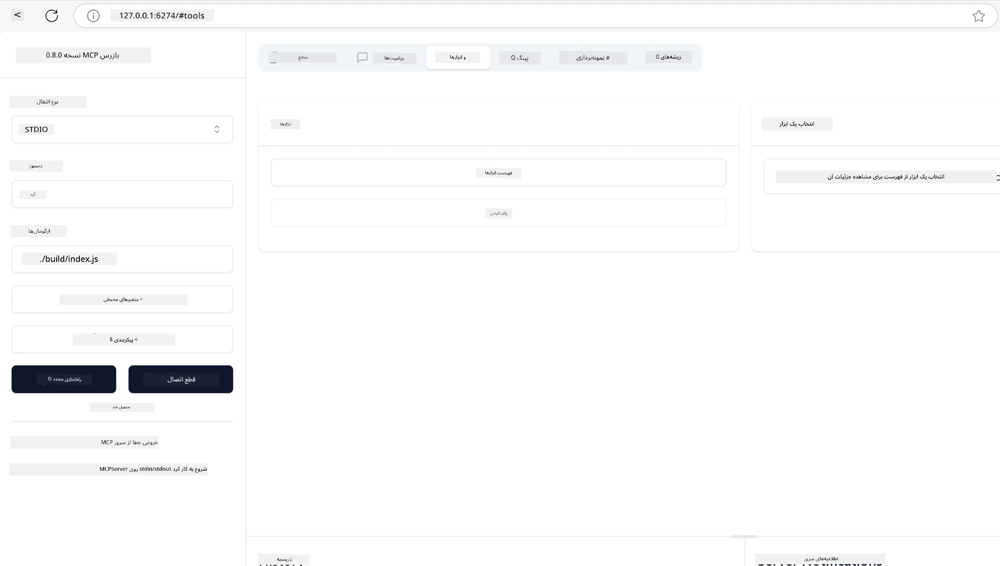
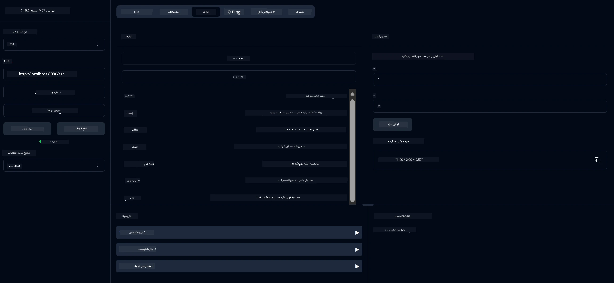
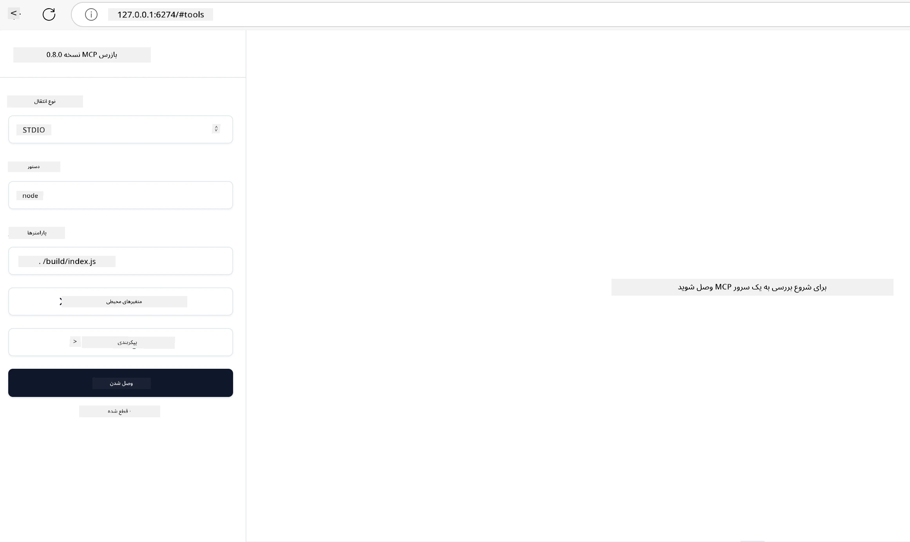
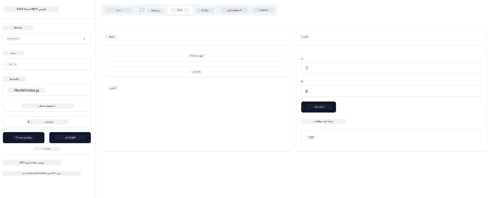

# شروع کار با MCP

به اولین گام‌های خود با پروتکل زمینه مدل (MCP) خوش آمدید! چه تازه‌کار با MCP باشید و چه بخواهید درک خود را عمیق‌تر کنید، این راهنما شما را در فرآیند راه‌اندازی و توسعه ضروری همراهی می‌کند. شما خواهید آموخت که چگونه MCP امکان یکپارچه‌سازی بین مدل‌های هوش مصنوعی و برنامه‌ها را فراهم می‌کند و یاد می‌گیرید چگونه محیط خود را به سرعت برای ساخت و آزمایش راه‌حل‌های مبتنی بر MCP آماده کنید.

> خلاصه؛ اگر برنامه‌های هوش مصنوعی می‌سازید، می‌دانید که می‌توانید ابزارها و منابع دیگر را به مدل زبان بزرگ (LLM) خود اضافه کنید تا دانش مدل افزایش یابد. اما اگر این ابزارها و منابع را روی یک سرور قرار دهید، قابلیت‌های برنامه و سرور می‌تواند توسط هر مشتری با یا بدون LLM استفاده شود.

## مرور کلی

این درس راهنمایی عملی برای راه‌اندازی محیط‌های MCP و ساخت اولین برنامه‌های MCP شما ارائه می‌دهد. شما یاد می‌گیرید چگونه ابزارها و چارچوب‌های لازم را راه‌اندازی کنید، سرورهای پایه MCP بسازید، برنامه‌های میزبان ایجاد کنید و پیاده‌سازی‌های خود را آزمایش کنید.

پروتکل زمینه مدل (MCP) یک پروتکل باز است که استانداردسازی می‌کند چگونه برنامه‌ها زمینه را به LLMها ارائه می‌دهند. MCP را مانند یک پورت USB-C برای برنامه‌های هوش مصنوعی تصور کنید - این یک روش استاندارد برای اتصال مدل‌های هوش مصنوعی به منابع داده و ابزارهای مختلف فراهم می‌کند.

## اهداف یادگیری

تا پایان این درس، شما قادر خواهید بود:

- راه‌اندازی محیط‌های توسعه برای MCP در C#، Java، Python، TypeScript و Rust
- ساخت و استقرار سرورهای پایه MCP با ویژگی‌های سفارشی (منابع، پرامپت‌ها و ابزارها)
- ایجاد برنامه‌های میزبان که به سرورهای MCP متصل می‌شوند
- آزمایش و اشکال‌زدایی پیاده‌سازی‌های MCP

## راه‌اندازی محیط MCP شما

قبل از شروع کار با MCP، مهم است که محیط توسعه خود را آماده کنید و جریان کاری پایه را درک کنید. این بخش شما را در مراحل اولیه راه‌اندازی برای شروع روان با MCP راهنمایی می‌کند.

### پیش‌نیازها

قبل از شروع توسعه MCP، اطمینان حاصل کنید که دارید:

- **محیط توسعه**: برای زبان انتخابی شما (C#، Java، Python، TypeScript یا Rust)
- **IDE/ویرایشگر**: Visual Studio، Visual Studio Code، IntelliJ، Eclipse، PyCharm یا هر ویرایشگر کد مدرن
- **مدیران بسته**: NuGet، Maven/Gradle، pip، npm/yarn یا Cargo
- **کلیدهای API**: برای هر سرویس هوش مصنوعی که قصد استفاده در برنامه‌های میزبان خود دارید

## ساختار پایه سرور MCP

یک سرور MCP معمولاً شامل موارد زیر است:

- **پیکربندی سرور**: تنظیم پورت، احراز هویت و سایر تنظیمات
- **منابع**: داده‌ها و زمینه‌ای که در دسترس LLMها قرار می‌گیرد
- **ابزارها**: عملکردهایی که مدل‌ها می‌توانند فراخوانی کنند
- **پرامپت‌ها**: قالب‌هایی برای تولید یا ساختاردهی متن

در اینجا یک مثال ساده‌شده در TypeScript آمده است:

```typescript
import { McpServer, ResourceTemplate } from "@modelcontextprotocol/sdk/server/mcp.js";
import { StdioServerTransport } from "@modelcontextprotocol/sdk/server/stdio.js";
import { z } from "zod";

// ایجاد یک سرور MCP
const server = new McpServer({
  name: "Demo",
  version: "1.0.0"
});

// افزودن یک ابزار اضافی
server.tool("add",
  { a: z.number(), b: z.number() },
  async ({ a, b }) => ({
    content: [{ type: "text", text: String(a + b) }]
  })
);

// افزودن یک منبع خوش‌آمدگویی پویا
server.resource(
  "file",
  // پارامتر 'list' کنترل می‌کند که منبع چگونه فایل‌های موجود را فهرست می‌کند. تنظیم آن روی undefined فهرست‌بندی برای این منبع را غیرفعال می‌کند.
  new ResourceTemplate("file://{path}", { list: undefined }),
  async (uri, { path }) => ({
    contents: [{
      uri: uri.href,
      text: `File, ${path}!`
    }]
  })
);

// افزودن یک منبع فایل که محتوای فایل را می‌خواند
server.resource(
  "file",
  new ResourceTemplate("file://{path}", { list: undefined }),
  async (uri, { path }) => {
    let text;
    try {
      text = await fs.readFile(path, "utf8");
    } catch (err) {
      text = `Error reading file: ${err.message}`;
    }
    return {
      contents: [{
        uri: uri.href,
        text
      }]
    };
  }
);

server.prompt(
  "review-code",
  { code: z.string() },
  ({ code }) => ({
    messages: [{
      role: "user",
      content: {
        type: "text",
        text: `Please review this code:\n\n${code}`
      }
    }]
  })
);

// شروع به دریافت پیام‌ها از stdin و ارسال پیام‌ها به stdout
const transport = new StdioServerTransport();
await server.connect(transport);
```

در کد بالا ما:

- کلاس‌های لازم را از SDK TypeScript MCP وارد کردیم.
- یک نمونه جدید سرور MCP ایجاد و پیکربندی کردیم.
- یک ابزار سفارشی (`calculator`) با یک تابع هندلر ثبت کردیم.
- سرور را برای گوش دادن به درخواست‌های ورودی MCP راه‌اندازی کردیم.

## آزمایش و اشکال‌زدایی

قبل از شروع آزمایش سرور MCP خود، مهم است ابزارهای موجود و بهترین روش‌های اشکال‌زدایی را درک کنید. آزمایش مؤثر اطمینان می‌دهد که سرور شما مطابق انتظار رفتار می‌کند و به شما کمک می‌کند مشکلات را سریع شناسایی و رفع کنید. بخش بعدی رویکردهای پیشنهادی برای اعتبارسنجی پیاده‌سازی MCP شما را شرح می‌دهد.

MCP ابزارهایی برای کمک به آزمایش و اشکال‌زدایی سرورهای شما فراهم می‌کند:

- **ابزار Inspector**، این رابط گرافیکی به شما امکان می‌دهد به سرور خود متصل شوید و ابزارها، پرامپت‌ها و منابع خود را آزمایش کنید.
- **curl**، همچنین می‌توانید با استفاده از ابزار خط فرمان مانند curl یا سایر کلاینت‌هایی که می‌توانند دستورات HTTP ایجاد و اجرا کنند، به سرور خود متصل شوید.

### استفاده از MCP Inspector

[ابزار MCP Inspector](https://github.com/modelcontextprotocol/inspector) یک ابزار تست بصری است که به شما کمک می‌کند:

1. **کشف قابلیت‌های سرور**: به طور خودکار منابع، ابزارها و پرامپت‌های موجود را شناسایی کنید
2. **آزمایش اجرای ابزار**: پارامترهای مختلف را امتحان کنید و پاسخ‌ها را در زمان واقعی ببینید
3. **مشاهده متادیتای سرور**: اطلاعات سرور، طرح‌ها و پیکربندی‌ها را بررسی کنید

```bash
# به عنوان مثال TypeScript، نصب و اجرای MCP Inspector
npx @modelcontextprotocol/inspector node build/index.js
```

وقتی دستورات بالا را اجرا می‌کنید، MCP Inspector یک رابط وب محلی در مرورگر شما راه‌اندازی می‌کند. انتظار می‌رود داشبوردی را ببینید که سرورهای MCP ثبت‌شده شما، ابزارها، منابع و پرامپت‌های موجود آن‌ها را نمایش می‌دهد. این رابط به شما امکان می‌دهد اجرای ابزار را به صورت تعاملی آزمایش کنید، متادیتای سرور را بررسی کنید و پاسخ‌های زمان واقعی را مشاهده کنید، که اعتبارسنجی و اشکال‌زدایی پیاده‌سازی‌های سرور MCP شما را آسان‌تر می‌کند.

در اینجا یک تصویر از ظاهر آن آمده است:



## مشکلات رایج راه‌اندازی و راه‌حل‌ها

| مشکل | راه‌حل ممکن |
|-------|-------------------|
| اتصال رد شد | بررسی کنید که سرور در حال اجرا است و پورت صحیح است |
| خطاهای اجرای ابزار | اعتبارسنجی پارامترها و مدیریت خطا را مرور کنید |
| شکست‌های احراز هویت | کلیدهای API و مجوزها را بررسی کنید |
| خطاهای اعتبارسنجی طرح | اطمینان حاصل کنید پارامترها با طرح تعریف‌شده مطابقت دارند |
| سرور شروع نمی‌شود | بررسی کنید که پورت تداخل نداشته باشد یا وابستگی‌ها کامل باشند |
| خطاهای CORS | هدرهای CORS مناسب برای درخواست‌های چندمنبعی تنظیم کنید |
| مشکلات احراز هویت | اعتبار توکن و مجوزها را بررسی کنید |

## توسعه محلی

برای توسعه و آزمایش محلی، می‌توانید سرورهای MCP را مستقیماً روی دستگاه خود اجرا کنید:

1. **شروع فرآیند سرور**: برنامه سرور MCP خود را اجرا کنید
2. **پیکربندی شبکه**: اطمینان حاصل کنید سرور روی پورت مورد انتظار قابل دسترسی است
3. **اتصال کلاینت‌ها**: از URLهای اتصال محلی مانند `http://localhost:3000` استفاده کنید

```bash
# مثال: اجرای یک سرور MCP تایپ‌اسکریپت به صورت محلی
npm run start
# سرور در حال اجرا در http://localhost:3000
```

## ساخت اولین سرور MCP شما

ما در درس قبلی [مفاهیم اصلی](/01-CoreConcepts/README.md) را پوشش دادیم، حالا وقت آن است که آن دانش را به کار ببریم.

### سرور چه کاری می‌تواند انجام دهد

قبل از شروع نوشتن کد، بیایید یادآوری کنیم که سرور چه کاری می‌تواند انجام دهد:

یک سرور MCP می‌تواند برای مثال:

- به فایل‌ها و پایگاه‌های داده محلی دسترسی داشته باشد
- به APIهای راه دور متصل شود
- محاسبات انجام دهد
- با ابزارها و خدمات دیگر یکپارچه شود
- یک رابط کاربری برای تعامل فراهم کند

عالی است، حالا که می‌دانیم چه کاری می‌توانیم انجام دهیم، بیایید کدنویسی را شروع کنیم.

## تمرین: ایجاد یک سرور

برای ایجاد یک سرور، باید مراحل زیر را دنبال کنید:

- SDK MCP را نصب کنید.
- یک پروژه ایجاد کرده و ساختار پروژه را تنظیم کنید.
- کد سرور را بنویسید.
- سرور را آزمایش کنید.

### -1- ایجاد پروژه

#### TypeScript

```sh
# ایجاد دایرکتوری پروژه و مقداردهی اولیه پروژه npm
mkdir calculator-server
cd calculator-server
npm init -y
```

#### Python

```sh
# ایجاد پوشه پروژه
mkdir calculator-server
cd calculator-server
# پوشه را در ویژوال استودیو کد باز کنید - اگر از IDE دیگری استفاده می‌کنید این مرحله را رد کنید
code .
```

#### .NET

```sh
dotnet new console -n McpCalculatorServer
cd McpCalculatorServer
```

#### Java

برای Java، یک پروژه Spring Boot ایجاد کنید:

```bash
curl https://start.spring.io/starter.zip \
  -d dependencies=web \
  -d javaVersion=21 \
  -d type=maven-project \
  -d groupId=com.example \
  -d artifactId=calculator-server \
  -d name=McpServer \
  -d packageName=com.microsoft.mcp.sample.server \
  -o calculator-server.zip
```

فایل زیپ را استخراج کنید:

```bash
unzip calculator-server.zip -d calculator-server
cd calculator-server
# اختیاری حذف تست‌های استفاده‌نشده
rm -rf src/test/java
```

پیکربندی کامل زیر را به فایل *pom.xml* خود اضافه کنید:

```xml
<?xml version="1.0" encoding="UTF-8"?>
<project xmlns="http://maven.apache.org/POM/4.0.0"
    xmlns:xsi="http://www.w3.org/2001/XMLSchema-instance"
    xsi:schemaLocation="http://maven.apache.org/POM/4.0.0 http://maven.apache.org/xsd/maven-4.0.0.xsd">
    <modelVersion>4.0.0</modelVersion>
    
    <!-- Spring Boot parent for dependency management -->
    <parent>
        <groupId>org.springframework.boot</groupId>
        <artifactId>spring-boot-starter-parent</artifactId>
        <version>3.5.0</version>
        <relativePath />
    </parent>

    <!-- Project coordinates -->
    <groupId>com.example</groupId>
    <artifactId>calculator-server</artifactId>
    <version>0.0.1-SNAPSHOT</version>
    <name>Calculator Server</name>
    <description>Basic calculator MCP service for beginners</description>

    <!-- Properties -->
    <properties>
        <java.version>21</java.version>
        <maven.compiler.source>21</maven.compiler.source>
        <maven.compiler.target>21</maven.compiler.target>
    </properties>

    <!-- Spring AI BOM for version management -->
    <dependencyManagement>
        <dependencies>
            <dependency>
                <groupId>org.springframework.ai</groupId>
                <artifactId>spring-ai-bom</artifactId>
                <version>1.0.0-SNAPSHOT</version>
                <type>pom</type>
                <scope>import</scope>
            </dependency>
        </dependencies>
    </dependencyManagement>

    <!-- Dependencies -->
    <dependencies>
        <dependency>
            <groupId>org.springframework.ai</groupId>
            <artifactId>spring-ai-starter-mcp-server-webflux</artifactId>
        </dependency>
        <dependency>
            <groupId>org.springframework.boot</groupId>
            <artifactId>spring-boot-starter-actuator</artifactId>
        </dependency>
        <dependency>
         <groupId>org.springframework.boot</groupId>
         <artifactId>spring-boot-starter-test</artifactId>
         <scope>test</scope>
      </dependency>
    </dependencies>

    <!-- Build configuration -->
    <build>
        <plugins>
            <plugin>
                <groupId>org.springframework.boot</groupId>
                <artifactId>spring-boot-maven-plugin</artifactId>
            </plugin>
            <plugin>
                <groupId>org.apache.maven.plugins</groupId>
                <artifactId>maven-compiler-plugin</artifactId>
                <configuration>
                    <release>21</release>
                </configuration>
            </plugin>
        </plugins>
    </build>

    <!-- Repositories for Spring AI snapshots -->
    <repositories>
        <repository>
            <id>spring-milestones</id>
            <name>Spring Milestones</name>
            <url>https://repo.spring.io/milestone</url>
            <snapshots>
                <enabled>false</enabled>
            </snapshots>
        </repository>
        <repository>
            <id>spring-snapshots</id>
            <name>Spring Snapshots</name>
            <url>https://repo.spring.io/snapshot</url>
            <releases>
                <enabled>false</enabled>
            </releases>
        </repository>
    </repositories>
</project>
```

#### Rust

```sh
mkdir calculator-server
cd calculator-server
cargo init
```

### -2- افزودن وابستگی‌ها

حالا که پروژه خود را ایجاد کرده‌اید، بیایید وابستگی‌ها را اضافه کنیم:

#### TypeScript

```sh
# اگر قبلاً نصب نشده است، TypeScript را به صورت سراسری نصب کنید
npm install typescript -g

# SDK MCP و Zod را برای اعتبارسنجی طرح نصب کنید
npm install @modelcontextprotocol/sdk zod
npm install -D @types/node typescript
```

#### Python

```sh
# یک محیط مجازی ایجاد کنید و وابستگی‌ها را نصب کنید
python -m venv venv
venv\Scripts\activate
pip install "mcp[cli]"
```

#### Java

```bash
cd calculator-server
./mvnw clean install -DskipTests
```

#### Rust

```sh
cargo add rmcp --features server,transport-io
cargo add serde
cargo add tokio --features rt-multi-thread
```

### -3- ایجاد فایل‌های پروژه

#### TypeScript

فایل *package.json* را باز کنید و محتوا را با موارد زیر جایگزین کنید تا اطمینان حاصل شود که می‌توانید سرور را بسازید و اجرا کنید:

```json
{
  "name": "calculator-server",
  "version": "1.0.0",
  "main": "index.js",
  "type": "module",
  "scripts": {
    "build": "tsc",
    "start": "npm run build && node ./build/index.js",
  },
  "keywords": [],
  "author": "",
  "license": "ISC",
  "description": "A simple calculator server using Model Context Protocol",
  "dependencies": {
    "@modelcontextprotocol/sdk": "^1.16.0",
    "zod": "^3.25.76"
  },
  "devDependencies": {
    "@types/node": "^24.0.14",
    "typescript": "^5.8.3"
  }
}
```

یک فایل *tsconfig.json* با محتوای زیر ایجاد کنید:

```json
{
  "compilerOptions": {
    "target": "ES2022",
    "module": "Node16",
    "moduleResolution": "Node16",
    "outDir": "./build",
    "rootDir": "./src",
    "strict": true,
    "esModuleInterop": true,
    "skipLibCheck": true,
    "forceConsistentCasingInFileNames": true
  },
  "include": ["src/**/*"],
  "exclude": ["node_modules"]
}
```

یک دایرکتوری برای کد منبع خود ایجاد کنید:

```sh
mkdir src
touch src/index.ts
```

#### Python

یک فایل *server.py* ایجاد کنید

```sh
touch server.py
```

#### .NET

بسته‌های NuGet مورد نیاز را نصب کنید:

```sh
dotnet add package ModelContextProtocol --prerelease
dotnet add package Microsoft.Extensions.Hosting
```

#### Java

برای پروژه‌های Java Spring Boot، ساختار پروژه به طور خودکار ایجاد می‌شود.

#### Rust

برای Rust، یک فایل *src/main.rs* به طور پیش‌فرض هنگام اجرای `cargo init` ایجاد می‌شود. فایل را باز کرده و کد پیش‌فرض را حذف کنید.

### -4- ایجاد کد سرور

#### TypeScript

یک فایل *index.ts* ایجاد کنید و کد زیر را اضافه کنید:

```typescript
import { McpServer, ResourceTemplate } from "@modelcontextprotocol/sdk/server/mcp.js";
import { StdioServerTransport } from "@modelcontextprotocol/sdk/server/stdio.js";
import { z } from "zod";
 
// ایجاد یک سرور MCP
const server = new McpServer({
  name: "Calculator MCP Server",
  version: "1.0.0"
});
```

حالا یک سرور دارید، اما کار زیادی انجام نمی‌دهد، بیایید این را اصلاح کنیم.

#### Python

```python
# سرور.py
from mcp.server.fastmcp import FastMCP

# ایجاد یک سرور MCP
mcp = FastMCP("Demo")
```

#### .NET

```csharp
using Microsoft.Extensions.DependencyInjection;
using Microsoft.Extensions.Hosting;
using Microsoft.Extensions.Logging;
using ModelContextProtocol.Server;
using System.ComponentModel;

var builder = Host.CreateApplicationBuilder(args);
builder.Logging.AddConsole(consoleLogOptions =>
{
    // Configure all logs to go to stderr
    consoleLogOptions.LogToStandardErrorThreshold = LogLevel.Trace;
});

builder.Services
    .AddMcpServer()
    .WithStdioServerTransport()
    .WithToolsFromAssembly();
await builder.Build().RunAsync();

// add features
```

#### Java

برای Java، اجزای اصلی سرور را ایجاد کنید. ابتدا کلاس اصلی برنامه را تغییر دهید:

*src/main/java/com/microsoft/mcp/sample/server/McpServerApplication.java*:

```java
package com.microsoft.mcp.sample.server;

import org.springframework.ai.tool.ToolCallbackProvider;
import org.springframework.ai.tool.method.MethodToolCallbackProvider;
import org.springframework.boot.SpringApplication;
import org.springframework.boot.autoconfigure.SpringBootApplication;
import org.springframework.context.annotation.Bean;
import com.microsoft.mcp.sample.server.service.CalculatorService;

@SpringBootApplication
public class McpServerApplication {

    public static void main(String[] args) {
        SpringApplication.run(McpServerApplication.class, args);
    }
    
    @Bean
    public ToolCallbackProvider calculatorTools(CalculatorService calculator) {
        return MethodToolCallbackProvider.builder().toolObjects(calculator).build();
    }
}
```

سرویس ماشین حساب را ایجاد کنید *src/main/java/com/microsoft/mcp/sample/server/service/CalculatorService.java*:

```java
package com.microsoft.mcp.sample.server.service;

import org.springframework.ai.tool.annotation.Tool;
import org.springframework.stereotype.Service;

/**
 * Service for basic calculator operations.
 * This service provides simple calculator functionality through MCP.
 */
@Service
public class CalculatorService {

    /**
     * Add two numbers
     * @param a The first number
     * @param b The second number
     * @return The sum of the two numbers
     */
    @Tool(description = "Add two numbers together")
    public String add(double a, double b) {
        double result = a + b;
        return formatResult(a, "+", b, result);
    }

    /**
     * Subtract one number from another
     * @param a The number to subtract from
     * @param b The number to subtract
     * @return The result of the subtraction
     */
    @Tool(description = "Subtract the second number from the first number")
    public String subtract(double a, double b) {
        double result = a - b;
        return formatResult(a, "-", b, result);
    }

    /**
     * Multiply two numbers
     * @param a The first number
     * @param b The second number
     * @return The product of the two numbers
     */
    @Tool(description = "Multiply two numbers together")
    public String multiply(double a, double b) {
        double result = a * b;
        return formatResult(a, "*", b, result);
    }

    /**
     * Divide one number by another
     * @param a The numerator
     * @param b The denominator
     * @return The result of the division
     */
    @Tool(description = "Divide the first number by the second number")
    public String divide(double a, double b) {
        if (b == 0) {
            return "Error: Cannot divide by zero";
        }
        double result = a / b;
        return formatResult(a, "/", b, result);
    }

    /**
     * Calculate the power of a number
     * @param base The base number
     * @param exponent The exponent
     * @return The result of raising the base to the exponent
     */
    @Tool(description = "Calculate the power of a number (base raised to an exponent)")
    public String power(double base, double exponent) {
        double result = Math.pow(base, exponent);
        return formatResult(base, "^", exponent, result);
    }

    /**
     * Calculate the square root of a number
     * @param number The number to find the square root of
     * @return The square root of the number
     */
    @Tool(description = "Calculate the square root of a number")
    public String squareRoot(double number) {
        if (number < 0) {
            return "Error: Cannot calculate square root of a negative number";
        }
        double result = Math.sqrt(number);
        return String.format("√%.2f = %.2f", number, result);
    }

    /**
     * Calculate the modulus (remainder) of division
     * @param a The dividend
     * @param b The divisor
     * @return The remainder of the division
     */
    @Tool(description = "Calculate the remainder when one number is divided by another")
    public String modulus(double a, double b) {
        if (b == 0) {
            return "Error: Cannot divide by zero";
        }
        double result = a % b;
        return formatResult(a, "%", b, result);
    }

    /**
     * Calculate the absolute value of a number
     * @param number The number to find the absolute value of
     * @return The absolute value of the number
     */
    @Tool(description = "Calculate the absolute value of a number")
    public String absolute(double number) {
        double result = Math.abs(number);
        return String.format("|%.2f| = %.2f", number, result);
    }

    /**
     * Get help about available calculator operations
     * @return Information about available operations
     */
    @Tool(description = "Get help about available calculator operations")
    public String help() {
        return "Basic Calculator MCP Service\n\n" +
               "Available operations:\n" +
               "1. add(a, b) - Adds two numbers\n" +
               "2. subtract(a, b) - Subtracts the second number from the first\n" +
               "3. multiply(a, b) - Multiplies two numbers\n" +
               "4. divide(a, b) - Divides the first number by the second\n" +
               "5. power(base, exponent) - Raises a number to a power\n" +
               "6. squareRoot(number) - Calculates the square root\n" + 
               "7. modulus(a, b) - Calculates the remainder of division\n" +
               "8. absolute(number) - Calculates the absolute value\n\n" +
               "Example usage: add(5, 3) will return 5 + 3 = 8";
    }

    /**
     * Format the result of a calculation
     */
    private String formatResult(double a, String operator, double b, double result) {
        return String.format("%.2f %s %.2f = %.2f", a, operator, b, result);
    }
}
```

**اجزای اختیاری برای سرویس آماده تولید:**

پیکربندی راه‌اندازی را ایجاد کنید *src/main/java/com/microsoft/mcp/sample/server/config/StartupConfig.java*:

```java
package com.microsoft.mcp.sample.server.config;

import org.springframework.boot.CommandLineRunner;
import org.springframework.context.annotation.Bean;
import org.springframework.context.annotation.Configuration;

@Configuration
public class StartupConfig {
    
    @Bean
    public CommandLineRunner startupInfo() {
        return args -> {
            System.out.println("\n" + "=".repeat(60));
            System.out.println("Calculator MCP Server is starting...");
            System.out.println("SSE endpoint: http://localhost:8080/sse");
            System.out.println("Health check: http://localhost:8080/actuator/health");
            System.out.println("=".repeat(60) + "\n");
        };
    }
}
```

کنترلر سلامت را ایجاد کنید *src/main/java/com/microsoft/mcp/sample/server/controller/HealthController.java*:

```java
package com.microsoft.mcp.sample.server.controller;

import org.springframework.http.ResponseEntity;
import org.springframework.web.bind.annotation.GetMapping;
import org.springframework.web.bind.annotation.RestController;
import java.time.LocalDateTime;
import java.util.HashMap;
import java.util.Map;

@RestController
public class HealthController {
    
    @GetMapping("/health")
    public ResponseEntity<Map<String, Object>> healthCheck() {
        Map<String, Object> response = new HashMap<>();
        response.put("status", "UP");
        response.put("timestamp", LocalDateTime.now().toString());
        response.put("service", "Calculator MCP Server");
        return ResponseEntity.ok(response);
    }
}
```

یک هندلر استثنا ایجاد کنید *src/main/java/com/microsoft/mcp/sample/server/exception/GlobalExceptionHandler.java*:

```java
package com.microsoft.mcp.sample.server.exception;

import org.springframework.http.HttpStatus;
import org.springframework.http.ResponseEntity;
import org.springframework.web.bind.annotation.ExceptionHandler;
import org.springframework.web.bind.annotation.RestControllerAdvice;

@RestControllerAdvice
public class GlobalExceptionHandler {

    @ExceptionHandler(IllegalArgumentException.class)
    public ResponseEntity<ErrorResponse> handleIllegalArgumentException(IllegalArgumentException ex) {
        ErrorResponse error = new ErrorResponse(
            "Invalid_Input", 
            "Invalid input parameter: " + ex.getMessage());
        return new ResponseEntity<>(error, HttpStatus.BAD_REQUEST);
    }

    public static class ErrorResponse {
        private String code;
        private String message;

        public ErrorResponse(String code, String message) {
            this.code = code;
            this.message = message;
        }

        // گترها
        public String getCode() { return code; }
        public String getMessage() { return message; }
    }
}
```

یک بنر سفارشی ایجاد کنید *src/main/resources/banner.txt*:

```text
_____      _            _       _             
 / ____|    | |          | |     | |            
| |     __ _| | ___ _   _| | __ _| |_ ___  _ __ 
| |    / _` | |/ __| | | | |/ _` | __/ _ \| '__|
| |___| (_| | | (__| |_| | | (_| | || (_) | |   
 \_____\__,_|_|\___|\__,_|_|\__,_|\__\___/|_|   
                                                
Calculator MCP Server v1.0
Spring Boot MCP Application
```

</details>

#### Rust

کد زیر را به بالای فایل *src/main.rs* اضافه کنید. این کتابخانه‌ها و ماژول‌های لازم برای سرور MCP شما را وارد می‌کند.

```rust
use rmcp::{
    handler::server::{router::tool::ToolRouter, tool::Parameters},
    model::{ServerCapabilities, ServerInfo},
    schemars, tool, tool_handler, tool_router,
    transport::stdio,
    ServerHandler, ServiceExt,
};
use std::error::Error;
```

سرور ماشین حساب یک سرور ساده خواهد بود که می‌تواند دو عدد را با هم جمع کند. بیایید یک ساختار برای نمایش درخواست ماشین حساب ایجاد کنیم.

```rust
#[derive(Debug, serde::Deserialize, schemars::JsonSchema)]
pub struct CalculatorRequest {
    pub a: f64,
    pub b: f64,
}
```

سپس، یک ساختار برای نمایش سرور ماشین حساب ایجاد کنید. این ساختار نگهدارنده مسیریاب ابزار است که برای ثبت ابزارها استفاده می‌شود.

```rust
#[derive(Debug, Clone)]
pub struct Calculator {
    tool_router: ToolRouter<Self>,
}
```

حالا می‌توانیم ساختار `Calculator` را پیاده‌سازی کنیم تا یک نمونه جدید از سرور ایجاد کنیم و هندلر سرور را برای ارائه اطلاعات سرور پیاده‌سازی کنیم.

```rust
#[tool_router]
impl Calculator {
    pub fn new() -> Self {
        Self {
            tool_router: Self::tool_router(),
        }
    }
}

#[tool_handler]
impl ServerHandler for Calculator {
    fn get_info(&self) -> ServerInfo {
        ServerInfo {
            instructions: Some("A simple calculator tool".into()),
            capabilities: ServerCapabilities::builder().enable_tools().build(),
            ..Default::default()
        }
    }
}
```

در نهایت، باید تابع اصلی را پیاده‌سازی کنیم تا سرور را راه‌اندازی کند. این تابع یک نمونه از ساختار `Calculator` ایجاد می‌کند و آن را از طریق ورودی/خروجی استاندارد سرو می‌دهد.

```rust
#[tokio::main]
async fn main() -> Result<(), Box<dyn Error>> {
    let service = Calculator::new().serve(stdio()).await?;
    service.waiting().await?;
    Ok(())
}
```

سرور اکنون برای ارائه اطلاعات پایه درباره خود آماده است. در مرحله بعد، یک ابزار برای انجام جمع اضافه خواهیم کرد.

### -5- افزودن یک ابزار و یک منبع

یک ابزار و یک منبع با افزودن کد زیر اضافه کنید:

#### TypeScript

```typescript
server.tool(
  "add",
  { a: z.number(), b: z.number() },
  async ({ a, b }) => ({
    content: [{ type: "text", text: String(a + b) }]
  })
);

server.resource(
  "greeting",
  new ResourceTemplate("greeting://{name}", { list: undefined }),
  async (uri, { name }) => ({
    contents: [{
      uri: uri.href,
      text: `Hello, ${name}!`
    }]
  })
);
```

ابزار شما پارامترهای `a` و `b` را می‌گیرد و تابعی اجرا می‌کند که پاسخی به شکل زیر تولید می‌کند:

```typescript
{
  contents: [{
    type: "text", content: "some content"
  }]
}
```

منبع شما از طریق رشته "greeting" دسترسی دارد و پارامتر `name` را می‌گیرد و پاسخی مشابه ابزار تولید می‌کند:

```typescript
{
  uri: "<href>",
  text: "a text"
}
```

#### Python

```python
# افزودن یک ابزار جمع
@mcp.tool()
def add(a: int, b: int) -> int:
    """Add two numbers"""
    return a + b


# افزودن یک منبع خوش‌آمدگویی پویا
@mcp.resource("greeting://{name}")
def get_greeting(name: str) -> str:
    """Get a personalized greeting"""
    return f"Hello, {name}!"
```

در کد بالا ما:

- ابزاری به نام `add` تعریف کردیم که پارامترهای `a` و `b` را می‌گیرد، هر دو عدد صحیح.
- منبعی به نام `greeting` ایجاد کردیم که پارامتر `name` را می‌گیرد.

#### .NET

این را به فایل Program.cs خود اضافه کنید:

```csharp
[McpServerToolType]
public static class CalculatorTool
{
    [McpServerTool, Description("Adds two numbers")]
    public static string Add(int a, int b) => $"Sum {a + b}";
}
```

#### Java

ابزارها در مرحله قبلی ایجاد شده‌اند.

#### Rust

یک ابزار جدید داخل بلوک `impl Calculator` اضافه کنید:

```rust
#[tool(description = "Adds a and b")]
async fn add(
    &self,
    Parameters(CalculatorRequest { a, b }): Parameters<CalculatorRequest>,
) -> String {
    (a + b).to_string()
}
```

### -6- کد نهایی

بیایید آخرین کدی که نیاز داریم را اضافه کنیم تا سرور بتواند شروع به کار کند:

#### TypeScript

```typescript
// شروع دریافت پیام‌ها در stdin و ارسال پیام‌ها در stdout
const transport = new StdioServerTransport();
await server.connect(transport);
```

کد کامل به این صورت است:

```typescript
// index.ts
import { McpServer, ResourceTemplate } from "@modelcontextprotocol/sdk/server/mcp.js";
import { StdioServerTransport } from "@modelcontextprotocol/sdk/server/stdio.js";
import { z } from "zod";

// ایجاد یک سرور MCP
const server = new McpServer({
  name: "Calculator MCP Server",
  version: "1.0.0"
});

// افزودن یک ابزار جمع
server.tool(
  "add",
  { a: z.number(), b: z.number() },
  async ({ a, b }) => ({
    content: [{ type: "text", text: String(a + b) }]
  })
);

// افزودن یک منبع خوش‌آمدگویی پویا
server.resource(
  "greeting",
  new ResourceTemplate("greeting://{name}", { list: undefined }),
  async (uri, { name }) => ({
    contents: [{
      uri: uri.href,
      text: `Hello, ${name}!`
    }]
  })
);

// شروع به دریافت پیام‌ها از stdin و ارسال پیام‌ها به stdout
const transport = new StdioServerTransport();
server.connect(transport);
```

#### Python

```python
# server.py
from mcp.server.fastmcp import FastMCP

# ایجاد یک سرور MCP
mcp = FastMCP("Demo")


# افزودن یک ابزار جمع
@mcp.tool()
def add(a: int, b: int) -> int:
    """Add two numbers"""
    return a + b


# افزودن یک منبع خوش‌آمدگویی پویا
@mcp.resource("greeting://{name}")
def get_greeting(name: str) -> str:
    """Get a personalized greeting"""
    return f"Hello, {name}!"

# بلوک اجرای اصلی - این برای راه‌اندازی سرور لازم است
if __name__ == "__main__":
    mcp.run()
```

#### .NET

یک فایل Program.cs با محتوای زیر ایجاد کنید:

```csharp
using Microsoft.Extensions.DependencyInjection;
using Microsoft.Extensions.Hosting;
using Microsoft.Extensions.Logging;
using ModelContextProtocol.Server;
using System.ComponentModel;

var builder = Host.CreateApplicationBuilder(args);
builder.Logging.AddConsole(consoleLogOptions =>
{
    // Configure all logs to go to stderr
    consoleLogOptions.LogToStandardErrorThreshold = LogLevel.Trace;
});

builder.Services
    .AddMcpServer()
    .WithStdioServerTransport()
    .WithToolsFromAssembly();
await builder.Build().RunAsync();

[McpServerToolType]
public static class CalculatorTool
{
    [McpServerTool, Description("Adds two numbers")]
    public static string Add(int a, int b) => $"Sum {a + b}";
}
```

#### Java

کلاس اصلی کامل برنامه شما باید به این شکل باشد:

```java
// برنامه McpServerApplication.java
package com.microsoft.mcp.sample.server;

import org.springframework.ai.tool.ToolCallbackProvider;
import org.springframework.ai.tool.method.MethodToolCallbackProvider;
import org.springframework.boot.SpringApplication;
import org.springframework.boot.autoconfigure.SpringBootApplication;
import org.springframework.context.annotation.Bean;
import com.microsoft.mcp.sample.server.service.CalculatorService;

@SpringBootApplication
public class McpServerApplication {

    public static void main(String[] args) {
        SpringApplication.run(McpServerApplication.class, args);
    }
    
    @Bean
    public ToolCallbackProvider calculatorTools(CalculatorService calculator) {
        return MethodToolCallbackProvider.builder().toolObjects(calculator).build();
    }
}
```

#### Rust

کد نهایی برای سرور Rust باید به این شکل باشد:

```rust
use rmcp::{
    ServerHandler, ServiceExt,
    handler::server::{router::tool::ToolRouter, tool::Parameters},
    model::{ServerCapabilities, ServerInfo},
    schemars, tool, tool_handler, tool_router,
    transport::stdio,
};
use std::error::Error;

#[derive(Debug, serde::Deserialize, schemars::JsonSchema)]
pub struct CalculatorRequest {
    pub a: f64,
    pub b: f64,
}

#[derive(Debug, Clone)]
pub struct Calculator {
    tool_router: ToolRouter<Self>,
}

#[tool_router]
impl Calculator {
    pub fn new() -> Self {
        Self {
            tool_router: Self::tool_router(),
        }
    }
    
    #[tool(description = "Adds a and b")]
    async fn add(
        &self,
        Parameters(CalculatorRequest { a, b }): Parameters<CalculatorRequest>,
    ) -> String {
        (a + b).to_string()
    }
}

#[tool_handler]
impl ServerHandler for Calculator {
    fn get_info(&self) -> ServerInfo {
        ServerInfo {
            instructions: Some("A simple calculator tool".into()),
            capabilities: ServerCapabilities::builder().enable_tools().build(),
            ..Default::default()
        }
    }
}

#[tokio::main]
async fn main() -> Result<(), Box<dyn Error>> {
    let service = Calculator::new().serve(stdio()).await?;
    service.waiting().await?;
    Ok(())
}
```

### -7- آزمایش سرور

سرور را با دستور زیر راه‌اندازی کنید:

#### TypeScript

```sh
npm run build
```

#### Python

```sh
mcp run server.py
```

> برای استفاده از MCP Inspector، از `mcp dev server.py` استفاده کنید که به طور خودکار Inspector را راه‌اندازی می‌کند و توکن جلسه پراکسی لازم را فراهم می‌کند. اگر از `mcp run server.py` استفاده می‌کنید، باید به صورت دستی Inspector را راه‌اندازی کرده و اتصال را پیکربندی کنید.

#### .NET

اطمینان حاصل کنید که در دایرکتوری پروژه خود هستید:

```sh
cd McpCalculatorServer
dotnet run
```

#### Java

```bash
./mvnw clean install -DskipTests
java -jar target/calculator-server-0.0.1-SNAPSHOT.jar
```

#### Rust

دستورات زیر را برای فرمت و اجرای سرور اجرا کنید:

```sh
cargo fmt
cargo run
```

### -8- اجرا با استفاده از Inspector

Inspector یک ابزار عالی است که می‌تواند سرور شما را راه‌اندازی کند و به شما اجازه می‌دهد با آن تعامل داشته باشید تا مطمئن شوید که کار می‌کند. بیایید آن را راه‌اندازی کنیم:

> [!NOTE]
> ممکن است در فیلد "command" متفاوت به نظر برسد چون شامل دستور اجرای سرور با زمان اجرای خاص شما است.

#### TypeScript

```sh
npx @modelcontextprotocol/inspector node build/index.js
```

یا آن را به *package.json* خود به این صورت اضافه کنید: `"inspector": "npx @modelcontextprotocol/inspector node build/index.js"` و سپس `npm run inspector` را اجرا کنید.

#### Python

Python یک ابزار Node.js به نام inspector را بسته‌بندی می‌کند. امکان فراخوانی این ابزار به این صورت وجود دارد:

```sh
mcp dev server.py
```

با این حال، همه روش‌های موجود در ابزار را پیاده‌سازی نمی‌کند، بنابراین توصیه می‌شود ابزار Node.js را مستقیماً به صورت زیر اجرا کنید:

```sh
npx @modelcontextprotocol/inspector mcp run server.py
```

اگر از ابزاری یا IDE استفاده می‌کنید که به شما اجازه می‌دهد دستورات و آرگومان‌ها را برای اجرای اسکریپت‌ها پیکربندی کنید،
مطمئن شوید که `python` را در فیلد `Command` و `server.py` را به عنوان `Arguments` تنظیم کرده‌اید. این اطمینان می‌دهد که اسکریپت به درستی اجرا می‌شود.

#### .NET

مطمئن شوید که در دایرکتوری پروژه خود هستید:

```sh
cd McpCalculatorServer
npx @modelcontextprotocol/inspector dotnet run
```

#### Java

اطمینان حاصل کنید که سرور ماشین حساب شما در حال اجرا است
سپس بازرس را اجرا کنید:

```cmd
npx @modelcontextprotocol/inspector
```

در رابط وب بازرس:

1. "SSE" را به عنوان نوع انتقال انتخاب کنید
2. URL را به این صورت تنظیم کنید: `http://localhost:8080/sse`
3. روی "Connect" کلیک کنید



**شما اکنون به سرور متصل شده‌اید**
**بخش تست سرور جاوا اکنون کامل شده است**

بخش بعدی درباره تعامل با سرور است.

شما باید رابط کاربری زیر را ببینید:



1. با انتخاب دکمه Connect به سرور متصل شوید
  پس از اتصال به سرور، باید موارد زیر را ببینید:

  

1. "Tools" و سپس "listTools" را انتخاب کنید، باید "Add" ظاهر شود، "Add" را انتخاب کرده و مقادیر پارامترها را پر کنید.

  شما باید پاسخ زیر را ببینید، یعنی نتیجه‌ای از ابزار "add":

  

تبریک می‌گوییم، شما موفق شده‌اید اولین سرور خود را ایجاد و اجرا کنید!

#### Rust

برای اجرای سرور Rust با MCP Inspector CLI، از دستور زیر استفاده کنید:

```sh
npx @modelcontextprotocol/inspector cargo run --cli --method tools/call --tool-name add --tool-arg a=1 b=2
```

### SDKهای رسمی

MCP SDKهای رسمی برای چندین زبان ارائه می‌دهد:

- [C# SDK](https://github.com/modelcontextprotocol/csharp-sdk) - نگهداری شده با همکاری مایکروسافت
- [Java SDK](https://github.com/modelcontextprotocol/java-sdk) - نگهداری شده با همکاری Spring AI
- [TypeScript SDK](https://github.com/modelcontextprotocol/typescript-sdk) - پیاده‌سازی رسمی TypeScript
- [Python SDK](https://github.com/modelcontextprotocol/python-sdk) - پیاده‌سازی رسمی Python
- [Kotlin SDK](https://github.com/modelcontextprotocol/kotlin-sdk) - پیاده‌سازی رسمی Kotlin
- [Swift SDK](https://github.com/modelcontextprotocol/swift-sdk) - نگهداری شده با همکاری Loopwork AI
- [Rust SDK](https://github.com/modelcontextprotocol/rust-sdk) - پیاده‌سازی رسمی Rust

## نکات کلیدی

- راه‌اندازی محیط توسعه MCP با SDKهای مخصوص زبان ساده است
- ساخت سرورهای MCP شامل ایجاد و ثبت ابزارها با طرح‌های واضح است
- تست و اشکال‌زدایی برای پیاده‌سازی‌های قابل اعتماد MCP ضروری است

## نمونه‌ها

- [ماشین حساب جاوا](../samples/java/calculator/README.md)
- [ماشین حساب .Net](../../../../03-GettingStarted/samples/csharp)
- [ماشین حساب جاوااسکریپت](../samples/javascript/README.md)
- [ماشین حساب TypeScript](../samples/typescript/README.md)
- [ماشین حساب پایتون](../../../../03-GettingStarted/samples/python)
- [ماشین حساب Rust](../../../../03-GettingStarted/samples/rust)

## تمرین

یک سرور ساده MCP با ابزاری که انتخاب می‌کنید ایجاد کنید:

1. ابزار را در زبان مورد علاقه خود پیاده‌سازی کنید (.NET، Java، Python، TypeScript، یا Rust).
2. پارامترهای ورودی و مقادیر بازگشتی را تعریف کنید.
3. ابزار بازرس را اجرا کنید تا مطمئن شوید سرور به درستی کار می‌کند.
4. پیاده‌سازی را با ورودی‌های مختلف تست کنید.

## راه‌حل

[راه‌حل](./solution/README.md)

## منابع اضافی

- [ساخت عوامل با استفاده از Model Context Protocol در Azure](https://learn.microsoft.com/azure/developer/ai/intro-agents-mcp)
- [MCP از راه دور با Azure Container Apps (Node.js/TypeScript/JavaScript)](https://learn.microsoft.com/samples/azure-samples/mcp-container-ts/mcp-container-ts/)
- [عامل OpenAI MCP در .NET](https://learn.microsoft.com/samples/azure-samples/openai-mcp-agent-dotnet/openai-mcp-agent-dotnet/)

## مرحله بعد

بعدی: [شروع کار با کلاینت‌های MCP](../02-client/README.md)

---

<!-- CO-OP TRANSLATOR DISCLAIMER START -->
**سلب مسئولیت**:  
این سند با استفاده از سرویس ترجمه هوش مصنوعی [Co-op Translator](https://github.com/Azure/co-op-translator) ترجمه شده است. در حالی که ما در تلاش برای دقت هستیم، لطفاً توجه داشته باشید که ترجمه‌های خودکار ممکن است حاوی خطاها یا نادرستی‌هایی باشند. سند اصلی به زبان بومی خود باید به عنوان منبع معتبر در نظر گرفته شود. برای اطلاعات حیاتی، ترجمه حرفه‌ای انسانی توصیه می‌شود. ما مسئول هیچ گونه سوءتفاهم یا تفسیر نادرستی که از استفاده این ترجمه ناشی شود، نیستیم.
<!-- CO-OP TRANSLATOR DISCLAIMER END -->