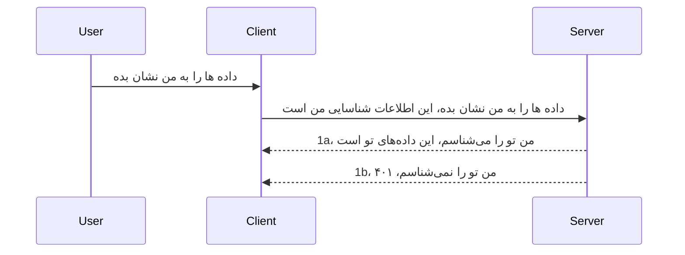

# احراز هویت ساده

SDKهای MCP از استفاده از OAuth 2.1 پشتیبانی می‌کنند که به‌راستی فرایندی نسبتاً پیچیده است و مفاهیمی مانند سرور احراز هویت، سرور منبع، ارسال اطلاعات ورود، دریافت کد، تبادل کد با توکن حامل تا رسیدن به دریافت داده‌های منبع را دربرمی‌گیرد. اگر به OAuth عادت ندارید که اجرای آن بسیار عالی است، بهتر است با سطح پایه‌ای از احراز هویت شروع کنید و به‌تدریج به سمت امنیت بهتر حرکت کنید. به همین دلیل این فصل وجود دارد، تا شما را به سمت احراز هویت پیشرفته‌تر هدایت کند.

## احراز هویت، منظورمان چیست؟

احراز هویت کوتاه شدهٔ دو کلمه‌ی authentication و authorization است. ایده این است که باید دو کار انجام دهیم:

- **تصدیق هویت (Authentication)**، فرایند فهمیدن اینکه آیا اجازه داریم یک شخص وارد خانه‌مان شود، اینکه او حق داشته باشد "اینجا" باشد یعنی دسترسی به سرور منابع ما که امکانات سرور MCP ما روی آن است داشته باشد.
- **مجازسازی (Authorization)**، فرایند فهمیدن اینکه آیا کاربر باید به منابع خاصی که درخواست می‌کند دسترسی داشته باشد، مثلاً این سفارشات یا این محصولات یا اینکه اجازه خواندن محتوا را داشته باشد اما اجازه حذف نداشته باشد، به‌عنوان مثال دیگر.

## مدارک احراز هویت: چگونه به سیستم می‌گوییم که کی هستیم

خوب، اکثر توسعه‌دهندگان وب به فکر ارائه مدرکی به سرور می‌افتند، معمولاً یک راز که می‌گوید آیا اجازه حضور دارند یا خیر "تصدیق هویت". این مدرک معمولاً نسخه‌ای رمزگذاری شده base64 از نام کاربری و رمز عبور یا کلید API است که یک کاربر مشخص را به‌طور یکتا شناسایی می‌کند.

این شامل ارسال آن از طریق هدر به نام "Authorization" به شکل زیر است:

```json
{ "Authorization": "secret123" }
```
  
این معمولاً به‌عنوان احراز هویت پایه شناخته می‌شود. جریان کلی به این صورت عمل می‌کند:


حالا که از منظر جریان کلی فهمیدیم چگونه کار می‌کند، چگونه آن را پیاده‌سازی کنیم؟ خوب، اکثر سرورهای وب مفهوم میان‌افزار (middleware) را دارند، قطعه‌ای از کد که به‌عنوان بخشی از درخواست اجرا می‌شود و می‌تواند مدارک را تأیید کند و اگر مدارک معتبر باشند، اجازه عبور درخواست را می‌دهد. اگر درخواست مدرک معتبری نداشته باشد، خطای احراز هویت دریافت می‌کنید. بیایید ببینیم چگونه می‌توان این را پیاده‌سازی کرد:

**پایتون**

```python
class AuthMiddleware(BaseHTTPMiddleware):
    async def dispatch(self, request, call_next):

        has_header = request.headers.get("Authorization")
        if not has_header:
            print("-> Missing Authorization header!")
            return Response(status_code=401, content="Unauthorized")

        if not valid_token(has_header):
            print("-> Invalid token!")
            return Response(status_code=403, content="Forbidden")

        print("Valid token, proceeding...")
       
        response = await call_next(request)
        # افزودن هر هدر مشتری یا تغییر در پاسخ به گونه‌ای
        return response


starlette_app.add_middleware(CustomHeaderMiddleware)
```
  
در این کد ما:

- میان‌افزاری با نام `AuthMiddleware` ایجاد کردیم که متد `dispatch` آن توسط سرور وب فراخوانی می‌شود.
- میان‌افزار را به سرور وب اضافه کردیم:

    ```python
    starlette_app.add_middleware(AuthMiddleware)
    ```
  
- منطقی برای اعتبارسنجی نوشتیم که بررسی می‌کند آیا هدر Authorization وجود دارد و آیا راز ارسال‌شده معتبر است یا خیر:

    ```python
    has_header = request.headers.get("Authorization")
    if not has_header:
        print("-> Missing Authorization header!")
        return Response(status_code=401, content="Unauthorized")

    if not valid_token(has_header):
        print("-> Invalid token!")
        return Response(status_code=403, content="Forbidden")
    ```
  
اگر راز وجود داشته باشد و معتبر باشد، اجازه می‌دهیم درخواست با فراخوانی `call_next` ادامه یابد و پاسخ برگردانده شود.

    ```python
    response = await call_next(request)
    # هر هدر مشتری را اضافه کنید یا به نحوی پاسخ را تغییر دهید
    return response
    ```
  
نحوه کار این است که اگر درخواست وبی به سمت سرور ارسال شود، میان‌افزار فراخوانی شده و با توجه به پیاده‌سازی آن، یا اجازه عبور درخواست را می‌دهد یا در نهایت خطایی برمی‌گرداند که نشان می‌دهد کلاینت اجازه ادامه ندارد.

**تایپ‌اسکریپت**

اینجا با استفاده از فریمورک محبوب Express میان‌افزاری ایجاد می‌کنیم و درخواست را قبل از رسیدن به سرور MCP رهگیری می‌کنیم. کد آن به این شکل است:

```typescript
function isValid(secret) {
    return secret === "secret123";
}

app.use((req, res, next) => {
    // ۱. آیا هدر اعتبارسنجی وجود دارد؟
    if(!req.headers["Authorization"]) {
        res.status(401).send('Unauthorized');
    }
    
    let token = req.headers["Authorization"];

    // ۲. اعتبار‌سنجی را بررسی کنید.
    if(!isValid(token)) {
        res.status(403).send('Forbidden');
    }

   
    console.log('Middleware executed');
    // ۳. درخواست را به مرحله بعدی در خط لوله درخواست منتقل می‌کند.
    next();
});
```
  
در این کد:

1. ابتدا بررسی می‌کنیم آیا هدر Authorization اصلاً وجود دارد یا خیر، اگر موجود نبود، خطای 401 ارسال می‌کنیم.
2. اعتبار مدرک/توکن را بررسی می‌کنیم، اگر نامعتبر بود، خطای 403 ارسال می‌کنیم.
3. در نهایت درخواست را در خط لوله درخواست‌ها عبور می‌دهیم و منبع درخواستی را بازمی‌گردانیم.

## تمرین: پیاده‌سازی احراز هویت

بیایید دانش‌مان را بیازماییم و آن را پیاده‌سازی کنیم. برنامه به شرح زیر است:

سرور

- ایجاد سرور وب و نمونه MCP.
- پیاده‌سازی میان‌افزار برای سرور.

کلاینت

- ارسال درخواست وب با مدرک از طریق هدر.

### -۱- ایجاد سرور وب و نمونه MCP

در مرحله اول نیاز داریم که نمونه سرور وب و سرور MCP را ایجاد کنیم.

**پایتون**

در اینجا یک نمونه سرور MCP ایجاد می‌کنیم، یک برنامه وب starlette ساختیم و آن را با uvicorn میزبانی می‌کنیم.

```python
# ایجاد سرور MCP

app = FastMCP(
    name="MCP Resource Server",
    instructions="Resource Server that validates tokens via Authorization Server introspection",
    host=settings["host"],
    port=settings["port"],
    debug=True
)

# ایجاد برنامه وب استارلت
starlette_app = app.streamable_http_app()

# سرویس‌دهی برنامه از طریق uvicorn
async def run(starlette_app):
    import uvicorn
    config = uvicorn.Config(
            starlette_app,
            host=app.settings.host,
            port=app.settings.port,
            log_level=app.settings.log_level.lower(),
        )
    server = uvicorn.Server(config)
    await server.serve()

run(starlette_app)
```
  
در این کد:

- سرور MCP ساخته شده است.
- برنامه وب starlette از سرور MCP ساخته شده، `app.streamable_http_app()`.
- برنامه وب با استفاده از uvicorn میزبانی و سرو می‌شود `server.serve()`.

**تایپ‌اسکریپت**

در اینجا نمونه‌ای از سرور MCP ساخته می‌شود.

```typescript
const server = new McpServer({
      name: "example-server",
      version: "1.0.0"
    });

    // ... تنظیم منابع سرور، ابزارها، و پرسش‌ها ...
```
  
ساخت سرور MCP باید داخل تعریف مسیر POST /mcp انجام شود، بنابراین کد بالا را اینگونه منتقل می‌کنیم:

```typescript
import express from "express";
import { randomUUID } from "node:crypto";
import { McpServer } from "@modelcontextprotocol/sdk/server/mcp.js";
import { StreamableHTTPServerTransport } from "@modelcontextprotocol/sdk/server/streamableHttp.js";
import { isInitializeRequest } from "@modelcontextprotocol/sdk/types.js"

const app = express();
app.use(express.json());

// نقشه برای ذخیره‌ی ترنسپورت‌ها بر اساس شناسه جلسه
const transports: { [sessionId: string]: StreamableHTTPServerTransport } = {};

// مدیریت درخواست‌های POST برای ارتباط کلاینت به سرور
app.post('/mcp', async (req, res) => {
  // بررسی وجود شناسه جلسه
  const sessionId = req.headers['mcp-session-id'] as string | undefined;
  let transport: StreamableHTTPServerTransport;

  if (sessionId && transports[sessionId]) {
    // استفاده مجدد از ترنسپورت موجود
    transport = transports[sessionId];
  } else if (!sessionId && isInitializeRequest(req.body)) {
    // درخواست جدید برای مقداردهی اولیه
    transport = new StreamableHTTPServerTransport({
      sessionIdGenerator: () => randomUUID(),
      onsessioninitialized: (sessionId) => {
        // ذخیره‌ی ترنسپورت بر اساس شناسه جلسه
        transports[sessionId] = transport;
      },
      // محافظت در برابر تغییر DNS به‌طور پیش‌فرض برای سازگاری با نسخه‌های قبلی غیرفعال است. اگر این سرور را
      // به صورت محلی اجرا می‌کنید، مطمئن شوید که تنظیمات زیر را انجام داده‌اید:
      // enableDnsRebindingProtection: true,
      // allowedHosts: ['127.0.0.1'],
    });

    // پاکسازی ترنسپورت هنگام بسته شدن
    transport.onclose = () => {
      if (transport.sessionId) {
        delete transports[transport.sessionId];
      }
    };
    const server = new McpServer({
      name: "example-server",
      version: "1.0.0"
    });

    // ... راه‌اندازی منابع سرور، ابزارها و درخواست‌ها ...

    // اتصال به سرور MCP
    await server.connect(transport);
  } else {
    // درخواست نامعتبر
    res.status(400).json({
      jsonrpc: '2.0',
      error: {
        code: -32000,
        message: 'Bad Request: No valid session ID provided',
      },
      id: null,
    });
    return;
  }

  // مدیریت درخواست
  await transport.handleRequest(req, res, req.body);
});

// هندلر قابل استفاده مجدد برای درخواست‌های GET و DELETE
const handleSessionRequest = async (req: express.Request, res: express.Response) => {
  const sessionId = req.headers['mcp-session-id'] as string | undefined;
  if (!sessionId || !transports[sessionId]) {
    res.status(400).send('Invalid or missing session ID');
    return;
  }
  
  const transport = transports[sessionId];
  await transport.handleRequest(req, res);
};

// مدیریت درخواست‌های GET برای اعلان‌های سرور به کلاینت از طریق SSE
app.get('/mcp', handleSessionRequest);

// مدیریت درخواست‌های DELETE برای خاتمه جلسه
app.delete('/mcp', handleSessionRequest);

app.listen(3000);
```
  
حالا می‌بینید چگونه ساخت سرور MCP به داخل `app.post("/mcp")` منتقل شده است.

بیایید به مرحله بعدی، ایجاد میان‌افزار برویم تا بتوانیم مدرک دریافتی را اعتبارسنجی کنیم.

### -۲- پیاده‌سازی میان‌افزار برای سرور

بیایید به بخش میان‌افزار بپردازیم. در اینجا می‌خواهیم میان‌افزاری ایجاد کنیم که به دنبال مدرکی در هدر `Authorization` بگردد و آن را چک کند. اگر قابل قبول بود، درخواست اجازه پیشرفت به عملکردهای MCP مورد نظر را خواهد داشت (مثلاً نمایش ابزارها، خواندن منبع یا هر عملکرد MCP دیگری که کلاینت درخواست کرده است).

**پایتون**

برای ایجاد میان‌افزار، باید کلاسی ایجاد کنیم که از `BaseHTTPMiddleware` ارث‌بری کند. دو بخش مهم هستند:

- درخواست `request` که اطلاعات هدر را از آن می‌خوانیم.
- `call_next` که کال‌بک است و باید آن را در صورت داشتن مدرک قابل قبول فراخوانی کنیم.

اول باید مسئله نبودن هدر `Authorization` را هندل کنیم:

```python
has_header = request.headers.get("Authorization")

# هدر وجود ندارد، با کد ۴۰۱ شکست بخور، در غیر این صورت ادامه بده.
if not has_header:
    print("-> Missing Authorization header!")
    return Response(status_code=401, content="Unauthorized")
```
  
در اینجا پیام ۴۰۱ غیرمجاز ارسال می‌کنیم چون کلاینت در تصدیق هویت ناموفق بوده است.

سپس اگر مدرکی ارسال شده بود، اعتبار آن را به شکل زیر بررسی می‌کنیم:

```python
 if not valid_token(has_header):
    print("-> Invalid token!")
    return Response(status_code=403, content="Forbidden")
```
  
توجه کنید که پیام ۴۰۳ ممنوعه ارسال می‌شود. حالا کل میان‌افزار را ببینید که همه موارد بالا را پیاده‌سازی کرده است:

```python
class AuthMiddleware(BaseHTTPMiddleware):
    async def dispatch(self, request, call_next):

        has_header = request.headers.get("Authorization")
        if not has_header:
            print("-> Missing Authorization header!")
            return Response(status_code=401, content="Unauthorized")

        if not valid_token(has_header):
            print("-> Invalid token!")
            return Response(status_code=403, content="Forbidden")

        print("Valid token, proceeding...")
        print(f"-> Received {request.method} {request.url}")
        response = await call_next(request)
        response.headers['Custom'] = 'Example'
        return response

```
  
عالی، اما تابع `valid_token` چیست؟ اینجا است:

```python
# برای تولید استفاده نکنید - آن را بهبود دهید !!
def valid_token(token: str) -> bool:
    # پیشوند "Bearer " را حذف کنید
    if token.startswith("Bearer "):
        token = token[7:]
        return token == "secret-token"
    return False
```
  
بدیهی است که این باید بهبود یابد.

مهم: هیچ‌گاه نباید چنین رازهایی را داخل کد نگه دارید. ایده‌آل این است که مقدار برای مقایسه را از منبع داده یا سرویس‌دهنده هویتی (IDP) دریافت کنید یا بهتر اینکه IDP خودش اعتبارسنجی را انجام دهد.

**تایپ‌اسکریپت**

برای پیاده‌سازی این مورد با Express، باید متد `use` را که میان‌افزارها را می‌پذیرد فراخوانی کنیم.

نیاز داریم:

- با متغیر درخواست تعامل کنیم تا مدرک ارسال‌شده در خاصیت `Authorization` را چک کنیم.
- مدرک را اعتبارسنجی کنیم و اگر صحیح بود اجازه ادامه درخواست و انجام عملیات MCP داده شود (مثلاً نمایش ابزارها، خواندن منبع و غیره).

در اینجا بررسی می‌کنیم که آیا هدر `Authorization` وجود دارد یا خیر، اگر نه، درخواست را متوقف می‌کنیم:

```typescript
if(!req.headers["authorization"]) {
    res.status(401).send('Unauthorized');
    return;
}
```
  
اگر هدر اصلاً ارسال نشده باشد، خطای ۴۰۱ دریافت می‌کنید.

سپس بررسی می‌کنیم آیا مدرک معتبر است یا خیر، اگر نه، دوباره درخواست متوقف می‌شود ولی با پیغام متفاوت:

```typescript
if(!isValid(token)) {
    res.status(403).send('Forbidden');
    return;
} 
```
  
توجه کنید که اکنون خطای ۴۰۳ دریافت می‌کنید.

کد کامل اینجاست:

```typescript
app.use((req, res, next) => {
    console.log('Request received:', req.method, req.url, req.headers);
    console.log('Headers:', req.headers["authorization"]);
    if(!req.headers["authorization"]) {
        res.status(401).send('Unauthorized');
        return;
    }
    
    let token = req.headers["authorization"];

    if(!isValid(token)) {
        res.status(403).send('Forbidden');
        return;
    }  

    console.log('Middleware executed');
    next();
});
```
  
وب سرور را طوری تنظیم کردیم که میان‌افزاری برای بررسی مدرک ارسالی کلاینت بپذیرد. حال کلاینت چه کار می‌کند؟

### -۳- ارسال درخواست وب با مدرک از طریق هدر

باید اطمینان حاصل کنیم که کلاینت مدرک را از طریق هدر ارسال می‌کند. از آنجا که قرار است از کلاینت MCP استفاده کنیم، باید بفهمیم چگونه این کار انجام می‌شود.

**پایتون**

برای کلاینت، باید هدر با مدرک خودمان را مطابق این شکل پاس بدهیم:

```python
# مقدار را سخت کد نکنید، حداقل آن را در یک متغیر محیطی یا یک محل ذخیره‌سازی امن‌تر نگه دارید
token = "secret-token"

async with streamablehttp_client(
        url = f"http://localhost:{port}/mcp",
        headers = {"Authorization": f"Bearer {token}"}
    ) as (
        read_stream,
        write_stream,
        session_callback,
    ):
        async with ClientSession(
            read_stream,
            write_stream
        ) as session:
            await session.initialize()
      
            # انجام شود، کاری که می‌خواهید در سمت کلاینت انجام شود، مثلاً فهرست ابزارها، فراخوانی ابزارها و غیره
```
  
توجه کنید چطور خاصیت `headers` را اینگونه پر می‌کنیم ` headers = {"Authorization": f"Bearer {token}"}`.

**تایپ‌اسکریپت**

می‌توانیم این کار را در دو مرحله حل کنیم:

1. شیء پیکربندی را با مدرک خود پر کنیم.
2. شیء پیکربندی را به ترنسپورت پاس دهیم.

```typescript

// مقدار را مانند نمونه اینجا به صورت هاردکد شده قرار ندهید. حداقل آن را به صورت یک متغیر محیطی داشته باشید و چیزی مانند dotenv (در حالت توسعه) استفاده کنید.
let token = "secret123"

// یک شی گزینه انتقال کلاینت تعریف کنید
let options: StreamableHTTPClientTransportOptions = {
  sessionId: sessionId,
  requestInit: {
    headers: {
      "Authorization": "secret123"
    }
  }
};

// شی گزینه‌ها را به انتقال ارسال کنید
async function main() {
   const transport = new StreamableHTTPClientTransport(
      new URL(serverUrl),
      options
   );
```
  
اینجا می‌بینید که باید شیء `options` ایجاد کنیم و هدرها را تحت خاصیت `requestInit` قرار دهیم.

مهم: حالا چگونه این را بهبود دهیم؟ اجرای فعلی مشکلاتی دارد. اول اینکه ارسال مدرک به این شکل بسیار پرریسک است مگر حداقل HTTPS داشته باشید. حتی با وجود آن، مدرک ممکن است دزدیده شود بنابراین باید سیستمی داشته باشید که بتوانید توکن را به‌راحتی لغو کنید و بررسی‌های بیشتری افزایش دهید مانند اینکه این درخواست از کجا آمده، آیا درخواست خیلی زیاد شده (رفتار ربات مانند)، خلاصه موضوعات زیادی هست.

با این حال، برای APIهای بسیار ساده که نمی‌خواهید هیچ کس بدون احراز هویت به API شما دسترسی داشته باشد، آنچه اینجا هست شروع خوبی است.

با این وجود، بیایید امنیت را کمی سخت‌تر کنیم با استفاده از قالب استانداردی مثل JSON Web Token که به اختصار JWT یا توکن‌های "JOT" نیز نامیده می‌شوند.

## JSON Web Tokens، JWT

می‌خواهیم از ارسال مدارک بسیار ساده بهتر شویم. چه بهبودهای فوری با پذیرش JWT به‌دست می‌آوریم؟

- **بهبودهای امنیتی**. در احراز هویت پایه، نام کاربری و رمز عبور را به‌صورت توکن رمزگذاری شده base64 (یا کلید API) بارها و بارها ارسال می‌کنید که ریسک را بالا می‌برد. با JWT، نام کاربری و رمز عبور را ارسال و توکنی دریافت می‌کنید که محدود به زمان است یعنی منقضی می‌شود. JWT به شما اجازه می‌دهد کنترل دسترسی دقیق‌تری با نقش‌ها، حوزه‌ها و مجوزها داشته باشید.
- **بدون حالت و مقیاس‌پذیری**. JWTها کامل و خودکفا هستند، تمام اطلاعات کاربر را حمل می‌کنند و نیازی به ذخیره جلسه سمت سرور را حذف می‌کند. همچنین می‌توان به‌صورت محلی توکن را اعتبارسنجی کرد.
- **قابلیت همکاری و فدراسیون**. JWT محوری برای Open ID Connect است و با ارائه‌دهندگان شناخته شده هویت مانند Entra ID، Google Identity و Auth0 استفاده می‌شود. همچنین امکان ورود یک‌بار (Single Sign-On) و خیلی امکانات دیگر را فراهم می‌کند که درجه سازمانی دارد.
- **ماژولار و انعطاف‌پذیر**. JWTها می‌توانند با دروازه‌های API مانند Azure API Management، NGINX و غیره نیز استفاده شوند. از سناریوهای احراز هویت و ارتباط سرور-به-سرور از جمله تقلید و واگذاری پشتیبانی می‌کنند.
- **کارایی و کشینگ**. پس از رمزگشایی، JWT می‌تواند کش شود که نیاز به تجزیه مکرر را کاهش می‌دهد. این به‌ویژه در برنامه‌های پر ترافیک به بهبود توان عملیاتی و کاهش بار روی زیرساخت کمک می‌کند.
- **ویژگی‌های پیشرفته**. همچنین از درون‌نگری (بررسی اعتبار روی سرور) و لغو (باطل کردن توکن) پشتیبانی می‌کند.

با تمامی این مزایا، بیایید ببینیم چگونه می‌توانیم پیاده‌سازی خود را به سطح بعدی ببریم.

## تبدیل احراز هویت پایه به JWT

تغییرات کلان مورد نیاز عبارتند از:

- **یادگیری ساخت توکن JWT** و آماده کردن آن برای ارسال از کلاینت به سرور.
- **اعتبارسنجی توکن JWT** و در صورت صحت اجازه دادن به کلاینت برای دسترسی به منابع.
- **ذخیره‌سازی امن توکن**. چگونه این توکن را ذخیره کنیم.
- **محافظت از مسیرها**. باید مسیرها و ویژگی‌های خاص MCP را محافظت کنیم.
- **افزودن توکن‌های تازه‌سازی**. اطمینان از ایجاد توکن‌های کوتاه‌مدت ولی توکن‌های تازه‌سازی بلندمدت که می‌توان برای دریافت توکن‌های جدید در صورت انقضا استفاده کرد. همچنین باید نقطه پایان تازه‌سازی و استراتژی چرخش داشته باشیم.

### -۱- ساخت توکن JWT

اول اینکه توکن JWT دارای بخش‌های زیر است:

- **هدر**، الگوریتم استفاده شده و نوع توکن.
- **بدنه (Payload)**، ادعاها (claims) مثل sub (کاربری که توکن نماینده اوست، معمولاً شناسه کاربر در سناریو احراز هویت)، exp (زمان انقضا) و role (نقش).
- **امضا**، با یک کلید مخفی یا کلید خصوصی امضا شده است.

برای این، باید هدر، بدنه و توکن رمزگذاری شده را بسازیم.

**پایتون**

```python

import jwt
import jwt
from jwt.exceptions import ExpiredSignatureError, InvalidTokenError
import datetime

# کلید مخفی استفاده شده برای امضای JWT
secret_key = 'your-secret-key'

header = {
    "alg": "HS256",
    "typ": "JWT"
}

# اطلاعات کاربر و ادعاها و زمان انقضای آن
payload = {
    "sub": "1234567890",               # موضوع (شناسه کاربر)
    "name": "User Userson",                # ادعای سفارشی
    "admin": True,                     # ادعای سفارشی
    "iat": datetime.datetime.utcnow(),# زمان صدور
    "exp": datetime.datetime.utcnow() + datetime.timedelta(hours=1)  # انقضا
}

# آن را رمزگذاری کن
encoded_jwt = jwt.encode(payload, secret_key, algorithm="HS256", headers=header)
```
  
کد بالا:

- هدر با الگوریتم HS256 و نوع JWT تعریف شده است.
- بدنه شامل شناسه (subject یا user id)، نام کاربری، نقش، زمان صدور و زمان انقضا است که جنبه محدودیت زمانی را پیاده می‌کند.

**تایپ‌اسکریپت**

در اینجا به چند وابستگی نیاز داریم که به ساخت توکن JWT کمک کنند.

وابستگی‌ها

```sh

npm install jsonwebtoken
npm install --save-dev @types/jsonwebtoken
```
  
اکنون که این آماده است، هدر، بدنه و از طریق آن توکن رمزگذاری شده را می‌سازیم.

```typescript
import jwt from 'jsonwebtoken';

const secretKey = 'your-secret-key'; // استفاده از متغیرهای محیطی در تولید

// تعریف محتوای بار
const payload = {
  sub: '1234567890',
  name: 'User usersson',
  admin: true,
  iat: Math.floor(Date.now() / 1000), // صادر شده در
  exp: Math.floor(Date.now() / 1000) + 60 * 60 // منقضی در ۱ ساعت
};

// تعریف هدر (اختیاری، jsonwebtoken مقادیر پیش‌فرض را تنظیم می‌کند)
const header = {
  alg: 'HS256',
  typ: 'JWT'
};

// ایجاد توکن
const token = jwt.sign(payload, secretKey, {
  algorithm: 'HS256',
  header: header
});

console.log('JWT:', token);
```
  
این توکن:

با HS256 امضا شده  
برای ۱ ساعت معتبر است  
ادعاهایی مانند sub، name، admin، iat و exp دارد.

### -۲- اعتبارسنجی توکن

باید توکن را اعتبارسنجی کنیم، این کاری است که باید در سرور انجام دهیم تا اطمینان حاصل کنیم چیزی که کلاینت ارسال می‌کند واقعاً صحیح است. بررسی‌های زیادی باید انجام دهیم از اعتبار ساختار گرفته تا صحت آن. همچنین تشویق می‌شوید بررسی‌های بیشتری برای اطمینان از وجود کاربر در سیستم خود و حقوق او انجام دهید.

برای اعتبارسنجی توکن، باید آن را رمزگشایی کنیم تا بتوانیم بخوانیم و سپس اعتبار آن را چک کنیم:

**پایتون**

```python

# رمزگشایی و اعتبارسنجی JWT
try:
    decoded = jwt.decode(token, secret_key, algorithms=["HS256"])
    print("✅ Token is valid.")
    print("Decoded claims:")
    for key, value in decoded.items():
        print(f"  {key}: {value}")
except ExpiredSignatureError:
    print("❌ Token has expired.")
except InvalidTokenError as e:
    print(f"❌ Invalid token: {e}")

```
  
در این کد، تابع `jwt.decode` را با ورودی توکن، کلید مخفی و الگوریتم انتخاب‌شده فراخوانی می‌کنیم. توجه کنید که از ساختار try-catch استفاده می‌کنیم چرا که خطای اعتبارسنجی باعث پرتاب خطا می‌شود.

**تایپ‌اسکریپت**

در اینجا باید `jwt.verify` را صدا بزنیم تا نسخه رمزگشایی‌شده توکن را دریافت کنیم و بتوانیم بیشتر تحلیل کنیم. اگر این فراخوانی خطا بدهد، یعنی ساختار توکن اشتباه است یا دیگر معتبر نیست.

```typescript

try {
  const decoded = jwt.verify(token, secretKey);
  console.log('Decoded Payload:', decoded);
} catch (err) {
  console.error('Token verification failed:', err);
}
```
  
نکته: همانطور که قبلاً گفته شد، باید بررسی‌های بیشتری انجام دهیم تا اطمینان حاصل کنیم این توکن کاربر معتبر در سیستم ما را نشان می‌دهد و مطمئن شویم کاربر حقوق مدعی شده را دارد.
بعد، بیایید نگاهی به کنترل دسترسی مبتنی بر نقش بیندازیم، که به آن RBAC نیز گفته می‌شود.

## افزودن کنترل دسترسی مبتنی بر نقش

ایده این است که می‌خواهیم بیان کنیم نقش‌های مختلف دسترسی‌های متفاوتی دارند. برای مثال، ما فرض می‌کنیم که یک مدیر (admin) می‌تواند همه چیز را انجام دهد و کاربران عادی می‌توانند خواندن/نوشتن انجام دهند و مهمان تنها می‌تواند خواندن کند. بنابراین، در اینجا برخی سطوح دسترسی ممکن است:

- Admin.Write  
- User.Read  
- Guest.Read  

بیایید ببینیم چگونه می‌توانیم چنین کنترلی را با میان‌افزار پیاده‌سازی کنیم. میان‌افزارها می‌توانند به ازای هر مسیر اضافه شوند و همچنین برای همه مسیرها.

**Python**

```python
from starlette.middleware.base import BaseHTTPMiddleware
from starlette.responses import JSONResponse
import jwt

# رمز را در کد نگذارید، این فقط برای اهداف نمایشی است. آن را از یک مکان امن بخوانید.
SECRET_KEY = "your-secret-key" # این را در متغیر محیطی قرار دهید
REQUIRED_PERMISSION = "User.Read"

class JWTPermissionMiddleware(BaseHTTPMiddleware):
    async def dispatch(self, request, call_next):
        auth_header = request.headers.get("Authorization")
        if not auth_header or not auth_header.startswith("Bearer "):
            return JSONResponse({"error": "Missing or invalid Authorization header"}, status_code=401)

        token = auth_header.split(" ")[1]
        try:
            decoded = jwt.decode(token, SECRET_KEY, algorithms=["HS256"])
        except jwt.ExpiredSignatureError:
            return JSONResponse({"error": "Token expired"}, status_code=401)
        except jwt.InvalidTokenError:
            return JSONResponse({"error": "Invalid token"}, status_code=401)

        permissions = decoded.get("permissions", [])
        if REQUIRED_PERMISSION not in permissions:
            return JSONResponse({"error": "Permission denied"}, status_code=403)

        request.state.user = decoded
        return await call_next(request)


```
  
راه‌های مختلفی برای افزودن میان‌افزار مانند زیر وجود دارد:

```python

# گزینه ۱: افزودن میان‌افزار در هنگام ساخت برنامه استارلت
middleware = [
    Middleware(JWTPermissionMiddleware)
]

app = Starlette(routes=routes, middleware=middleware)

# گزینه ۲: افزودن میان‌افزار پس از اینکه برنامه استارلت ساخته شده است
starlette_app.add_middleware(JWTPermissionMiddleware)

# گزینه ۳: افزودن میان‌افزار برای هر مسیر
routes = [
    Route(
        "/mcp",
        endpoint=..., # هندلر
        middleware=[Middleware(JWTPermissionMiddleware)]
    )
]
```
  
**TypeScript**

می‌توانیم از `app.use` و یک میان‌افزار استفاده کنیم که برای همه درخواست‌ها اجرا شود.

```typescript
app.use((req, res, next) => {
    console.log('Request received:', req.method, req.url, req.headers);
    console.log('Headers:', req.headers["authorization"]);

    // ۱. بررسی کنید که هدر احراز هویت ارسال شده است یا خیر

    if(!req.headers["authorization"]) {
        res.status(401).send('Unauthorized');
        return;
    }
    
    let token = req.headers["authorization"];

    // ۲. بررسی کنید که توکن معتبر است
    if(!isValid(token)) {
        res.status(403).send('Forbidden');
        return;
    }  

    // ۳. بررسی کنید که کاربر توکن در سیستم ما وجود دارد
    if(!isExistingUser(token)) {
        res.status(403).send('Forbidden');
        console.log("User does not exist");
        return;
    }
    console.log("User exists");

    // ۴. تأیید کنید که توکن مجوزهای لازم را دارد
    if(!hasScopes(token, ["User.Read"])){
        res.status(403).send('Forbidden - insufficient scopes');
    }

    console.log("User has required scopes");

    console.log('Middleware executed');
    next();
});

```
  
چند نکته مهم هست که می‌توانیم به میان‌افزار خود بدهیم و همچنین میان‌افزار ما باید انجام دهد، یعنی:

1. بررسی کند آیا هدر احراز هویت وجود دارد  
2. بررسی کند آیا توکن معتبر است، ما متدی به نام `isValid` نوشته‌ایم که تمامیت و اعتبار توکن JWT را بررسی می‌کند.  
3. تأیید کند کاربر در سیستم ما وجود دارد، حتما باید این را چک کنیم.

   ```typescript
    // کاربران در پایگاه داده
   const users = [
     "user1",
     "User usersson",
   ]

   function isExistingUser(token) {
     let decodedToken = verifyToken(token);

     // انجام شد، بررسی کنید که آیا کاربر در پایگاه داده وجود دارد
     return users.includes(decodedToken?.name || "");
   }
   ```
  
در بالا، ما یک لیست بسیار ساده `users` ساخته‌ایم، که در واقع باید در یک پایگاه داده باشد.

4. علاوه بر این، باید بررسی کنیم که توکن دسترسی‌های صحیح را دارد یا نه.

   ```typescript
   if(!hasScopes(token, ["User.Read"])){
        res.status(403).send('Forbidden - insufficient scopes');
   }
   ```
  
در کد بالا از میان‌افزار، ما بررسی می‌کنیم که توکن دسترسی User.Read را دارد یا نه، اگر ندارد خطای 403 می‌فرستیم. پایین‌تر روش کمکی `hasScopes` آمده است.

   ```typescript
   function hasScopes(scope: string, requiredScopes: string[]) {
     let decodedToken = verifyToken(scope);
    return requiredScopes.every(scope => decodedToken?.scopes.includes(scope));
  }  
   ```

Have a think which additional checks you should be doing, but these are the absolute minimum of checks you should be doing.

Using Express as a web framework is a common choice. There are helpers library when you use JWT so you can write less code.

- `express-jwt`, helper library that provides a middleware that helps decode your token.
- `express-jwt-permissions`, this provides a middleware `guard` that helps check if a certain permission is on the token.

Here's what these libraries can look like when used:

```typescript
const express = require('express');
const jwt = require('express-jwt');
const guard = require('express-jwt-permissions')();

const app = express();
const secretKey = 'your-secret-key'; // put this in env variable

// Decode JWT and attach to req.user
app.use(jwt({ secret: secretKey, algorithms: ['HS256'] }));

// Check for User.Read permission
app.use(guard.check('User.Read'));

// multiple permissions
// app.use(guard.check(['User.Read', 'Admin.Access']));

app.get('/protected', (req, res) => {
  res.json({ message: `Welcome ${req.user.name}` });
});

// Error handler
app.use((err, req, res, next) => {
  if (err.code === 'permission_denied') {
    return res.status(403).send('Forbidden');
  }
  next(err);
});

```
  
حالا دیدید چگونه از میان‌افزار برای احراز هویت و مجوز استفاده می‌شود، اما درباره MCP چطور؟ آیا نحوه احراز هویت ما تغییر می‌کند؟ بیایید در بخش بعدی کشف کنیم.

### -3- افزودن RBAC به MCP

تا حالا دیدید چگونه می‌توانید RBAC را از طریق میان‌افزار اضافه کنید، اما برای MCP راه آسانی برای افزودن RBAC به ازای هر ویژگی MCP وجود ندارد، پس چه کار کنیم؟ خوب، فقط باید کدی مانند این اضافه کنیم که در این حالت بررسی می‌کند آیا کلاینت حق فراخوانی ابزار خاصی را دارد یا نه:

شما چند گزینه مختلف برای انجام RBAC به ازای هر ویژگی دارید، مواردی مانند:

- افزودن بررسی برای هر ابزار، منبع، پرامپتی که نیاز به چک کردن سطح دسترسی دارد.

   **python**

   ```python
   @tool()
   def delete_product(id: int):
      try:
          check_permissions(role="Admin.Write", request)
      catch:
        pass # مشتری احراز هویت را رد کرد، خطای احراز هویت ایجاد شود
   ```
  
   **typescript**

   ```typescript
   server.registerTool(
    "delete-product",
    {
      title: Delete a product",
      description: "Deletes a product",
      inputSchema: { id: z.number() }
    },
    async ({ id }) => {
      
      try {
        checkPermissions("Admin.Write", request);
        // باید انجام شود، ارسال شناسه به productService و ورودی از راه دور
      } catch(Exception e) {
        console.log("Authorization error, you're not allowed");  
      }

      return {
        content: [{ type: "text", text: `Deletected product with id ${id}` }]
      };
    }
   );
   ```


- استفاده از رویکرد پیشرفته سرور و هندلرهای درخواست تا تعداد مکان‌هایی که باید چک انجام دهید را به حداقل برسانید.

   **Python**

   ```python
   
   tool_permission = {
      "create_product": ["User.Write", "Admin.Write"],
      "delete_product": ["Admin.Write"]
   }

   def has_permission(user_permissions, required_permissions) -> bool:
      # user_permissions: فهرستی از مجوزهایی که کاربر دارد
      # required_permissions: فهرستی از مجوزهای مورد نیاز برای ابزار
      return any(perm in user_permissions for perm in required_permissions)

   @server.call_tool()
   async def handle_call_tool(
     name: str, arguments: dict[str, str] | None
   ) -> list[types.TextContent]:
    # فرض کنید request.user.permissions فهرستی از مجوزهای کاربر است
     user_permissions = request.user.permissions
     required_permissions = tool_permission.get(name, [])
     if not has_permission(user_permissions, required_permissions):
        # خطا بده "شما اجازه استفاده از ابزار {name} را ندارید"
        raise Exception(f"You don't have permission to call tool {name}")
     # ادامه داده و ابزار را فراخوانی کن
     # ...
   ```   
  

   **TypeScript**

   ```typescript
   function hasPermission(userPermissions: string[], requiredPermissions: string[]): boolean {
       if (!Array.isArray(userPermissions) || !Array.isArray(requiredPermissions)) return false;
       // اگر کاربر حداقل یک مجوز لازم را داشته باشد، مقدار true بازگردانده می‌شود
       
       return requiredPermissions.some(perm => userPermissions.includes(perm));
   }
  
   server.setRequestHandler(CallToolRequestSchema, async (request) => {
      const { params: { name } } = request;
  
      let permissions = request.user.permissions;
  
      if (!hasPermission(permissions, toolPermissions[name])) {
         return new Error(`You don't have permission to call ${name}`);
      }
  
      // ادامه بده..
   });
   ```
  
توجه کنید، شما باید مطمئن شوید که میان‌افزار شما توکن رمزگشایی شده را به ویژگی user در درخواست اختصاص می‌دهد تا کد بالا ساده شود.

### جمع‌بندی

حالا که درباره نحوه افزودن پشتیبانی برای RBAC به طور کلی و برای MCP به طور خاص صحبت کردیم، زمان آن است که خودتان امنیت را پیاده‌سازی کنید تا مطمئن شوید مفاهیم ارائه شده را فهمیده‌اید.

## تمرین ۱: ساخت سرور MCP و کلاینت MCP با استفاده از احراز هویت پایه

در این تمرین، شما آنچه را آموخته‌اید در زمینه ارسال اطلاعات ورود از طریق هدرها به کار می‌برید.

## راه‌حل ۱

[راه‌حل ۱](./code/basic/README.md)

## تمرین ۲: ارتقاء راه‌حل تمرین ۱ به استفاده از JWT

راه‌حل اول را بگیرید ولی این بار آن را بهبود دهید.

به جای استفاده از Basic Auth، از JWT استفاده کنیم.

## راه‌حل ۲

[راه‌حل ۲](./solution/jwt-solution/README.md)

## چالش

افزودن RBAC به ازای هر ابزار که در بخش "Add RBAC to MCP" شرح داده شده است.

## خلاصه

امیدواریم شما در این فصل چیزهای زیادی یاد گرفته باشید، از امنیت صفر تا امنیت پایه، تا JWT و نحوه افزودنش به MCP.

ما یک پایه محکم با JWT سفارشی ساختیم، ولی با گسترش سیستم به سمت مدلی مبتنی بر استانداردهای هویت حرکت می‌کنیم. اتخاذ یک IdP مانند Entra یا Keycloak به ما اجازه می‌دهد فرآیند صدور، اعتبارسنجی و مدیریت طول عمر توکن‌ها را به یک پلتفرم مطمئن بسپاریم — تا بتوانیم روی منطق برنامه و تجربه کاربری تمرکز کنیم.

برای این منظور، ما یک فصل [پیشرفته‌تر درباره Entra](../../05-AdvancedTopics/mcp-security-entra/README.md) داریم.

## گام بعدی

- بعدی: [راه‌اندازی میزبان‌های MCP](../12-mcp-hosts/README.md)

---

<!-- CO-OP TRANSLATOR DISCLAIMER START -->
**سلب مسئولیت**:  
این سند با استفاده از سرویس ترجمه هوش مصنوعی [Co-op Translator](https://github.com/Azure/co-op-translator) ترجمه شده است. در حالی که ما برای دقت تلاش می‌کنیم، لطفاً توجه داشته باشید که ترجمه‌های خودکار ممکن است حاوی خطاها یا نادرستی‌هایی باشند. سند اصلی به زبان مادری آن باید به عنوان منبع معتبر در نظر گرفته شود. برای اطلاعات حساس، ترجمه حرفه‌ای انسانی توصیه می‌شود. ما در قبال هر گونه سوءتفاهم یا برداشت نادرست ناشی از استفاده از این ترجمه مسئولیتی نداریم.
<!-- CO-OP TRANSLATOR DISCLAIMER END -->