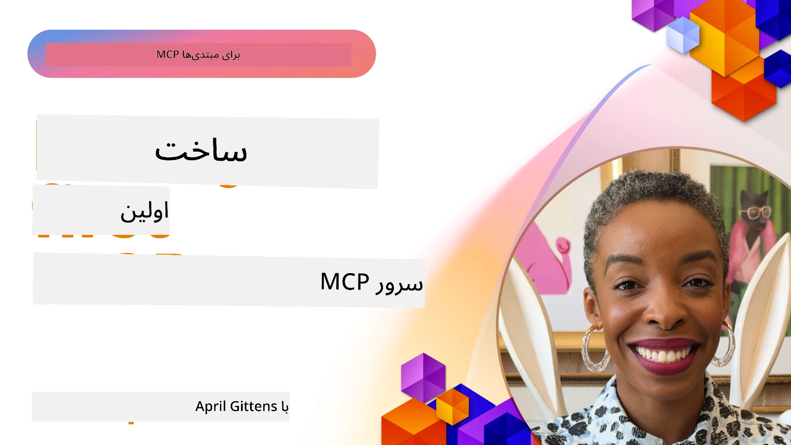

## شروع کار

_(برای مشاهده ویدیوی این درس روی تصویر بالا کلیک کنید)_

این بخش شامل چندین درس است:

- **1 سرور اول شما**، در این درس اول، یاد می‌گیرید چگونه اولین سرور خود را ایجاد کرده و با ابزار بازرسی آن را بررسی کنید، روشی ارزشمند برای تست و اشکال‌زدایی سرور شما، [به درس](01-first-server/README.md)

- **2 کلاینت**، در این درس، می‌آموزید چگونه کلاینتی بنویسید که بتواند به سرور شما متصل شود، [به درس](02-client/README.md)

- **3 کلاینت با LLM**، روش بهتر نوشتن کلاینت اضافه کردن یک LLM به آن است تا بتواند با سرور شما "مذاکره" کند که چه کاری انجام دهد، [به درس](03-llm-client/README.md)

- **4 استفاده از حالت Agent گیت‌هاب کاپیلوت سرور در ویژوال استودیو کد**. اینجا به اجرای سرور MCP خود از داخل ویژوال استودیو کد می‌پردازیم، [به درس](04-vscode/README.md)

- **5 سرور انتقال stdio** استاندارد stdio برای ارتباط سرور به کلاینت MCP محلی توصیه می‌شود، که ارتباط امن مبتنی بر فرایند فرعی با جداسازی درونی فرایند را فراهم می‌کند [به درس](05-stdio-server/README.md)

- **6 استریمینگ HTTP با MCP (HTTP قابل استریم)**. درباره انتقال مدرن استریمینگ HTTP (روش توصیه شده برای سرورهای دور MCP مطابق [مشخصات MCP 2025-11-25](https://spec.modelcontextprotocol.io/specification/2025-11-25/basic/transports/#streamable-http))، اطلاع‌رسانی پیشرفت، و چگونگی پیاده‌سازی سرورها و کلاینت‌های MCP مقیاس‌پذیر و بلادرنگ با استفاده از HTTP قابل استریم بیاموزید. [به درس](06-http-streaming/README.md)

- **7 استفاده از کیت ابزار AI برای VSCode** جهت مصرف و تست کلاینت‌ها و سرورهای MCP شما [به درس](07-aitk/README.md)

- **8 تست**. اینجا به ویژه تمرکز می‌کنیم چگونه می‌توان سرور و کلاینت خود را به روش‌های مختلف تست کرد، [به درس](08-testing/README.md)

- **9 استقرار**. این فصل به روش‌های مختلف استقرار راه‌حل‌های MCP شما می‌پردازد، [به درس](09-deployment/README.md)

- **10 استفاده پیشرفته از سرور**. این فصل به استفاده پیشرفته از سرور می‌پردازد، [به درس](./10-advanced/README.md)

- **11 احراز هویت**. این فصل به افزودن احراز هویت ساده، از Basic Auth تا استفاده از JWT و RBAC می‌پردازد. توصیه می‌شود از اینجا شروع کرده سپس به موضوعات پیشرفته در فصل ۵ نگاه کنید و از طریق توصیه‌های فصل ۲ سخت‌افزاری‌های امنیتی اضافی را اعمال کنید، [به درس](./11-simple-auth/README.md)

- **12 میزبان‌های MCP**. پیکربندی و استفاده از کلاینت‌های محبوب میزبان MCP از جمله Claude Desktop، Cursor، Cline، و Windsurf. یادگیری انواع انتقال و رفع مشکلات، [به درس](./12-mcp-hosts/README.md)

- **13 بازرس MCP**. اشکال‌زدایی و تست تعاملی سرورهای MCP شما با استفاده از ابزار MCP Inspector. یادگیری رفع مشکلات ابزارها، منابع و پیام‌های پروتکل، [به درس](./13-mcp-inspector/README.md)

پروتکل مدل کانتکست (MCP) پروتکلی باز است که استانداردهای ارائه کانتکست به LLM ها را تعریف می‌کند. MCP را می‌توان مانند یک پورت USB-C برای برنامه‌های هوش مصنوعی تصور کرد - روشی استاندارد برای اتصال مدل‌های هوش مصنوعی به منابع داده و ابزارهای مختلف فراهم می‌کند.

## اهداف یادگیری

تا پایان این درس، قادر خواهید بود:

- راه‌اندازی محیط‌های توسعه MCP در C#، جاوا، پایتون، تایپ‌اسکریپت و جاوااسکریپت
- ساخت و استقرار سرورهای پایه MCP با ویژگی‌های سفارشی (منابع، پرامپت‌ها و ابزارها)
- ایجاد برنامه‌های میزبانی که به سرورهای MCP متصل می‌شوند
- تست و اشکال‌زدایی پیاده‌سازی‌های MCP
- درک چالش‌های رایج راه‌اندازی و راه‌حل‌های آن‌ها
- اتصال پیاده‌سازی‌های MCP خود به سرویس‌های محبوب LLM

## راه‌اندازی محیط MCP شما

قبل از شروع به کار با MCP، مهم است که محیط توسعه خود را آماده کنید و روند کاری پایه را درک کنید. این بخش شما را در مراحل اولیه راه‌اندازی برای شروعی روان با MCP راهنمایی می‌کند.

### پیش‌نیازها

قبل از ورود به توسعه MCP، مطمئن شوید که:

- **محیط توسعه**: برای زبان انتخابی شما (C#، جاوا، پایتون، تایپ‌اسکریپت یا جاوااسکریپت)
- **IDE/ویرایشگر**: ویژوال استودیو، ویژوال استودیو کد، IntelliJ، Eclipse، PyCharm یا هر ویرایشگر کد مدرن دیگر
- **مدیران بسته‌ها**: NuGet، Maven/Gradle، pip یا npm/yarn
- **کلیدهای API**: برای هر سرویس هوشمندی که قصد دارید در برنامه‌های میزبان خود استفاده کنید

### SDKهای رسمی

در فصل‌های بعدی خواهید دید که راه‌حل‌ها با استفاده از پایتون، تایپ‌اسکریپت، جاوا و .NET ساخته شده‌اند. اینجا تمام SDKهای رسمی پشتیبانی شده آمده است.

MCP SDKهای رسمی برای چندین زبان ارائه می‌دهد (مطابق با [مشخصات MCP 2025-11-25](https://spec.modelcontextprotocol.io/specification/2025-11-25/)):

- [SDK سی‌شارپ](https://github.com/modelcontextprotocol/csharp-sdk) - به‌روزرسانی شده با همکاری مایکروسافت
- [SDK جاوا](https://github.com/modelcontextprotocol/java-sdk) - به‌روزرسانی شده با همکاری Spring AI
- [SDK تایپ‌اسکریپت](https://github.com/modelcontextprotocol/typescript-sdk) - پیاده‌سازی رسمی تایپ‌اسکریپت
- [SDK پایتون](https://github.com/modelcontextprotocol/python-sdk) - پیاده‌سازی رسمی پایتون (FastMCP)
- [SDK کاتلین](https://github.com/modelcontextprotocol/kotlin-sdk) - پیاده‌سازی رسمی کاتلین
- [SDK سوییفت](https://github.com/modelcontextprotocol/swift-sdk) - به‌روزرسانی شده با همکاری Loopwork AI
- [SDK راست](https://github.com/modelcontextprotocol/rust-sdk) - پیاده‌سازی رسمی راست
- [SDK گو](https://github.com/modelcontextprotocol/go-sdk) - پیاده‌سازی رسمی گو

## نکات کلیدی

- راه‌اندازی محیط توسعه MCP با SDKهای اختصاصی زبان بسیار ساده است
- ساخت سرورهای MCP شامل ایجاد و ثبت ابزارها با شمایل‌های واضح است
- کلاینت‌های MCP به سرورها و مدل‌ها متصل می‌شوند تا قابلیت‌های توسعه‌یافته را بهره‌برداری کنند
- تست و اشکال‌زدایی برای اطمینان از پیاده‌سازی‌های قابل اعتماد MCP ضروری است
- گزینه‌های استقرار از توسعه محلی تا راه‌حل‌های مبتنی بر ابر متغیر است

## تمرین

ما مجموعه‌ای از نمونه‌ها داریم که تمرین‌های تمام فصل‌های این بخش را تکمیل می‌کند. همچنین هر فصل تمرین‌ها و تکالیف مخصوص به خود را دارد.

- [ماشین‌حساب جاوا](./samples/java/calculator/README.md)
- [ماشین‌حساب .Net](../../../03-GettingStarted/samples/csharp)
- [ماشین‌حساب جاوااسکریپت](./samples/javascript/README.md)
- [ماشین‌حساب تایپ‌اسکریپت](./samples/typescript/README.md)
- [ماشین‌حساب پایتون](../../../03-GettingStarted/samples/python)

## منابع اضافی

- [ساخت ایجنت‌ها با استفاده از پروتکل مدل کانتکست در Azure](https://learn.microsoft.com/azure/developer/ai/intro-agents-mcp)
- [MCP از راه دور با Azure Container Apps (Node.js/TypeScript/JavaScript)](https://learn.microsoft.com/samples/azure-samples/mcp-container-ts/mcp-container-ts/)
- [ایجنت MCP OpenAI دات‌نت](https://learn.microsoft.com/samples/azure-samples/openai-mcp-agent-dotnet/openai-mcp-agent-dotnet/)

## قدم بعدی

با اولین درس شروع کنید: [ایجاد اولین سرور MCP خود](01-first-server/README.md)

پس از تکمیل این ماژول، ادامه دهید به: [ماژول ۴: پیاده‌سازی عملی](../04-PracticalImplementation/README.md)

---

<!-- CO-OP TRANSLATOR DISCLAIMER START -->
**اطلاعیه**:  
این سند با استفاده از سرویس ترجمه هوش مصنوعی [Co-op Translator](https://github.com/Azure/co-op-translator) ترجمه شده است. در حالی که ما تلاش می‌کنیم دقت بالایی داشته باشیم، لطفاً توجه داشته باشید که ترجمه‌های خودکار ممکن است دارای خطا یا نادرستی‌هایی باشند. سند اصلی به زبان بومی آن باید به عنوان منبع معتبر در نظر گرفته شود. برای اطلاعات حیاتی، ترجمه حرفه‌ای انسانی توصیه می‌شود. ما مسئول سوءتفاهم‌ها یا تفسیرهای نادرست ناشی از استفاده از این ترجمه نیستیم.
<!-- CO-OP TRANSLATOR DISCLAIMER END -->