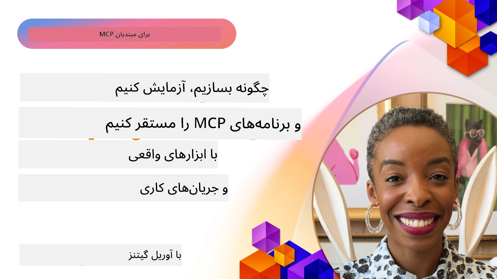

# پیاده‌سازی عملی

[](https://youtu.be/vCN9-mKBDfQ)

_(برای مشاهده ویدیوی این درس روی تصویر بالا کلیک کنید)_

پیاده‌سازی عملی جایی است که قدرت پروتکل زمینه مدل (MCP) ملموس می‌شود. در حالی که درک نظریه و معماری پشت MCP اهمیت دارد، ارزش واقعی وقتی آشکار می‌شود که این مفاهیم را برای ساخت، تست، و پیاده‌سازی راه‌حل‌هایی که مشکلات دنیای واقعی را حل می‌کنند به کار ببرید. این فصل پل شکاف بین دانش نظری و توسعه عملی است و شما را در فرآیند زنده کردن برنامه‌های مبتنی بر MCP راهنمایی می‌کند.

چه در حال توسعه دستیارهای هوشمند باشید، چه در حال ادغام هوش مصنوعی در روندهای کاری کسب‌وکار، یا ساخت ابزارهای سفارشی برای پردازش داده‌ها، MCP پایه‌ای انعطاف‌پذیر فراهم می‌کند. طراحی زبان‌مستقل آن و SDKهای رسمی برای زبان‌های برنامه‌نویسی محبوب آن را برای گروه وسیعی از توسعه‌دهندگان قابل دسترس ساخته است. با بهره‌گیری از این SDKها، می‌توانید به سرعت نمونه اولیه بسازید، تکرار کنید، و راه‌حل‌های خود را در پلتفرم‌ها و محیط‌های مختلف مقیاس دهید.

در بخش‌های بعدی، نمونه‌های عملی، کد نمونه و استراتژی‌های استقرار خواهید دید که نشان می‌دهند چگونه MCP را در C#، جاوا با Spring، تایپ‌اسکریپت، جاوااسکریپت و پایتون پیاده‌سازی کنید. همچنین یاد می‌گیرید چگونه سرورهای MCP خود را رفع اشکال و تست کنید، APIها را مدیریت نمایید و راه‌حل‌ها را با استفاده از Azure به فضای ابری منتقل کنید. این منابع عملی طراحی شده‌اند تا یادگیری شما را تسریع کنند و به شما کمک کنند با اطمینان برنامه‌های MCP قوی و آماده تولید بسازید.

## مرور کلی

این درس بر جنبه‌های عملی پیاده‌سازی MCP در چند زبان برنامه‌نویسی تمرکز دارد. ما بررسی خواهیم کرد چگونه از SDKهای MCP در C#، جاوا با Spring، تایپ‌اسکریپت، جاوااسکریپت و پایتون برای ساخت برنامه‌های مقاوم، رفع اشکال و تست سرورهای MCP و ایجاد منابع، پرامپت‌ها و ابزارهای قابل استفاده مجدد استفاده کنیم.

## اهداف یادگیری

در پایان این درس قادر خواهید بود:

- راه‌حل‌های MCP را با استفاده از SDKهای رسمی در زبان‌های برنامه‌نویسی مختلف پیاده‌سازی کنید
- به صورت سیستماتیک سرورهای MCP را رفع اشکال و تست کنید
- ویژگی‌های سرور (منابع، پرامپت‌ها و ابزارها) را ایجاد و استفاده کنید
- روندهای کاری مؤثر MCP را برای انجام وظایف پیچیده طراحی کنید
- پیاده‌سازی‌های MCP را برای عملکرد و قابلیت اطمینان بهینه کنید

## منابع SDK رسمی

پروتکل زمینه مدل SDKهای رسمی برای چند زبان ارائه می‌دهد (طبق [مشخصات MCP تاریخ ۲۰۲۵-۱۱-۲۵](https://spec.modelcontextprotocol.io/specification/2025-11-25/)):

- [SDK سی‌شارپ](https://github.com/modelcontextprotocol/csharp-sdk)
- [جاوا با Spring SDK](https://github.com/modelcontextprotocol/java-sdk) **توجه:** نیاز به وابستگی به [Project Reactor](https://projectreactor.io) دارد. (مشاهده [بحث شماره ۲۴۶](https://github.com/orgs/modelcontextprotocol/discussions/246).)
- [SDK تایپ‌اسکریپت](https://github.com/modelcontextprotocol/typescript-sdk)
- [SDK پایتون](https://github.com/modelcontextprotocol/python-sdk)
- [SDK کاتلین](https://github.com/modelcontextprotocol/kotlin-sdk)
- [SDK گو](https://github.com/modelcontextprotocol/go-sdk)

## کار با SDKهای MCP

این بخش نمونه‌های عملی پیاده‌سازی MCP را در چند زبان برنامه‌نویسی ارائه می‌دهد. کد نمونه را می‌توانید در دایرکتوری `samples` به تفکیک زبان بیابید.

### نمونه‌های موجود

مخزن شامل [نمونه‌های پیاده‌سازی](../../../04-PracticalImplementation/samples) در زبان‌های زیر است:

- [C#](./samples/csharp/README.md)
- [جاوا با Spring](./samples/java/containerapp/README.md)
- [تایپ‌اسکریپت](./samples/typescript/README.md)
- [جاوااسکریپت](./samples/javascript/README.md)
- [پایتون](./samples/python/README.md)

هر نمونه مفاهیم کلیدی و الگوهای پیاده‌سازی MCP را برای آن زبان و اکوسیستم خاص نشان می‌دهد.

### راهنماهای عملی

راهنماهای اضافی برای پیاده‌سازی عملی MCP:

- [صفحه‌بندی و مجموعه داده‌های بزرگ](./pagination/README.md) - مدیریت صفحه‌بندی مبتنی بر کُرسور برای ابزارها، منابع و مجموعه داده‌های بزرگ

## ویژگی‌های اصلی سرور

سرورهای MCP می‌توانند ترکیب‌های مختلفی از این ویژگی‌ها را پیاده‌سازی کنند:

### منابع

منابع زمینه و داده برای استفاده توسط کاربر یا مدل هوش مصنوعی فراهم می‌کنند:

- مخازن سند
- پایگاه‌های دانش
- منابع داده ساختاریافته
- سیستم فایل‌ها

### پرامپت‌ها

پرامپت‌ها پیام‌ها و روندهای کاری قالب‌بندی شده برای کاربران هستند:

- قالب‌های مکالمه پیش‌تعریف شده
- الگوهای تعامل هدایت شده
- ساختارهای تخصصی گفتگو

### ابزارها

ابزارها توابعی هستند که مدل هوش مصنوعی می‌تواند اجرا کند:

- ابزارهای پردازش داده
- ادغام‌های API خارجی
- قابلیت‌های محاسباتی
- عملکرد جستجو

## نمونه پیاده‌سازی: پیاده‌سازی C#

مخزن SDK رسمی C# چند نمونه پیاده‌سازی دارد که جنبه‌های مختلف MCP را نشان می‌دهند:

- **کلاینت MCP پایه**: نمونه ساده که نشان می‌دهد چگونه یک کلاینت MCP بسازید و ابزارها را فراخوانی کنید
- **سرور MCP پایه**: پیاده‌سازی حداقلی سرور با ثبت ابزار پایه
- **سرور MCP پیشرفته**: سرور کامل با ثبت ابزار، احراز هویت و مدیریت خطا
- **یکپارچه‌سازی ASP.NET**: نمونه‌هایی که یکپارچه‌سازی با ASP.NET Core را نشان می‌دهند
- **الگوهای پیاده‌سازی ابزار**: الگوهای مختلف برای پیاده‌سازی ابزار با سطوح مختلف پیچیدگی

SDK C# MCP در حالت پیش‌نمایش است و احتمال تغییر APIها وجود دارد. این وبلاگ مرتباً به‌روزرسانی می‌شود تا با تکامل SDK هماهنگ باشد.

### ویژگی‌های کلیدی

- [پکیج Nuget MCP سی‌شارپ ModelContextProtocol](https://www.nuget.org/packages/ModelContextProtocol)
- ساخت [اولین سرور MCP خود](https://devblogs.microsoft.com/dotnet/build-a-model-context-protocol-mcp-server-in-csharp/).

برای مشاهده نمونه‌های کامل پیاده‌سازی C# به [مخزن نمونه‌های SDK C# رسمی](https://github.com/modelcontextprotocol/csharp-sdk) مراجعه کنید.

## نمونه پیاده‌سازی: پیاده‌سازی جاوا با Spring

SDK جاوا با Spring گزینه‌های قدرتمند پیاده‌سازی MCP با ویژگی‌های سطح سازمانی ارائه می‌دهد.

### ویژگی‌های کلیدی

- یکپارچه‌سازی با فریم‌ورک Spring
- ایمنی نوع قوی
- پشتیبانی از برنامه‌نویسی واکنشی
- مدیریت جامع خطا

برای نمونه کامل پیاده‌سازی جاوا با Spring به [نمونه جاوا با Spring](samples/java/containerapp/README.md) در دایرکتوری نمونه‌ها مراجعه کنید.

## نمونه پیاده‌سازی: پیاده‌سازی جاوااسکریپت

SDK جاوااسکریپت رویکردی سبک و انعطاف‌پذیر برای پیاده‌سازی MCP ارائه می‌دهد.

### ویژگی‌های کلیدی

- پشتیبانی از Node.js و مرورگرها
- API مبتنی بر Promise
- یکپارچه‌سازی آسان با Express و فریم‌ورک‌های دیگر
- پشتیبانی WebSocket برای پخش زنده

برای نمونه کامل پیاده‌سازی جاوااسکریپت به [نمونه جاوااسکریپت](samples/javascript/README.md) در دایرکتوری نمونه‌ها مراجعه کنید.

## نمونه پیاده‌سازی: پیاده‌سازی پایتون

SDK پایتون رویکردی پایتونیک برای پیاده‌سازی MCP با ادغام‌های عالی چارچوب‌های یادگیری ماشین ارائه می‌دهد.

### ویژگی‌های کلیدی

- پشتیبانی async/await با asyncio
- یکپارچه‌سازی با FastAPI
- ثبت ابزار ساده
- ادغام بومی با کتابخانه‌های محبوب یادگیری ماشین

برای نمونه کامل پیاده‌سازی پایتون به [نمونه پایتون](samples/python/README.md) در دایرکتوری نمونه‌ها مراجعه کنید.

## مدیریت API

مدیریت API Azure پاسخ خوبی به این سوال است که چگونه می‌توانیم امنیت سرورهای MCP را تضمین کنیم. ایده این است که یک نمونه Azure API Management را جلوی سرور MCP خود قرار دهید و بگذارید ویژگی‌های مورد نیازتان مانند موارد زیر را مدیریت کند:

- محدودیت نرخ
- مدیریت توکن
- پایش
- تعادل بار
- امنیت

### نمونه Azure

نمونه‌ای از Azure که دقیقاً همین کار را انجام می‌دهد، یعنی [ایجاد یک سرور MCP و ایمن‌سازی آن با Azure API Management](https://github.com/Azure-Samples/remote-mcp-apim-functions-python).

تصویر زیر نحوه انجام جریان مجوز را نشان می‌دهد:


در تصویر بالا، موارد زیر اتفاق می‌افتد:

- احراز هویت/مجوز با استفاده از Microsoft Entra انجام می‌شود.
- Azure API Management به عنوان درگاه عمل می‌کند و با استفاده از سیاست‌ها ترافیک را هدایت و مدیریت می‌کند.
- Azure Monitor همه درخواست‌ها را برای تحلیل‌های بیشتر ثبت می‌کند.

#### جریان مجوز

اجازه دهید نگاهی دقیق‌تر به جریان مجوز بیاندازیم:


#### مشخصات مجوز MCP

اطلاعات بیشتر درباره [مشخصات مجوز MCP](https://spec.modelcontextprotocol.io/specification/2025-11-25/basic/authorization/)

## استقرار سرور راه دور MCP روی Azure

بیایید ببینیم آیا می‌توانیم نمونه‌ای که قبلاً اشاره کردیم را مستقر کنیم:

1. مخزن را کلون کنید

    ```bash
    git clone https://github.com/Azure-Samples/remote-mcp-apim-functions-python.git
    cd remote-mcp-apim-functions-python
    ```

1. ثبت ارائه‌دهنده منبع `Microsoft.App`.

   - اگر از Azure CLI استفاده می‌کنید، دستور `az provider register --namespace Microsoft.App --wait` را اجرا کنید.
   - اگر از Azure PowerShell استفاده می‌کنید، دستور `Register-AzResourceProvider -ProviderNamespace Microsoft.App` را اجرا کنید. سپس پس از مدتی با دستور `(Get-AzResourceProvider -ProviderNamespace Microsoft.App).RegistrationState` بررسی کنید که ثبت کامل شده است یا خیر.

1. این فرمان [azd](https://aka.ms/azd) را اجرا کنید تا سرویس مدیریت API، برنامه فانکشن (به همراه کد) و سایر منابع مورد نیاز Azure را فراهم کند

    ```shell
    azd up
    ```

    این دستور باید همه منابع ابری روی Azure را مستقر کند

### تست سرور با MCP Inspector

1. در یک **پنجره ترمینال جدید**، MCP Inspector را نصب و اجرا کنید

    ```shell
    npx @modelcontextprotocol/inspector
    ```

    باید رابطی مشابه تصویر زیر ببینید:

    

1. برای بارگذاری وب‌اپ MCP Inspector روی URL نمایش داده شده توسط برنامه (مثلاً [http://127.0.0.1:6274/#resources](http://127.0.0.1:6274/#resources)) کلید CTRL را نگه داشته و کلیک کنید
1. نوع انتقال را روی `SSE` تنظیم کنید
1. URL نقطه پایانی SSE مدیریت API در حال اجرا را که پس از اجرای `azd up` نمایش داده شده است تنظیم کرده و **اتصال** دهید:

    ```shell
    https://<apim-servicename-from-azd-output>.azure-api.net/mcp/sse
    ```

1. **فهرست ابزارها**. روی یک ابزار کلیک کرده و **اجرای ابزار** را انتخاب کنید.

اگر همه مراحل به درستی انجام شده باشند، اکنون باید به سرور MCP متصل شده و بتوانید یک ابزار را فراخوانی کنید.

## سرورهای MCP برای Azure

[Remote-mcp-functions](https://github.com/Azure-Samples/remote-mcp-functions-dotnet): این مجموعه مخزن قالب‌های شروع سریع برای ساخت و استقرار سرورهای MCP راه دور سفارشی با استفاده از Azure Functions با پایتون، C# .NET یا Node/TypeScript است.

نمونه‌ها راه‌حلی کامل ارائه می‌دهند که به توسعه‌دهندگان اجازه می‌دهد:

- ساخت و اجرای محلی: توسعه و رفع اشکال سرور MCP روی ماشین محلی
- استقرار روی Azure: استقرار آسان به فضای ابری با یک فرمان ساده azd up
- اتصال از سمت کلاینت‌ها: اتصال به سرور MCP از کلاینت‌های مختلف از جمله حالت عامل Copilot در VS Code و ابزار MCP Inspector

### ویژگی‌های کلیدی

- امنیت از ابتدا: سرور MCP به‌صورت امن با کلیدها و HTTPS محافظت شده است
- گزینه‌های احراز هویت: پشتیبانی از OAuth با استفاده از احراز هویت داخلی و/یا مدیریت API
- جداسازی شبکه: اجازه جداسازی شبکه با استفاده از شبکه‌های مجازی Azure (VNET)
- معماری بدون سرور: استفاده از Azure Functions برای اجرای مقیاس‌پذیر و رویداد‌محور
- توسعه محلی: پشتیبانی جامع برای توسعه و رفع اشکال محلی
- استقرار ساده: فرآیند ساده شده استقرار روی Azure

مخزن شامل همه فایل‌های پیکربندی لازم، کد منبع، و تعاریف زیرساختی برای شروع سریع با پیاده‌سازی سرور MCP آماده تولید است.

- [Azure Remote MCP Functions Python](https://github.com/Azure-Samples/remote-mcp-functions-python) - نمونه پیاده‌سازی MCP با استفاده از Azure Functions و پایتون

- [Azure Remote MCP Functions .NET](https://github.com/Azure-Samples/remote-mcp-functions-dotnet) - نمونه پیاده‌سازی MCP با استفاده از Azure Functions و C# .NET

- [Azure Remote MCP Functions Node/Typescript](https://github.com/Azure-Samples/remote-mcp-functions-typescript) - نمونه پیاده‌سازی MCP با استفاده از Azure Functions و Node/TypeScript.

## نکات کلیدی

- SDKهای MCP ابزارهای خاص زبان برای پیاده‌سازی راه‌حل‌های مقاوم MCP فراهم می‌کنند
- فرآیند رفع اشکال و تست برای برنامه‌های قابل اعتماد MCP حیاتی است
- قالب‌های پرامپت قابل استفاده مجدد تعاملات سازگار AI را امکان‌پذیر می‌سازند
- روندهای کاری خوب طراحی‌شده می‌توانند وظایف پیچیده را با استفاده از چند ابزار هماهنگ کنند
- پیاده‌سازی راه‌حل‌های MCP نیازمند توجه به امنیت، عملکرد و مدیریت خطا است

## تمرین

یک روند کاری عملی MCP طراحی کنید که به یک مشکل دنیای واقعی در حوزه شما بپردازد:

1. ۳ تا ۴ ابزار که برای حل این مشکل مفید باشند را شناسایی کنید
2. نموداری از روند کاری ایجاد کنید که نشان دهد این ابزارها چگونه با هم تعامل دارند
3. نسخه پایه‌ای از یکی از ابزارها را با زبان مورد علاقه خود پیاده‌سازی کنید
4. قالب پرامپتی بسازید که به مدل کمک کند ابزار شما را به طور مؤثر استفاده کند

## منابع اضافی

---

## ادامه مطلب

بعدی: [موضوعات پیشرفته](../05-AdvancedTopics/README.md)

---

<!-- CO-OP TRANSLATOR DISCLAIMER START -->
**توضیح تکمیلی**:  
این سند با استفاده از سرویس ترجمه ماشینی [Co-op Translator](https://github.com/Azure/co-op-translator) ترجمه شده است. در حالی که ما در تلاش برای دقت هستیم، لطفاً توجه داشته باشید که ترجمه‌های خودکار ممکن است دارای خطا یا نادرستی‌هایی باشند. سند اصلی به زبان مبدأ باید به عنوان مرجع معتبر در نظر گرفته شود. برای اطلاعات حیاتی، توصیه می‌شود از ترجمه حرفه‌ای انسانی استفاده شود. ما مسئول هیچ گونه سوء تفاهم یا تفسیر نادرستی که از استفاده این ترجمه به وجود آید، نیستیم.
<!-- CO-OP TRANSLATOR DISCLAIMER END -->