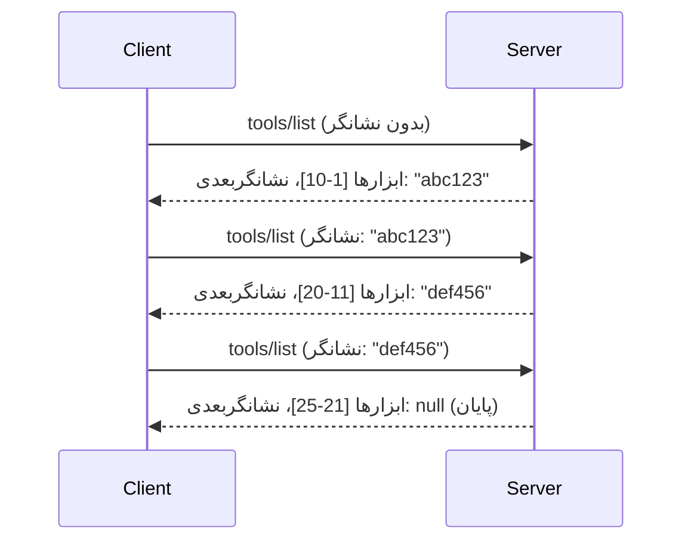

# صفحه‌بندی و مجموعه نتایج بزرگ در MCP

وقتی سرور MCP شما داده‌های بزرگی را مدیریت می‌کند - چه فهرست هزاران فایل، رکوردهای پایگاه داده یا نتایج جستجو - باید از صفحه‌بندی برای مدیریت بهینه حافظه و ارائه تجربه کاربری پاسخگو استفاده کنید. این راهنما نحوه پیاده‌سازی و استفاده از صفحه‌بندی در MCP را پوشش می‌دهد.

## اهمیت صفحه‌بندی

بدون صفحه‌بندی، پاسخ‌های بزرگ می‌توانند موجب موارد زیر شوند:

- **تمام شدن حافظه** - بارگذاری میلیون‌ها رکورد به صورت همزمان
- **زمان پاسخ کند** - کاربران منتظر می‌مانند تا تمامی داده‌ها بارگذاری شود
- **خطاهای زمان‌تمام** - درخواست‌ها از محدودیت زمان‌تمام عبور می‌کنند
- **عملکرد ضعیف هوش مصنوعی** - مدل‌های زبان بزرگ (LLMها) با متن‌های عظیم دچار مشکل می‌شوند

MCP از **صفحه‌بندی مبتنی بر نشانگر (cursor-based pagination)** برای پیمایش قابل اعتماد و یکپارچه در مجموعه نتایج استفاده می‌کند.

---

## نحوه کار صفحه‌بندی در MCP

### مفهوم نشانگر (Cursor)

یک **نشانگر** رشته‌ای مبهم است که موقعیت شما را در مجموعه نتایج مشخص می‌کند. آن را مانند نشانک در یک کتاب بلند تصور کنید.


### صفحه‌بندی در متدهای MCP

این متدهای MCP از صفحه‌بندی پشتیبانی می‌کنند:

| متد | بازگرداندن | پشتیبانی نشانگر |
|--------|---------|----------------|
| `tools/list` | تعاریف ابزارها | ✅ |
| `resources/list` | تعاریف منابع | ✅ |
| `prompts/list` | تعاریف پرسش‌ها | ✅ |
| `resources/templates/list` | قالب‌های منابع | ✅ |

---

## پیاده‌سازی سرور

### پایتون (FastMCP)

```python
from mcp.server import Server
from mcp.types import Tool, ListToolsResult
import math

app = Server("paginated-server")

# مجموعه داده بزرگ شبیه‌سازی شده
ALL_TOOLS = [
    Tool(name=f"tool_{i}", description=f"Tool number {i}", inputSchema={})
    for i in range(100)
]

PAGE_SIZE = 10

@app.list_tools()
async def list_tools(cursor: str | None = None) -> ListToolsResult:
    """List tools with pagination support."""
    
    # رمزگشایی مکان‌نما برای بدست آوردن شماره شروع
    start_index = 0
    if cursor:
        try:
            start_index = int(cursor)
        except ValueError:
            start_index = 0
    
    # دریافت صفحه‌ای از نتایج
    end_index = min(start_index + PAGE_SIZE, len(ALL_TOOLS))
    page_tools = ALL_TOOLS[start_index:end_index]
    
    # محاسبه مکان‌نمای بعدی
    next_cursor = None
    if end_index < len(ALL_TOOLS):
        next_cursor = str(end_index)
    
    return ListToolsResult(
        tools=page_tools,
        nextCursor=next_cursor
    )
```

### تایپ‌اسکریپت

```typescript
import { Server } from "@modelcontextprotocol/sdk/server/index.js";
import { ListToolsResultSchema } from "@modelcontextprotocol/sdk/types.js";

const server = new Server({
  name: "paginated-server",
  version: "1.0.0"
});

// مجموعه داده شبیه‌سازی شده بزرگ
const ALL_TOOLS = Array.from({ length: 100 }, (_, i) => ({
  name: `tool_${i}`,
  description: `Tool number ${i}`,
  inputSchema: { type: "object", properties: {} }
}));

const PAGE_SIZE = 10;

server.setRequestHandler(ListToolsResultSchema, async (request) => {
  // رمزگشایی مکان‌نما
  let startIndex = 0;
  if (request.params?.cursor) {
    startIndex = parseInt(request.params.cursor, 10) || 0;
  }
  
  // دریافت صفحه‌ای از نتایج
  const endIndex = Math.min(startIndex + PAGE_SIZE, ALL_TOOLS.length);
  const pageTools = ALL_TOOLS.slice(startIndex, endIndex);
  
  // محاسبه مکان‌نمای بعدی
  const nextCursor = endIndex < ALL_TOOLS.length ? String(endIndex) : undefined;
  
  return {
    tools: pageTools,
    nextCursor
  };
});
```

### جاوا (Spring MCP)

```java
@Service
public class PaginatedToolService {
    
    private static final int PAGE_SIZE = 10;
    private final List<Tool> allTools;
    
    public PaginatedToolService() {
        // مقداردهی اولیه مجموعه داده بزرگ
        this.allTools = IntStream.range(0, 100)
            .mapToObj(i -> new Tool("tool_" + i, "Tool number " + i, Map.of()))
            .collect(Collectors.toList());
    }
    
    @McpMethod("tools/list")
    public ListToolsResult listTools(@Param("cursor") String cursor) {
        // رمزگشایی مکان‌نمای اشاره‌گر
        int startIndex = 0;
        if (cursor != null && !cursor.isEmpty()) {
            try {
                startIndex = Integer.parseInt(cursor);
            } catch (NumberFormatException e) {
                startIndex = 0;
            }
        }
        
        // دریافت صفحه‌ای از نتایج
        int endIndex = Math.min(startIndex + PAGE_SIZE, allTools.size());
        List<Tool> pageTools = allTools.subList(startIndex, endIndex);
        
        // محاسبه مکان‌نمای اشاره‌گر بعدی
        String nextCursor = endIndex < allTools.size() ? String.valueOf(endIndex) : null;
        
        return new ListToolsResult(pageTools, nextCursor);
    }
}
```

---

## پیاده‌سازی کلاینت

### کلاینت پایتون

```python
from mcp import ClientSession

async def get_all_tools(session: ClientSession) -> list:
    """Fetch all tools using pagination."""
    all_tools = []
    cursor = None
    
    while True:
        result = await session.list_tools(cursor=cursor)
        all_tools.extend(result.tools)
        
        if result.nextCursor is None:
            break
        cursor = result.nextCursor
    
    return all_tools

# استفاده
async with client_session as session:
    tools = await get_all_tools(session)
    print(f"Found {len(tools)} tools")
```

### کلاینت تایپ‌اسکریپت

```typescript
import { Client } from "@modelcontextprotocol/sdk/client/index.js";

async function getAllTools(client: Client): Promise<Tool[]> {
  const allTools: Tool[] = [];
  let cursor: string | undefined = undefined;
  
  do {
    const result = await client.listTools({ cursor });
    allTools.push(...result.tools);
    cursor = result.nextCursor;
  } while (cursor);
  
  return allTools;
}

// استفاده
const tools = await getAllTools(client);
console.log(`Found ${tools.length} tools`);
```

### الگوی بارگذاری تنبل

برای داده‌های بسیار بزرگ، صفحات را به درخواست بارگذاری کنید:

```python
class PaginatedToolIterator:
    """Lazily iterate through paginated tools."""
    
    def __init__(self, session: ClientSession):
        self.session = session
        self.cursor = None
        self.buffer = []
        self.exhausted = False
    
    async def __anext__(self):
        # اگر موجود است از بافر بازگردان
        if self.buffer:
            return self.buffer.pop(0)
        
        # بررسی کنیم آیا تمام صفحات را استفاده کرده‌ایم
        if self.exhausted:
            raise StopAsyncIteration
        
        # صفحه بعدی را واکشی کن
        result = await self.session.list_tools(cursor=self.cursor)
        self.buffer = list(result.tools)
        self.cursor = result.nextCursor
        
        if self.cursor is None:
            self.exhausted = True
        
        if not self.buffer:
            raise StopAsyncIteration
        
        return self.buffer.pop(0)
    
    def __aiter__(self):
        return self

# استفاده - بهینه در حافظه برای مجموعه داده‌های بزرگ
async for tool in PaginatedToolIterator(session):
    process_tool(tool)
```

---

## صفحه‌بندی برای منابع

منابع اغلب به صفحه‌بندی برای پوشه‌ها یا داده‌های بزرگ نیاز دارند:

```python
from mcp.server import Server
from mcp.types import Resource, ListResourcesResult
import os

app = Server("file-server")

@app.list_resources()
async def list_resources(cursor: str | None = None) -> ListResourcesResult:
    """List files in directory with pagination."""
    
    directory = "/data/files"
    all_files = sorted(os.listdir(directory))
    
    # مکان‌نمای رمزگشایی (شاخص فایل)
    start_index = int(cursor) if cursor else 0
    page_size = 20
    end_index = min(start_index + page_size, len(all_files))
    
    # ایجاد فهرست منابع برای این صفحه
    resources = []
    for filename in all_files[start_index:end_index]:
        filepath = os.path.join(directory, filename)
        resources.append(Resource(
            uri=f"file://{filepath}",
            name=filename,
            mimeType="application/octet-stream"
        ))
    
    # محاسبه مکان‌نمای بعدی
    next_cursor = str(end_index) if end_index < len(all_files) else None
    
    return ListResourcesResult(
        resources=resources,
        nextCursor=next_cursor
    )
```

---

## استراتژی‌های طراحی نشانگر

### استراتژی ۱: مبتنی بر اندیس (ساده)

```python
# مکان‌نما فقط اندیس است
cursor = "50"  # شروع از آیتم ۵۰
```

**مزایا:** ساده، بدون حالت (stateless)  
**معایب:** نتایج ممکن است در صورت اضافه/حذف شدن موارد تغییر کنند

### استراتژی ۲: مبتنی بر شناسه (پایدار)

```python
# مکان‌نما آخرین شناسه مشاهده شده است
cursor = "item_abc123"  # شروع پس از این مورد
```

**مزایا:** پایدار حتی در صورت تغییر موارد  
**معایب:** نیاز به شناسه‌های مرتب شده دارد

### استراتژی ۳: حالت کدگذاری شده (پیچیده)

```python
import base64
import json

def encode_cursor(state: dict) -> str:
    return base64.b64encode(json.dumps(state).encode()).decode()

def decode_cursor(cursor: str) -> dict:
    return json.loads(base64.b64decode(cursor).decode())

# کرسر شامل چندین فیلد وضعیت است
cursor = encode_cursor({
    "offset": 50,
    "filter": "active",
    "sort": "name"
})
```

**مزایا:** امکان کدگذاری حالت پیچیده وجود دارد  
**معایب:** پیچیده‌تر، رشته‌های نشانگر بزرگ‌تر

---

## بهترین شیوه‌ها

### ۱. انتخاب اندازه صفحه مناسب

```python
# اندازه داده را در نظر بگیرید
PAGE_SIZE_SMALL_ITEMS = 100   # متادیتای ساده
PAGE_SIZE_MEDIUM_ITEMS = 20   # اشیاء غنی‌تر
PAGE_SIZE_LARGE_ITEMS = 5     # محتوای پیچیده
```

### ۲. مدیریت نشانگرهای نامعتبر به طور مناسب

```python
@app.list_tools()
async def list_tools(cursor: str | None = None) -> ListToolsResult:
    try:
        start_index = int(cursor) if cursor else 0
        if start_index < 0 or start_index >= len(ALL_TOOLS):
            start_index = 0  # بازنشانی به ابتدا
    except (ValueError, TypeError):
        start_index = 0  # مکان‌نمای نامعتبر، شروع دوباره
    # ...
```

### ۳. گنجاندن شمارش کل (اختیاری)

```python
return ListToolsResult(
    tools=page_tools,
    nextCursor=next_cursor,
    # برخی پیاده‌سازی‌ها شامل مجموع برای پیشرفت UI هستند
    _meta={"total": len(ALL_TOOLS)}
)
```

### ۴. آزمایش موارد مرزی

```python
async def test_pagination():
    # مجموعه نتایج خالی
    result = await session.list_tools()
    assert result.tools == []
    assert result.nextCursor is None
    
    # صفحه واحد
    result = await session.list_tools()
    assert len(result.tools) <= PAGE_SIZE
    
    # نشانگر نامعتبر
    result = await session.list_tools(cursor="invalid")
    assert result.tools  # باید صفحه اول را برگرداند
```

---

## مشکلات رایج

### ❌ بازگردانی همه نتایج و سپس صفحه‌بندی در سمت کلاینت

```python
# بد: همه چیز را در حافظه بارگذاری می‌کند
@app.list_tools()
async def list_tools() -> ListToolsResult:
    all_tools = load_all_tools()  # یک میلیون ابزار!
    return ListToolsResult(tools=all_tools)
```

### ✅ صفحه‌بندی در منبع داده

```python
# خوب: فقط آنچه لازم است را بارگذاری می‌کند
@app.list_tools()
async def list_tools(cursor: str | None = None) -> ListToolsResult:
    offset = int(cursor) if cursor else 0
    tools = await db.query_tools(offset=offset, limit=PAGE_SIZE)
    return ListToolsResult(tools=tools, nextCursor=...)
```

---

## گام بعدی

- [ماژول ۵.۱۴ - مهندسی زمینه](../../05-AdvancedTopics/mcp-contextengineering/README.md)
- [ماژول ۸ - بهترین شیوه‌ها](../../08-BestPractices/README.md)
- [۳.۸ - تست سرور MCP شما](../../03-GettingStarted/08-testing/README.md)

---

## منابع اضافی

- [مشخصات MCP - صفحه‌بندی](https://spec.modelcontextprotocol.io/specification/2025-11-25/)
- [توضیح صفحه‌بندی مبتنی بر نشانگر](https://slack.engineering/evolving-api-pagination-at-slack/)
- [تست‌های صفحه‌بندی SDK پایتون](https://github.com/modelcontextprotocol/python-sdk/blob/main/tests/client/test_list_methods_cursor.py)

---

<!-- CO-OP TRANSLATOR DISCLAIMER START -->
**سلب مسئولیت**:  
این سند با استفاده از سرویس ترجمه ماشینی [Co-op Translator](https://github.com/Azure/co-op-translator) ترجمه شده است. در حالی که ما برای دقت تلاش می‌کنیم، لطفاً به این نکته توجه داشته باشید که ترجمه‌های خودکار ممکن است شامل خطاها یا نادرستی‌هایی باشند. سند اصلی به زبان مادری آن باید به عنوان منبع معتبر در نظر گرفته شود. برای اطلاعات حیاتی، استفاده از ترجمه حرفه‌ای انسانی توصیه می‌شود. ما مسئولیتی در قبال هرگونه سوء تفاهم یا تفسیر نادرست ناشی از استفاده این ترجمه نداریم.
<!-- CO-OP TRANSLATOR DISCLAIMER END -->