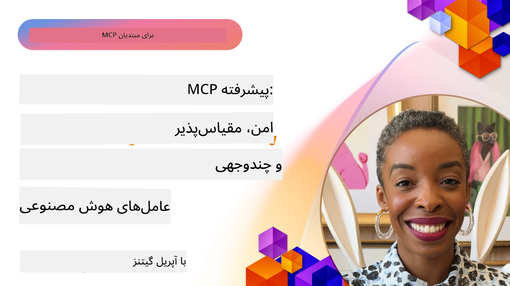

# موضوعات پیشرفته در MCP

_(برای مشاهده ویدیو این درس تصویر بالا را کلیک کنید)_

این فصل مجموعه‌ای از موضوعات پیشرفته در پیاده‌سازی پروتکل زمینه مدل (MCP) را پوشش می‌دهد، از جمله ادغام چندرسانه‌ای، مقیاس‌پذیری، بهترین روش‌های امنیتی و یکپارچه‌سازی سازمانی. این موضوعات برای ساخت برنامه‌های MCP مستحکم و آماده تولید که بتوانند نیازهای سیستم‌های هوش مصنوعی مدرن را برآورده کنند، حیاتی هستند.

## مرور کلی

این درس مفاهیم پیشرفته پیاده‌سازی پروتکل زمینه مدل را بررسی می‌کند، با تمرکز بر ادغام چندرسانه‌ای، مقیاس‌پذیری، بهترین روش‌های امنیتی و یکپارچه‌سازی سازمانی. این موضوعات برای ساخت برنامه‌های MCP با کیفیت تولید که می‌توانند نیازهای پیچیده در محیط‌های سازمانی را مدیریت کنند، ضروری است.

## اهداف یادگیری

تا پایان این درس، شما قادر خواهید بود:

- قابلیت‌های چندرسانه‌ای را در چارچوب‌های MCP پیاده‌سازی کنید
- معماری‌های مقیاس‌پذیر MCP را برای سناریوهای با تقاضای بالا طراحی کنید
- بهترین روش‌های امنیتی منطبق با اصول امنیتی MCP را به کار ببرید
- MCP را با سیستم‌ها و چارچوب‌های هوش مصنوعی سازمانی یکپارچه کنید
- عملکرد و قابلیت اطمینان در محیط‌های تولید را بهینه کنید

## دروس و پروژه‌های نمونه

| لینک | عنوان | توضیحات |
|------|-------|-------------|
| [5.1 ادغام با Azure](./mcp-integration/README.md) | ادغام با Azure | بیاموزید چگونه MCP Server خود را در Azure ادغام کنید |
| [5.2 نمونه چندرسانه‌ای](./mcp-multi-modality/README.md) | نمونه‌های چندرسانه‌ای MCP | نمونه‌هایی برای صدا، تصویر و پاسخ چندرسانه‌ای |
| [5.3 نمونه MCP OAuth2](../../../05-AdvancedTopics/mcp-oauth2-demo) | دموی MCP OAuth2 | برنامه حداقلی Spring Boot که OAuth2 را با MCP به عنوان سرور مجوز و منابع نشان می‌دهد. صدور توکن امن، نقاط پایانی محافظت‌شده، استقرار در Azure Container Apps و یکپارچه‌سازی مدیریت API را نمایش می‌دهد. |
| [5.4 زمینه‌های ریشه‌ای](./mcp-root-contexts/README.md) | زمینه‌های ریشه‌ای | اطلاعات بیشتر درباره زمینه ریشه و نحوه پیاده‌سازی آن‌ها |
| [5.5 مسیریابی](./mcp-routing/README.md) | مسیریابی | آموزش انواع مختلف مسیریابی |
| [5.6 نمونه‌گیری](./mcp-sampling/README.md) | نمونه‌گیری | یادگیری کار با نمونه‌گیری |
| [5.7 مقیاس‌بندی](./mcp-scaling/README.md) | مقیاس‌بندی | یادگیری درباره مقیاس‌بندی |
| [5.8 امنیت](./mcp-security/README.md) | امنیت | ایمن‌سازی سرور MCP خود |
| [5.9 نمونه جستجوی وب](./web-search-mcp/README.md) | جستجوی وب MCP | سرور و کلاینت MCP پایتون با ادغام SerpAPI برای جستجوی وب، اخبار، محصولات و پرسش و پاسخ در زمان واقعی. نمونه هماهنگی چندابزاره، ادغام API خارجی و مدیریت خطای قوی را نشان می‌دهد. |
| [5.10 پخش جریانی زمان واقعی](./mcp-realtimestreaming/README.md) | پخش جریانی | پخش داده در زمان واقعی در دنیای داده‌محور امروز ضروری شده است، جایی که کسب‌وکارها و برنامه‌ها نیاز فوری به اطلاعات برای اتخاذ تصمیمات به موقع دارند. |
| [5.11 جستجوی وب زمان واقعی](./mcp-realtimesearch/README.md) | جستجوی وب | جستجوی وب زمان واقعی - چگونه MCP جستجوی وب زمان واقعی را با ارائه رویکرد استاندارد برای مدیریت زمینه در مدل‌های هوش مصنوعی، موتورهای جستجو و برنامه‌ها تغییر می‌دهد. |
| [5.12 احراز هویت Entra ID برای سرورهای MCP](./mcp-security-entra/README.md) | احراز هویت Entra ID | مایکروسافت Entra ID راهکار ابری قوی مدیریت هویت و دسترسی ارائه می‌دهد که کمک می‌کند فقط کاربران و برنامه‌های مجاز بتوانند با سرور MCP شما تعامل داشته باشند. |
| [5.13 ادغام عامل Azure AI Foundry](./mcp-foundry-agent-integration/README.md) | ادغام Azure AI Foundry | بیاموزید چگونه سرورهای پروتکل زمینه مدل را با عوامل Azure AI Foundry ادغام کنید، امکان هماهنگی ابزار قدرتمند و قابلیت‌های هوش مصنوعی سازمانی را با اتصالات استاندارد به منابع داده خارجی فراهم می‌کند. |
| [5.14 مهندسی زمینه](./mcp-contextengineering/README.md) | مهندسی زمینه | فرصت‌های آینده در تکنیک‌های مهندسی زمینه برای سرورهای MCP، شامل بهینه‌سازی زمینه، مدیریت پویا و استراتژی‌هایی برای مهندسی درخواست‌های مؤثر در چارچوب MCP. |
| [5.15 انتقال سفارشی MCP](./mcp-transport/README.md) | انتقال سفارشی | یاد بگیرید چگونه مکانیزم‌های انتقال سفارشی برای سناریوهای ارتباطی تخصصی MCP پیاده‌سازی کنید. |
| [5.16 بررسی عمیق ویژگی‌های پروتکل](./mcp-protocol-features/README.md) | ویژگی‌های پروتکل | تسلط بر ویژگی‌های پیشرفته پروتکل شامل اعلان پیشرفت، لغو درخواست، قالب‌های منابع و الگوهای مدیریت خطا. |

> **جدید در مشخصات MCP 2025-11-25**: مشخصات اکنون شامل پشتیبانی آزمایشی برای **وظایف** (عملیات بلندمدت با پیگیری پیشرفت)، **حاشیه‌نویسی‌های ابزار** (متادیتا درباره رفتار ابزار برای ایمنی)، **درخواست حالت URL** (درخواست محتوای خاص URL از کلاینت‌ها) و **روت‌های پیشرفته** (برای مدیریت زمینه فضای کاری) است. برای جزئیات کامل به [لیست تغییرات مشخصات MCP](https://spec.modelcontextprotocol.io/) مراجعه کنید.

## مراجع اضافی

برای دریافت جدیدترین اطلاعات درباره موضوعات پیشرفته MCP، مراجعه کنید به:
- [مستندات MCP](https://modelcontextprotocol.io/)
- [مشخصات MCP (2025-11-25)](https://spec.modelcontextprotocol.io/specification/2025-11-25/)
- [مخزن گیت‌هاب](https://github.com/modelcontextprotocol)
- [OWASP MCP Top 10](https://microsoft.github.io/mcp-azure-security-guide/mcp/) - خطرات امنیتی و راهکارها
- [کارگاه امنیتی MCP Summit (Sherpa)](https://azure-samples.github.io/sherpa/) - آموزش امنیت عملی

## نکات کلیدی

- پیاده‌سازی‌های چندرسانه‌ای MCP قابلیت‌های هوش مصنوعی را فراتر از پردازش متن گسترش می‌دهند 
- مقیاس‌پذیری برای استقرارهای سازمانی بسیار مهم است و می‌توان آن را از طریق مقیاس‌بندی افقی و عمودی فراهم کرد
- اقدامات امنیتی جامع داده‌ها را محافظت کرده و کنترل دسترسی صحیح را تضمین می‌کنند
- ادغام سازمانی با پلتفرم‌هایی مانند Azure OpenAI و Microsoft AI Foundry قابلیت‌های MCP را افزایش می‌دهد
- پیاده‌سازی‌های پیشرفته MCP از معماری‌های بهینه‌شده و مدیریت دقیق منابع بهره‌مند می‌شوند

## تمرین

یک پیاده‌سازی MCP درجه سازمانی برای یک مورد استفاده خاص طراحی کنید:

1. نیازمندی‌های چندرسانه‌ای برای مورد استفاده خود را شناسایی کنید
2. کنترل‌های امنیتی لازم برای محافظت از داده‌های حساس را مشخص کنید
3. معماری مقیاس‌پذیری که بتواند بارهای متغیر را مدیریت کند طراحی کنید
4. نقاط یکپارچه‌سازی با سیستم‌های هوش مصنوعی سازمانی را برنامه‌ریزی کنید
5. گلوگاه‌های بالقوه عملکردی و استراتژی‌های کاهش آن‌ها را مستندسازی کنید

## منابع اضافی

- [مستندات Azure OpenAI](https://learn.microsoft.com/en-us/azure/ai-services/openai/)
- [مستندات Microsoft AI Foundry](https://learn.microsoft.com/en-us/ai-services/)

---

## گام بعدی

درس‌های این ماژول را با شروع از: [5.1 ادغام MCP](./mcp-integration/README.md) کاوش کنید

پس از اتمام این ماژول، به ادامه دهید به: [ماژول 6: مشارکت‌های جامعه](../06-CommunityContributions/README.md)

---

<!-- CO-OP TRANSLATOR DISCLAIMER START -->
**سلب مسئولیت**:  
این سند با استفاده از سرویس ترجمه هوش مصنوعی [Co-op Translator](https://github.com/Azure/co-op-translator) ترجمه شده است. در حالی که ما برای دقت تلاش می‌کنیم، لطفاً توجه داشته باشید که ترجمه‌های خودکار ممکن است شامل خطاها یا نادقتی‌هایی باشند. سند اصلی به زبان مادری خود، به عنوان منبع معتبر در نظر گرفته شود. برای اطلاعات حیاتی، ترجمه حرفه‌ای انسانی توصیه می‌شود. ما مسئول هیچ گونه سوء‌تفاهم یا برداشت نادرستی که از استفاده از این ترجمه ناشی شود، نیستیم.
<!-- CO-OP TRANSLATOR DISCLAIMER END -->